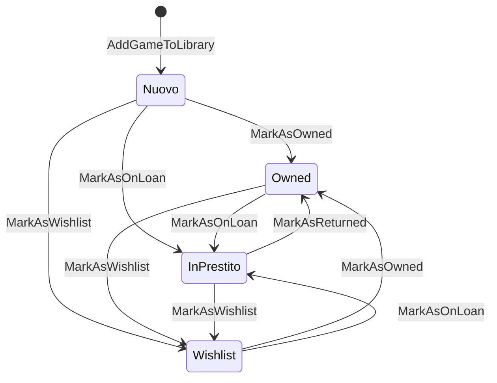

# Library Feature Improvements — Implementation Plan

> **For agentic workers:** REQUIRED SUB-SKILL: Use `superpowers:subagent-driven-development` (recommended) or `superpowers:executing-plans` to implement this plan task-by-task. Steps use checkbox (`- [ ]`) syntax for tracking.

**Goal:** Implementare 6 aree di miglioramento critico alla feature `/library`: spec/docs, fix atomicità ViewCount, loan flow UI completo, wishlist pubblica, UI downgrade tier, decomposizione `PersonalLibraryPage.tsx`, e test E2E migrazione PrivateGame.

**Architecture:**
- Backend: DDD/CQRS esistente — Domain → Command/Query → Handler → Endpoint (via MediatR). Zero direct service injection negli endpoint.
- Frontend: Next.js 15 App Router; nuovi componenti in `apps/web/src/components/library/`; nuovi hook in `apps/web/src/hooks/queries/`
- Fix atomici: `ExecuteUpdateAsync` di EF Core 9 per ViewCount; evita il pattern load-modify-save
- Refactoring: split verticale di `PersonalLibraryPage.tsx` (65 KB) in 5 componenti indipendenti

**Tech Stack:** .NET 9 · EF Core 9 · MediatR · FluentValidation · PostgreSQL 16 | Next.js 15 · React 19 · React Query · Zustand · shadcn/ui · Tailwind 4 | xUnit · Testcontainers | Playwright

---

## PHASE 0 — SPEC DOCUMENTATION (Tasks 1–3)

### Task 1: GameState Transition Diagram

**Files:**
- Create: `docs/bounded-contexts/user-library-game-state.md`

- [ ] **Step 1: Crea il documento con diagramma Mermaid**

```markdown
# UserLibrary — GameState Transition Diagram

## Stati

| Valore | Descrizione |
|--------|-------------|
| `Nuovo` | Aggiunto alla libreria, non ancora classificato |
| `Owned` | Posseduto dall'utente |
| `InPrestito` | Prestato a qualcuno (`StateNotes` = nome/contatto debitore) |
| `Wishlist` | Desiderato, non posseduto |

## Diagramma transizioni valide



## Regole

- `StateNotes` (nullable string) contiene le info sul debitore quando lo stato è `InPrestito`
- `ChangedAt` (nullable DateTime) traccia l'ultimo cambio di stato
- Le transizioni non valide lanciano `ConflictException`
- `DeclareOwnership` è ortogonale allo stato: può essere chiamata in qualsiasi stato
```

- [ ] **Step 2: Verifica che il file esista**

```bash
ls docs/bounded-contexts/user-library-game-state.md
```

- [ ] **Step 3: Commit**

```bash
git add docs/bounded-contexts/user-library-game-state.md
git commit -m "docs(user-library): add GameState transition diagram"
```

---

### Task 2: Share Link Sanitization Matrix

**Files:**
- Create: `docs/bounded-contexts/user-library-share-link-sanitization.md`

- [ ] **Step 1: Crea il documento**

```markdown
# UserLibrary — Share Link Sanitization Rules

Quando un utente condivide la propria libreria via `LibraryShareLink`, il response di
`GetSharedLibraryQuery` viene sanitizzato. Questa tabella definisce cosa viene incluso.

## Matrice visibilità

| Campo | Sempre incluso | Solo se `IncludeNotes=true` | Mai incluso |
|-------|---------------|----------------------------|-------------|
| Titolo gioco | ✅ | | |
| Publisher, Anno, Categorie, Meccaniche | ✅ | | |
| Copertina, Thumbnail | ✅ | | |
| Stato (Owned/InPrestito/Wishlist) | ✅ | | |
| Rating medio (pubblico) | ✅ | | |
| `TimesPlayed`, `LastPlayedAt`, `WinRate` | ✅ | | |
| Etichette custom (nomi) | ✅ | | |
| Note personali (`LibraryNotes`) | | ✅ | |
| Info debitore (`StateNotes` di InPrestito) | | | ❌ |
| `TargetPrice` (wishlist) | | | ❌ |
| Config agente AI (`AgentConfiguration`) | | | ❌ |
| PDF privati (`CustomPdfMetadata`) | | | ❌ |
| ID interni (UserId, EntryId) | | | ❌ |

## Wishlist pubblica

La wishlist è inclusa nel share link con questi campi:
- Titolo gioco, cover, priority (High/Medium/Low)
- **TargetPrice escluso** (informazione finanziaria privata)

## Profilo pubblico

La wishlist con `WishlistVisibility.Public` è visibile anche nel profilo pubblico utente
(distinto dal share link). Il profilo pubblico NON richiede il token.

## Validazione lato backend

`GetSharedLibraryQueryHandler` DEVE verificare prima di restituire dati:
1. Token esiste nel DB
2. `RevokedAt == null`
3. `ExpiresAt == null || ExpiresAt > UtcNow`
4. Incremento `ViewCount` atomico (vedi OPS-002)
```

- [ ] **Step 2: Commit**

```bash
git add docs/bounded-contexts/user-library-share-link-sanitization.md
git commit -m "docs(user-library): add share link sanitization matrix"
```

---

### Task 3: Migration Data Flow Confirmation

**Files:**
- Create: `docs/bounded-contexts/user-library-private-game-migration.md`

- [ ] **Step 1: Crea il documento**

```markdown
# UserLibrary — PrivateGame Migration Data Flow

## Flusso completo

```
PrivateGame (id=AAA)
    ↓ ProposePrivateGameCommand
GameSuggestion (status=Pending)
    ↓ Admin approva → GameSuggestionApprovedEvent
CreateProposalMigrationOnApprovalHandler → ProposalMigration (SharedGameId=BBB)
    ↓ HandleMigrationChoiceCommand (Choice=LinkToCatalog)
HandleMigrationChoiceCommandHandler:
    UserLibraryEntry.SharedGameId = BBB
    UserLibraryEntry.PrivateGameId = null
```

## Sessioni di gioco (GameSession)

Le sessioni NON vengono aggiornate durante la migrazione — e non devono esserlo.

**Perché:** `GameSession.UserLibraryEntryId` punta all'entry, non al gioco direttamente.
Dopo la migrazione, la stessa entry ora punta a `SharedGameId=BBB`. Le sessioni
rimangono associate all'entry e risultano automaticamente collegate al nuovo SharedGame.

```sql
-- Prima della migrazione
SELECT * FROM GameSessions gs
JOIN UserLibraryEntries ule ON gs.UserLibraryEntryId = ule.Id
WHERE ule.PrivateGameId = 'AAA'  -- funziona

-- Dopo la migrazione (stesso risultato)
SELECT * FROM GameSessions gs
JOIN UserLibraryEntries ule ON gs.UserLibraryEntryId = ule.Id
WHERE ule.SharedGameId = 'BBB'  -- funziona automaticamente
```

## Etichette custom (GameLabel)

Le etichette sono collegate tramite `UserGameLabel(UserLibraryEntryId, GameLabelId)`.
La entry è la stessa dopo la migrazione → etichette **conservate automaticamente**.

## PDF privati (CustomPdfMetadata)

`UserLibraryEntry.CustomPdfMetadata` (JSON) rimane sull'entry invariato.
Il PDF è ancora accessibile all'utente dopo la migrazione.

## Scelta KeepPrivate

Se l'utente sceglie `KeepPrivate`, `UserLibraryEntry` mantiene `PrivateGameId=AAA`
e `SharedGameId` rimane null. Il gioco nel catalogo esiste ma l'utente non è collegato.
```

- [ ] **Step 2: Commit**

```bash
git add docs/bounded-contexts/user-library-private-game-migration.md
git commit -m "docs(user-library): confirm migration data flow — sessions/labels/pdf preserved"
```

---

## PHASE 1 — BACKEND FIXES (Tasks 4–5)

### Task 4: ViewCount Atomic Increment

**Problema:** `GetSharedLibraryQueryHandler` usa load-modify-save per incrementare `ViewCount`.
Con richieste concorrenti, gli accessi vengono persi (race condition).

**Files:**
- Read: `apps/api/src/Api/BoundedContexts/UserLibrary/Domain/Repositories/ILibraryShareLinkRepository.cs`
- Modify: stessa interfaccia — aggiungere `RecordAccessAsync`
- Read: `apps/api/src/Api/BoundedContexts/UserLibrary/Infrastructure/Persistence/LibraryShareLinkRepository.cs`
- Modify: stessa implementazione
- Modify: `apps/api/src/Api/BoundedContexts/UserLibrary/Application/Queries/GetSharedLibraryQueryHandler.cs`
- Test: `apps/api/tests/Api.Tests/BoundedContexts/UserLibrary/Application/Handlers/GetSharedLibraryQueryHandlerTests.cs`

- [ ] **Step 1: Scrivi test che verifica atomic update (prima che fallisca)**

Apri `GetSharedLibraryQueryHandlerTests.cs` e aggiungi in fondo:

```csharp
[Fact]
public async Task Handle_ValidToken_CallsRecordAccessOnRepository()
{
    // Arrange
    var shareToken = "abc123";
    var mockRepo = new Mock<ILibraryShareLinkRepository>();
    mockRepo
        .Setup(r => r.GetByShareTokenAsync(shareToken, It.IsAny<CancellationToken>()))
        .ReturnsAsync(CreateValidShareLink(shareToken));

    var handler = new GetSharedLibraryQueryHandler(mockRepo.Object, /* altri dep */);

    // Act
    await handler.Handle(new GetSharedLibraryQuery(shareToken), CancellationToken.None);

    // Assert
    mockRepo.Verify(r => r.RecordAccessAsync(shareToken, It.IsAny<CancellationToken>()), Times.Once);
}
```

- [ ] **Step 2: Esegui il test per verificare che fallisca**

```bash
cd apps/api
dotnet test tests/Api.Tests --filter "GetSharedLibraryQueryHandlerTests" -v
```

Expected: FAIL — `RecordAccessAsync` non esiste ancora.

- [ ] **Step 3: Aggiungi `RecordAccessAsync` all'interfaccia**

Apri `ILibraryShareLinkRepository.cs` e aggiungi:

```csharp
/// <summary>
/// Atomically increments ViewCount and sets LastAccessedAt for the given share token.
/// Uses a direct UPDATE statement to avoid race conditions.
/// </summary>
Task RecordAccessAsync(string shareToken, CancellationToken cancellationToken);
```

- [ ] **Step 4: Implementa `RecordAccessAsync` nel repository**

Apri `LibraryShareLinkRepository.cs` e aggiungi:

```csharp
public async Task RecordAccessAsync(string shareToken, CancellationToken cancellationToken)
{
    await _dbContext.Set<LibraryShareLinkEntity>()
        .Where(l => l.ShareToken == shareToken && l.RevokedAt == null)
        .ExecuteUpdateAsync(s => s
            .SetProperty(l => l.ViewCount, l => l.ViewCount + 1)
            .SetProperty(l => l.LastAccessedAt, DateTime.UtcNow),
        cancellationToken)
        .ConfigureAwait(false);
}
```

- [ ] **Step 5: Aggiorna `GetSharedLibraryQueryHandler`**

Trova il blocco che chiama `shareLink.RecordAccess()` e sostituisci:

```csharp
// PRIMA (non atomic):
// shareLink.RecordAccess();
// await _shareLinkRepository.UpdateAsync(shareLink, cancellationToken);
// await _unitOfWork.SaveChangesAsync(cancellationToken);

// DOPO (atomic):
await _shareLinkRepository.RecordAccessAsync(query.ShareToken, cancellationToken);
```

Rimuovi anche l'import o la dipendenza da `IUnitOfWork` se non è più usata altrove nel handler.

- [ ] **Step 6: Esegui i test**

```bash
dotnet test tests/Api.Tests --filter "GetSharedLibraryQueryHandlerTests" -v
```

Expected: tutti PASS.

- [ ] **Step 7: Commit**

```bash
git add apps/api/src/Api/BoundedContexts/UserLibrary/Domain/Repositories/ILibraryShareLinkRepository.cs
git add apps/api/src/Api/BoundedContexts/UserLibrary/Infrastructure/Persistence/LibraryShareLinkRepository.cs
git add apps/api/src/Api/BoundedContexts/UserLibrary/Application/Queries/GetSharedLibraryQueryHandler.cs
git add apps/api/tests/Api.Tests/BoundedContexts/UserLibrary/Application/Handlers/GetSharedLibraryQueryHandlerTests.cs
git commit -m "fix(user-library): atomic ViewCount increment for share link access"
```

---

### Task 5: StalePdfRecovery — Verifica copertura OPS-001

**Files:**
- Read: `apps/api/src/Api/Infrastructure/BackgroundServices/StalePdfRecoveryService.cs`
- Read: `apps/api/tests/Api.Tests/Infrastructure/StalePdfRecoveryServiceTests.cs` (se esiste)

- [ ] **Step 1: Leggi StalePdfRecoveryService**

```bash
# Verifica cosa fa e quanti stati "stuck" copre
grep -n "ProcessingState\|stale\|timeout\|recover" \
  apps/api/src/Api/Infrastructure/BackgroundServices/StalePdfRecoveryService.cs
```

- [ ] **Step 2: Verifica test di copertura**

```bash
dotnet test tests/Api.Tests --filter "StalePdfRecovery" -v
```

- [ ] **Step 3: Se mancano test per stati Uploading/Extracting stuck → aggiungili**

Pattern da seguire (se StalePdfRecoveryService gestisce già tutti gli stati, skippa):

```csharp
[Fact]
public async Task ExecuteAsync_DocumentStuckInExtracting_TransitionsToFailed()
{
    // Arrange: documento in stato "Extracting" da più di 30 minuti
    var stuckDoc = new PdfDocumentEntity
    {
        Id = Guid.NewGuid(),
        ProcessingState = "Extracting",
        UploadedAt = DateTime.UtcNow.AddHours(-1)
    };
    // ... setup db, run service
    // Assert: ProcessingState == "Failed"
}
```

- [ ] **Step 4: Commit (solo se hai aggiunto test)**

```bash
git add apps/api/tests/Api.Tests/Infrastructure/StalePdfRecoveryServiceTests.cs
git commit -m "test(pdf-recovery): add coverage for stuck Extracting/Chunking states"
```

---

## PHASE 2 — LOAN FLOW (Tasks 6–8)

### Task 6: GetLoanStatusQuery (Backend)

**Context:** Il dominio ha già `GameState.InPrestito(borrowerInfo)` e `MarkAsOnLoan(string?)`.
Manca una query dedicata per leggere lo stato del prestito con tutti i dettagli.

**Files:**
- Create: `apps/api/src/Api/BoundedContexts/UserLibrary/Application/Queries/GetLoanStatusQuery.cs`
- Create: `apps/api/src/Api/BoundedContexts/UserLibrary/Application/Queries/GetLoanStatusQueryHandler.cs`
- Create: `apps/api/src/Api/BoundedContexts/UserLibrary/Application/DTOs/LoanStatusDto.cs`
- Modify: `apps/api/src/Api/Routing/UserLibrary/UserLibraryCoreEndpoints.cs` — aggiungi endpoint
- Create: `apps/api/tests/Api.Tests/BoundedContexts/UserLibrary/Application/Handlers/GetLoanStatusQueryHandlerTests.cs`

- [ ] **Step 1: Crea il DTO**

```csharp
// apps/api/src/Api/BoundedContexts/UserLibrary/Application/DTOs/LoanStatusDto.cs
namespace Api.BoundedContexts.UserLibrary.Application.DTOs;

internal record LoanStatusDto(
    bool IsOnLoan,
    string? BorrowerInfo,
    DateTime? LoanedSince
);
```

- [ ] **Step 2: Crea il query record**

```csharp
// apps/api/src/Api/BoundedContexts/UserLibrary/Application/Queries/GetLoanStatusQuery.cs
using Api.BoundedContexts.UserLibrary.Application.DTOs;
using Api.SharedKernel.CQRS;

namespace Api.BoundedContexts.UserLibrary.Application.Queries;

internal record GetLoanStatusQuery(Guid UserId, Guid GameId) : IQuery<LoanStatusDto?>;
```

- [ ] **Step 3: Scrivi il test prima dell'implementazione**

```csharp
// apps/api/tests/Api.Tests/BoundedContexts/UserLibrary/Application/Handlers/GetLoanStatusQueryHandlerTests.cs
public class GetLoanStatusQueryHandlerTests
{
    [Fact]
    public async Task Handle_GameOnLoan_ReturnsLoanDetails()
    {
        // Arrange
        var userId = Guid.NewGuid();
        var gameId = Guid.NewGuid();
        var borrower = "Mario Rossi";

        var entry = UserLibraryEntry.Create(userId, gameId);
        entry.MarkAsOnLoan(borrower);

        var mockRepo = new Mock<IUserLibraryRepository>();
        mockRepo.Setup(r => r.GetByUserAndGameAsync(userId, gameId, It.IsAny<CancellationToken>()))
                .ReturnsAsync(entry);

        var handler = new GetLoanStatusQueryHandler(mockRepo.Object);

        // Act
        var result = await handler.Handle(new GetLoanStatusQuery(userId, gameId), CancellationToken.None);

        // Assert
        result.Should().NotBeNull();
        result!.IsOnLoan.Should().BeTrue();
        result.BorrowerInfo.Should().Be(borrower);
        result.LoanedSince.Should().NotBeNull();
    }

    [Fact]
    public async Task Handle_GameNotOnLoan_ReturnsIsOnLoanFalse()
    {
        var userId = Guid.NewGuid();
        var gameId = Guid.NewGuid();

        var entry = UserLibraryEntry.Create(userId, gameId);
        // entry rimane in stato Nuovo

        var mockRepo = new Mock<IUserLibraryRepository>();
        mockRepo.Setup(r => r.GetByUserAndGameAsync(userId, gameId, It.IsAny<CancellationToken>()))
                .ReturnsAsync(entry);

        var handler = new GetLoanStatusQueryHandler(mockRepo.Object);

        var result = await handler.Handle(new GetLoanStatusQuery(userId, gameId), CancellationToken.None);

        result.Should().NotBeNull();
        result!.IsOnLoan.Should().BeFalse();
        result.BorrowerInfo.Should().BeNull();
    }

    [Fact]
    public async Task Handle_GameNotInLibrary_ReturnsNull()
    {
        var mockRepo = new Mock<IUserLibraryRepository>();
        mockRepo.Setup(r => r.GetByUserAndGameAsync(It.IsAny<Guid>(), It.IsAny<Guid>(), It.IsAny<CancellationToken>()))
                .ReturnsAsync((UserLibraryEntry?)null);

        var handler = new GetLoanStatusQueryHandler(mockRepo.Object);

        var result = await handler.Handle(new GetLoanStatusQuery(Guid.NewGuid(), Guid.NewGuid()), CancellationToken.None);

        result.Should().BeNull();
    }
}
```

- [ ] **Step 4: Esegui test, verifica che falliscano**

```bash
dotnet test tests/Api.Tests --filter "GetLoanStatusQueryHandlerTests" -v
```

Expected: FAIL — `GetLoanStatusQueryHandler` non esiste.

- [ ] **Step 5: Implementa il handler**

```csharp
// apps/api/src/Api/BoundedContexts/UserLibrary/Application/Queries/GetLoanStatusQueryHandler.cs
using Api.BoundedContexts.UserLibrary.Application.DTOs;
using Api.BoundedContexts.UserLibrary.Domain.Enums;
using Api.BoundedContexts.UserLibrary.Domain.Repositories;
using Api.SharedKernel.CQRS;

namespace Api.BoundedContexts.UserLibrary.Application.Queries;

internal class GetLoanStatusQueryHandler : IQueryHandler<GetLoanStatusQuery, LoanStatusDto?>
{
    private readonly IUserLibraryRepository _repository;

    public GetLoanStatusQueryHandler(IUserLibraryRepository repository)
    {
        _repository = repository ?? throw new ArgumentNullException(nameof(repository));
    }

    public async Task<LoanStatusDto?> Handle(GetLoanStatusQuery query, CancellationToken cancellationToken)
    {
        ArgumentNullException.ThrowIfNull(query);

        var entry = await _repository.GetByUserAndGameAsync(query.UserId, query.GameId, cancellationToken);
        if (entry is null) return null;

        return new LoanStatusDto(
            IsOnLoan: entry.CurrentState.Value == GameStateType.InPrestito,
            BorrowerInfo: entry.CurrentState.StateNotes,
            LoanedSince: entry.CurrentState.ChangedAt
        );
    }
}
```

- [ ] **Step 6: Aggiungi l'endpoint in `UserLibraryCoreEndpoints.cs`**

Cerca il gruppo di mapping degli endpoint `/library/games/{gameId}` e aggiungi:

```csharp
group.MapGet("/games/{gameId:guid}/loan-status",
    async (Guid gameId, ClaimsPrincipal user, IMediator mediator, CancellationToken ct) =>
    {
        var userId = user.GetUserId();
        var result = await mediator.Send(new GetLoanStatusQuery(userId, gameId), ct);
        return result is null ? Results.NotFound() : Results.Ok(result);
    })
    .RequireAuthorization()
    .WithName("GetLoanStatus")
    .WithTags("Library");
```

- [ ] **Step 7: Esegui tutti i test**

```bash
dotnet test tests/Api.Tests --filter "GetLoanStatusQueryHandlerTests" -v
```

Expected: tutti PASS.

- [ ] **Step 8: Commit**

```bash
git add apps/api/src/Api/BoundedContexts/UserLibrary/Application/Queries/GetLoanStatusQuery.cs
git add apps/api/src/Api/BoundedContexts/UserLibrary/Application/Queries/GetLoanStatusQueryHandler.cs
git add apps/api/src/Api/BoundedContexts/UserLibrary/Application/DTOs/LoanStatusDto.cs
git add apps/api/src/Api/Routing/UserLibrary/UserLibraryCoreEndpoints.cs
git add apps/api/tests/Api.Tests/BoundedContexts/UserLibrary/Application/Handlers/GetLoanStatusQueryHandlerTests.cs
git commit -m "feat(user-library): add GetLoanStatusQuery endpoint"
```

---

### Task 7: Loan Flow UI — LoanGameDialog + ReturnButton (Frontend)

**Context:** Il backend ha `UpdateGameStateCommand` per cambiare lo stato (incluso `InPrestito`).
Serve una UI per: 1) marcare il gioco come prestato (con nome debitore), 2) marcare come restituito.

**Files:**
- Create: `apps/web/src/components/library/LoanGameDialog.tsx`
- Create: `apps/web/src/hooks/queries/useLoanStatus.ts`
- Modify: `apps/web/src/components/library/MeepleLibraryGameCard.tsx` — aggiungi azioni loan/return
- Create: `apps/web/src/components/library/__tests__/LoanGameDialog.test.tsx`

- [ ] **Step 1: Crea l'hook `useLoanStatus`**

```typescript
// apps/web/src/hooks/queries/useLoanStatus.ts
import { useQuery, useMutation, useQueryClient } from '@tanstack/react-query';
import { libraryClient } from '@/lib/api/clients/libraryClient';

export function useLoanStatus(gameId: string) {
  return useQuery({
    queryKey: ['library', 'loan-status', gameId],
    queryFn: () => libraryClient.getLoanStatus(gameId),
    staleTime: 30_000,
  });
}

export function useMarkAsOnLoan(gameId: string) {
  const queryClient = useQueryClient();
  return useMutation({
    mutationFn: (borrowerInfo: string) =>
      libraryClient.updateGameState(gameId, { state: 'InPrestito', stateNotes: borrowerInfo }),
    onSuccess: () => {
      queryClient.invalidateQueries({ queryKey: ['library', 'loan-status', gameId] });
      queryClient.invalidateQueries({ queryKey: ['library'] });
    },
  });
}

export function useMarkAsReturned(gameId: string) {
  const queryClient = useQueryClient();
  return useMutation({
    mutationFn: () =>
      libraryClient.updateGameState(gameId, { state: 'Owned', stateNotes: null }),
    onSuccess: () => {
      queryClient.invalidateQueries({ queryKey: ['library', 'loan-status', gameId] });
      queryClient.invalidateQueries({ queryKey: ['library'] });
    },
  });
}
```

- [ ] **Step 2: Aggiungi `getLoanStatus` a `libraryClient.ts`**

Apri `apps/web/src/lib/api/clients/libraryClient.ts` e aggiungi dopo gli altri metodi:

```typescript
async getLoanStatus(gameId: string): Promise<LoanStatusResponse | null> {
  const res = await this.get<LoanStatusResponse>(`/library/games/${gameId}/loan-status`);
  return res ?? null;
}
```

Aggiungi il tipo (dove sono definiti gli altri tipi del client):

```typescript
export interface LoanStatusResponse {
  isOnLoan: boolean;
  borrowerInfo: string | null;
  loanedSince: string | null; // ISO datetime
}
```

- [ ] **Step 3: Scrivi il test prima del componente**

```typescript
// apps/web/src/components/library/__tests__/LoanGameDialog.test.tsx
import { render, screen, fireEvent, waitFor } from '@testing-library/react';
import { LoanGameDialog } from '../LoanGameDialog';

vi.mock('@/hooks/queries/useLoanStatus', () => ({
  useMarkAsOnLoan: () => ({
    mutate: vi.fn(),
    isPending: false,
  }),
}));

describe('LoanGameDialog', () => {
  it('mostra il campo borrowerInfo', () => {
    render(<LoanGameDialog gameId="123" open onOpenChange={() => {}} />);
    expect(screen.getByLabelText(/prestato a/i)).toBeInTheDocument();
  });

  it('disabilita il pulsante conferma se borrowerInfo è vuoto', () => {
    render(<LoanGameDialog gameId="123" open onOpenChange={() => {}} />);
    expect(screen.getByRole('button', { name: /conferma prestito/i })).toBeDisabled();
  });

  it('abilita il pulsante conferma quando borrowerInfo è compilato', () => {
    render(<LoanGameDialog gameId="123" open onOpenChange={() => {}} />);
    fireEvent.change(screen.getByLabelText(/prestato a/i), { target: { value: 'Mario Rossi' } });
    expect(screen.getByRole('button', { name: /conferma prestito/i })).not.toBeDisabled();
  });
});
```

- [ ] **Step 4: Esegui il test, verifica che fallisca**

```bash
cd apps/web
pnpm test src/components/library/__tests__/LoanGameDialog.test.tsx
```

Expected: FAIL — componente non esiste.

- [ ] **Step 5: Crea il componente `LoanGameDialog`**

```tsx
// apps/web/src/components/library/LoanGameDialog.tsx
'use client';

import { useState } from 'react';
import {
  Dialog, DialogContent, DialogHeader, DialogTitle, DialogFooter,
} from '@/components/ui/dialog';
import { Button } from '@/components/ui/button';
import { Input } from '@/components/ui/input';
import { Label } from '@/components/ui/label';
import { useMarkAsOnLoan } from '@/hooks/queries/useLoanStatus';

interface LoanGameDialogProps {
  gameId: string;
  gameTitle: string;
  open: boolean;
  onOpenChange: (open: boolean) => void;
}

export function LoanGameDialog({ gameId, gameTitle, open, onOpenChange }: LoanGameDialogProps) {
  const [borrowerInfo, setBorrowerInfo] = useState('');
  const { mutate: markAsOnLoan, isPending } = useMarkAsOnLoan(gameId);

  function handleConfirm() {
    if (!borrowerInfo.trim()) return;
    markAsOnLoan(borrowerInfo.trim(), {
      onSuccess: () => {
        onOpenChange(false);
        setBorrowerInfo('');
      },
    });
  }

  return (
    <Dialog open={open} onOpenChange={onOpenChange}>
      <DialogContent>
        <DialogHeader>
          <DialogTitle>Presta &quot;{gameTitle}&quot;</DialogTitle>
        </DialogHeader>
        <div className="space-y-4 py-2">
          <div className="space-y-2">
            <Label htmlFor="borrower-info">Prestato a</Label>
            <Input
              id="borrower-info"
              placeholder="Nome o contatto del debitore"
              value={borrowerInfo}
              onChange={(e) => setBorrowerInfo(e.target.value)}
            />
          </div>
        </div>
        <DialogFooter>
          <Button variant="outline" onClick={() => onOpenChange(false)}>
            Annulla
          </Button>
          <Button
            onClick={handleConfirm}
            disabled={!borrowerInfo.trim() || isPending}
          >
            Conferma prestito
          </Button>
        </DialogFooter>
      </DialogContent>
    </Dialog>
  );
}
```

- [ ] **Step 6: Esegui il test, verifica che passi**

```bash
pnpm test src/components/library/__tests__/LoanGameDialog.test.tsx
```

Expected: tutti PASS.

- [ ] **Step 7: Commit**

```bash
git add apps/web/src/components/library/LoanGameDialog.tsx
git add apps/web/src/components/library/__tests__/LoanGameDialog.test.tsx
git add apps/web/src/hooks/queries/useLoanStatus.ts
git add apps/web/src/lib/api/clients/libraryClient.ts
git commit -m "feat(library): add LoanGameDialog and useLoanStatus hook"
```

---

### Task 8: Loan Reminder UI — SendReminderButton

**Context:** Il backend ha già `SendLoanReminderCommand` (throttle 24h). Serve un pulsante nella UI.

**Files:**
- Create: `apps/web/src/hooks/queries/useSendLoanReminder.ts`
- Modify: `apps/web/src/components/library/LoanGameDialog.tsx` — aggiungi sezione reminder se già in prestito

- [ ] **Step 1: Hook `useSendLoanReminder`**

```typescript
// apps/web/src/hooks/queries/useSendLoanReminder.ts
import { useMutation } from '@tanstack/react-query';
import { libraryClient } from '@/lib/api/clients/libraryClient';
import { toast } from '@/components/ui/use-toast';

export function useSendLoanReminder(gameId: string) {
  return useMutation({
    mutationFn: (customMessage?: string) =>
      libraryClient.sendLoanReminder(gameId, customMessage),
    onSuccess: () => {
      toast({ title: 'Promemoria inviato', description: 'Notifica inviata correttamente.' });
    },
    onError: (error: Error) => {
      // 409 = reminder già inviato nelle ultime 24h
      if (error.message.includes('409')) {
        toast({
          title: 'Promemoria già inviato',
          description: 'Hai già inviato un promemoria nelle ultime 24 ore.',
          variant: 'destructive',
        });
      }
    },
  });
}
```

Aggiungi a `libraryClient.ts`:

```typescript
async sendLoanReminder(gameId: string, customMessage?: string): Promise<void> {
  await this.post(`/library/games/${gameId}/remind-loan`, { customMessage });
}
```

- [ ] **Step 2: Commit**

```bash
git add apps/web/src/hooks/queries/useSendLoanReminder.ts
git add apps/web/src/lib/api/clients/libraryClient.ts
git commit -m "feat(library): add useSendLoanReminder hook"
```

---

## PHASE 3 — WISHLIST PUBLIC (Tasks 9–11)

### Task 9: Verifica inclusione wishlist in GetSharedLibraryQuery

**Files:**
- Read: `apps/api/src/Api/BoundedContexts/UserLibrary/Application/Queries/GetSharedLibraryQueryHandler.cs`
- Read: `apps/api/src/Api/BoundedContexts/UserLibrary/Application/DTOs/SharedLibraryDto.cs` (o simile)

- [ ] **Step 1: Leggi il handler e il DTO**

```bash
cat apps/api/src/Api/BoundedContexts/UserLibrary/Application/Queries/GetSharedLibraryQueryHandler.cs
```

Verifica:
- Il response DTO include già `WishlistItems`?
- Il filtro `WishlistVisibility.Public` viene applicato?

- [ ] **Step 2: Se wishlist NON è inclusa — aggiungi al DTO**

```csharp
// SharedLibraryDto.cs — aggiungi:
public IReadOnlyList<SharedWishlistItemDto> WishlistItems { get; init; } = [];

// Nuovo DTO:
internal record SharedWishlistItemDto(
    Guid GameId,
    string GameTitle,
    string? GameImageUrl,
    string Priority  // "High" | "Medium" | "Low"
    // NB: TargetPrice ESCLUSO per privacy
);
```

- [ ] **Step 3: Se wishlist NON è inclusa — aggiorna il handler**

Trova dove il handler popola il response e aggiungi (adatta ai repository disponibili):

```csharp
// Fetch wishlist items pubblici dell'utente
var wishlistItems = await _wishlistRepository.GetPublicByUserIdAsync(shareLink.UserId, cancellationToken);

var wishlistDtos = wishlistItems.Select(w => new SharedWishlistItemDto(
    GameId: w.GameId,
    GameTitle: w.GameTitle,  // join con catalogo
    GameImageUrl: w.GameImageUrl,
    Priority: w.Priority.ToString()
)).ToList();
```

- [ ] **Step 4: Esegui i test esistenti**

```bash
dotnet test tests/Api.Tests --filter "GetSharedLibraryQueryHandlerTests" -v
```

Expected: tutti PASS (aggiusta mock se necessario).

- [ ] **Step 5: Commit**

```bash
git add apps/api/src/Api/BoundedContexts/UserLibrary/Application/Queries/GetSharedLibraryQueryHandler.cs
git add apps/api/src/Api/BoundedContexts/UserLibrary/Application/DTOs/SharedLibraryDto.cs
git commit -m "feat(user-library): include public wishlist in shared library response"
```

---

### Task 10: Frontend — Public Wishlist nel Share Link View

**Files:**
- Read: `apps/web/src/app/(authenticated)/library/playlists/shared/[token]/page.tsx` (o il componente che mostra la libreria condivisa)
- Modify: aggiungere sezione wishlist al componente

- [ ] **Step 1: Trova il componente che renderizza la libreria condivisa**

```bash
grep -rn "shareToken\|SharedLibrary\|shared-library" apps/web/src --include="*.tsx" -l
```

- [ ] **Step 2: Aggiungi la sezione wishlist pubblica**

Nel componente trovato, dopo la lista giochi aggiungi (se `wishlistItems.length > 0`):

```tsx
{data.wishlistItems.length > 0 && (
  <section className="mt-8">
    <h2 className="text-xl font-semibold mb-4">Lista desideri</h2>
    <div className="grid grid-cols-2 md:grid-cols-3 lg:grid-cols-4 gap-4">
      {data.wishlistItems.map((item) => (
        <MeepleCard
          key={item.gameId}
          entity="game"
          variant="grid"
          title={item.gameTitle}
          imageUrl={item.gameImageUrl}
          badge={item.priority}
        />
      ))}
    </div>
  </section>
)}
```

- [ ] **Step 3: Commit**

```bash
git add apps/web/src/app/...  # path trovato nel step 1
git commit -m "feat(library): show public wishlist in shared library view"
```

---

## PHASE 4 — DOWNGRADE TIER UI (Tasks 11–12)

### Task 11: GetLibraryForDowngradeQuery (Backend)

**Context:** Quando un utente fa downgrade di tier, deve scegliere quali giochi rimuovere.
Il backend deve restituire la libreria ordinata per priorità (preferiti > più giocati > recenti).

**Files:**
- Create: `apps/api/src/Api/BoundedContexts/UserLibrary/Application/Queries/GetLibraryForDowngradeQuery.cs`
- Create: `apps/api/src/Api/BoundedContexts/UserLibrary/Application/Queries/GetLibraryForDowngradeQueryHandler.cs`
- Modify: `apps/api/src/Api/Routing/UserLibrary/UserLibraryCoreEndpoints.cs`
- Create: `apps/api/tests/Api.Tests/BoundedContexts/UserLibrary/Application/Handlers/GetLibraryForDowngradeQueryHandlerTests.cs`

- [ ] **Step 1: Scrivi il test**

```csharp
public class GetLibraryForDowngradeQueryHandlerTests
{
    [Fact]
    public async Task Handle_Returns_GamesSortedByPriorityDescending()
    {
        // Arrange: 3 giochi — 1 favorito+giocato, 1 solo giocato, 1 nuovo
        var userId = Guid.NewGuid();
        // ... setup entries con IsFavorite, TimesPlayed, AddedAt diversi

        var handler = new GetLibraryForDowngradeQueryHandler(mockRepo.Object);

        // Act
        var result = await handler.Handle(new GetLibraryForDowngradeQuery(userId, NewQuota: 10), CancellationToken.None);

        // Assert
        result.GamesToKeep.Should().HaveCount(10); // top 10 per priorità
        result.GamesToRemove.Should().HaveCount(/* total - 10 */);
        result.GamesToKeep.First().IsFavorite.Should().BeTrue();
    }
}
```

- [ ] **Step 2: Implementa query + handler**

```csharp
// GetLibraryForDowngradeQuery.cs
internal record GetLibraryForDowngradeQuery(Guid UserId, int NewQuota) : IQuery<LibraryForDowngradeDto>;

// DTOs
internal record LibraryForDowngradeDto(
    IReadOnlyList<LibraryDowngradeGameDto> GamesToKeep,
    IReadOnlyList<LibraryDowngradeGameDto> GamesToRemove
);

internal record LibraryDowngradeGameDto(
    Guid EntryId,
    Guid GameId,
    string GameTitle,
    string? GameImageUrl,
    bool IsFavorite,
    int TimesPlayed,
    DateTime AddedAt,
    DateTime? LastPlayedAt
);

// GetLibraryForDowngradeQueryHandler.cs
internal class GetLibraryForDowngradeQueryHandler : IQueryHandler<GetLibraryForDowngradeQuery, LibraryForDowngradeDto>
{
    private readonly IUserLibraryRepository _repository;

    public async Task<LibraryForDowngradeDto> Handle(GetLibraryForDowngradeQuery query, CancellationToken ct)
    {
        var all = await _repository.GetByUserIdAsync(query.UserId, ct);

        // Priority sort: favoriti > più giocati > più recenti
        var sorted = all
            .OrderByDescending(e => e.IsFavorite)
            .ThenByDescending(e => e.TimesPlayed)
            .ThenByDescending(e => e.LastPlayedAt ?? e.AddedAt)
            .ToList();

        var toKeep = sorted.Take(query.NewQuota).ToList();
        var toRemove = sorted.Skip(query.NewQuota).ToList();

        return new LibraryForDowngradeDto(
            GamesToKeep: toKeep.Select(MapToDto).ToList(),
            GamesToRemove: toRemove.Select(MapToDto).ToList()
        );
    }

    private static LibraryDowngradeGameDto MapToDto(UserLibraryEntry e) => new(
        EntryId: e.Id,
        GameId: e.GameId,
        GameTitle: e.GameTitle ?? string.Empty,  // join — verifica campo disponibile
        GameImageUrl: e.GameImageUrl,
        IsFavorite: e.IsFavorite,
        TimesPlayed: e.TimesPlayed,
        AddedAt: e.AddedAt,
        LastPlayedAt: e.LastPlayedAt
    );
}
```

- [ ] **Step 3: Aggiungi endpoint**

```csharp
group.MapGet("/library/downgrade-preview",
    async ([FromQuery] int newQuota, ClaimsPrincipal user, IMediator mediator, CancellationToken ct) =>
        Results.Ok(await mediator.Send(new GetLibraryForDowngradeQuery(user.GetUserId(), newQuota), ct)))
    .RequireAuthorization()
    .WithName("GetLibraryForDowngrade")
    .WithTags("Library");
```

- [ ] **Step 4: Esegui test + commit**

```bash
dotnet test tests/Api.Tests --filter "GetLibraryForDowngradeQueryHandlerTests" -v
git add apps/api/src/Api/BoundedContexts/UserLibrary/Application/Queries/GetLibraryForDowngradeQuery.cs
git add apps/api/src/Api/BoundedContexts/UserLibrary/Application/Queries/GetLibraryForDowngradeQueryHandler.cs
git add apps/api/src/Api/Routing/UserLibrary/UserLibraryCoreEndpoints.cs
git add apps/api/tests/Api.Tests/BoundedContexts/UserLibrary/Application/Handlers/GetLibraryForDowngradeQueryHandlerTests.cs
git commit -m "feat(user-library): add GetLibraryForDowngrade query for tier downgrade flow"
```

---

### Task 12: DowngradeTierModal (Frontend)

**Files:**
- Create: `apps/web/src/components/library/DowngradeTierModal.tsx`
- Create: `apps/web/src/hooks/queries/useLibraryDowngrade.ts`
- Create: `apps/web/src/components/library/__tests__/DowngradeTierModal.test.tsx`

- [ ] **Step 1: Hook `useLibraryDowngrade`**

```typescript
// apps/web/src/hooks/queries/useLibraryDowngrade.ts
import { useQuery, useMutation, useQueryClient } from '@tanstack/react-query';
import { libraryClient } from '@/lib/api/clients/libraryClient';

export function useLibraryDowngradePreview(newQuota: number, enabled: boolean) {
  return useQuery({
    queryKey: ['library', 'downgrade-preview', newQuota],
    queryFn: () => libraryClient.getLibraryForDowngrade(newQuota),
    enabled,
    staleTime: 0,
  });
}

export function useBulkRemoveFromLibrary() {
  const queryClient = useQueryClient();
  return useMutation({
    mutationFn: (entryIds: string[]) =>
      libraryClient.bulkRemoveFromLibrary(entryIds),
    onSuccess: () => {
      queryClient.invalidateQueries({ queryKey: ['library'] });
    },
  });
}
```

- [ ] **Step 2: Crea `DowngradeTierModal`**

```tsx
// apps/web/src/components/library/DowngradeTierModal.tsx
'use client';

import { useState } from 'react';
import { Dialog, DialogContent, DialogHeader, DialogTitle, DialogFooter } from '@/components/ui/dialog';
import { Button } from '@/components/ui/button';
import { Checkbox } from '@/components/ui/checkbox';
import { useLibraryDowngradePreview, useBulkRemoveFromLibrary } from '@/hooks/queries/useLibraryDowngrade';
import { MeepleCard } from '@/components/ui/data-display/meeple-card';
import type { LibraryDowngradeGameDto } from '@/lib/api/types';

interface DowngradeTierModalProps {
  newQuota: number;
  open: boolean;
  onOpenChange: (open: boolean) => void;
  onComplete: () => void;
}

export function DowngradeTierModal({ newQuota, open, onOpenChange, onComplete }: DowngradeTierModalProps) {
  const { data, isLoading } = useLibraryDowngradePreview(newQuota, open);
  const { mutate: bulkRemove, isPending } = useBulkRemoveFromLibrary();
  const [selectedToRemove, setSelectedToRemove] = useState<Set<string>>(new Set());

  // Pre-seleziona i giochi suggeriti da rimuovere
  const suggestedRemove = data?.gamesToRemove ?? [];
  const toKeep = data?.gamesToKeep ?? [];

  function toggleRemove(entryId: string) {
    setSelectedToRemove(prev => {
      const next = new Set(prev);
      next.has(entryId) ? next.delete(entryId) : next.add(entryId);
      return next;
    });
  }

  function handleConfirm() {
    const ids = Array.from(selectedToRemove);
    if (ids.length === 0) return;
    bulkRemove(ids, { onSuccess: onComplete });
  }

  const allSuggestedSelected = suggestedRemove.every(g => selectedToRemove.has(g.entryId));

  return (
    <Dialog open={open} onOpenChange={onOpenChange}>
      <DialogContent className="max-w-2xl max-h-[80vh] overflow-y-auto">
        <DialogHeader>
          <DialogTitle>Gestisci la libreria ({newQuota} giochi max)</DialogTitle>
        </DialogHeader>

        {isLoading ? (
          <p className="text-muted-foreground py-8 text-center">Caricamento...</p>
        ) : (
          <div className="space-y-6">
            <div>
              <h3 className="font-medium mb-2 text-green-700">
                Giochi che verranno mantenuti ({toKeep.length})
              </h3>
              <div className="grid grid-cols-3 gap-2 opacity-60">
                {toKeep.map(g => (
                  <MeepleCard key={g.entryId} entity="game" variant="compact"
                    title={g.gameTitle} imageUrl={g.gameImageUrl} />
                ))}
              </div>
            </div>

            <div>
              <h3 className="font-medium mb-2 text-destructive">
                Seleziona giochi da rimuovere ({selectedToRemove.size} selezionati)
              </h3>
              <div className="space-y-2">
                {suggestedRemove.map(g => (
                  <div key={g.entryId} className="flex items-center gap-3 p-2 rounded border">
                    <Checkbox
                      checked={selectedToRemove.has(g.entryId)}
                      onCheckedChange={() => toggleRemove(g.entryId)}
                    />
                    <MeepleCard entity="game" variant="compact"
                      title={g.gameTitle} imageUrl={g.gameImageUrl} />
                    {g.isFavorite && <span className="text-xs text-amber-500">★ Preferito</span>}
                  </div>
                ))}
              </div>
            </div>
          </div>
        )}

        <DialogFooter>
          <Button variant="outline" onClick={() => onOpenChange(false)}>Annulla</Button>
          <Button
            variant="destructive"
            onClick={handleConfirm}
            disabled={selectedToRemove.size === 0 || isPending}
          >
            Rimuovi {selectedToRemove.size} giochi selezionati
          </Button>
        </DialogFooter>
      </DialogContent>
    </Dialog>
  );
}
```

- [ ] **Step 3: Commit**

```bash
git add apps/web/src/components/library/DowngradeTierModal.tsx
git add apps/web/src/hooks/queries/useLibraryDowngrade.ts
git commit -m "feat(library): add DowngradeTierModal for tier downgrade flow"
```

---

## PHASE 5 — PersonalLibraryPage REFACTORING (Tasks 13–16)

### Task 13: Investigate + map componenti da estrarre

**Files:**
- Read: `apps/web/src/components/library/PersonalLibraryPage.tsx`

- [ ] **Step 1: Leggi il file e identifica i boundary**

```bash
wc -l apps/web/src/components/library/PersonalLibraryPage.tsx
grep -n "^function\|^const.*=.*(\|^export" \
  apps/web/src/components/library/PersonalLibraryPage.tsx | head -40
```

- [ ] **Step 2: Mappa le responsabilità trovate**

Per ogni blocco logico identificato, annota il nome del componente estratto.
Target: 5 file da ~200-300 righe ciascuno.

Componenti attesi:
- `LibraryFiltersPanel` — i 7 filter chips + FilterSheet mobile
- `LibraryGameGrid` — griglia/lista di MeepleLibraryGameCard
- `LibraryToolbar` — sort, view toggle, bulk actions
- `LibraryStats` — QuickStats, QuotaStatusBar
- `LibraryEmptyState` — già esiste, verificare se importato

---

### Task 14: Extract LibraryFiltersPanel

**Files:**
- Create: `apps/web/src/components/library/LibraryFiltersPanel.tsx`
- Modify: `apps/web/src/components/library/PersonalLibraryPage.tsx` — importa il nuovo componente

- [ ] **Step 1: Estrai il JSX dei filtri in un nuovo file**

Il componente deve ricevere via props:
```typescript
interface LibraryFiltersPanelProps {
  activeFilter: LibraryFilter;
  onFilterChange: (filter: LibraryFilter) => void;
  gameCount: number;
}
```

- [ ] **Step 2: Sostituisci nel file padre con `<LibraryFiltersPanel />`**

- [ ] **Step 3: Esegui typecheck**

```bash
cd apps/web && pnpm typecheck
```

Expected: zero errori.

- [ ] **Step 4: Commit**

```bash
git add apps/web/src/components/library/LibraryFiltersPanel.tsx
git add apps/web/src/components/library/PersonalLibraryPage.tsx
git commit -m "refactor(library): extract LibraryFiltersPanel from PersonalLibraryPage"
```

---

### Task 15: Extract LibraryGameGrid

**Files:**
- Create: `apps/web/src/components/library/LibraryGameGrid.tsx`
- Modify: `apps/web/src/components/library/PersonalLibraryPage.tsx`

- [ ] **Step 1: Estrai griglia/lista di giochi**

```typescript
interface LibraryGameGridProps {
  games: UserLibraryGameDto[];
  viewMode: 'grid' | 'list';
  isLoading: boolean;
  selectedIds: Set<string>;
  onSelectGame: (id: string) => void;
  onGameAction: (gameId: string, action: GameAction) => void;
}
```

- [ ] **Step 2: Sostituisci + typecheck + commit**

```bash
pnpm typecheck
git add apps/web/src/components/library/LibraryGameGrid.tsx
git add apps/web/src/components/library/PersonalLibraryPage.tsx
git commit -m "refactor(library): extract LibraryGameGrid from PersonalLibraryPage"
```

---

### Task 16: Extract LibraryToolbar e verifica dimensione finale

**Files:**
- Create: `apps/web/src/components/library/LibraryToolbar.tsx`
- Modify: `apps/web/src/components/library/PersonalLibraryPage.tsx`

- [ ] **Step 1: Estrai toolbar (sort + view toggle + bulk actions)**

- [ ] **Step 2: Verifica dimensione finale di PersonalLibraryPage**

```bash
wc -l apps/web/src/components/library/PersonalLibraryPage.tsx
```

Target: < 250 righe.

- [ ] **Step 3: Typecheck + test**

```bash
pnpm typecheck && pnpm test src/components/library/
```

Expected: zero errori, tutti i test passano.

- [ ] **Step 4: Commit**

```bash
git add apps/web/src/components/library/LibraryToolbar.tsx
git add apps/web/src/components/library/PersonalLibraryPage.tsx
git commit -m "refactor(library): extract LibraryToolbar — PersonalLibraryPage < 250 lines"
```

---

## PHASE 6 — E2E MIGRATION TEST (Task 17)

### Task 17: E2E — PrivateGame → Propose → Admin Approve → LinkToCatalog

**Files:**
- Create: `apps/web/e2e/library/private-game-migration.spec.ts`
- Read: `apps/web/e2e/` — guarda pattern fixture/auth esistenti

- [ ] **Step 1: Verifica struttura test E2E esistenti**

```bash
ls apps/web/e2e/
cat apps/web/e2e/library/add-game.spec.ts | head -50  # pattern auth
```

- [ ] **Step 2: Scrivi il test**

```typescript
// apps/web/e2e/library/private-game-migration.spec.ts
import { test, expect } from '@playwright/test';
import { loginAs, createPrivateGame, recordGameSession, proposeGameToCatalog,
         adminApproveProposal, handleMigrationChoice, getLibraryGameSessions } from '../helpers';

test.describe('PrivateGame migration flow', () => {
  test('sessioni rimangono dopo migrazione LinkToCatalog', async ({ page }) => {
    // 1. Login come utente
    await loginAs(page, 'user@test.com');

    // 2. Crea un gioco privato
    const privateGameId = await createPrivateGame(page, {
      title: 'Mio Gioco Test',
      minPlayers: 2,
      maxPlayers: 4,
    });

    // 3. Registra 3 sessioni
    for (let i = 0; i < 3; i++) {
      await recordGameSession(page, privateGameId, { durationMinutes: 60 });
    }

    // 4. Proponi al catalogo
    const proposalId = await proposeGameToCatalog(page, privateGameId);

    // 5. Login come admin, approva
    await loginAs(page, 'admin@test.com');
    const sharedGameId = await adminApproveProposal(page, proposalId);

    // 6. Login come utente, scegli LinkToCatalog
    await loginAs(page, 'user@test.com');
    await handleMigrationChoice(page, privateGameId, 'LinkToCatalog');

    // 7. Verifica che le sessioni siano visibili sul nuovo SharedGame
    await page.goto(`/library/games/${sharedGameId}`);
    await expect(page.getByText('3 partite')).toBeVisible();

    // 8. Verifica che il gioco appaia nella libreria come SharedGame
    await page.goto('/library');
    await expect(page.getByText('Mio Gioco Test')).toBeVisible();
  });

  test('KeepPrivate mantiene le sessioni sul gioco privato', async ({ page }) => {
    await loginAs(page, 'user2@test.com');
    const privateGameId = await createPrivateGame(page, { title: 'Gioco Privato' });
    await recordGameSession(page, privateGameId, { durationMinutes: 45 });

    const proposalId = await proposeGameToCatalog(page, privateGameId);
    await loginAs(page, 'admin@test.com');
    await adminApproveProposal(page, proposalId);

    await loginAs(page, 'user2@test.com');
    await handleMigrationChoice(page, privateGameId, 'KeepPrivate');

    // Gioco rimane privato con sessioni intatte
    await page.goto(`/library/private/${privateGameId}`);
    await expect(page.getByText('1 partita')).toBeVisible();
  });
});
```

- [ ] **Step 3: Esegui e verifica che il test passi**

```bash
cd apps/web
pnpm test:e2e e2e/library/private-game-migration.spec.ts
```

Expected: entrambi i test PASS. Se uno dei helper manca, crealo in `apps/web/e2e/helpers/`.

- [ ] **Step 4: Commit**

```bash
git add apps/web/e2e/library/private-game-migration.spec.ts
git add apps/web/e2e/helpers/  # se hai aggiunto helper
git commit -m "test(e2e): private game migration flow — sessions preserved after LinkToCatalog"
```

---

## CHECKLIST FINALE

Dopo tutte le fasi:

- [ ] `dotnet test tests/Api.Tests` — zero failure
- [ ] `pnpm test` (frontend) — zero failure
- [ ] `pnpm typecheck` — zero errori
- [ ] `pnpm lint` — zero errori
- [ ] `pnpm test:e2e e2e/library/` — tutti PASS
- [ ] PR a `feature/logo-redesign` parent branch (controlla con `git config branch.$(git branch --show-current).parent`)

---

## DIPENDENZE TRA FASI

```
Phase 0 (Docs) ──────────────────────────────────────────▶ indipendente
Phase 1 (Backend Fixes) ─────────────────────────────────▶ indipendente
Phase 2 (Loan Backend) ──────────────────────────────────▶ indipendente
Phase 2 (Loan Frontend) ─────────────────────────────────▶ richiede Phase 2 backend
Phase 3 (Wishlist) ──────────────────────────────────────▶ richiede investigation Task 9
Phase 4 (Downgrade Backend) ─────────────────────────────▶ indipendente
Phase 4 (Downgrade Frontend) ────────────────────────────▶ richiede Phase 4 backend
Phase 5 (Refactoring) ───────────────────────────────────▶ indipendente (nessun prerequisito)
Phase 6 (E2E Test) ──────────────────────────────────────▶ richiede Phase 0 docs per spec
```
