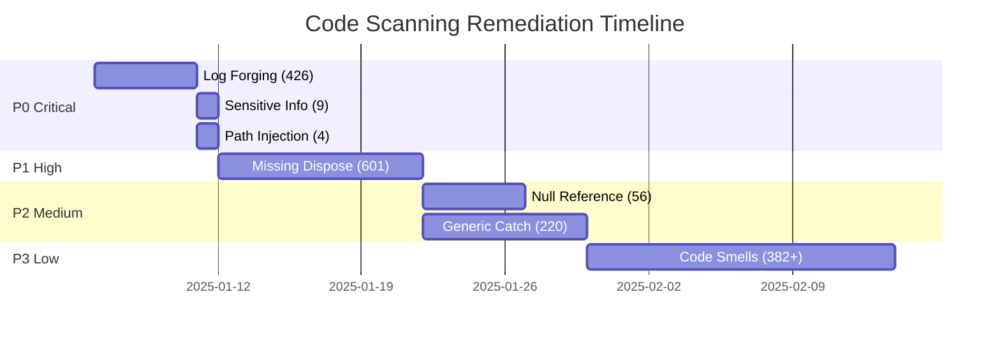

## Overview

This is the master tracking issue for remediating **2,323 CodeQL security and code quality alerts** discovered via GitHub code scanning.

### Current Status

- **Total Alerts**: 2,323
- **Open**: 1,692 (73%)
- **Fixed**: 631 (27%)
- **Estimated Effort**: 6-8 weeks (1 developer)

---

## Alert Breakdown by Priority

| Priority | Severity | Count | % of Total | Effort | Status |
|----------|----------|-------|------------|--------|--------|
| **P0 - CRITICAL** | 🔴 ERROR | 439 | 19% | 1 week | 🟡 Planned |
| **P1 - HIGH** | ⚠️ WARNING | 601 | 26% | 2 weeks | ⏳ Pending |
| **P2 - MEDIUM** | ⚠️ WARNING/NOTE | 276 | 12% | 3 weeks | ⏳ Pending |
| **P3 - LOW** | 📝 NOTE | 382+ | 16%+ | 4 weeks | ⏳ Pending |
| **Fixed** | Various | 631 | 27% | - | ✅ Done |

---

## 🔴 P0 - CRITICAL (Security Issues - 439 alerts)

Must fix immediately to prevent security vulnerabilities.

### Issues

1. **[SECURITY] Fix Log Forging Vulnerabilities** - #[issue-number]
   - **Count**: 426 instances
   - **CWE**: CWE-117 (Improper Output Neutralization for Logs)
   - **Risk**: Log injection attacks, privilege escalation
   - **Effort**: 4-5 days
   - **Status**: ⏳ Pending

2. **[SECURITY] Fix Exposure of Sensitive Information** - #[issue-number]
   - **Count**: 9 instances
   - **CWE**: CWE-532 (Insertion of Sensitive Information into Log File)
   - **Risk**: Password/token leakage in logs
   - **Effort**: 1 day
   - **Status**: ⏳ Pending

3. **[SECURITY] Fix Path Injection Vulnerabilities** - #[issue-number]
   - **Count**: 4 instances
   - **CWE**: CWE-22 (Path Traversal), CWE-73 (External Control of File Name)
   - **Risk**: Directory traversal, arbitrary file access
   - **Effort**: 1 day
   - **Status**: ⏳ Pending

### P0 Completion Checklist

- [ ] Log forging remediation complete (426 instances)
- [ ] Sensitive info exposure fixed (9 instances)
- [ ] Path injection vulnerabilities patched (4 instances)
- [ ] Security audit passed
- [ ] Prevention measures implemented
- [ ] Documentation updated

---

## 🟠 P1 - HIGH (Resource Management - 601 alerts)

Important for stability and performance, but not immediate security risk.

### Issues

1. **[CODE QUALITY] Fix Missing Dispose Calls** - #[issue-number]
   - **Count**: 601 instances
   - **CWE**: CWE-404 (Improper Resource Shutdown)
   - **Risk**: Memory leaks, connection pool exhaustion
   - **Effort**: 8-10 days
   - **Status**: ⏳ Pending

### P1 Completion Checklist

- [ ] All IDisposable objects use `using` statements (601 instances)
- [ ] CA2000/CA1001 analyzer warnings resolved
- [ ] Memory leak tests pass
- [ ] Prevention measures (analyzers + hooks) implemented

---

## 🟡 P2 - MEDIUM (Code Quality - 276 alerts)

Improves reliability and maintainability.

### Issues

1. **[CODE QUALITY] Fix Null Reference Warnings** - #[issue-number]
   - **Count**: 56 instances
   - **CWE**: CWE-476 (NULL Pointer Dereference)
   - **Risk**: NullReferenceException crashes
   - **Effort**: 4-5 days
   - **Status**: ⏳ Pending

2. **[CODE QUALITY] Fix Generic Catch Clauses** - #[issue-number]
   - **Count**: 220 instances
   - **CWE**: CWE-396 (Declaration of Catch for Generic Exception)
   - **Risk**: Hidden errors, difficult debugging
   - **Effort**: 6-8 days
   - **Status**: ⏳ Pending

### P2 Completion Checklist

- [ ] All null dereferences protected (56 instances)
- [ ] Generic catch clauses replaced with specific exceptions (220 instances)
- [ ] CS8602 compiler warnings resolved
- [ ] CA1031 analyzer warnings resolved

---

## ⚪ P3 - LOW (Maintainability - 382+ alerts)

Technical debt and code smells. Address incrementally.

### Issues

1. **[CODE QUALITY] Clean Up Code Smells** - #[issue-number]
   - **Count**: 382+ instances
   - **Categories**: Unused code, duplication, complexity, naming
   - **Risk**: Reduced maintainability
   - **Effort**: 11-15 days
   - **Status**: ⏳ Pending

### P3 Completion Checklist

- [ ] Unused variables/imports removed
- [ ] Code duplication reduced by 50%
- [ ] All methods < 50 lines
- [ ] SonarCloud quality gate passes

---

## Timeline & Milestones



### Milestones

| Milestone | Target Date | Status |
|-----------|-------------|--------|
| ✅ Documentation Complete | 2025-01-03 | ✅ Done |
| 🔴 P0 Security Issues Fixed | Week of Jan 6 | 🟡 Planned |
| 🟠 P1 Resource Leaks Fixed | Week of Jan 20 | ⏳ Pending |
| 🟡 P2 Code Quality Improved | Week of Feb 3 | ⏳ Pending |
| ⚪ P3 Tech Debt Reduced | Week of Feb 24 | ⏳ Pending |

---

## Progress Tracking

### Overall Progress

```
Progress: ███░░░░░░░░░░░░░░░░░ 631/2323 (27%)

✅ Fixed:      631 (27%)
🟡 In Progress:  0 (0%)
⏳ Pending:   1,692 (73%)
```

### By Priority

```
P0 Critical: ░░░░░░░░░░░░░░░░░░░░   0/439 (0%)
P1 High:     ░░░░░░░░░░░░░░░░░░░░   0/601 (0%)
P2 Medium:   ░░░░░░░░░░░░░░░░░░░░   0/276 (0%)
P3 Low:      ░░░░░░░░░░░░░░░░░░░░   0/382 (0%)
```

---

## Weekly Updates

### Week of January 6, 2025
- [ ] Start P0 remediation
- [ ] Update progress in this issue
- [ ] Document any blockers

### Week of January 13, 2025
- [ ] Complete P0 remediation
- [ ] Security audit
- [ ] Start P1 remediation

---

## Documentation

### Created Documentation
- ✅ [CODE_SCANNING_SUMMARY.md](../../../CODE_SCANNING_SUMMARY.md) - Executive summary
- ✅ [CODE_SCANNING_ISSUES.md](../../../CODE_SCANNING_ISSUES.md) - Detailed issue templates
- ✅ [create-code-scanning-issues.sh](../../../create-code-scanning-issues.sh) - Automation script

### Issue Templates
All issue templates are in `.github/issues/code-scanning/`:
- ✅ `p0-log-forging.md` (426 instances)
- ✅ `p0-sensitive-info.md` (9 instances)
- ✅ `p0-path-injection.md` (4 instances)
- ✅ `p1-missing-dispose.md` (601 instances)
- ✅ `p2-null-reference.md` (56 instances)
- ✅ `p2-generic-catch.md` (220 instances)
- ✅ `p3-code-smells.md` (382+ instances)
- ✅ `meta-tracker.md` (this file)

---

## Team Assignment

| Priority | Assignee | Status |
|----------|----------|--------|
| P0 Critical | TBD | Unassigned |
| P1 High | TBD | Unassigned |
| P2 Medium | TBD | Unassigned |
| P3 Low | TBD | Unassigned |

---

## Success Metrics

### Security
- [ ] Zero critical security vulnerabilities
- [ ] All CWE-117 (log injection) resolved
- [ ] All CWE-532 (sensitive info) resolved
- [ ] All CWE-22/73 (path traversal) resolved

### Code Quality
- [ ] Test coverage maintained at >80%
- [ ] No resource leaks in load tests
- [ ] SonarCloud quality gate: A rating
- [ ] Code duplication <3%

### Performance
- [ ] No memory leaks detected
- [ ] Connection pool utilization stable
- [ ] Response times maintained or improved

---

## Prevention Strategy

### 1. CI/CD Quality Gates
- [x] CodeQL scanning enabled
- [ ] Roslyn analyzers as errors (CA2000, CA2254, CA1031)
- [ ] SonarCloud integration
- [ ] Pre-commit hooks for linting

### 2. Development Process
- [ ] Security training for team
- [ ] Code review checklist updated
- [ ] Security champions program
- [ ] Regular security audits

### 3. Monitoring
- [ ] Alert on new critical issues
- [ ] Weekly code scanning reports
- [ ] Monthly security review
- [ ] Quarterly penetration testing

---

## Related Issues

### Child Issues (Security - P0)
- #[log-forging] - Log forging vulnerabilities (426)
- #[sensitive-info] - Sensitive information exposure (9)
- #[path-injection] - Path injection vulnerabilities (4)

### Child Issues (Code Quality - P1)
- #[missing-dispose] - Missing dispose calls (601)

### Child Issues (Code Quality - P2)
- #[null-reference] - Null reference warnings (56)
- #[generic-catch] - Generic catch clauses (220)

### Child Issues (Tech Debt - P3)
- #[code-smells] - Code smells and maintainability (382+)

---

## Commands

### View All Alerts
```bash
# Via GitHub CLI
gh api /repos/DegrassiAaron/meepleai-monorepo/code-scanning/alerts

# Via Web UI
https://github.com/DegrassiAaron/meepleai-monorepo/security/code-scanning
```

### Create All Issues
```bash
# Run the automation script
./create-code-scanning-issues.sh
```

### Check Progress
```bash
# List open code scanning issues
gh issue list --label code-scanning --state open
```

---

## Notes

- This tracker is updated weekly
- Child issues are linked as they are created
- Progress bars are updated manually after each milestone
- Security issues (P0) take absolute priority
- All fixes require code review + testing

---

**Status**: 🟡 In Progress
**Priority**: P0 (tracking issue)
**Category**: Meta > Project Management
**Created**: 2025-01-03
**Last Updated**: 2025-01-03
