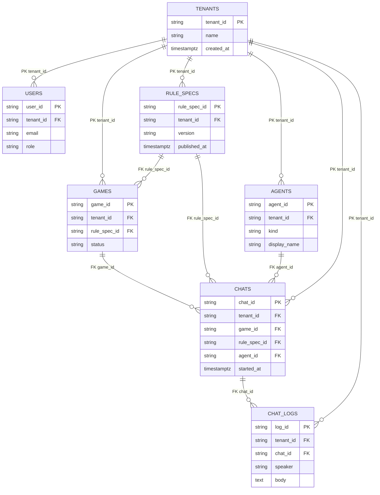

# MeepleAI Monorepo


Questo repository ospita gli stack principali di MeepleAI:

- **apps/web** – front-end Next.js per l'interfaccia degli agenti Meeple.
- **apps/api** – API .NET per ingesti PDF, Q&A e seed di demo.
- **infra/** – definizioni Docker Compose e file di ambiente per avviare rapidamente i servizi di base (Postgres, Redis, Qdrant, n8n, API e web).

## Avvio rapido con Docker Compose

1. Copia i template `infra/env/*.env.dev.example` in file `infra/env/*.env.dev` non tracciati (lo script `scripts/dev-up.ps1` lo fa automaticamente al primo avvio) e personalizzali con i tuoi segreti locali. Tutti i valori forniti di default sono sicuri per lo sviluppo locale.
2. Avvia lo stack completo:
   ```bash
   cd infra
   docker compose up -d --build
   ```
3. Apri il front-end su [http://localhost:3000](http://localhost:3000) e le API su [http://localhost:8080](http://localhost:8080).

Ogni servizio espone un healthcheck nel `docker-compose.yml`, per cui `docker compose ps` mostra lo stato "healthy" quando l'avvio è completo.

## Database

### Avvio di Postgres via Docker Compose

- Il servizio Postgres è definito in `infra/docker-compose.yml` con credenziali di default `meeple / meeplepass` e database `meepleai`.\
  Puoi avviare solo il database (più eventuali dipendenze) con:
  ```bash
  cd infra
  docker compose up -d postgres
  ```
- Il volume `pgdata` mantiene i dati tra i riavvii; lo script `infra/init/postgres-init.sql` è montato come bootstrap e rimane vuoto perché lo schema è gestito da EF Core.

### Migrazioni EF Core

- Assicurati di avere installato lo strumento CLI (`dotnet tool install --global dotnet-ef`) e di esportare le variabili d'ambiente presenti in `infra/env/api.env.dev.example` (copiandole in `infra/env/api.env.dev`) o in un tuo `.env` locale.
- Posizionati nel progetto API e applica le migrazioni con:
  ```bash
  cd apps/api/src/Api
  dotnet ef database update
  ```
  Se stai aggiungendo una nuova migrazione, usa `dotnet ef migrations add <NomeMigrazione>` specificando `--project` e `--startup-project` se lavori da una directory diversa.
- Le migrazioni generate sono versionate nella cartella `apps/api/src/Api/Migrations/`, così da avere commit tracciabili insieme al codice applicativo.

### Modello ER multi-tenant



> Multi-tenant indexing: oltre alle chiavi primarie, ogni tabella deve avere almeno un indice composto su `(tenant_id, <chiave_naturale>)` e indici aggiuntivi su `(tenant_id, game_id)` per `chats` e `(tenant_id, published_at)` per `rule_specs` per supportare filtri e retention richiesti da DB-01.

### Seed demo e vincoli di tenancy

- L'endpoint `POST /admin/seed` popola (o rigenera) una demo di regole di gioco tramite `RuleSpecService`, utile per validare rapidamente lo stack QA; lo script `scripts/seed-demo.ps1` lo invoca automaticamente contro le API locali.
- Il front-end si connette usando `NEXT_PUBLIC_TENANT_ID=dev`, quindi i dati demo devono sempre essere creati con `tenant_id = "dev"` e `game_id = "demo-chess"` per permettere alle chiamate `/agents/qa` di funzionare senza configurazione aggiuntiva.
- Le chat devono referenziare sia il gioco (`game_id`) sia il modello di regole (`rule_spec_id`) per il tenant corrente; la cancellazione di un tenant deve propagare tramite cascade verso utenti, giochi, agenti, chat e log per evitare orfani e mantenere l'isolamento. Quando si applicano nuove migrazioni verificare che tutte le FK abbiano `ON DELETE CASCADE` o strategie equivalenti compatibili con RLS.
- Per la verifica di DB-01 assicurarsi che: (1) tutte le tabelle includano `tenant_id NOT NULL`, (2) gli indici multi-tenant siano presenti, e (3) i dati seed rispettino l'isolamento (nessun record cross-tenant, chat/log sempre filtrati per `tenant_id` e `game_id`).

## Autenticazione e ruoli

- Le API espongono gli endpoint `POST /auth/register`, `POST /auth/login`, `POST /auth/logout` e `GET /auth/me`. La registrazione crea automaticamente il tenant se non esiste e assegna un ruolo (`Admin`, `Editor`, `User`).
- Le sessioni sono persistite in tabella `user_sessions` con token casuali hashati; il token è inviato al client tramite cookie `HttpOnly`.
- Gli endpoint protetti (`/agents/qa`, `/ingest/pdf`, `/admin/seed`) richiedono una sessione valida e rispettano i permessi: solo Admin può eseguire il seed, Admin/Editor possono accedere a ingest, tutti i ruoli autenticati possono usare il QA sul proprio tenant.

## Struttura

```
apps/
  web/          # Next.js app + Dockerfile + template .env.dev.example
  api/          # Progetto .NET (Api + test + Dockerfile)
infra/
  docker-compose.yml
  env/          # Template .env.dev.example e .env.ci.example per i servizi
  init/         # Script inizializzazione Postgres
meepleai_backlog/ # Backlog prodotto
scripts/, tools/, schemas/ ...
```

## Test locali

- Front-end: `cd apps/web && npm test`
- API: `cd apps/api && dotnet test` (richiede .NET 8 SDK installato in locale)

Per altre linee guida consulta `agents.md` e i README specifici nelle rispettive app.

## Contribuire

Accogliamo contributi dalla community! Prima di iniziare:

- **[CONTRIBUTING.md](CONTRIBUTING.md)** - Linee guida per pull request, coding standards, e testing
- **[SECURITY.md](SECURITY.md)** - Policy di sicurezza e come segnalare vulnerabilità
- **[agents.md](agents.md)** - Standard operativi per agenti di coding (Codex/Claude Code)

## Hook di sicurezza locali

1. Installa le dipendenze di sviluppo Python (richiede Python 3.9+):
   ```bash
   python -m pip install --user -r requirements-dev.txt
   ```
   > Su Windows puoi usare `py -3 -m pip install --user -r requirements-dev.txt`. Se ottieni l'errore `No module named pre_commit`, ripeti il comando per assicurarti che `pip` abbia installato il pacchetto.
2. Installa gli hook di pre-commit nel repository:
   ```bash
   pre-commit install
   ```
3. Esegui un controllo completo (opzionale ma consigliato prima del primo commit):
   ```bash
   pre-commit run --all-files
   ```

## Gestione secrets e rotazione

- I file `infra/env/*.env.dev` restano fuori dal versionamento (`.gitignore`) e sono pensati solo per lo sviluppo locale. Usa i template `*.env.dev.example` come base e mantieni le credenziali nel tuo password manager.
- Per la CI utilizza variabili sicure (GitHub Secrets/Environments) che popolano file `infra/env/*.env.ci` o variabili d'ambiente equivalenti. I template `*.env.ci.example` elencano i nomi richiesti senza fornire valori sensibili.
- **Rotazione OpenRouter API key:** genera una chiave dedicata per MeepleAI, ruotala almeno ogni 90 giorni o immediatamente in caso di sospetta fuga, aggiorna il secret GitHub `OPENROUTER_API_KEY` e invalida la chiave precedente dal pannello OpenRouter.
- **Rotazione GitHub PAT (per n8n o automazioni):** usa PAT con scope minimi, memorizzalo come secret GitHub (`GITHUB_TOKEN`/`N8N_GITHUB_PAT`), ruotalo ogni 90 giorni e revoca immediatamente i token inutilizzati.
- Configura gli hook di sicurezza come descritto nella sezione precedente: il gancio `detect-secrets` blocca la maggior parte dei leak accidentali; aggiorna il baseline con `detect-secrets scan > .secrets.baseline` solo dopo aver verificato che non siano presenti segreti reali.

## 🗺️ Roadmap

### ✅ Completato

#### Infrastruttura & DevOps
- ✅ Architettura microservizi con Docker Compose
- ✅ CI/CD pipeline con GitHub Actions
- ✅ Integration tests in CI con Qdrant gRPC
- ✅ Pre-commit hooks per sicurezza (detect-secrets, secret scanning)
- ✅ Gestione environment multi-ambiente (.env.dev, .env.ci)
- ✅ Health checks per tutti i servizi

#### Backend (.NET 8)
- ✅ API REST con minimal APIs
- ✅ Sistema multi-tenant con isolamento dati
- ✅ Autenticazione basata su sessioni con cookie HttpOnly
- ✅ Autorizzazione role-based (Admin, Editor, User)
- ✅ Integrazione PostgreSQL con EF Core migrations
- ✅ Cache distribuita con Redis
- ✅ RAG (Retrieval-Augmented Generation) con Qdrant
- ✅ PDF extraction service (Docnet + tabelle)
- ✅ Seed demo data per testing

#### Frontend (Next.js)
- ✅ Interfaccia web React/TypeScript
- ✅ API client con gestione errori
- ✅ Health check endpoints
- ✅ Integrazione con backend API

#### Automazione
- ✅ n8n workflow engine setup
- ✅ Webhook n8n per Q&A endpoint

#### Documentazione
- ✅ CONTRIBUTING.md - linee guida per contributi
- ✅ SECURITY.md - policy di sicurezza
- ✅ CLAUDE.md - guida sviluppo per AI agents
- ✅ agents.md - standard operativi coding agents

#### Testing & CI
- ✅ PDF extraction in CI (libgdiplus, Docnet runtime Linux)
- ✅ Integration tests con TestContainers (PostgreSQL + Qdrant)
- ✅ Tutti i test di integrazione abilitati (294 test passing)
- ✅ Coverage reporting automatico

### 🚧 In corso

- 🚧 Miglioramento error handling e logging

### 📋 Pianificato (Q1-Q2 2025)

#### Core Features
- 📋 **Ingestion Pipeline completo**
  - Upload multipli PDF
  - Processamento asincrono con coda
  - Estrazione avanzata tabelle e immagini
  - Chunking intelligente per RAG

- 📋 **Chat multi-turno persistente**
  - Storico conversazioni per game/rule_spec
  - Context window management
  - Follow-up questions intelligenti

- 📋 **Gestione avanzata rule specs**
  - Versioning documenti
  - Diff tra versioni
  - Publishing workflow
  - Retention policy per vecchie versioni

#### UX & Frontend
- 📋 UI/UX completo per chat interfaccia
- 📋 Dashboard amministrazione tenant
- 📋 Gestione upload PDF con progress tracking
- 📋 Visualizzazione source documents per risposte

#### Integrazioni
- 📋 Supporto multiple LLM providers (oltre OpenRouter)
- 📋 Webhook system per eventi (new chat, ingestion complete)
- 📋 API pubblica per integrazioni terze parti

#### Performance & Scale
- 📋 Caching avanzato strategie (per query, per tenant)
- 📋 Ottimizzazione vector search con filtri pre-compute
- 📋 Monitoring e observability (OpenTelemetry)

### 🔮 Visione futura (2025+)

- 🔮 **Multi-modal support**: immagini, diagrammi, video tutorial giochi
- 🔮 **AI Game Master**: agente autonomo che simula partite
- 🔮 **Community features**: condivisione Q&A, knowledge base pubblica
- 🔮 **Mobile app**: client iOS/Android nativo
- 🔮 **Voice interface**: Q&A vocale durante le partite
- 🔮 **Gamification**: statistiche utilizzo, achievements, leaderboard
- 🔮 **Marketplace**: regole custom, espansioni community-driven
- 🔮 **Real-time multiplayer**: assistenza durante partite online

### Priorità di sviluppo

La roadmap segue queste priorità:
1. **Stabilità**: Fix CI/CD e test reliability (Q1 2025)
2. **Core functionality**: Ingestion completo e chat persistente (Q1-Q2 2025)
3. **User experience**: UI/UX migliorato (Q2 2025)
4. **Scale & Performance**: Ottimizzazioni e monitoring (Q2-Q3 2025)
5. **Innovation**: Features avanzate e multi-modal (Q4 2025+)

Per seguire i progressi in tempo reale, consulta la [Project Board](https://github.com/MeepleAI/meepleai-monorepo/projects) e le [Issues](https://github.com/MeepleAI/meepleai-monorepo/issues).
