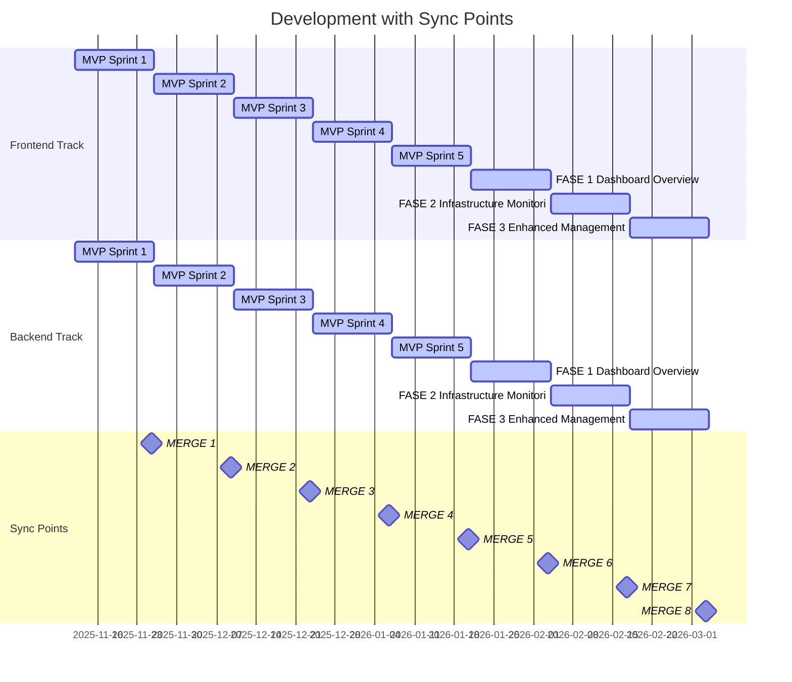

# MeepleAI Monorepo - Development Calendar with Worktree Sync

**Generated**: 2025-11-12 20:40
**Total Open Issues**: 155
**Worktree Strategy**: Dual worktree (frontend + backend) with daily sync

## 🔀 Git Workflow & Worktree Strategy

### Worktree Setup

```bash
# From main repository
git worktree add ../meepleai-frontend frontend-dev
git worktree add ../meepleai-backend backend-dev
```

### Branch Strategy

- **main**: Production branch (protected)
- **frontend-dev**: Frontend development (worktree 1)
- **backend-dev**: Backend development (worktree 2)
- **feature/**: Feature branches (short-lived)

## 📅 Integration Timeline

| Milestone | Duration | Frontend | Backend | Sync Point |
|-----------|----------|----------|---------|------------|
| MVP Sprint 1 | 2w | 1 issues | 1 issues | 2025-11-25 |
| MVP Sprint 2 | 2w | 2 issues | 3 issues | 2025-12-09 |
| MVP Sprint 3 | 2w | 2 issues | 3 issues | 2025-12-23 |
| MVP Sprint 4 | 2w | 3 issues | 2 issues | 2026-01-06 |
| MVP Sprint 5 | 2w | 1 issues | 3 issues | 2026-01-20 |
| FASE 1: Dashboard Overview | 2w | 6 issues | 5 issues | 2026-02-03 |
| FASE 2: Infrastructure Monitor | 2w | 5 issues | 4 issues | 2026-02-17 |
| FASE 3: Enhanced Management | 2w | 5 issues | 3 issues | 2026-03-03 |
| FASE 4: Advanced Features | 2w | 2 issues | 3 issues | 2026-03-17 |
| Month 1: PDF Processing | 2w | - | 1 issues | 2026-03-31 |
| Month 2: LLM Integration | 2w | - | 2 issues | 2026-04-14 |
| Month 3: Multi-Model Validatio | 2w | - | 12 issues | 2026-04-28 |

**Total Integration Points**: 12

## 📊 Visual Timeline (Gantt)



## 🔄 Daily Sync Workflow

### Morning Routine (Start of Day)

**Frontend Worktree**:
```bash
cd ../meepleai-frontend
git fetch origin main
git rebase origin/main frontend-dev
pnpm install  # if package.json changed
```

**Backend Worktree**:
```bash
cd ../meepleai-backend
git fetch origin main
git rebase origin/main backend-dev
dotnet restore  # if dependencies changed
```

## 🎯 End-of-Milestone Integration

### Integration Point #1: MVP Sprint 1

**Date**: 2025-11-25 Tuesday

**Dual-track Merge** (both worktrees active):

```bash
# Step 1: Verify both branches are ready
cd ../meepleai-frontend && git status && pnpm test
cd ../meepleai-backend && git status && dotnet test

# Step 2: Merge to main (from main worktree)
cd /path/to/meepleai-monorepo
git checkout main
git pull origin main

# Step 3: Merge backend first (API contracts)
git merge backend-dev --no-ff -m 'Merge: MVP Sprint 1 (backend)'

# Step 4: Merge frontend (consumes backend)
git merge frontend-dev --no-ff -m 'Merge: MVP Sprint 1 (frontend)'

# Step 5: Tag and push
git tag -a v1.0 -m 'Release: MVP Sprint 1'
git push origin main --tags
```

**Post-Merge**:
- [ ] Run full test suite
- [ ] Update dev branches
- [ ] Deploy to staging
- [ ] Notify team on Slack

---

### Integration Point #2: MVP Sprint 2

**Date**: 2025-12-09 Tuesday

**Dual-track Merge** (both worktrees active):

```bash
# Step 1: Verify both branches are ready
cd ../meepleai-frontend && git status && pnpm test
cd ../meepleai-backend && git status && dotnet test

# Step 2: Merge to main (from main worktree)
cd /path/to/meepleai-monorepo
git checkout main
git pull origin main

# Step 3: Merge backend first (API contracts)
git merge backend-dev --no-ff -m 'Merge: MVP Sprint 2 (backend)'

# Step 4: Merge frontend (consumes backend)
git merge frontend-dev --no-ff -m 'Merge: MVP Sprint 2 (frontend)'

# Step 5: Tag and push
git tag -a v2.0 -m 'Release: MVP Sprint 2'
git push origin main --tags
```

**Post-Merge**:
- [ ] Run full test suite
- [ ] Update dev branches
- [ ] Deploy to staging
- [ ] Notify team on Slack

---

### Integration Point #3: MVP Sprint 3

**Date**: 2025-12-23 Tuesday

**Dual-track Merge** (both worktrees active):

```bash
# Step 1: Verify both branches are ready
cd ../meepleai-frontend && git status && pnpm test
cd ../meepleai-backend && git status && dotnet test

# Step 2: Merge to main (from main worktree)
cd /path/to/meepleai-monorepo
git checkout main
git pull origin main

# Step 3: Merge backend first (API contracts)
git merge backend-dev --no-ff -m 'Merge: MVP Sprint 3 (backend)'

# Step 4: Merge frontend (consumes backend)
git merge frontend-dev --no-ff -m 'Merge: MVP Sprint 3 (frontend)'

# Step 5: Tag and push
git tag -a v3.0 -m 'Release: MVP Sprint 3'
git push origin main --tags
```

**Post-Merge**:
- [ ] Run full test suite
- [ ] Update dev branches
- [ ] Deploy to staging
- [ ] Notify team on Slack

---

### Integration Point #4: MVP Sprint 4

**Date**: 2026-01-06 Tuesday

**Dual-track Merge** (both worktrees active):

```bash
# Step 1: Verify both branches are ready
cd ../meepleai-frontend && git status && pnpm test
cd ../meepleai-backend && git status && dotnet test

# Step 2: Merge to main (from main worktree)
cd /path/to/meepleai-monorepo
git checkout main
git pull origin main

# Step 3: Merge backend first (API contracts)
git merge backend-dev --no-ff -m 'Merge: MVP Sprint 4 (backend)'

# Step 4: Merge frontend (consumes backend)
git merge frontend-dev --no-ff -m 'Merge: MVP Sprint 4 (frontend)'

# Step 5: Tag and push
git tag -a v4.0 -m 'Release: MVP Sprint 4'
git push origin main --tags
```

**Post-Merge**:
- [ ] Run full test suite
- [ ] Update dev branches
- [ ] Deploy to staging
- [ ] Notify team on Slack

---

### Integration Point #5: MVP Sprint 5

**Date**: 2026-01-20 Tuesday

**Dual-track Merge** (both worktrees active):

```bash
# Step 1: Verify both branches are ready
cd ../meepleai-frontend && git status && pnpm test
cd ../meepleai-backend && git status && dotnet test

# Step 2: Merge to main (from main worktree)
cd /path/to/meepleai-monorepo
git checkout main
git pull origin main

# Step 3: Merge backend first (API contracts)
git merge backend-dev --no-ff -m 'Merge: MVP Sprint 5 (backend)'

# Step 4: Merge frontend (consumes backend)
git merge frontend-dev --no-ff -m 'Merge: MVP Sprint 5 (frontend)'

# Step 5: Tag and push
git tag -a v5.0 -m 'Release: MVP Sprint 5'
git push origin main --tags
```

**Post-Merge**:
- [ ] Run full test suite
- [ ] Update dev branches
- [ ] Deploy to staging
- [ ] Notify team on Slack

---

### Integration Point #6: FASE 1: Dashboard Overview

**Date**: 2026-02-03 Tuesday

**Dual-track Merge** (both worktrees active):

```bash
# Step 1: Verify both branches are ready
cd ../meepleai-frontend && git status && pnpm test
cd ../meepleai-backend && git status && dotnet test

# Step 2: Merge to main (from main worktree)
cd /path/to/meepleai-monorepo
git checkout main
git pull origin main

# Step 3: Merge backend first (API contracts)
git merge backend-dev --no-ff -m 'Merge: FASE 1: Dashboard Overview (backend)'

# Step 4: Merge frontend (consumes backend)
git merge frontend-dev --no-ff -m 'Merge: FASE 1: Dashboard Overview (frontend)'

# Step 5: Tag and push
git tag -a v6.0 -m 'Release: FASE 1: Dashboard Overview'
git push origin main --tags
```

**Post-Merge**:
- [ ] Run full test suite
- [ ] Update dev branches
- [ ] Deploy to staging
- [ ] Notify team on Slack

---

### Integration Point #7: FASE 2: Infrastructure Monitoring

**Date**: 2026-02-17 Tuesday

**Dual-track Merge** (both worktrees active):

```bash
# Step 1: Verify both branches are ready
cd ../meepleai-frontend && git status && pnpm test
cd ../meepleai-backend && git status && dotnet test

# Step 2: Merge to main (from main worktree)
cd /path/to/meepleai-monorepo
git checkout main
git pull origin main

# Step 3: Merge backend first (API contracts)
git merge backend-dev --no-ff -m 'Merge: FASE 2: Infrastructure Monitoring (backend)'

# Step 4: Merge frontend (consumes backend)
git merge frontend-dev --no-ff -m 'Merge: FASE 2: Infrastructure Monitoring (frontend)'

# Step 5: Tag and push
git tag -a v7.0 -m 'Release: FASE 2: Infrastructure Monitoring'
git push origin main --tags
```

**Post-Merge**:
- [ ] Run full test suite
- [ ] Update dev branches
- [ ] Deploy to staging
- [ ] Notify team on Slack

---

### Integration Point #8: FASE 3: Enhanced Management

**Date**: 2026-03-03 Tuesday

**Dual-track Merge** (both worktrees active):

```bash
# Step 1: Verify both branches are ready
cd ../meepleai-frontend && git status && pnpm test
cd ../meepleai-backend && git status && dotnet test

# Step 2: Merge to main (from main worktree)
cd /path/to/meepleai-monorepo
git checkout main
git pull origin main

# Step 3: Merge backend first (API contracts)
git merge backend-dev --no-ff -m 'Merge: FASE 3: Enhanced Management (backend)'

# Step 4: Merge frontend (consumes backend)
git merge frontend-dev --no-ff -m 'Merge: FASE 3: Enhanced Management (frontend)'

# Step 5: Tag and push
git tag -a v8.0 -m 'Release: FASE 3: Enhanced Management'
git push origin main --tags
```

**Post-Merge**:
- [ ] Run full test suite
- [ ] Update dev branches
- [ ] Deploy to staging
- [ ] Notify team on Slack

---

### Integration Point #9: FASE 4: Advanced Features

**Date**: 2026-03-17 Tuesday

**Dual-track Merge** (both worktrees active):

```bash
# Step 1: Verify both branches are ready
cd ../meepleai-frontend && git status && pnpm test
cd ../meepleai-backend && git status && dotnet test

# Step 2: Merge to main (from main worktree)
cd /path/to/meepleai-monorepo
git checkout main
git pull origin main

# Step 3: Merge backend first (API contracts)
git merge backend-dev --no-ff -m 'Merge: FASE 4: Advanced Features (backend)'

# Step 4: Merge frontend (consumes backend)
git merge frontend-dev --no-ff -m 'Merge: FASE 4: Advanced Features (frontend)'

# Step 5: Tag and push
git tag -a v9.0 -m 'Release: FASE 4: Advanced Features'
git push origin main --tags
```

**Post-Merge**:
- [ ] Run full test suite
- [ ] Update dev branches
- [ ] Deploy to staging
- [ ] Notify team on Slack

---

### Integration Point #10: Month 1: PDF Processing

**Date**: 2026-03-31 Tuesday

**Post-Merge**:
- [ ] Run full test suite
- [ ] Update dev branches
- [ ] Deploy to staging
- [ ] Notify team on Slack

---

## ⚠️ Conflict Resolution

### Merge Order (Critical!)

**Always merge in this order**:
1. ✅ **Backend first** (defines API contracts, DB schema)
2. ✅ **Frontend second** (consumes backend changes)
3. ✅ **Testing last** (validates integration)

### Common Conflicts

| Scenario | Resolution |
|----------|------------|
| API contract change | Backend updates first, frontend adapts |
| Shared types/models | Backend owns canonical types |
| Database migration | Backend merges first (schema changes) |
| Environment vars | Coordinate before merge, document in .env.example |

## ✅ Best Practices

### Daily
- ✅ Rebase on main every morning
- ✅ Push to dev branches every evening
- ✅ Run tests before pushing
- ✅ Keep commits atomic and well-documented

### Per Milestone
- ✅ Coordinate API changes via Slack/Issues
- ✅ Update API documentation before merge
- ✅ Run E2E tests before integration
- ✅ Tag releases with semantic versioning

### Never
- ❌ Don't push directly to main
- ❌ Don't merge without tests passing
- ❌ Don't let branches diverge >1 week
- ❌ Don't skip code review for integration merges

---

**Generated**: 2025-11-12 20:40
**Integration Points**: 12
