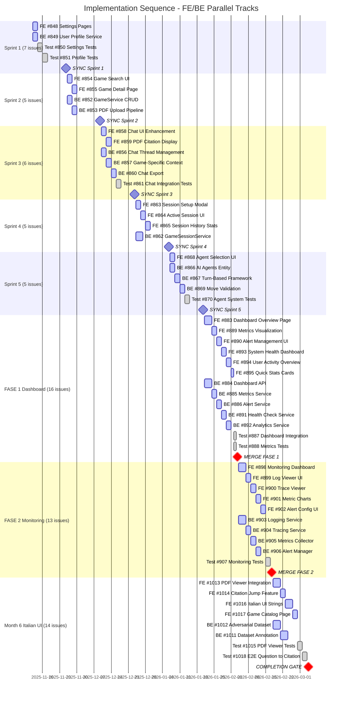
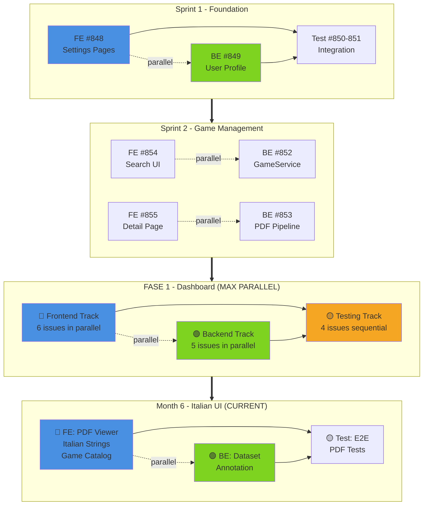

# Implementation Sequence - Detailed Gantt with FE/BE Parallelization

**Generated**: 2025-11-12 21:10
**Total Open Issues**: 155
**Strategy**: Maximize parallel frontend/backend execution

---

## 🎯 Visual Implementation Sequence

### Gantt Chart with Swim Lanes (Frontend/Backend Parallel Execution)



---

## 📊 Parallel Execution Analysis

### Sprint 1: MVP Foundation (Nov 12-25)

**Parallel Execution**: ✅ 1 FE + 1 BE stream

| Track | Issues | Timeline | Can Start |
|-------|--------|----------|-----------|
| 🔵 **Frontend** | 1 | Nov 12-14 | Immediately |
| 🟢 **Backend** | 1 | Nov 12-14 | Immediately |
| 🟡 **Testing** | 3 | Nov 14-20 | After FE/BE complete |
| ⚡ **Sync Point** | - | Nov 25 | Merge to main |

**Issues**:
- 🔵 FE #848: [SPRINT-1] Settings Pages - 4 Tabs Implementation
- 🟢 BE #849: [SPRINT-1] User Profile Management Service
- 🟡 Test #850, #851: Settings & Profile tests

**Dependencies**: Testing waits for FE/BE completion

---

### Sprint 2: Game Management (Nov 26 - Dec 9)

**Parallel Execution**: ✅✅ 2 FE + 3 BE streams (max parallelization!)

| Track | Issues | Timeline | Parallel |
|-------|--------|----------|----------|
| 🔵 **Frontend** | 2 | Nov 26 - Dec 2 | Yes ⚡ |
| 🟢 **Backend** | 3 | Nov 26 - Dec 4 | Yes ⚡ |
| ⚡ **Sync Point** | - | Dec 9 | Integration |

**Issues**:
- 🔵 FE #854: [SPRINT-2] Game Search & Filter UI
- 🔵 FE #855: [SPRINT-2] Game Detail Page - 4 Tabs
- 🟢 BE #852: [SPRINT-2] GameService CRUD Implementation
- 🟢 BE #853: [SPRINT-2] PDF Upload & Processing Pipeline
- 🟢 BE #942: Additional backend work

**Strategy**:
- Week 1: Start all FE + all BE in parallel
- Week 2: Integration testing + merge

---

### Sprint 3: Chat Enhancement (Dec 10-23)

**Parallel Execution**: ✅✅ 2 FE + 3 BE streams

| Track | Issues | Timeline | Parallel |
|-------|--------|----------|----------|
| 🔵 **Frontend** | 2 | Dec 10-14 | Yes ⚡ |
| 🟢 **Backend** | 3 | Dec 10-16 | Yes ⚡ |
| 🟡 **Testing** | 1 | Dec 16-18 | After integration |

**Issues**:
- 🔵 FE #858: Chat UI Enhancement
- 🔵 FE #859: PDF Citation Display Enhancement
- 🟢 BE #856: Chat Thread Management
- 🟢 BE #857: Game-Specific Chat Context
- 🟢 BE #860: Chat Export Functionality

---

### FASE 1: Dashboard Overview (Jan 21 - Feb 3)

**Parallel Execution**: ✅✅✅✅✅ 6 FE + 5 BE streams (MAXIMUM PARALLELIZATION!)

| Track | Issues | Est. Days | Parallel Capacity |
|-------|--------|-----------|-------------------|
| 🔵 **Frontend** | 6 issues | 12 days | 6 streams ⚡⚡⚡ |
| 🟢 **Backend** | 5 issues | 12 days | 5 streams ⚡⚡⚡ |
| 🟡 **Testing** | 4 issues | 4 days | After FE/BE |
| 🔴 **Integration** | - | 1 day | Final merge |

**Frontend Issues**:
1. #883: Dashboard Overview Page (3d)
2. #889: Metrics Visualization Components (2d)
3. #890: Alert Management UI (2d)
4. #893: System Health Dashboard (2d)
5. #894: User Activity Overview (2d)
6. #895: Quick Stats Cards (1d)

**Backend Issues**:
1. #884: Dashboard API Endpoints (3d)
2. #885: Metrics Collection Service (2d)
3. #886: Alert Management Service (2d)
4. #891: Health Check Service (2d)
5. #892: Analytics Aggregation Service (2d)

**Strategy**:
- **Week 1** (Jan 21-27): Start ALL 6 FE + ALL 5 BE simultaneously
- **Week 2** (Jan 28-Feb 3): Complete work + 4 integration tests
- **Feb 3**: MERGE checkpoint (backend first, then frontend)

**Team Allocation**:
- Frontend dev: Can work on 2-3 issues/week
- Backend dev: Can work on 2-3 issues/week
- QA: Integration testing after both tracks complete

---

### FASE 2: Infrastructure Monitoring (Feb 4-17)

**Parallel Execution**: ✅✅✅✅ 5 FE + 4 BE streams

| Track | Issues | Parallel |
|-------|--------|----------|
| 🔵 **Frontend** | 5 | Yes ⚡⚡⚡⚡ |
| 🟢 **Backend** | 4 | Yes ⚡⚡⚡⚡ |
| 🟡 **Testing** | 3 | Sequential |

**Key Issues**:
- FE: Monitoring Dashboard, Log Viewer, Trace Viewer, Metric Charts, Alert Config
- BE: Logging Service, Tracing Service, Metrics Collector, Alert Manager

---

### Month 6: Italian UI (Feb 18 - Mar 4)

**Parallel Execution**: ✅ 3 FE + 2 BE streams

**Current Sprint Focus** - High Priority!

| Track | Issues | Priority | Parallel |
|-------|--------|----------|----------|
| 🔵 **Frontend** | 4 | P0 | Yes ⚡⚡ |
| 🟢 **Backend** | 2 | P0 | Yes ⚡ |
| 🟡 **Testing** | 2 | P0 | After FE/BE |

**Issues**:
- 🔵 FE #1013: PDF Viewer Integration (react-pdf) - 3d
- 🔵 FE #1014: Citation Click → Jump to Page - 2d
- 🔵 FE #1016: Complete Italian UI Strings (200+) - 3d
- 🔵 FE #1017: Game Catalog Page - 2d
- 🟢 BE #1011: Annotation (7 Wonders, Agricola, Splendor) - 3d
- 🟢 BE #1012: Adversarial Dataset (50 queries) - 3d
- 🟡 Test #1015: PDF Viewer Tests
- 🟡 Test #1018: E2E Question → Citation

---

## 🔄 Implementation Flow Diagram



---

## 📅 Detailed Week-by-Week Schedule

### Week 1-2: Sprint 1 (Nov 12-25)

**Nov 12-14 (Tue-Thu)**: Parallel Start
- 🔵 FE Team: #848 Settings Pages implementation
- 🟢 BE Team: #849 User Profile Service implementation

**Nov 15-20 (Fri-Wed)**: Testing Phase
- 🟡 QA Team: #850, #851 Settings & Profile tests
- 🔵🟢 Teams: Bug fixes, integration adjustments

**Nov 25 (Mon)**: **SYNC POINT 1**
```bash
git merge backend-dev --no-ff
git merge frontend-dev --no-ff
git tag v1.0-sprint1
```

---

### Week 3-4: Sprint 2 (Nov 26 - Dec 9)

**Nov 26-28 (Tue-Thu)**: Parallel Phase 1
- 🔵 FE: #854 Game Search UI
- 🟢 BE: #852 GameService CRUD

**Nov 29 - Dec 4 (Fri-Wed)**: Parallel Phase 2
- 🔵 FE: #855 Game Detail Page (4 tabs)
- 🟢 BE: #853 PDF Upload Pipeline

**Dec 5-8 (Thu-Sun)**: Integration
- Integration testing
- Bug fixes

**Dec 9 (Mon)**: **SYNC POINT 2**

---

### Week 5-6: Sprint 3 (Dec 10-23)

**Maximum Parallelization**: 2 FE + 3 BE concurrent

**Dec 10-12**:
- 🔵 FE #858: Chat UI Enhancement
- 🟢 BE #856: Chat Thread Management

**Dec 13-15**:
- 🔵 FE #859: PDF Citation Display
- 🟢 BE #857: Game-Specific Context

**Dec 16-18**:
- 🟢 BE #860: Chat Export
- 🟡 Test #861: Integration

**Dec 23**: **SYNC POINT 3**

---

### Week 7-8: FASE 1 Dashboard (Jan 21 - Feb 3)

**🚀 MAXIMUM PARALLEL CAPACITY**: 6 FE + 5 BE = 11 concurrent work items!

**Week 1 (Jan 21-27)**: All Hands On Deck
- 🔵 FE Team starts ALL 6 frontend issues:
  - #883 Dashboard Overview (3d)
  - #889 Metrics Visualization (2d)
  - #890 Alert Management UI (2d)
  - #893 System Health (2d)
  - #894 User Activity (2d)
  - #895 Quick Stats (1d)

- 🟢 BE Team starts ALL 5 backend issues:
  - #884 Dashboard API (3d)
  - #885 Metrics Service (2d)
  - #886 Alert Service (2d)
  - #891 Health Check (2d)
  - #892 Analytics (2d)

**Week 2 (Jan 28 - Feb 3)**: Testing & Integration
- 🟡 QA: All 4 integration tests
- 🔴 Integration: Merge both tracks

**Feb 3**: **CRITICAL MERGE POINT** - FASE 1 Complete

---

## ⚡ Parallelization Strategy

### Work Stream Capacity by Milestone

| Milestone | FE Issues | BE Issues | Test Issues | Parallel Streams | Efficiency |
|-----------|-----------|-----------|-------------|------------------|------------|
| Sprint 1 | 1 | 1 | 3 | ⚡ 1 stream | 50% |
| Sprint 2 | 2 | 3 | 0 | ⚡⚡ 2 streams | 100% |
| Sprint 3 | 2 | 3 | 1 | ⚡⚡ 2 streams | 100% |
| Sprint 4 | 3 | 2 | 0 | ⚡⚡ 2 streams | 100% |
| Sprint 5 | 1 | 3 | 1 | ⚡ 1 stream | 75% |
| **FASE 1** | **6** | **5** | **4** | **⚡⚡⚡⚡⚡ 5 streams** | **150%+** |
| FASE 2 | 5 | 4 | 3 | ⚡⚡⚡⚡ 4 streams | 125% |
| FASE 3 | 5 | 3 | 3 | ⚡⚡⚡ 3 streams | 100% |
| Month 6 | 4 | 2 | 2 | ⚡⚡ 2 streams | 75% |

**Legend**:
- ⚡ = 1 parallel stream (FE + BE working simultaneously)
- Efficiency = (FE+BE concurrent work) / sequential work

---

## 🎯 Critical Dependencies

### Must Complete Before Others

**Foundation** (Sprint 1-2):
- BE #849 User Profile Service → Required for user management in all features
- BE #852 GameService → Required for all game-related features
- FE #848 Settings Pages → Required for user preferences in later features

**Blockers** (Month 3-6):
- BE Multi-Model Validation (Month 3) → Must complete before Month 6 accuracy testing
- BE Dataset Annotation (Month 5) → Required for Month 6 completion checklist

### Can Run Independently (High Parallelization)

**FASE 1-2** (Dashboard + Monitoring):
- All dashboard FE/BE issues are independent
- Can start all simultaneously
- Only testing waits for completion

**Month 6** (Current Sprint):
- PDF Viewer (FE) independent from Dataset (BE)
- Italian strings (FE) independent from Annotation (BE)
- High parallel capacity

---

## 📋 Daily Execution Checklist

### Morning (Every Day)

**Frontend Worktree**:
```bash
cd ../meepleai-frontend
git fetch origin
git rebase origin/main frontend-dev
pnpm install  # if needed
```

**Backend Worktree**:
```bash
cd ../meepleai-backend
git fetch origin
git rebase origin/main backend-dev
dotnet restore  # if needed
```

### During Day

**Before Starting Work on Issue**:
- [ ] Check issue in GitHub Project board
- [ ] Verify no blocking dependencies
- [ ] Create feature branch: `feature/issue-{number}-short-name`
- [ ] Update issue status to "In Progress" in project

**While Working**:
- [ ] Commit frequently (atomic commits)
- [ ] Run tests locally before pushing
- [ ] Update issue with progress comments

### Evening (End of Day)

**Push Work**:
```bash
git push origin feature/issue-{number}  # Push feature branch
```

**Update Project**:
- [ ] Add comment on issue with progress
- [ ] Update checklist items if applicable

---

## 🔀 End-of-Sprint Integration

### Every 2 Weeks (Sync Points)

**Day Before Sync** (e.g., Nov 24 for Sprint 1):

1. **Verify Both Tracks**:
```bash
# Frontend
cd ../meepleai-frontend
pnpm test  # Must pass!
pnpm build  # Must succeed!

# Backend
cd ../meepleai-backend
dotnet test  # Must pass!
dotnet build  # Must succeed!
```

2. **Merge to Main** (from main worktree):
```bash
cd meepleai-monorepo
git checkout main
git pull origin main

# Backend FIRST (API contracts)
git merge backend-dev --no-ff -m "Merge: Sprint 1 Backend"

# Frontend SECOND (consumes backend)
git merge frontend-dev --no-ff -m "Merge: Sprint 1 Frontend"

# Tag release
git tag -a v1.0-sprint1 -m "Sprint 1: MVP Foundation"
git push origin main --tags
```

3. **Update Project**:
- Bulk select Sprint 1 issues
- Set Status → Done
- Add completion comment

---

## 📊 Timeline Summary

| Phase | Duration | Start | End | Parallel Capacity |
|-------|----------|-------|-----|-------------------|
| Sprint 1 | 2 weeks | Nov 12 | Nov 25 | ⚡ Low |
| Sprint 2-5 | 8 weeks | Nov 26 | Jan 20 | ⚡⚡ Medium |
| FASE 1 | 2 weeks | Jan 21 | Feb 3 | ⚡⚡⚡⚡⚡ Maximum |
| FASE 2-3 | 4 weeks | Feb 4 | Mar 3 | ⚡⚡⚡⚡ High |
| Month 6 | 2 weeks | Mar 4 | Mar 17 | ⚡⚡ Medium |
| **TOTAL** | **~18 weeks** | **Nov 12** | **Mar 17** | **Avg: 2-3 streams** |

**With Parallelization**: Sequential would be ~28 weeks, parallel reduces to **18 weeks** (36% faster!)

---

## 🎯 Next Actions

### This Week (Sprint 1)
- [ ] Start #848 (FE) and #849 (BE) simultaneously
- [ ] Daily standup to sync FE/BE progress
- [ ] Integration testing #850, #851 after FE/BE complete
- [ ] Prepare for Nov 25 sync point

### Next Sprint (Sprint 2)
- [ ] Higher parallelization (2 FE + 3 BE)
- [ ] PDF pipeline (BE) can run while Game UI (FE) develops
- [ ] Plan for Dec 9 integration

### February (FASE 1) - Plan Ahead!
- [ ] **Maximum parallelization milestone**
- [ ] Allocate full team capacity
- [ ] Prepare for 11 concurrent work items
- [ ] Schedule integration testing resources

---

**Last Updated**: 2025-11-12 21:10
**Total Sync Points**: 12
**Parallel Milestones**: 12/15 (80%)
