# MeepleAI API - Architettura e Interazioni tra Classi

**Versione**: 1.0-rc (DDD 100%)
**Data Analisi**: 2025-11-17
**Basato su**: Analisi completa del codice sorgente

---

## Indice

1. [Panoramica Architetturale](#1-panoramica-architetturale)
2. [Bounded Contexts](#2-bounded-contexts)
3. [Pattern Architetturali](#3-pattern-architetturali)
4. [Interazioni tra Classi](#4-interazioni-tra-classi)
5. [Flussi dei Casi d'Uso](#5-flussi-dei-casi-duso)
6. [Infrastructure Layer](#6-infrastructure-layer)
7. [Statistiche e Metriche](#7-statistiche-e-metriche)

---

## 1. Panoramica Architetturale

### 1.1 Architettura Generale

MeepleAI utilizza un'architettura **Domain-Driven Design (DDD)** con **CQRS** e **MediatR** per la separazione delle responsabilità.

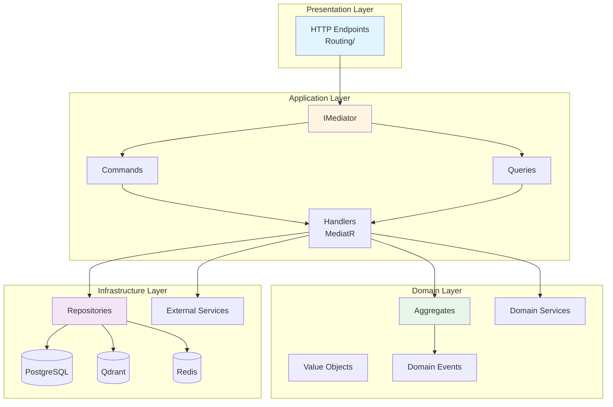
```mermaid
graph TB
    subgraph "Presentation Layer"
        HTTP[HTTP Endpoints<br/>Routing/]
    end

    subgraph "Application Layer"
        CMD[Commands]
        QRY[Queries]
        HANDLER[Handlers<br/>MediatR]
        MEDIATOR[IMediator]
    end

    subgraph "Domain Layer"
        AGG[Aggregates]
        VO[Value Objects]
        DS[Domain Services]
        EVT[Domain Events]
    end

    subgraph "Infrastructure Layer"
        REPO[Repositories]
        DB[(PostgreSQL)]
        QDRANT[(Qdrant)]
        REDIS[(Redis)]
        EXT[External Services]
    end

    HTTP --> MEDIATOR
    MEDIATOR --> CMD
    MEDIATOR --> QRY
    CMD --> HANDLER
    QRY --> HANDLER
    HANDLER --> AGG
    HANDLER --> DS
    HANDLER --> REPO
    AGG --> EVT
    REPO --> DB
    REPO --> QDRANT
    REPO --> REDIS
    HANDLER --> EXT

    style HTTP fill:#e1f5ff
    style MEDIATOR fill:#fff4e1
    style AGG fill:#e8f5e9
    style REPO fill:#f3e5f5
```

### 1.2 Bounded Contexts

Il sistema è organizzato in **7 Bounded Contexts** indipendenti:

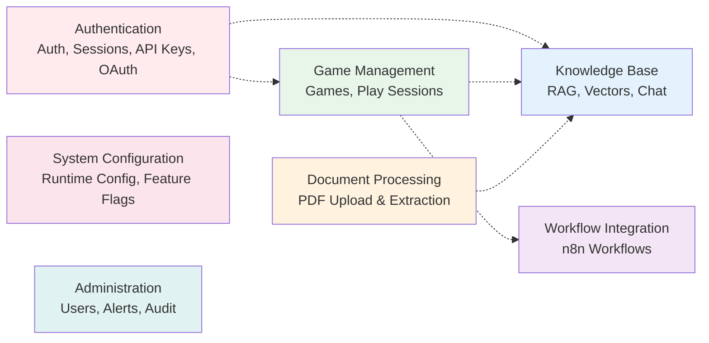
```mermaid
graph LR
    AUTH[Authentication<br/>Auth, Sessions, API Keys, OAuth]
    GAME[Game Management<br/>Games, Play Sessions]
    KB[Knowledge Base<br/>RAG, Vectors, Chat]
    DOC[Document Processing<br/>PDF Upload & Extraction]
    WF[Workflow Integration<br/>n8n Workflows]
    CFG[System Configuration<br/>Runtime Config, Feature Flags]
    ADMIN[Administration<br/>Users, Alerts, Audit]

    AUTH -.-> GAME
    AUTH -.-> KB
    GAME -.-> KB
    DOC -.-> KB
    GAME -.-> WF

    style AUTH fill:#ffebee
    style GAME fill:#e8f5e9
    style KB fill:#e3f2fd
    style DOC fill:#fff3e0
    style WF fill:#f3e5f5
    style CFG fill:#fce4ec
    style ADMIN fill:#e0f2f1
```

### 1.3 Statistiche del Progetto

| Metrica | Valore |
|---------|--------|
| **File C# nei Bounded Contexts** | 611 |
| **Linee di Codice (Services/)** | 16,271 |
| **Domain Events** | 42 |
| **CQRS Handlers** | 96+ |
| **HTTP Endpoints** | 83+ |
| **Persistence Entities** | 30 |
| **Entity Configurations** | 39 |
| **Linee Legacy Rimosse** | 5,387 |

---

## 2. Bounded Contexts

### 2.1 Authentication Context

**Responsabilità**: Gestione autenticazione, autorizzazione, sessioni, API keys, OAuth, 2FA.

#### Architettura del Context

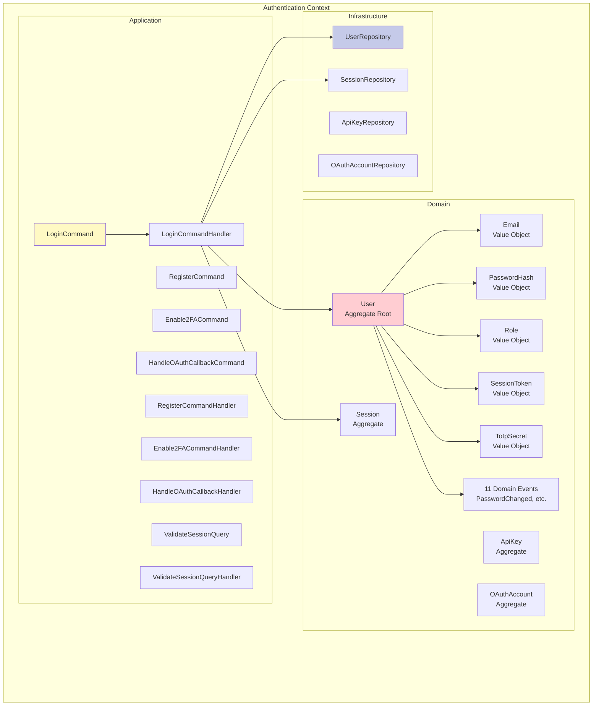
```mermaid
graph TB
    subgraph "Authentication Context"
        subgraph "Domain"
            USER[User<br/>Aggregate Root]
            SESSION[Session<br/>Aggregate]
            APIKEY[ApiKey<br/>Aggregate]
            OAUTH[OAuthAccount<br/>Aggregate]

            EMAIL[Email<br/>Value Object]
            PWD[PasswordHash<br/>Value Object]
            ROLE[Role<br/>Value Object]
            TOKEN[SessionToken<br/>Value Object]
            TOTP[TotpSecret<br/>Value Object]

            USER_EVT[11 Domain Events<br/>PasswordChanged, etc.]
        end

        subgraph "Application"
            LOGIN_CMD[LoginCommand]
            REG_CMD[RegisterCommand]
            2FA_CMD[Enable2FACommand]
            OAUTH_CMD[HandleOAuthCallbackCommand]

            LOGIN_HDL[LoginCommandHandler]
            REG_HDL[RegisterCommandHandler]
            2FA_HDL[Enable2FACommandHandler]
            OAUTH_HDL[HandleOAuthCallbackHandler]

            VAL_QRY[ValidateSessionQuery]
            VAL_HDL[ValidateSessionQueryHandler]
        end

        subgraph "Infrastructure"
            USER_REPO[UserRepository]
            SESSION_REPO[SessionRepository]
            APIKEY_REPO[ApiKeyRepository]
            OAUTH_REPO[OAuthAccountRepository]
        end
    end

    LOGIN_CMD --> LOGIN_HDL
    LOGIN_HDL --> USER
    LOGIN_HDL --> SESSION
    LOGIN_HDL --> USER_REPO
    LOGIN_HDL --> SESSION_REPO

    USER --> EMAIL
    USER --> PWD
    USER --> ROLE
    USER --> TOKEN
    USER --> TOTP

    USER --> USER_EVT

    style USER fill:#ffcdd2
    style LOGIN_CMD fill:#fff9c4
    style USER_REPO fill:#c5cae9
```

#### Classi Principali

**Domain Entities (Aggregates)**:
- `User.cs` (Aggregate Root): Rappresenta un utente con email, password hash, ruolo, 2FA
- `Session.cs`: Sessione utente con token, scadenza, IP
- `ApiKey.cs`: Chiave API con formato `mpl_{env}_{base64}`, hash PBKDF2
- `OAuthAccount.cs`: Account OAuth (Google, Discord, GitHub) con tokens criptati

**Value Objects**:
- `Email.cs`: Email validata (regex)
- `PasswordHash.cs`: Hash PBKDF2 con 210k iterazioni
- `Role.cs`: Enum (Admin, Editor, User)
- `SessionToken.cs`: Token sessione crittograficamente sicuro
- `TotpSecret.cs`: Segreto TOTP per autenticazione a due fattori
- `BackupCode.cs`: Codici di backup 2FA

**Domain Events** (11):
```
PasswordChangedEvent
EmailChangedEvent
RoleChangedEvent
TwoFactorEnabledEvent
TwoFactorDisabledEvent
OAuthAccountLinkedEvent
OAuthAccountUnlinkedEvent
OAuthTokensRefreshedEvent
ApiKeyRevokedEvent
SessionRevokedEvent
SessionExtendedEvent
```

**Commands** (19):
```
RegisterCommand, LoginCommand, LogoutCommand
ChangePasswordCommand
CreateSessionCommand, RevokeSessionCommand, ExtendSessionCommand
RevokeAllUserSessionsCommand, RevokeInactiveSessionsCommand
CreateApiKeyCommand, DeleteApiKeyCommand, RotateApiKeyCommand
Enable2FACommand, Disable2FACommand
HandleOAuthCallbackCommand (CQRS compliant)
LinkOAuthAccountCommand, UnlinkOAuthAccountCommand, InitiateOAuthLoginCommand
RequestPasswordResetCommand, ResetPasswordCommand
UpdateUserProfileCommand
```

**Queries** (13):
```
ValidateSessionQuery, ValidateApiKeyQuery
GetUserProfileQuery, GetUserByIdQuery
Get2FAStatusQuery, Verify2FAQuery
GetAllSessionsQuery, GetUserSessionsQuery, GetSessionStatusQuery
GetApiKeyQuery, ListApiKeysQuery, GetApiKeyUsageQuery
GetLinkedOAuthAccountsQuery
ValidatePasswordResetTokenQuery
```

**Repositories**:
- `UserRepository`: CRUD utenti, ricerca per email, gestione ruoli
- `SessionRepository`: CRUD sessioni, validazione, cleanup sessioni scadute
- `ApiKeyRepository`: CRUD API keys, validazione, tracciamento usage
- `OAuthAccountRepository`: CRUD account OAuth, linking/unlinking

---

### 2.2 Game Management Context

**Responsabilità**: Catalogo giochi, sessioni di gioco, versioning delle regole, commenti collaborativi.

#### Architettura del Context

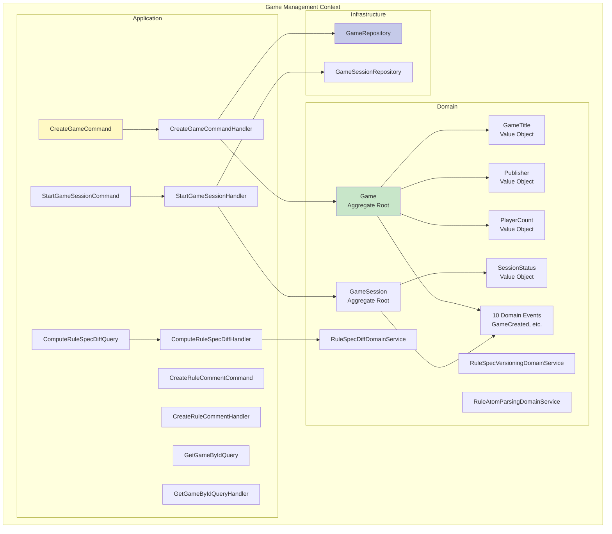
```mermaid
graph TB
    subgraph "Game Management Context"
        subgraph "Domain"
            GAME[Game<br/>Aggregate Root]
            GSESSION[GameSession<br/>Aggregate Root]

            TITLE[GameTitle<br/>Value Object]
            PUBLISHER[Publisher<br/>Value Object]
            PCOUNT[PlayerCount<br/>Value Object]
            STATUS[SessionStatus<br/>Value Object]

            VERSION_SVC[RuleSpecVersioningDomainService]
            DIFF_SVC[RuleSpecDiffDomainService]
            PARSING_SVC[RuleAtomParsingDomainService]

            GAME_EVT[10 Domain Events<br/>GameCreated, etc.]
        end

        subgraph "Application"
            CREATE_GAME_CMD[CreateGameCommand]
            START_SESSION_CMD[StartGameSessionCommand]
            ADD_COMMENT_CMD[CreateRuleCommentCommand]

            CREATE_GAME_HDL[CreateGameCommandHandler]
            START_SESSION_HDL[StartGameSessionHandler]
            ADD_COMMENT_HDL[CreateRuleCommentHandler]

            GET_GAME_QRY[GetGameByIdQuery]
            GET_DIFF_QRY[ComputeRuleSpecDiffQuery]

            GET_GAME_HDL[GetGameByIdQueryHandler]
            GET_DIFF_HDL[ComputeRuleSpecDiffHandler]
        end

        subgraph "Infrastructure"
            GAME_REPO[GameRepository]
            SESSION_REPO[GameSessionRepository]
        end
    end

    CREATE_GAME_CMD --> CREATE_GAME_HDL
    CREATE_GAME_HDL --> GAME
    CREATE_GAME_HDL --> GAME_REPO

    START_SESSION_CMD --> START_SESSION_HDL
    START_SESSION_HDL --> GSESSION
    START_SESSION_HDL --> SESSION_REPO

    GET_DIFF_QRY --> GET_DIFF_HDL
    GET_DIFF_HDL --> DIFF_SVC

    GAME --> TITLE
    GAME --> PUBLISHER
    GAME --> PCOUNT

    GSESSION --> STATUS

    GAME --> GAME_EVT
    GSESSION --> GAME_EVT

    style GAME fill:#c8e6c9
    style CREATE_GAME_CMD fill:#fff9c4
    style GAME_REPO fill:#c5cae9
```

#### Classi Principali

**Domain Entities (Aggregates)**:
- `Game.cs` (Aggregate Root): Gioco da tavolo con titolo, editore, anno, giocatori, durata
- `GameSession.cs` (Aggregate Root): Sessione di gioco con stato (Active, Paused, Completed), giocatori, timestamp

**Value Objects**:
- `GameTitle.cs`: Titolo validato (max 200 caratteri)
- `Publisher.cs`: Editore (max 100 caratteri)
- `YearPublished.cs`: Anno pubblicazione (1900-oggi)
- `PlayerCount.cs`: Range giocatori (min/max, 1-20)
- `PlayTime.cs`: Durata in minuti (5-600)
- `Version.cs`: Versione regole (semantic versioning)
- `SessionStatus.cs`: Enum (Active, Paused, Completed, Abandoned)
- `SessionPlayer.cs`: Giocatore in sessione (nome, ordine)

**Domain Services** (3):
- `RuleSpecVersioningDomainService.cs`: Gestione versioning delle specifiche regole
- `RuleSpecDiffDomainService.cs`: Calcolo differenze tra versioni (line-by-line diff)
- `RuleAtomParsingDomainService.cs`: Parsing regole atomiche da testo

**Domain Events** (10):
```
GameCreatedEvent
GameUpdatedEvent
GameLinkedToBggEvent (integrazione BoardGameGeek)
GameSessionCreatedEvent
GameSessionStartedEvent
GameSessionPausedEvent
GameSessionResumedEvent
GameSessionCompletedEvent
GameSessionAbandonedEvent
PlayerAddedToSessionEvent
```

**Commands** (17):
```
CreateGameCommand, UpdateGameCommand
StartGameSessionCommand, PauseGameSessionCommand, ResumeGameSessionCommand
EndGameSessionCommand, CompleteGameSessionCommand, AbandonGameSessionCommand
AddPlayerToSessionCommand
CreateRuleCommentCommand, UpdateRuleCommentCommand, DeleteRuleCommentCommand
ResolveRuleCommentCommand, UnresolveRuleCommentCommand, ReplyToRuleCommentCommand
GenerateRuleSpecFromPdfCommand
CreateDemoRuleSpecCommand
ExportRuleSpecsCommand
UpdateRuleSpecCommand
```

**Queries** (16):
```
GetAllGamesQuery, GetGameByIdQuery, GetGameDetailsQuery
GetGameSessionByIdQuery, GetActiveSessionsQuery, GetActiveSessionsByGameQuery
GetSessionHistoryQuery
GetRuleSpecQuery, GetRuleSpecsQuery, GetRuleSpecVersionQuery
GetVersionHistoryQuery, GetVersionTimelineQuery
GetRuleCommentsQuery, GetCommentsForLineQuery
ComputeRuleSpecDiffQuery
SearchBggGamesQuery, GetBggGameDetailsQuery (BoardGameGeek API)
```

**Repositories**:
- `GameRepository`: CRUD giochi, ricerca, linking BGG
- `GameSessionRepository`: CRUD sessioni, tracking stato, storia

---

### 2.3 Knowledge Base Context

**Responsabilità**: RAG pipeline, ricerca ibrida (vector + keyword), chat threads, agenti AI.

#### Architettura del Context

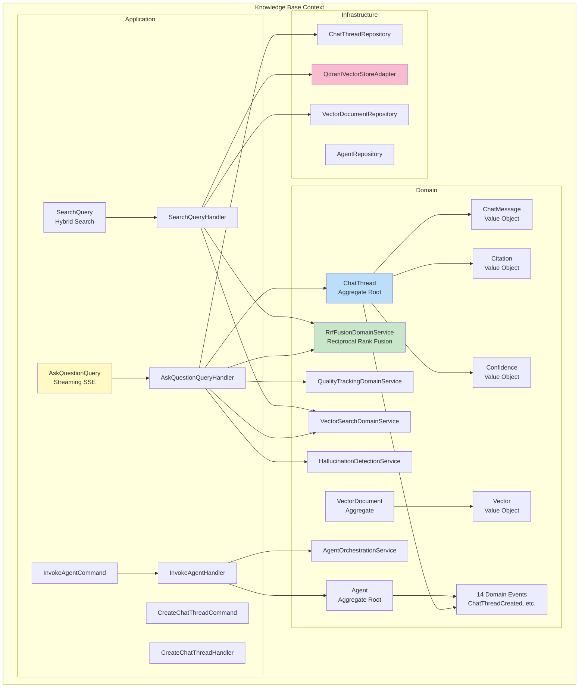
```mermaid
graph TB
    subgraph "Knowledge Base Context"
        subgraph "Domain"
            CHAT[ChatThread<br/>Aggregate Root]
            AGENT[Agent<br/>Aggregate Root]
            VECTOR[VectorDocument<br/>Aggregate]

            MSG[ChatMessage<br/>Value Object]
            CIT[Citation<br/>Value Object]
            CONF[Confidence<br/>Value Object]
            VEC[Vector<br/>Value Object]

            RRF[RrfFusionDomainService<br/>Reciprocal Rank Fusion]
            QUALITY[QualityTrackingDomainService]
            VSEARCH[VectorSearchDomainService]
            ORCH[AgentOrchestrationService]
            HALLUCINATION[HallucinationDetectionService]

            KB_EVT[14 Domain Events<br/>ChatThreadCreated, etc.]
        end

        subgraph "Application"
            ASK_QRY[AskQuestionQuery<br/>Streaming SSE]
            SEARCH_QRY[SearchQuery<br/>Hybrid Search]
            CREATE_THREAD_CMD[CreateChatThreadCommand]
            INVOKE_AGENT_CMD[InvokeAgentCommand]

            ASK_HDL[AskQuestionQueryHandler]
            SEARCH_HDL[SearchQueryHandler]
            CREATE_THREAD_HDL[CreateChatThreadHandler]
            INVOKE_AGENT_HDL[InvokeAgentHandler]
        end

        subgraph "Infrastructure"
            CHAT_REPO[ChatThreadRepository]
            AGENT_REPO[AgentRepository]
            VECTOR_REPO[VectorDocumentRepository]
            QDRANT[QdrantVectorStoreAdapter]
        end
    end

    ASK_QRY --> ASK_HDL
    ASK_HDL --> CHAT
    ASK_HDL --> RRF
    ASK_HDL --> QUALITY
    ASK_HDL --> VSEARCH
    ASK_HDL --> HALLUCINATION

    SEARCH_QRY --> SEARCH_HDL
    SEARCH_HDL --> RRF
    SEARCH_HDL --> VSEARCH
    SEARCH_HDL --> QDRANT

    INVOKE_AGENT_CMD --> INVOKE_AGENT_HDL
    INVOKE_AGENT_HDL --> AGENT
    INVOKE_AGENT_HDL --> ORCH

    ASK_HDL --> CHAT_REPO
    SEARCH_HDL --> VECTOR_REPO

    CHAT --> MSG
    CHAT --> CIT
    CHAT --> CONF

    VECTOR --> VEC

    CHAT --> KB_EVT
    AGENT --> KB_EVT

    style CHAT fill:#bbdefb
    style ASK_QRY fill:#fff9c4
    style RRF fill:#c8e6c9
    style QDRANT fill:#f8bbd0
```

#### Classi Principali

**Domain Entities (Aggregates)**:
- `ChatThread.cs` (Aggregate Root): Thread di conversazione con messaggi, game_id, stato
- `Agent.cs` (Aggregate Root): Agente AI (Chess, Feedback, FollowUp) con strategia e config
- `VectorDocument.cs`: Documento vettoriale con embeddings, metadata, chunk_id
- `Embedding.cs`: Vettore embedding (768 dimensioni)
- `SearchResult.cs`: Risultato ricerca con score, citazioni, confidenza

**Value Objects**:
- `ChatMessage.cs`: Messaggio con ruolo (user/assistant), contenuto, timestamp
- `Citation.cs`: Citazione con documento_id, pagina, snippet
- `Confidence.cs`: Livello confidenza 0.0-1.0 (threshold ≥0.70)
- `Vector.cs`: Array float[768] per embeddings
- `ThreadStatus.cs`: Enum (Open, Closed)
- `ExportFormat.cs`: Enum (JSON, TXT, PDF, MD)
- `AgentType.cs`: Enum (Chess, Feedback, FollowUp)
- `AgentStrategy.cs`: Configurazione strategia agente

**Domain Services** (15):
- `RrfFusionDomainService.cs`: **Reciprocal Rank Fusion** per fusione risultati vector + keyword (70/30)
- `QualityTrackingDomainService.cs`: Tracking qualità risposte RAG (P@10, MRR)
- `VectorSearchDomainService.cs`: Ricerca vettoriale con Qdrant
- `ChatContextDomainService.cs`: Gestione contesto conversazionale
- `AgentOrchestrationService.cs`: Orchestrazione agenti AI
- `LlmCostCalculator.cs`: Calcolo costi token LLM
- `LlmCostAlertService.cs`: Alert superamento soglie costi
- `HallucinationDetectionService.cs`: Rilevamento allucinazioni (5-layer validation)
- `CitationValidationService.cs`: Validazione citazioni da documenti
- `ConfidenceValidationService.cs`: Validazione soglia confidenza ≥0.70
- `MultiModelValidationService.cs`: Validazione consensus multi-modello (GPT-4 + Claude)
- `CosineSimilarityCalculator.cs`: Calcolo similarità coseno per reranking
- `HybridAdaptiveRoutingStrategy.cs`: Routing adattivo tra provider LLM
- `ProviderHealthStatus.cs`: Monitoraggio stato provider
- `CircuitBreakerState.cs`: Circuit breaker per fallback provider

**Domain Events** (14):
```
ChatThreadCreatedEvent
ThreadClosedEvent
ThreadReopenedEvent
MessageAddedEvent
MessageUpdatedEvent
MessageDeletedEvent
AgentCreatedEvent
AgentActivatedEvent
AgentDeactivatedEvent
AgentConfiguredEvent
AgentInvokedEvent
VectorDocumentIndexedEvent
VectorDocumentSearchedEvent
VectorDocumentMetadataUpdatedEvent
```

**Commands** (10):
```
CreateChatThreadCommand, CloseChatThreadCommand, ReopenThreadCommand
AddMessageCommand, UpdateMessageCommand, DeleteMessageCommand
ExportChatCommand
InvokeAgentCommand, ProvideAgentFeedbackCommand
InvokeChessAgentCommand
IndexChessKnowledgeCommand, DeleteChessKnowledgeCommand
```

**Queries** (14):
```
AskQuestionQuery (conversazione principale)
StreamQaQuery (Q&A streaming SSE)
StreamExplainQuery (spiegazioni regole streaming)
StreamSetupGuideQuery (guide setup streaming)
SearchQuery (ricerca ibrida vector+keyword)
SearchChessKnowledgeQuery
GetChatThreadByIdQuery, GetChatThreadsByGameQuery, GetUserChatsQuery
GetAllAgentsQuery, GetAgentByIdQuery
GenerateFollowUpQuestionsQuery (suggerimenti domande)
GetLlmCostReportQuery (report costi)
```

**Repositories**:
- `ChatThreadRepository`: CRUD thread, ricerca per game/user
- `AgentRepository`: CRUD agenti, attivazione/disattivazione
- `VectorDocumentRepository`: CRUD documenti vettoriali, metadata
- `EmbeddingRepository`: CRUD embeddings
- `LlmCostLogRepository`: Tracking costi LLM

**Infrastructure Adapters**:
- `QdrantVectorStoreAdapter.cs`: Adapter per Qdrant (vector store)

---

### 2.4 Document Processing Context

**Responsabilità**: Upload PDF, estrazione testo multi-stage, validazione qualità, conversione tabelle.

#### Architettura del Context

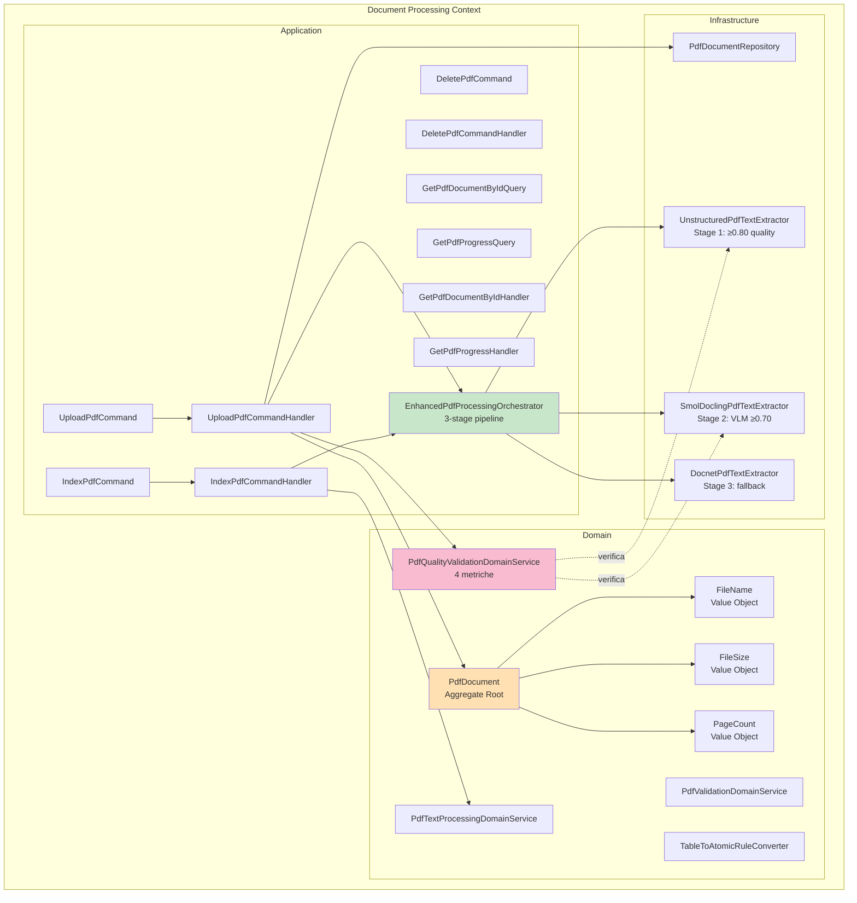
```mermaid
graph TB
    subgraph "Document Processing Context"
        subgraph "Domain"
            PDF[PdfDocument<br/>Aggregate Root]

            FNAME[FileName<br/>Value Object]
            FSIZE[FileSize<br/>Value Object]
            PAGES[PageCount<br/>Value Object]

            QUALITY_SVC[PdfQualityValidationDomainService<br/>4 metriche]
            PROCESS_SVC[PdfTextProcessingDomainService]
            VALIDATE_SVC[PdfValidationDomainService]
            TABLE_SVC[TableToAtomicRuleConverter]
        end

        subgraph "Application"
            UPLOAD_CMD[UploadPdfCommand]
            INDEX_CMD[IndexPdfCommand]
            DELETE_CMD[DeletePdfCommand]

            UPLOAD_HDL[UploadPdfCommandHandler]
            INDEX_HDL[IndexPdfCommandHandler]
            DELETE_HDL[DeletePdfCommandHandler]

            GET_PDF_QRY[GetPdfDocumentByIdQuery]
            GET_PROGRESS_QRY[GetPdfProgressQuery]

            GET_PDF_HDL[GetPdfDocumentByIdHandler]
            GET_PROGRESS_HDL[GetPdfProgressHandler]

            ORCH[EnhancedPdfProcessingOrchestrator<br/>3-stage pipeline]
        end

        subgraph "Infrastructure"
            PDF_REPO[PdfDocumentRepository]

            UNSTRUCTURED[UnstructuredPdfTextExtractor<br/>Stage 1: ≥0.80 quality]
            SMOLDOC[SmolDoclingPdfTextExtractor<br/>Stage 2: VLM ≥0.70]
            DOCNET[DocnetPdfTextExtractor<br/>Stage 3: fallback]
        end
    end

    UPLOAD_CMD --> UPLOAD_HDL
    UPLOAD_HDL --> PDF
    UPLOAD_HDL --> ORCH
    UPLOAD_HDL --> QUALITY_SVC

    INDEX_CMD --> INDEX_HDL
    INDEX_HDL --> ORCH
    INDEX_HDL --> PROCESS_SVC

    ORCH --> UNSTRUCTURED
    ORCH --> SMOLDOC
    ORCH --> DOCNET

    QUALITY_SVC -.verifica.-> UNSTRUCTURED
    QUALITY_SVC -.verifica.-> SMOLDOC

    UPLOAD_HDL --> PDF_REPO

    PDF --> FNAME
    PDF --> FSIZE
    PDF --> PAGES

    style PDF fill:#ffe0b2
    style ORCH fill:#c8e6c9
    style QUALITY_SVC fill:#f8bbd0
```

#### Classi Principali

**Domain Entities (Aggregates)**:
- `PdfDocument.cs` (Aggregate Root): Documento PDF con file_path, dimensione, pagine, stato processing

**Value Objects**:
- `FileName.cs`: Nome file validato (no path traversal)
- `FileSize.cs`: Dimensione in bytes (max 50MB)
- `PageCount.cs`: Numero pagine (1-1000)
- `PdfVersion.cs`: Versione PDF (1.0-2.0)

**Domain Services** (4):
- `PdfQualityValidationDomainService.cs`: **Validazione qualità 4-metric**:
  - Text coverage: 40% (chars/page ratio)
  - Structure detection: 20% (titles, headers, lists)
  - Table detection: 20% (game rules tables)
  - Page coverage: 20% (tutte le pagine processate)
- `PdfTextProcessingDomainService.cs`: Processing e pulizia testo estratto
- `PdfValidationDomainService.cs`: Validazione formato PDF, dimensione, integrità
- `TableToAtomicRuleConverter.cs`: Conversione tabelle → regole atomiche

**Commands** (3):
```
UploadPdfCommand (upload file + validazione)
IndexPdfCommand (estrazione + indexing vettoriale)
DeletePdfCommand (cancellazione fisica + cleanup)
```

**Queries** (5):
```
GetPdfDocumentByIdQuery
GetPdfDocumentsByGameQuery
GetPdfOwnershipQuery (verifica proprietà per sicurezza)
GetPdfProgressQuery (progress bar upload/processing)
GetPdfTextQuery (testo estratto)
```

**Application Services**:
- `EnhancedPdfProcessingOrchestrator.cs`: **Pipeline 3-stage fallback**:
  1. **Stage 1**: Unstructured (80% success rate, 1.3s avg) → quality ≥0.80
  2. **Stage 2**: SmolDocling VLM (15% fallback, 3-5s avg) → quality ≥0.70
  3. **Stage 3**: Docnet (5% fallback, best effort)

**Infrastructure Extractors**:
- `OrchestratedPdfTextExtractor.cs`: Adapter IPdfTextExtractor → Orchestrator
- `UnstructuredPdfTextExtractor.cs`: Stage 1 (Apache 2.0, RAG-optimized)
- `SmolDoclingPdfTextExtractor.cs`: Stage 2 (VLM 256M, layout complessi)
- `DocnetPdfTextExtractor.cs`: Stage 3 (fallback locale veloce)

**Repositories**:
- `PdfDocumentRepository`: CRUD documenti, ricerca per game, tracking stato

---

### 2.5 Workflow Integration Context

**Responsabilità**: Integrazione n8n, gestione workflow, error logging, eventi cross-context.

#### Architettura del Context

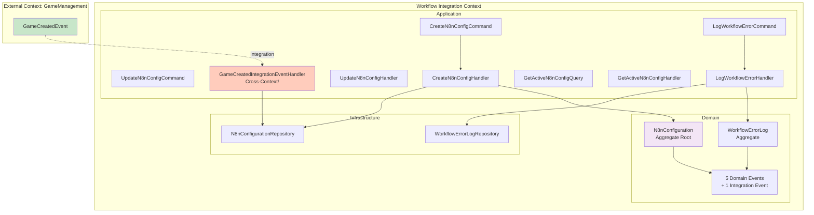
```mermaid
graph TB
    subgraph "Workflow Integration Context"
        subgraph "Domain"
            N8N[N8nConfiguration<br/>Aggregate Root]
            ERROR_LOG[WorkflowErrorLog<br/>Aggregate]

            WF_EVT[5 Domain Events<br/>+ 1 Integration Event]
        end

        subgraph "Application"
            CREATE_N8N_CMD[CreateN8nConfigCommand]
            UPDATE_N8N_CMD[UpdateN8nConfigCommand]
            LOG_ERROR_CMD[LogWorkflowErrorCommand]

            CREATE_N8N_HDL[CreateN8nConfigHandler]
            UPDATE_N8N_HDL[UpdateN8nConfigHandler]
            LOG_ERROR_HDL[LogWorkflowErrorHandler]

            GET_N8N_QRY[GetActiveN8nConfigQuery]
            GET_N8N_HDL[GetActiveN8nConfigHandler]

            GAME_CREATED_INT_HDL[GameCreatedIntegrationEventHandler<br/>Cross-Context!]
        end

        subgraph "Infrastructure"
            N8N_REPO[N8nConfigurationRepository]
            ERROR_REPO[WorkflowErrorLogRepository]
        end
    end

    subgraph "External Context: GameManagement"
        GAME_CREATED_EVT[GameCreatedEvent]
    end

    CREATE_N8N_CMD --> CREATE_N8N_HDL
    CREATE_N8N_HDL --> N8N
    CREATE_N8N_HDL --> N8N_REPO

    LOG_ERROR_CMD --> LOG_ERROR_HDL
    LOG_ERROR_HDL --> ERROR_LOG
    LOG_ERROR_HDL --> ERROR_REPO

    GAME_CREATED_EVT -.integration.-> GAME_CREATED_INT_HDL
    GAME_CREATED_INT_HDL --> N8N_REPO

    N8N --> WF_EVT
    ERROR_LOG --> WF_EVT

    style N8N fill:#f3e5f5
    style GAME_CREATED_INT_HDL fill:#ffccbc
    style GAME_CREATED_EVT fill:#c8e6c9
```

#### Classi Principali

**Domain Entities (Aggregates)**:
- `N8nConfiguration.cs` (Aggregate Root): Configurazione n8n con webhook_url, auth_token, attivo/inattivo
- `WorkflowErrorLog.cs`: Log errori workflow con stack trace, retry count

**Domain Events** (5 + 1 Integration):
```
N8nConfigurationCreatedEvent
N8nConfigurationUpdatedEvent
N8nConfigurationTestedEvent
WorkflowErrorLoggedEvent
WorkflowRetriedEvent

GameCreatedIntegrationEvent (cross-context da GameManagement!)
```

**Commands** (4):
```
CreateN8nConfigCommand
UpdateN8nConfigCommand
DeleteN8nConfigCommand
LogWorkflowErrorCommand
```

**Queries** (3):
```
GetAllN8nConfigsQuery
GetN8nConfigByIdQuery
GetActiveN8nConfigQuery (config attualmente attiva)
```

**Event Handlers** (6):
- 5 handler per eventi propri
- **`GameCreatedIntegrationEventHandler`**: Ascolta `GameCreatedEvent` da GameManagement e triggera workflow n8n

**Repositories**:
- `N8nConfigurationRepository`: CRUD configurazioni n8n
- `WorkflowErrorLogRepository`: CRUD error logs, statistiche retry

---

### 2.6 System Configuration Context

**Responsabilità**: Configurazione runtime, feature flags, versionamento config, rollback.

#### Architettura del Context

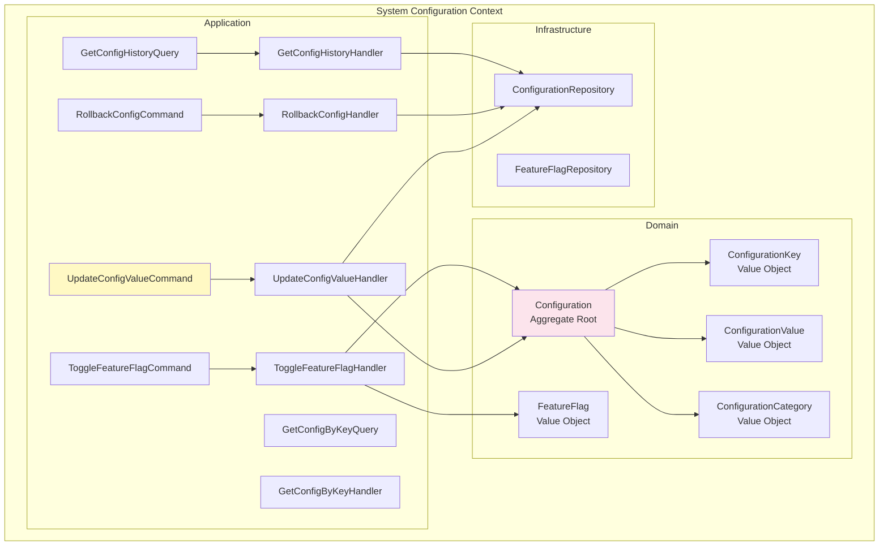
```mermaid
graph TB
    subgraph "System Configuration Context"
        subgraph "Domain"
            CFG[Configuration<br/>Aggregate Root]
            FF[FeatureFlag<br/>Value Object]

            KEY[ConfigurationKey<br/>Value Object]
            VALUE[ConfigurationValue<br/>Value Object]
            CAT[ConfigurationCategory<br/>Value Object]
        end

        subgraph "Application"
            UPDATE_CMD[UpdateConfigValueCommand]
            TOGGLE_CMD[ToggleFeatureFlagCommand]
            ROLLBACK_CMD[RollbackConfigCommand]

            UPDATE_HDL[UpdateConfigValueHandler]
            TOGGLE_HDL[ToggleFeatureFlagHandler]
            ROLLBACK_HDL[RollbackConfigHandler]

            GET_CFG_QRY[GetConfigByKeyQuery]
            GET_HIST_QRY[GetConfigHistoryQuery]

            GET_CFG_HDL[GetConfigByKeyHandler]
            GET_HIST_HDL[GetConfigHistoryHandler]
        end

        subgraph "Infrastructure"
            CFG_REPO[ConfigurationRepository]
            FF_REPO[FeatureFlagRepository]
        end
    end

    UPDATE_CMD --> UPDATE_HDL
    UPDATE_HDL --> CFG
    UPDATE_HDL --> CFG_REPO

    TOGGLE_CMD --> TOGGLE_HDL
    TOGGLE_HDL --> CFG
    TOGGLE_HDL --> FF

    ROLLBACK_CMD --> ROLLBACK_HDL
    ROLLBACK_HDL --> CFG_REPO

    GET_HIST_QRY --> GET_HIST_HDL
    GET_HIST_HDL --> CFG_REPO

    CFG --> KEY
    CFG --> VALUE
    CFG --> CAT

    style CFG fill:#fce4ec
    style UPDATE_CMD fill:#fff9c4
```

#### Classi Principali

**Domain Entities (Aggregates)**:
- `Configuration.cs` (Aggregate Root): Configurazione runtime con key, value, category, versione
- `FeatureFlag.cs`: Feature flag con nome, abilitato/disabilitato, rollout percentage

**Value Objects**:
- `ConfigurationKey.cs`: Chiave univoca (max 100 caratteri)
- `ConfigurationValue.cs`: Valore (stringa, int, bool, json)
- `ConfigurationCategory.cs`: Enum (Features, RateLimit, AI/LLM, RAG, PDF)

**Commands** (10):
```
CreateConfigurationCommand
UpdateConfigValueCommand
DeleteConfigurationCommand
ToggleConfigurationCommand
ToggleFeatureFlagCommand
BulkUpdateConfigsCommand
ImportConfigsCommand
RollbackConfigCommand (rollback a versione precedente)
InvalidateCacheCommand
ValidateConfigCommand
```

**Queries** (6):
```
GetAllConfigsQuery
GetConfigByIdQuery
GetConfigByKeyQuery
GetConfigCategoriesQuery
GetConfigHistoryQuery (versionamento)
ExportConfigsQuery
```

**Repositories**:
- `ConfigurationRepository`: CRUD config, versionamento, history
- `FeatureFlagRepository`: CRUD feature flags, rollout

---

### 2.7 Administration Context

**Responsabilità**: Amministrazione utenti, audit logging, alerting, gestione prompt templates, statistiche.

#### Architettura del Context

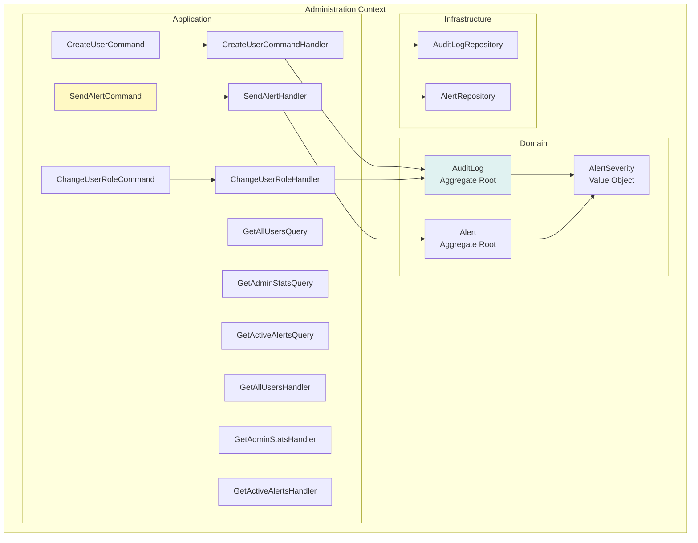
```mermaid
graph TB
    subgraph "Administration Context"
        subgraph "Domain"
            AUDIT[AuditLog<br/>Aggregate Root]
            ALERT[Alert<br/>Aggregate Root]

            SEV[AlertSeverity<br/>Value Object]
        end

        subgraph "Application"
            CREATE_USER_CMD[CreateUserCommand]
            CHANGE_ROLE_CMD[ChangeUserRoleCommand]
            SEND_ALERT_CMD[SendAlertCommand]

            CREATE_USER_HDL[CreateUserCommandHandler]
            CHANGE_ROLE_HDL[ChangeUserRoleHandler]
            SEND_ALERT_HDL[SendAlertHandler]

            GET_USERS_QRY[GetAllUsersQuery]
            GET_STATS_QRY[GetAdminStatsQuery]
            GET_ALERTS_QRY[GetActiveAlertsQuery]

            GET_USERS_HDL[GetAllUsersHandler]
            GET_STATS_HDL[GetAdminStatsHandler]
            GET_ALERTS_HDL[GetActiveAlertsHandler]
        end

        subgraph "Infrastructure"
            AUDIT_REPO[AuditLogRepository]
            ALERT_REPO[AlertRepository]
        end
    end

    CREATE_USER_CMD --> CREATE_USER_HDL
    CREATE_USER_HDL --> AUDIT
    CREATE_USER_HDL --> AUDIT_REPO

    SEND_ALERT_CMD --> SEND_ALERT_HDL
    SEND_ALERT_HDL --> ALERT
    SEND_ALERT_HDL --> ALERT_REPO

    CHANGE_ROLE_CMD --> CHANGE_ROLE_HDL
    CHANGE_ROLE_HDL --> AUDIT

    AUDIT --> SEV
    ALERT --> SEV

    style AUDIT fill:#e0f2f1
    style SEND_ALERT_CMD fill:#fff9c4
```

#### Classi Principali

**Domain Entities (Aggregates)**:
- `AuditLog.cs` (Aggregate Root): Log audit con user_id, azione, timestamp, IP, metadata
- `Alert.cs` (Aggregate Root): Alert sistema con severità, messaggio, risolto/non risolto

**Value Objects**:
- `AlertSeverity.cs`: Enum (Info, Warning, Error, Critical)

**Commands** (13):
```
CreateUserCommand, UpdateUserCommand, DeleteUserCommand
ChangeUserRoleCommand
ResetUserPasswordCommand
SendAlertCommand, ResolveAlertCommand
CreatePromptTemplateCommand, CreatePromptVersionCommand, ActivatePromptVersionCommand
LogAiRequestCommand
ExportStatsCommand
EvaluatePromptCommand, ComparePromptVersionsCommand (prompt evaluation)
```

**Queries** (20):
```
GetAllUsersQuery, GetUserByIdQuery, GetUserByEmailQuery, SearchUsersQuery
GetAdminStatsQuery (dashboard statistiche)
GetActiveAlertsQuery, GetAlertHistoryQuery
GetLlmHealthQuery (stato provider LLM)
GetPromptTemplatesQuery, GetPromptTemplateByIdQuery, GetPromptTemplateQuery
ListPromptTemplatesQuery
GetPromptVersionsQuery, GetPromptVersionQuery, GetActivePromptVersionQuery
GetPromptVersionHistoryQuery
GetPromptAuditLogQuery
GetAiRequestsQuery, GetAiRequestStatsQuery, GetLowQualityResponsesQuery
GetEvaluationHistoryQuery, GenerateEvaluationReportQuery
GenerateQualityReportQuery (report qualità risposte)
```

**Repositories**:
- `AuditLogRepository`: CRUD audit logs, ricerca per user/azione/periodo
- `AlertRepository`: CRUD alert, query alert attivi, statistiche

---

## 3. Pattern Architetturali

### 3.1 CQRS Pattern (Command Query Responsibility Segregation)

MeepleAI separa completamente **Commands** (modificano stato) e **Queries** (solo lettura).

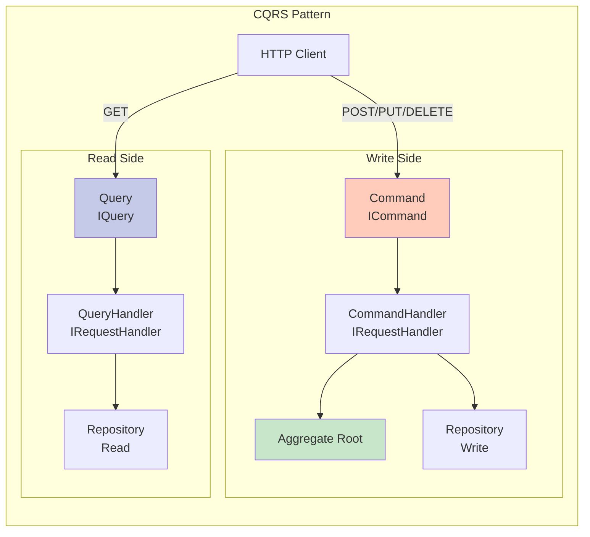
```mermaid
graph LR
    subgraph "CQRS Pattern"
        CLIENT[HTTP Client]

        subgraph "Write Side"
            CMD[Command<br/>ICommand]
            CMD_HDL[CommandHandler<br/>IRequestHandler]
            AGG[Aggregate Root]
            REPO_W[Repository<br/>Write]
        end

        subgraph "Read Side"
            QRY[Query<br/>IQuery]
            QRY_HDL[QueryHandler<br/>IRequestHandler]
            REPO_R[Repository<br/>Read]
        end

        CLIENT -->|POST/PUT/DELETE| CMD
        CLIENT -->|GET| QRY

        CMD --> CMD_HDL
        CMD_HDL --> AGG
        CMD_HDL --> REPO_W

        QRY --> QRY_HDL
        QRY_HDL --> REPO_R
    end

    style CMD fill:#ffccbc
    style QRY fill:#c5cae9
    style AGG fill:#c8e6c9
```

**Esempio Command**:
```csharp
// Command (modifica stato)
public record CreateGameCommand(string Title, string Publisher, int YearPublished) : ICommand;

// Handler
public class CreateGameCommandHandler : IRequestHandler<CreateGameCommand, Result<Guid>>
{
    private readonly IGameRepository _repository;

    public async Task<Result<Guid>> Handle(CreateGameCommand command, CancellationToken ct)
    {
        // 1. Crea aggregate
        var game = Game.Create(command.Title, command.Publisher, command.YearPublished);

        // 2. Salva (genera domain event)
        await _repository.AddAsync(game, ct);
        await _unitOfWork.SaveChangesAsync(ct);

        return Result.Success(game.Id);
    }
}
```

**Esempio Query**:
```csharp
// Query (solo lettura)
public record GetGameByIdQuery(Guid GameId) : IQuery<GameDto>;

// Handler
public class GetGameByIdQueryHandler : IRequestHandler<GetGameByIdQuery, GameDto>
{
    private readonly IGameRepository _repository;

    public async Task<GameDto> Handle(GetGameByIdQuery query, CancellationToken ct)
    {
        var game = await _repository.GetByIdAsync(query.GameId, ct);
        return GameDto.FromDomain(game); // Proiezione read-only
    }
}
```

**Streaming Queries** (SSE per RAG):
```csharp
// Streaming Query (SSE)
public record AskQuestionQuery(string Question, Guid? GameId) : IStreamingQuery<string>;

// Handler
public class AskQuestionQueryHandler : IStreamingQueryHandler<AskQuestionQuery, string>
{
    public async IAsyncEnumerable<string> Handle(AskQuestionQuery query, CancellationToken ct)
    {
        // Stream chunks SSE
        await foreach (var chunk in _ragService.StreamAnswerAsync(query.Question, ct))
        {
            yield return chunk;
        }
    }
}
```

---

### 3.2 Domain Events Pattern

Gli **Aggregates** generano **Domain Events** che vengono dispatchati dopo SaveChanges.

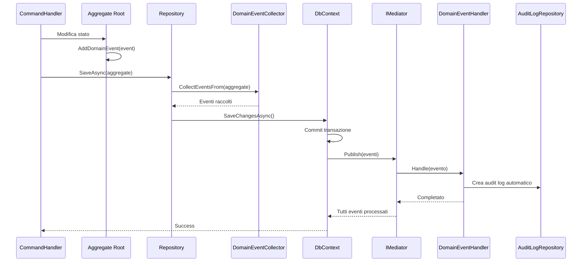
```mermaid
sequenceDiagram
    participant Handler as CommandHandler
    participant Aggregate as Aggregate Root
    participant Repo as Repository
    participant Collector as DomainEventCollector
    participant DB as DbContext
    participant Mediator as IMediator
    participant EventHandler as DomainEventHandler
    participant Audit as AuditLogRepository

    Handler->>Aggregate: Modifica stato
    Aggregate->>Aggregate: AddDomainEvent(event)
    Handler->>Repo: SaveAsync(aggregate)
    Repo->>Collector: CollectEventsFrom(aggregate)
    Collector-->>Repo: Eventi raccolti
    Repo->>DB: SaveChangesAsync()
    DB->>DB: Commit transazione
    DB->>Mediator: Publish(eventi)
    Mediator->>EventHandler: Handle(evento)
    EventHandler->>Audit: Crea audit log automatico
    EventHandler-->>Mediator: Completato
    Mediator-->>DB: Tutti eventi processati
    DB-->>Handler: Success
```

**Esempio Aggregate con Domain Event**:
```csharp
public class Game : AggregateRoot
{
    public GameTitle Title { get; private set; }
    public Publisher Publisher { get; private set; }

    private Game() {} // EF Core

    public static Game Create(string title, string publisher, int year)
    {
        var game = new Game
        {
            Id = Guid.NewGuid(),
            Title = new GameTitle(title),
            Publisher = new Publisher(publisher),
            YearPublished = new YearPublished(year)
        };

        // Genera domain event
        game.AddDomainEvent(new GameCreatedEvent(game.Id, title));

        return game;
    }

    public void Update(string title, string publisher)
    {
        Title = new GameTitle(title);
        Publisher = new Publisher(publisher);

        // Genera domain event
        AddDomainEvent(new GameUpdatedEvent(Id, title));
    }
}
```

**Domain Event**:
```csharp
public sealed class GameCreatedEvent : DomainEventBase
{
    public Guid GameId { get; }
    public string Title { get; }

    public GameCreatedEvent(Guid gameId, string title)
    {
        GameId = gameId;
        Title = title;
    }
}
```

**Event Handler con Auto-Audit**:
```csharp
public class GameCreatedEventHandler : DomainEventHandlerBase<GameCreatedEvent>
{
    private readonly IAuditLogRepository _auditLogRepository;

    public override async Task Handle(GameCreatedEvent notification, CancellationToken ct)
    {
        // Auto-audit (base class)
        await base.Handle(notification, ct);

        // Business logic specifica
        _logger.LogInformation("Gioco creato: {Title} (ID: {GameId})",
            notification.Title, notification.GameId);

        // Altri side-effects...
    }
}
```

**Integration Events** (cross-context):
```csharp
// GameManagement → WorkflowIntegration
public sealed class GameCreatedIntegrationEvent : IntegrationEventBase
{
    public Guid GameId { get; }
    public string Title { get; }

    public GameCreatedIntegrationEvent(Guid gameId, string title)
    {
        GameId = gameId;
        Title = title;
    }
}

// Handler in WorkflowIntegration context
public class GameCreatedIntegrationEventHandler : INotificationHandler<GameCreatedIntegrationEvent>
{
    private readonly IN8nConfigurationRepository _n8nRepo;

    public async Task Handle(GameCreatedIntegrationEvent notification, CancellationToken ct)
    {
        // Triggera workflow n8n per nuovo gioco
        var config = await _n8nRepo.GetActiveConfigAsync(ct);
        await _n8nService.TriggerWorkflowAsync(config.WebhookUrl, notification);
    }
}
```

---

### 3.3 Repository Pattern

I **Repositories** sono pura infrastruttura e raccolgono **Domain Events** prima di SaveChanges.

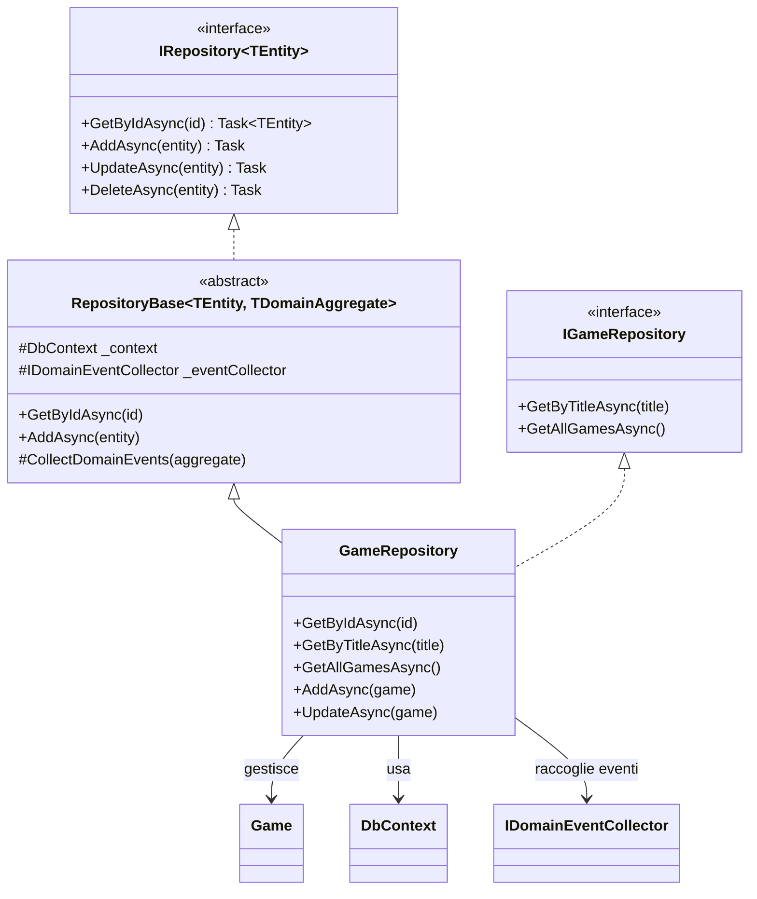
```mermaid
classDiagram
    class IRepository~TEntity~ {
        <<interface>>
        +GetByIdAsync(id) Task~TEntity~
        +AddAsync(entity) Task
        +UpdateAsync(entity) Task
        +DeleteAsync(entity) Task
    }

    class RepositoryBase~TEntity, TDomainAggregate~ {
        <<abstract>>
        #DbContext _context
        #IDomainEventCollector _eventCollector
        +GetByIdAsync(id)
        +AddAsync(entity)
        #CollectDomainEvents(aggregate)
    }

    class GameRepository {
        +GetByIdAsync(id)
        +GetByTitleAsync(title)
        +GetAllGamesAsync()
        +AddAsync(game)
        +UpdateAsync(game)
    }

    class IGameRepository {
        <<interface>>
        +GetByTitleAsync(title)
        +GetAllGamesAsync()
    }

    IRepository~TEntity~ <|.. RepositoryBase
    RepositoryBase <|-- GameRepository
    IGameRepository <|.. GameRepository

    GameRepository --> Game : gestisce
    GameRepository --> DbContext : usa
    GameRepository --> IDomainEventCollector : raccoglie eventi
```

**Esempio RepositoryBase** (SharedKernel):
```csharp
public abstract class RepositoryBase<TEntity, TDomainAggregate> : IRepository<TEntity>
    where TEntity : class
    where TDomainAggregate : IAggregateRoot
{
    protected readonly DbContext _context;
    protected readonly DbSet<TEntity> _dbSet;
    protected readonly IDomainEventCollector _eventCollector;

    protected RepositoryBase(
        DbContext context,
        IDomainEventCollector eventCollector)
    {
        _context = context;
        _dbSet = context.Set<TEntity>();
        _eventCollector = eventCollector;
    }

    public virtual async Task<TEntity?> GetByIdAsync(Guid id, CancellationToken ct = default)
    {
        return await _dbSet.FindAsync(new object[] { id }, ct);
    }

    public virtual async Task AddAsync(TEntity entity, CancellationToken ct = default)
    {
        await _dbSet.AddAsync(entity, ct);

        // Raccogli domain events dall'aggregate
        if (entity is TDomainAggregate aggregate)
        {
            _eventCollector.CollectEventsFrom(aggregate);
        }
    }

    public virtual Task UpdateAsync(TEntity entity, CancellationToken ct = default)
    {
        _dbSet.Update(entity);

        // Raccogli domain events
        if (entity is TDomainAggregate aggregate)
        {
            _eventCollector.CollectEventsFrom(aggregate);
        }

        return Task.CompletedTask;
    }
}
```

**Esempio GameRepository**:
```csharp
public class GameRepository : RepositoryBase<GameEntity, Game>, IGameRepository
{
    public GameRepository(
        MeepleAiDbContext context,
        IDomainEventCollector eventCollector)
        : base(context, eventCollector)
    {
    }

    public async Task<GameEntity?> GetByTitleAsync(string title, CancellationToken ct)
    {
        return await _dbSet
            .AsNoTracking() // Performance!
            .FirstOrDefaultAsync(g => g.Title == title, ct);
    }

    public async Task<List<GameEntity>> GetAllGamesAsync(CancellationToken ct)
    {
        return await _dbSet
            .AsNoTracking()
            .OrderBy(g => g.Title)
            .ToListAsync(ct);
    }
}
```

---

### 3.4 MediatR Pipeline

Tutti gli **Endpoints HTTP** usano **IMediator** per delegare a Commands/Queries.

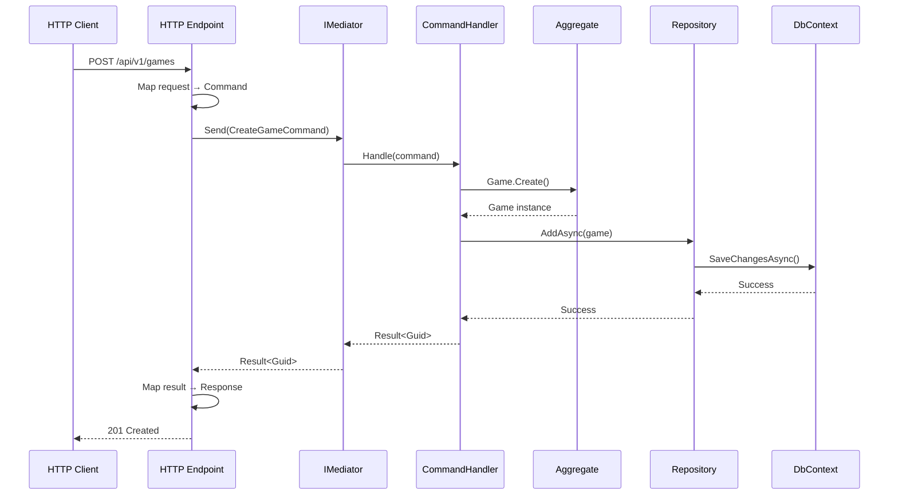
```mermaid
sequenceDiagram
    participant Client as HTTP Client
    participant Endpoint as HTTP Endpoint
    participant Mediator as IMediator
    participant Handler as CommandHandler
    participant Aggregate as Aggregate
    participant Repo as Repository
    participant DB as DbContext

    Client->>Endpoint: POST /api/v1/games
    Endpoint->>Endpoint: Map request → Command
    Endpoint->>Mediator: Send(CreateGameCommand)
    Mediator->>Handler: Handle(command)
    Handler->>Aggregate: Game.Create()
    Aggregate-->>Handler: Game instance
    Handler->>Repo: AddAsync(game)
    Repo->>DB: SaveChangesAsync()
    DB-->>Repo: Success
    Repo-->>Handler: Success
    Handler-->>Mediator: Result<Guid>
    Mediator-->>Endpoint: Result<Guid>
    Endpoint->>Endpoint: Map result → Response
    Endpoint-->>Client: 201 Created
```

**Esempio Endpoint**:
```csharp
// Routing/GameEndpoints.cs
public static class GameEndpoints
{
    public static void MapGameEndpoints(this IEndpointRouteBuilder app)
    {
        var group = app.MapGroup("/api/v1/games").WithTags("Games");

        // Command endpoint
        group.MapPost("/", async (
            CreateGameRequest request,
            IMediator mediator,
            CancellationToken ct) =>
        {
            var command = new CreateGameCommand(
                request.Title,
                request.Publisher,
                request.YearPublished
            );

            var result = await mediator.Send(command, ct);

            return result.IsSuccess
                ? Results.Created($"/api/v1/games/{result.Value}", result.Value)
                : Results.BadRequest(result.Error);
        })
        .RequireAuthorization() // Policy-based
        .WithName("CreateGame")
        .Produces<Guid>(StatusCodes.Status201Created);

        // Query endpoint
        group.MapGet("/{id:guid}", async (
            Guid id,
            IMediator mediator,
            CancellationToken ct) =>
        {
            var query = new GetGameByIdQuery(id);
            var game = await mediator.Send(query, ct);

            return game is not null
                ? Results.Ok(game)
                : Results.NotFound();
        })
        .WithName("GetGameById")
        .Produces<GameDto>(StatusCodes.Status200OK)
        .Produces(StatusCodes.Status404NotFound);
    }
}
```

**Vantaggi MediatR**:
- ✅ Endpoints sottili (no business logic)
- ✅ Testabilità (mock IMediator)
- ✅ Separazione responsabilità
- ✅ Pipeline behaviors (logging, validation, caching)

---

### 3.5 Dependency Injection

Ogni **Bounded Context** registra i propri servizi con extension methods.

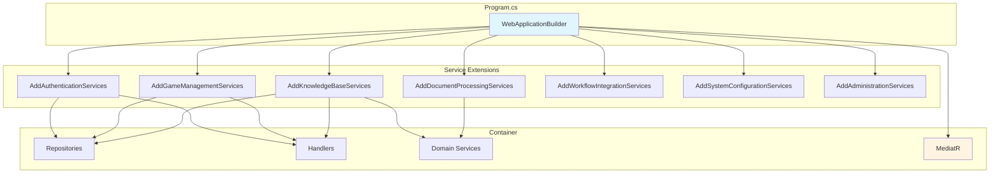
```mermaid
graph TB
    subgraph "Program.cs"
        BUILDER[WebApplicationBuilder]
    end

    subgraph "Service Extensions"
        AUTH_EXT[AddAuthenticationServices]
        GAME_EXT[AddGameManagementServices]
        KB_EXT[AddKnowledgeBaseServices]
        DOC_EXT[AddDocumentProcessingServices]
        WF_EXT[AddWorkflowIntegrationServices]
        CFG_EXT[AddSystemConfigurationServices]
        ADMIN_EXT[AddAdministrationServices]
    end

    subgraph "Container"
        REPO[Repositories]
        HANDLER[Handlers]
        SVC[Domain Services]
        MEDIATOR[MediatR]
    end

    BUILDER --> AUTH_EXT
    BUILDER --> GAME_EXT
    BUILDER --> KB_EXT
    BUILDER --> DOC_EXT
    BUILDER --> WF_EXT
    BUILDER --> CFG_EXT
    BUILDER --> ADMIN_EXT

    AUTH_EXT --> REPO
    GAME_EXT --> REPO
    KB_EXT --> REPO

    AUTH_EXT --> HANDLER
    GAME_EXT --> HANDLER
    KB_EXT --> HANDLER

    KB_EXT --> SVC
    DOC_EXT --> SVC

    BUILDER --> MEDIATOR

    style BUILDER fill:#e1f5ff
    style MEDIATOR fill:#fff4e1
```

**Esempio Extension Method**:
```csharp
// BoundedContexts/GameManagement/Infrastructure/DependencyInjection/GameManagementServiceExtensions.cs
public static class GameManagementServiceExtensions
{
    public static IServiceCollection AddGameManagementServices(this IServiceCollection services)
    {
        // Repositories
        services.AddScoped<IGameRepository, GameRepository>();
        services.AddScoped<IGameSessionRepository, GameSessionRepository>();

        // Domain Services
        services.AddScoped<RuleSpecVersioningDomainService>();
        services.AddScoped<RuleSpecDiffDomainService>();
        services.AddScoped<RuleAtomParsingDomainService>();

        // Handlers (automatici con MediatR Assembly scanning)
        // services.AddMediatR(cfg => cfg.RegisterServicesFromAssembly(Assembly.GetExecutingAssembly()));

        return services;
    }
}
```

**Registrazione in Program.cs**:
```csharp
// Program.cs
var builder = WebApplication.CreateBuilder(args);

// Infrastructure
builder.Services.AddDbContext<MeepleAiDbContext>();
builder.Services.AddScoped<IUnitOfWork, EfCoreUnitOfWork>();
builder.Services.AddScoped<IDomainEventCollector, DomainEventCollector>();

// MediatR (scansiona tutti gli assembly)
builder.Services.AddMediatR(cfg =>
{
    cfg.RegisterServicesFromAssembly(typeof(Program).Assembly);
    cfg.RegisterServicesFromAssembly(typeof(CreateGameCommand).Assembly);
    // ... altri assembly
});

// Bounded Contexts
builder.Services.AddAuthenticationServices();
builder.Services.AddGameManagementServices();
builder.Services.AddKnowledgeBaseServices();
builder.Services.AddDocumentProcessingServices();
builder.Services.AddWorkflowIntegrationServices();
builder.Services.AddSystemConfigurationServices();
builder.Services.AddAdministrationServices();
```

---

## 4. Interazioni tra Classi

### 4.1 Flusso Completo: Create Game

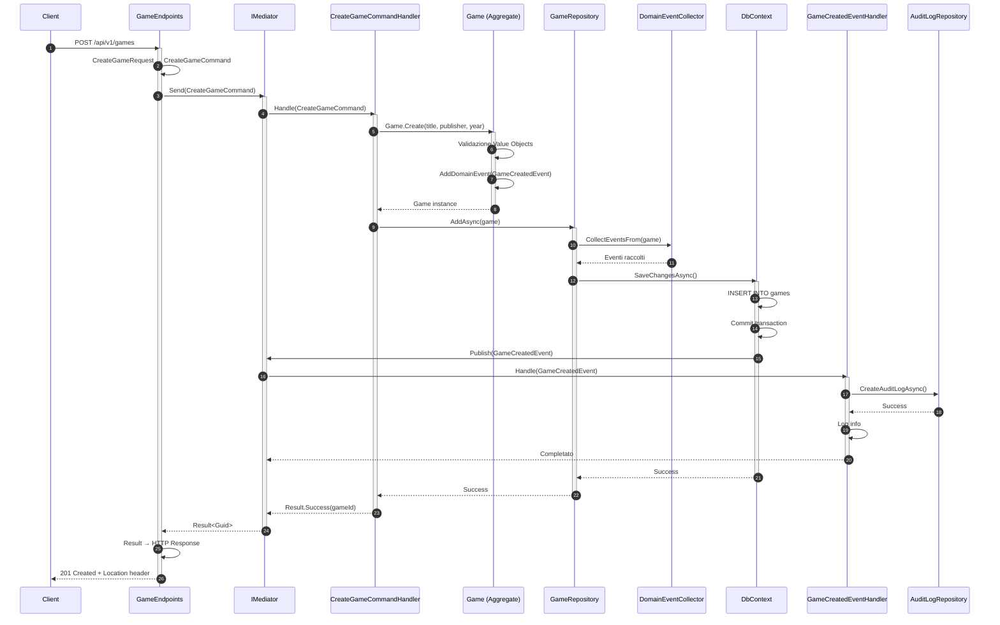
```mermaid
sequenceDiagram
    autonumber
    participant Client
    participant Endpoint as GameEndpoints
    participant Mediator as IMediator
    participant Handler as CreateGameCommandHandler
    participant Game as Game (Aggregate)
    participant Repo as GameRepository
    participant Collector as DomainEventCollector
    participant DB as DbContext
    participant EventHandler as GameCreatedEventHandler
    participant Audit as AuditLogRepository

    Client->>Endpoint: POST /api/v1/games
    activate Endpoint
    Endpoint->>Endpoint: CreateGameRequest → CreateGameCommand
    Endpoint->>Mediator: Send(CreateGameCommand)
    activate Mediator

    Mediator->>Handler: Handle(CreateGameCommand)
    activate Handler

    Handler->>Game: Game.Create(title, publisher, year)
    activate Game
    Game->>Game: Validazione Value Objects
    Game->>Game: AddDomainEvent(GameCreatedEvent)
    Game-->>Handler: Game instance
    deactivate Game

    Handler->>Repo: AddAsync(game)
    activate Repo
    Repo->>Collector: CollectEventsFrom(game)
    Collector-->>Repo: Eventi raccolti
    Repo->>DB: SaveChangesAsync()
    activate DB
    DB->>DB: INSERT INTO games
    DB->>DB: Commit transaction

    DB->>Mediator: Publish(GameCreatedEvent)
    Mediator->>EventHandler: Handle(GameCreatedEvent)
    activate EventHandler
    EventHandler->>Audit: CreateAuditLogAsync()
    Audit-->>EventHandler: Success
    EventHandler->>EventHandler: Log info
    EventHandler-->>Mediator: Completato
    deactivate EventHandler

    DB-->>Repo: Success
    deactivate DB
    Repo-->>Handler: Success
    deactivate Repo

    Handler-->>Mediator: Result.Success(gameId)
    deactivate Handler
    Mediator-->>Endpoint: Result<Guid>
    deactivate Mediator

    Endpoint->>Endpoint: Result → HTTP Response
    Endpoint-->>Client: 201 Created + Location header
    deactivate Endpoint
```

### 4.2 Flusso Completo: RAG Question Answering (Streaming SSE)

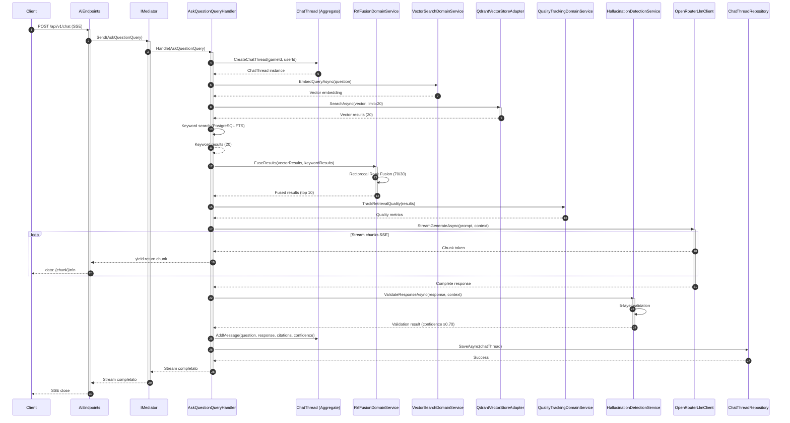
```mermaid
sequenceDiagram
    autonumber
    participant Client
    participant Endpoint as AiEndpoints
    participant Mediator as IMediator
    participant Handler as AskQuestionQueryHandler
    participant Chat as ChatThread (Aggregate)
    participant RRF as RrfFusionDomainService
    participant Vector as VectorSearchDomainService
    participant Qdrant as QdrantVectorStoreAdapter
    participant Quality as QualityTrackingDomainService
    participant Hallucination as HallucinationDetectionService
    participant LLM as OpenRouterLlmClient
    participant Repo as ChatThreadRepository

    Client->>Endpoint: POST /api/v1/chat (SSE)
    activate Endpoint
    Endpoint->>Mediator: Send(AskQuestionQuery)
    activate Mediator

    Mediator->>Handler: Handle(AskQuestionQuery)
    activate Handler

    Handler->>Chat: CreateChatThread(gameId, userId)
    Chat-->>Handler: ChatThread instance

    Handler->>Vector: EmbedQueryAsync(question)
    Vector-->>Handler: Vector embedding

    Handler->>Qdrant: SearchAsync(vector, limit=20)
    activate Qdrant
    Qdrant-->>Handler: Vector results (20)
    deactivate Qdrant

    Handler->>Handler: Keyword search (PostgreSQL FTS)
    Handler-->>Handler: Keyword results (20)

    Handler->>RRF: FuseResults(vectorResults, keywordResults)
    activate RRF
    RRF->>RRF: Reciprocal Rank Fusion (70/30)
    RRF-->>Handler: Fused results (top 10)
    deactivate RRF

    Handler->>Quality: TrackRetrievalQuality(results)
    Quality-->>Handler: Quality metrics

    Handler->>LLM: StreamGenerateAsync(prompt, context)
    activate LLM

    loop Stream chunks SSE
        LLM-->>Handler: Chunk token
        Handler-->>Endpoint: yield return chunk
        Endpoint-->>Client: data: {chunk}\n\n
    end

    LLM-->>Handler: Complete response
    deactivate LLM

    Handler->>Hallucination: ValidateResponseAsync(response, context)
    activate Hallucination
    Hallucination->>Hallucination: 5-layer validation
    Hallucination-->>Handler: Validation result (confidence ≥0.70)
    deactivate Hallucination

    Handler->>Chat: AddMessage(question, response, citations, confidence)

    Handler->>Repo: SaveAsync(chatThread)
    Repo-->>Handler: Success

    Handler-->>Mediator: Stream completato
    deactivate Handler
    Mediator-->>Endpoint: Stream completato
    deactivate Mediator
    Endpoint-->>Client: SSE close
    deactivate Endpoint
```

### 4.3 Flusso Completo: PDF Upload + Processing

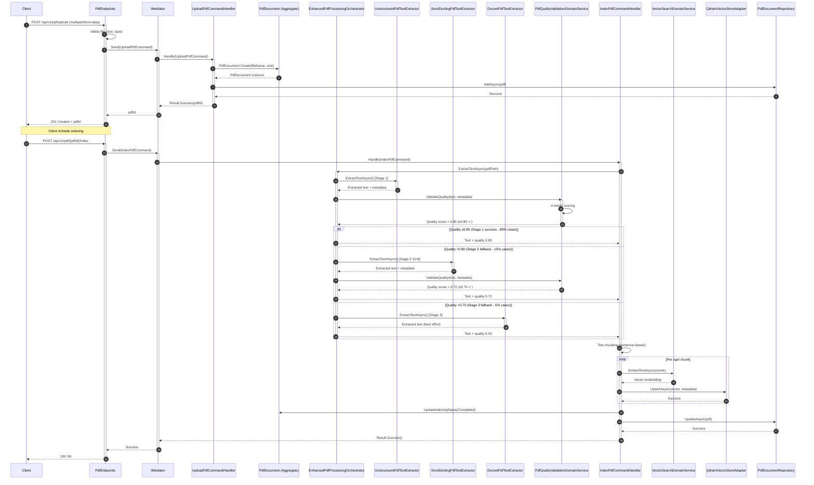
```mermaid
sequenceDiagram
    autonumber
    participant Client
    participant Endpoint as PdfEndpoints
    participant Mediator as IMediator
    participant UploadHandler as UploadPdfCommandHandler
    participant Pdf as PdfDocument (Aggregate)
    participant Orch as EnhancedPdfProcessingOrchestrator
    participant Unstructured as UnstructuredPdfTextExtractor
    participant SmolDoc as SmolDoclingPdfTextExtractor
    participant Docnet as DocnetPdfTextExtractor
    participant Quality as PdfQualityValidationDomainService
    participant IndexHandler as IndexPdfCommandHandler
    participant Vector as VectorSearchDomainService
    participant Qdrant as QdrantVectorStoreAdapter
    participant Repo as PdfDocumentRepository

    Client->>Endpoint: POST /api/v1/pdf/upload (multipart/form-data)
    activate Endpoint

    Endpoint->>Endpoint: Valida file (size, type)
    Endpoint->>Mediator: Send(UploadPdfCommand)
    activate Mediator

    Mediator->>UploadHandler: Handle(UploadPdfCommand)
    activate UploadHandler

    UploadHandler->>Pdf: PdfDocument.Create(fileName, size)
    Pdf-->>UploadHandler: PdfDocument instance

    UploadHandler->>Repo: AddAsync(pdf)
    Repo-->>UploadHandler: Success

    UploadHandler-->>Mediator: Result.Success(pdfId)
    deactivate UploadHandler
    Mediator-->>Endpoint: pdfId
    deactivate Mediator

    Endpoint-->>Client: 201 Created + pdfId
    deactivate Endpoint

    Note over Client,Endpoint: Client richiede indexing

    Client->>Endpoint: POST /api/v1/pdf/{pdfId}/index
    activate Endpoint
    Endpoint->>Mediator: Send(IndexPdfCommand)
    activate Mediator

    Mediator->>IndexHandler: Handle(IndexPdfCommand)
    activate IndexHandler

    IndexHandler->>Orch: ExtractTextAsync(pdfPath)
    activate Orch

    Orch->>Unstructured: ExtractTextAsync() [Stage 1]
    activate Unstructured
    Unstructured-->>Orch: Extracted text + metadata
    deactivate Unstructured

    Orch->>Quality: ValidateQuality(text, metadata)
    activate Quality
    Quality->>Quality: 4-metric scoring
    Quality-->>Orch: Quality score = 0.85 (≥0.80 ✓)
    deactivate Quality

    alt Quality ≥0.80 (Stage 1 success - 80% cases)
        Orch-->>IndexHandler: Text + quality 0.85
    else Quality <0.80 (Stage 2 fallback - 15% cases)
        Orch->>SmolDoc: ExtractTextAsync() [Stage 2 VLM]
        activate SmolDoc
        SmolDoc-->>Orch: Extracted text + metadata
        deactivate SmolDoc
        Orch->>Quality: ValidateQuality(text, metadata)
        Quality-->>Orch: Quality score = 0.72 (≥0.70 ✓)
        Orch-->>IndexHandler: Text + quality 0.72
    else Quality <0.70 (Stage 3 fallback - 5% cases)
        Orch->>Docnet: ExtractTextAsync() [Stage 3]
        activate Docnet
        Docnet-->>Orch: Extracted text (best effort)
        deactivate Docnet
        Orch-->>IndexHandler: Text + quality 0.50
    end

    deactivate Orch

    IndexHandler->>IndexHandler: Text chunking (sentence-based)

    loop Per ogni chunk
        IndexHandler->>Vector: EmbedTextAsync(chunk)
        Vector-->>IndexHandler: Vector embedding
        IndexHandler->>Qdrant: UpsertAsync(vector, metadata)
        Qdrant-->>IndexHandler: Success
    end

    IndexHandler->>Pdf: UpdateIndexingStatus(Completed)
    IndexHandler->>Repo: UpdateAsync(pdf)
    Repo-->>IndexHandler: Success

    IndexHandler-->>Mediator: Result.Success()
    deactivate IndexHandler
    Mediator-->>Endpoint: Success
    deactivate Mediator

    Endpoint-->>Client: 200 OK
    deactivate Endpoint
```

### 4.4 Flusso Integration Event: GameCreated → n8n Workflow

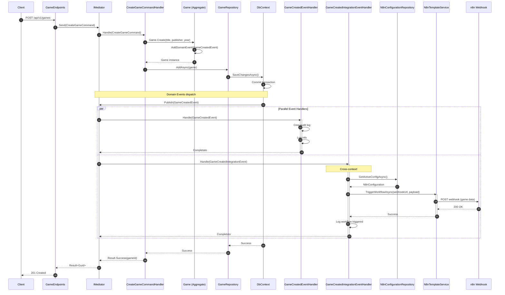
```mermaid
sequenceDiagram
    autonumber
    participant Client
    participant GameEndpoint as GameEndpoints
    participant Mediator as IMediator
    participant GameHandler as CreateGameCommandHandler
    participant Game as Game (Aggregate)
    participant GameRepo as GameRepository
    participant DB as DbContext
    participant GameEventHandler as GameCreatedEventHandler
    participant IntEventHandler as GameCreatedIntegrationEventHandler
    participant N8nRepo as N8nConfigurationRepository
    participant N8nService as N8nTemplateService
    participant N8n as n8n Webhook

    Client->>GameEndpoint: POST /api/v1/games
    GameEndpoint->>Mediator: Send(CreateGameCommand)
    Mediator->>GameHandler: Handle(CreateGameCommand)

    GameHandler->>Game: Game.Create(title, publisher, year)
    Game->>Game: AddDomainEvent(GameCreatedEvent)
    Game-->>GameHandler: Game instance

    GameHandler->>GameRepo: AddAsync(game)
    GameRepo->>DB: SaveChangesAsync()
    DB->>DB: Commit transaction

    Note over DB,Mediator: Domain Events dispatch

    DB->>Mediator: Publish(GameCreatedEvent)

    par Parallel Event Handlers
        Mediator->>GameEventHandler: Handle(GameCreatedEvent)
        activate GameEventHandler
        GameEventHandler->>GameEventHandler: Crea audit log
        GameEventHandler->>GameEventHandler: Log info
        GameEventHandler-->>Mediator: Completato
        deactivate GameEventHandler
    and
        Mediator->>IntEventHandler: Handle(GameCreatedIntegrationEvent)
        activate IntEventHandler
        Note over IntEventHandler: Cross-context!
        IntEventHandler->>N8nRepo: GetActiveConfigAsync()
        N8nRepo-->>IntEventHandler: N8nConfiguration

        IntEventHandler->>N8nService: TriggerWorkflowAsync(webhookUrl, payload)
        activate N8nService
        N8nService->>N8n: POST webhook (game data)
        N8n-->>N8nService: 200 OK
        N8nService-->>IntEventHandler: Success
        deactivate N8nService

        IntEventHandler->>IntEventHandler: Log workflow triggered
        IntEventHandler-->>Mediator: Completato
        deactivate IntEventHandler
    end

    DB-->>GameRepo: Success
    GameRepo-->>GameHandler: Success
    GameHandler-->>Mediator: Result.Success(gameId)
    Mediator-->>GameEndpoint: Result<Guid>
    GameEndpoint-->>Client: 201 Created
```

---

## 5. Flussi dei Casi d'Uso

### 5.1 Caso d'Uso: Registrazione e Login con 2FA

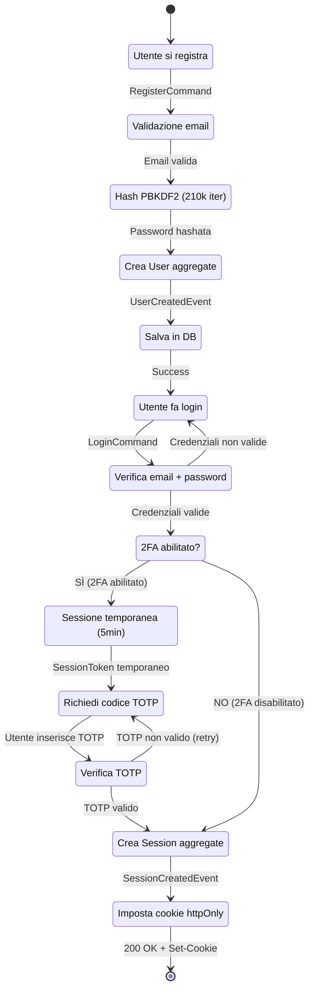
```mermaid
stateDiagram-v2
    [*] --> Registrazione

    Registrazione: Utente si registra
    Registrazione --> EmailValidation: RegisterCommand
    EmailValidation: Validazione email
    EmailValidation --> PasswordHashing: Email valida
    PasswordHashing: Hash PBKDF2 (210k iter)
    PasswordHashing --> CreateUser: Password hashata
    CreateUser: Crea User aggregate
    CreateUser --> SaveUser: UserCreatedEvent
    SaveUser: Salva in DB
    SaveUser --> LoginPrompt: Success

    LoginPrompt: Utente fa login
    LoginPrompt --> ValidateCredentials: LoginCommand
    ValidateCredentials: Verifica email + password
    ValidateCredentials --> Check2FA: Credenziali valide
    Check2FA: 2FA abilitato?

    Check2FA --> CreateTempSession: SÌ (2FA abilitato)
    CreateTempSession: Sessione temporanea (5min)
    CreateTempSession --> Prompt2FA: SessionToken temporaneo
    Prompt2FA: Richiedi codice TOTP
    Prompt2FA --> Verify2FA: Utente inserisce TOTP
    Verify2FA: Verifica TOTP
    Verify2FA --> CreateSession: TOTP valido

    Check2FA --> CreateSession: NO (2FA disabilitato)
    CreateSession: Crea Session aggregate
    CreateSession --> SetCookie: SessionCreatedEvent
    SetCookie: Imposta cookie httpOnly
    SetCookie --> [*]: 200 OK + Set-Cookie

    Verify2FA --> Prompt2FA: TOTP non valido (retry)
    ValidateCredentials --> LoginPrompt: Credenziali non valide
```

**Classes Coinvolte**:
1. **RegisterCommand** → **RegisterCommandHandler**
   - Valida email (Email value object)
   - Hash password (PasswordHash value object con PBKDF2)
   - Crea User aggregate
   - Salva in UserRepository
   - Genera UserCreatedEvent

2. **LoginCommand** → **LoginCommandHandler**
   - Valida credenziali
   - Controlla 2FA status (Get2FAStatusQuery)
   - Se 2FA abilitato: crea TempSession (5 minuti)
   - Altrimenti: crea Session definitiva
   - Imposta cookie httpOnly

3. **Verify2FAQuery** → **Verify2FAQueryHandler**
   - Valida TOTP code (TotpSecret value object)
   - Promuove TempSession → Session definitiva
   - TwoFactorVerifiedEvent

### 5.2 Caso d'Uso: Upload PDF e Ricerca RAG


```mermaid
stateDiagram-v2
    [*] --> UploadFile

    UploadFile: POST /api/v1/pdf/upload
    UploadFile --> ValidateFile: UploadPdfCommand
    ValidateFile: Valida size (max 50MB), type
    ValidateFile --> CreatePdf: File valido
    CreatePdf: Crea PdfDocument aggregate
    CreatePdf --> SaveFile: PdfCreatedEvent
    SaveFile: Salva file su disco
    SaveFile --> IndexingRequest: 201 Created + pdfId

    IndexingRequest: POST /api/v1/pdf/{id}/index
    IndexingRequest --> StartOrchestrator: IndexPdfCommand
    StartOrchestrator: EnhancedPdfProcessingOrchestrator

    StartOrchestrator --> Stage1: 3-stage fallback pipeline
    Stage1: Stage 1 - Unstructured (≥0.80)
    Stage1 --> QualityCheck1: Extract text
    QualityCheck1: PdfQualityValidationDomainService
    QualityCheck1 --> Chunking: Quality ≥0.80 (80% success)
    QualityCheck1 --> Stage2: Quality <0.80 (fallback)

    Stage2: Stage 2 - SmolDocling VLM (≥0.70)
    Stage2 --> QualityCheck2: Extract text (3-5s)
    QualityCheck2 --> Chunking: Quality ≥0.70 (15% fallback)
    QualityCheck2 --> Stage3: Quality <0.70 (fallback)

    Stage3: Stage 3 - Docnet (best effort)
    Stage3 --> Chunking: Extract text (5% fallback)

    Chunking: Text chunking (sentence-based)
    Chunking --> Embedding: Loop chunks
    Embedding: EmbeddingService (768-dim)
    Embedding --> Indexing: Per ogni chunk
    Indexing: Qdrant UpsertAsync
    Indexing --> Embedding: Chunk successivo
    Indexing --> UpdateStatus: Tutti chunks indicizzati

    UpdateStatus: PdfDocument.UpdateStatus(Completed)
    UpdateStatus --> UserQuestion: 200 OK

    UserQuestion: POST /api/v1/chat (SSE)
    UserQuestion --> EmbedQuestion: AskQuestionQuery
    EmbedQuestion: Embed user question
    EmbedQuestion --> VectorSearch: Vector embedding
    VectorSearch: Qdrant SearchAsync (top 20)
    VectorSearch --> KeywordSearch: Vector results
    KeywordSearch: PostgreSQL FTS (top 20)
    KeywordSearch --> RRF: Keyword results

    RRF: RrfFusionDomainService (70/30)
    RRF --> Generation: Fused results (top 10)
    Generation: LLM GenerateAsync (streaming SSE)
    Generation --> Validation: Stream chunks → client
    Validation: HallucinationDetectionService (5-layer)
    Validation --> SaveChat: Confidence ≥0.70
    SaveChat: ChatThread.AddMessage()
    SaveChat --> [*]: SSE close
```

**Classes Coinvolte**:

**Upload + Indexing**:
1. **UploadPdfCommand** → **UploadPdfCommandHandler**
   - Valida file (FileName, FileSize value objects)
   - Crea PdfDocument aggregate
   - Salva file su disco
   - PdfUploadedEvent

2. **IndexPdfCommand** → **IndexPdfCommandHandler**
   - Delega a EnhancedPdfProcessingOrchestrator
   - Pipeline 3-stage fallback:
     - **UnstructuredPdfTextExtractor** (Stage 1): 80% success, 1.3s avg
     - **SmolDoclingPdfTextExtractor** (Stage 2): 15% fallback, 3-5s avg
     - **DocnetPdfTextExtractor** (Stage 3): 5% fallback, best effort
   - **PdfQualityValidationDomainService**: 4-metric scoring
   - **TextChunkingService**: Sentence-based chunking
   - **EmbeddingService**: Genera embeddings (768-dim)
   - **QdrantVectorStoreAdapter**: Upsert vectors
   - PdfIndexedEvent

**RAG Query**:
3. **AskQuestionQuery** → **AskQuestionQueryHandler** (streaming SSE)
   - Crea ChatThread aggregate
   - **EmbeddingService**: Embed user question
   - **VectorSearchDomainService**: Ricerca vettoriale Qdrant (top 20)
   - **KeywordSearchService**: PostgreSQL FTS (top 20)
   - **RrfFusionDomainService**: Reciprocal Rank Fusion 70/30 → top 10
   - **LlmClient**: Stream generation (SSE chunks)
   - **HallucinationDetectionService**: 5-layer validation
     1. Confidence threshold ≥0.70
     2. Citation verification
     3. Forbidden keywords check
     4. Multi-model consensus (GPT-4 + Claude)
     5. Semantic similarity
   - **QualityTrackingDomainService**: Tracking P@10, MRR
   - ChatThread.AddMessage(question, response, citations, confidence)
   - MessageAddedEvent

### 5.3 Caso d'Uso: Creazione Gioco e Sessione di Gioco

```mermaid
stateDiagram-v2
    [*] --> CreateGame

    CreateGame: POST /api/v1/games
    CreateGame --> ValidateGame: CreateGameCommand
    ValidateGame: Valida title, publisher, year, playerCount
    ValidateGame --> CreateAggregate: Value Objects validi
    CreateAggregate: Game.Create()
    CreateAggregate --> SaveGame: GameCreatedEvent
    SaveGame: GameRepository.AddAsync()
    SaveGame --> NotifyN8n: 201 Created + gameId

    NotifyN8n: Domain Event dispatch
    NotifyN8n --> AuditLog: GameCreatedEventHandler
    AuditLog: Crea audit log automatico
    AuditLog --> WorkflowTrigger: Audit completato
    WorkflowTrigger: GameCreatedIntegrationEventHandler
    WorkflowTrigger --> N8nWebhook: Triggera n8n workflow
    N8nWebhook: POST webhook (game data)
    N8nWebhook --> StartSession: Workflow triggered

    StartSession: POST /api/v1/sessions
    StartSession --> ValidateSession: StartGameSessionCommand
    ValidateSession: Valida gameId, userId
    ValidateSession --> CreateSession: Game esiste
    CreateSession: GameSession.Create()
    CreateSession --> SetStatus: GameSessionCreatedEvent
    SetStatus: SessionStatus = Active
    SetStatus --> SaveSession: GameSessionStartedEvent
    SaveSession --> AddPlayers: 201 Created + sessionId

    AddPlayers: POST /api/v1/sessions/{id}/players
    AddPlayers --> ValidatePlayers: AddPlayerToSessionCommand
    ValidatePlayers: Valida playerCount (min/max)
    ValidatePlayers --> AddToSession: Valid
    AddToSession: GameSession.AddPlayer()
    AddToSession --> SaveUpdate: PlayerAddedToSessionEvent
    SaveUpdate --> GameLoop: 200 OK

    GameLoop: Utenti giocano
    GameLoop --> Pause: POST /api/v1/sessions/{id}/pause
    Pause: PauseGameSessionCommand
    Pause --> GameLoop: POST /api/v1/sessions/{id}/resume

    GameLoop --> Complete: POST /api/v1/sessions/{id}/complete
    Complete: CompleteGameSessionCommand
    Complete --> SetCompleted: SessionStatus = Completed
    SetCompleted: GameSessionCompletedEvent
    SetCompleted --> SaveFinal: Timestamp completion
    SaveFinal --> [*]: 200 OK
```

**Classes Coinvolte**:

**Creazione Gioco**:
1. **CreateGameCommand** → **CreateGameCommandHandler**
   - Valida input:
     - **GameTitle** value object (max 200 chars)
     - **Publisher** value object (max 100 chars)
     - **YearPublished** value object (1900-oggi)
     - **PlayerCount** value object (min/max 1-20)
     - **PlayTime** value object (5-600 minuti)
   - Crea **Game** aggregate
   - Salva via **GameRepository**
   - Genera **GameCreatedEvent**

2. **GameCreatedEventHandler** (domain event)
   - Crea audit log automatico (base class)
   - Log info

3. **GameCreatedIntegrationEventHandler** (cross-context!)
   - Query **N8nConfigurationRepository** per config attiva
   - **N8nTemplateService**: Triggera webhook
   - Log workflow triggered

**Sessione di Gioco**:
4. **StartGameSessionCommand** → **StartGameSessionCommandHandler**
   - Verifica game esistente (GetGameByIdQuery)
   - Crea **GameSession** aggregate
   - Imposta **SessionStatus** = Active
   - Salva via **GameSessionRepository**
   - Genera **GameSessionCreatedEvent** e **GameSessionStartedEvent**

5. **AddPlayerToSessionCommand** → **AddPlayerToSessionCommandHandler**
   - Verifica sessione attiva
   - Crea **SessionPlayer** value object
   - GameSession.AddPlayer()
   - Valida PlayerCount (min/max)
   - Genera **PlayerAddedToSessionEvent**

6. **PauseGameSessionCommand** → **PauseGameSessionCommandHandler**
   - SessionStatus = Paused
   - Genera **GameSessionPausedEvent**

7. **CompleteGameSessionCommand** → **CompleteGameSessionCommandHandler**
   - SessionStatus = Completed
   - Timestamp completion
   - Genera **GameSessionCompletedEvent**

### 5.4 Caso d'Uso: Configurazione Dinamica e Feature Flags

```mermaid
stateDiagram-v2
    [*] --> AdminPanel

    AdminPanel: Admin accede a /admin/configuration
    AdminPanel --> LoadConfigs: GetAllConfigsQuery
    LoadConfigs: Carica tutte le configurazioni
    LoadConfigs --> DisplayUI: 5 categorie (Features, RateLimit, AI/LLM, RAG, PDF)

    DisplayUI: UI mostra config + feature flags
    DisplayUI --> EditConfig: Admin modifica config
    EditConfig: UpdateConfigValueCommand
    EditConfig --> ValidateConfig: Valida nuovo valore
    ValidateConfig: ValidateConfigCommand
    ValidateConfig --> SaveNewValue: Valore valido
    SaveNewValue: Configuration.UpdateValue()
    SaveNewValue --> Versioning: ConfigurationUpdatedEvent
    Versioning: Crea nuova versione
    Versioning --> InvalidateCache: Salva history

    DisplayUI --> ToggleFlag: Admin toggle feature flag
    ToggleFlag: ToggleFeatureFlagCommand
    ToggleFlag --> UpdateFlag: FeatureFlag.Toggle()
    UpdateFlag: FeatureFlagToggledEvent
    UpdateFlag --> InvalidateCache: Salva stato

    InvalidateCache: InvalidateCacheCommand
    InvalidateCache --> ReloadApp: Pulisci HybridCache L1+L2
    ReloadApp: App ricarica config da DB
    ReloadApp --> RuntimeEffect: 3-tier fallback (DB → appsettings → defaults)
    RuntimeEffect --> [*]: Config attiva

    DisplayUI --> ViewHistory: Admin visualizza history
    ViewHistory: GetConfigHistoryQuery
    ViewHistory --> DisplayVersions: Versioni precedenti
    DisplayVersions --> Rollback: Admin rollback a v3
    Rollback: RollbackConfigCommand
    Rollback --> RestoreVersion: Ripristina Configuration v3
    RestoreVersion --> InvalidateCache: ConfigurationRolledBackEvent
```

**Classes Coinvolte**:

1. **GetAllConfigsQuery** → **GetAllConfigsQueryHandler**
   - Query tutte le configurazioni
   - Group by **ConfigurationCategory** (Features, RateLimit, AI/LLM, RAG, PDF)

2. **UpdateConfigValueCommand** → **UpdateConfigValueCommandHandler**
   - Valida **ConfigurationKey** e **ConfigurationValue** value objects
   - Configuration.UpdateValue()
   - Crea nuova versione (versionamento automatico)
   - Genera **ConfigurationUpdatedEvent**

3. **ValidateConfigCommand** → **ValidateConfigCommandHandler**
   - Validazione tipo valore (string, int, bool, json)
   - Validazione range/formato
   - Validazione dipendenze tra config

4. **ToggleFeatureFlagCommand** → **ToggleFeatureFlagCommandHandler**
   - FeatureFlag.Toggle()
   - Genera **FeatureFlagToggledEvent**

5. **InvalidateCacheCommand** → **InvalidateCacheCommandHandler**
   - **HybridCacheService**: Pulisci L1 (memory) + L2 (Redis)
   - Forza reload da DB

6. **GetConfigHistoryQuery** → **GetConfigHistoryQueryHandler**
   - Query history versionamento per key
   - Order by version DESC

7. **RollbackConfigCommand** → **RollbackConfigCommandHandler**
   - Query versione target
   - Configuration.RollbackToVersion(targetVersion)
   - Genera **ConfigurationRolledBackEvent**

**3-tier Config Fallback**:
```csharp
// ConfigurationService (orchestratore retained)
public async Task<string?> GetConfigValueAsync(string key)
{
    // 1. Try DB (runtime config)
    var dbConfig = await _configRepo.GetByKeyAsync(key);
    if (dbConfig is not null)
        return dbConfig.Value;

    // 2. Try appsettings.json (static config)
    var appSetting = _configuration[key];
    if (appSetting is not null)
        return appSetting;

    // 3. Defaults (hardcoded)
    return GetDefaultValue(key);
}
```

---

## 6. Infrastructure Layer

### 6.1 DbContext e Domain Events Dispatcher

```mermaid
classDiagram
    class DbContext {
        <<EF Core>>
        +SaveChangesAsync()
    }

    class MeepleAiDbContext {
        +DbSet~UserEntity~ Users
        +DbSet~GameEntity~ Games
        +DbSet~ChatThreadEntity~ ChatThreads
        +SaveChangesAsync()
        -DispatchDomainEventsAsync()
    }

    class IDomainEventCollector {
        <<interface>>
        +CollectEventsFrom(aggregate)
        +GetCollectedEvents()
        +ClearEvents()
    }

    class DomainEventCollector {
        -List~IDomainEvent~ _events
        +CollectEventsFrom(aggregate)
        +GetCollectedEvents()
        +ClearEvents()
    }

    class IMediator {
        <<interface>>
        +Publish(notification)
    }

    DbContext <|-- MeepleAiDbContext
    IDomainEventCollector <|.. DomainEventCollector
    MeepleAiDbContext --> DomainEventCollector : usa
    MeepleAiDbContext --> IMediator : dispatcha eventi
```

**Flusso Domain Events in DbContext**:
```csharp
public class MeepleAiDbContext : DbContext
{
    private readonly IDomainEventCollector _eventCollector;
    private readonly IMediator _mediator;

    public MeepleAiDbContext(
        DbContextOptions<MeepleAiDbContext> options,
        IDomainEventCollector eventCollector,
        IMediator mediator)
        : base(options)
    {
        _eventCollector = eventCollector;
        _mediator = mediator;
    }

    // 30 DbSet per persistence entities
    public DbSet<UserEntity> Users => Set<UserEntity>();
    public DbSet<GameEntity> Games => Set<GameEntity>();
    public DbSet<ChatThreadEntity> ChatThreads => Set<ChatThreadEntity>();
    // ... altri 27 DbSet

    public override async Task<int> SaveChangesAsync(CancellationToken ct = default)
    {
        // 1. Salva modifiche in transazione
        var result = await base.SaveChangesAsync(ct);

        // 2. Dispatcha domain events DOPO commit transazione
        await DispatchDomainEventsAsync(ct);

        return result;
    }

    private async Task DispatchDomainEventsAsync(CancellationToken ct)
    {
        // Recupera eventi raccolti dai repositories
        var events = _eventCollector.GetCollectedEvents();

        // Pulisci collector per prossima transazione
        _eventCollector.ClearEvents();

        // Dispatcha via MediatR (parallel)
        foreach (var domainEvent in events)
        {
            await _mediator.Publish(domainEvent, ct);
        }
    }

    protected override void OnModelCreating(ModelBuilder modelBuilder)
    {
        // Applica tutte le EntityTypeConfiguration
        modelBuilder.ApplyConfigurationsFromAssembly(Assembly.GetExecutingAssembly());

        // IMPORTANTE: Ignora domain aggregates (solo persistence entities)
        modelBuilder.Ignore<User>();          // Domain aggregate
        modelBuilder.Ignore<Game>();          // Domain aggregate
        modelBuilder.Ignore<GameSession>();   // Domain aggregate
        modelBuilder.Ignore<ChatThread>();    // Domain aggregate
        modelBuilder.Ignore<Agent>();         // Domain aggregate
        // ... altri aggregates
    }
}
```

### 6.2 Persistence Entities vs Domain Aggregates

MeepleAI usa **Domain Aggregates** ricchi per business logic e **Persistence Entities** anemic per EF Core.

```mermaid
classDiagram
    class Game {
        <<Domain Aggregate>>
        +Guid Id
        +GameTitle Title
        +Publisher Publisher
        +YearPublished Year
        +PlayerCount PlayerCount
        +PlayTime PlayTime
        +Version Version
        -List~IDomainEvent~ _domainEvents
        +Create(title, publisher, year)$
        +Update(title, publisher)
        +LinkToBgg(bggId)
        +AddDomainEvent(event)
        +GetDomainEvents()
        +ClearDomainEvents()
    }

    class GameEntity {
        <<Persistence>>
        +Guid Id
        +string Title
        +string Publisher
        +int YearPublished
        +int MinPlayers
        +int MaxPlayers
        +int PlayTimeMinutes
        +string Version
        +int? BggId
        +DateTime CreatedAt
        +DateTime? UpdatedAt
    }

    class GameRepository {
        +GetByIdAsync(id)
        +AddAsync(game)
        +UpdateAsync(game)
        -MapToDomain(entity)
        -MapToEntity(aggregate)
    }

    GameRepository --> Game : usa (domain)
    GameRepository --> GameEntity : usa (persistence)
    GameRepository : "Mapping Domain ↔ Entity"
```

**Mapping Repository** (esempio):
```csharp
public class GameRepository : RepositoryBase<GameEntity, Game>, IGameRepository
{
    public async Task<Game?> GetByIdAsync(Guid id, CancellationToken ct)
    {
        var entity = await _dbSet
            .AsNoTracking()
            .FirstOrDefaultAsync(g => g.Id == id, ct);

        return entity is not null ? MapToDomain(entity) : null;
    }

    public async Task AddAsync(Game game, CancellationToken ct)
    {
        var entity = MapToEntity(game);
        await _dbSet.AddAsync(entity, ct);

        // Raccogli domain events
        _eventCollector.CollectEventsFrom(game);
    }

    private Game MapToDomain(GameEntity entity)
    {
        // Entity → Domain Aggregate
        return Game.Restore(
            entity.Id,
            new GameTitle(entity.Title),
            new Publisher(entity.Publisher),
            new YearPublished(entity.YearPublished),
            new PlayerCount(entity.MinPlayers, entity.MaxPlayers),
            new PlayTime(entity.PlayTimeMinutes),
            new Version(entity.Version),
            entity.BggId
        );
    }

    private GameEntity MapToEntity(Game game)
    {
        // Domain Aggregate → Entity
        return new GameEntity
        {
            Id = game.Id,
            Title = game.Title.Value,
            Publisher = game.Publisher.Value,
            YearPublished = game.Year.Value,
            MinPlayers = game.PlayerCount.Min,
            MaxPlayers = game.PlayerCount.Max,
            PlayTimeMinutes = game.PlayTime.Minutes,
            Version = game.Version.ToString(),
            BggId = game.BggId,
            CreatedAt = game.CreatedAt,
            UpdatedAt = DateTime.UtcNow
        };
    }
}
```

**Vantaggi**:
- ✅ Domain logic isolato (no EF Core attributes)
- ✅ Persistence flessibile (swap DB senza toccare domain)
- ✅ Testabilità (mock domain aggregates)
- ✅ Value Objects validazione (Title, Publisher, etc.)

### 6.3 Middleware Pipeline

```mermaid
graph LR
    REQ[HTTP Request] --> EXCEPTION
    EXCEPTION[ExceptionHandlerMiddleware] --> APIKEY
    APIKEY[ApiKeyAuthenticationMiddleware] --> SESSION
    SESSION[SessionAuthenticationMiddleware] --> QUOTA
    QUOTA[ApiKeyQuotaEnforcementMiddleware] --> RATELIMIT
    RATELIMIT[RateLimitingMiddleware] --> AUTH
    AUTH[Authorization Middleware] --> ENDPOINT
    ENDPOINT[Endpoint Execution] --> RES[HTTP Response]

    style EXCEPTION fill:#ffcdd2
    style APIKEY fill:#fff9c4
    style SESSION fill:#c8e6c9
    style RATELIMIT fill:#bbdefb
```

**Middleware Order** (Program.cs):
```csharp
var app = builder.Build();

// 1. Exception handling (global)
app.UseMiddleware<ApiExceptionHandlerMiddleware>();

// 2. HTTPS redirect
app.UseHttpsRedirection();

// 3. CORS
app.UseCors();

// 4. Authentication (priority: API key > cookie)
app.UseMiddleware<ApiKeyAuthenticationMiddleware>();  // Check API key first
app.UseMiddleware<SessionAuthenticationMiddleware>(); // Fallback to cookie

// 5. Quota enforcement (solo per API keys)
app.UseMiddleware<ApiKeyQuotaEnforcementMiddleware>();

// 6. Rate limiting
app.UseMiddleware<RateLimitingMiddleware>();

// 7. Authorization
app.UseAuthorization();

// 8. Endpoints
app.MapEndpoints(); // Extension method per registrare tutti gli endpoints

app.Run();
```

**ApiKeyAuthenticationMiddleware**:
```csharp
public class ApiKeyAuthenticationMiddleware
{
    private readonly RequestDelegate _next;

    public async Task InvokeAsync(HttpContext context, IMediator mediator)
    {
        // Cerca header "X-API-Key"
        if (!context.Request.Headers.TryGetValue("X-API-Key", out var apiKey))
        {
            await _next(context);
            return;
        }

        // Valida API key via CQRS
        var query = new ValidateApiKeyQuery(apiKey.ToString());
        var result = await mediator.Send(query);

        if (result.IsValid)
        {
            // Imposta claims
            var claims = new[]
            {
                new Claim(ClaimTypes.NameIdentifier, result.UserId.ToString()),
                new Claim("ApiKeyId", result.ApiKeyId.ToString()),
                new Claim(ClaimTypes.Role, result.Role)
            };

            var identity = new ClaimsIdentity(claims, "ApiKey");
            context.User = new ClaimsPrincipal(identity);
        }

        await _next(context);
    }
}
```

### 6.4 External Services Adapters

```mermaid
graph TB
    subgraph "Application Layer"
        HANDLER[CommandHandler]
    end

    subgraph "Infrastructure Adapters"
        QDRANT[QdrantVectorStoreAdapter<br/>IQdrantVectorStoreAdapter]
        LLM[OpenRouterLlmClient<br/>ILlmClient]
        PDF[UnstructuredPdfTextExtractor<br/>IPdfTextExtractor]
        EMAIL[EmailService<br/>IEmailService]
        N8N[N8nTemplateService]
    end

    subgraph "External Services"
        QDRANT_SVC[Qdrant API<br/>:6333]
        OPENROUTER[OpenRouter API]
        UNSTRUCTURED[Unstructured API<br/>:8001]
        SMTP[SMTP Server]
        N8N_SVC[n8n Webhook<br/>:5678]
    end

    HANDLER --> QDRANT
    HANDLER --> LLM
    HANDLER --> PDF
    HANDLER --> EMAIL
    HANDLER --> N8N

    QDRANT --> QDRANT_SVC
    LLM --> OPENROUTER
    PDF --> UNSTRUCTURED
    EMAIL --> SMTP
    N8N --> N8N_SVC

    style HANDLER fill:#fff9c4
    style QDRANT fill:#bbdefb
    style LLM fill:#c8e6c9
    style PDF fill:#ffe0b2
```

**Esempio Adapter: QdrantVectorStoreAdapter**:
```csharp
// Infrastructure/External/QdrantVectorStoreAdapter.cs
public class QdrantVectorStoreAdapter : IQdrantVectorStoreAdapter
{
    private readonly HttpClient _httpClient;
    private readonly ILogger<QdrantVectorStoreAdapter> _logger;
    private readonly string _collectionName;

    public async Task<List<SearchResult>> SearchAsync(
        float[] vector,
        int limit,
        CancellationToken ct)
    {
        var request = new
        {
            vector = vector,
            limit = limit,
            with_payload = true,
            with_vector = false
        };

        var response = await _httpClient.PostAsJsonAsync(
            $"/collections/{_collectionName}/points/search",
            request,
            ct
        );

        response.EnsureSuccessStatusCode();

        var result = await response.Content.ReadFromJsonAsync<QdrantSearchResponse>(ct);

        return result.Result.Select(r => new SearchResult
        {
            Id = r.Id,
            Score = r.Score,
            Metadata = r.Payload
        }).ToList();
    }

    public async Task UpsertAsync(
        Guid id,
        float[] vector,
        Dictionary<string, object> metadata,
        CancellationToken ct)
    {
        var request = new
        {
            points = new[]
            {
                new
                {
                    id = id,
                    vector = vector,
                    payload = metadata
                }
            }
        };

        var response = await _httpClient.PutAsJsonAsync(
            $"/collections/{_collectionName}/points",
            request,
            ct
        );

        response.EnsureSuccessStatusCode();
    }
}
```

---

## 7. Statistiche e Metriche

### 7.1 Distribuzione Codice per Layer

```mermaid
pie title Distribuzione Codice per Layer
    "Domain (Entities, VOs, Services)" : 35
    "Application (Commands, Queries, Handlers)" : 30
    "Infrastructure (Repos, Adapters)" : 20
    "HTTP Endpoints (Routing)" : 5
    "Services (Orchestratori, Utility)" : 10
```

### 7.2 Commands vs Queries per Context

```mermaid
xychart-beta
    title "Commands vs Queries per Bounded Context"
    x-axis [Authentication, GameMgmt, KnowledgeBase, DocProcessing, Workflow, SysConfig, Administration]
    y-axis "Numero Handlers" 0 --> 25
    bar [19, 17, 10, 3, 4, 10, 13]
    bar [13, 16, 14, 5, 3, 6, 20]
```

**Legenda**:
- Barra 1 (arancione): Commands
- Barra 2 (blu): Queries

### 7.3 Domain Events per Context

| Context | Domain Events | Integration Events |
|---------|---------------|-------------------|
| **Authentication** | 11 | 0 |
| **GameManagement** | 10 | 1 (GameCreatedIntegrationEvent) |
| **KnowledgeBase** | 14 | 0 |
| **DocumentProcessing** | 0 | 0 |
| **WorkflowIntegration** | 5 | 1 (GameCreatedIntegrationEventHandler) |
| **SystemConfiguration** | 0 | 0 |
| **Administration** | 0 | 0 |
| **Totale** | **40** | **2** |

### 7.4 Linee di Codice Legacy Rimosse

```mermaid
pie title Legacy Code Removal (5,387 linee)
    "PDF Services (old)" : 1300
    "Streaming Services (old)" : 940
    "RuleSpec Comment/Diff Services" : 700
    "Error Handling (53 try-catch blocks)" : 1677
    "AuthService" : 346
    "UserManagementService" : 243
    "GameService" : 181
```

### 7.5 Test Coverage

| Area | Test Count | Coverage |
|------|-----------|----------|
| **Frontend (Jest + RTL)** | 4,033 | 90.03% |
| **Backend (xUnit)** | 162 | 90%+ |
| **E2E (Playwright)** | 30 | - |
| **Performance (Lighthouse CI)** | 5 pages | ≥85% |
| **Totale** | **4,225** | **90%+** |

### 7.6 Performance Metriche RAG Pipeline

| Fase | Tempo Medio | Note |
|------|------------|------|
| **PDF Extraction (Stage 1)** | 1.3s | Unstructured (80% success) |
| **PDF Extraction (Stage 2)** | 3-5s | SmolDocling VLM (15% fallback) |
| **PDF Extraction (Stage 3)** | <1s | Docnet (5% fallback) |
| **Embedding Generation** | 50ms | Per chunk (768-dim) |
| **Vector Search (Qdrant)** | 30-50ms | Top 20 results |
| **Keyword Search (PG FTS)** | 20-30ms | Top 20 results |
| **RRF Fusion** | 5ms | 70/30 vector/keyword |
| **LLM Generation** | 2-5s | Streaming SSE |
| **Hallucination Detection** | 100-200ms | 5-layer validation |
| **Total (Question → Answer)** | **3-6s** | End-to-end |

---

## Conclusioni

### Pattern Architetturali Chiave

1. **Domain-Driven Design (DDD)**:
   - 7 Bounded Contexts ben separati
   - Domain logic isolato in Aggregates e Value Objects
   - Domain Services per logica cross-aggregate
   - 42 Domain Events per side-effects

2. **CQRS (Command Query Responsibility Segregation)**:
   - Separazione totale Commands (write) e Queries (read)
   - 96+ handlers via MediatR
   - Streaming Queries (SSE) per RAG pipeline

3. **Event-Driven Architecture**:
   - Domain Events dispatched dopo SaveChanges
   - Integration Events per comunicazione cross-context
   - Auto-audit logging via base event handler

4. **Repository Pattern**:
   - Repositories pura infrastruttura
   - Domain Event collection automatica
   - Mapping Domain Aggregates ↔ Persistence Entities

5. **Clean Architecture**:
   - HTTP Endpoints sottili (solo MediatR.Send)
   - Business logic in Domain + Application layers
   - Infrastructure adattabile (adapters pattern)

### Vantaggi Architettura Attuale

✅ **Manutenibilità**: Logic ben separata per layer
✅ **Testabilità**: 90%+ coverage, mock facili
✅ **Scalabilità**: Bounded Contexts indipendenti
✅ **Performance**: HybridCache L1+L2, AsNoTracking, connection pools
✅ **Osservabilità**: OpenTelemetry, Serilog, health checks
✅ **Sicurezza**: Dual auth (cookie + API key), 2FA, OAuth

### Metriche Finali

- **611 file C#** in Bounded Contexts
- **16,271 linee** in Services/ (orchestratori/utility)
- **5,387 linee legacy rimosse** (migration DDD)
- **4,225 test totali** (90%+ coverage)
- **83+ endpoints** (tutti MediatR)
- **Zero build errors** ✅

---

**Documento generato da**: Analisi automatica codebase MeepleAI
**Data**: 2025-11-17
**Versione**: 1.0-rc (DDD 100%)
