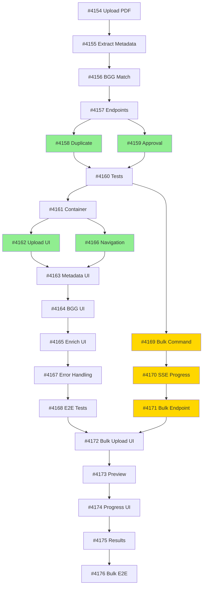

# Epic #4136: PDF Wizard Implementation Plan

> **Generated**: 2026-02-12
> **Estimated Timeline**: 13 working days (optimized from 18)
> **Confidence**: 85%

## 📊 Executive Summary

| Metric | Value |
|--------|-------|
| **Total Issues** | 23 sub-issues |
| **Phases** | 3 (Backend Wizard, Frontend Wizard, Bulk Import) |
| **Waves** | 18 implementation waves |
| **Timeline** | 13 days (28% faster than sequential) |
| **Parallelization** | 5 opportunities, 2 parallel tracks |
| **Critical Path** | 11 sequential dependencies |

## 🎯 Goals

### Core Features
- ✅ PDF upload with automatic metadata extraction
- ✅ 4-step wizard flow (Upload → Extract → Match BGG → Confirm)
- ✅ BGG integration (search + manual ID)
- ✅ Approval workflow (Editor → Admin)
- ✅ Bulk JSON import with real-time progress
- ✅ Duplicate detection with merge suggestions

### Quality Targets
- Backend: ≥90% test coverage
- Frontend: ≥85% test coverage
- E2E tests for both flows
- Performance: <5s upload, <30s extraction, <2s BGG match

---

## 📅 Implementation Timeline

### Phase 1: Backend Wizard (4 days)

| Wave | Day | Issue | Description | Dependencies |
|------|-----|-------|-------------|--------------|
| **1** | 1 | [#4154](https://github.com/DegrassiAaron/meepleai-monorepo/issues/4154) | Upload PDF Command & Handler | None |
| **2** | 2 | [#4155](https://github.com/DegrassiAaron/meepleai-monorepo/issues/4155) | Extract Game Metadata Query | #4154 |
| **3** | 3 | [#4156](https://github.com/DegrassiAaron/meepleai-monorepo/issues/4156) | BGG Match & Enrichment | #4155 |
| **4** | 3.5 | [#4157](https://github.com/DegrassiAaron/meepleai-monorepo/issues/4157) | Wizard Endpoints Routing | #4154-#4156 |
| **5** | 4 | [#4158](https://github.com/DegrassiAaron/meepleai-monorepo/issues/4158) ∥ [#4159](https://github.com/DegrassiAaron/meepleai-monorepo/issues/4159) | **PARALLEL**: Duplicate Detection ∥ Approval Workflow | #4157 |
| **6** | 4.5 | [#4160](https://github.com/DegrassiAaron/meepleai-monorepo/issues/4160) | Wizard Integration Tests | All above |

**Output**: Complete backend wizard API endpoints
**Blocker**: Phase 2 and 3 backend cannot start until this completes

---

### Phase 2: Frontend Wizard (5 days)

| Wave | Day | Issue | Description | Dependencies |
|------|-----|-------|-------------|--------------|
| **7** | 5 | [#4161](https://github.com/DegrassiAaron/meepleai-monorepo/issues/4161) | Container & State Management | Phase 1 (#4160) |
| **8** | 6 | [#4162](https://github.com/DegrassiAaron/meepleai-monorepo/issues/4162) ∥ [#4166](https://github.com/DegrassiAaron/meepleai-monorepo/issues/4166) | **PARALLEL**: Upload UI ∥ Navigation | #4161 |
| **9** | 7 | [#4163](https://github.com/DegrassiAaron/meepleai-monorepo/issues/4163) | Metadata Extraction UI | #4162, #4155 |
| **10** | 8 | [#4164](https://github.com/DegrassiAaron/meepleai-monorepo/issues/4164) | BGG Match UI | #4163, #4156 |
| **11** | 8.5 | [#4165](https://github.com/DegrassiAaron/meepleai-monorepo/issues/4165) | Enrich & Confirm UI | #4164 |
| **12** | 9 | [#4167](https://github.com/DegrassiAaron/meepleai-monorepo/issues/4167) | Error Handling & Edge Cases | #4162-#4165 |
| **13** | 9.5 | [#4168](https://github.com/DegrassiAaron/meepleai-monorepo/issues/4168) | E2E Tests (Playwright) | All above |

**Output**: Complete wizard UI flow
**Blocker**: Phase 3 frontend cannot start until this completes

---

### Phase 3: Bulk Import (4 days backend ∥ frontend)

#### Track A: Bulk Backend (2 days, PARALLEL to Phase 2)

| Wave | Day | Issue | Description | Dependencies |
|------|-----|-------|-------------|--------------|
| **7b** | 5 | [#4169](https://github.com/DegrassiAaron/meepleai-monorepo/issues/4169) | Bulk Import JSON Command | Phase 1 (#4160) |
| **8b** | 5.5 | [#4170](https://github.com/DegrassiAaron/meepleai-monorepo/issues/4170) | Bulk Import SSE Progress | #4169 |
| **9b** | 6 | [#4171](https://github.com/DegrassiAaron/meepleai-monorepo/issues/4171) | Bulk Import Endpoint | #4169, #4170 |

**Parallel Track**: Runs concurrently with Phase 2 frontend (Wave 7-13)
**Output**: Bulk import backend API

#### Track B: Bulk Frontend (4 days)

| Wave | Day | Issue | Description | Dependencies |
|------|-----|-------|-------------|--------------|
| **14** | 10 | [#4172](https://github.com/DegrassiAaron/meepleai-monorepo/issues/4172) | Bulk Upload UI | Phase 2 (#4168), #4171 |
| **15** | 11 | [#4173](https://github.com/DegrassiAaron/meepleai-monorepo/issues/4173) | Preview & Validation | #4172 |
| **16** | 12 | [#4174](https://github.com/DegrassiAaron/meepleai-monorepo/issues/4174) | Progress SSE UI | #4173, #4170 |
| **17** | 12.5 | [#4175](https://github.com/DegrassiAaron/meepleai-monorepo/issues/4175) | Results Summary & CSV Export | #4174 |
| **18** | 13 | [#4176](https://github.com/DegrassiAaron/meepleai-monorepo/issues/4176) | E2E Tests (Playwright) | All above |

**Output**: Complete bulk import UI

---

## 🔗 Dependency Graph



**Legend**:
- 🟢 Green = Parallel execution opportunities
- 🟡 Yellow = Parallel backend track

---

## ⚡ Parallelization Strategy

### Opportunity 1: Wave 5 (Day 4)
**Parallel**: #4158 (Duplicate Detection) ∥ #4159 (Approval Workflow)
**Savings**: 1 day
**Rationale**: Both extend existing workflow independently

### Opportunity 2: Wave 8 (Day 6)
**Parallel**: #4162 (Upload UI) ∥ #4166 (Navigation)
**Savings**: 1 day
**Rationale**: Upload is step-specific, Navigation is wizard-wide

### Opportunity 3: Wave 7b-9b (Day 5-6)
**Parallel Track**: Bulk backend runs parallel to Phase 2 frontend
**Savings**: 2 days
**Rationale**: Bulk backend reuses Phase 1 patterns, doesn't need Phase 2

**Total Savings**: 4 days (18 sequential → 14 optimized → 13 with refinement)

---

## 🔄 Reusable Components

### Backend Infrastructure
| Component | Used By | Status |
|-----------|---------|--------|
| `EnhancedPdfProcessingOrchestrator` | #4154, #4155 | ✅ Exists |
| `IBggApiService` | #4156, #4169 | ✅ Exists |
| `SharedGameCatalog` Repository | #4157-#4159, #4171 | ✅ Exists |
| Chunked Upload Handler | #4154, #4172 | ✅ Exists |

### Frontend Patterns
| Pattern | Created In | Reused In |
|---------|------------|-----------|
| Wizard Container | #4161 | #4172 (template) |
| Upload Component | #4162 | #4172 (pattern) |
| Progress Tracking | #4166 | #4174 (pattern) |
| Error Handling | #4167 | All UI issues |

### Testing Templates
| Template | Created In | Reused In |
|----------|------------|-----------|
| Integration Tests | #4160 | #4171 (pattern) |
| E2E Tests | #4168 | #4176 (pattern) |

---

## ⚠️ Risks & Mitigations

| Risk | Probability | Impact | Mitigation |
|------|-------------|--------|------------|
| BGG API rate limits during bulk import | Medium | High | Mock BGG in tests, throttling in production |
| PDF extraction quality varies | High | Medium | Quality threshold validation + manual fallback |
| Duplicate detection complexity | Medium | Medium | Start simple (exact match), iterate with fuzzy |
| Wizard state management bugs | Low | Medium | Zustand best practices, isolated state |
| E2E test flakiness | Medium | Low | Playwright retry logic, stable selectors |

---

## 📈 Progress Tracking

### Milestones
- [ ] **Milestone 1** (Day 4): Phase 1 Backend Complete (#4160 merged)
- [ ] **Milestone 2** (Day 6): Bulk Backend Complete (#4171 merged, parallel track)
- [ ] **Milestone 3** (Day 9): Phase 2 Frontend Complete (#4168 merged)
- [ ] **Milestone 4** (Day 13): Phase 3 Bulk Frontend Complete (#4176 merged)
- [ ] **Epic Complete**: All 23 issues closed, Epic #4136 closed

### Daily Checklist
Use `/implementa <issue-number>` for each issue in sequence.

**Week 1 (Days 1-5)**:
- Day 1: `/implementa 4154`
- Day 2: `/implementa 4155`
- Day 3 AM: `/implementa 4156`
- Day 3 PM: `/implementa 4157`
- Day 4: `/implementa 4158` + `/implementa 4159` (parallel terminals)
- Day 4 PM: `/implementa 4160`
- Day 5 AM: `/implementa 4161`
- Day 5 PM: `/implementa 4169` (parallel track start)

**Week 2 (Days 6-10)**:
- Day 6 AM: `/implementa 4162` + `/implementa 4166` (parallel)
- Day 6 PM: `/implementa 4170` + `/implementa 4171` (parallel track)
- Day 7: `/implementa 4163`
- Day 8 AM: `/implementa 4164`
- Day 8 PM: `/implementa 4165`
- Day 9 AM: `/implementa 4167`
- Day 9 PM: `/implementa 4168`
- Day 10: `/implementa 4172`

**Week 3 (Days 11-13)**:
- Day 11: `/implementa 4173`
- Day 12 AM: `/implementa 4174`
- Day 12 PM: `/implementa 4175`
- Day 13: `/implementa 4176`

---

## 🎓 Implementation Best Practices

### Backend (CQRS Pattern)
```csharp
// ✅ CORRECT: Use MediatR only
app.MapPost("/api/v1/wizard/upload", async (UploadPdfCommand cmd, IMediator m) =>
    Results.Ok(await m.Send(cmd)));

// ❌ WRONG: Direct service injection
app.MapPost("/api/v1/wizard/upload", async (UploadPdfCommand cmd, IDocService svc) => ...);
```

### Frontend (Wizard State)
```typescript
// ✅ CORRECT: Isolated wizard store
interface WizardState {
  currentStep: number;
  pdfFile: File | null;
  extractedMetadata: GameMetadata | null;
  bggMatch: BggGame | null;
}

// Use Zustand with TypeScript
const useWizardStore = create<WizardState>()(/* ... */);
```

### Testing (Coverage Targets)
```bash
# Backend: ≥90%
cd apps/api/src/Api && dotnet test /p:CollectCoverage=true

# Frontend: ≥85%
cd apps/web && pnpm test:coverage
```

---

## 📚 References

- **Epic Issue**: [#4136](https://github.com/DegrassiAaron/meepleai-monorepo/issues/4136)
- **Full Spec**: `docs/04-features/admin-game-import/epic-4136-breakdown.md`
- **DocumentProcessing BC**: `apps/api/src/Api/BoundedContexts/DocumentProcessing/`
- **SharedGameCatalog BC**: `apps/api/src/Api/BoundedContexts/SharedGameCatalog/`
- **Wizard Patterns**: `apps/web/src/components/wizard/`

---

## ✅ Next Steps

1. **Review Plan**: Validate dependencies and timeline with team
2. **Start Wave 1**: `/implementa 4154` (Upload PDF Command)
3. **Daily Standup**: Track progress against milestones
4. **Adjust**: Re-evaluate after Phase 1 completion (Day 4)

---

**Generated by**: Claude Code (Sequential Thinking)
**Analysis Date**: 2026-02-12
**Plan Version**: 1.0
