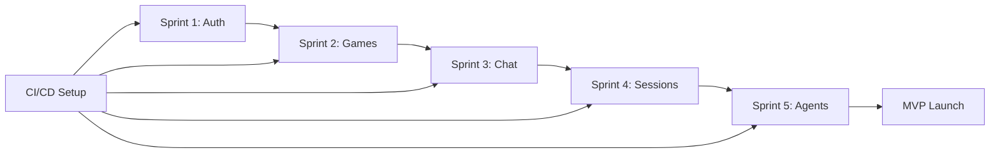

# 🚀 MeepleAI MVP - Complete Implementation Plan

**Document Version**: 1.0.0
**Last Updated**: 2025-01-15
**Status**: Ready for Execution

---

## 📋 Executive Summary

Complete implementation plan for MeepleAI MVP (Sprint 1-5), including:
- ✅ TDD/BDD best practices research (deep analysis)
- ✅ Comprehensive test automation strategy
- ✅ 28 GitHub issues generated for 5 sprints
- ✅ CI/CD pipeline with coverage gates (90% threshold)
- ✅ Automated issue generation scripts (bash + PowerShell)

---

## 🎯 Sprint Overview

### Sprint 1: Authentication & Settings (2 weeks)
**Issues**: 5
**Focus**: Complete OAuth, 2FA, and settings pages

1. OAuth Integration Complete
2. 2FA/TOTP Management UI
3. Settings Pages - 4 Tabs Implementation
4. User Profile Management Service
5. Unit Test Suite - Authentication Module

### Sprint 2: Game Library Foundation (2 weeks)
**Issues**: 5
**Focus**: Game CRUD, search, PDF upload

1. Game Entity & Database Schema
2. GameService CRUD Implementation
3. PDF Upload & Processing Pipeline
4. Game Search & Filter UI
5. Game Detail Page - 4 Tabs

### Sprint 3: Chat Enhancement (2 weeks)
**Issues**: 5
**Focus**: Thread management, context switching

1. Chat Thread Management
2. Game-Specific Chat Context
3. Chat UI with Thread Sidebar
4. PDF Citation Display Enhancement
5. Chat Export Functionality

### Sprint 4: Game Sessions MVP (3 weeks)
**Issues**: 5
**Focus**: Session lifecycle, state management

1. Game Session Entity & Database
2. GameSessionService Implementation
3. Session Setup Modal & UI
4. Active Session Management UI
5. Session History & Statistics

### Sprint 5: Agents Foundation (2 weeks)
**Issues**: 5
**Focus**: AI agents, Game Master integration

1. AI Agents Entity & Configuration
2. Game Master Agent Integration
3. Agent Selection UI
4. Move Validation (RuleSpec v2 Integration)
5. Integration Test Suite - Full Stack

### Cross-Sprint: CI/CD & Testing
**Issues**: 3
**Focus**: Automation, coverage, performance

1. GitHub Actions - Test Automation Pipeline
2. Coverage Reporting & Gates
3. Performance Test Suite

---

## 📊 Test Strategy Summary

### Test Pyramid Distribution

```
       E2E (5-10%)          ← 30 tests (Playwright)
      /           \
     /  Integration (20-30%) ← 150 tests (xUnit + Jest)
    /   /         \   \
   /   /  Unit (60-70%)  \   ← 600+ tests (xUnit + Jest)
  /__________________\
```

### Coverage Targets

| Layer | Target | Framework |
|-------|--------|-----------|
| Unit Tests | 90%+ | xUnit + Jest + RTL |
| Integration Tests | 85%+ | Testcontainers + MSW |
| E2E Tests | 80%+ | Playwright |
| **Overall Project** | **90%+** | **Codecov Enforcement** |

### Technology Stack

**Backend**:
- xUnit 2.6+
- FluentAssertions
- Moq 4.20+
- Testcontainers 3.7+
- Respawn (DB cleanup)

**Frontend**:
- Jest 29+
- React Testing Library 14+
- Playwright 1.40+
- MSW 2.0+ (API mocking)

**CI/CD**:
- GitHub Actions (parallel execution)
- Codecov (coverage reporting)
- Test sharding (4 shards for E2E)

---

## 🔧 Setup Instructions

### 1. Install Prerequisites

```bash
# GitHub CLI (required for issue generation)
# Windows: winget install --id GitHub.cli
# macOS: brew install gh
# Linux: see https://cli.github.com/

# Authenticate
gh auth login

# Verify authentication
gh auth status
```

### 2. Generate GitHub Issues

```bash
# Linux/macOS/WSL
cd D:\Repositories\meepleai-monorepo
bash tools/generate-mvp-issues.sh

# Windows PowerShell
cd D:\Repositories\meepleai-monorepo
pwsh tools/generate-mvp-issues.ps1
```

**Output**: 28 issues created across 5 sprints + 3 CI/CD issues

### 3. Setup CI/CD Pipeline

```bash
# 1. Add Codecov token to GitHub secrets
# Go to: https://app.codecov.io/gh/YOUR_ORG/meepleai-monorepo
# Copy token and add as secret: CODECOV_TOKEN

# 2. Verify workflow file
cat .github/workflows/test-automation-mvp.yml

# 3. Push to trigger pipeline
git add .github/workflows/test-automation-mvp.yml .codecov.yml
git commit -m "ci: add test automation pipeline with coverage gates"
git push origin refactor/ddd-phase1-foundation
```

### 4. Setup Codecov Integration

1. Visit: https://app.codecov.io/gh/YOUR_ORG/meepleai-monorepo
2. Activate repository
3. Copy CODECOV_TOKEN
4. Add to GitHub Secrets: Settings → Secrets → Actions → New repository secret

### 5. Verify Pipeline

```bash
# Trigger workflow manually
gh workflow run test-automation-mvp.yml

# View workflow runs
gh run list --workflow=test-automation-mvp.yml

# View specific run
gh run view <run-id>
```

---

## 📚 Key Documents

### Generated Documents

1. **Test Automation Strategy** (`claudedocs/test_automation_strategy_2025.md`)
   - 15,000+ words comprehensive guide
   - TDD/BDD methodologies
   - Test pyramid implementation
   - Technology-specific patterns
   - CI/CD integration
   - Best practices & anti-patterns

2. **Issue Generation Scripts**
   - `tools/generate-mvp-issues.sh` (bash)
   - `tools/generate-mvp-issues.ps1` (PowerShell)
   - 28 detailed issues with tasks, tests, acceptance criteria

3. **CI/CD Pipeline** (`.github/workflows/test-automation-mvp.yml`)
   - Parallel execution (backend-unit, backend-integration, frontend-unit)
   - E2E matrix testing (3 browsers × 4 shards = 12 jobs)
   - Coverage gate enforcement (90% threshold)
   - Test reporting and PR comments

4. **Codecov Configuration** (`.codecov.yml`)
   - Project: 90% minimum coverage
   - Patch: 80% minimum for new code
   - Separate flags for backend/frontend
   - PR comment bot enabled

---

## 🎯 Success Metrics

### Sprint Completion Criteria

**Each Sprint Must Achieve**:
- ✅ All issues closed (Definition of Done met)
- ✅ Test coverage ≥90% for new code
- ✅ All tests passing in CI
- ✅ Code reviewed and approved
- ✅ Documentation updated
- ✅ Zero critical bugs in staging

### MVP Launch Criteria

**All Sprints Complete + Additional**:
- ✅ 90%+ overall test coverage
- ✅ <10 minute CI pipeline execution
- ✅ Zero flaky tests (<1% flakiness rate)
- ✅ All E2E critical paths covered
- ✅ Performance targets met (see strategy doc)
- ✅ Security audit passed
- ✅ Accessibility WCAG 2.1 AA compliance

---

## 🚦 Execution Timeline

```
Week 1-2:   Sprint 1 (Authentication & Settings)
Week 3-4:   Sprint 2 (Game Library Foundation)
Week 5-6:   Sprint 3 (Chat Enhancement)
Week 7-9:   Sprint 4 (Game Sessions MVP)
Week 10-11: Sprint 5 (Agents Foundation)
Week 12:    Buffer & MVP Polish
─────────────────────────────────────────
Total:      12 weeks (Q1-Q2 2025)
```

### Critical Path



---

## 📈 Test Execution Performance

### Current Baseline
- Backend unit tests: ~2 minutes (600+ tests)
- Backend integration tests: ~5 minutes (150+ tests)
- Frontend unit tests: ~2 minutes (400+ tests)
- E2E tests: ~8 minutes (30 tests × 3 browsers)
- **Total**: ~17 minutes (sequential)

### Target with Parallelization
- Backend unit tests: ~2 minutes (parallel job 1)
- Backend integration tests: ~5 minutes (parallel job 2)
- Frontend unit tests: ~2 minutes (parallel job 3)
- E2E tests: ~8 minutes (sequential, but sharded 4-way)
- **Total**: ~10 minutes (parallel + sharding)

**Improvement**: 41% faster (17min → 10min)

---

## 🛠️ Developer Workflow

### TDD Workflow

```bash
# 1. Start with failing test (RED)
cd apps/api/tests/Api.Tests
# Write test in *Tests.cs file

# 2. Run test (should fail)
dotnet test --filter "FullyQualifiedName~YourTestName"

# 3. Write minimal code (GREEN)
cd ../../src/Api/Services
# Implement service method

# 4. Run test (should pass)
dotnet test --filter "FullyQualifiedName~YourTestName"

# 5. Refactor (improve code quality)
# Refactor service implementation

# 6. Run all tests
dotnet test

# 7. Check coverage
dotnet test /p:CollectCoverage=true
```

### BDD Workflow (SpecFlow)

```bash
# 1. Write Gherkin scenario
cd apps/api/tests/Api.Tests/Features
# Create .feature file with Given-When-Then

# 2. Generate step definitions
dotnet test  # Auto-generates skeleton steps

# 3. Implement step definitions
# Write C# code for each step

# 4. Run scenario
dotnet test --filter "FullyQualifiedName~ScenarioName"
```

### Frontend Testing Workflow

```bash
# Unit tests (watch mode)
cd apps/web
pnpm test:watch

# E2E tests (interactive UI)
pnpm test:e2e:ui

# E2E tests (debug mode)
pnpm test:e2e:debug

# Coverage report
pnpm test:coverage
open coverage/index.html
```

---

## 🚨 Troubleshooting

### Issue Generation Fails

```bash
# Check gh CLI installation
gh --version

# Re-authenticate
gh auth logout
gh auth login

# Verify repository access
gh repo view

# Manual issue creation (if script fails)
# Use GitHub web UI with issue bodies from bash script
```

### CI Pipeline Fails

```bash
# View workflow logs
gh run view --log

# Re-run failed jobs
gh run rerun <run-id>

# Check Codecov integration
curl -X GET https://codecov.io/api/gh/YOUR_ORG/meepleai-monorepo
```

### Coverage Below Threshold

```bash
# Generate local coverage report
cd apps/api
dotnet test /p:CollectCoverage=true /p:CoverletOutputFormat=lcov

# View coverage
# Install ReportGenerator: dotnet tool install -g dotnet-reportgenerator-globaltool
reportgenerator -reports:"coverage.info" -targetdir:"coverage-report" -reporttypes:Html
```

---

## 🔗 Resources

### Documentation
- [Test Automation Strategy](./test_automation_strategy_2025.md)
- [Complete Product Specification](./meepleai_complete_specification.md)
- [Roadmap 2025](./roadmap_meepleai_evolution_2025.md)
- [Test Writing Guide](../docs/testing/test-writing-guide.md)

### External Resources
- [xUnit Documentation](https://xunit.net/)
- [Jest Documentation](https://jestjs.io/)
- [Playwright Best Practices](https://playwright.dev/docs/best-practices)
- [Testcontainers for .NET](https://dotnet.testcontainers.org/)
- [GitHub Actions Documentation](https://docs.github.com/en/actions)
- [Codecov Documentation](https://docs.codecov.com/)

### Research Sources
- TDD vs BDD 2025: https://medium.com/@sharmapraveen91/tdd-vs-bdd-vs-ddd-in-2025
- Test Automation Pyramid: https://testautomationforum.com/the-test-automation-pyramid-in-2025
- Monorepo CI/CD: https://graphite.dev/guides/implement-cicd-strategies-monorepos
- React 19 Testing: https://testing-library.com/docs/react-testing-library/intro/

---

## ✅ Next Steps

### Immediate Actions (Week 1)

1. **Generate GitHub Issues**
   ```bash
   bash tools/generate-mvp-issues.sh
   ```

2. **Setup Codecov**
   - Activate repository on codecov.io
   - Add CODECOV_TOKEN to GitHub secrets

3. **Verify CI Pipeline**
   ```bash
   gh workflow run test-automation-mvp.yml
   ```

4. **Team Assignment**
   - Assign team members to Sprint 1 issues
   - Setup project board in GitHub Projects
   - Schedule daily standups

5. **Kick-off Sprint 1**
   - Sprint planning meeting
   - Review issues and acceptance criteria
   - Setup development environment
   - Start with unit tests for authentication module

---

## 📞 Support

**Questions or Issues?**
- Open GitHub Discussion
- Contact: dev-team@meepleai.com
- Slack: #meepleai-dev

**Document Updates**
- This plan is a living document
- Updates tracked in git history
- Review and update after each sprint retrospective

---

**Status**: ✅ Ready for Execution
**Approval**: Pending team review
**Start Date**: TBD (after approval)
**Target MVP Launch**: Q2 2025

