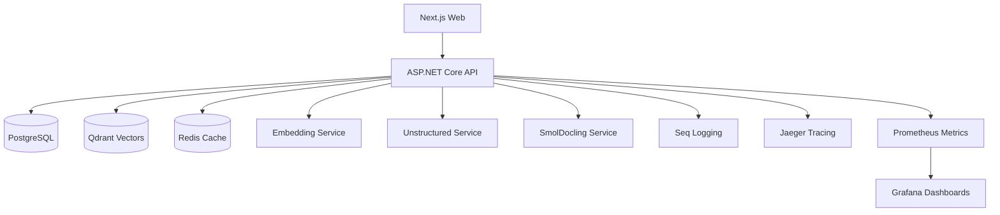
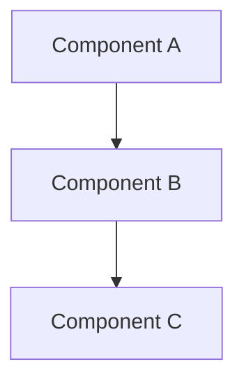

# Architecture Documentation

**System Architecture, ADRs, Diagrams, and Technical Design** - Complete architectural documentation for MeepleAI.

---

## 📁 Directory Structure

```
01-architecture/
├── overview/                      # High-level architecture documents
│   ├── system-architecture.md    # Complete system architecture (60+ pages) ⭐
│   └── consolidation-strategy.md # Architecture consolidation plan
├── adr/                          # Architecture Decision Records
│   ├── adr-001-hybrid-rag.md    # Hybrid RAG (Vector + Keyword) ⭐
│   ├── adr-002-multilingual-embedding.md
│   ├── adr-003-pdf-processing.md
│   ├── adr-003b-unstructured-pdf.md ⭐
│   ├── adr-004-ai-agents.md
│   └── adr-007-hybrid-llm.md
├── diagrams/                     # Architecture diagrams (Mermaid)
│   ├── bounded-contexts-interactions.md
│   ├── cqrs-mediatr-flow.md
│   ├── infrastructure-overview.md
│   ├── pdf-pipeline-detailed.md
│   └── rag-system-detailed.md
├── components/                   # Component-specific docs
│   ├── pdf-extraction-alternatives.md
│   ├── confidence-validation.md
│   ├── agent-lightning/         # Agent Lightning docs
│   └── amplifier/               # Amplifier docs
├── ddd/                         # Domain-Driven Design
│   └── quick-reference.md       # DDD patterns & bounded contexts ⭐
└── README.md                    # This file
```

---

## 🚀 Quick Start

**New to MeepleAI architecture?** Read in this order:

1. **[System Architecture](./overview/system-architecture.md)** (60+ pages) - Start here! Complete overview of system design, tech stack, and architectural patterns
2. **[DDD Quick Reference](./ddd/quick-reference.md)** - Understand Domain-Driven Design patterns used in the codebase
3. **[ADR-001: Hybrid RAG](./adr/adr-001-hybrid-rag.md)** - Learn how RAG (Retrieval Augmented Generation) works
4. **[ADR-003b: Unstructured PDF](./adr/adr-003b-unstructured-pdf.md)** - Understand the 3-stage PDF processing pipeline
5. **[Infrastructure Diagram](./diagrams/infrastructure-overview.md)** - Visual overview of all services

---

## 📚 Architecture Overview

### High-Level Architecture

**MeepleAI** is built with a **microservices architecture** using **Domain-Driven Design (DDD)** principles:

```
┌─────────────────────────────────────────────────────────┐
│                    Frontend (Next.js 16)                 │
│              React 19 + Tailwind CSS 4                   │
└─────────────────────────────────────────────────────────┘
                          ↓ HTTP/REST
┌─────────────────────────────────────────────────────────┐
│           Backend API (ASP.NET Core 9)                   │
│     7 Bounded Contexts (DDD + CQRS/MediatR)             │
│  ┌────────────────┐  ┌────────────────┐                │
│  │ Authentication │  │ GameManagement │                │
│  │ KnowledgeBase  │  │ DocumentProc   │                │
│  │ Workflow       │  │ SysConfig      │                │
│  │ Administration │  └────────────────┘                │
│  └────────────────┘                                     │
└─────────────────────────────────────────────────────────┘
         ↓                    ↓                    ↓
┌──────────────┐   ┌──────────────┐   ┌─────────────────┐
│  PostgreSQL  │   │   Qdrant     │   │     Redis       │
│   (EF Core)  │   │  (Vectors)   │   │   (Cache)       │
└──────────────┘   └──────────────┘   └─────────────────┘
```

**Key Characteristics**:
- **DDD with 7 Bounded Contexts** - Clear domain boundaries
- **CQRS with MediatR** - Command/Query separation
- **Microservices** - Independent, scalable services
- **Event-Driven** - Domain events for decoupling
- **Observability** - Logging (Seq), tracing (Jaeger), metrics (Prometheus)

### Tech Stack

| Layer | Technology |
|-------|------------|
| **Frontend** | Next.js 16, React 19, TypeScript, Tailwind CSS 4 |
| **Backend** | ASP.NET Core 9, C# 13, EF Core 9 |
| **Patterns** | DDD, CQRS, MediatR, Repository |
| **Database** | PostgreSQL 16 (relational), Qdrant (vectors) |
| **Cache** | Redis, HybridCache (L1+L2) |
| **AI/ML** | OpenRouter, OpenAI, Claude, BGE-M3 embeddings |
| **Observability** | Serilog → Seq, OpenTelemetry → Jaeger, Prometheus |
| **Deployment** | Docker Compose, Kubernetes (planned) |

---

## 📖 Documentation by Category

### Overview Documents

| Document | Description | Pages | Priority |
|----------|-------------|-------|----------|
| [System Architecture](./overview/system-architecture.md) | Complete system design, tech stack, patterns, and architecture | 60+ | ⭐ Essential |
| [Consolidation Strategy](./overview/consolidation-strategy.md) | Plan for consolidating architecture documentation | 10 | Optional |

**When to read**:
- **System Architecture**: First document for all new team members
- **Consolidation Strategy**: For architects planning documentation updates

---

### Architecture Decision Records (ADRs)

**ADRs document major architectural decisions with context, alternatives, and consequences.**

| ADR | Title | Status | Priority |
|-----|-------|--------|----------|
| [ADR-001](./adr/adr-001-hybrid-rag.md) | Hybrid RAG Architecture (Vector + Keyword RRF) | Accepted | ⭐ Essential |
| [ADR-002](./adr/adr-002-multilingual-embedding.md) | Multilingual Embedding Strategy (BGE-M3) | Accepted | Recommended |
| [ADR-003](./adr/adr-003-pdf-processing.md) | PDF Processing Pipeline (3-stage fallback) | Superseded by 003b | Optional |
| [ADR-003b](./adr/adr-003b-unstructured-pdf.md) | Unstructured PDF Extraction (Production) | Accepted | ⭐ Essential |
| [ADR-004](./adr/adr-004-ai-agents.md) | AI Agents Bounded Context | Accepted | Optional |
| [ADR-007](./adr/adr-007-hybrid-llm.md) | Hybrid LLM Architecture (Multi-model consensus) | Accepted | Recommended |

**Key ADRs Explained**:

#### ADR-001: Hybrid RAG
**Problem**: Pure vector search misses exact keyword matches (e.g., game names, player counts)

**Solution**: Hybrid search combining:
- 70% Vector search (Qdrant) - Semantic similarity
- 30% Keyword search (PostgreSQL FTS) - Exact matches
- RRF (Reciprocal Rank Fusion) - Merge results

**Impact**: 15-25% recall improvement, <3% hallucination rate

---

#### ADR-003b: Unstructured PDF
**Problem**: Game rulebooks have complex layouts (tables, diagrams, multi-column)

**Solution**: 3-stage fallback pipeline:
1. **Stage 1**: Unstructured (≥0.80 quality) - 80% success, fast
2. **Stage 2**: SmolDocling VLM (≥0.70 quality) - 15% fallback, accurate
3. **Stage 3**: Docnet (best effort) - 5% fallback, fast

**Quality Metrics**: Text coverage (40%), structure (20%), tables (20%), page coverage (20%)

**Impact**: 95%+ PDF processing success rate, <2s avg latency (Stage 1)

---

#### ADR-007: Hybrid LLM
**Problem**: Single LLM prone to hallucinations, biases

**Solution**: Multi-model consensus:
- GPT-4 + Claude generate answers independently
- Confidence scoring (0.0-1.0)
- Consensus mechanism (agreement → high confidence)
- 5-layer validation (confidence, citations, forbidden keywords, etc.)

**Impact**: <3% hallucination rate (vs. 8-12% single model)

---

### Architecture Diagrams

**All diagrams use Mermaid markdown for version control and easy updates.**

| Diagram | Description | Use Case |
|---------|-------------|----------|
| [Bounded Contexts](./diagrams/bounded-contexts-interactions.md) | DDD context map, dependencies between contexts | Understanding domain boundaries |
| [CQRS/MediatR Flow](./diagrams/cqrs-mediatr-flow.md) | Command/Query flow through MediatR pipeline | Understanding request handling |
| [Infrastructure](./diagrams/infrastructure-overview.md) | All services, databases, monitoring stack (15 services) | DevOps, deployment planning |
| [PDF Pipeline](./diagrams/pdf-pipeline-detailed.md) | 3-stage PDF processing (Unstructured → SmolDocling → Docnet) | PDF feature development |
| [RAG System](./diagrams/rag-system-detailed.md) | Hybrid RAG flow (vector + keyword → RRF → validation) | RAG feature development |

**Example: Infrastructure Diagram**


---

### Component Documentation

| Component | Description | Files |
|-----------|-------------|-------|
| [PDF Extraction Alternatives](./components/pdf-extraction-alternatives.md) | Comparison of PDF extraction tools (Unstructured, SmolDocling, Docnet, etc.) | 1 |
| [Confidence Validation](./components/confidence-validation.md) | 5-layer confidence validation system for RAG answers | 1 |
| [Agent Lightning](./components/agent-lightning/) | AI agent framework documentation | 5 files |
| [Amplifier](./components/amplifier/) | Query expansion/amplification system | 3 files |

---

### Domain-Driven Design (DDD)

| Document | Description | Priority |
|----------|-------------|----------|
| [DDD Quick Reference](./ddd/quick-reference.md) | DDD patterns, bounded contexts, aggregates, value objects, CQRS | ⭐ Essential |

**DDD Quick Reference Topics**:
- Bounded Contexts (7 contexts in MeepleAI)
- Aggregates and Entities
- Value Objects
- Domain Services
- Repository Pattern
- CQRS (Command Query Responsibility Segregation)
- Domain Events
- Application Layer (Handlers)
- Infrastructure Layer (EF Core, adapters)

**Example: Authentication Bounded Context**
```
Authentication/
├── Domain/                    # Pure business logic
│   ├── Aggregates/
│   │   └── User.cs           # User aggregate root
│   ├── ValueObjects/
│   │   ├── Email.cs          # Email value object
│   │   └── PasswordHash.cs   # Password VO
│   ├── DomainServices/
│   │   └── AuthenticationDomainService.cs
│   └── Events/
│       └── UserRegisteredEvent.cs
├── Application/               # CQRS handlers
│   ├── Commands/
│   │   ├── RegisterCommand.cs
│   │   └── LoginCommand.cs
│   ├── Queries/
│   │   └── GetUserQuery.cs
│   └── Handlers/
│       ├── RegisterCommandHandler.cs
│       └── LoginCommandHandler.cs
└── Infrastructure/            # Data access
    └── Repositories/
        └── UserRepository.cs  # EF Core implementation
```

---

## 🎯 Finding What You Need

### By Role

**I'm an Architect**:
1. [System Architecture](./overview/system-architecture.md) - Overall design
2. [All ADRs](./adr/) - Major architectural decisions
3. [Infrastructure Diagram](./diagrams/infrastructure-overview.md) - Service topology
4. [DDD Quick Reference](./ddd/quick-reference.md) - Domain patterns

**I'm a Backend Developer**:
1. [DDD Quick Reference](./ddd/quick-reference.md) - DDD patterns
2. [CQRS Flow Diagram](./diagrams/cqrs-mediatr-flow.md) - Request handling
3. [Bounded Contexts Diagram](./diagrams/bounded-contexts-interactions.md) - Context boundaries
4. [ADR-001: Hybrid RAG](./adr/adr-001-hybrid-rag.md) - RAG implementation
5. [ADR-003b: Unstructured PDF](./adr/adr-003b-unstructured-pdf.md) - PDF processing

**I'm a Frontend Developer**:
1. [System Architecture](./overview/system-architecture.md) - Backend API overview
2. [API Specification](../../03-api/board-game-ai-api-specification.md) - API endpoints
3. [Infrastructure Diagram](./diagrams/infrastructure-overview.md) - Available services

**I'm DevOps**:
1. [Infrastructure Diagram](./diagrams/infrastructure-overview.md) - All services
2. [System Architecture](./overview/system-architecture.md) - Deployment requirements
3. [Deployment Guide](../../05-operations/deployment/board-game-ai-deployment-guide.md) - Deployment procedures

### By Topic

**RAG System**:
- [ADR-001: Hybrid RAG](./adr/adr-001-hybrid-rag.md)
- [RAG System Diagram](./diagrams/rag-system-detailed.md)
- [Confidence Validation](./components/confidence-validation.md)

**PDF Processing**:
- [ADR-003b: Unstructured PDF](./adr/adr-003b-unstructured-pdf.md)
- [PDF Pipeline Diagram](./diagrams/pdf-pipeline-detailed.md)
- [PDF Extraction Alternatives](./components/pdf-extraction-alternatives.md)

**DDD & CQRS**:
- [DDD Quick Reference](./ddd/quick-reference.md)
- [CQRS Flow Diagram](./diagrams/cqrs-mediatr-flow.md)
- [Bounded Contexts Diagram](./diagrams/bounded-contexts-interactions.md)

**Infrastructure**:
- [Infrastructure Diagram](./diagrams/infrastructure-overview.md)
- [System Architecture](./overview/system-architecture.md)

---

## 🔄 Architecture Evolution

### DDD Migration (100% Complete)

**Status**: 100% complete as of 2025-12-13T10:57:05.887Z

**Achievements**:
- ✅ 7 bounded contexts migrated
- ✅ 72+ CQRS handlers operational
- ✅ 60+ endpoints migrated to MediatR
- ✅ 2,070 lines legacy code removed
- ✅ 99.1% test pass rate maintained

**Remaining**:
- [x] Final polish and documentation completed (100% migration)

See [Legacy Code Dashboard](../../02-development/refactoring/legacy-code-dashboard.md) for details.

### Architecture Roadmap

**Completed**:
- ✅ DDD bounded contexts (Q3 2024)
- ✅ CQRS with MediatR (Q3 2024)
- ✅ Hybrid RAG (Q4 2024)
- ✅ 3-stage PDF pipeline (Q4 2024)
- ✅ Multi-model LLM consensus (Q4 2024)

**In Progress**:
- 🔄 API Gateway (Kong/Nginx) (Q1 2025)
- 🔄 Event sourcing (selected contexts) (Q1 2025)

**Planned**:
- [ ] GraphQL API (Q2 2025)
- [ ] CQRS read replicas (Q2 2025)
- [ ] Kubernetes deployment (Q2 2025)
- [ ] Service mesh (Istio) (Q3 2025)

---

## 📝 Contributing to Architecture

### Adding a New ADR

**When to write an ADR**:
- Introducing a new technology or framework
- Changing a fundamental architectural pattern
- Making a decision with long-term consequences
- Choosing between multiple viable alternatives

**ADR Template** (`adr/adr-XXX-title.md`):
```markdown
# ADR-XXX: Title

**Status**: Proposed | Accepted | Deprecated | Superseded

**Date**: YYYY-MM-DD

**Context**: What is the issue/problem we're facing?

**Decision**: What is the change we're proposing?

**Alternatives Considered**:
1. Alternative 1 - Pros/Cons
2. Alternative 2 - Pros/Cons

**Consequences**: What are the positive/negative impacts?

**Implementation Notes**: How to implement this decision?

**References**: Links to related docs, code, or discussions
```

### Updating Diagrams

**All diagrams use Mermaid** (version-controllable markdown):

```markdown
# Diagram Title



**Description**: Explanation of the diagram

**Last Updated**: 2025-12-13T10:59:23.970Z
```

### Review Process

1. **Propose** architecture change via ADR
2. **Discuss** with team (PR comments, meetings)
3. **Decide** (consensus or architecture lead decision)
4. **Document** (update ADR status, add diagrams)
5. **Implement** (code changes with tests)
6. **Review** quarterly (are ADRs still relevant?)

---

## 🔗 Related Documentation

- **[CLAUDE.md](../../CLAUDE.md)** - Complete development guide
- **[API Specification](../../03-api/board-game-ai-api-specification.md)** - REST API docs
- **[Testing Guide](../../02-development/testing/testing-guide.md)** - Testing standards
- **[Deployment Guide](../../05-operations/deployment/board-game-ai-deployment-guide.md)** - Deployment procedures

---

**Last Updated**: 2025-12-13T10:59:23.970Z
**Maintainer**: Architecture Team
**Total Documents**: 20+ files
**ADRs**: 6 active decisions

