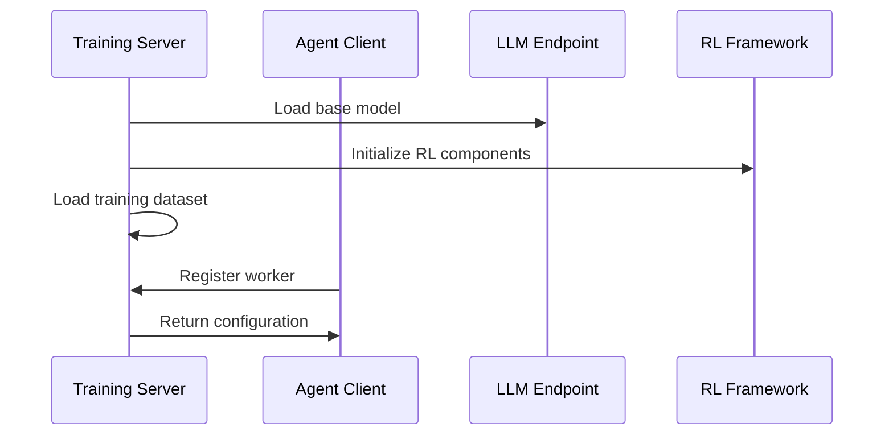
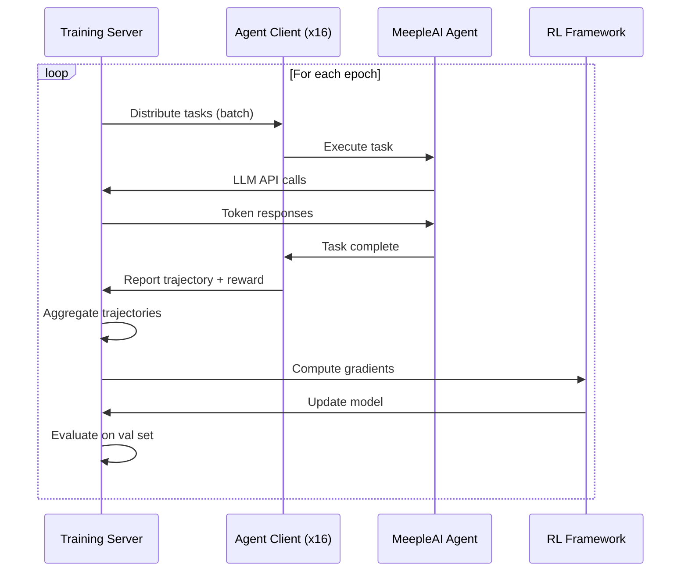

# Agent Lightning Technical Architecture

## System Overview

Agent Lightning decouples agent execution from model training, enabling RL-based optimization for any agent framework without code modifications.

## Core Components

### 1. Training Server (Lightning Server)

**Purpose**: Manages training infrastructure and model optimization

**Components**:
```
Training Server
├── Task Manager
│   ├── Task Pool (Parquet datasets)
│   ├── Task Distribution
│   └── Progress Tracking
├── LLM Endpoint (OpenAI-compatible)
│   ├── vLLM Inference Engine
│   ├── Model Serving
│   └── Token-level Control
├── RL Framework (VERL)
│   ├── GRPO Algorithm
│   ├── Advantage Estimation
│   └── Policy Optimization
└── Trace Collector
    ├── Trajectory Aggregation
    ├── Reward Processing
    └── MDP Conversion
```

**Technology Stack**:
- **Inference**: vLLM 0.9.2 (GPU-accelerated)
- **Training**: VERL 0.5.0 (Reinforcement Learning)
- **Compute**: PyTorch 2.7.0 + FlashAttention
- **Ray**: Distributed computing framework

**API Endpoints**:
```
POST /v1/chat/completions       # OpenAI-compatible LLM API
GET  /v1/models                 # List available models
POST /v1/tasks/pull             # Get next training task
POST /v1/traces/report          # Submit agent trajectory
GET  /v1/status                 # Training status
```

### 2. Lightning Client (Agent Runtime)

**Purpose**: Wraps agents and collects training data

**Components**:
```
Lightning Client
├── Agent Wrapper
│   ├── Framework Adapter (LangChain/AutoGen/OpenAI SDK)
│   ├── Execution Monitor
│   └── Error Handler
├── Trace Collector (Sidecar)
│   ├── LLM Call Interceptor
│   ├── State Tracker
│   └── Reward Calculator
└── Communication Layer
    ├── HTTP Client (to Server)
    ├── Task Fetcher
    └── Trace Reporter
```

**Supported Agent Frameworks**:
- LangChain / LangGraph
- OpenAI Agents SDK
- AutoGen
- CrewAI
- Microsoft Agent Framework (Python)
- Raw OpenAI API calls

### 3. MDP Formulation

Agent Lightning converts agent executions into Markov Decision Process (MDP) tuples for RL:

```
State (s_t):
  - Conversation history
  - Retrieved context
  - Agent memory

Action (a_t):
  - LLM-generated response
  - Tool calls
  - Reasoning steps

Reward (r_t):
  - Task success signal
  - User feedback
  - Quality metrics

Next State (s_t+1):
  - Updated conversation
  - New context
  - Modified memory
```

**Trajectory Format**:
```python
{
    "trajectory_id": "uuid",
    "steps": [
        {
            "state": {
                "messages": [...],
                "context": {...},
                "memory": {...}
            },
            "action": {
                "llm_call": {
                    "prompt": "...",
                    "response": "...",
                    "tokens": 245
                },
                "tool_calls": [...]
            },
            "reward": 0.85,
            "next_state": {...}
        }
    ],
    "total_reward": 0.85,
    "metadata": {
        "agent_type": "rag",
        "game_id": "catan",
        "timestamp": "2025-11-01T10:30:00Z"
    }
}
```

## Training Flow

### 1. Initialization Phase



### 2. Training Loop



### 3. Rollout Phase (Parallel)

```
┌─────────────────────────────────────────────────────────────┐
│                    Training Server                           │
│  ┌────────────┐                                             │
│  │ Task Pool  │                                             │
│  │ (3200      │                                             │
│  │ samples)   │                                             │
│  └─────┬──────┘                                             │
│        │                                                     │
│        │ Distribute                                          │
│        ▼                                                     │
│  ┌──────────────────────────────────────────────────────┐  │
│  │         Agent Workers (16 parallel)                   │  │
│  │  ┌──────┐ ┌──────┐ ┌──────┐       ┌──────┐          │  │
│  │  │ W-1  │ │ W-2  │ │ W-3  │  ...  │ W-16 │          │  │
│  │  └──┬───┘ └──┬───┘ └──┬───┘       └──┬───┘          │  │
│  │     │        │        │               │               │  │
│  │     └────────┴────────┴───────────────┘               │  │
│  │                      │                                 │  │
│  │                      ▼                                 │  │
│  │              Execute 200 tasks each                    │  │
│  │              (3200 / 16 = 200)                         │  │
│  │                      │                                 │  │
│  │                      ▼                                 │  │
│  │              Collect trajectories                      │  │
│  └──────────────────────┬───────────────────────────────┘  │
│                         │                                   │
│                         ▼                                   │
│  ┌──────────────────────────────────────────────────────┐  │
│  │         Trajectory Buffer (3200 complete)            │  │
│  └──────────────────────┬───────────────────────────────┘  │
│                         │                                   │
│                         ▼                                   │
│  ┌──────────────────────────────────────────────────────┐  │
│  │         VERL Optimizer                                │  │
│  │  - Compute advantages (GRPO)                          │  │
│  │  - Calculate policy gradients                         │  │
│  │  - Update model weights                               │  │
│  └──────────────────────────────────────────────────────┘  │
└─────────────────────────────────────────────────────────────┘

Throughput: ~200 samples/hour (16 workers, avg 5min/task)
```

## Algorithms

### GRPO (Group Relative Policy Optimization)

Agent Lightning's default RL algorithm:

```python
# Simplified GRPO implementation
def grpo_update(trajectories: List[Trajectory], model: LLM):
    """
    Group Relative Policy Optimization.

    Key idea: Compare policy performance within groups
    instead of absolute rewards.
    """

    # 1. Group trajectories by task
    groups = group_by_task(trajectories)

    # 2. Compute relative advantages
    for group in groups:
        # Normalize rewards within group
        mean_reward = np.mean([t.total_reward for t in group])
        std_reward = np.std([t.total_reward for t in group])

        for trajectory in group:
            # Relative advantage
            trajectory.advantage = (
                (trajectory.total_reward - mean_reward) / (std_reward + 1e-8)
            )

    # 3. Policy gradient update
    for trajectory in all_trajectories:
        for step in trajectory.steps:
            # Log probability of action (LLM output)
            log_prob = model.compute_log_prob(
                prompt=step.state,
                response=step.action
            )

            # Gradient: advantage * log_prob
            loss = -trajectory.advantage * log_prob

            # Backpropagate
            loss.backward()

    # 4. Update model
    optimizer.step()
```

**Advantages**:
- No reference model needed (vs PPO)
- Faster convergence
- Better for sparse rewards
- Works well with multi-turn agents

### APO (Automatic Prompt Optimization)

Alternative algorithm for prompt tuning without model training:

```python
# APO: Optimize prompts, not model weights
def apo_update(prompts: List[str], rewards: List[float]):
    """
    Automatic Prompt Optimization.

    Iteratively refine prompts based on reward signals.
    """

    # 1. Evaluate current prompts
    prompt_scores = {p: [] for p in prompts}

    for prompt, reward in zip(prompts, rewards):
        prompt_scores[prompt].append(reward)

    # 2. Select top performers
    avg_scores = {
        p: np.mean(scores)
        for p, scores in prompt_scores.items()
    }

    top_prompts = sorted(
        avg_scores.items(),
        key=lambda x: x[1],
        reverse=True
    )[:5]

    # 3. Generate variations (LLM-based)
    new_prompts = []
    for prompt, score in top_prompts:
        variations = generate_prompt_variations(prompt)
        new_prompts.extend(variations)

    # 4. Next iteration: Test new_prompts
    return new_prompts
```

## Integration Patterns

### Pattern 1: External Training, Deploy Prompts

```
┌─────────────────────────────────────────────────────────┐
│  Development Environment (Python + Agent Lightning)     │
│                                                          │
│  1. Train agent with RL                                 │
│  2. Extract optimized prompts                           │
│  3. Export to SQL migration                             │
└───────────────────┬─────────────────────────────────────┘
                    │
                    │ Deploy artifact
                    ▼
┌─────────────────────────────────────────────────────────┐
│  Production Environment (MeepleAI .NET)                 │
│                                                          │
│  1. Apply SQL migration                                 │
│  2. Update prompt_templates table                       │
│  3. Activate new version via Admin UI                   │
│  4. RagService uses optimized prompt                    │
└─────────────────────────────────────────────────────────┘
```

**Artifacts**:
- Optimized system prompts
- Few-shot examples
- Response templates

**Deployment**:
```sql
INSERT INTO prompt_versions (
    prompt_template_id,
    version_number,
    content,
    change_summary
)
SELECT id, MAX(version) + 1, $optimized_prompt, 'Agent Lightning v1'
FROM prompt_templates WHERE name = 'rag-system-prompt';
```

### Pattern 2: External Training, Deploy Model

```
┌─────────────────────────────────────────────────────────┐
│  Development Environment (Python + Agent Lightning)     │
│                                                          │
│  1. Train model with RL (5 epochs)                      │
│  2. Export checkpoint                                   │
│  3. Upload to Hugging Face / OpenRouter                 │
└───────────────────┬─────────────────────────────────────┘
                    │
                    │ Model registry
                    ▼
┌─────────────────────────────────────────────────────────┐
│  Production Environment (MeepleAI .NET)                 │
│                                                          │
│  1. Update AI:Model config                              │
│  2. LlmService uses fine-tuned model                    │
│  3. Via OpenRouter API (no code change)                 │
└─────────────────────────────────────────────────────────┘
```

**Configuration**:
```json
{
  "AI": {
    "Model": "meepleai/rag-optimized-qwen2.5-3b",
    "Provider": "openrouter",
    "Temperature": 0.7
  }
}
```

### Pattern 3: Continuous Learning (Advanced)

```
┌─────────────────────────────────────────────────────────┐
│  Production (MeepleAI .NET)                             │
│  ┌──────────────────────────────────────────────────┐  │
│  │ Collect user feedback + logs                      │  │
│  │ - ai_request_logs table                           │  │
│  │ - user_feedback                                    │  │
│  └────────────────┬─────────────────────────────────┘  │
└────────────────────┼────────────────────────────────────┘
                     │
                     │ Weekly export
                     ▼
┌─────────────────────────────────────────────────────────┐
│  Training Pipeline (Automated)                          │
│  ┌──────────────────────────────────────────────────┐  │
│  │ 1. Export new logs (confidence > 0.7)             │  │
│  │ 2. Augment training dataset                       │  │
│  │ 3. Run Agent Lightning training                   │  │
│  │ 4. Evaluate improvement                           │  │
│  │ 5. If improvement > 5%, deploy                    │  │
│  └──────────────────────────────────────────────────┘  │
└───────────────────┬─────────────────────────────────────┘
                    │
                    │ If approved
                    ▼
┌─────────────────────────────────────────────────────────┐
│  Staging Environment (A/B Testing)                      │
│  ┌──────────────────────────────────────────────────┐  │
│  │ 10% traffic → New prompt/model                    │  │
│  │ 90% traffic → Baseline                            │  │
│  │ Monitor: accuracy, latency, errors                │  │
│  └──────────────────────────────────────────────────┘  │
└─────────────────────────────────────────────────────────┘
```

## Performance Characteristics

### Training Performance

**Hardware Requirements** (Minimum):
- GPU: NVIDIA RTX 3090 (24GB VRAM)
- CPU: 16 cores
- RAM: 64GB
- Storage: 500GB SSD

**Recommended** (for faster training):
- GPU: NVIDIA A100 (80GB VRAM) x 2
- CPU: 32 cores
- RAM: 128GB
- Storage: 1TB NVMe SSD

### Training Metrics

| Dataset Size | Model Size | Epochs | Time (A100) | Time (RTX 3090) |
|--------------|------------|--------|-------------|-----------------|
| 1K samples | 3B params | 3 | 2 hours | 6 hours |
| 3K samples | 3B params | 5 | 8 hours | 24 hours |
| 10K samples | 7B params | 5 | 24 hours | 72 hours |
| 30K samples | 7B params | 10 | 72 hours | 7 days |

**Throughput**:
- Single worker: ~12 samples/hour
- 16 workers: ~200 samples/hour
- 32 workers: ~350 samples/hour (diminishing returns)

### Inference Performance

**Optimized Model** (after training):
- Same latency as base model
- Slightly better token efficiency (fewer retries)
- +5-10% throughput in production (fewer errors)

## Data Flow

### Training Data Pipeline

```
┌───────────────────────────────────────────────────────────┐
│  MeepleAI Production Database                             │
│  ┌─────────────────────────────────────────────────────┐ │
│  │ ai_request_logs                                      │ │
│  │ - prompt, response, confidence                       │ │
│  │ - game_id, user_id, timestamp                        │ │
│  │ - metadata (sources, citations)                      │ │
│  └────────────────┬────────────────────────────────────┘ │
└────────────────────┼────────────────────────────────────┘
                     │
                     │ SQL Export (weekly)
                     ▼
┌───────────────────────────────────────────────────────────┐
│  Data Preparation                                         │
│  ┌─────────────────────────────────────────────────────┐ │
│  │ 1. Filter: confidence > 0.7                          │ │
│  │ 2. Extract ground truth (keywords, pages)            │ │
│  │ 3. Create train/val/test split (70/15/15)            │ │
│  │ 4. Convert to Parquet                                │ │
│  └────────────────┬────────────────────────────────────┘ │
└────────────────────┼────────────────────────────────────┘
                     │
                     ▼
┌───────────────────────────────────────────────────────────┐
│  Agent Lightning Training                                 │
│  ┌─────────────────────────────────────────────────────┐ │
│  │ train_rag_qa.parquet (2240 samples)                  │ │
│  │ val_rag_qa.parquet (480 samples)                     │ │
│  │ test_rag_qa.parquet (480 samples)                    │ │
│  └────────────────┬────────────────────────────────────┘ │
└────────────────────┼────────────────────────────────────┘
                     │
                     │ RL Training Loop
                     ▼
┌───────────────────────────────────────────────────────────┐
│  Model Checkpoints                                        │
│  ┌─────────────────────────────────────────────────────┐ │
│  │ epoch_1/ (baseline + 15%)                            │ │
│  │ epoch_3/ (baseline + 22%)                            │ │
│  │ epoch_5/ (baseline + 25%) ← BEST                     │ │
│  └────────────────┬────────────────────────────────────┘ │
└────────────────────┼────────────────────────────────────┘
                     │
                     │ Evaluation + Export
                     ▼
┌───────────────────────────────────────────────────────────┐
│  Deployment Artifacts                                     │
│  ┌─────────────────────────────────────────────────────┐ │
│  │ optimized_prompt_v2.sql (Prompt only)                │ │
│  │ OR                                                    │ │
│  │ model_checkpoint/ (Full model)                       │ │
│  └─────────────────────────────────────────────────────┘ │
└───────────────────────────────────────────────────────────┘
```

## Error Handling

### Training Failures

**Common Issues**:

1. **CUDA Out of Memory**
   ```bash
   # Reduce batch size
   actor_rollout_ref.actor.ppo_micro_batch_size_per_gpu=2
   # Enable offloading
   actor_rollout_ref.actor.fsdp_config.param_offload=True
   ```

2. **Agent Timeout**
   ```python
   # Increase timeout, limit response length
   data.max_response_length=1024
   agent.timeout_seconds=120
   ```

3. **vLLM Crash**
   ```bash
   # Resume from checkpoint
   python -m agentlightning.verl \
       --resume checkpoints/epoch_3
   ```

### Production Integration Risks

**Risk**: Optimized model hallucinates more
**Mitigation**:
- A/B test in staging first
- Monitor hallucination metrics
- Rollback capability via feature flags

**Risk**: Latency regression
**Mitigation**:
- Benchmark before deployment
- Set p95 latency SLO
- Auto-rollback if exceeded

## Monitoring & Observability

### Training Metrics (W&B)

```python
# Logged automatically by Agent Lightning
{
    "epoch": 3,
    "train_reward_mean": 0.82,
    "train_reward_std": 0.12,
    "val_reward_mean": 0.79,
    "loss": 0.045,
    "kl_divergence": 0.012,
    "samples_processed": 2400,
    "time_elapsed": "08:23:15"
}
```

### Production Metrics (MeepleAI)

```csharp
// After deploying optimized prompt
var metrics = await _ragEvaluationService.EvaluateAsync(
    promptVersion: "agent-lightning-v2"
);

// Compare to baseline
var improvement = metrics.PrecisionAtK - baselineMetrics.PrecisionAtK;

if (improvement < 0)
{
    // Rollback
    await _promptTemplateService.ActivateVersionAsync(
        templateId,
        baselineVersionId,
        userId
    );
    _logger.LogWarning("Rolled back to baseline - performance regression");
}
```

## Security Considerations

### Training Environment Isolation

- **Network**: Separate VPC/subnet from production
- **Credentials**: Different API keys for training vs prod
- **Data**: Sanitize PII before export to training env

### Model Security

- **Checkpoints**: Encrypt at rest
- **API Keys**: Use secret management (Azure Key Vault)
- **Access Control**: Limit who can deploy new models

## Next Steps

For implementation details, see:
- **Setup Guide**: `agent-lightning-integration-guide.md`
- **Examples**: `agent-lightning-examples.md`
- **Troubleshooting**: `agent-lightning-integration-guide.md#troubleshooting`
