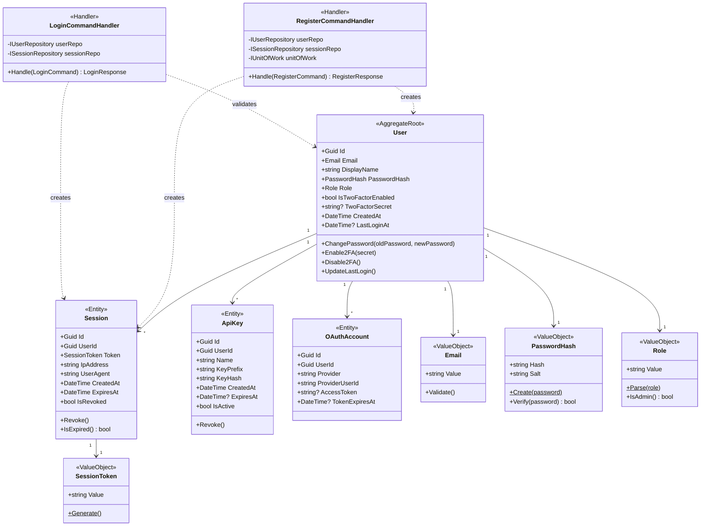
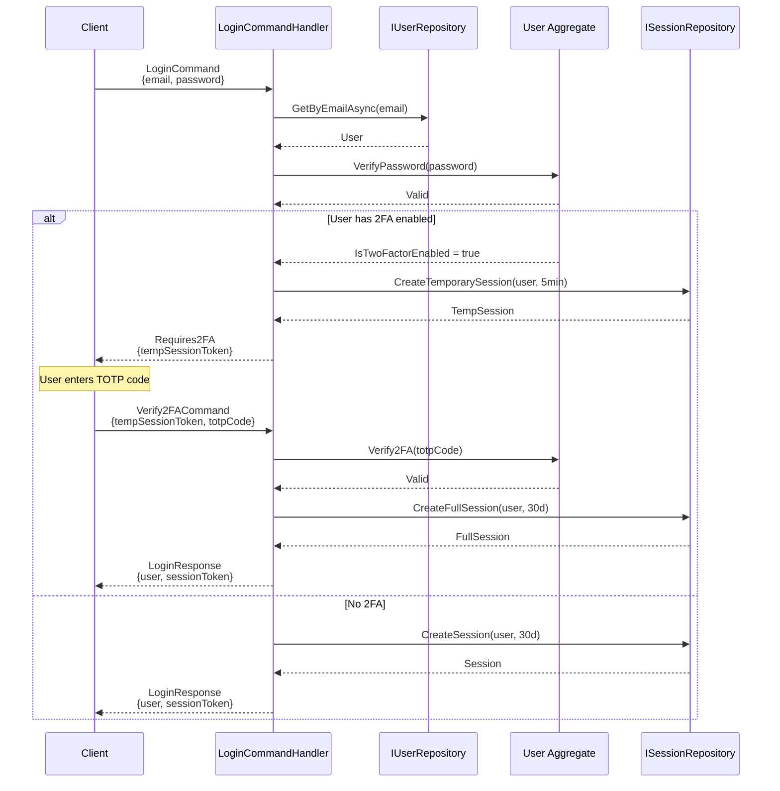
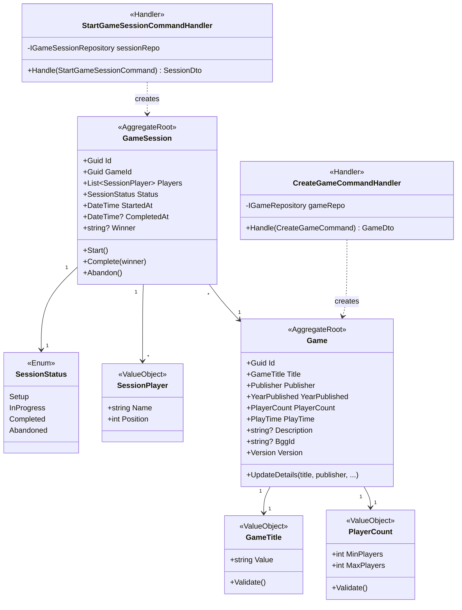
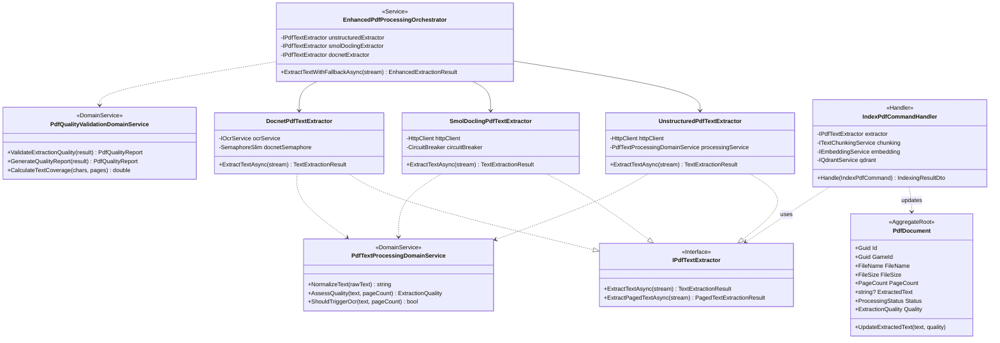
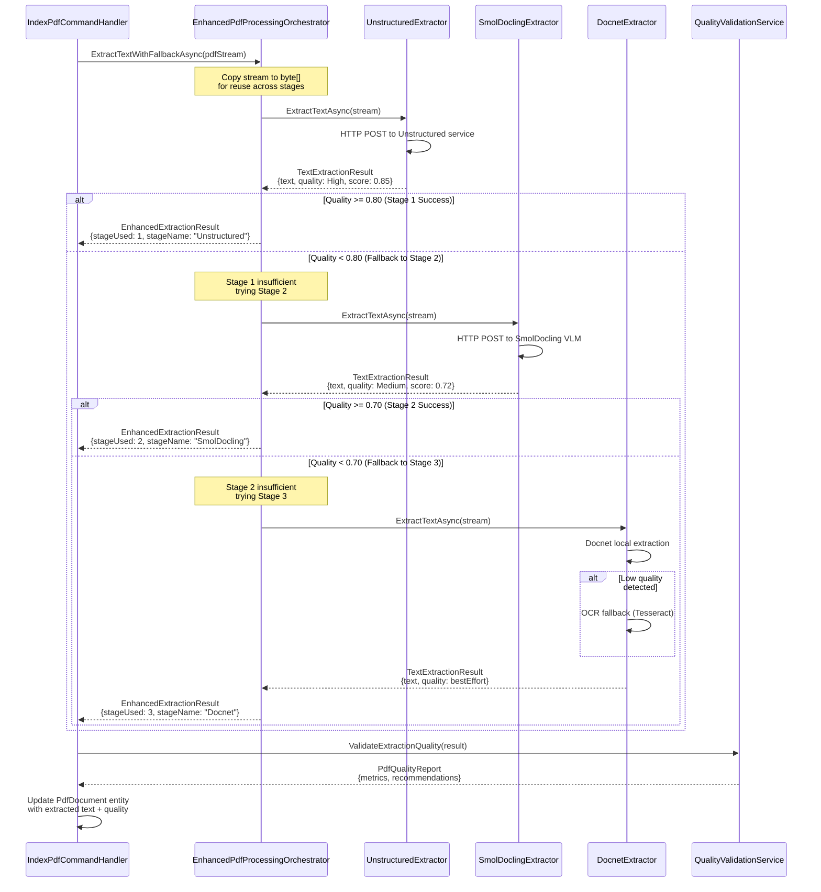
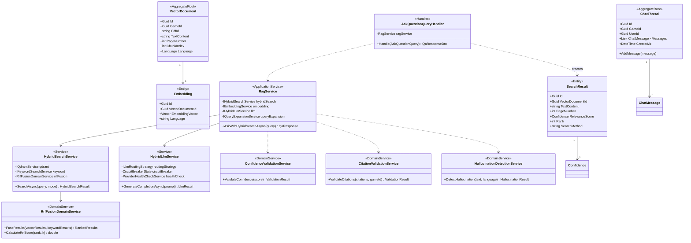
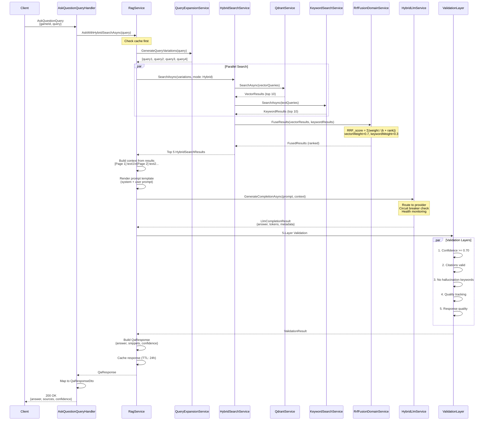
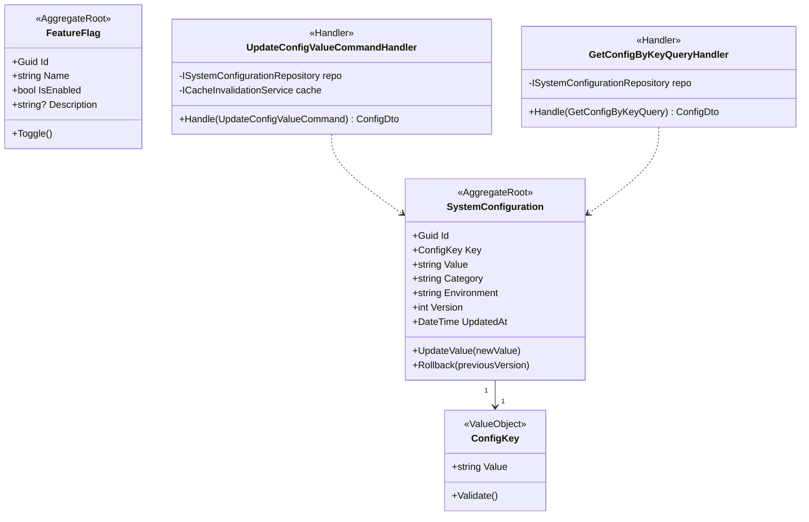
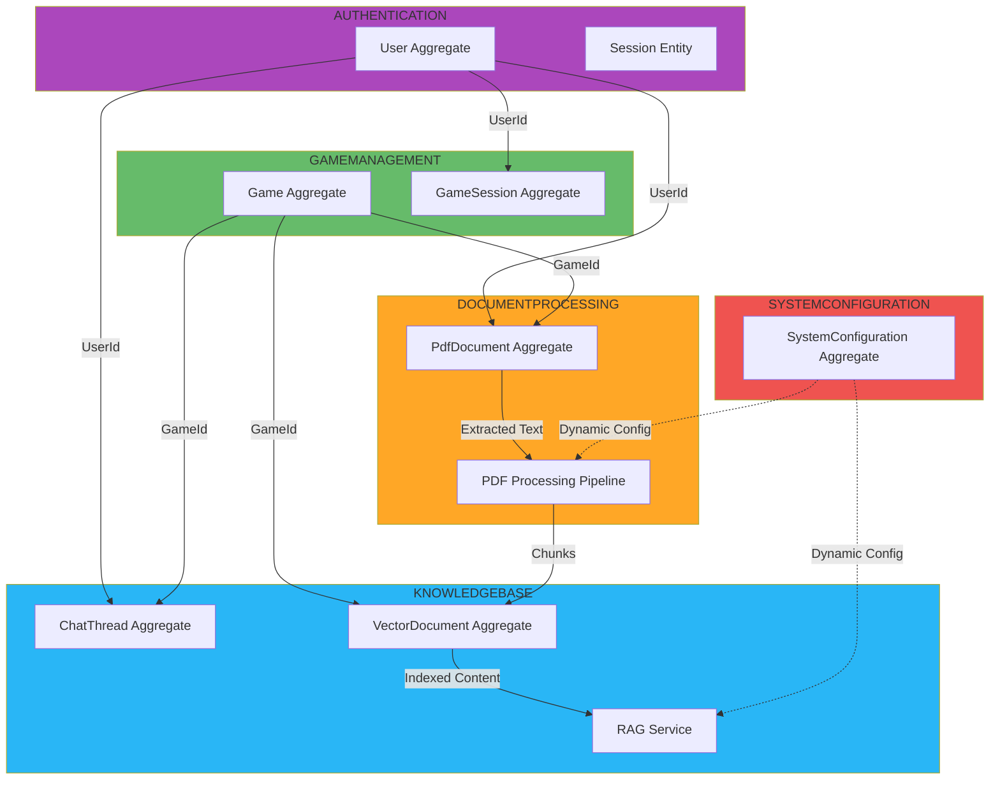

# Diagrammi Interazioni Bounded Contexts

## 1. AUTHENTICATION - Bounded Context

### Class Diagram

### Sequence: Login with 2FA

---

## 2. GAMEMANAGEMENT - Bounded Context

### Class Diagram

---

## 3. DOCUMENTPROCESSING - Bounded Context

### Class Diagram: PDF Pipeline

### Sequence: 3-Stage PDF Extraction

---

## 4. KNOWLEDGEBASE - Bounded Context (RAG System)

### Class Diagram: RAG Components

### Sequence: RAG Query with Hybrid Search

---

## 5. SYSTEMCONFIGURATION - Bounded Context

### Class Diagram

---

## 6. Relazioni Cross-Context

---

**Totale Bounded Contexts**: 7
**Totale Aggregates**: 12
**Totale Handlers**: 72+
**Pattern**: DDD + CQRS + Clean Architecture

**Versione**: 1.0
**Data**: 2025-11-13
