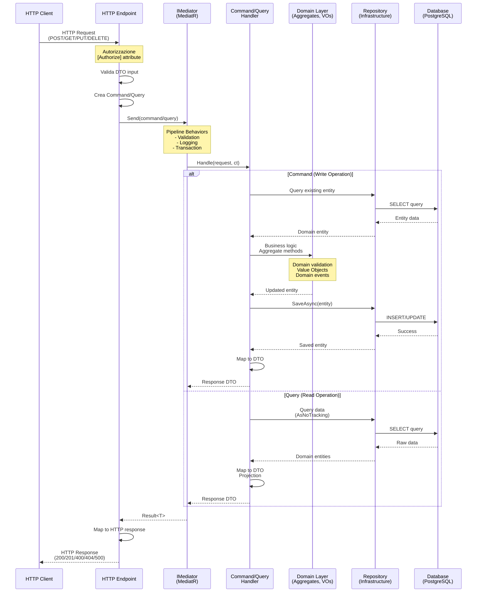
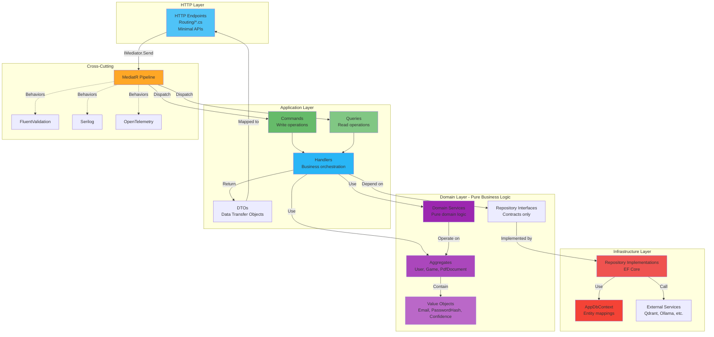
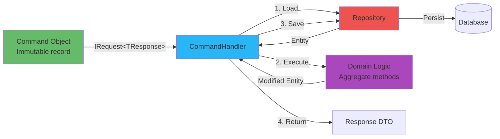
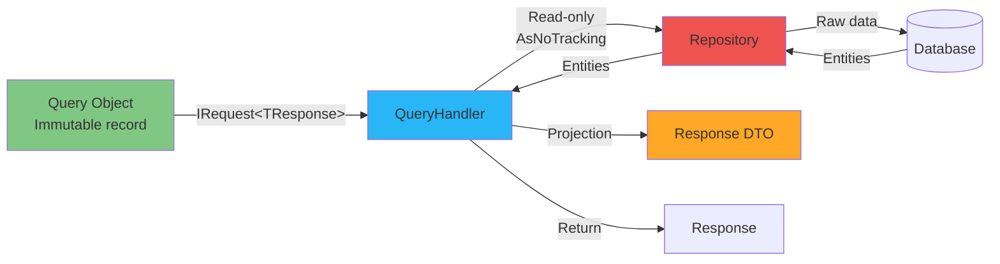
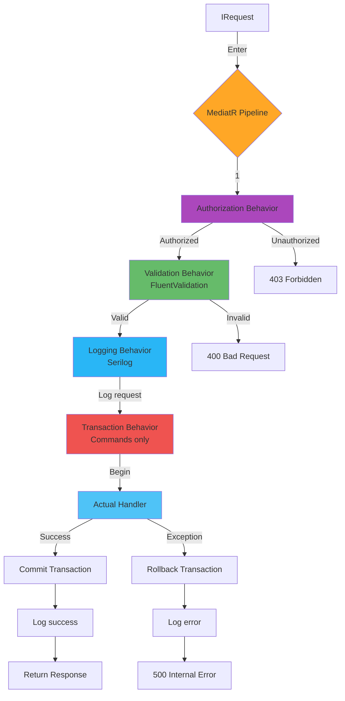
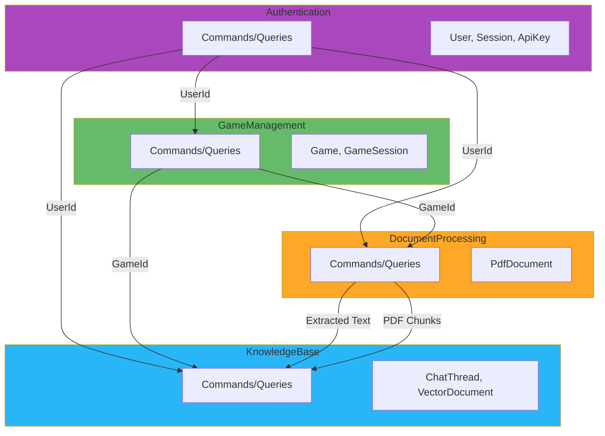
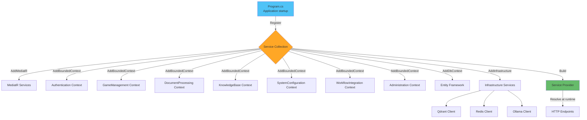

# Diagramma Flusso CQRS/MediatR

## Pattern CQRS - Flow Generale



## Esempio Concreto: User Registration

```mermaid
sequenceDiagram
    participant Client
    participant Endpoint as POST /api/v1/auth/register
    participant Mediator as IMediator
    participant Handler as RegisterCommandHandler
    participant User as User Aggregate
    participant Session as Session Entity
    participant URepo as IUserRepository
    participant SRepo as ISessionRepository
    participant UoW as IUnitOfWork
    participant DB as PostgreSQL

    Client->>Endpoint: POST<br/>{email, password, displayName}

    Endpoint->>Endpoint: Valida input<br/>[FromBody] validation

    Endpoint->>Endpoint: Crea RegisterCommand
    Note over Endpoint: new RegisterCommand(<br/>  Email: dto.Email,<br/>  Password: dto.Password,<br/>  DisplayName: dto.DisplayName<br/>)

    Endpoint->>Mediator: Send(registerCommand)

    Note over Mediator: ValidationBehavior<br/>checks command

    Mediator->>Handler: Handle(command, ct)

    Handler->>Handler: Crea Email ValueObject
    Note over Handler: var email = new Email(command.Email);<br/>Validation in constructor

    Handler->>URepo: GetByEmailAsync(email)
    URepo->>DB: SELECT * FROM Users<br/>WHERE Email = @email
    DB-->>URepo: null (not found)
    URepo-->>Handler: null

    Handler->>Handler: Crea PasswordHash ValueObject
    Note over Handler: var passwordHash =<br/>PasswordHash.Create(command.Password);<br/>PBKDF2 210k iterations

    Handler->>Handler: Crea Role ValueObject
    Note over Handler: var role = Role.Parse("User")

    Handler->>User: new User(<br/>id, email, displayName,<br/>passwordHash, role)
    Note over User: Domain validation<br/>in constructor
    User-->>Handler: User aggregate

    Handler->>Session: CreateSession(user,<br/>ipAddress, userAgent)
    Note over Session: SessionToken generated<br/>ExpiresAt = Now + 30d
    Session-->>Handler: Session entity

    Handler->>URepo: AddAsync(user, ct)
    URepo->>DB: INSERT INTO Users
    DB-->>URepo: UserId
    URepo-->>Handler: Success

    Handler->>SRepo: AddAsync(session, ct)
    SRepo->>DB: INSERT INTO Sessions
    DB-->>SRepo: SessionId
    SRepo-->>Handler: Success

    Handler->>UoW: SaveChangesAsync(ct)
    Note over UoW: Transaction commit
    UoW->>DB: COMMIT
    DB-->>UoW: Success
    UoW-->>Handler: Saved

    Handler->>Handler: Map to RegisterResponse DTO
    Note over Handler: MapToUserDto(user)<br/>+ sessionToken + expiresAt

    Handler-->>Mediator: RegisterResponse
    Mediator-->>Endpoint: RegisterResponse

    Endpoint->>Endpoint: Set-Cookie header<br/>(httpOnly, secure)

    Endpoint-->>Client: 200 OK<br/>{user, sessionToken, expiresAt}
```

## Layered Architecture (DDD + CQRS)



## Command vs Query Pattern

### Command Pattern (Write)



**Caratteristiche**:
- Modifica stato
- Transazionale (UnitOfWork)
- Validazione completa
- Domain events
- Audit logging

### Query Pattern (Read)



**Caratteristiche**:
- Nessuna modifica stato
- AsNoTracking (30% più veloce)
- Proiezione diretta a DTO
- Caching possibile
- Nessuna transazione

## MediatR Pipeline Behaviors



## Bounded Context Interactions



## Dependency Injection Flow



---

**Pattern**: Clean Architecture + DDD + CQRS + Event Sourcing (partial)

**Versione**: 1.0
**Data**: 2025-11-13
