# GitHub Actions Flow Diagram

Questo documento rappresenta la sequenza completa di GitHub Actions attivate da vari eventi nel repository MeepleAI.

> **Nota**: I diagrammi sono stati suddivisi in sezioni separate per migliorare la leggibilità. Ogni workflow è rappresentato in dettaglio nella propria sezione.

---

## 📋 Indice

1. [Overview: Trigger e Workflow](#overview-trigger-e-workflow)
2. [CI Workflow (ci.yml)](#ci-workflow-ciyml)
3. [Security Workflow (security-scan.yml)](#security-workflow-security-scanyml)
4. [K6 Performance Workflow (k6-performance.yml)](#k6-performance-workflow-k6-performanceyml)
5. [Lighthouse CI Workflow (lighthouse-ci.yml)](#lighthouse-ci-workflow-lighthouse-ciyml)
6. [Storybook Deploy Workflow (storybook-deploy.yml)](#storybook-deploy-workflow-storybook-deployyml)
7. [Dependabot Automerge Workflow (dependabot-automerge.yml)](#dependabot-automerge-workflow-dependabot-automergeyml)
8. [Migration Guard Workflow (migration-guard.yml)](#migration-guard-workflow-migration-guardyml)
9. [Sequenze di Esecuzione](#sequenze-di-esecuzione)

---

## Overview: Trigger e Workflow

Questo diagramma mostra la relazione di alto livello tra eventi trigger e workflow GitHub Actions.

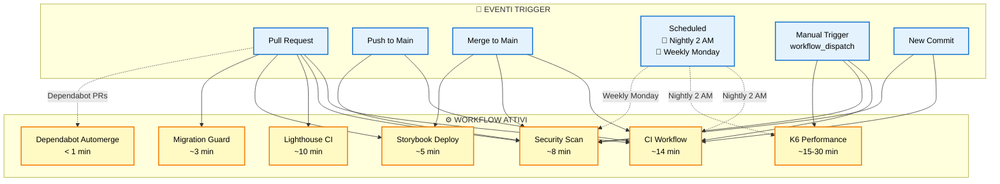

### Legenda Eventi Trigger

| Evento | Descrizione | Frequenza |
|--------|-------------|-----------|
| **Pull Request** | Apertura, sincronizzazione o riapertura di una PR | On-demand |
| **Push to Main** | Push diretto al branch main | On-demand |
| **Merge to Main** | Merge di una PR nel branch main | On-demand |
| **Scheduled** | Esecuzione programmata (cron) | Nightly 2 AM UTC + Weekly Monday |
| **Manual Trigger** | Esecuzione manuale via `workflow_dispatch` | On-demand |
| **New Commit** | Nuovo commit su PR o branch | On-demand |

---

## CI Workflow (ci.yml)

Il workflow CI è il cuore del sistema di testing e validazione. Include detection intelligente dei path modificati per eseguire solo i test necessari.

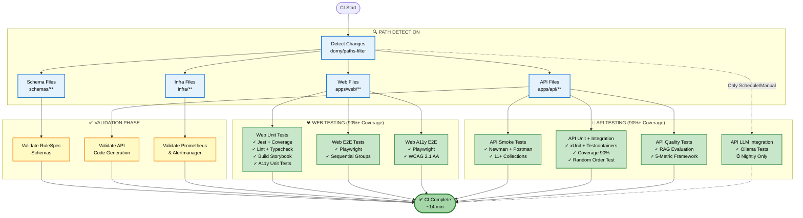

### Path Filters & Ottimizzazioni

Il workflow CI utilizza `dorny/paths-filter` per eseguire solo i job necessari:

| Path Pattern | Trigger | Job Eseguiti |
|--------------|---------|--------------|
| `apps/web/**` | Web files | Web unit, E2E, A11y, Lighthouse |
| `apps/api/**` | API files | API unit, smoke, quality tests |
| `infra/**` | Infrastructure | Observability validation |
| `schemas/**` | Schema files | Schema validation |
| `Migrations/**` | Migration files | Migration guard |
| `components/**`, `.storybook/**` | Component files | Storybook build |

---

## Security Workflow (security-scan.yml)

Workflow di sicurezza con SAST, dependency scanning e code analysis.

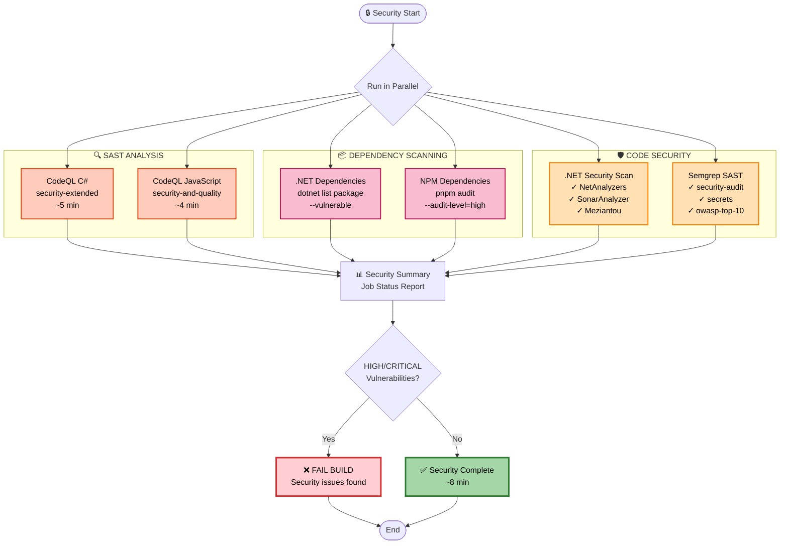

### Security Quality Gates

| Tipo | Strumento | Enforcement |
|------|-----------|-------------|
| **SAST** | CodeQL + Semgrep | HIGH/CRITICAL = fail build |
| **Dependencies** | dotnet + pnpm audit | HIGH/CRITICAL vulns = fail |
| **Code Analysis** | NetAnalyzers + SonarAnalyzer | Enforced rules |
| **Secrets Detection** | Semgrep secrets | Auto-fail |

---

## K6 Performance Workflow (k6-performance.yml)

Workflow di performance testing con K6 per load testing, stress testing e smoke testing.

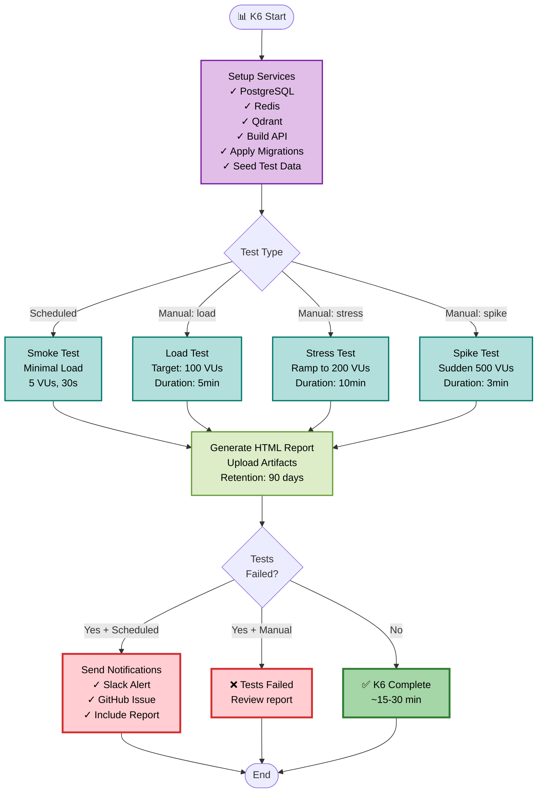

### K6 Test Types

| Tipo | VUs | Durata | Trigger | Scopo |
|------|-----|--------|---------|-------|
| **Smoke** | 5 | 30s | Scheduled (nightly) | Validazione base |
| **Load** | 100 | 5min | Manual | Performance normale |
| **Stress** | 200 (ramp) | 10min | Manual | Limiti sistema |
| **Spike** | 500 (sudden) | 3min | Manual | Resilienza picchi |

---

## Lighthouse CI Workflow (lighthouse-ci.yml)

Workflow per performance testing frontend e Core Web Vitals.

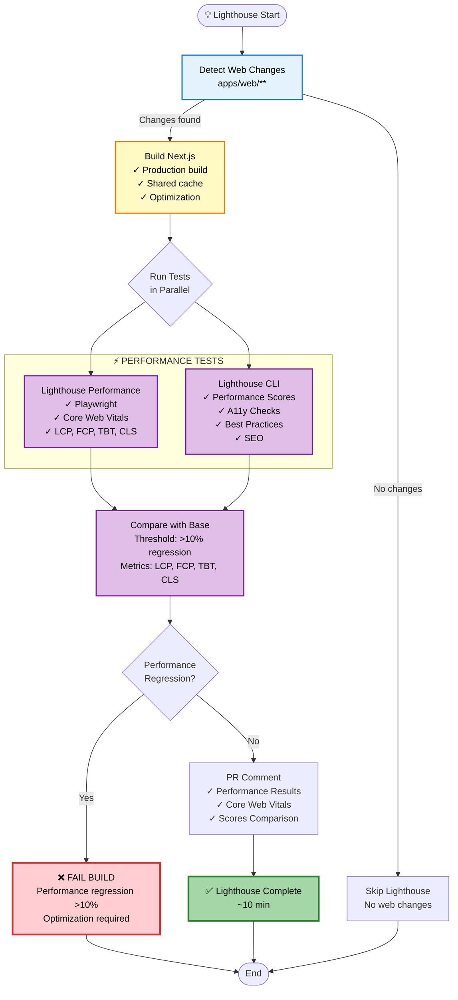

### Core Web Vitals Thresholds

| Metrica | Good | Needs Improvement | Poor | Regression Limit |
|---------|------|-------------------|------|------------------|
| **LCP** (Largest Contentful Paint) | ≤2.5s | 2.5-4.0s | >4.0s | >10% |
| **FCP** (First Contentful Paint) | ≤1.8s | 1.8-3.0s | >3.0s | >10% |
| **TBT** (Total Blocking Time) | ≤200ms | 200-600ms | >600ms | >10% |
| **CLS** (Cumulative Layout Shift) | ≤0.1 | 0.1-0.25 | >0.25 | >10% |

---

## Storybook Deploy Workflow (storybook-deploy.yml)

Workflow per visual testing con Chromatic.

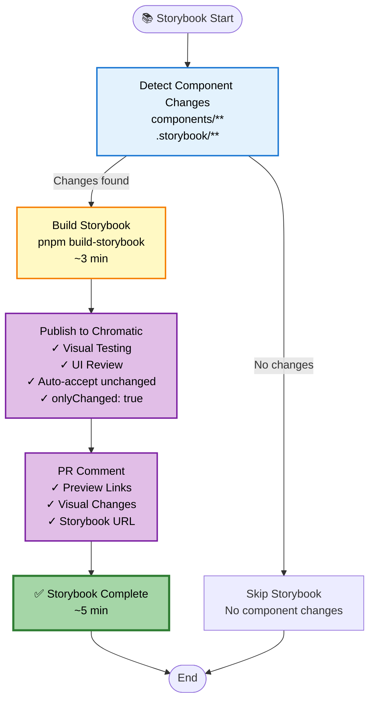

### Chromatic Features

| Feature | Descrizione | Beneficio |
|---------|-------------|-----------|
| **Visual Testing** | Snapshot comparison automatico | Detect UI regressions |
| **UI Review** | Commenti direttamente sui componenti | Collaboration migliorata |
| **Auto-accept** | Skip componenti non modificati | Performance migliorata |
| **Preview Links** | Link diretti nella PR | Review facilitato |

---

## Dependabot Automerge Workflow (dependabot-automerge.yml)

Workflow per auto-merge automatico delle PR Dependabot con label `automerge`.

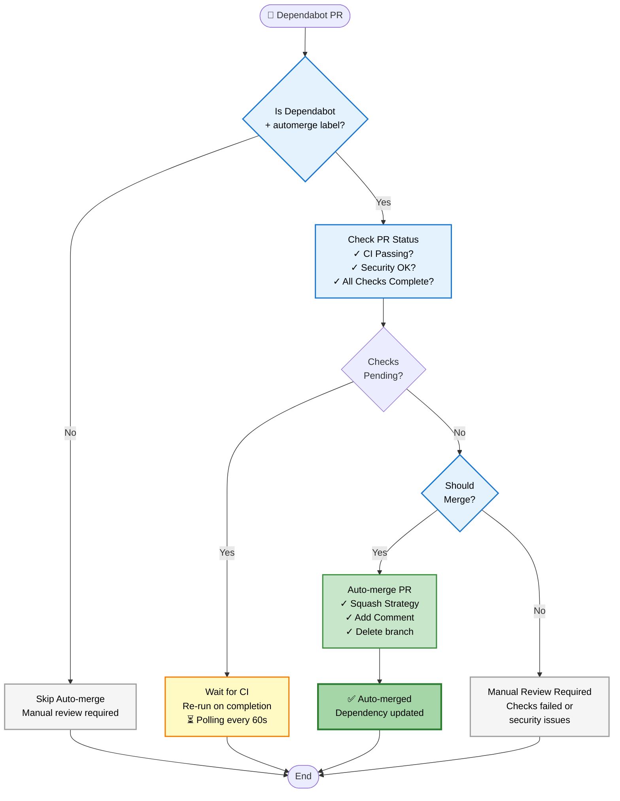

### Auto-merge Criteria

| Criterio | Requirement | Azione se fallisce |
|----------|-------------|-------------------|
| **Label** | `automerge` presente | Skip auto-merge |
| **Author** | Dependabot | Skip auto-merge |
| **CI Status** | All checks passed | Wait or manual review |
| **Security** | No HIGH/CRITICAL vulns | Manual review |
| **Conflicts** | No merge conflicts | Manual review |

---

## Migration Guard Workflow (migration-guard.yml)

Workflow per validazione delle migrazioni EF Core e prevenzione di breaking changes.

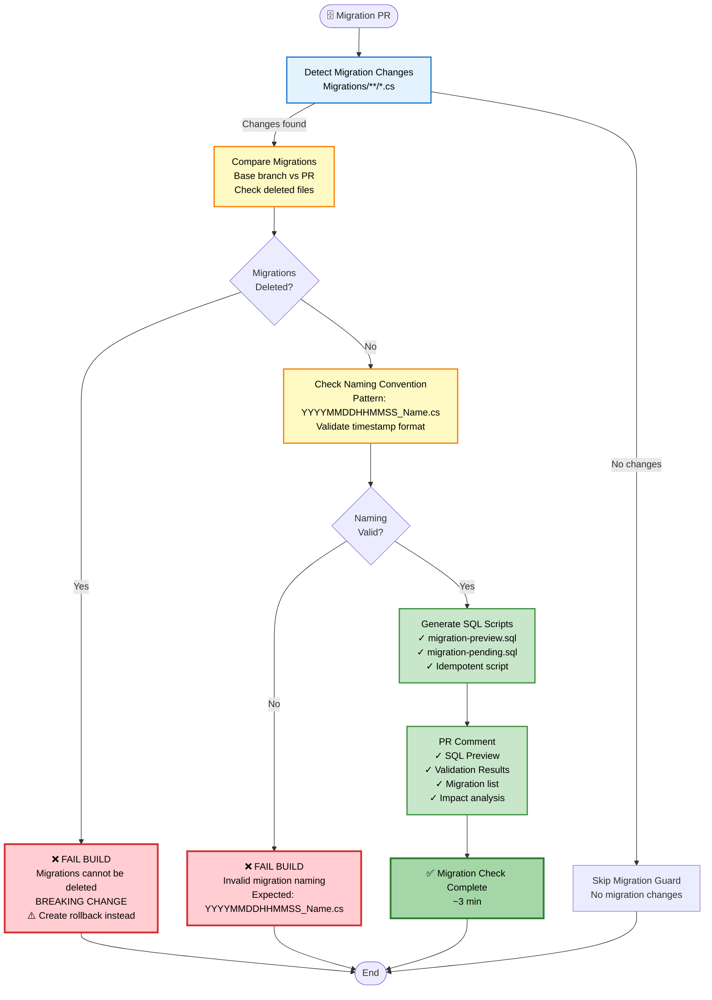

### Migration Validation Rules

| Rule | Description | Enforcement |
|------|-------------|-------------|
| **No Deletion** | Migrations cannot be deleted | Hard fail (breaking change) |
| **Naming Convention** | `YYYYMMDDHHMMSS_Name.cs` | Hard fail |
| **SQL Preview** | Generate preview scripts | Informational |
| **Idempotent** | Scripts must be rerunnable | Warning |

---

## Sequenze di Esecuzione

### Sequenza Tipica per Pull Request

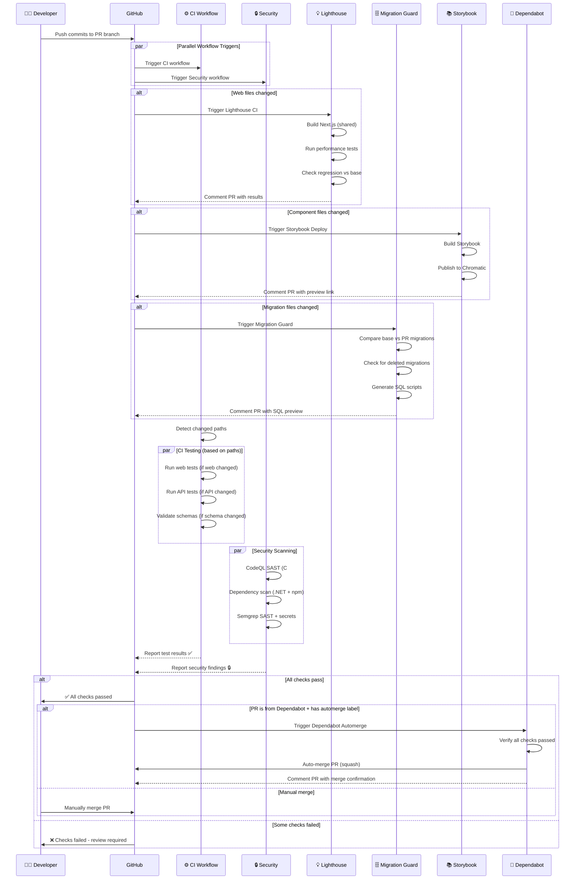

---

### Sequenza per Push/Merge to Main

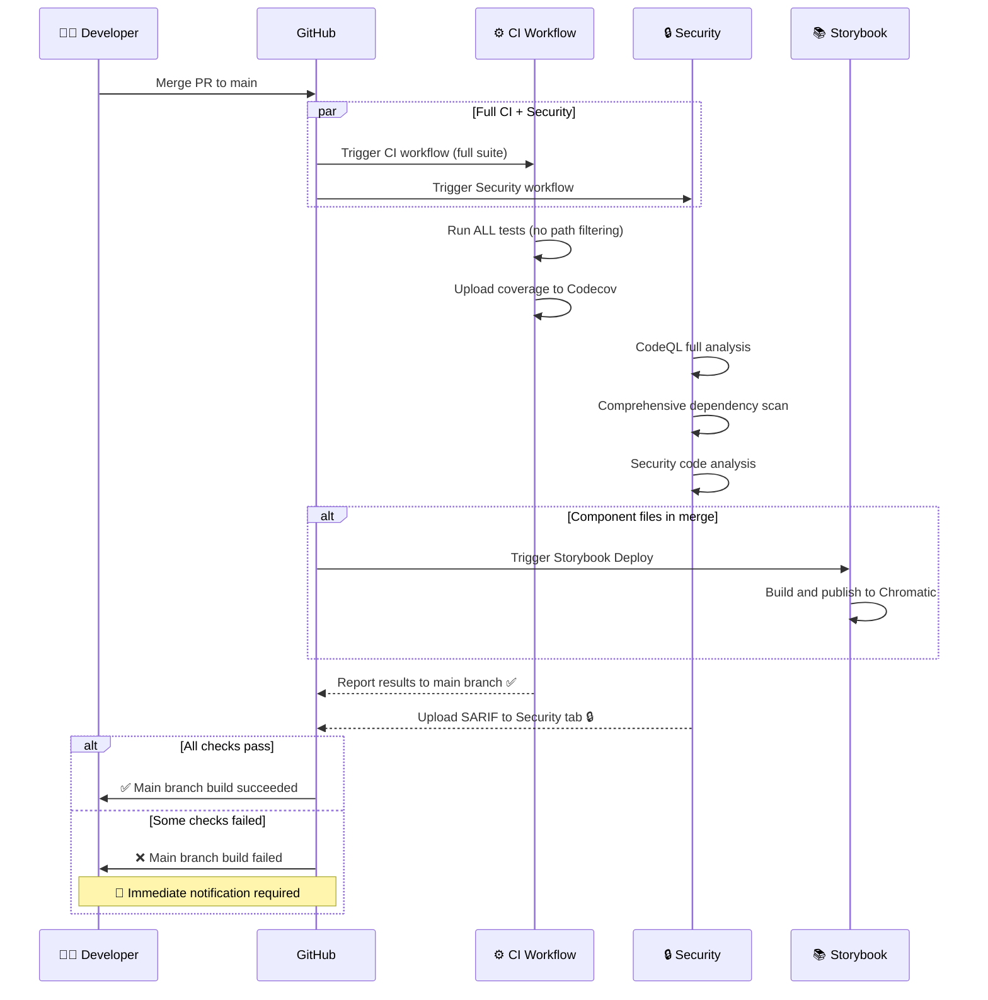

---

### Sequenza per Scheduled Runs (Nightly)

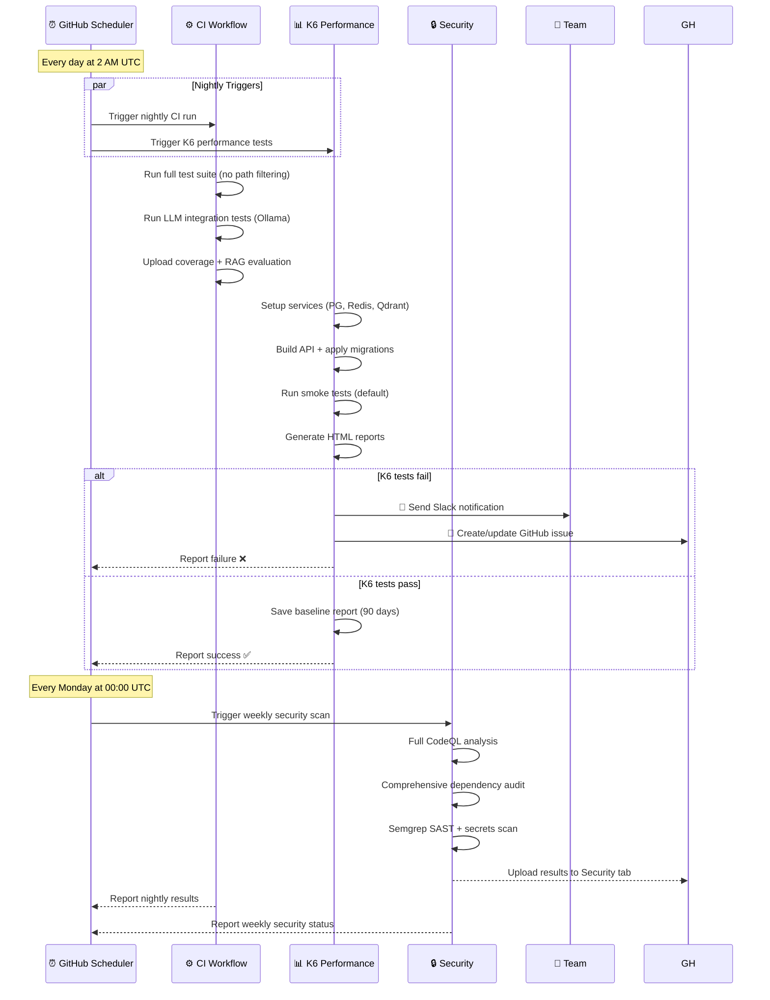

---

## Dettagli Tecnici

### Concurrency Control

Tutti i workflow utilizzano `concurrency.cancel-in-progress: true` per evitare l'accumulo di esecuzioni:

```yaml
concurrency:
  group: ci-${{ github.workflow }}-${{ github.event.pull_request.number || github.ref }}
  cancel-in-progress: true
```

**Benefici**:
- Risparmio risorse CI/CD
- Feedback più veloce su nuovi commit
- Evita code di esecuzione

---

### Permission Model (Least Privilege)

Ogni workflow dichiara esplicitamente le permission minime necessarie (Issue #1455):

```yaml
permissions:
  contents: read        # Checkout code
  pull-requests: write  # Comment on PRs
  checks: write         # Report test results
  actions: write        # Upload artifacts
  security-events: write # Upload SARIF (security only)
```

**Principio**: Ogni job ottiene solo i permessi strettamente necessari.

---

### Artifact Retention

| Tipo Artifact | Retention | Motivo | Size Avg |
|---------------|-----------|---------|----------|
| Coverage reports | 7 days | Debug failures | ~50 MB |
| Security reports (SARIF) | 30 days | Audit trail | ~5 MB |
| Newman reports | 14 days | API validation | ~10 MB |
| K6 baseline | 90 days | Performance trending | ~20 MB |
| Migration SQL | 30 days | Database audit | ~1 MB |
| Playwright reports | 7 days | E2E debugging | ~100 MB |
| Lighthouse reports | 14 days | Performance tracking | ~10 MB |

---

### Notifiche e Alerting

| Evento | Canale | Condizione | Destinatari |
|--------|--------|------------|-------------|
| **K6 Failures** | Slack + GitHub Issue | Scheduled runs only | @team-backend |
| **Security HIGH/CRITICAL** | GitHub Security tab | Always | @team-security |
| **Performance Regression >10%** | PR comment | PR only | PR author |
| **Migration Deleted** | PR comment + fail build | Always | PR author |
| **Dependabot Auto-merge** | PR comment | Successful merge | @dependabot |
| **Main Build Failure** | Email + Slack | Push to main | @team-all |

---

## Test Coverage & Quality Gates

| Area | Target | Strumento | Enforcement | Fail Build |
|------|--------|-----------|-------------|------------|
| **Frontend Unit** | ≥90% | Jest + RTL | ✅ Enforced | Yes |
| **Backend Unit + Integration** | ≥90% | xUnit + Coverlet | ✅ Enforced | Yes |
| **E2E** | Critical paths | Playwright | ⚠️ Warning | No |
| **A11y** | WCAG 2.1 AA | jest-axe + Playwright | ⚠️ Warning | No |
| **Performance** | Core Web Vitals | Lighthouse | ✅ Enforced (>10%) | Yes |
| **Security** | No HIGH/CRITICAL | CodeQL + Semgrep | ✅ Enforced | Yes |
| **RAG Quality** | 5-metric framework | Custom evaluator | ✅ Enforced | Yes |
| **Dependencies** | No vulnerable deps | dotnet + pnpm audit | ✅ Enforced | Yes |

---

## Palette Colori

I diagrammi utilizzano una palette di colori standard web-safe per garantire la massima compatibilità:

| Colore | Hex | Utilizzo |
|--------|-----|----------|
| **Blu Chiaro** | #E3F2FD | Trigger events, detection |
| **Verde Chiaro** | #C8E6C9 | Test, validation, success states |
| **Arancione Chiaro** | #FFCCBC | Security, SAST |
| **Rosa Chiaro** | #F8BBD0 | Dependencies |
| **Viola Chiaro** | #E1BEE7 | Performance testing |
| **Giallo Chiaro** | #FFF9C4 | Workflow, build phases |
| **Rosso Chiaro** | #FFCDD2 | Failures, errors |
| **Verde Scuro** | #A5D6A7 | Successful completion |
| **Grigio Chiaro** | #F5F5F5 | Skip, neutral states |

Questi colori seguono le linee guida Material Design e sono ottimizzati per:
- ✅ Accessibilità (WCAG 2.1 AA)
- ✅ Compatibilità GitHub
- ✅ Stampa in bianco/nero
- ✅ Daltonismo (protanopia, deuteranopia, tritanopia)

---

## Riepilogo Workflow

| Workflow | Trigger | Durata | Criticità | Path Filter |
|----------|---------|--------|-----------|-------------|
| **CI** | PR, Push, Schedule, Manual | ~14 min | 🔴 Critical | ✅ Yes |
| **Security** | PR, Push, Schedule, Manual | ~8 min | 🔴 Critical | ❌ No |
| **K6 Performance** | Schedule (nightly), Manual | ~15-30 min | 🟡 High | ❌ No |
| **Lighthouse CI** | PR (web files) | ~10 min | 🟡 High | ✅ Yes |
| **Storybook** | PR (components) | ~5 min | 🟢 Medium | ✅ Yes |
| **Dependabot** | Dependabot PR | <1 min | 🟢 Medium | ❌ No |
| **Migration Guard** | PR (migrations) | ~3 min | 🔴 Critical | ✅ Yes |

**Total Average PR Time**: ~22 min (with path filtering)
**Total Full Suite Time**: ~50 min (scheduled, no filtering)

---

**Versione**: 2.0
**Ultimo Aggiornamento**: 2025-11-22
**Autore**: Claude (GitHub Actions Flow Analysis - Refactored)
**Changelog**:
- 2.0: Diagrammi separati per workflow, colori standard, migliorata leggibilità
- 1.0: Versione iniziale con diagramma unico complesso
