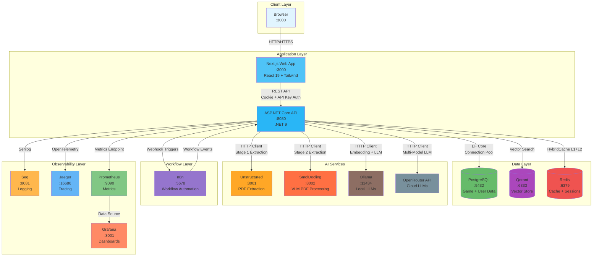
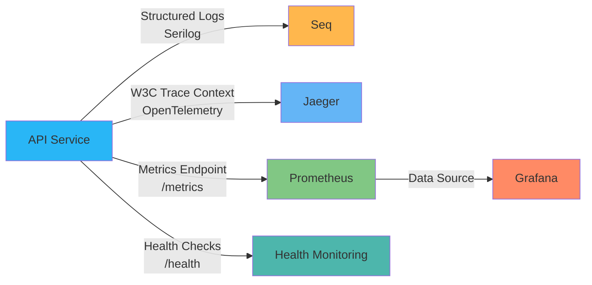

# Diagramma Infrastruttura MeepleAI

## Infrastruttura Docker Compose



## Porte e Servizi

| Servizio | Porta | Tecnologia | Scopo |
|----------|-------|------------|-------|
| **Web App** | 3000 | Next.js 16 + React 19 | Frontend UI |
| **API** | 8080 | ASP.NET Core 9 | Backend REST API |
| **PostgreSQL** | 5432 | PostgreSQL 16 | Database principale |
| **Qdrant** | 6333 | Qdrant | Vector database per RAG |
| **Redis** | 6379 | Redis 7 | Cache L2 + Sessions |
| **Unstructured** | 8001 | Python FastAPI | PDF extraction Stage 1 |
| **SmolDocling** | 8002 | Python + VLM | PDF extraction Stage 2 |
| **Ollama** | 11434 | Ollama | LLM locale + Embeddings |
| **n8n** | 5678 | n8n | Workflow automation |
| **Seq** | 8081 | Seq | Centralized logging |
| **Jaeger** | 16686 | Jaeger | Distributed tracing |
| **Prometheus** | 9090 | Prometheus | Metrics collection |
| **Grafana** | 3001 | Grafana | Monitoring dashboards |

## Flusso Dati Principali

### 1. Autenticazione (Dual Auth)
```
Browser → Web → API
         ↓
    Cookie Session (httpOnly, secure)
         OR
    API Key (mpl_{env}_{base64})
         ↓
    Validation → Redis (Session Store)
                 PostgreSQL (User + ApiKey)
```

### 2. Upload e Processing PDF
```
Browser → Web → API → PostgreSQL (PdfDocument entity)
                 ↓
            Stage 1: Unstructured Service (:8001)
                 ↓ (if quality < 0.80)
            Stage 2: SmolDocling Service (:8002)
                 ↓ (if quality < 0.70)
            Stage 3: Docnet (local library)
                 ↓
            Text Extraction Complete
                 ↓
            Chunking → Ollama (Embedding)
                 ↓
            Qdrant (Vector Indexing)
```

### 3. RAG Query (Hybrid Search)
```
Browser → Web → API
         ↓
    Query Expansion (4 variations)
         ↓
    Parallel Search:
    ├─ Qdrant (Vector Search)
    └─ PostgreSQL (Keyword FTS)
         ↓
    RRF Fusion (70/30 weights)
         ↓
    LLM Generation:
    ├─ Ollama (free tier 80%)
    └─ OpenRouter (paid 20%)
         ↓
    5-Layer Validation
         ↓
    Response + Citations
```

## Connessioni Osservabilità



## Stack Tecnologico Completo

### Backend
- **Runtime**: .NET 9 (ASP.NET Core)
- **Architecture**: DDD + CQRS (MediatR)
- **ORM**: Entity Framework Core 9
- **Database**: PostgreSQL 16
- **Cache**: Redis 7 + HybridCache
- **Vector DB**: Qdrant

### Frontend
- **Framework**: Next.js 16 (App Router)
- **UI Library**: React 19
- **Components**: Shadcn/UI (Radix + Tailwind CSS 4)
- **State**: React Context + Hooks
- **API Client**: Fetch with cookie auth

### AI/ML
- **LLM Providers**: OpenRouter (GPT-4, Claude), Ollama (Llama 3.3)
- **Embeddings**: Ollama (nomic-embed-text 384D)
- **PDF Processing**: Unstructured, SmolDocling VLM, Docnet
- **OCR**: Tesseract

### DevOps
- **Container**: Docker + Docker Compose
- **CI/CD**: GitHub Actions
- **Logging**: Serilog → Seq
- **Tracing**: OpenTelemetry → Jaeger
- **Metrics**: Prometheus + Grafana
- **Security**: CodeQL SAST, Dependabot

---

**Versione**: 1.0
**Data**: 2025-11-13
**Autore**: Claude Code Analysis
