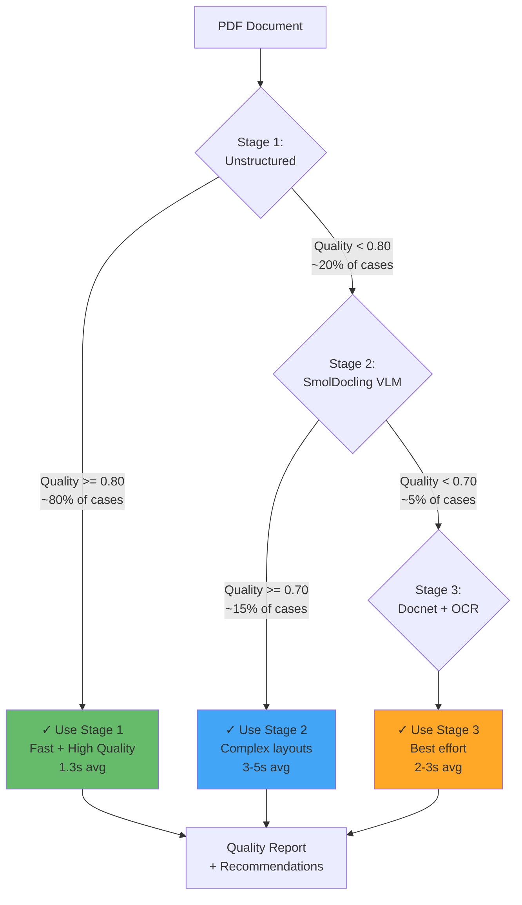
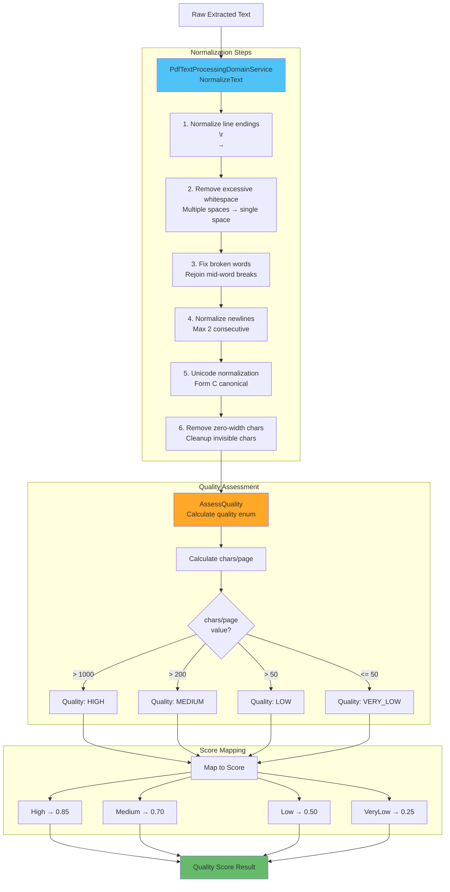
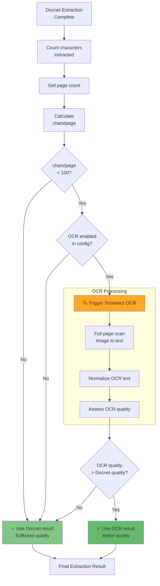
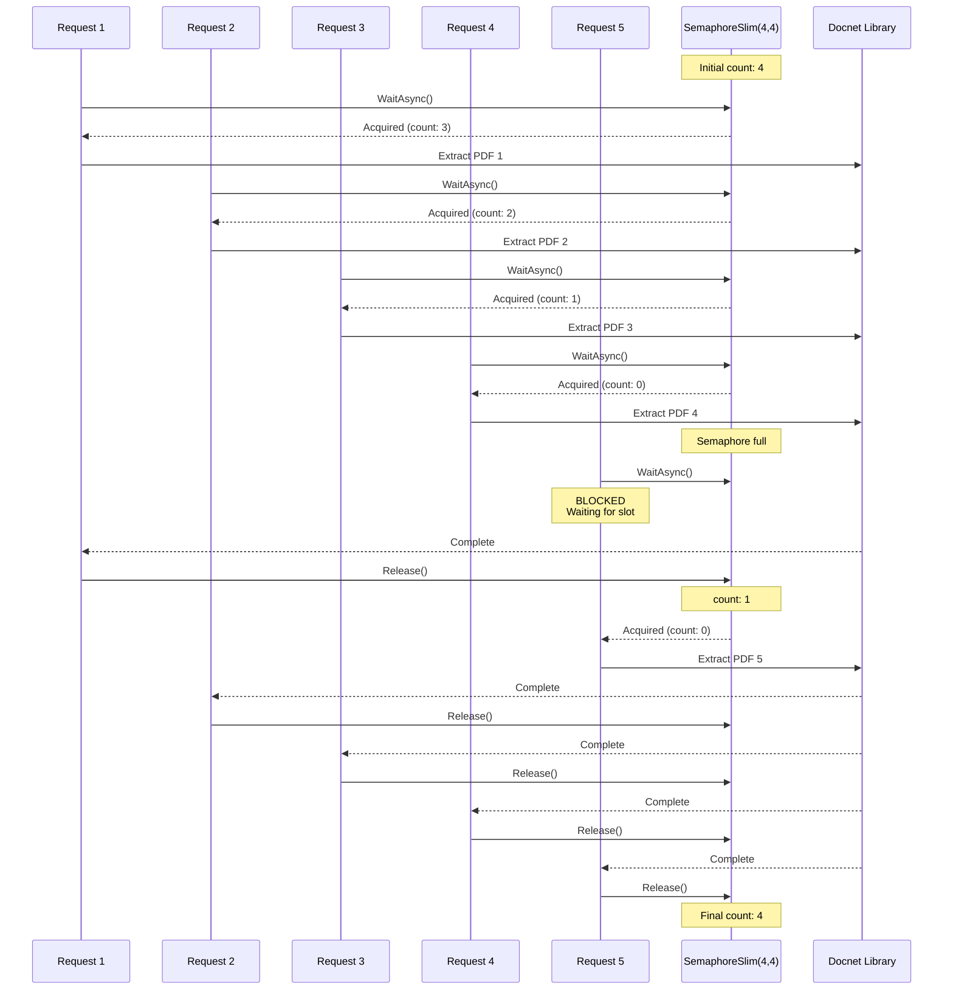
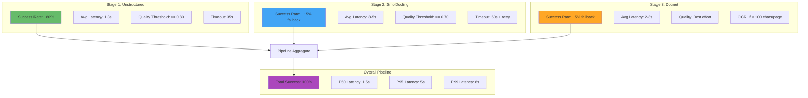
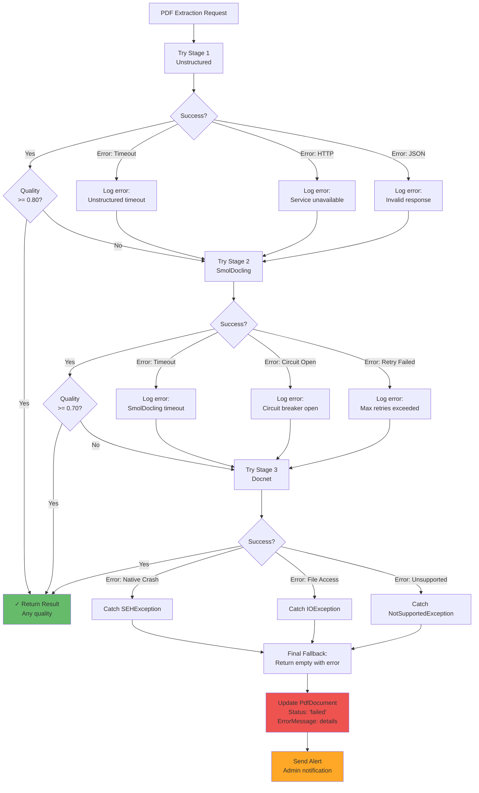

# Pipeline PDF Processing - Diagrammi Dettagliati

## 3-Stage PDF Extraction Pipeline (Fallback Architecture)

```mermaid
flowchart TD
    Start([PDF Upload<br/>POST /api/v1/ingest/pdf]) --> Save[Save PDF File<br/>Create PdfDocument entity]

    Save --> Queue[Enqueue IndexPdfCommand<br/>Background job]

    Queue --> Orchestrator[EnhancedPdfProcessingOrchestrator<br/>ExtractTextWithFallbackAsync]

    Orchestrator --> CopyStream[Copy PDF Stream<br/>to byte array<br/>for reuse across stages]

    CopyStream --> Stage1Start[🚀 STAGE 1: Unstructured]

    subgraph "Stage 1: Unstructured (Primary - 80% success)"
        Stage1Start --> S1HTTP[HTTP POST to<br/>Unstructured Service :8001]
        S1HTTP --> S1Wait[Wait response<br/>Timeout: 35s]
        S1Wait --> S1Parse[Parse response<br/>quality_score: 0.0-1.0]
        S1Parse --> S1Quality{Quality Score<br/>>= 0.80?}

        S1Quality -->|Yes ✓| S1Success[✓ STAGE 1 SUCCESS<br/>Quality: High<br/>Avg time: ~1.3s]
        S1Quality -->|No ✗| S1Fail[✗ Quality insufficient<br/>Proceed to Stage 2]
    end

    S1Success --> QualityValidation
    S1Fail --> Stage2Start

    Stage2Start[🚀 STAGE 2: SmolDocling VLM]

    subgraph "Stage 2: SmolDocling (Fallback 1 - 15% success)"
        Stage2Start --> S2Reset[Reset stream<br/>from byte array]
        S2Reset --> S2HTTP[HTTP POST to<br/>SmolDocling Service :8002]
        S2HTTP --> S2Wait[Wait response<br/>Timeout: 60s<br/>Retry: 3x exponential backoff]
        S2Wait --> S2Parse[Parse response<br/>VLM quality_score]
        S2Parse --> S2Quality{Quality Score<br/>>= 0.70?}

        S2Quality -->|Yes ✓| S2Success[✓ STAGE 2 SUCCESS<br/>Quality: Medium/High<br/>Avg time: 3-5s]
        S2Quality -->|No ✗| S2Fail[✗ Quality insufficient<br/>Proceed to Stage 3]
    end

    S2Success --> QualityValidation
    S2Fail --> Stage3Start

    Stage3Start[🚀 STAGE 3: Docnet]

    subgraph "Stage 3: Docnet (Fallback 2 - 5% success)"
        Stage3Start --> S3Reset[Reset stream<br/>from byte array]
        S3Reset --> S3Save[Save to temp file<br/>Docnet requires file path]
        S3Save --> S3Semaphore[Acquire semaphore<br/>Max 4 concurrent]
        S3Semaphore --> S3Extract[Docnet extraction<br/>Native library]
        S3Extract --> S3Assess[Assess quality<br/>chars/page calculation]
        S3Assess --> S3OCR{Should trigger<br/>OCR?<br/>< 100 chars/page}

        S3OCR -->|Yes| S3Tesseract[Tesseract OCR<br/>Full page scan]
        S3OCR -->|No| S3Done
        S3Tesseract --> S3CompareOCR{OCR better<br/>than raw?}
        S3CompareOCR -->|Yes| S3UseOCR[Use OCR result]
        S3CompareOCR -->|No| S3UseRaw[Use raw extraction]

        S3UseOCR --> S3Done[✓ STAGE 3 COMPLETE<br/>Best effort<br/>Avg time: 2-3s]
        S3UseRaw --> S3Done
        S3Done --> S3Cleanup[Cleanup temp file<br/>Release semaphore]
    end

    S3Cleanup --> QualityValidation

    QualityValidation[PdfQualityValidationDomainService<br/>ValidateExtractionQuality]

    subgraph "Quality Validation Service"
        QualityValidation --> QMetrics[Calculate 4 Quality Metrics]

        QMetrics --> M1[1. Text Coverage Score<br/>40% weight<br/>chars/page normalized]
        QMetrics --> M2[2. Structure Detection Score<br/>20% weight<br/>titles, headers, lists]
        QMetrics --> M3[3. Table Detection Score<br/>20% weight<br/>game rules tables]
        QMetrics --> M4[4. Page Coverage Score<br/>20% weight<br/>all pages processed]

        M1 --> Aggregate[Aggregate Total Score<br/>Weighted average]
        M2 --> Aggregate
        M3 --> Aggregate
        M4 --> Aggregate

        Aggregate --> ThresholdCheck{Total Score<br/>comparison}

        ThresholdCheck -->|>= 0.80| Excellent[✓ Excellent Quality<br/>Suitable for RAG]
        ThresholdCheck -->|0.70-0.80| Good[⚠ Good Quality<br/>May need review]
        ThresholdCheck -->|0.50-0.70| Poor[⚠ Poor Quality<br/>Fallback recommended]
        ThresholdCheck -->|< 0.50| Critical[✗ Critical<br/>Document may be corrupted]
    end

    Excellent --> GenerateReport
    Good --> GenerateReport
    Poor --> GenerateReport
    Critical --> GenerateReport

    GenerateReport[Generate Quality Report<br/>Recommendations + Metrics]

    GenerateReport --> UpdateEntity[Update PdfDocument Entity]

    subgraph "Entity Update"
        UpdateEntity --> SetText[ExtractedText = normalized text]
        UpdateEntity --> SetQuality[ExtractionQuality = enum]
        UpdateEntity --> SetStatus[ProcessingStatus = 'completed']
        UpdateEntity --> SetMetadata[StageUsed, Duration, Metrics]
    end

    SetMetadata --> Indexing[Start Indexing Pipeline<br/>IndexPdfCommandHandler]

    subgraph "Indexing Pipeline"
        Indexing --> Chunking[TextChunkingService<br/>Sentence-level chunking]
        Chunking --> Embedding[EmbeddingService<br/>Generate embeddings<br/>Ollama: nomic-embed-text]
        Embedding --> Qdrant[QdrantService<br/>Index vector chunks]
        Qdrant --> Complete[✓ Indexing Complete<br/>Ready for RAG queries]
    end

    Complete --> End([Pipeline Complete])

    style Stage1Start fill:#81c784
    style S1Success fill:#66bb6a
    style Stage2Start fill:#64b5f6
    style S2Success fill:#42a5f5
    style Stage3Start fill:#ffb74d
    style S3Done fill:#ffa726
    style Excellent fill:#66bb6a
    style Critical fill:#ef5350
    style Complete fill:#ab47bc
```



## Stage Decision Tree



## Quality Scoring Formula

```mermaid
flowchart LR
    subgraph "Text Coverage (40%)"
        TC[chars/page]
        TC --> TCCalc{chars/page<br/>threshold}
        TCCalc -->|< 500| TC1[score = chars/500 * 0.5]
        TCCalc -->|500-1000| TC2[score = 0.5 + (chars-500)/500 * 0.5]
        TCCalc -->|>= 1000| TC3[score = 1.0]
        TC1 --> TCS[Text Coverage Score]
        TC2 --> TCS
        TC3 --> TCS
    end

    subgraph "Structure Detection (20%)"
        SD[Detected elements]
        SD --> SDE[Titles, headers,<br/>lists, paragraphs]
        SDE --> SDS[Structure Score<br/>0.0 - 1.0]
    end

    subgraph "Table Detection (20%)"
        TD[Table count]
        TD --> TDE[Game rules tables,<br/>setup tables]
        TDE --> TDS[Table Score<br/>0.0 - 1.0]
    end

    subgraph "Page Coverage (20%)"
        PC[Pages processed]
        PC --> PCCalc[processed / total]
        PCCalc --> PCS[Page Score<br/>0.0 - 1.0]
    end

    TCS --> Weighted[Weighted Sum]
    SDS --> Weighted
    TDS --> Weighted
    PCS --> Weighted

    Weighted --> Total[Total Quality Score<br/>0.0 - 1.0]

    Total --> Thresholds{Thresholds}
    Thresholds -->|>= 0.80| High[High Quality]
    Thresholds -->|0.70-0.80| Medium[Medium Quality]
    Thresholds -->|0.50-0.70| Low[Low Quality]
    Thresholds -->|< 0.50| VeryLow[Very Low Quality]

    style Weighted fill:#ffa726
    style Total fill:#66bb6a
```

## Text Processing Domain Service



## OCR Decision Logic (Stage 3)



## Concurrency Control (Docnet Semaphore)



**Rationale**: Docnet.Core is NOT thread-safe. Semaphore limits to max 4 concurrent operations to prevent crashes.

## Pipeline Performance Metrics



## Error Handling Strategy



## Configuration Options

```json
{
  "PdfProcessing": {
    "Extractor": {
      "Provider": "Orchestrator",
      "UnstructuredService": {
        "BaseUrl": "http://unstructured-service:8001",
        "TimeoutSeconds": 35,
        "MaxRetries": 3,
        "Strategy": "fast",
        "Language": "ita"
      },
      "SmolDoclingService": {
        "BaseUrl": "http://smoldocling-service:8002",
        "TimeoutSeconds": 60,
        "MaxRetries": 3,
        "CircuitBreakerThreshold": 5,
        "CircuitBreakerTimeoutSeconds": 30
      },
      "DocnetExtractor": {
        "MaxConcurrentOperations": 4,
        "EnableOcrFallback": true,
        "OcrThresholdCharsPerPage": 100
      }
    },
    "Quality": {
      "MinimumThreshold": 0.80,
      "WarningThreshold": 0.70,
      "CriticalThreshold": 0.50,
      "MinCharsPerPage": 500,
      "IdealCharsPerPage": 1000
    },
    "Chunking": {
      "Strategy": "Sentence",
      "ChunkSize": 1000,
      "ChunkOverlap": 200
    }
  }
}
```

---

**Versione**: 1.0
**Data**: 2025-11-13
**Pipeline**: 3-Stage PDF Extraction with Quality-Based Fallback
