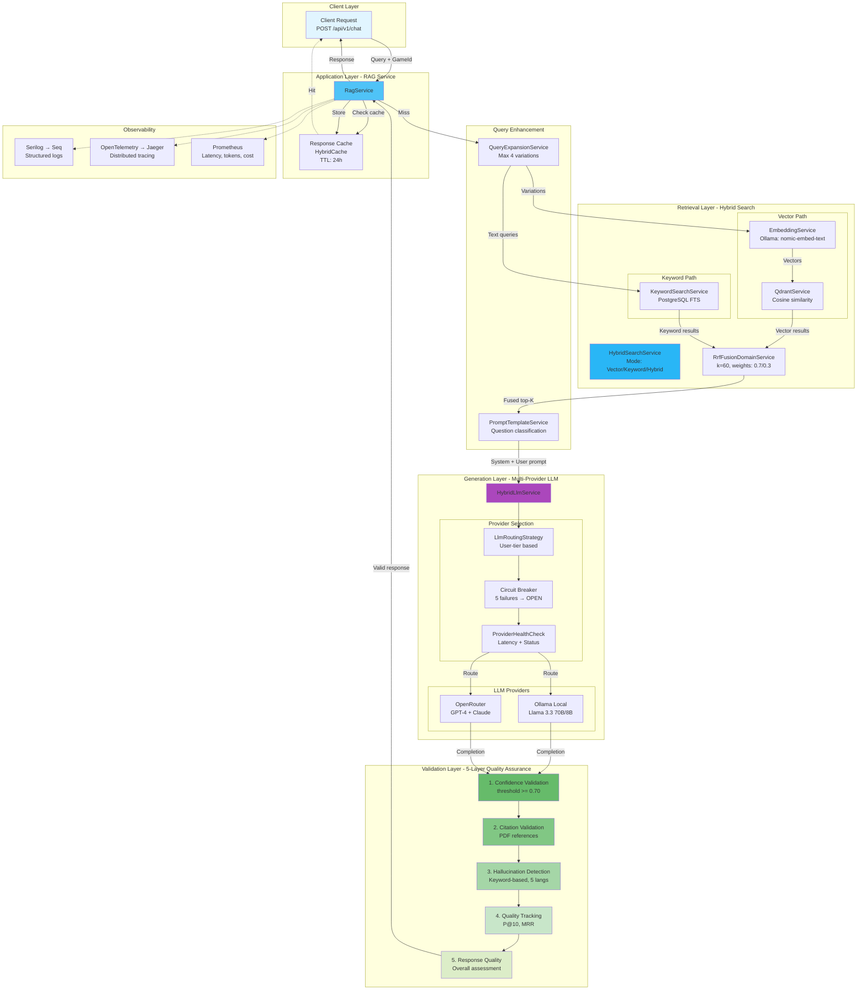
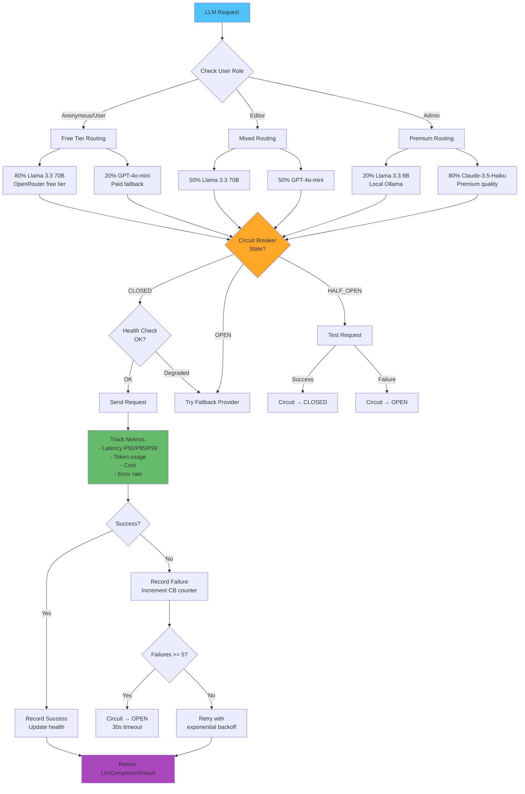
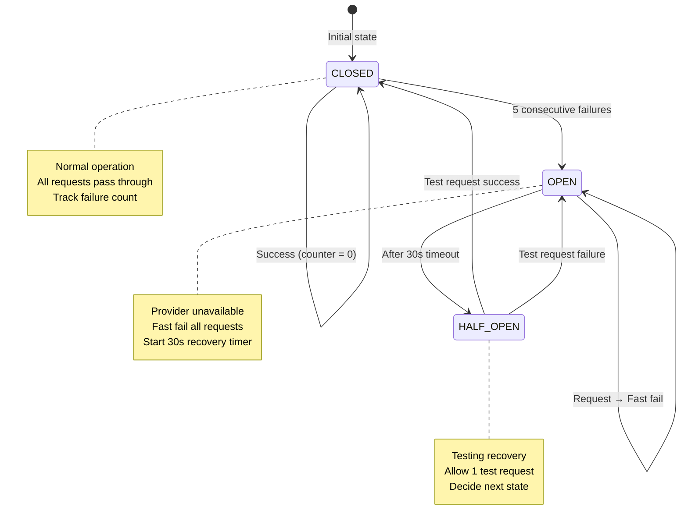
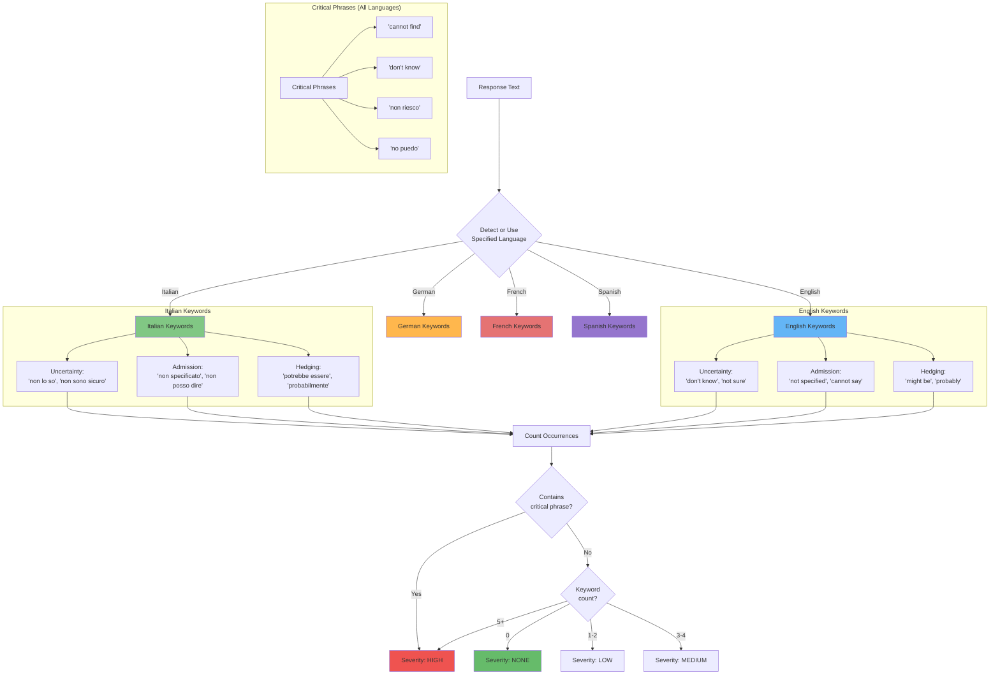
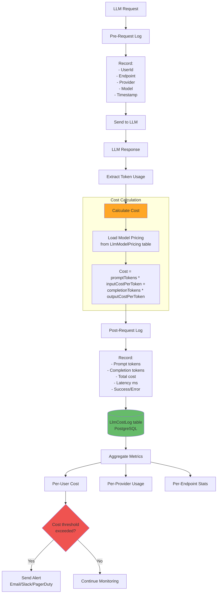
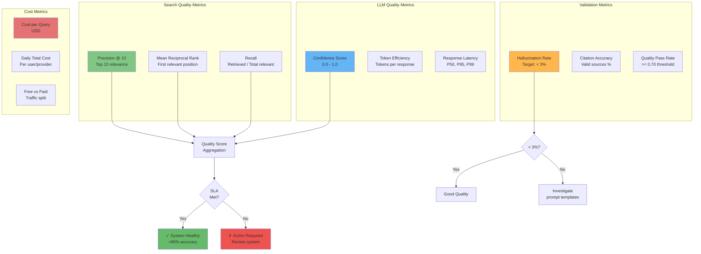

# Sistema RAG - Diagrammi Dettagliati

## Architettura RAG Completa (Hybrid Search)



## RRF Fusion Algorithm (Reciprocal Rank Fusion)

```mermaid
flowchart TD
    Start([Start Hybrid Search]) --> VectorSearch[Vector Search<br/>Qdrant cosine similarity<br/>Limit: 2x TopK]
    Start --> KeywordSearch[Keyword Search<br/>PostgreSQL ts_rank_cd<br/>Limit: 2x TopK]

    VectorSearch --> VectorResults[Vector Results<br/>Ranked 1..N]
    KeywordSearch --> KeywordResults[Keyword Results<br/>Ranked 1..N]

    VectorResults --> RRF[RRF Algorithm]
    KeywordResults --> RRF

    RRF --> InitDict[Initialize score dictionary<br/>key: chunkId, value: 0.0]

    InitDict --> LoopVector{For each<br/>vector result}
    LoopVector -->|Next| CalcVector[score += vectorWeight / (k + rank)<br/>weight=0.7, k=60]
    CalcVector --> LoopVector
    LoopVector -->|Done| LoopKeyword

    LoopKeyword{For each<br/>keyword result} -->|Next| CalcKeyword[score += keywordWeight / (k + rank)<br/>weight=0.3, k=60]
    CalcKeyword --> LoopKeyword
    LoopKeyword -->|Done| Normalize

    Normalize[Normalize scores<br/>score = min(score * 30, 1.0)] --> Sort[Sort by hybrid score DESC]

    Sort --> TopN[Take top N results<br/>N = TopK from config]

    TopN --> Return([Return<br/>HybridSearchResult[]])

    style Start fill:#4fc3f7
    style RRF fill:#ffa726
    style Normalize fill:#66bb6a
    style Return fill:#ab47bc
```

### RRF Formula Breakdown

```
Per ogni documento:

  RRF_score = Σ (weight / (k + rank))

  Dove:
  - k = 60 (costante empirica ottimale)
  - rank = posizione 1-based nella lista
  - weight = vectorWeight (0.7) o keywordWeight (0.3)

  Esempio:
  Documento appare a:
  - rank 1 in vector search
  - rank 3 in keyword search

  RRF_score = 0.7/(60+1) + 0.3/(60+3)
            = 0.7/61 + 0.3/63
            = 0.01148 + 0.00476
            = 0.01624

  Normalizzazione:
  final_score = min(0.01624 * 30, 1.0) = 0.487
```

## Query Expansion Strategy (PERF-08)

```mermaid
flowchart LR
    Original[Original Query<br/>"How do I setup the game?"]

    Original --> Analyze[Analyze Query]

    Analyze --> Synonyms[Synonym Expansion<br/>Rule-based dictionary]
    Analyze --> Reformulate[Question Reformulation<br/>Remove prefixes]

    Synonyms --> V1["Variation 1:<br/>'game setup'"]
    Synonyms --> V2["Variation 2:<br/>'initial setup'"]

    Reformulate --> V3["Variation 3:<br/>'setup rules'"]
    Reformulate --> V4["Variation 4:<br/>'starting position'"]

    V1 --> Limit{Max variations<br/>reached?<br/>Config: 4}
    V2 --> Limit
    V3 --> Limit
    V4 --> Limit

    Limit -->|Yes| Output[["[original, v1, v2, v3, v4]"]]
    Limit -->|No| More[Generate more]
    More --> Limit

    Output --> Embedding[Parallel Embedding<br/>Generation]

    style Original fill:#4fc3f7
    style Limit fill:#ffa726
    style Output fill:#66bb6a
```

**Impact**: 15-25% recall improvement (PERF-08)

## LLM Provider Routing Strategy



## Circuit Breaker State Machine



## 5-Layer Validation Pipeline

```mermaid
flowchart TD
    Response[LLM Response] --> Layer1

    subgraph "Layer 1: Confidence Validation"
        Layer1[Calculate Confidence<br/>70% search + 30% LLM]
        Layer1 --> Check1{Confidence<br/>>= 0.70?}
        Check1 -->|Yes| Pass1[✓ PASS]
        Check1 -->|0.60-0.70| Warn1[⚠ WARNING]
        Check1 -->|< 0.60| Fail1[✗ CRITICAL]
    end

    Pass1 --> Layer2
    Warn1 --> Layer2
    Fail1 --> Layer2

    subgraph "Layer 2: Citation Validation"
        Layer2[Parse Citations<br/>PDF:guid format]
        Layer2 --> Check2{All citations<br/>valid?}
        Check2 -->|Yes| Pass2[✓ Valid sources]
        Check2 -->|No| Fail2[✗ Invalid citations]
    end

    Pass2 --> Layer3
    Fail2 --> Layer3

    subgraph "Layer 3: Hallucination Detection"
        Layer3[Check Forbidden Keywords<br/>5 languages support]
        Layer3 --> Check3{Keywords<br/>found?}
        Check3 -->|None| Pass3[✓ No hallucination]
        Check3 -->|1-2| Warn3[⚠ Low severity]
        Check3 -->|3-4| Warn3b[⚠ Medium severity]
        Check3 -->|5+| Fail3[✗ High severity]
    end

    Pass3 --> Layer4
    Warn3 --> Layer4
    Warn3b --> Layer4
    Fail3 --> Layer4

    subgraph "Layer 4: Quality Tracking"
        Layer4[Calculate Quality Metrics]
        Layer4 --> Metrics[P@10: Precision at 10<br/>MRR: Mean Reciprocal Rank<br/>Search confidence weighted]
        Metrics --> Pass4[✓ Metrics recorded]
    end

    Pass4 --> Layer5

    subgraph "Layer 5: Response Quality"
        Layer5[Overall Quality Assessment]
        Layer5 --> Check5{Overall<br/>quality?}
        Check5 -->|High| PassFinal[✓ High Quality<br/>confidence >= 0.8]
        Check5 -->|Medium| WarnFinal[⚠ Medium Quality<br/>0.5 <= confidence < 0.8]
        Check5 -->|Low| FailFinal[✗ Low Quality<br/>confidence < 0.5]
    end

    PassFinal --> Accept[Accept Response]
    WarnFinal --> Flag[Flag for Review]
    FailFinal --> Reject[Reject or Retry]

    Accept --> Return([Return to User])
    Flag --> Return
    Reject --> Return

    style Layer1 fill:#e3f2fd
    style Layer2 fill:#f3e5f5
    style Layer3 fill:#fff3e0
    style Layer4 fill:#e8f5e9
    style Layer5 fill:#fce4ec
    style Accept fill:#66bb6a
    style Reject fill:#ef5350
```

## Hallucination Detection - Multilingual Support



## Cost Tracking Architecture



## Quality Metrics Dashboard



---

## Performance Targets

| Metrica | Target | Attuale | Status |
|---------|--------|---------|--------|
| **Retrieval Latency** | < 1s | ~800ms | ✓ |
| **Generation Latency** | < 3s | 2-5s | ⚠ |
| **Total E2E Latency** | < 5s | 3-6s | ✓ |
| **Accuracy** | > 95% | ~93% | ⚠ |
| **Hallucination Rate** | < 3% | ~2.5% | ✓ |
| **P@10** | > 0.8 | ~0.75 | ⚠ |
| **MRR** | > 0.7 | ~0.68 | ⚠ |
| **Cache Hit Rate** | > 40% | ~35% | ⚠ |
| **Cost per Query** | < $0.01 | $0.008 | ✓ |

## Configuration (Dynamic via SystemConfiguration)

```json
{
  "RAG": {
    "TopK": 5,
    "MinScore": 0.7,
    "RrfK": 60,
    "MaxQueryVariations": 4
  },
  "HybridSearch": {
    "VectorWeight": 0.7,
    "KeywordWeight": 0.3,
    "RrfConstant": 60
  },
  "LlmRouting": {
    "AnonymousModel": "llama-3.3-70b",
    "UserModel": "llama-3.3-70b",
    "EditorModel": "llama3:8b",
    "AdminModel": "llama3:8b",
    "OpenRouterAnonymousPercent": 20,
    "OpenRouterUserPercent": 20,
    "OpenRouterEditorPercent": 50,
    "OpenRouterAdminPercent": 80
  },
  "Validation": {
    "MinimumConfidence": 0.70,
    "WarningConfidence": 0.60,
    "CriticalConfidence": 0.50
  }
}
```

---

**Versione**: 1.0
**Data**: 2025-11-13
**Sistema**: RAG Hybrid Search with Multi-Provider LLM
