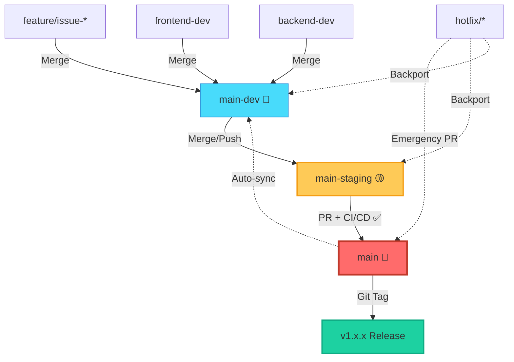

# Git Workflow - MeepleAI Monorepo

**Team Size**: 1 Developer
**Strategy**: Three-tier branch protection (main → main-staging → main-dev)
**Philosophy**: Agile development + Automated quality gates + Safe production releases

---

## Branch Strategy

### 🔴 `main` - Production
**Purpose**: Stable production-ready code
**Protection**: Maximum (PR only from `main-staging`)
**Deployment**: Production environment
**Updates**: ONLY via approved PR from `main-staging`

```yaml
Protection Rules:
  - Require PR from main-staging
  - Require status checks: ✅ All CI/CD passed on staging
  - Require signed commits (optional but recommended)
  - No direct push
  - No force push
  - Auto-delete head branches after merge
```

---

### 🟡 `main-staging` - Pre-Production
**Purpose**: Release candidate testing and validation
**Protection**: Medium (CI/CD required, direct commits allowed)
**Deployment**: Staging environment (auto-deploy on push)
**Updates**: PR, direct commits, or push from `main-dev`

```yaml
Protection Rules:
  - Require status checks: ✅ Build + Tests + Security scan
  - Allow direct push (for quick fixes)
  - Allow force push with lease (for history cleanup)
  - CI/CD triggers on every push
```

**Quality Gates** (must pass before staging→main PR):
- ✅ Backend build + 90% test coverage
- ✅ Frontend build + 85% test coverage
- ✅ Integration tests pass
- ✅ Security scan clean (Semgrep, detect-secrets)
- ✅ Performance regression check (optional)

---

### 🔵 `main-dev` - Active Development
**Purpose**: Fast-paced development and integration
**Protection**: Minimal (basic checks only)
**Deployment**: Dev environment (optional auto-deploy)
**Updates**: Feature branches merge here, direct commits allowed

```yaml
Protection Rules:
  - Require status checks: ✅ Lint + Typecheck (fast feedback)
  - Allow direct push
  - Allow force push with lease
  - Optional: Unit tests (non-blocking)
```

**Child Branches**:
- `frontend-dev`: Frontend-specific work → merges into `main-dev`
- `backend-dev`: Backend-specific work → merges into `main-dev`

---

## Daily Development Flow

### 🛠️ Standard Feature Development

```bash
# 1. Start feature from main-dev
git checkout main-dev
git pull origin main-dev
git checkout -b feature/issue-123-add-game-search

# 2. Develop with frequent commits
git add .
git commit -m "feat(game): add search by complexity filter"
# ... continue development ...

# 3. Run local quality checks
cd apps/api/src/Api && dotnet test  # Backend
cd apps/web && pnpm typecheck && pnpm lint && pnpm test  # Frontend

# 4. Push and merge to main-dev (self-merge, no PR needed for solo dev)
git push -u origin feature/issue-123-add-game-search
git checkout main-dev
git merge feature/issue-123-add-game-search
git push origin main-dev

# 5. Cleanup feature branch
git branch -D feature/issue-123-add-game-search
git push origin --delete feature/issue-123-add-game-search
```

**Shortcuts for Solo Dev**:
```bash
# Option A: Direct commit to main-dev (for small changes)
git checkout main-dev
git add . && git commit -m "fix(api): correct validation logic"
git push origin main-dev

# Option B: Use frontend-dev/backend-dev for domain isolation
git checkout frontend-dev
# ... frontend work ...
git push origin frontend-dev
git checkout main-dev && git merge frontend-dev
```

---

### 🚀 Release to Staging

```bash
# 1. Ensure main-dev is ready
git checkout main-dev
git pull origin main-dev

# 2. Run full test suite locally
cd apps/api/src/Api && dotnet test
cd apps/web && pnpm test && pnpm test:e2e

# 3. Merge to main-staging (CI/CD auto-triggers)
git checkout main-staging
git pull origin main-staging
git merge main-dev --no-ff -m "chore(release): promote main-dev to staging"
git push origin main-staging

# 4. Monitor CI/CD pipeline
# GitHub Actions → Check "main-staging" workflow
# Staging deployment → Verify services are healthy

# 5. Validate on staging environment
# - Smoke tests
# - Check new features
# - Verify integrations
```

**Alternative: Cherry-pick specific commits**
```bash
# If main-dev has experimental work, cherry-pick only stable commits
git checkout main-staging
git cherry-pick abc123f  # Specific commit from main-dev
git cherry-pick def456a
git push origin main-staging
```

---

### 🎯 Production Release (Staging → Main)

```bash
# 1. Ensure staging is stable and all checks passed
# Check GitHub Actions for main-staging: All green ✅

# 2. Create PR: main-staging → main
gh pr create \
  --base main \
  --head main-staging \
  --title "Release v1.2.0 - Game Search Feature" \
  --body "$(cat <<'EOF'
## 🚀 Release Summary
- Add game search by complexity
- Fix authentication token refresh
- Update PDF processing pipeline

## ✅ Pre-Release Checklist
- [x] All CI/CD checks passed on staging
- [x] Staging environment validated
- [x] Database migrations tested
- [x] Secrets rotated (if needed)
- [x] Rollback plan documented

## 📊 Test Coverage
- Backend: 92%
- Frontend: 87%

## 🔗 Related Issues
- Closes #123, #124

🤖 Generated with Claude Code
EOF
)"

# 3. Review PR (self-review for solo dev)
# - Check CI/CD status
# - Review diff one last time
# - Verify no sensitive data in commits

# 4. Merge PR (via GitHub UI with "Squash and merge" or "Merge commit")
# Auto-triggers production deployment

# 5. Tag release
git checkout main
git pull origin main
git tag -a v1.2.0 -m "Release v1.2.0 - Game Search Feature"
git push origin v1.2.0

# 6. Sync main-dev with main (keep branches aligned)
git checkout main-dev
git merge main --no-ff -m "chore: sync main-dev with production release v1.2.0"
git push origin main-dev
```

---

### 🚨 Hotfix for Production

```bash
# 1. Branch from main (production code)
git checkout main
git pull origin main
git checkout -b hotfix/critical-auth-bug

# 2. Fix issue with focused commits
git add .
git commit -m "fix(auth): prevent token expiry race condition"

# 3. Test thoroughly
cd apps/api/src/Api && dotnet test
cd apps/web && pnpm test

# 4. PR to main-staging first (validation)
git push -u origin hotfix/critical-auth-bug
gh pr create --base main-staging --head hotfix/critical-auth-bug \
  --title "Hotfix: Critical Auth Bug"

# 5. Merge to staging and validate
# Wait for CI/CD, test on staging

# 6. Fast-track to main (if urgent)
gh pr create --base main --head main-staging \
  --title "Hotfix Release: Auth Token Fix"
# Merge immediately after validation

# 7. Backport to main-dev
git checkout main-dev
git cherry-pick <hotfix-commit-sha>
git push origin main-dev

# 8. Cleanup
git branch -D hotfix/critical-auth-bug
git push origin --delete hotfix/critical-auth-bug
```

**Super-Urgent Hotfix** (bypass staging - use sparingly):
```bash
# Only for critical production outages
git checkout main
git checkout -b hotfix/database-down
# ... fix ...
gh pr create --base main --head hotfix/database-down
# Merge after minimal validation
# Then backport to main-staging AND main-dev
```

---

## CI/CD Pipeline Configuration

### GitHub Actions Workflows

**File**: `.github/workflows/main-dev-ci.yml`
```yaml
name: Main-Dev CI
on:
  push:
    branches: [main-dev, frontend-dev, backend-dev]

jobs:
  backend-quality:
    runs-on: ubuntu-latest
    steps:
      - uses: actions/checkout@v4
      - name: Setup .NET
        uses: actions/setup-dotnet@v4
        with:
          dotnet-version: '9.0.x'
      - name: Lint & Format Check
        run: cd apps/api/src/Api && dotnet format --verify-no-changes
      - name: Unit Tests (non-blocking)
        run: cd apps/api/src/Api && dotnet test --no-build
        continue-on-error: true

  frontend-quality:
    runs-on: ubuntu-latest
    steps:
      - uses: actions/checkout@v4
      - name: Setup Node
        uses: actions/setup-node@v4
        with:
          node-version: '20'
      - name: Install pnpm
        uses: pnpm/action-setup@v2
        with:
          version: 8
      - name: Install dependencies
        run: cd apps/web && pnpm install
      - name: Lint & Typecheck
        run: cd apps/web && pnpm lint && pnpm typecheck
```

**File**: `.github/workflows/main-staging-ci.yml`
```yaml
name: Main-Staging CI/CD
on:
  push:
    branches: [main-staging]

jobs:
  backend-full-suite:
    runs-on: ubuntu-latest
    steps:
      - uses: actions/checkout@v4
      - name: Setup .NET
        uses: actions/setup-dotnet@v4
        with:
          dotnet-version: '9.0.x'
      - name: Restore dependencies
        run: cd apps/api/src/Api && dotnet restore
      - name: Build
        run: cd apps/api/src/Api && dotnet build --no-restore
      - name: Test with Coverage
        run: cd apps/api/src/Api && dotnet test --no-build /p:CollectCoverage=true /p:CoverageReportsGenerator=opencover
      - name: Coverage Gate (90%)
        run: |
          # Check coverage threshold
          cd apps/api/src/Api
          dotnet test --no-build /p:Threshold=90 || exit 1
      - name: Security Scan
        run: semgrep --config auto apps/api/ || exit 1

  frontend-full-suite:
    runs-on: ubuntu-latest
    steps:
      - uses: actions/checkout@v4
      - name: Setup Node
        uses: actions/setup-node@v4
        with:
          node-version: '20'
      - name: Install pnpm
        uses: pnpm/action-setup@v2
        with:
          version: 8
      - name: Install dependencies
        run: cd apps/web && pnpm install
      - name: Build
        run: cd apps/web && pnpm build
      - name: Test with Coverage
        run: cd apps/web && pnpm test:coverage
      - name: E2E Tests
        run: cd apps/web && pnpm test:e2e
      - name: Security Scan
        run: semgrep --config auto apps/web/ || exit 1

  deploy-staging:
    needs: [backend-full-suite, frontend-full-suite]
    runs-on: ubuntu-latest
    steps:
      - uses: actions/checkout@v4
      - name: Deploy to Staging
        run: |
          echo "🚀 Deploying to staging environment..."
          # Add your deployment script here
          # ./infra/deploy-staging.sh
```

**File**: `.github/workflows/main-production-ci.yml`
```yaml
name: Production Deployment
on:
  pull_request:
    branches: [main]
    types: [opened, synchronize, reopened]

jobs:
  validate-pr-source:
    runs-on: ubuntu-latest
    steps:
      - name: Ensure PR from main-staging
        run: |
          if [ "${{ github.head_ref }}" != "main-staging" ]; then
            echo "❌ ERROR: PRs to main must come from main-staging only"
            echo "Current source branch: ${{ github.head_ref }}"
            exit 1
          fi
          echo "✅ PR source validated: main-staging → main"

  production-checks:
    needs: [validate-pr-source]
    runs-on: ubuntu-latest
    steps:
      - uses: actions/checkout@v4
      - name: Verify all staging checks passed
        run: |
          echo "✅ Verifying staging CI/CD status..."
          # GitHub automatically requires status checks from main-staging

  deploy-production:
    runs-on: ubuntu-latest
    if: github.event.pull_request.merged == true
    steps:
      - uses: actions/checkout@v4
      - name: Deploy to Production
        run: |
          echo "🚀 Deploying to production..."
          # ./infra/deploy-production.sh
      - name: Health Check
        run: |
          echo "🔍 Running health checks..."
          # curl -f https://api.meepleai.com/health || exit 1
      - name: Notify Success
        run: echo "✅ Production deployment successful"
```

---

## Branch Protection Setup (GitHub)

### Main Branch Protection
```
Settings → Branches → Branch protection rules → Add rule

Branch name pattern: main

☑️ Require a pull request before merging
  ☑️ Require approvals: 1 (self-approval for solo dev)
  ☑️ Dismiss stale pull request approvals when new commits are pushed
  ☐ Require review from Code Owners (optional)

☑️ Require status checks to pass before merging
  ☑️ Require branches to be up to date before merging
  Required status checks:
    - backend-full-suite
    - frontend-full-suite
    - validate-pr-source

☑️ Require conversation resolution before merging
☑️ Require signed commits (recommended)
☑️ Require linear history
☑️ Include administrators (enforce rules on yourself)

☐ Allow force pushes (NEVER)
☐ Allow deletions (NEVER)
```

### Main-Staging Branch Protection
```
Branch name pattern: main-staging

☑️ Require status checks to pass before merging
  Required status checks:
    - backend-full-suite
    - frontend-full-suite

☐ Require pull request before merging (allow direct commits)
☑️ Allow force pushes
  ☑️ Specify who can force push: Only you
☐ Allow deletions
```

### Main-Dev Branch Protection
```
Branch name pattern: main-dev

☑️ Require status checks to pass before merging
  Required status checks:
    - backend-quality (lint/format)
    - frontend-quality (lint/typecheck)

☐ Require pull request before merging (allow direct commits)
☑️ Allow force pushes
  ☑️ Specify who can force push: Only you
☐ Allow deletions
```

---

## Common Scenarios

### Scenario 1: Quick Bug Fix on Dev
```bash
git checkout main-dev
git pull origin main-dev
# Fix issue
git add . && git commit -m "fix(api): resolve null reference in game service"
git push origin main-dev
# Done - CI/CD runs automatically
```

### Scenario 2: Multi-Day Feature
```bash
# Day 1
git checkout -b feature/complex-ai-agent main-dev
# ... work ...
git commit -m "feat(ai): add RAG retrieval logic"
git push -u origin feature/complex-ai-agent

# Day 2
git checkout feature/complex-ai-agent
git pull origin feature/complex-ai-agent  # Sync if working from multiple machines
# ... continue work ...
git commit -m "feat(ai): add reranking service"
git push

# Day 3 - Ready to integrate
git checkout main-dev && git pull
git merge feature/complex-ai-agent --no-ff
git push origin main-dev
git branch -D feature/complex-ai-agent
git push origin --delete feature/complex-ai-agent
```

### Scenario 3: Rollback Production
```bash
# Option A: Revert specific commit on main
git checkout main
git revert <bad-commit-sha>
git push origin main  # Triggers redeploy

# Option B: Rollback to previous release tag
git checkout main
git reset --hard v1.1.0  # Previous stable version
git push --force-with-lease origin main  # DANGEROUS - use only for emergencies

# Always: Sync main-staging and main-dev after rollback
git checkout main-staging
git merge main --no-ff
git push origin main-staging

git checkout main-dev
git merge main --no-ff
git push origin main-dev
```

### Scenario 4: Sync Branches After Drift
```bash
# If main-dev drifted behind main (e.g., after hotfix)
git checkout main-dev
git fetch origin
git merge origin/main --no-ff -m "chore: sync main-dev with production"
git push origin main-dev

# If main-staging drifted behind main
git checkout main-staging
git merge origin/main --no-ff
git push origin main-staging
```

---

## Quality Checklist

### Before Merging to `main-staging`
- [ ] All unit tests pass locally (`dotnet test`, `pnpm test`)
- [ ] Integration tests validated
- [ ] No console errors/warnings in dev environment
- [ ] Database migrations tested (if applicable)
- [ ] Secrets updated in staging `.secret` files (if needed)
- [ ] Performance acceptable (no major regressions)

### Before Merging to `main` (Production)
- [ ] Staging environment fully validated (smoke tests)
- [ ] All CI/CD checks green on `main-staging`
- [ ] Rollback plan documented (in PR description)
- [ ] Monitoring alerts configured (for new features)
- [ ] Documentation updated (API changes, new features)
- [ ] Changelog updated with release notes
- [ ] Database migrations backward-compatible

---

## Troubleshooting

### Issue: Merge Conflicts on `main-staging` ← `main-dev`
```bash
git checkout main-staging
git merge main-dev
# Conflicts appear
git status  # Review conflicted files
# Resolve conflicts manually in your editor
git add .
git commit -m "chore: resolve merge conflicts from main-dev"
git push origin main-staging
```

### Issue: CI/CD Failing on `main-staging`
```bash
# Option A: Fix forward on main-staging
git checkout main-staging
# Fix issue
git commit -m "fix(ci): resolve dependency conflict"
git push origin main-staging

# Option B: Rollback merge
git checkout main-staging
git reset --hard HEAD~1  # Undo last commit
git push --force-with-lease origin main-staging
# Fix issue on main-dev first, then re-merge
```

### Issue: Accidentally Pushed to Wrong Branch
```bash
# If pushed to main (and PR not merged yet)
# Cannot force push to main (protected)
# Solution: Close wrong PR, revert commit, create correct PR

git checkout main
git revert <wrong-commit-sha>
# Create PR to revert the commit
```

---

## Automation Scripts

### Auto-sync `main-dev` after production release
**File**: `.github/workflows/sync-branches.yml`
```yaml
name: Sync Branches After Production Release
on:
  push:
    branches: [main]

jobs:
  sync-dev:
    runs-on: ubuntu-latest
    steps:
      - uses: actions/checkout@v4
        with:
          fetch-depth: 0
          token: ${{ secrets.GITHUB_TOKEN }}
      - name: Configure Git
        run: |
          git config user.name "github-actions[bot]"
          git config user.email "github-actions[bot]@users.noreply.github.com"
      - name: Sync main → main-dev
        run: |
          git fetch origin main-dev
          git checkout main-dev
          git merge origin/main --no-ff -m "chore: auto-sync main-dev with production release"
          git push origin main-dev
```

### Local Helper Script
**File**: `scripts/git-workflow.sh`
```bash
#!/bin/bash
# Quick workflow helpers for solo developer

set -e

case "$1" in
  "feature")
    if [ -z "$2" ]; then
      echo "Usage: $0 feature <feature-name>"
      exit 1
    fi
    git checkout main-dev && git pull
    git checkout -b "feature/$2"
    echo "✅ Created feature branch: feature/$2"
    ;;

  "staging")
    echo "🚀 Promoting main-dev to staging..."
    git checkout main-dev && git pull
    git checkout main-staging && git pull
    git merge main-dev --no-ff -m "chore: promote main-dev to staging"
    git push origin main-staging
    echo "✅ Merged main-dev → main-staging. CI/CD triggered."
    ;;

  "release")
    if [ -z "$2" ]; then
      echo "Usage: $0 release <version> [title]"
      exit 1
    fi
    VERSION="$2"
    TITLE="${3:-Release $VERSION}"

    gh pr create --base main --head main-staging \
      --title "$TITLE" \
      --body "## 🚀 Release $VERSION

**Checklist:**
- [ ] All staging checks passed
- [ ] Environment validated
- [ ] Rollback plan ready

Generated: $(date)"
    echo "✅ Created release PR: main-staging → main"
    ;;

  "sync")
    echo "🔄 Syncing main-dev with production..."
    git checkout main && git pull
    git checkout main-dev
    git merge main --no-ff -m "chore: sync main-dev with production"
    git push origin main-dev
    echo "✅ main-dev synced with main"
    ;;

  *)
    echo "MeepleAI Git Workflow Helper"
    echo ""
    echo "Usage:"
    echo "  $0 feature <name>        - Create feature branch from main-dev"
    echo "  $0 staging               - Promote main-dev to staging"
    echo "  $0 release <version>     - Create release PR to production"
    echo "  $0 sync                  - Sync main-dev with production"
    exit 1
esac
```

**Make executable**:
```bash
chmod +x scripts/git-workflow.sh
```

**Usage Examples**:
```bash
./scripts/git-workflow.sh feature add-game-filter    # Create feature
./scripts/git-workflow.sh staging                    # Promote to staging
./scripts/git-workflow.sh release v1.2.0             # Create release PR
./scripts/git-workflow.sh sync                       # Sync after hotfix
```

---

## Visual Workflow Diagram



**Legend**:
- Solid arrows: Normal flow
- Dashed arrows: Emergency/backport flow
- Colors: 🔴 Production | 🟡 Staging | 🔵 Development

---

## Quick Reference Card

| Branch | Push Directly? | Force Push? | PR Required? | CI/CD | Deploy To |
|--------|---------------|-------------|--------------|-------|-----------|
| `main` | ❌ Never | ❌ Never | ✅ Yes (from staging) | Full + Deploy | **Production** |
| `main-staging` | ✅ Yes | ⚠️ With Lease | ❌ Optional | Full Suite | **Staging** |
| `main-dev` | ✅ Yes | ⚠️ With Lease | ❌ Optional | Lint/Type | **Dev** (opt) |
| `frontend-dev` | ✅ Yes | ✅ Yes | ❌ No | Lint only | - |
| `backend-dev` | ✅ Yes | ✅ Yes | ❌ No | Lint only | - |
| `feature/*` | ✅ Yes | ✅ Yes | ❌ No | - | - |

**Legend**:
- ✅ Allowed
- ❌ Blocked
- ⚠️ Allowed with caution (use `--force-with-lease`)

---

## Best Practices

### ✅ DO
- Commit frequently with descriptive Conventional Commits messages
- Run tests locally before pushing to `main-staging`
- Use `--no-ff` for branch merges to preserve history
- Tag production releases with semantic versioning (v1.2.3)
- Document breaking changes in PR descriptions
- Keep `main-dev` synced with `main` after production releases
- Use feature branches for non-trivial changes
- Clean up merged feature branches promptly

### ❌ DON'T
- Force push to `main` or `main-staging` (except emergencies with `--force-with-lease`)
- Merge untested code to `main-staging`
- Skip CI/CD checks (even for "small" changes)
- Leave feature branches unmerged for >1 week (merge or rebase frequently)
- Commit secrets or sensitive data (use `.secret` files in `infra/secrets/`)
- Create PRs to `main` from branches other than `main-staging`

---

## Commit Message Format

**Conventional Commits** (enforced by pre-commit hooks):

```
<type>(<scope>): <subject>

<body>

<footer>
```

**Types**:
- `feat`: New feature
- `fix`: Bug fix
- `docs`: Documentation only
- `refactor`: Code refactoring
- `test`: Adding/updating tests
- `chore`: Maintenance tasks
- `perf`: Performance improvements
- `ci`: CI/CD changes
- `style`: Code style changes
- `build`: Build system changes
- `revert`: Revert previous commit

**Examples**:
```bash
git commit -m "feat(game): add complexity filter to search"
git commit -m "fix(auth): prevent token expiry race condition"
git commit -m "docs(workflow): update git workflow documentation"
git commit -m "refactor(api): simplify game service validation logic"
```

---

## Branch Naming Conventions

**Pattern**: `<type>/<scope>-<issue>-<description>`

**Types**:
- `feature/`: New features
- `fix/`: Bug fixes
- `hotfix/`: Critical production fixes
- `refactor/`: Code refactoring
- `docs/`: Documentation updates
- `test/`: Test additions/updates

**Examples**:
```bash
feature/issue-123-add-game-search
fix/issue-456-authentication-bug
hotfix/critical-database-connection
refactor/simplify-rag-pipeline
docs/update-api-documentation
test/add-e2e-game-flow
```

---

## Migration Checklist

If migrating to this new workflow:

### Phase 1: Branch Creation
```bash
# 1. Create main-staging from current main
git checkout main
git pull origin main
git checkout -b main-staging
git push -u origin main-staging

# 2. Ensure main-dev exists
git checkout main-dev || git checkout -b main-dev main
git push -u origin main-dev

# 3. Create child branches if needed
git checkout -b frontend-dev main-dev
git push -u origin frontend-dev

git checkout -b backend-dev main-dev
git push -u origin backend-dev
```

### Phase 2: GitHub Configuration
- [ ] Configure branch protection rules (see "Branch Protection Setup")
- [ ] Add CI/CD workflow files (`.github/workflows/`)
- [ ] Update repository settings → Branches
- [ ] Test protection rules with dummy PR

### Phase 3: Documentation & Team
- [ ] Update `CLAUDE.md` with new workflow reference
- [ ] Add helper scripts to `scripts/`
- [ ] Test full workflow: feature → staging → production
- [ ] Document rollback procedures

### Phase 4: Validation
- [ ] Test feature development flow
- [ ] Test staging deployment
- [ ] Test production release PR
- [ ] Test hotfix backport flow
- [ ] Validate CI/CD triggers

---

## Glossary

- **PR**: Pull Request (merge proposal with review)
- **CI/CD**: Continuous Integration/Continuous Deployment
- **Cherry-pick**: Apply specific commits from one branch to another
- **Squash**: Combine multiple commits into one before merging
- **Rebase**: Rewrite commit history to be linear
- **Force push with lease**: Safer force push that checks remote hasn't changed
- **Status checks**: Automated tests that must pass before merging
- **Signed commits**: Commits verified with GPG signature for authenticity
- **Conventional Commits**: Standardized commit message format

---

## Support & Feedback

**Questions**: Open a GitHub issue with label `workflow`
**Improvements**: Submit PR to update this documentation
**CI/CD Issues**: Check `.github/workflows/` logs

---

**Last Updated**: 2026-01-24
**Maintained By**: Development Team
**Version**: 2.0 (Three-tier workflow)
