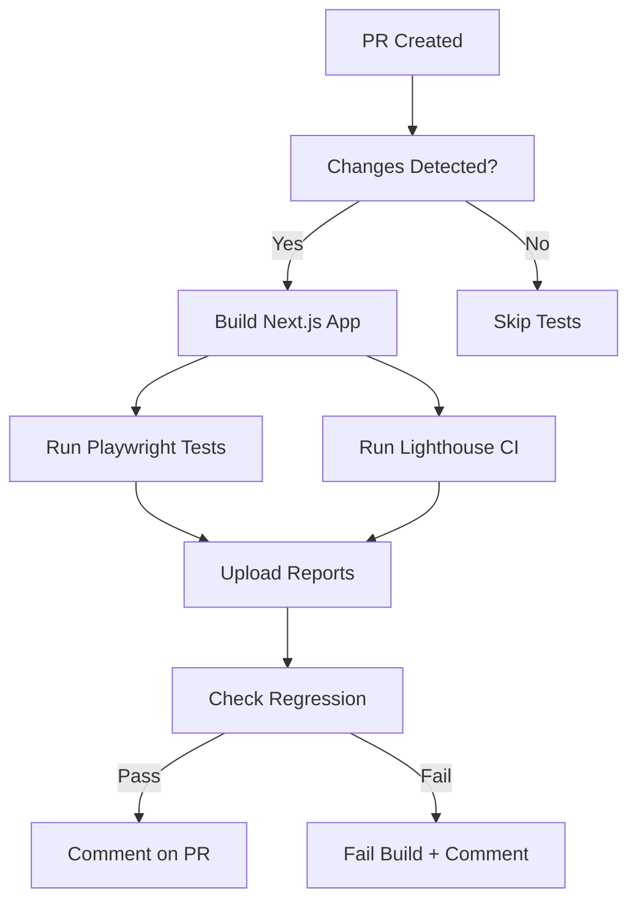

# Performance Testing with Lighthouse CI

**Issue:** #842
**Status:** Production Ready
**Last Updated: 2025-12-13T10:59:23.970Z

## Overview

This guide covers the automated performance testing infrastructure for MeepleAI using Lighthouse CI. The system monitors Core Web Vitals, enforces performance budgets, and prevents frontend performance regressions.

## Table of Contents

- [Quick Start](#quick-start)
- [Core Web Vitals](#core-web-vitals)
- [Running Tests Locally](#running-tests-locally)
- [CI/CD Integration](#cicd-integration)
- [Performance Budgets](#performance-budgets)
- [Interpreting Results](#interpreting-results)
- [Optimization Tips](#optimization-tips)
- [Troubleshooting](#troubleshooting)

## Quick Start

```bash
# Run performance tests with Playwright
cd apps/web
pnpm test:performance

# Run Lighthouse CI (requires built app)
pnpm build
pnpm lighthouse:ci

# View Lighthouse reports
pnpm lighthouse:report
```

## Core Web Vitals

Our performance testing focuses on Google's Core Web Vitals, which are essential metrics for user experience:

### Targets

| Metric | Threshold | Description |
|--------|-----------|-------------|
| **LCP** | < 2.5s | Largest Contentful Paint - measures loading performance |
| **FID** | < 100ms | First Input Delay - measures interactivity |
| **CLS** | < 0.1 | Cumulative Layout Shift - measures visual stability |
| **FCP** | < 2.0s | First Contentful Paint - measures perceived load speed |
| **TBT** | < 300ms | Total Blocking Time - proxy for FID in lab tests |
| **SI** | < 3.0s | Speed Index - measures how quickly content is visually displayed |

### Performance Scores

| Category | Minimum Score | Priority |
|----------|--------------|----------|
| Performance | 85% | High |
| Accessibility | 95% | High |
| Best Practices | 90% | Medium |
| SEO | 90% | Medium |

## Running Tests Locally

### Prerequisites

1. Install dependencies:
   ```bash
   cd apps/web
   pnpm install
   ```

2. Build the application:
   ```bash
   pnpm build
   ```

### Running Performance Tests

**Option 1: Playwright Performance Tests**

Tests 3 critical pages (homepage, chat, upload) with detailed Core Web Vitals checks:

```bash
# Run all performance tests
pnpm test:performance

# Run with UI mode for debugging
pnpm test:performance:ui

# Run specific test
pnpm exec playwright test e2e/performance.spec.ts -g "Homepage"
```

**Option 2: Lighthouse CI**

Runs Lighthouse audits on all configured URLs:

```bash
# Ensure app is built first
pnpm build

# Run Lighthouse CI
pnpm lighthouse:ci

# View results
pnpm lighthouse:report
```

### Test Pages

**Priority 1 (Critical):**
- `/` - Homepage
- `/chat` - Chat interface
- `/upload` - PDF upload page

**Priority 2 (Important):**
- `/games` - Game catalog
- `/login` - Login page

**Priority 3 (Optional):**
- `/admin` - Admin dashboard
- `/settings` - User settings

## CI/CD Integration

### GitHub Actions Workflow

Performance tests run automatically on:
- Pull requests (when `apps/web/**` changes)
- Pushes to `main` branch

**Workflow:** `.github/workflows/lighthouse-ci.yml`

**Jobs:**
1. **lighthouse-performance** - Runs Playwright performance tests
2. **lighthouse-cli** - Runs Lighthouse CI audits
3. **performance-regression-check** - Checks for >10% degradation

### Artifacts

After each run, the following artifacts are uploaded:

| Artifact | Description | Retention |
|----------|-------------|-----------|
| `lighthouse-playwright-report-*` | Playwright test results | 7 days |
| `lighthouse-reports-*` | Detailed Lighthouse HTML/JSON reports | 30 days |
| `lighthouse-ci-results-*` | Lighthouse CI raw data | 30 days |

### PR Comments

On pull requests, a performance report is automatically posted with:
- Core Web Vitals status
- Performance score summary
- Links to detailed reports

## Performance Budgets

### Configuration

Performance budgets are defined in `lighthouserc.json`:

```json
{
  "ci": {
    "assert": {
      "assertions": {
        "categories:performance": ["error", {"minScore": 0.85}],
        "categories:accessibility": ["error", {"minScore": 0.95}],
        "largest-contentful-paint": ["error", {"maxNumericValue": 2500}],
        "cumulative-layout-shift": ["error", {"maxNumericValue": 0.1}],
        // ... more assertions
      }
    }
  }
}
```

### Enforcement

- ✅ **Pass:** All metrics meet thresholds
- ⚠️ **Warning:** Metrics within 10% of thresholds
- ❌ **Fail:** Any metric exceeds threshold or >10% regression

## Interpreting Results

### Reading Lighthouse Reports

1. **Performance Score (0-100)**
   - 90-100: Excellent
   - 50-89: Needs improvement
   - 0-49: Poor

2. **Opportunities**
   - Shows specific optimizations with estimated savings
   - Prioritize by potential impact

3. **Diagnostics**
   - Additional information about page performance
   - May not have direct savings estimates

### Common Issues

| Issue | Likely Cause | Fix |
|-------|--------------|-----|
| High LCP | Large images, slow server | Optimize images, use CDN, implement lazy loading |
| High FID/TBT | Heavy JavaScript | Code splitting, defer non-critical JS |
| High CLS | Images without dimensions, dynamic content | Add explicit width/height, reserve space |
| Low Performance Score | Multiple issues | Address Opportunities in priority order |

## Optimization Tips

### Images

```tsx
// ❌ Bad


// ✅ Good
import Image from 'next/image';
<Image
  src="/large-image.jpg"
  width={800}
  height={600}
  alt="Description"
  priority // for above-the-fold images
/>
```

### Code Splitting

```tsx
// ❌ Bad - loads everything upfront
import { HeavyComponent } from './HeavyComponent';

// ✅ Good - lazy load heavy components
const HeavyComponent = dynamic(() => import('./HeavyComponent'), {
  loading: () => <Spinner />,
  ssr: false // if not needed for SEO
});
```

### Font Loading

```tsx
// next.config.js
module.exports = {
  optimizeFonts: true, // Next.js 13+ default
};

// Use font-display: swap
@font-face {
  font-family: 'CustomFont';
  font-display: swap;
}
```

### Static Generation

```tsx
// ✅ Use SSG for static content
export async function getStaticProps() {
  const data = await fetchData();
  return { props: { data }, revalidate: 3600 };
}

// ✅ Use ISR for dynamic content that can be stale
export async function getStaticProps() {
  const data = await fetchData();
  return { props: { data }, revalidate: 60 };
}
```

### Bundle Size

```bash
# Analyze bundle size
pnpm build
# Check .next/server/app/ for bundle analysis

# Use next-bundle-analyzer (if needed)
ANALYZE=true pnpm build
```

## Troubleshooting

### Tests Failing Locally

**Issue:** Performance tests fail with "Target page has been closed"

**Solution:**
- Ensure you're not running `--single-process` in Chrome args
- Check `playwright.config.ts` - this flag should be removed

**Issue:** Lighthouse CI can't connect to app

**Solution:**
```bash
# Ensure app is built and running
pnpm build
pnpm start # In separate terminal
pnpm lighthouse:ci # In another terminal
```

### CI/CD Issues

**Issue:** CI timeout during performance tests

**Solution:**
- Performance tests have 60s timeout
- Check if external dependencies are slow
- Consider increasing timeout in workflow

**Issue:** Inconsistent performance scores in CI

**Solution:**
- Lighthouse runs 3 audits and takes median
- CI environment may have variable performance
- Focus on trends over absolute scores

### Performance Regression

**Issue:** PR fails due to performance regression

**Steps:**
1. Download Lighthouse reports from artifacts
2. Compare "Opportunities" between baseline and current
3. Identify specific regressions (images, JS, CSS)
4. Optimize and re-run tests

## Architecture

### Components

```
apps/web/
├── e2e/
│   └── performance.spec.ts          # Playwright performance tests
├── lighthouserc.json                # Lighthouse CI configuration
├── lighthouse-reports/              # Generated reports (gitignored)
└── .lighthouseci/                   # CI results (gitignored)

.github/workflows/
└── lighthouse-ci.yml                # CI/CD workflow
```

### Test Flow



## Best Practices

### Development Workflow

1. **Before PR:**
   ```bash
   pnpm build
   pnpm test:performance
   ```

2. **Review results:**
   - Check that all tests pass
   - Review Playwright report for failures
   - Check console for warnings

3. **Optimize if needed:**
   - Follow "Opportunities" suggestions
   - Re-run tests to verify improvements

### Monitoring

- **Weekly:** Review performance trends in artifacts
- **Monthly:** Audit all pages for performance
- **Quarterly:** Update performance budgets based on data

### When to Adjust Budgets

Consider relaxing budgets if:
- New features legitimately increase bundle size
- External dependencies are unavoidable
- Trade-off is justified by user value

**Process:**
1. Document reason in PR
2. Update `lighthouserc.json`
3. Get approval from team lead
4. Monitor impact on user metrics

## Additional Resources

- [Web Vitals - Google](https://web.dev/vitals/)
- [Lighthouse Documentation](https://developers.google.com/web/tools/lighthouse)
- [Next.js Performance](https://nextjs.org/docs/advanced-features/measuring-performance)
- [Playwright Testing](https://playwright.dev/docs/intro)

## Related Documentation

- [Testing Guide](./testing-guide.md)
- [E2E Testing](./testing-specialized.md)
- [CI/CD Pipeline](../../03-deployment/ci-cd-pipeline.md)

---

**Maintained by:** Engineering Team
**Questions?** Open an issue or reach out on Slack #frontend

