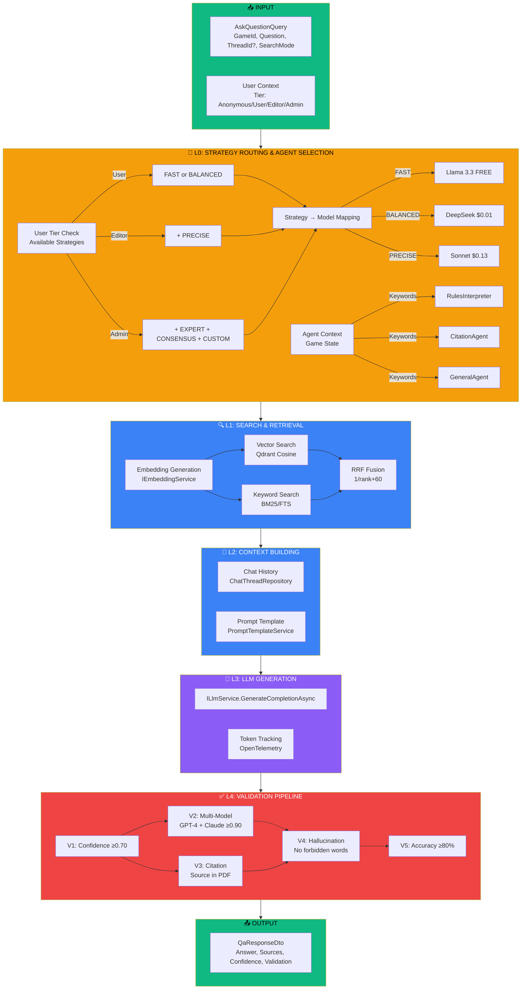

# MeepleAI RAG Flow - Current Implementation

## Quick Reference Diagram



## Detailed Flow with Code References

### L0: Strategy-Based Model Routing
**Architecture Principle**: Tier → Strategy Access → Model Selection

#### CRITICAL: User Tier Does NOT Determine Models

```
❌ WRONG: User Tier → Model Selection (tier-based routing)
✅ RIGHT: User Tier → Available Strategies → Strategy → Model Selection

Flow:
1. User tier determines WHICH strategies can be selected
2. User/Admin CHOOSES a strategy (FAST, BALANCED, PRECISE, etc.)
3. Strategy determines WHICH model to use
4. Admin can enable/disable strategies per tier
```

#### Tier → Strategy Access Matrix

| User Tier | Available Strategies | Max Complexity | Description |
|-----------|---------------------|----------------|-------------|
| **Anonymous** | None | NONE | ❌ NO ACCESS - Authentication required |
| **User** | FAST, BALANCED | BALANCED | Simple → Standard queries |
| **Editor** | FAST, BALANCED, PRECISE | PRECISE | Simple → Advanced (multi-agent) |
| **Admin** | All + CUSTOM | CONSENSUS | Full access + custom configurations |
| **Premium** | All except CUSTOM | CONSENSUS | All production strategies |

#### Strategy → Model Mapping (Admin Configurable)

| Strategy | Primary Model | Provider | Fallback | Cost | Customizable |
|----------|--------------|----------|----------|------|--------------|
| **FAST** | Llama 3.3 70B | OpenRouter | Gemini 2.0 Flash | $0 | No |
| **BALANCED** | DeepSeek Chat | DeepSeek | Claude Haiku 4.5 | $0.01 | Yes |
| **PRECISE** | Claude Sonnet 4.5 | Anthropic | Haiku, GPT-4o-mini | $0.13 | Yes |
| **EXPERT** | Claude Sonnet 4.5 | Anthropic | GPT-4o | $0.10 | Yes |
| **CONSENSUS** | Sonnet + GPT-4o + DeepSeek | Multi | (3 voters) | $0.09 | Yes |
| **CUSTOM** | Claude Haiku 4.5 | Anthropic | Sonnet | Variable | Admin Only |

#### Strategy Selection Flow
```
Example: Editor user wants to ask a complex rules question

Step 1: User Authentication
        └─ Tier: Editor

Step 2: Strategy Selection (UI)
        └─ Available: [FAST, BALANCED, PRECISE]
        └─ User chooses: PRECISE (for complex rules)

Step 3: Model Routing (Backend)
        └─ PRECISE strategy → Claude Sonnet 4.5
        └─ Fallback: Claude Haiku 4.5

Step 4: Query Processing
        └─ Multi-agent pipeline with Sonnet
        └─ 95-98% accuracy, 5-10s latency

Result: High-quality answer using premium model
        (determined by STRATEGY choice, not by tier!)
```

#### Admin Configuration Powers
```
Admin can:
├─ Enable/disable strategies per tier
├─ Customize strategy → model mappings
├─ Define custom strategies with custom flows
├─ Set fallback models per strategy
└─ Monitor usage and costs per strategy

Admin CANNOT:
└─ Make tier directly influence model selection
    (tier only controls strategy access)
```

#### Progressive Strategy Complexity

```
Simple                                        Complex
FAST ──→ BALANCED ──→ PRECISE ──→ EXPERT ──→ CONSENSUS
│         │            │           │           │
↓         ↓            ↓           ↓           ↓
Free      Budget       Premium     Premium     Multi-Model
<200ms    1-2s         5-10s       8-15s       10-20s
78-85%    85-92%       95-98%      92-96%      97-99%
```

### L0.5: Agent Classification & Selection
**File**: `AgentOrchestrationService.cs:23-168`

#### Query Classification Logic
```
Input: User query string
↓
Step 1: ClassifyQuery (line 131-168)
        └─ Keyword pattern matching on lowercase query
        └─ First match wins (order matters)
        └─ Default: GeneralQuestion if no patterns match
↓
Step 2: SelectAgentForQuery (line 23-69)
        └─ Map QueryType → AgentType
        └─ Find matching agent from availableAgents
        └─ Return Agent with BasePrompt + DefaultStrategy
↓
Output: Agent (Type, BasePrompt, DefaultStrategy)
```

#### QueryType → AgentType Mapping

| Query Type | Agent Type | Keywords | Example | Default Strategy |
|------------|------------|----------|---------|------------------|
| **CitationVerification** | CitationAgent | source, citation, reference, page | "Where in the rules does it say that?" | PRECISE |
| **ConfidenceAssessment** | ConfidenceAgent | confidence, sure, certain, accuracy | "How confident are you?" | BALANCED |
| **ConversationContinuation** | ConversationAgent | continue, more, elaborate, explain | "Can you elaborate?" | FAST |
| **RulesInterpretation** | RulesInterpreter | rule, can i, is it legal, allowed | "Can I move diagonally?" | BALANCED |
| **StrategyAdvice** | StrategyAgent | strategy, tactic, best move, should i | "What's the best strategy?" | EXPERT |
| **GeneralQuestion** | GeneralAgent | (default) | "How do I set up the game?" | FAST |

#### Code Implementation
```csharp
// Line 131-168: Query classification with keyword patterns
private QueryType ClassifyQuery(string query)
{
    var lowerQuery = query.ToLower();

    // Citation verification - highest priority
    if (lowerQuery.Contains("source") || lowerQuery.Contains("citation")
        || lowerQuery.Contains("reference") || lowerQuery.Contains("page"))
        return QueryType.CitationVerification;

    // Confidence assessment
    if (lowerQuery.Contains("confidence") || lowerQuery.Contains("sure")
        || lowerQuery.Contains("certain"))
        return QueryType.ConfidenceAssessment;

    // Rules interpretation
    if (lowerQuery.Contains("rule") || lowerQuery.Contains("can i")
        || lowerQuery.Contains("is it legal"))
        return QueryType.RulesInterpretation;

    // Strategy advice
    if (lowerQuery.Contains("strategy") || lowerQuery.Contains("tactic")
        || lowerQuery.Contains("best move"))
        return QueryType.StrategyAdvice;

    // Conversation continuation
    if (lowerQuery.Contains("continue") || lowerQuery.Contains("more")
        || lowerQuery.Contains("elaborate"))
        return QueryType.ConversationContinuation;

    // Default: General question
    return QueryType.GeneralQuestion;
}

// Line 23-69: Agent selection
public Agent? SelectAgentForQuery(string query, List<Agent> availableAgents)
{
    var queryType = ClassifyQuery(query);

    var selectedAgent = queryType switch
    {
        QueryType.RulesInterpretation =>
            availableAgents.FirstOrDefault(a => a.Type == AgentType.RulesInterpreter),
        QueryType.CitationVerification =>
            availableAgents.FirstOrDefault(a => a.Type == AgentType.CitationAgent),
        QueryType.StrategyAdvice =>
            availableAgents.FirstOrDefault(a => a.Type == AgentType.StrategyAgent),
        QueryType.GeneralQuestion =>
            availableAgents.FirstOrDefault(a => a.Type == AgentType.GeneralAgent),
        _ => availableAgents.FirstOrDefault(a => a.Type == AgentType.GeneralAgent)
    };

    return selectedAgent ?? availableAgents.FirstOrDefault();
}
```

#### AgentTypology Pattern
```
Domain Entity: Agent (Domain/Entities/Agent.cs)
├─ AgentType: Enum identifier (RulesInterpreter, CitationAgent, etc.)
├─ BasePrompt: System prompt template for agent behavior
└─ DefaultStrategy: Preferred RAG strategy (FAST, BALANCED, PRECISE, etc.)

Example:
Agent: RulesInterpreter
├─ BasePrompt: "You are a rules expert. Provide authoritative interpretations..."
└─ DefaultStrategy: BALANCED (citation validation + moderate latency)
```

### L1: Search & Retrieval
**File**: `SearchQueryHandler.cs:41-97`

```
Step 1: Generate Query Embedding
        └─ IEmbeddingService.GenerateEmbeddingAsync() [Lines 53-58]

Step 2a: Vector Search
        └─ Qdrant.SearchByVectorAsync(gameId, queryVector, topK=5, minScore=0.55)
        └─ VectorSearchDomainService.cs:20-65

Step 2b: Keyword Search (Hybrid mode only)
        └─ HybridSearchService.SearchAsync() [Lines 160-170]
        └─ BM25 full-text search

Step 3: RRF Fusion
        └─ RrfFusionDomainService.FuseResults() [Line 178]
        └─ Score = 1/(rank + 60)

Output: SearchResultDto[] + Confidence Score
```

### L2: Context Building
**File**: `AskQuestionQueryHandler.cs:71-92`

```
Step 1: Load Chat History (if ThreadId provided)
        └─ IChatThreadRepository.GetByIdAsync() [Lines 167-178]
        └─ Security: Validate thread belongs to same game

Step 2: Build Prompts
        └─ System prompt: PromptTemplateService.GetActivePromptAsync()
        └─ User prompt: Question + Retrieved context
        └─ ChatContextDomainService.EnrichPromptWithHistory()

Step 3: Agent Context (for session agents)
        └─ AgentPromptBuilder.BuildSessionPrompt()
        └─ Includes: Turn, ActivePlayer, Scores, Phase, LastAction
```

### L3: LLM Generation
**File**: `AskQuestionQueryHandler.cs:94-101`

```
Step 1: Call LLM Service
        └─ ILlmService.GenerateCompletionAsync(systemPrompt, userPrompt)
        └─ Uses routed provider from L0

Step 2: Record Token Usage
        └─ MeepleAiMetrics.RecordLlmTokenUsage() [Lines 212-219]
        └─ OpenTelemetry metrics

Output: LLM Response + TokenUsage (input, output, cost)
```

### L4: Validation Pipeline
**File**: `RagValidationPipelineService.cs:55-259`

#### Standard Mode (3 layers)
```
ValidateResponseAsync() [Lines 55-128]

V1: ConfidenceValidation (SYNC)
    └─ Threshold: ≥0.70
    └─ Early exit if fails

V3 + V4 (PARALLEL):
    V3: CitationValidation
        └─ Verify source exists in PDF
        └─ Result: {ValidCitations, TotalCitations}

    V4: HallucinationDetection
        └─ Scan for forbidden keywords
        └─ Result: {DetectedKeywords, Severity}

Final: IsValid = V1 && V3 && V4
```

#### Multi-Model Mode (5 layers)
```
ValidateWithMultiModelAsync() [Lines 172-259]

V1: ConfidenceValidation (SYNC - early exit)

V2 + V3 (PARALLEL):
    V2: MultiModelValidation
        └─ GPT-4 + Claude generate same response
        └─ Similarity threshold: ≥0.90

    V3: CitationValidation (parallel)

V4: HallucinationDetection (chains V2)
    └─ Uses consensus response from V2

V5: ValidationAccuracyTracking (INFO ONLY)
    └─ Tracks baseline ≥80% accuracy
    └─ Doesn't affect pass/fail

Final: IsValid = V1 && V2 && V3 && V4
Performance: 30-66% faster than sequential
```

## Key Files Summary

| Layer | File | Purpose |
|-------|------|---------|
| Orchestrator | `AskQuestionQueryHandler.cs` | Main RAG flow (5 steps) |
| L0 Routing | `HybridAdaptiveRoutingStrategy.cs` | Model selection |
| L1 Search | `SearchQueryHandler.cs` | Hybrid search |
| L1 Vector | `VectorSearchDomainService.cs` | Cosine similarity |
| L1 Fusion | `RrfFusionDomainService.cs` | RRF algorithm |
| L2 Context | `ChatContextDomainService.cs` | History enrichment |
| L3 Generation | `ILlmService` | Provider abstraction |
| L4 Validation | `RagValidationPipelineService.cs` | 5-layer pipeline |
| L4 V1 | `ConfidenceValidationService.cs` | Confidence check |
| L4 V2 | `MultiModelValidationService.cs` | Consensus |
| L4 V3 | `CitationValidationService.cs` | Source verification |
| L4 V4 | `HallucinationDetectionService.cs` | Keyword detection |
| L4 V5 | `ValidationAccuracyTrackingService.cs` | Metrics |
| Agents | `AgentOrchestrationService.cs` | Query classification |

## Current Architecture Notes

### Architecture Principle: Tier → Strategy → Model

**CRITICAL**: User tier does NOT directly influence model selection!

```
Separation of Concerns:
├─ User Tier: Determines available strategies (access control)
├─ Strategy Selection: User/Admin chooses from available strategies
├─ Model Routing: Strategy determines which model to use
└─ Admin Config: Can customize strategy definitions and enable/disable per tier
```

### What's Fixed (Not Configurable)
- Layer order: L0 → L1 → L2 → L3 → L4
- Validation sublayer order: V1 → V2/V3 → V4 → V5
- Search modes: vector OR hybrid (not customizable fusion)
- **Architecture principle**: Tier → Strategy → Model (not Tier → Model!)
- Agent classification: keyword-based pattern matching

### What's Configurable (Admin Powers)
- **Strategy availability per tier** (which strategies each tier can access)
- **Strategy → Model mapping** (which models each strategy uses)
- **Custom strategy definitions** (Admin can define CUSTOM strategy flows)
- Search TopK and MinScore
- Validation thresholds (confidence, similarity)
- Prompt templates
- Agent configurations
- Fallback models per strategy

### Strategy Progression (Simple → Complex)
```
User Tier Access:
Anonymous: []
User:      [FAST, BALANCED]
Editor:    [FAST, BALANCED, PRECISE]
Admin:     [FAST, BALANCED, PRECISE, EXPERT, CONSENSUS, CUSTOM]
Premium:   [FAST, BALANCED, PRECISE, EXPERT, CONSENSUS]

Complexity Scale:
FAST (Free, <200ms, 78-85%)
  ↓
BALANCED (Budget, 1-2s, 85-92%)
  ↓
PRECISE (Premium, 5-10s, 95-98%)
  ↓
EXPERT (Premium, 8-15s, 92-96%)
  ↓
CONSENSUS (Multi-Model, 10-20s, 97-99%)
```

### Gap Analysis for Plugin Architecture (#3413)
The current implementation has:
- **No pluggable components** - services are hardcoded
- **No conditional routing** mid-pipeline
- **No parallel execution** of main layers (only validation sub-layers)
- **Limited custom strategy system** - CUSTOM exists but not fully plugin-based
- **No runtime strategy injection** - strategies defined at compile time
