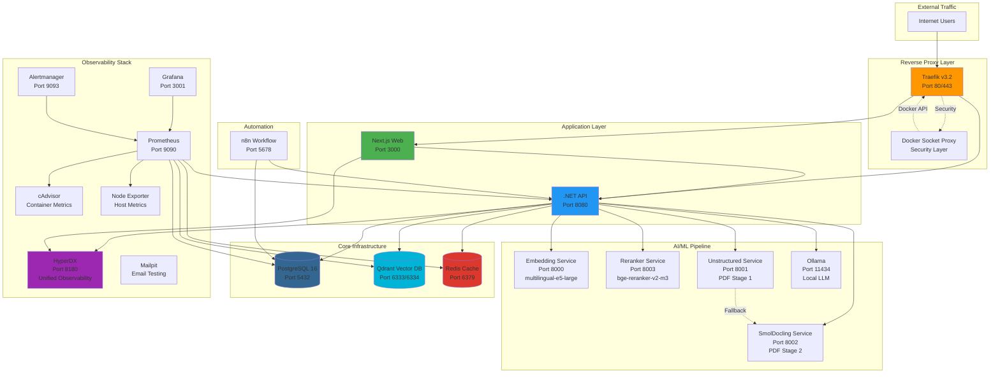
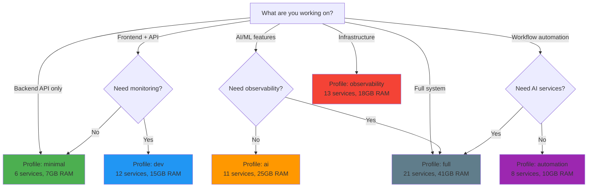

# MeepleAI Production Docker Services - Comprehensive Guide

**Document Version**: 1.0
**Last Updated**: 2026-01-30
**Target Audience**: DevOps Engineers, System Administrators, Development Team Leads

---

## Executive Summary

MeepleAI's production infrastructure consists of **21 containerized services** organized across **5 architectural layers**, orchestrated through Docker Compose with intelligent profile-based activation. The system supports flexible deployment strategies from minimal development setups (6 services) to full production environments (21 services).

### Quick Reference Table

| Layer | Services | Total Resources | Critical for Production |
|-------|----------|----------------|------------------------|
| **Core Infrastructure** | PostgreSQL, Qdrant, Redis | 7G RAM, 5 CPU | ✅ Yes |
| **AI/ML Pipeline** | Embedding, Reranker, Unstructured, SmolDocling, Ollama | 18G RAM, 12 CPU | ✅ Yes |
| **Application** | API (.NET), Web (Next.js) | 5G RAM, 3 CPU | ✅ Yes |
| **Observability** | Prometheus, Grafana, HyperDX, Alertmanager, cAdvisor, Node-Exporter, Mailpit | 8.5G RAM, 5 CPU | ⚠️ Recommended |
| **Infrastructure** | Traefik, n8n, Docker Socket Proxy | 2.5G RAM, 2 CPU | ⚠️ Recommended |

**Total Production Footprint**: ~41GB RAM, ~27 CPUs (with reservations: ~20GB RAM, ~14 CPUs)

### Architecture Diagram



---

## 1. Service Catalog

### 1.1 Core Infrastructure Services

#### PostgreSQL 16.4 (Database)

**Container**: `meepleai-postgres`
**Image**: `postgres:16.4-alpine3.20`
**Port**: `127.0.0.1:5432:5432` (localhost-only for security)

**Role**: Primary relational database for all application data across 9 bounded contexts (DDD architecture).

**Configuration**:
- **Secrets**: `./secrets/database.secret` (POSTGRES_USER, POSTGRES_PASSWORD, POSTGRES_DB)
- **Performance Tuning**:
  - Shared Buffers: 512MB
  - Effective Cache Size: 1536MB
  - Work Memory: 16MB
  - Maintenance Work Memory: 256MB
  - Shared Memory: 1GB

**Resources**:
```yaml
Limits:      2 CPU, 2GB RAM
Reservations: 1 CPU, 1GB RAM
```

**Health Check**: `pg_isready -U ${POSTGRES_USER} -d ${POSTGRES_DB}` every 5s

**Volumes**:
- `postgres_data:/var/lib/postgresql/data` (persistent data)
- `./init/postgres-init.sql:/docker-entrypoint-initdb.d/init.sql:ro` (init script)

**Dependencies**: None (foundational service)

**Profiles**: `minimal`, `dev`, `observability`, `ai`, `automation`, `full`

**Production Notes**:
- Enable connection pooling via PgBouncer for high-load scenarios
- Configure automated backups with point-in-time recovery (PITR)
- Consider read replicas for analytical workloads

---

#### Qdrant 1.12.4 (Vector Database)

**Container**: `meepleai-qdrant`
**Image**: `qdrant/qdrant:v1.12.4`
**Ports**:
- `127.0.0.1:6333:6333` (HTTP REST API)
- `127.0.0.1:6334:6334` (gRPC API)

**Role**: Vector database for RAG (Retrieval-Augmented Generation) pipeline, semantic search, and AI agent knowledge base.

**Configuration**:
- No authentication in development (localhost-only binding)
- Production requires API key configuration

**Resources**:
```yaml
Limits:      2 CPU, 4GB RAM
Reservations: 1 CPU, 2GB RAM
```

**Health Check**: TCP connection test to port 6333 with HTTP GET /readyz every 10s

**Volumes**:
- `qdrant_data:/qdrant/storage` (persistent vector collections)

**Dependencies**: None (independent service)

**Profiles**: `minimal`, `dev`, `observability`, `ai`, `automation`, `full`

**Production Notes**:
- Enable authentication with API keys
- Configure collection optimization for query performance
- Monitor index build times and memory usage
- Consider cluster mode for high availability

---

#### Redis 7.4.1 (Cache & Session Store)

**Container**: `meepleai-redis`
**Image**: `redis:7.4.1-alpine3.20`
**Port**: `127.0.0.1:6379:6379`

**Role**: In-memory cache for API responses, session management, and .NET HybridCache backend.

**Configuration**:
- **Secrets**: `./secrets/redis.secret` (REDIS_PASSWORD)
- **Persistence**: AOF (Append-Only File) enabled
- **Memory Policy**: `allkeys-lru` (Least Recently Used eviction)
- **Max Memory**: 768MB

**Resources**:
```yaml
Limits:      1 CPU, 1GB RAM
Reservations: 0.5 CPU, 512MB RAM
```

**Health Check**: `redis-cli -a ${REDIS_PASSWORD} ping | grep PONG` every 10s

**Volumes**: None (ephemeral cache, AOF provides persistence)

**Dependencies**: None

**Profiles**: `minimal`, `dev`, `observability`, `ai`, `automation`, `full`

**Production Notes**:
- Enable Redis Sentinel for high availability
- Configure backup strategy for AOF files
- Monitor memory fragmentation and eviction rates
- Consider Redis Cluster for horizontal scaling

---

### 1.2 AI/ML Pipeline Services

#### Embedding Service (Python)

**Container**: `meepleai-embedding`
**Build**: `../apps/embedding-service/Dockerfile`
**Port**: `8000:8000`

**Role**: Multilingual embedding generation using `intfloat/multilingual-e5-large` (1024 dimensions). Handles all text vectorization for RAG pipeline.

**Configuration**:
- **Model**: multilingual-e5-large (supports 100+ languages including Italian)
- **Dimensions**: 1024
- **Device**: CPU (GPU support available with uncommenting)

**Resources**:
```yaml
Limits:      2 CPU, 4GB RAM
Reservations: 1 CPU, 2GB RAM
GPU (optional): 1 NVIDIA GPU with cuda capability
```

**Health Check**: `curl -f http://localhost:8000/health` every 30s (60s startup)

**Volumes**: None (model cached in container)

**Dependencies**: None (API calls this service)

**Profiles**: `ai`, `full`

**Production Notes**:
- Enable GPU for 10-20x faster embedding generation
- Monitor inference latency and batch processing efficiency
- Consider model quantization for reduced memory footprint
- Implement request queuing for high concurrency

---

#### Reranker Service (Python)

**Container**: `meepleai-reranker`
**Build**: `../apps/reranker-service/Dockerfile`
**Port**: `127.0.0.1:8003:8003` (localhost-only)

**Role**: Cross-encoder reranking for RAG pipeline using `BAAI/bge-reranker-v2-m3`. Improves retrieval precision by re-scoring candidate documents.

**Configuration**:
- **Model**: BAAI/bge-reranker-v2-m3
- **Batch Size**: 32
- **Warmup**: Enabled (preloads model at startup)

**Resources**:
```yaml
Limits:      2 CPU, 2GB RAM
Reservations: 1 CPU, 1GB RAM
GPU (optional): 1 NVIDIA GPU
```

**Health Check**: `curl -f http://localhost:8003/health` every 30s (120s startup for model download)

**Volumes**:
- `reranker_models:/home/reranker/.cache/huggingface` (model cache)

**Dependencies**: None (API calls this service)

**Profiles**: `ai`, `full`

**Production Notes**:
- GPU acceleration recommended for production workloads
- Monitor reranking latency (target: <100ms for 10 candidates)
- Implement caching for frequently reranked query-document pairs

---

#### Unstructured Service (Python) - PDF Stage 1

**Container**: `meepleai-unstructured`
**Build**: `../apps/unstructured-service/Dockerfile`
**Port**: `8001:8001`

**Role**: Fast PDF text extraction using Unstructured.io library. Primary stage for simple document layouts (rules, FAQs, text-heavy PDFs).

**Configuration**:
- **Strategy**: `fast` (OCR-free text extraction)
- **Language**: Italian (`ita`)
- **Max File Size**: 50MB
- **Timeout**: 30s
- **Chunking**: 2000 chars max, 200 char overlap
- **Quality Threshold**: 0.80 (minimum acceptable extraction quality)

**Resources**:
```yaml
Limits:      2 CPU, 2GB RAM
Reservations: 1 CPU, 1GB RAM
```

**Health Check**: `curl -f http://localhost:8001/health` every 30s (20s startup)

**Volumes**:
- `unstructured_temp:/tmp/pdf-extraction` (temporary processing storage)

**Dependencies**: None (API calls this service)

**Profiles**: `ai`, `full`

**Production Notes**:
- Fallback to SmolDocling for complex layouts (tables, images, multi-column)
- Monitor extraction quality scores and adjust threshold
- Implement retry logic with exponential backoff

---

#### SmolDocling Service (Python) - PDF Stage 2

**Container**: `meepleai-smoldocling`
**Build**: `../apps/smoldocling-service/Dockerfile`
**Port**: `8002:8002`

**Role**: Vision-Language Model (VLM) for complex PDF layouts. Fallback service for documents with tables, images, diagrams, and multi-column layouts.

**Configuration**:
- **Model**: `docling-project/SmolDocling-256M-preview` (Hugging Face)
- **Device**: CPU (cuda for production GPU)
- **Max Pages**: 20 per request
- **Timeout**: 60s
- **Image Processing**: 300 DPI, PNG format
- **Quality Threshold**: 0.70
- **Model Warmup**: Enabled (ensures health checks pass after startup)

**Resources**:
```yaml
Limits:      2 CPU, 4GB RAM
Reservations: 1 CPU, 2GB RAM
GPU (optional): 1 NVIDIA GPU recommended
```

**Health Check**: `curl -f http://localhost:8002/health` every 60s (120s startup for model download)

**Volumes**:
- `smoldocling_temp:/tmp/pdf-processing` (temporary processing)
- `smoldocling_models:/root/.cache/huggingface` (model cache)

**Dependencies**: None (called by API when Unstructured fails quality threshold)

**Profiles**: `ai`, `full`

**Production Notes**:
- GPU highly recommended (10-50x speedup for VLM inference)
- Long startup time on first run (downloads ~500MB model)
- Monitor memory usage during batch processing
- Consider pre-warming model cache in deployment pipeline

---

#### Ollama (Local LLM)

**Container**: `meepleai-ollama`
**Image**: `ollama/ollama:0.3.14`
**Port**: `11434:11434`

**Role**: Local LLM hosting for offline embeddings and inference. Optional alternative to OpenRouter API for privacy-sensitive deployments.

**Configuration**:
- **Max Loaded Models**: 3 concurrent models in memory
- **Keep Alive**: 5 minutes (unload after inactivity)
- **GPU Memory Fraction**: 0.80 (if GPU available)

**Resources**:
```yaml
Limits:      4 CPU, 8GB RAM
Reservations: 2 CPU, 4GB RAM
GPU (optional): 1 NVIDIA GPU
```

**Health Check**: `ollama list || exit 1` every 10s (20s startup)

**Volumes**:
- `ollama_data:/root/.ollama` (model storage and cache)

**Dependencies**: None

**Profiles**: `ai`, `full`

**Companion Service**: `ollama-pull` (one-time model download helper)

**Production Notes**:
- GPU required for acceptable inference performance
- Models consume 4-16GB RAM depending on size
- API defaults to OpenRouter (cloud), Ollama is optional local alternative

---

#### Ollama-Pull (Helper Service)

**Container**: `ollama-pull`
**Image**: `curlimages/curl:8.12.1`
**Restart**: `no` (one-time execution)

**Role**: Downloads `nomic-embed-text` model to Ollama on first startup.

**Resources**:
```yaml
Limits:      1 CPU, 512MB RAM
Reservations: 0.5 CPU, 256MB RAM
```

**Dependencies**:
- `ollama` (condition: service_healthy)

**Profiles**: `ai`, `full`

**Behavior**: Runs once, pulls model via Ollama API, then exits.

---

### 1.3 Application Layer Services

#### API (.NET 9)

**Container**: `meepleai-api`
**Build**: `../apps/api/src/Api/Dockerfile`
**Port**: `127.0.0.1:8080:8080`

**Role**: Core backend API with 9 DDD bounded contexts, CQRS/MediatR architecture, and RAG pipeline orchestration.

**Configuration**:
- **Environment**: Development (override in production)
- **Secrets**: database, redis, qdrant, jwt, openrouter, admin, oauth, bgg, email, embedding-service (10 secret files)
- **Service URLs**:
  - Qdrant: `http://qdrant:6333`
  - Ollama: `http://ollama:11434`
  - Embedding: `http://embedding-service:8000`
  - Reranker: `http://reranker-service:8003`

**Resources**:
```yaml
Limits:      2 CPU, 4GB RAM
Reservations: 1 CPU, 2GB RAM
```

**Health Check**: `curl --fail http://localhost:8080/` every 10s (20s startup, 12 retries)

**Volumes**:
- `./scripts/load-secrets-env.sh:/scripts/load-secrets-env.sh:ro` (secret loader)
- `pdf_uploads:/app/pdf_uploads` (persistent PDF storage)
- `./secrets:/app/infra/secrets:ro` (read-only secret files)

**Dependencies**:
- `postgres` (service_healthy)
- `qdrant` (service_started)
- `redis` (service_healthy)

**Profiles**: `minimal`, `dev`, `observability`, `ai`, `automation`, `full`

**Production Notes**:
- Enable HTTPS with valid certificates
- Configure rate limiting and request throttling
- Implement distributed tracing to HyperDX
- Set ASPNETCORE_ENVIRONMENT=Production
- Review and harden OAuth/JWT configuration

---

#### Web (Next.js 14)

**Container**: `meepleai-web`
**Build**: `../apps/web/Dockerfile`
**Port**: `127.0.0.1:3000:3000`

**Role**: Frontend application with App Router, React 18, Tailwind CSS, and shadcn/ui components.

**Configuration**:
- **Environment**: `./env/web.env.dev` (API URL, feature flags)

**Resources**:
```yaml
Limits:      1 CPU, 1GB RAM
Reservations: 0.5 CPU, 512MB RAM
```

**Health Check**: `curl -f http://localhost:3000/` every 15s (60s startup, 12 retries)

**Volumes**: None (stateless frontend)

**Dependencies**:
- `api` (service_healthy)

**Profiles**: `minimal`, `dev`, `observability`, `ai`, `automation`, `full`

**Production Notes**:
- Build optimized production bundle with `next build`
- Enable response caching and static generation where possible
- Configure Content Security Policy (CSP) headers
- Implement frontend monitoring with HyperDX session replay

---

### 1.4 Observability Stack Services

#### HyperDX (Unified Observability)

**Container**: `meepleai-hyperdx`
**Image**: `docker.hyperdx.io/hyperdx/hyperdx-local:latest`
**Ports**:
- `8180:8080` (Web UI)
- `14317:4317` (OTLP gRPC)
- `14318:4318` (OTLP HTTP)

**Role**: Unified logs, traces, and session replay platform. Replaces Seq + Jaeger with single integrated solution.

**Configuration**:
- **API Key**: `demo` (override in production)
- **Service Name**: `meepleai`
- **Retention**: 30 days (logs/traces), 7 days (session replay)
- **Max Storage**: 50GB
- **ClickHouse Memory**: 4GB max

**Resources**:
```yaml
Limits:      2 CPU, 4GB RAM
Reservations: 1 CPU, 2GB RAM
```

**Health Check**: `wget --spider http://localhost:8000/health` every 30s (60s startup)

**Volumes**:
- `hyperdx_data:/var/lib/clickhouse` (ClickHouse data persistence)
- `hyperdx_logs:/var/log/hyperdx` (application logs)

**Dependencies**: None

**Profiles**: `observability`, `full`

**Production Notes**:
- Configure alert channels (email, Slack)
- Set up custom dashboards for key metrics
- Enable authentication for UI access
- Monitor ClickHouse disk usage and query performance

---

#### Prometheus (Metrics Collector)

**Container**: `meepleai-prometheus`
**Image**: `prom/prometheus:v3.7.0`
**Port**: `127.0.0.1:9090:9090`

**Role**: Time-series metrics database collecting from all services, exporters, and application instrumentation.

**Configuration**:
- **Config**: `./prometheus.yml` (scrape targets, retention)
- **Rules**: `./prometheus-rules.yml` (alerting rules)
- **Retention**: 30 days, 5GB max storage
- **Lifecycle API**: Enabled (for config reload)

**Resources**:
```yaml
Limits:      1 CPU, 2GB RAM
Reservations: 0.5 CPU, 1GB RAM
```

**Health Check**: `wget --spider http://localhost:9090/-/healthy` every 10s

**Volumes**:
- `./prometheus.yml:/etc/prometheus/prometheus.yml:ro`
- `./prometheus-rules.yml:/etc/prometheus/prometheus-rules.yml:ro`
- `prometheus_data:/prometheus` (time-series data)

**Dependencies**: None (scrapes targets independently)

**Profiles**: `dev`, `observability`, `full`

**Production Notes**:
- Configure remote write to long-term storage (Thanos, Cortex, Mimir)
- Implement federation for multi-cluster deployments
- Review scrape intervals vs cardinality trade-offs

---

#### Grafana (Visualization & Dashboards)

**Container**: `meepleai-grafana`
**Image**: `grafana/grafana:11.4.0`
**Port**: `127.0.0.1:3001:3000`

**Role**: Metrics visualization, dashboarding, and alerting UI.

**Configuration**:
- **Secrets**: `./secrets/monitoring.secret` (GRAFANA_ADMIN_PASSWORD)
- **Admin User**: `admin`
- **Datasources**: Prometheus (auto-provisioned)
- **Dashboards**: Auto-provisioned from `./dashboards/`
- **Iframe Embedding**: Enabled (for Infrastructure page)
- **Anonymous Access**: Viewer role enabled

**Resources**:
```yaml
Limits:      1 CPU, 1GB RAM
Reservations: 0.5 CPU, 512MB RAM
```

**Health Check**: `wget --spider http://localhost:3000/api/health` every 10s (20s startup)

**Volumes**:
- `./scripts/load-secrets-env.sh:/scripts/load-secrets-env.sh:ro`
- `grafana_data:/var/lib/grafana` (dashboards, users, settings)
- `./grafana-datasources.yml:/etc/grafana/provisioning/datasources/datasources.yml:ro`
- `./grafana-dashboards.yml:/etc/grafana/provisioning/dashboards/dashboards.yml:ro`
- `./dashboards:/var/lib/grafana/dashboards:ro`

**Dependencies**:
- `prometheus` (datasource)

**Profiles**: `dev`, `observability`, `full`

**Production Notes**:
- Configure SMTP for email alerts
- Set up user authentication (LDAP, OAuth)
- Implement dashboard version control
- Configure backup strategy for dashboards and settings

---

#### Alertmanager (Alert Routing)

**Container**: `meepleai-alertmanager`
**Image**: `prom/alertmanager:v0.27.0`
**Port**: `127.0.0.1:9093:9093`

**Role**: Routes and manages alerts from Prometheus to notification channels (email, Slack, PagerDuty).

**Configuration**:
- **Secrets**: `./secrets/email.secret`, `./secrets/monitoring.secret`
- **Environment**: `./env/alertmanager.env`
- **Config**: `./alertmanager.yml` (routing rules, receivers, inhibition)

**Resources**:
```yaml
Limits:      0.5 CPU, 512MB RAM
Reservations: 0.25 CPU, 256MB RAM
```

**Health Check**: `wget --spider http://localhost:9093/-/healthy` every 10s

**Volumes**:
- `./scripts/load-secrets-env.sh:/scripts/load-secrets-env.sh:ro`
- `./alertmanager.yml:/etc/alertmanager/alertmanager.yml:ro`
- `alertmanager_data:/alertmanager` (silences, notification state)

**Dependencies**: None (receives alerts from Prometheus)

**Profiles**: `observability`, `full`

**Production Notes**:
- Configure high availability with clustering (3+ replicas)
- Set up escalation policies for critical alerts
- Implement on-call rotation integration

---

#### cAdvisor (Container Metrics)

**Container**: `meepleai-cadvisor`
**Image**: `gcr.io/cadvisor/cadvisor:v0.49.1`
**Port**: `127.0.0.1:8082:8080`

**Role**: Exposes container resource usage and performance metrics to Prometheus.

**Configuration**:
- **Privileged Mode**: Required for container introspection
- **Docker Socket**: Read-only access to Docker API

**Resources**:
```yaml
Limits:      0.5 CPU, 512MB RAM
Reservations: 0.25 CPU, 256MB RAM
```

**Health Check**: None (lightweight exporter)

**Volumes**:
- `/:/rootfs:ro` (host filesystem, read-only)
- `/var/run:/var/run:ro`
- `/sys:/sys:ro`
- `/var/lib/docker/:/var/lib/docker:ro`
- `/dev/disk/:/dev/disk:ro`
- `/var/run/docker.sock:/var/run/docker.sock:ro`

**Dependencies**: None

**Profiles**: `observability`, `full`

**Production Notes**:
- Restrict access to metrics endpoint (localhost-only or firewall)
- Monitor overhead on high-container-count hosts

---

#### Node Exporter (Host Metrics)

**Container**: `meepleai-node-exporter`
**Image**: `prom/node-exporter:v1.8.2`
**Port**: `127.0.0.1:9100:9100`

**Role**: Exposes host-level metrics (CPU, memory, disk, network) to Prometheus.

**Configuration**:
- **Root Filesystem**: Mounted at `/host` for accurate metrics
- **Filesystem Exclusions**: Excludes virtual filesystems (sys, proc, dev)

**Resources**:
```yaml
Limits:      0.5 CPU, 256MB RAM
Reservations: 0.25 CPU, 128MB RAM
```

**Health Check**: None (lightweight exporter)

**Volumes**:
- `/:/host:ro` (host filesystem)

**Dependencies**: None

**Profiles**: `observability`, `full`

**Production Notes**:
- Essential for infrastructure monitoring
- Pair with host-level alerting rules in Prometheus

---

#### Mailpit (Email Testing)

**Container**: `mailpit`
**Image**: `axllent/mailpit:v1.22`
**Ports**:
- `127.0.0.1:1025:1025` (SMTP server)
- `127.0.0.1:8025:8025` (Web UI + REST API)

**Role**: Email testing service for development. Captures all outbound emails without sending to real addresses.

**Configuration**:
- **Max Messages**: 500
- **SMTP Auth**: Accept any credentials (development only)
- **Database**: SQLite at `/data/mailpit.db`

**Resources**:
```yaml
Limits:      0.5 CPU, 128MB RAM
Reservations: 0.25 CPU, 64MB RAM
```

**Health Check**: `wget --spider http://localhost:8025/api/v1/messages && nc -z localhost 1025` every 10s

**Volumes**:
- `mailpit_data:/data` (email storage and SQLite database)

**Dependencies**: None

**Profiles**: `dev`, `observability`, `full`

**Production Notes**:
- **Do NOT use in production** - replace with real SMTP server
- Modern alternative to Mailhog with better UI and API

---

### 1.5 Infrastructure & Automation Services

#### Traefik v3.2 (Reverse Proxy)

**Container**: `meepleai-traefik`
**Image**: `traefik:v3.2`
**Ports**:
- `80:80` (HTTP entrypoint)
- `443:443` (HTTPS entrypoint - commented out for dev)
- `8080:8080` (Dashboard - insecure mode for dev)

**Role**: Edge router and reverse proxy with automatic service discovery, TLS termination, and middleware routing.

**Configuration**:
- **Docker Provider**: Automatic container discovery via labels
- **Endpoint**: `npipe:////./pipe/docker_engine` (Windows Docker Desktop)
- **Dashboard**: Enabled (insecure mode - disable in production)
- **Logging**: DEBUG level (reduce to INFO in production)
- **Network**: `meepleai` bridge network

**Resources**:
```yaml
Limits:      1 CPU, 512MB RAM
Reservations: 0.5 CPU, 256MB RAM
```

**Health Check**: None (relies on Docker health)

**Volumes**:
- `./traefik/dynamic:/etc/traefik/dynamic:ro` (middleware definitions)
- `./traefik/logs:/var/log/traefik` (access logs)

**Dependencies**: None (entry point for external traffic)

**Profiles**: `minimal`, `dev`, `observability`, `ai`, `automation`, `full`

**Middleware Available**:
- `rate-limit-api` (API throttling)
- `security-headers` (HSTS, CSP, etc.)

**Production Notes**:
- Enable Docker Socket Proxy for security
- Configure Let's Encrypt for automatic TLS certificates
- Disable dashboard or protect with authentication
- Switch to INFO/WARN logging
- Enable access logs with rotation

---

#### Docker Socket Proxy (Security Layer)

**Container**: `meepleai-socket-proxy`
**Image**: `ghcr.io/tecnativa/docker-socket-proxy:0.3.0`
**Port**: Internal only (2375)

**Role**: Limits Traefik's access to Docker API with read-only permissions. Prevents container escape attacks.

**Configuration**:
- **Allowed Operations**: Containers, Services, Tasks, Networks (read-only)
- **Denied Operations**: POST, BUILD, COMMIT, EXEC, IMAGES, VOLUMES, SWARM
- **Security**: `no-new-privileges`, `read_only`, `tmpfs`

**Resources**:
```yaml
Limits:      0.5 CPU, 256MB RAM
Reservations: 0.25 CPU, 128MB RAM
```

**Health Check**: `wget --spider http://localhost:2375/version` every 10s

**Volumes**:
- `/var/run/docker.sock:/var/run/docker.sock:ro` (Docker socket, read-only)

**Dependencies**: None

**Profiles**: `prod` (disabled in development)

**Production Notes**:
- **Critical for production security** - prevents container breakout
- Enable in production with `COMPOSE_PROFILES=prod`
- Update Traefik endpoint to `tcp://docker-socket-proxy:2375`

---

#### n8n (Workflow Automation)

**Container**: `meepleai-n8n`
**Image**: `n8nio/n8n:1.114.4`
**Port**: `127.0.0.1:5678:5678`

**Role**: Low-code workflow automation platform for integrations, scheduled tasks, and event-driven workflows.

**Configuration**:
- **Secrets**: `./secrets/database.secret`, `./secrets/n8n.secret`
- **Environment**: `./env/n8n.env.dev`
- **Database**: PostgreSQL (shared with main API)
- **Node.js Heap**: 512MB (75% of container limit)

**Resources**:
```yaml
Limits:      1 CPU, 1GB RAM
Reservations: 0.5 CPU, 512MB RAM
```

**Health Check**: None (web UI accessible)

**Volumes**:
- `./scripts/load-secrets-env.sh:/scripts/load-secrets-env.sh:ro`

**Dependencies**:
- `postgres` (service_healthy)

**Profiles**: `automation`, `full`

**Production Notes**:
- Enable authentication and restrict access
- Configure webhook URLs for production domain
- Implement workflow version control
- Monitor execution logs and error rates

---

## 2. Profile Strategy & Decision Tree

### Profile Definitions

| Profile | Services Count | RAM Usage | Use Case |
|---------|---------------|-----------|----------|
| **minimal** | 6 | ~7GB | Core API development without AI/observability |
| **dev** | 12 | ~15GB | Full-featured development with monitoring |
| **ai** | 11 | ~25GB | AI/ML development and testing |
| **automation** | 8 | ~10GB | Workflow automation testing |
| **observability** | 13 | ~18GB | Infrastructure monitoring and debugging |
| **full** | 21 | ~41GB | Complete production-like environment |

### Decision Tree



### Activation Commands

```bash
# Minimal (core development)
COMPOSE_PROFILES=minimal docker compose up -d

# Development (+ monitoring)
COMPOSE_PROFILES=dev docker compose up -d

# AI/ML development
COMPOSE_PROFILES=ai docker compose up -d

# Workflow automation
COMPOSE_PROFILES=automation docker compose up -d

# Observability (monitoring focus)
COMPOSE_PROFILES=observability docker compose up -d

# Full production-like
COMPOSE_PROFILES=full docker compose up -d

# Multi-profile (custom combination)
COMPOSE_PROFILES=minimal,observability docker compose up -d

# With Traefik reverse proxy
docker compose -f docker-compose.yml -f docker-compose.traefik.yml up -d

# With HyperDX unified observability
docker compose -f docker-compose.yml -f docker-compose.hyperdx.yml up -d
```

### Profile Service Matrix

| Service | minimal | dev | ai | automation | observability | full |
|---------|---------|-----|----|-----------:|---------------|------|
| **postgres** | ✅ | ✅ | ✅ | ✅ | ✅ | ✅ |
| **qdrant** | ✅ | ✅ | ✅ | ✅ | ✅ | ✅ |
| **redis** | ✅ | ✅ | ✅ | ✅ | ✅ | ✅ |
| **api** | ✅ | ✅ | ✅ | ✅ | ✅ | ✅ |
| **web** | ✅ | ✅ | ✅ | ✅ | ✅ | ✅ |
| **traefik** | ✅ | ✅ | ✅ | ✅ | ✅ | ✅ |
| **mailpit** | ❌ | ✅ | ❌ | ❌ | ✅ | ✅ |
| **prometheus** | ❌ | ✅ | ❌ | ❌ | ✅ | ✅ |
| **grafana** | ❌ | ✅ | ❌ | ❌ | ✅ | ✅ |
| **alertmanager** | ❌ | ❌ | ❌ | ❌ | ✅ | ✅ |
| **cadvisor** | ❌ | ❌ | ❌ | ❌ | ✅ | ✅ |
| **node-exporter** | ❌ | ❌ | ❌ | ❌ | ✅ | ✅ |
| **hyperdx** | ❌ | ❌ | ❌ | ❌ | ✅ | ✅ |
| **ollama** | ❌ | ❌ | ✅ | ❌ | ❌ | ✅ |
| **ollama-pull** | ❌ | ❌ | ✅ | ❌ | ❌ | ✅ |
| **embedding-service** | ❌ | ❌ | ✅ | ❌ | ❌ | ✅ |
| **reranker-service** | ❌ | ❌ | ✅ | ❌ | ❌ | ✅ |
| **unstructured-service** | ❌ | ❌ | ✅ | ❌ | ❌ | ✅ |
| **smoldocling-service** | ❌ | ❌ | ✅ | ❌ | ❌ | ✅ |
| **n8n** | ❌ | ❌ | ❌ | ✅ | ❌ | ✅ |
| **socket-proxy** | ❌ | ❌ | ❌ | ❌ | ❌ | ❌* |

\* `socket-proxy` requires explicit `prod` profile activation for production security

---

## 3. Production Readiness Checklist

### 3.1 Secret Management

**Current State**: `.secret` files in `./secrets/` directory (gitignored)

**Critical Secrets** (blocks startup if missing):
- ✅ `database.secret` (POSTGRES_USER, POSTGRES_PASSWORD, POSTGRES_DB)
- ✅ `redis.secret` (REDIS_PASSWORD)
- ✅ `qdrant.secret` (QDRANT_API_KEY - production only)
- ✅ `jwt.secret` (JWT_SECRET_KEY, JWT_ISSUER, JWT_AUDIENCE)
- ✅ `admin.secret` (DEFAULT_ADMIN_EMAIL, DEFAULT_ADMIN_PASSWORD)
- ✅ `embedding-service.secret` (EMBEDDING_API_KEY)

**Important Secrets** (warns if missing):
- ⚠️ `openrouter.secret` (OPENROUTER_API_KEY - for cloud LLM)
- ⚠️ `unstructured-service.secret` (UNSTRUCTURED_API_KEY)
- ⚠️ `bgg.secret` (BGG_API_USERNAME, BGG_API_PASSWORD)

**Optional Secrets**:
- 📝 `oauth.secret` (Google, GitHub, Microsoft OAuth credentials)
- 📝 `email.secret` (SMTP configuration)
- 📝 `monitoring.secret` (Grafana admin password, alert webhooks)
- 📝 `n8n.secret` (n8n encryption key, webhook URLs)
- 📝 `storage.secret` (S3/Azure Blob credentials)
- 📝 `traefik.secret` (Let's Encrypt email, dashboard credentials)

**Setup Process**:
```bash
# 1. Generate secrets (auto-generates secure values)
cd infra/secrets
pwsh setup-secrets.ps1 -SaveGenerated

# 2. Review and customize (optional)
# Edit .secret files with real credentials where needed

# 3. Validate configuration
docker compose config --quiet && echo "✅ Configuration valid"

# 4. Sync to .env.development (manual)
# Update apps/web/.env.development with matching values
```

**Rotation Strategy**:
- **Critical secrets**: Rotate every 90 days
- **API keys**: Rotate on suspected compromise
- **JWT secrets**: Invalidates all sessions - plan maintenance window
- **Database passwords**: Coordinate with connection pool draining

**Security Best Practices**:
- ✅ Never commit `.secret` files to version control
- ✅ Use `setup-secrets.ps1` for initial generation
- ✅ Restrict file permissions: `chmod 600 infra/secrets/*.secret`
- ✅ Encrypt secrets at rest in production (Vault, AWS Secrets Manager)
- ✅ Use separate secrets for dev/staging/production
- ❌ Don't share secrets via email/Slack/chat
- ❌ Don't hardcode secrets in code or Docker images

---

### 3.2 TLS/HTTPS Configuration

**Development**: HTTP-only (localhost binding)

**Production Requirements**:

1. **Enable HTTPS entrypoint in Traefik**:
```yaml
# docker-compose.traefik.yml
command:
  - "--entrypoints.websecure.address=:443"
  - "--certificatesresolvers.letsencrypt.acme.tlschallenge=true"
  - "--certificatesresolvers.letsencrypt.acme.email=admin@yourdomain.com"
  - "--certificatesresolvers.letsencrypt.acme.storage=/letsencrypt/acme.json"
```

2. **Update service labels**:
```yaml
# API service
labels:
  - "traefik.http.routers.api.tls=true"
  - "traefik.http.routers.api.tls.certresolver=letsencrypt"

# Web service
labels:
  - "traefik.http.routers.web.tls=true"
  - "traefik.http.routers.web.tls.certresolver=letsencrypt"
```

3. **HTTP to HTTPS redirect middleware**:
```yaml
# traefik/dynamic/middlewares.yml
http:
  middlewares:
    https-redirect:
      redirectScheme:
        scheme: https
        permanent: true
```

4. **Security headers middleware**:
```yaml
http:
  middlewares:
    security-headers:
      headers:
        sslRedirect: true
        stsSeconds: 31536000
        stsIncludeSubdomains: true
        stsPreload: true
        forceSTSHeader: true
        contentTypeNosniff: true
        browserXssFilter: true
        referrerPolicy: "strict-origin-when-cross-origin"
        permissionsPolicy: "geolocation=(), microphone=(), camera=()"
```

**Certificate Management**:
- Let's Encrypt auto-renewal via Traefik ACME
- Wildcard certificates require DNS challenge (not HTTP)
- Monitor certificate expiration with Prometheus alerts

---

### 3.3 Resource Scaling Guidelines

**Vertical Scaling** (single-host optimization):

| Component | Bottleneck Indicator | Scaling Action |
|-----------|---------------------|----------------|
| **PostgreSQL** | High query latency, CPU >80% | Increase CPU to 4, RAM to 4GB, enable connection pooling |
| **Qdrant** | Slow vector search, RAM >90% | Increase RAM to 8GB, add SSD for storage |
| **Redis** | Eviction rate >10%, memory >90% | Increase max memory to 2GB, tune eviction policy |
| **API** | Request queue >100, CPU >80% | Scale to 4 CPU, 8GB RAM, enable HybridCache |
| **Embedding Service** | Inference latency >500ms | Add GPU (10-20x speedup), increase batch size |
| **SmolDocling** | Processing timeout, RAM spikes | Add GPU, increase RAM to 8GB |

**Horizontal Scaling** (multi-host distribution):

| Service | Scaling Method | Load Balancing |
|---------|---------------|----------------|
| **API** | Docker Swarm replicas or Kubernetes Pods | Traefik round-robin |
| **Web** | Static CDN + SSR instance replicas | CDN + Traefik |
| **Embedding Service** | Kubernetes HPA based on queue length | Traefik weighted round-robin |
| **PostgreSQL** | Read replicas for analytics | PgBouncer with read/write routing |
| **Qdrant** | Cluster mode (3+ nodes) | Built-in distributed search |
| **Redis** | Redis Sentinel or Redis Cluster | Sentinel-aware clients |

**Autoscaling Triggers** (Kubernetes HPA):
```yaml
# API autoscaling
minReplicas: 2
maxReplicas: 10
metrics:
  - type: Resource
    resource:
      name: cpu
      target:
        type: Utilization
        averageUtilization: 70
  - type: Resource
    resource:
      name: memory
      target:
        type: Utilization
        averageUtilization: 80
```

---

### 3.4 Backup & Disaster Recovery

**PostgreSQL Backups**:
```bash
# Daily automated backup script
#!/bin/bash
BACKUP_DIR=/backups/postgres
RETENTION_DAYS=30
TIMESTAMP=$(date +%Y%m%d_%H%M%S)

# Backup with pg_dump
docker compose exec -T postgres pg_dump -U meepleai_user -d meepleai_db > \
  $BACKUP_DIR/meepleai_db_$TIMESTAMP.sql

# Compress backup
gzip $BACKUP_DIR/meepleai_db_$TIMESTAMP.sql

# Remove old backups
find $BACKUP_DIR -name "*.sql.gz" -mtime +$RETENTION_DAYS -delete

# Upload to S3 (optional)
# aws s3 cp $BACKUP_DIR/meepleai_db_$TIMESTAMP.sql.gz s3://meepleai-backups/postgres/
```

**Point-in-Time Recovery (PITR)**:
- Enable WAL archiving in PostgreSQL
- Continuous archival to S3/Azure Blob
- RTO target: <30 minutes
- RPO target: <5 minutes (transaction log shipping)

**Qdrant Backups**:
```bash
# Snapshot collections via API
curl -X POST "http://localhost:6333/collections/games/snapshots"

# Download snapshot
curl "http://localhost:6333/collections/games/snapshots/snapshot_name" \
  -o /backups/qdrant/games_snapshot_$TIMESTAMP.snapshot
```

**Redis Persistence**:
- AOF enabled (appendonly yes)
- Daily RDB snapshots
- Replication to standby instance

**Volume Backup Strategy**:
```bash
# Backup all Docker volumes
docker run --rm \
  -v meepleai_postgres_data:/source:ro \
  -v /backups:/backup \
  alpine tar czf /backup/postgres_data_$TIMESTAMP.tar.gz /source
```

**Disaster Recovery Testing**:
- Monthly DR drill simulations
- Automated restore testing in staging
- Documented runbook for recovery procedures

---

### 3.5 Monitoring & Alerting Configuration

**Key Prometheus Alerts** (`prometheus-rules.yml`):

```yaml
groups:
  - name: meepleai_critical
    interval: 30s
    rules:
      # API Health
      - alert: APIDown
        expr: up{job="api"} == 0
        for: 2m
        labels:
          severity: critical
        annotations:
          summary: "MeepleAI API is down"

      # Database Connection Pool
      - alert: DatabaseConnectionPoolExhausted
        expr: pg_stat_database_numbackends{datname="meepleai_db"} > 90
        for: 5m
        labels:
          severity: warning

      # Redis Memory
      - alert: RedisMemoryHigh
        expr: redis_memory_used_bytes / redis_memory_max_bytes > 0.9
        for: 5m
        labels:
          severity: warning

      # Qdrant Query Latency
      - alert: QdrantHighLatency
        expr: histogram_quantile(0.95, rate(qdrant_search_duration_seconds_bucket[5m])) > 2
        for: 10m
        labels:
          severity: warning

      # Embedding Service Errors
      - alert: EmbeddingServiceErrors
        expr: rate(embedding_service_errors_total[5m]) > 0.1
        for: 5m
        labels:
          severity: critical
```

**Grafana Dashboards** (auto-provisioned):
1. **Infrastructure Overview**: Host metrics, container status, resource usage
2. **API Performance**: Request rate, latency percentiles, error rate
3. **Database Metrics**: Query performance, connection pool, cache hit ratio
4. **AI/ML Pipeline**: Embedding latency, reranker accuracy, PDF processing throughput
5. **Business Metrics**: User activity, RAG query success rate, game catalog growth

**HyperDX Integration**:
- **Logs**: Structured JSON logging from API (Serilog)
- **Traces**: OpenTelemetry distributed tracing across services
- **Session Replay**: Frontend user sessions for debugging

**Alertmanager Channels**:
```yaml
# alertmanager.yml
receivers:
  - name: 'critical-alerts'
    email_configs:
      - to: 'oncall@meepleai.com'
        send_resolved: true
    slack_configs:
      - api_url: '$SLACK_WEBHOOK_URL'
        channel: '#alerts-critical'

  - name: 'warning-alerts'
    slack_configs:
      - api_url: '$SLACK_WEBHOOK_URL'
        channel: '#alerts-warning'
```

---

### 3.6 Security Hardening

**Container Security**:
- ✅ Run as non-root users where possible
- ✅ Enable read-only filesystems with tmpfs for writable paths
- ✅ Set `no-new-privileges` security option
- ✅ Use minimal base images (Alpine, Distroless)
- ✅ Scan images for vulnerabilities (Trivy, Clair)

**Network Security**:
- ✅ Bind services to `127.0.0.1` in development
- ✅ Use internal Docker network for inter-service communication
- ✅ Enable Traefik rate limiting middleware
- ✅ Implement IP whitelisting for admin interfaces
- ✅ Configure firewall rules (ufw, iptables)

**Docker Socket Protection**:
- ✅ Enable Socket Proxy in production (`COMPOSE_PROFILES=prod`)
- ✅ Restrict Traefik permissions to read-only
- ❌ Never expose Docker socket directly to Traefik

**Secret Protection**:
- ✅ Use `.secret` files with restricted permissions
- ✅ Encrypt secrets at rest (HashiCorp Vault, AWS Secrets Manager)
- ✅ Rotate credentials every 90 days
- ✅ Implement secret scanning in CI/CD (detect-secrets, gitleaks)

**Application Security**:
- ✅ Enable CORS with strict origin policies
- ✅ Implement CSRF protection (anti-forgery tokens)
- ✅ Validate JWT signatures and expiration
- ✅ Sanitize user inputs (SQL injection, XSS prevention)
- ✅ Rate limit API endpoints (Traefik middleware)

**Compliance** (GDPR, SOC2):
- ✅ Log retention policies (30 days default)
- ✅ Data anonymization for analytics
- ✅ User data deletion workflows
- ✅ Audit trail for sensitive operations

---

## 4. Troubleshooting Guide

### 4.1 Common Startup Issues

#### Issue: "Secret file not found"
**Symptom**: API container exits with `SecretLoader.cs` validation error

**Diagnosis**:
```bash
# Check if secrets directory exists
ls -la infra/secrets/

# Validate secret files
docker compose config --quiet
```

**Resolution**:
```bash
cd infra/secrets
pwsh setup-secrets.ps1 -SaveGenerated
```

**Prevention**: Run `setup-secrets.ps1` during initial setup

---

#### Issue: PostgreSQL "FATAL: password authentication failed"
**Symptom**: API health check fails, logs show database connection errors

**Diagnosis**:
```bash
# Check database secret file
cat infra/secrets/database.secret

# Test direct connection
docker compose exec postgres psql -U meepleai_user -d meepleai_db
```

**Resolution**:
```bash
# 1. Verify secret file has correct format
# KEY=VALUE (no spaces around =)

# 2. Restart postgres to apply new password
docker compose restart postgres

# 3. Update API connection string if needed
docker compose restart api
```

**Prevention**: Use `setup-secrets.ps1` to avoid formatting errors

---

#### Issue: Qdrant health check timeout
**Symptom**: Qdrant container restarts repeatedly, API can't connect

**Diagnosis**:
```bash
# Check Qdrant logs
docker compose logs qdrant --tail=50

# Test HTTP endpoint
curl http://localhost:6333/readyz
```

**Resolution**:
```bash
# 1. Increase startup time (for slow systems)
# Edit docker-compose.yml: start_period: 30s

# 2. Check disk space (Qdrant needs space for vectors)
docker system df

# 3. Reset Qdrant data if corrupted
docker compose down
docker volume rm meepleai_qdrant_data
docker compose up -d qdrant
```

---

#### Issue: Embedding Service OOM (Out of Memory)
**Symptom**: `meepleai-embedding` container killed with exit code 137

**Diagnosis**:
```bash
# Check container memory usage
docker stats meepleai-embedding

# Review logs for memory errors
docker compose logs embedding-service --tail=100
```

**Resolution**:
```bash
# 1. Increase memory limit
# Edit docker-compose.yml:
#   deploy.resources.limits.memory: 8G

# 2. Enable GPU to reduce RAM usage
# Uncomment GPU reservations in docker-compose.yml

# 3. Reduce concurrent requests
# API side: limit batch size and queue depth
```

**Prevention**: Monitor memory usage in Grafana, set up alerts for >90%

---

### 4.2 Performance Troubleshooting

#### Slow API Response Time (>500ms)

**Investigation Steps**:
```bash
# 1. Check API container CPU/RAM
docker stats meepleai-api

# 2. Review HyperDX traces for bottlenecks
# http://localhost:8180 → Traces → Filter by latency >500ms

# 3. Check database query performance
docker compose exec postgres psql -U meepleai_user -d meepleai_db -c "
  SELECT query, mean_exec_time, calls
  FROM pg_stat_statements
  ORDER BY mean_exec_time DESC
  LIMIT 10;
"

# 4. Redis cache hit rate
docker compose exec redis redis-cli -a $REDIS_PASSWORD INFO stats | grep hits
```

**Common Causes & Fixes**:
- **Database N+1 queries**: Enable EF Core query logging, add `Include()` statements
- **Missing Redis cache**: Verify HybridCache configuration, check cache hit rate
- **Slow embeddings**: Switch to GPU-accelerated embedding service
- **Network latency**: Use `docker stats` to check network I/O

---

#### High Memory Usage

**Investigation**:
```bash
# Container memory usage
docker stats --no-stream --format "table {{.Container}}\t{{.MemUsage}}"

# System memory
free -h

# Docker system disk usage
docker system df -v
```

**Resolution Strategy**:
1. **Identify top consumers**: Sort containers by memory usage
2. **Check for memory leaks**: Compare memory over time (Grafana dashboard)
3. **Optimize services**:
   - **API**: Enable batch processing for embeddings
   - **Ollama**: Reduce `OLLAMA_MAX_LOADED_MODELS`
   - **SmolDocling**: Lower `MAX_PAGES_PER_REQUEST`
4. **Clean up unused resources**:
```bash
docker system prune -a --volumes
```

---

### 4.3 Networking Issues

#### Service Cannot Connect to Another Service

**Symptom**: API logs show "Connection refused" to Qdrant/Redis/PostgreSQL

**Diagnosis**:
```bash
# Verify services are on same network
docker network inspect meepleai

# Test connectivity from API container
docker compose exec api ping qdrant
docker compose exec api curl http://qdrant:6333/health
```

**Resolution**:
```bash
# 1. Ensure all services use 'meepleai' network
# Check docker-compose.yml networks section

# 2. Verify service names in connection strings
# API should use: http://qdrant:6333 (not localhost)

# 3. Restart network stack
docker compose down
docker compose up -d
```

---

#### Port Conflict (Address Already in Use)

**Symptom**: "bind: address already in use" error on startup

**Diagnosis**:
```bash
# Windows
netstat -ano | findstr :8080

# Linux/macOS
lsof -i :8080
```

**Resolution**:
```bash
# Option 1: Kill conflicting process
taskkill /PID <PID> /F  # Windows
kill -9 <PID>           # Linux/macOS

# Option 2: Change port in docker-compose.yml
# ports:
#   - "8081:8080"  # Changed host port

# Option 3: Use profiles to avoid conflicts
COMPOSE_PROFILES=minimal docker compose up -d
```

---

### 4.4 Data Persistence Issues

#### Lost Data After Container Restart

**Symptom**: Database empty, uploaded PDFs missing, Grafana dashboards gone

**Diagnosis**:
```bash
# List volumes
docker volume ls | grep meepleai

# Inspect volume mount
docker volume inspect meepleai_postgres_data
```

**Resolution**:
```bash
# Verify volumes are defined in docker-compose.yml
docker compose config | grep -A 5 "volumes:"

# Check volume permissions
docker compose exec postgres ls -la /var/lib/postgresql/data

# Restore from backup
docker run --rm \
  -v meepleai_postgres_data:/restore \
  -v /backups:/backup \
  alpine tar xzf /backup/postgres_data_backup.tar.gz -C /restore
```

**Prevention**: Always use named volumes, never anonymous volumes

---

### 4.5 Security Issues

#### Exposed Docker Socket

**Symptom**: Security scan reports Docker socket exposed to Traefik

**Diagnosis**:
```bash
# Check if socket-proxy is running
docker ps | grep socket-proxy

# Verify Traefik configuration
docker compose exec traefik cat /etc/traefik/traefik.yml | grep endpoint
```

**Resolution**:
```bash
# Enable socket proxy in production
COMPOSE_PROFILES=prod docker compose -f docker-compose.yml -f docker-compose.traefik.yml up -d

# Update Traefik endpoint in docker-compose.traefik.yml:
# - "--providers.docker.endpoint=tcp://docker-socket-proxy:2375"
```

---

#### Secret Exposed in Logs

**Symptom**: Secrets visible in `docker compose logs` or HyperDX

**Diagnosis**:
```bash
# Search logs for potential secrets
docker compose logs | grep -i "password\|secret\|key"
```

**Resolution**:
```bash
# 1. Rotate compromised credentials immediately
cd infra/secrets
rm compromised.secret
pwsh setup-secrets.ps1 -SaveGenerated

# 2. Enable log filtering in API (Serilog)
# Add destructuring rules to redact sensitive fields

# 3. Configure HyperDX to mask secrets
# Settings → Data Masking → Add patterns
```

**Prevention**: Use structured logging with field redaction, never log raw secrets

---

## 5. Appendix

### 5.1 Resource Calculation Methodology

**Total Limits**: Sum of all `deploy.resources.limits` values
**Total Reservations**: Sum of all `deploy.resources.reservations` values
**Peak Usage**: Typically 60-80% of limits under normal load
**Overhead**: Add 20% buffer for OS and Docker engine

**Recommended Host Specifications**:
- **Development (minimal profile)**: 16GB RAM, 8 CPU cores
- **Full Local Development**: 64GB RAM, 16 CPU cores
- **Production (single host)**: 128GB RAM, 32 CPU cores + GPU
- **Production (cluster)**: Kubernetes with node autoscaling

---

### 5.2 Upgrade Path to Kubernetes

**Migration Strategy** (when Docker Compose becomes insufficient):

1. **Phase 1: Containerization Review**
   - Audit Dockerfiles for best practices
   - Remove localhost bindings, use Kubernetes services
   - Externalize all configuration to ConfigMaps/Secrets

2. **Phase 2: Helm Chart Development**
   - Convert docker-compose.yml to Helm templates
   - Implement liveness/readiness probes
   - Define resource requests/limits

3. **Phase 3: StatefulSet Migration**
   - PostgreSQL: StatefulSet with persistent volumes
   - Qdrant: StatefulSet with replication
   - Redis: Redis Operator or Sentinel

4. **Phase 4: Service Mesh (Optional)**
   - Istio or Linkerd for advanced traffic management
   - mTLS for inter-service encryption
   - Circuit breakers and retries

---

### 5.3 Cost Estimation (Cloud Deployment)

**AWS ECS/Fargate** (estimated monthly):
| Component | Instance Type | Monthly Cost |
|-----------|--------------|--------------|
| API (2 tasks) | 2 vCPU, 4GB | ~$150 |
| Embedding (GPU) | g4dn.xlarge | ~$300 |
| PostgreSQL RDS | db.r6g.xlarge | ~$400 |
| Redis ElastiCache | cache.r6g.large | ~$200 |
| Qdrant (self-hosted) | c6g.2xlarge | ~$180 |
| Load Balancer | ALB | ~$25 |
| **Total** | | **~$1,255/month** |

**Google Cloud Run** (serverless):
| Component | Pricing Model | Monthly Cost |
|-----------|--------------|--------------|
| API | Pay-per-request | ~$100-300 |
| Embedding | Cloud Run GPU | ~$200-400 |
| Cloud SQL (PostgreSQL) | db-n1-standard-2 | ~$250 |
| Memorystore (Redis) | M1 (1GB) | ~$50 |
| **Total** | | **~$600-1,000/month** |

---

### 5.4 Further Reading

**Official Documentation**:
- [Docker Compose Reference](https://docs.docker.com/compose/compose-file/)
- [Traefik v3 Documentation](https://doc.traefik.io/traefik/)
- [Prometheus Best Practices](https://prometheus.io/docs/practices/)
- [Qdrant Documentation](https://qdrant.tech/documentation/)

**Internal Documentation**:
- `docs/01-architecture/system-overview.md` - High-level architecture
- `docs/02-development/getting-started.md` - Development setup guide
- `docs/04-deployment/production-deployment.md` - Production deployment procedures
- `docs/05-testing/backend/backend-testing-patterns.md` - Testing strategy

**ADRs (Architectural Decision Records)**:
- `docs/01-architecture/adr/ADR-016-rag-pipeline.md` - RAG architecture
- `docs/01-architecture/adr/ADR-023-observability-stack.md` - Monitoring decisions

---

## Document Changelog

| Date | Version | Changes | Author |
|------|---------|---------|--------|
| 2026-01-30 | 1.0 | Initial comprehensive documentation | Claude Code |

---

**End of Document**
