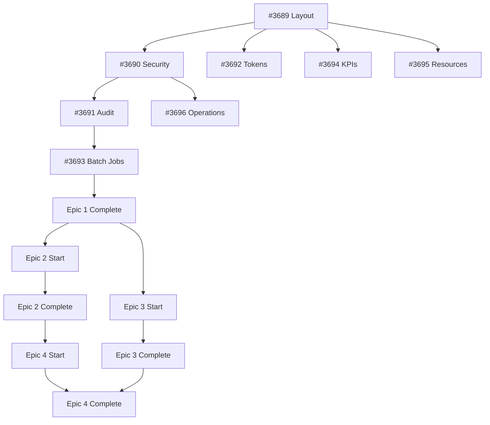

# Enterprise Admin Dashboard - Issue Tracking

> **Created**: 2026-02-05
> **Total Issues**: 37 create
> **Epics**: 4
> **Timeline**: 10-12 settimane

---

## All Issues Created

### EPIC 1: Core Dashboard & Infrastructure [#3685](https://github.com/DegrassiAaron/meepleai-monorepo/issues/3685)

| # | Issue | Title | Days | Depends | Status |
|---|-------|-------|------|---------|--------|
| 1.1 | [#3689](https://github.com/DegrassiAaron/meepleai-monorepo/issues/3689) | Layout Base & Navigation | 3-4 | - | ⏳ Ready |
| 1.2 | [#3690](https://github.com/DegrassiAaron/meepleai-monorepo/issues/3690) | Admin Role & Security | 3-4 | #3689 | ⏳ Blocked |
| 1.3 | [#3691](https://github.com/DegrassiAaron/meepleai-monorepo/issues/3691) | Audit Log System | 4-5 | #3689,#3690 | ⏳ Blocked |
| 1.4 | [#3694](https://github.com/DegrassiAaron/meepleai-monorepo/issues/3694) | Overview Extended KPIs | 2-3 | #3689 | ⏳ Blocked |
| 1.5 | [#3692](https://github.com/DegrassiAaron/meepleai-monorepo/issues/3692) | Token Management | 3-4 | #3689 | ⏳ Blocked |
| 1.6 | [#3695](https://github.com/DegrassiAaron/meepleai-monorepo/issues/3695) | DB/Cache/Vectors | 3-4 | #3689 | ⏳ Blocked |
| 1.7 | [#3696](https://github.com/DegrassiAaron/meepleai-monorepo/issues/3696) | Service Control | 3-4 | #3689,#3690 | ⏳ Blocked |
| 1.8 | [#3693](https://github.com/DegrassiAaron/meepleai-monorepo/issues/3693) | Batch Job System | 4-5 | #3689,#3691 | ⏳ Blocked |
| 1.9 | [#3697](https://github.com/DegrassiAaron/meepleai-monorepo/issues/3697) | Testing & Integration | 3-4 | All E1 | ⏳ Blocked |

**Total**: ~28-35 giorni (sequenziale) | **~3 settimane** (parallelizzato)

---

### EPIC 2: User & Content Management [#3686](https://github.com/DegrassiAaron/meepleai-monorepo/issues/3686)

| # | Issue | Title | Days |
|---|-------|-------|------|
| 2.1 | [#3698](https://github.com/DegrassiAaron/meepleai-monorepo/issues/3698) | User Table & Search | 2-3 |
| 2.2 | [#3699](https://github.com/DegrassiAaron/meepleai-monorepo/issues/3699) | Tier Management | 2-3 |
| 2.3 | [#3704](https://github.com/DegrassiAaron/meepleai-monorepo/issues/3704) | Token Usage View | 2-3 |
| 2.4 | [#3703](https://github.com/DegrassiAaron/meepleai-monorepo/issues/3703) | Block/Unblock Users | 1-2 |
| 2.5 | [#3700](https://github.com/DegrassiAaron/meepleai-monorepo/issues/3700) | Impersonate Mode | 3-4 |
| 2.6 | [#3701](https://github.com/DegrassiAaron/meepleai-monorepo/issues/3701) | Feature Flags | 3-4 |
| 2.7 | [#3702](https://github.com/DegrassiAaron/meepleai-monorepo/issues/3702) | User Limits Config | 2-3 |
| 2.8 | [#3705](https://github.com/DegrassiAaron/meepleai-monorepo/issues/3705) | Library Bulk Ops | 2-3 |
| 2.9 | [#3706](https://github.com/DegrassiAaron/meepleai-monorepo/issues/3706) | Frontend Integration | 2-3 |
| 2.10 | [#3707](https://github.com/DegrassiAaron/meepleai-monorepo/issues/3707) | Testing | 2-3 |

**Total**: ~22-29 giorni | **~2 settimane** (parallelizzato)

---

### EPIC 3: AI Platform [#3687](https://github.com/DegrassiAaron/meepleai-monorepo/issues/3687)

| # | Issue | Title | Days |
|---|-------|-------|------|
| 3.1 | [#3708](https://github.com/DegrassiAaron/meepleai-monorepo/issues/3708) | Agent Data Model | 3-4 |
| 3.2 | [#3709](https://github.com/DegrassiAaron/meepleai-monorepo/issues/3709) | Agent Builder UI | 3-4 |
| 3.3 | [#3710](https://github.com/DegrassiAaron/meepleai-monorepo/issues/3710) | Agent Playground | 4-5 |
| 3.4 | [#3711](https://github.com/DegrassiAaron/meepleai-monorepo/issues/3711) | Strategy Editor | 4-5 |
| 3.5 | [#3712](https://github.com/DegrassiAaron/meepleai-monorepo/issues/3712) | Pipeline Builder | 5-6 |
| 3.6 | [#3713](https://github.com/DegrassiAaron/meepleai-monorepo/issues/3713) | Agent Catalog & Stats | 3-4 |
| 3.7 | [#3714](https://github.com/DegrassiAaron/meepleai-monorepo/issues/3714) | Chat Analytics | 5-6 |
| 3.8 | [#3715](https://github.com/DegrassiAaron/meepleai-monorepo/issues/3715) | PDF Analytics | 3-4 |
| 3.9 | [#3716](https://github.com/DegrassiAaron/meepleai-monorepo/issues/3716) | Model Performance | 2-3 |
| 3.10 | [#3717](https://github.com/DegrassiAaron/meepleai-monorepo/issues/3717) | A/B Testing | 3-4 |
| 3.11 | [#3718](https://github.com/DegrassiAaron/meepleai-monorepo/issues/3718) | Testing | 4-5 |

**Total**: ~40-51 giorni | **~4 settimane** (parallelizzato)

---

### EPIC 4: Business & Simulations [#3688](https://github.com/DegrassiAaron/meepleai-monorepo/issues/3688)

| # | Issue | Title | Days |
|---|-------|-------|------|
| 4.1 | [#3719](https://github.com/DegrassiAaron/meepleai-monorepo/issues/3719) | App Usage Stats | 3-4 |
| 4.2 | - | Usage Dashboard | 2-3 |
| 4.3 | [#3720](https://github.com/DegrassiAaron/meepleai-monorepo/issues/3720) | Ledger Data Model | 2-3 |
| 4.4 | [#3721](https://github.com/DegrassiAaron/meepleai-monorepo/issues/3721) | Auto Ledger Tracking | 3-4 |
| 4.5 | [#3722](https://github.com/DegrassiAaron/meepleai-monorepo/issues/3722) | Manual Ledger CRUD | 2-3 |
| 4.6 | [#3723](https://github.com/DegrassiAaron/meepleai-monorepo/issues/3723) | Ledger Dashboard | 3-4 |
| 4.7 | [#3724](https://github.com/DegrassiAaron/meepleai-monorepo/issues/3724) | Export Ledger | 2-3 |
| 4.8 | [#3725](https://github.com/DegrassiAaron/meepleai-monorepo/issues/3725) | Cost Calculator | 3-4 |
| 4.9 | [#3726](https://github.com/DegrassiAaron/meepleai-monorepo/issues/3726) | Resource Forecasting | 4-5 |
| 4.10 | [#3727](https://github.com/DegrassiAaron/meepleai-monorepo/issues/3727) | Testing | 3-4 |

**Total**: ~27-35 giorni | **~3 settimane** (parallelizzato)

---

## Implementation Timeline

### Parallel Execution Strategy (Optimized)

```
Week 1-3:   EPIC 1 (Full team focus)
            │
            ├─ #3689 Layout (W1) → CRITICAL PATH
            ├─ #3690 Security + #3692 Tokens (W2, parallel)
            ├─ #3691 Audit + #3693 Batch Jobs (W2-3)
            └─ #3694-#3697 Resources/Ops/Testing (W3)

Week 4-7:   EPIC 2 + EPIC 3 (Parallel teams)
            │
            ├─ Team A: Epic 2 (User Management)
            │  └─ 10 tasks sequential
            │
            └─ Team B: Epic 3 (AI Platform)
               ├─ #3708 Data Model (W4)
               ├─ #3709-#3712 UI Components (W5-6, parallel)
               └─ #3713-#3718 Analytics + Testing (W7)

Week 8-10:  EPIC 4 (Business & Simulations)
            │
            ├─ #3719-#3720 Stats + Ledger (W8)
            ├─ #3721-#3724 Ledger Features (W9)
            └─ #3725-#3727 Simulations + Testing (W10)

Week 11:    Integration & Final Testing
```

**Total Optimized**: 10-11 settimane (vs 12 sequenziali)

---

## Critical Path



---

## Quick Start

```bash
# Start with Epic 1, Issue 1
gh issue view 3689

# Or work sequentially
gh issue list --label "area/admin" --label "kind/feature" --search "#3685" --state open
```

---

## Resources

- [Specification](./SPECIFICATION.md)
- [Epics Overview](./EPICS-AND-ISSUES.md)
- [Interactive Mockup](./mockups/admin-dashboard-complete.html)
