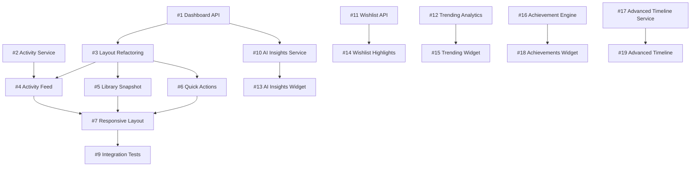

# Dashboard Hub - All Issues Summary

**Total Issues**: 18 (Epic 1: 8 | Epic 2: 6 | Epic 3: 4)
**Total Story Points**: 42 SP
**Estimated Duration**: 6 sprints (12 weeks)

---

## Epic 1: Dashboard Hub Core (MVP) - 8 Issues, 21 SP

### Backend Issues (3 issues - 7 SP)

#### #TBD-001: Dashboard Aggregated API Endpoint
**SP**: 3 | **Priority**: P0 | **Sprint**: N+1
- Endpoint `GET /api/v1/dashboard` con dati aggregati
- Redis caching (TTL 5min), performance < 500ms
- Response include: user, stats, sessions, library, activity, chat
- **Full spec**: [EPIC1-ISSUE-001-dashboard-api.md](./EPIC1-ISSUE-001-dashboard-api.md)

#### #TBD-002: Activity Timeline Aggregation Service
**SP**: 2 | **Priority**: P0 | **Sprint**: N+1
- Aggrega eventi da Library, Sessions, Chat, Wishlist
- Ultimi 10 eventi cronologici (DESC)
- Event types: game_added, session_completed, chat_saved, wishlist_added
- Performance: < 200ms

#### #TBD-008: Cache Invalidation Strategy Implementation
**SP**: 2 | **Priority**: P1 | **Sprint**: N+2
- Invalidazione cache dashboard su user actions (game added, session completed)
- Redis pub/sub pattern per real-time updates (optional)
- Event-driven cache refresh vs TTL-only strategy

---

### Frontend Issues (4 issues - 11 SP)

#### #TBD-003: Dashboard Hub Layout Refactoring
**SP**: 3 | **Priority**: P0 | **Sprint**: N+1
- Refactoring da "recent games" a "multi-section hub"
- Integrazione TanStack Query (`useDashboardData`)
- 6 sezioni: Hero, Sessions, Library, Activity, Chat, QuickActions
- Loading/error states, responsive layout
- **Full spec**: [EPIC1-ISSUE-003-layout-refactoring.md](./EPIC1-ISSUE-003-layout-refactoring.md)

#### #TBD-004: Enhanced Activity Feed Timeline Component
**SP**: 3 | **Priority**: P0 | **Sprint**: N+2
- Timeline cronologica ultimi 10 eventi
- Icone distintive per tipo (📚, 🎲, 💬, ⭐)
- Timestamp relativo ("Oggi 15:00", "Ieri")
- Link cliccabili a entità (game/session/chat)
- Empty state con CTA

#### #TBD-005: Library Snapshot Component
**SP**: 2 | **Priority**: P0 | **Sprint**: N+2
- Quota progress bar (127/200 = 64%) con colori dinamici
- Top 3 giochi: cover + title + rating + playCount
- CTA "Vedi Collezione Completa" → `/library`
- Empty state con CTA "Aggiungi primo gioco"

#### #TBD-006: Quick Actions Grid Enhancement
**SP**: 2 | **Priority**: P1 | **Sprint**: N+2
- 5 azioni: Collezione, Nuova Sessione, Chat AI, Catalogo, Impostazioni
- Icon + label (Lucide icons)
- Grid responsive: 2-col mobile, 5-col desktop
- Analytics tracking (click events)

#### #TBD-007: Responsive Layout Mobile/Desktop
**SP**: 3 | **Priority**: P0 | **Sprint**: N+2
- Breakpoint optimization (mobile-first)
- Collapsible sections mobile (accordion pattern)
- Touch-friendly targets (44x44px min)
- Lazy loading below-fold sections

---

### Testing Issues (1 issue - 3 SP)

#### #TBD-009: Dashboard Hub Integration & E2E Tests
**SP**: 3 | **Priority**: P0 | **Sprint**: N+3
- Unit tests: All components > 85% coverage
- Integration: Dashboard data flow (API → components)
- E2E: 5 critical flows (Playwright)
- Visual regression: Chromatic snapshots
- Accessibility: WCAG AA compliance (axe-core)

**E2E Flows**:
1. Login → Dashboard → Click "Collezione" → Library page
2. Click active session → Session detail page
3. Click activity event → Navigate to entity
4. Use quick action → Navigate to page
5. Mobile responsive behavior

---

## Epic 2: AI Insights & Recommendations - 6 Issues, 13 SP

### Backend Issues (3 issues - 7 SP)

#### #TBD-010: AI Insights Service (RAG Integration)
**SP**: 3 | **Priority**: P1 | **Sprint**: N+3
- Endpoint `GET /api/v1/dashboard/insights`
- Insights: Backlog alert, Rules reminder, Similar games (RAG), Streak nudge
- RAG integration: Qdrant embeddings per recommendations
- Performance < 1s, graceful degradation

#### #TBD-011: Wishlist Management API (CRUD)
**SP**: 2 | **Priority**: P1 | **Sprint**: N+3
- `GET /POST /PUT /DELETE /api/v1/wishlist`
- `GET /api/v1/wishlist/highlights` (top 5 per dashboard)
- Database schema: WishlistItems (UserId, GameId, Priority, Notes)
- Validation: No duplicate, no già-posseduti

#### #TBD-012: Catalog Trending Analytics Service
**SP**: 2 | **Priority**: P1 | **Sprint**: N+4
- Background job (daily cron): Calcola trending score
- Metriche: LibraryAdds, WishlistAdds, Searches, Views
- Endpoint `GET /api/v1/catalog/trending?period=week`
- Redis cache TTL 24h, response include % change

---

### Frontend Issues (3 issues - 6 SP)

#### #TBD-013: AI Insights Widget Component
**SP**: 2 | **Priority**: P1 | **Sprint**: N+3
- Widget con sfondo amber/yellow highlight
- Visualizza max 5 insights ordinati per priority
- Icone tipo: 🎯 backlog, 📖 rules, 🆕 recommendation, 🔥 streak
- Click → navigate to actionUrl
- Empty/loading/error states

#### #TBD-014: Wishlist Highlights Component
**SP**: 2 | **Priority**: P1 | **Sprint**: N+4
- Top 5 wishlist: Title + priority stars (⭐⭐⭐⭐⭐)
- Click → `/games/{id}` detail
- CTA "Gestisci Wishlist" → `/wishlist`
- Empty state con CTA "Esplora Catalogo"

#### #TBD-015: Catalog Trending Widget
**SP**: 2 | **Priority**: P1 | **Sprint**: N+4
- Top 3-5 trending: Nome + % change (es. "+15% 🔥")
- Colori: Verde (↑), Rosso (↓), Grigio (→)
- Click → `/games/{id}`
- CTA "Vedi Catalogo" → `/games/catalog`
- Last updated timestamp

---

## Epic 3: Gamification & Advanced Features - 4 Issues, 8 SP

### Backend Issues (2 issues - 4 SP)

#### #TBD-016: Achievement System & Badge Engine
**SP**: 3 | **Priority**: P2 | **Sprint**: N+5
- Achievement engine con rule evaluation (event-driven + cron)
- Endpoint `GET /api/v1/achievements` (locked/unlocked)
- Badge categories: Collezione, Gioco, Chat, Streak, Milestone
- Database: Achievements table + UserAchievements junction
- Background job: Daily evaluation per tutti gli utenti
- Notification system integration

**Achievement Examples**:
- 🔥 "Giocatore Costante" - 7 giorni streak
- 📚 "Collezionista" - 100+ giochi
- 🤖 "Esperto AI" - 50+ chat
- 🏆 "Veterano" - 1 anno di utilizzo
- 🎯 "Completista" - Tutti i giochi nella wishlist giocati

#### #TBD-017: Advanced Activity Timeline Query Service
**SP**: 1 | **Priority**: P2 | **Sprint**: N+5
- Endpoint `GET /api/v1/activity/timeline` con filtri avanzati
- Query params: `type`, `search`, `dateFrom`, `dateTo`, pagination
- Performance < 500ms con filtri attivi
- Database indexes su: UserId, EventType, Timestamp

---

### Frontend Issues (2 issues - 4 SP)

#### #TBD-018: Achievements Widget Component
**SP**: 2 | **Priority**: P2 | **Sprint**: N+6
- Ultimi 3 achievements: icon + title + description + unlock date
- Badge rarity colors: common (gray), rare (blue), epic (purple), legendary (gold)
- Animation unlock: Confetti + scale pulse (Framer Motion)
- CTA "Vedi Tutti i Badge" → `/achievements`
- Empty state con progress verso prossimo achievement

#### #TBD-019: Advanced Activity Timeline with Filters
**SP**: 2 | **Priority**: P2 | **Sprint**: N+6
- Filter bar: Event type checkboxes
- Search input: Full-text (debounced 300ms)
- Date range picker (optional)
- Pagination: "Carica altri" button
- Active filter badges con count
- Reset filters button

---

## 📊 Issue Priority Matrix

### Critical Path (Blocking)
```
Sprint N+1:
#TBD-001 (API) → #TBD-003 (Layout)
#TBD-002 (Activity Service)

Sprint N+2:
#TBD-003 → #TBD-004, #TBD-005, #TBD-006 (Parallel)
         → #TBD-007 (Responsive)

Sprint N+3:
#TBD-007 → #TBD-009 (Testing)
#TBD-010 (AI Insights) → #TBD-013 (Widget)
```

### Parallel Workstreams
```
Backend Track:
Sprint N+1: #TBD-001, #TBD-002
Sprint N+3: #TBD-010, #TBD-011, #TBD-012
Sprint N+5: #TBD-016, #TBD-017

Frontend Track:
Sprint N+1: #TBD-003
Sprint N+2: #TBD-004, #TBD-005, #TBD-006, #TBD-007
Sprint N+3: #TBD-009, #TBD-013
Sprint N+4: #TBD-014, #TBD-015
Sprint N+6: #TBD-018, #TBD-019
```

---

## 🎯 Sprint Allocation

| Sprint | Backend Issues | Frontend Issues | SP Total |
|--------|----------------|-----------------|----------|
| **N+1** | #1, #2 | #3 | 8 SP |
| **N+2** | #8 | #4, #5, #6, #7 | 12 SP |
| **N+3** | #10 | #9, #13 | 7 SP |
| **N+4** | #11, #12 | #14, #15 | 6 SP |
| **N+5** | #16, #17 | - | 4 SP |
| **N+6** | - | #18, #19 | 4 SP |

**Total**: 41 SP across 6 sprints (12 weeks)

---

## 📋 Issue Templates

### Backend Issue Template
```markdown
# Issue #{ID}: {Title}

**Epic**: {EPIC-ID}
**Type**: Backend - {Feature|Bug|Refactor}
**Priority**: {P0|P1|P2}
**Story Points**: {1-5}
**Sprint**: {N+X}

## Description
{What needs to be built and why}

## Acceptance Criteria
- [ ] Functional requirement 1
- [ ] Performance requirement
- [ ] Documentation requirement

## Technical Implementation
{Code examples, architecture decisions}

## Testing Requirements
{Unit/Integration/Performance tests}

## Definition of Done
{Checklist}
```

### Frontend Issue Template
```markdown
# Issue #{ID}: {Title}

**Epic**: {EPIC-ID}
**Type**: Frontend - {Component|Feature|Refactor}
**Priority**: {P0|P1|P2}
**Story Points**: {1-5}
**Sprint**: {N+X}

## Description
{What component/feature to build}

## Acceptance Criteria
- [ ] Visual requirement
- [ ] Interaction requirement
- [ ] Accessibility requirement
- [ ] Responsive requirement

## Component API
{TypeScript interface}

## Design Specs
{Tailwind classes, colors, animations}

## Testing Requirements
{Unit/Integration/Visual/E2E}

## Definition of Done
{Checklist}
```

---

## 🔗 Issue Dependencies Graph



---

## 📦 Detailed Issue Files

### Epic 1 Issues (Detailed)
- ✅ [#TBD-001: Dashboard Aggregated API](./EPIC1-ISSUE-001-dashboard-api.md)
- ✅ [#TBD-003: Layout Refactoring](./EPIC1-ISSUE-003-layout-refactoring.md)
- 🔄 #TBD-002: Activity Service (create separate file if needed)
- 🔄 #TBD-004: Activity Feed Component (create separate file if needed)
- 🔄 #TBD-005: Library Snapshot Component (create separate file if needed)
- 🔄 #TBD-006: Quick Actions Enhancement (create separate file if needed)
- 🔄 #TBD-007: Responsive Layout (create separate file if needed)
- 🔄 #TBD-008: Cache Invalidation (create separate file if needed)
- 🔄 #TBD-009: Integration Tests (create separate file if needed)

### Epic 2 Issues (Summary)
- 🔄 #TBD-010: AI Insights Service
- 🔄 #TBD-011: Wishlist API
- 🔄 #TBD-012: Trending Analytics
- 🔄 #TBD-013: AI Insights Widget
- 🔄 #TBD-014: Wishlist Highlights
- 🔄 #TBD-015: Trending Widget

### Epic 3 Issues (Summary)
- 🔄 #TBD-016: Achievement System
- 🔄 #TBD-017: Advanced Timeline Service
- 🔄 #TBD-018: Achievements Widget
- 🔄 #TBD-019: Advanced Timeline Filters

---

## 🚀 Quick Start Guide for Developers

### Backend Developer Starting Epic 1
```bash
# 1. Create feature branch
git checkout main-dev && git pull
git checkout -b feature/issue-TBD-001-dashboard-api

# 2. Read requirements
cat docs/04-frontend/epics/issues/EPIC1-ISSUE-001-dashboard-api.md

# 3. Implement query handler
cd apps/api/src/Api/BoundedContexts/Administration/Application/Queries
# Create GetDashboardDataQuery.cs + Handler + Validator

# 4. Test
dotnet test --filter "DashboardData"

# 5. Commit & PR
git add . && git commit -m "feat(dashboard): add aggregated API endpoint"
git push -u origin feature/issue-TBD-001-dashboard-api
# Create PR with Epic label
```

### Frontend Developer Starting Epic 1
```bash
# 1. Create feature branch
git checkout main-dev && git pull
git checkout -b feature/issue-TBD-003-dashboard-layout

# 2. Read requirements
cat docs/04-frontend/epics/issues/EPIC1-ISSUE-003-layout-refactoring.md

# 3. Implement component
cd apps/web/src/app/(public)/dashboard
# Create dashboard-hub.tsx, hooks/useDashboardData.ts

# 4. Test locally
pnpm dev
# Navigate to http://localhost:3000/dashboard

# 5. Run tests
pnpm test dashboard
pnpm typecheck && pnpm lint

# 6. Commit & PR
git add . && git commit -m "feat(dashboard): refactor to hub layout"
git push -u origin feature/issue-TBD-003-dashboard-layout
```

---

## 📝 Issue Creation Checklist

Quando crei le issue su GitHub:
- [ ] Titolo chiaro e descrittivo
- [ ] Label appropriate: `epic:dashboard-hub`, `type:backend|frontend`, `priority:P0|P1|P2`
- [ ] Milestone: Sprint N+X
- [ ] Story points: Aggiungi estimate (Fibonacci: 1, 2, 3, 5, 8)
- [ ] Assignee: Backend Team o Frontend Team
- [ ] Epic link: Menziona epic parent nel description
- [ ] Dependencies: Link issue bloccanti nel description
- [ ] Acceptance criteria: Copia da markdown file
- [ ] Definition of done: Checklist chiara

**GitHub Issue Template**:
```markdown
## Epic
Part of [EPIC-DH-001: Dashboard Hub Core](#epic-link)

## Description
{Paste from markdown file}

## Acceptance Criteria
{Paste checklist}

## Technical Notes
{Paste implementation details}

## Dependencies
- Blocks: #{issue-id}
- Requires: #{issue-id}

## Definition of Done
{Paste checklist}
```

---

## 🎯 Success Tracking

### Epic 1 Completion
- [ ] 8/8 issues closed
- [ ] All PRs merged to `main-dev`
- [ ] Dashboard hub deployed to staging
- [ ] Performance benchmarks met
- [ ] User testing completed

### Epic 2 Completion
- [ ] 6/6 issues closed
- [ ] AI insights live con engagement > 30%
- [ ] Wishlist functional
- [ ] Trending analytics running

### Epic 3 Completion
- [ ] 4/4 issues closed
- [ ] Achievement system operational
- [ ] Gamification metrics improving
- [ ] Advanced features adopted

---

## 📚 Additional Resources

- [Epic 1: Dashboard Hub Core](../epic-dashboard-hub-core.md)
- [Epic 2: AI Insights](../epic-ai-insights-recommendations.md)
- [Epic 3: Gamification](../epic-gamification-advanced-features.md)
- [Implementation Plan Master](../../dashboard-hub-implementation-plan.md)
- [Dashboard Hub Spec](../../dashboard-overview-hub.md)
- [Collection Dashboard (Opzione A)](../../dashboard-collection-centric-option-a.md)

---

**Created**: 2026-01-21
**Last Updated**: 2026-01-21
**Maintained By**: Engineering Team
