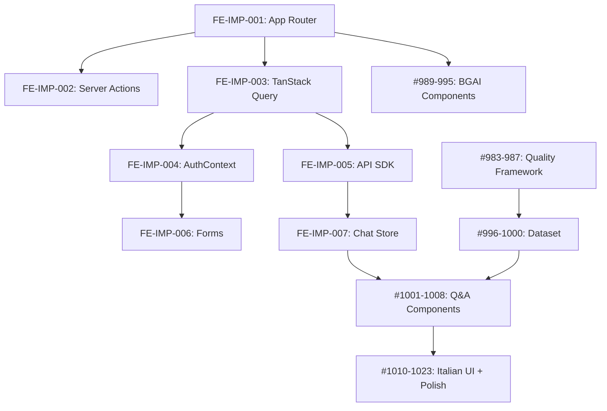

# Frontend + BGAI Implementation Roadmap
**Created**: 2025-11-13
**Status**: 🟢 Ready for execution
**Strategy**: Parallel worktrees + Periodic merge checkpoints

---

## 📋 Executive Summary

Questa roadmap integra:
- **8 issue FE-IMP** (modernizzazione frontend): App Router, TanStack Query, Zustand, Server Actions
- **69 issue BGAI** (Month 1-6): PDF processing → LLM → Validation → Quality → Dataset → UI italiana
- **39 issue Admin Console** (884-922): Dashboard, Infrastructure, Management, Reports
- **6 Frontend Epics** (926-936): Foundation, React 19, App Router, Advanced, Polish, Performance

**Strategia chiave**: Lavoro parallelo con worktree + merge periodici per test manuali integrati.

---

## 🎯 Obiettivi della Strategia

### 1. **Massimizzare il Parallelismo**
- Frontend e Backend lavorano simultaneamente su worktree separati
- Le issue FE-IMP forniscono l'infrastruttura per le BGAI frontend

### 2. **Minimizzare i Conflitti**
- Merge checkpoint strategici quando frontend + backend devono integrarsi
- Test manuali E2E dopo ogni merge checkpoint

### 3. **Mantenere la Qualità**
- Coverage 90%+ mantenuto
- Test automatici + manuali ad ogni checkpoint
- Review architetturale ai gate principali

---

## 🧬 Analisi Dipendenze Tecniche

### Frontend: Stato Attuale
```
✅ Next.js 16.0.1 installato
✅ React 19.2.0 installato
✅ react-hook-form + zod installati
✅ Shadcn/UI + Radix components
✅ next-themes (ThemeProvider)
✅ ErrorBoundary + Toaster
❌ App Router (solo Pages Router)
❌ TanStack Query (no data layer)
❌ Zustand (ChatProvider usa Context API monolitico)
❌ Server Actions
❌ Edge Middleware
```

### Backend: Stato Attuale
```
✅ DDD/CQRS 99% completo (7 bounded contexts)
✅ 72+ MediatR handlers operativi
✅ EF Core 9 + PostgreSQL
✅ RAG pipeline con hybrid search
✅ Auth (Cookie + API Key + OAuth + 2FA)
✅ PDF processing (3-stage fallback)
❌ BGAI-specific endpoints (Month 5-6)
❌ Streaming SSE per chat
❌ Quality metrics framework (Month 4)
```

### Mappa Dipendenze Critiche



---

## 📅 Sequenza di Implementazione

### **FASE 0: Setup Worktree** (1 giorno)
**Obiettivo**: Preparare ambiente di sviluppo parallelo

#### Azioni
```bash
# 1. Creare worktree frontend
git worktree add ../meepleai-frontend-worktree claude/frontend-modernization

# 2. Creare worktree backend
git worktree add ../meepleai-backend-worktree claude/backend-bgai-months-4-6

# 3. Main worktree per Admin Console
# Resta su: claude/analyze-frontend-issues-011CV5re59xZsma3sqrD1BMo
```

#### Output
- ✅ 3 worktree attivi e indipendenti
- ✅ Ciascuno può committare separatamente
- ✅ Merge controllati tramite checkpoint

---

### **FASE 1: Foundation Parallela** (Settimane 1-2)

#### 🎨 Frontend Worktree (FE-IMP-001 → FE-IMP-003)
**Branch**: `claude/frontend-modernization`

| Issue | Titolo | Giorni | Output |
|-------|--------|--------|--------|
| FE-IMP-001 | App Router Bootstrap | 2 | `app/layout.tsx`, `app/page.tsx`, `app/chat/page.tsx` |
| FE-IMP-002 | Server Actions (auth) | 2 | `app/actions/auth.ts`, login/register/logout actions |
| FE-IMP-003 | TanStack Query | 2 | `QueryClientProvider`, hook `useCurrentUser/Games/Chats` |

**Commit Strategy**: 1 commit per issue, push incrementale

#### 🔧 Backend Worktree (BGAI #983-987: Quality Framework)
**Branch**: `claude/backend-bgai-months-4-6`

| Issue | Titolo | Giorni | Output |
|-------|--------|--------|--------|
| #983 | 5-metric framework | 2 | `PromptEvaluationService` esteso |
| #985 | Prometheus metrics | 1 | Metriche BGAI-specific |
| #986 | Grafana dashboard | 1 | Dashboard JSON + docs |
| #987 | Integration tests | 1 | Tests quality framework |

**Commit Strategy**: 1 commit per issue, test passano localmente

#### 🏠 Main Worktree (Admin Console #884-889: Dashboard)
**Branch**: `claude/analyze-frontend-issues-011CV5re59xZsma3sqrD1BMo`

| Issue | Titolo | Giorni | Output |
|-------|--------|--------|--------|
| #884 | ActivityFeed component | 1 | Frontend component |
| #885 | Dashboard page | 1 | `/pages/admin/index.tsx` |
| #886 | API integration + polling | 1 | API calls every 30s |
| #887-889 | Testing | 2 | Jest 90%+ + E2E + Performance |

---

### **CHECKPOINT 1: Merge + Test Integration** (Fine Settimana 2)

#### Azioni Merge
```bash
# 1. Merge frontend → main
cd /home/user/meepleai-monorepo
git merge claude/frontend-modernization --no-ff -m "Merge FE-IMP-001-003: App Router + TanStack Query"

# 2. Test automatici
pnpm test && pnpm build

# 3. Merge backend → main
git merge claude/backend-bgai-months-4-6 --no-ff -m "Merge BGAI #983-987: Quality Framework"

# 4. Test full stack
cd apps/api/src/Api && dotnet test
cd apps/web && pnpm test

# 5. Test manuali E2E
```

#### Test Manuali Checkpoint 1
```markdown
## Scenario 1: App Router + Dashboard
- [ ] Visitare `/` → App Router serve la home
- [ ] Visitare `/chat` → App Router serve chat (wrapper)
- [ ] Visitare `/admin` → Dashboard mostra ActivityFeed
- [ ] ActivityFeed polling ogni 30s funziona
- [ ] Nessun errore console

## Scenario 2: TanStack Query + Auth
- [ ] Login → useCurrentUser fetchdata correttamente
- [ ] Logout → Query cache invalidata
- [ ] Navigazione tra pagine → No fetch duplicati
- [ ] DevTools React Query mostra stato cache

## Scenario 3: Quality Metrics
- [ ] Visitare Grafana → Dashboard BGAI visibile
- [ ] Metriche Prometheus scrapabili
- [ ] PromptEvaluationService test passano
```

#### Gate Decision
- ✅ **GO**: Tutti test passano + coverage 90%+ → Procedi FASE 2
- ❌ **NO-GO**: Fix issues prima di continuare

---

### **FASE 2: Data Layer + BGAI Components** (Settimane 3-4)

#### 🎨 Frontend Worktree (FE-IMP-004 → FE-IMP-006)
**Branch**: `claude/frontend-modernization` (rebase su main dopo CP1)

| Issue | Titolo | Giorni | Output |
|-------|--------|--------|--------|
| FE-IMP-004 | AuthContext + Middleware | 2 | `AuthProvider`, `middleware.ts` per Edge |
| FE-IMP-005 | API SDK modulare | 2 | `@/lib/clients/{auth,chat,upload}Client.ts` + Zod |
| FE-IMP-006 | Form System (RHF) | 2 | `forms/Form`, schema Zod per login/register |

#### 🔧 Backend Worktree (BGAI #996-1000: Dataset + #1001-1006: API)
**Branch**: `claude/backend-bgai-months-4-6` (rebase su main dopo CP1)

| Issue | Titolo | Giorni | Output |
|-------|--------|--------|--------|
| #996-998 | Annotazioni (50 Q&A) | 3 | Dataset Terraforming Mars, Wingspan, Azul |
| #999-1000 | Accuracy baseline | 1 | Test accuracy ≥75% su 50 Q&A |
| #1006 | Backend API `/board-game-ai/ask` | 2 | Endpoint CQRS + handler |

#### 🏠 Main Worktree (Admin Console #890-902: Infrastructure)

| Issue | Titolo | Giorni | Output |
|-------|--------|--------|--------|
| #891-895 | Backend monitoring | 3 | `InfrastructureMonitoringService` + endpoints + tests |
| #896-902 | Frontend + E2E | 3 | Components + `/admin/infrastructure.tsx` + tests |

---

### **CHECKPOINT 2: Merge + Test BGAI API** (Fine Settimana 4)

#### Azioni Merge
```bash
# Merge in ordine: backend → frontend → main
git merge claude/backend-bgai-months-4-6 --no-ff
git merge claude/frontend-modernization --no-ff
pnpm test && dotnet test && pnpm build
```

#### Test Manuali Checkpoint 2
```markdown
## Scenario 1: BGAI API Integration
- [ ] POST `/api/v1/board-game-ai/ask` con domanda Terraforming Mars
- [ ] Risposta contiene: answer, confidence ≥0.70, citations
- [ ] Accuracy test su 50 Q&A mostra ≥75%
- [ ] Prometheus metrics aggiornate dopo query

## Scenario 2: Auth + Middleware
- [ ] Utente anonimo → `/chat` → redirect a `/login` (server-side)
- [ ] Login con form RHF → Submit → Auth tramite Server Action
- [ ] Errori validazione mostrati inline
- [ ] AuthContext fornisce user correttamente

## Scenario 3: Admin Infrastructure
- [ ] `/admin/infrastructure` mostra ServiceHealthMatrix
- [ ] Metriche real-time (PG, Redis, Qdrant)
- [ ] Grafana iframe embed funziona
```

#### Gate Decision
- ✅ **GO**: API funzionante + Auth solido → Procedi FASE 3
- ❌ **NO-GO**: Fix API o Auth

---

### **FASE 3: Chat Store + Q&A Components** (Settimane 5-6)

#### 🎨 Frontend Worktree (FE-IMP-007 + BGAI #1001-1008)
**Branch**: `claude/frontend-modernization` (rebase su main dopo CP2)

| Issue | Titolo | Giorni | Output |
|-------|--------|--------|--------|
| FE-IMP-007 | Chat Store Zustand | 3 | Store modulare, slice `session/game/chat/messages` |
| #1001 | QuestionInputForm | 1 | Component + RHF + Zod |
| #1002 | ResponseCard | 1 | Component con citations + confidence |
| #1003 | GameSelector | 1 | Dropdown con games |
| #1004-1005 | UI/UX + Tests | 2 | Loading/error states + Jest 20 tests |
| #1007 | Streaming SSE hook | 2 | `useChatStream(chatId)` con EventSource |
| #1008 | Error handling | 1 | Retry logic + error boundaries |

#### 🔧 Backend Worktree (BGAI #1007: SSE backend)
**Branch**: `claude/backend-bgai-months-4-6` (rebase su main dopo CP2)

| Issue | Titolo | Giorni | Output |
|-------|--------|--------|--------|
| #1007 (BE) | Streaming SSE endpoint | 2 | `/board-game-ai/ask/stream` + SSE response |

#### 🏠 Main Worktree (Admin Console #903-914: Management)

| Issue | Titolo | Giorni | Output |
|-------|--------|--------|--------|
| #904-907 | Backend services | 3 | ApiKeyManagement, UserManagement, CSV import/export |
| #908-914 | Frontend + Tests | 4 | UI components + E2E + security audit |

---

### **CHECKPOINT 3: Merge + Test Q&A Flow** (Fine Settimana 6)

#### Azioni Merge
```bash
git merge claude/backend-bgai-months-4-6 --no-ff
git merge claude/frontend-modernization --no-ff
pnpm test && dotnet test && pnpm build && pnpm test:e2e
```

#### Test Manuali Checkpoint 3
```markdown
## Scenario 1: Q&A Interface End-to-End
- [ ] Selezionare game "Terraforming Mars" da GameSelector
- [ ] Digitare domanda in QuestionInputForm
- [ ] Submit → Streaming SSE mostra risposta token-by-token
- [ ] ResponseCard mostra: answer completo, confidence, citations
- [ ] Click su citation → (placeholder, implementato in Month 6)

## Scenario 2: Chat Store Performance
- [ ] Aprire React DevTools Profiler
- [ ] Inviare 5 messaggi consecutivi
- [ ] Verificare: solo componenti interessati re-render
- [ ] Store mantiene history per undo

## Scenario 3: Admin Management
- [ ] `/admin/api-keys` → Creare nuova API key con scopes
- [ ] Bulk action: selezionare 10 utenti → export CSV
- [ ] Stress test: 1000+ users caricati → UI responsive
```

#### Gate Decision
- ✅ **GO**: Q&A flow funzionante + SSE → Procedi FASE 4
- ❌ **NO-GO**: Fix streaming o store

---

### **FASE 4: Upload Queue + Italian UI** (Settimane 7-8)

#### 🎨 Frontend Worktree (FE-IMP-008 + BGAI #1010-1017)
**Branch**: `claude/frontend-modernization` (rebase su main dopo CP3)

| Issue | Titolo | Giorni | Output |
|-------|--------|--------|--------|
| FE-IMP-008 | Upload Queue Worker | 3 | Web Worker, BroadcastChannel, `useSyncExternalStore` |
| #1010-1011 | Annotazioni 60 Q&A | 2 | Dataset 6 giochi (Scythe, Catan, Pandemic, 7 Wonders, Agricola, Splendor) |
| #1013 | PDF viewer integration | 2 | `react-pdf` component |
| #1014 | Citation → jump to page | 1 | Click handler + scroll to page |
| #1015 | PDF viewer tests | 1 | Jest + Playwright |
| #1016 | Italian UI (200+ strings) | 2 | `it.json` completo |
| #1017 | Game catalog page | 1 | `/board-game-ai/games` |

#### 🔧 Backend Worktree (BGAI #1012: Adversarial dataset)
**Branch**: `claude/backend-bgai-months-4-6` (rebase su main dopo CP3)

| Issue | Titolo | Giorni | Output |
|-------|--------|--------|--------|
| #1012 | Adversarial dataset | 2 | 50 synthetic queries (ambigui, contraddittori) |

#### 🏠 Main Worktree (Admin Console #915-922: Advanced)

| Issue | Titolo | Giorni | Output |
|-------|--------|--------|--------|
| #916-919 | Backend reporting | 3 | ReportingService + templates + email |
| #920-922 | Frontend + Tests | 2 | Report builder UI + E2E |

---

### **CHECKPOINT 4: Merge + Test Italian UI + PDF** (Fine Settimana 8)

#### Azioni Merge
```bash
git merge claude/backend-bgai-months-4-6 --no-ff
git merge claude/frontend-modernization --no-ff
pnpm test && dotnet test && pnpm build && pnpm test:e2e
```

#### Test Manuali Checkpoint 4
```markdown
## Scenario 1: Upload Queue Off-Main-Thread
- [ ] Drag & drop 10 PDF simultanei
- [ ] Verificare: UI resta responsive (FPS > 50)
- [ ] Progress indicators aggiornati real-time
- [ ] Refresh browser → Queue recupera stato

## Scenario 2: PDF Viewer + Citations
- [ ] Fare domanda su Terraforming Mars
- [ ] Risposta mostra citations con page number
- [ ] Click su citation → PDF viewer apre a quella pagina
- [ ] PDF viewer supporta zoom, navigation

## Scenario 3: Italian UI Complete
- [ ] Cambiare lingua → Italiano
- [ ] Navigare: home, chat, admin, games, profile
- [ ] Verificare: tutti i testi tradotti (200+ strings)
- [ ] Nessun placeholder "translation_key"

## Scenario 4: Admin Reports
- [ ] `/admin/reports` → Builder UI
- [ ] Creare report "Monthly Activity"
- [ ] Schedule: ogni lunedì alle 9:00
- [ ] Email delivery test
```

#### Gate Decision
- ✅ **GO**: PDF + Italian + Reports → Procedi FASE 5 (Polish)
- ❌ **NO-GO**: Fix upload queue o PDF viewer

---

### **FASE 5: Final Polish + Validation** (Settimane 9-10)

#### 🎨 Frontend Worktree (BGAI #1018 E2E + #992-995 Testing)
**Branch**: `claude/frontend-modernization` (rebase su main dopo CP4)

| Issue | Titolo | Giorni | Output |
|-------|--------|--------|--------|
| #1018 | E2E testing | 2 | Playwright: question → PDF citation flow |
| #992 | Component testing | 1 | Jest 90%+ per tutti BGAI components |
| #993 | Responsive design | 1 | Test 320px-1920px |
| #994 | Build optimization | 1 | Bundle size, tree-shaking, code splitting |

#### 🔧 Backend Worktree (BGAI #1019-1023: Validation + Completion)
**Branch**: `claude/backend-bgai-months-4-6` (rebase su main dopo CP4)

| Issue | Titolo | Giorni | Output |
|-------|--------|--------|--------|
| #1019 | Accuracy validation | 2 | Test su 100 Q&A → target ≥80% |
| #1020 | Performance testing | 2 | P95 latency <3s |
| #1021 | Bug fixes | 2 | Fix da QA |
| #1022 | Documentation | 1 | User guide, README, API docs |
| #1023 | Completion checklist | 1 | Phase 1A sign-off |

#### 🏠 Main Worktree (Frontend Epics #926-936)

| Issue | Titolo | Giorni | Output |
|-------|--------|--------|--------|
| #926 | Foundation & Quick Wins | 2 | Epic completion review |
| #931 | React 19 Optimization | 1 | Use transitions, concurrent features |
| #932 | Advanced Features | 1 | Epic review |
| #933 | App Router Migration | 1 | Complete migration Pages → App |
| #934 | Design Polish | 1 | Visual consistency |
| #935 | Performance & A11y | 2 | Lighthouse 95+, WCAG AA |

---

### **CHECKPOINT FINAL: Merge + Production Readiness** (Fine Settimana 10)

#### Azioni Merge
```bash
# Final merge all branches
git merge claude/backend-bgai-months-4-6 --no-ff -m "Merge BGAI Month 4-6 Complete"
git merge claude/frontend-modernization --no-ff -m "Merge FE-IMP-001-008 + BGAI Frontend Complete"

# Full test suite
pnpm test:coverage && dotnet test && pnpm build && pnpm test:e2e

# Manual QA
pnpm dev  # Test all scenarios below
```

#### Test Manuali Finali
```markdown
## Scenario 1: User Journey Completo
- [ ] Utente anonimo → Landing page
- [ ] Click "Try Demo" → Login/Register modal (RHF + Server Action)
- [ ] Login → Redirect `/chat`
- [ ] Selezionare game "Terraforming Mars"
- [ ] Porre domanda: "Quanti punti vale una città su Marte?"
- [ ] Streaming SSE mostra risposta token-by-token
- [ ] ResponseCard mostra confidence 0.85, citation "Pag. 12"
- [ ] Click citation → PDF viewer apre a pagina 12
- [ ] Navigare a `/board-game-ai/games` → Game catalog
- [ ] Upload nuovo PDF → Upload queue worker processa
- [ ] Cambiare tema → Dark/Light/Auto
- [ ] Logout → Session cleared

## Scenario 2: Admin Console Completo
- [ ] Login come admin
- [ ] Dashboard: ActivityFeed aggiornato real-time
- [ ] Infrastructure: tutti servizi "healthy"
- [ ] API Keys: creare nuova key con scopes
- [ ] User Management: bulk export 1000+ users
- [ ] Reports: schedule report settimanale
- [ ] Alert: configurare soglia errori

## Scenario 3: Performance & Quality
- [ ] Lighthouse: Performance 90+, Accessibility 95+
- [ ] P95 latency BGAI API: <3s
- [ ] Accuracy su 100 Q&A: ≥80%
- [ ] Coverage: Frontend 90%+, Backend 90%+
- [ ] Bundle size: <500KB (main)
- [ ] FPS durante upload 10 PDF: >50

## Scenario 4: Adversarial Testing
- [ ] Domanda ambigua: "Quanti turni dura?" (senza specificare gioco)
- [ ] Domanda contraddittoria: "Si può giocare in 10 giocatori Azul?"
- [ ] Domanda off-topic: "Quanto costa Terraforming Mars?"
- [ ] Verificare: confidence bassa + disclaimer "non trovato nelle regole"
```

#### Gate Decision: Production Go-Live
- ✅ **GO**: Tutti test passano + metrics OK → Push to production
- ❌ **NO-GO**: Fix critical issues

---

## 🔀 Strategia Worktree Dettagliata

### Struttura Directory
```
/home/user/meepleai-monorepo/           # Main worktree (Admin Console)
├── .git/
├── apps/
├── docs/
└── ...

/home/user/meepleai-frontend-worktree/  # Frontend worktree (FE-IMP + BGAI frontend)
├── apps/web/
├── docs/
└── ...

/home/user/meepleai-backend-worktree/   # Backend worktree (BGAI backend Month 4-6)
├── apps/api/
├── docs/
└── ...
```

### Branch Strategy
```
main (protected)
├── claude/analyze-frontend-issues-011CV5re59xZsma3sqrD1BMo  # Main worktree
├── claude/frontend-modernization                            # Frontend worktree
└── claude/backend-bgai-months-4-6                           # Backend worktree
```

### Merge Protocol

#### Prima di Ogni Checkpoint
```bash
# 1. Backend: assicurare tests passano
cd /home/user/meepleai-backend-worktree
dotnet test
git push -u origin claude/backend-bgai-months-4-6

# 2. Frontend: assicurare tests passano
cd /home/user/meepleai-frontend-worktree
pnpm test && pnpm build
git push -u origin claude/frontend-modernization

# 3. Main: Pull + Merge
cd /home/user/meepleai-monorepo
git pull origin claude/analyze-frontend-issues-011CV5re59xZsma3sqrD1BMo
git merge claude/backend-bgai-months-4-6 --no-ff -m "CP#: Backend ..."
git merge claude/frontend-modernization --no-ff -m "CP#: Frontend ..."

# 4. Risoluzione conflitti (se presenti)
# Priorità: Backend > Frontend > Main

# 5. Test integrazione
pnpm test && dotnet test && pnpm build

# 6. Test manuali (vedi checkpoint specifico)

# 7. Push main
git push -u origin claude/analyze-frontend-issues-011CV5re59xZsma3sqrD1BMo

# 8. Rebase worktree su main aggiornato
cd /home/user/meepleai-backend-worktree
git fetch origin claude/analyze-frontend-issues-011CV5re59xZsma3sqrD1BMo
git rebase origin/claude/analyze-frontend-issues-011CV5re59xZsma3sqrD1BMo

cd /home/user/meepleai-frontend-worktree
git fetch origin claude/analyze-frontend-issues-011CV5re59xZsma3sqrD1BMo
git rebase origin/claude/analyze-frontend-issues-011CV5re59xZsma3sqrD1BMo
```

---

## 📊 Metriche di Successo

### Per Ogni Checkpoint

| Metrica | Target | Strumento |
|---------|--------|-----------|
| **Test Coverage** | ≥90% | Jest, xUnit |
| **Build Time** | <2min | `time pnpm build` |
| **Bundle Size** | <500KB main | `pnpm build` output |
| **Lighthouse Performance** | ≥90 | Chrome DevTools |
| **Lighthouse Accessibility** | ≥95 | Chrome DevTools |
| **API Latency P95** | <3s | Prometheus |
| **BGAI Accuracy** | ≥80% (finale) | Test suite |
| **Zero Build Errors** | 0 | CI/CD |

### Metriche Finali (Checkpoint Final)

| Categoria | Metrica | Target | Attuale |
|-----------|---------|--------|---------|
| **Frontend** | FE-IMP issues complete | 8/8 | TBD |
| | BGAI frontend issues complete | 15/15 | TBD |
| | Admin Console issues complete | 39/39 | TBD |
| | Test coverage | ≥90% | TBD |
| **Backend** | BGAI backend issues complete | 54/54 | TBD |
| | Quality framework operational | ✅ | TBD |
| | Dataset annotated | 100 Q&A | TBD |
| | Accuracy on golden set | ≥80% | TBD |
| **Integration** | E2E tests passing | 100% | TBD |
| | Manual QA scenarios | 10/10 | TBD |
| | Performance P95 | <3s | TBD |
| **Quality** | Critical bugs | 0 | TBD |
| | Security issues | 0 | TBD |
| | Documentation complete | ✅ | TBD |

---

## ⚠️ Risk Mitigation

### Rischi Identificati

#### 1. **Conflitti di Merge Complessi**
**Probabilità**: Media
**Impatto**: Alto
**Mitigazione**:
- Merge frequenti (ogni 2 settimane)
- Comunicazione tra team su file condivisi
- Backend merge sempre prima di frontend
- Review attento durante conflict resolution

#### 2. **Regressioni Non Rilevate**
**Probabilità**: Media
**Impatto**: Alto
**Mitigazione**:
- Test manuali estensivi ad ogni checkpoint
- Coverage enforcement (90%+)
- E2E testing automatizzato
- Smoke tests post-merge

#### 3. **Overload Cognitivo (3 Worktree)**
**Probabilità**: Alta
**Impatto**: Medio
**Mitigazione**:
- Documentazione chiara per ogni worktree
- Script di switch rapido tra worktree
- Commit message chiari con prefix (FE/BE/MAIN)
- Daily standup per coordinamento

#### 4. **Performance Degradation**
**Probabilità**: Bassa
**Impatto**: Alto
**Mitigazione**:
- Performance testing ad ogni checkpoint
- Profiling React DevTools ad ogni merge frontend
- Prometheus metrics sempre monitorate
- Lighthouse CI obbligatorio

#### 5. **Dataset Quality Issues**
**Probabilità**: Media
**Impatto**: Alto
**Mitigazione**:
- Peer review delle annotazioni (2+ revisori)
- Accuracy testing incrementale
- Adversarial dataset per edge cases
- Quality threshold enforcement (≥80%)

---

## 🛠️ Strumenti di Supporto

### Script Utili

#### `switch-worktree.sh`
```bash
#!/bin/bash
# Usage: ./switch-worktree.sh [main|frontend|backend]

case $1 in
  main)
    cd /home/user/meepleai-monorepo
    ;;
  frontend)
    cd /home/user/meepleai-frontend-worktree
    ;;
  backend)
    cd /home/user/meepleai-backend-worktree
    ;;
  *)
    echo "Usage: $0 [main|frontend|backend]"
    exit 1
    ;;
esac

git status
git log --oneline -5
```

#### `checkpoint-merge.sh`
```bash
#!/bin/bash
# Usage: ./checkpoint-merge.sh <checkpoint-number> "<description>"

CHECKPOINT=$1
DESC=$2

echo "=== CHECKPOINT $CHECKPOINT: $DESC ==="

# Ensure we're on main worktree
cd /home/user/meepleai-monorepo

# Pull latest from remote
git pull origin claude/analyze-frontend-issues-011CV5re59xZsma3sqrD1BMo

# Merge backend
echo "Merging backend..."
git merge claude/backend-bgai-months-4-6 --no-ff -m "CP$CHECKPOINT: Backend - $DESC"

# Merge frontend
echo "Merging frontend..."
git merge claude/frontend-modernization --no-ff -m "CP$CHECKPOINT: Frontend - $DESC"

# Run tests
echo "Running tests..."
cd apps/web && pnpm test
cd ../../apps/api/src/Api && dotnet test

# Build
echo "Building..."
cd /home/user/meepleai-monorepo/apps/web && pnpm build

echo "=== CHECKPOINT $CHECKPOINT MERGE COMPLETE ==="
echo "Now run manual tests as per checkpoint documentation"
```

---

## 📝 Comunicazione e Documentazione

### Issue Updates
Ogni issue deve essere aggiornata con:
- **Status tag** in commento: `[IN_PROGRESS]`, `[REVIEW]`, `[TESTING]`, `[COMPLETE]`
- **Worktree info**: Quale worktree ha lavorato
- **Checkpoint**: Quando è stata merged
- **Breaking changes**: Se presenti

### Commit Message Format
```
<type>(<scope>): <subject>

[optional body]

Issue: #<issue-number>
Worktree: [main|frontend|backend]
Checkpoint: [CP1|CP2|CP3|CP4|FINAL]
```

**Types**: `feat`, `fix`, `refactor`, `test`, `docs`, `chore`
**Scopes**: `fe-imp`, `bgai`, `admin`, `api`, `web`

### Checkpoint Reports
Dopo ogni checkpoint, creare report in `docs/checkpoints/`:
- `checkpoint-1-report.md`
- `checkpoint-2-report.md`
- ...
- `checkpoint-final-report.md`

**Template**:
```markdown
# Checkpoint <N> Report
**Date**: YYYY-MM-DD
**Duration**: X days
**Issues Completed**: N

## Summary
[Breve descrizione]

## Completed Issues
- [x] #123 - Issue title
- [x] #124 - Issue title

## Test Results
- Unit tests: PASS (coverage XX%)
- Integration tests: PASS
- E2E tests: PASS
- Manual tests: X/X scenarios passed

## Metrics
- Build time: Xmin
- Bundle size: XKB
- Lighthouse: XX/100

## Issues Found
- [ ] #XXX - Description
- [ ] #XXX - Description

## Next Checkpoint Focus
[Piano per prossimo checkpoint]
```

---

## 🎯 Priorità di Implementazione

### Must-Have (Blockers)
1. **FE-IMP-001** - App Router (foundation per tutto)
2. **FE-IMP-003** - TanStack Query (data layer critico)
3. **BGAI #983-987** - Quality Framework (metrics per validazione)
4. **BGAI #996-1000** - Dataset (necessario per testing)
5. **BGAI #1006** - Backend API endpoint (serve al frontend)

### Should-Have (High Value)
1. **FE-IMP-007** - Chat Store (performance improvement significativo)
2. **BGAI #1007** - Streaming SSE (UX migliorato drasticamente)
3. **FE-IMP-008** - Upload Queue Worker (UX critico per PDF)
4. **BGAI #1013-1014** - PDF Viewer (feature killer)
5. **Admin Console #884-889** - Dashboard (visibilità operativa)

### Nice-to-Have (Polish)
1. **FE-IMP-006** - Form System (consistency, non blocca)
2. **BGAI #1016** - Italian UI (importante ma non blocca launch)
3. **BGAI #1017** - Game catalog (discoverable ma non critico)
4. **Admin Console #915-922** - Advanced Reports (future value)
5. **Frontend Epics #934** - Design Polish (iterativo)

---

## ✅ Acceptance Criteria Globali

### Per Dichiarare "COMPLETE" la Roadmap

#### Funzionalità
- [ ] Utente può porre domanda su gioco da tavolo e ricevere risposta accurata (≥80%)
- [ ] Risposta include citations con link a PDF page
- [ ] UI completamente in Italiano (200+ strings)
- [ ] Upload PDF funziona senza bloccare UI
- [ ] Admin console operativa per monitoring e management
- [ ] Streaming SSE funziona per risposte real-time

#### Qualità
- [ ] Test coverage: Frontend ≥90%, Backend ≥90%
- [ ] Zero critical bugs
- [ ] Zero security issues (CodeQL, audit)
- [ ] Lighthouse: Performance ≥90, Accessibility ≥95
- [ ] P95 latency <3s su BGAI API
- [ ] Build passa senza warnings

#### Documentazione
- [ ] User guide completa
- [ ] API documentation aggiornata
- [ ] Architecture ADRs pubblicati
- [ ] Checkpoint reports per tutti i 5 checkpoint
- [ ] README aggiornato con nuove feature

#### Operatività
- [ ] Grafana dashboard BGAI operativo
- [ ] Prometheus metrics esportate
- [ ] Alerting configurato (email/Slack)
- [ ] Backup automation testata
- [ ] Disaster recovery plan documentato

---

## 📞 Supporto e Escalation

### Per Blocchi Tecnici
1. **Worktree conflicts**: Revisione collettiva, decidere priorità (backend > frontend)
2. **Test failures**: Fix immediato prima di merge checkpoint
3. **Performance issues**: Profiling + optimization immediata, può bloccare checkpoint

### Per Decisioni Architetturali
- **ADR Required**: Decisioni che impattano >1 worktree
- **Review Required**: Changes a DDD bounded contexts
- **Approval Required**: Breaking changes a API pubbliche

---

## 🚀 Comandi Rapidi

### Setup Iniziale
```bash
# Create worktrees
git worktree add ../meepleai-frontend-worktree claude/frontend-modernization
git worktree add ../meepleai-backend-worktree claude/backend-bgai-months-4-6

# Verify
git worktree list
```

### Lavoro Quotidiano
```bash
# Frontend dev
cd /home/user/meepleai-frontend-worktree
git pull origin claude/frontend-modernization
pnpm dev  # Porta 3000

# Backend dev
cd /home/user/meepleai-backend-worktree
git pull origin claude/backend-bgai-months-4-6
dotnet run --project apps/api/src/Api  # Porta 8080

# Admin Console dev
cd /home/user/meepleai-monorepo
git pull origin claude/analyze-frontend-issues-011CV5re59xZsma3sqrD1BMo
pnpm dev  # Porta 3000
```

### Pre-Checkpoint
```bash
# Run full test suite
cd /home/user/meepleai-monorepo
pnpm test:coverage
cd apps/api/src/Api && dotnet test
cd ../../../web && pnpm build
pnpm test:e2e
```

---

## 📅 Timeline Riassuntiva

| Fase | Settimane | Issues | Output Chiave |
|------|-----------|--------|---------------|
| **FASE 0** | 0 | Setup | 3 worktree attivi |
| **FASE 1** | 1-2 | FE-IMP-001-003 + BGAI #983-987 + Admin #884-889 | App Router + Quality Framework + Dashboard |
| **CP1** | Fine S2 | Merge + Test | Integration testing |
| **FASE 2** | 3-4 | FE-IMP-004-006 + BGAI #996-1006 + Admin #890-902 | Auth + Dataset + API |
| **CP2** | Fine S4 | Merge + Test | BGAI API funzionante |
| **FASE 3** | 5-6 | FE-IMP-007 + BGAI #1001-1008 + Admin #903-914 | Chat Store + Q&A UI |
| **CP3** | Fine S6 | Merge + Test | Q&A flow completo |
| **FASE 4** | 7-8 | FE-IMP-008 + BGAI #1010-1017 + Admin #915-922 | Upload + PDF + Italian |
| **CP4** | Fine S8 | Merge + Test | Feature-complete |
| **FASE 5** | 9-10 | BGAI #1018-1023 + Epics #926-936 | Polish + Validation |
| **CP FINAL** | Fine S10 | Merge + Production | Go-Live Decision |

**Totale**: **10 settimane** (2.5 mesi)

---

## 🎓 Lessons Learned (Da Aggiornare Post-Mortem)

### Cosa ha Funzionato Bene
- TBD dopo execution

### Cosa Migliorare
- TBD dopo execution

### Metriche Finali
- TBD dopo execution

---

**Version**: 1.0
**Last Updated**: 2025-11-13
**Owner**: Engineering Team
**Status**: 🟢 Ready for Execution
