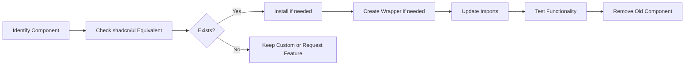

# Shadcn/UI Installation Guide

**Issue**: #927 (FRONTEND-2)
**Status**: ✅ Complete (Pre-existing)
**Date**: 2025-11-12 (Verified & Documented)
**Original Installation**: Unknown (Before Issue #927)

## Overview

This document describes the installation and configuration of [shadcn/ui](https://ui.shadcn.com/) component library in the MeepleAI Next.js web application.

## What is Shadcn/UI?

Shadcn/ui is a collection of re-usable, accessible components built with:
- **Radix UI**: Unstyled, accessible component primitives
- **Tailwind CSS**: Utility-first CSS framework
- **class-variance-authority**: Type-safe variants
- **TypeScript**: Full type safety

Unlike traditional component libraries, shadcn/ui components are copied directly into your project, giving you full ownership and customization control.

## Installation Summary

### Components Installed

**16 components installed** in `apps/web/src/components/ui/` (160% of Issue #927 requirement):

#### Required Components (10)
1. ✅ **button** - Multiple variants and sizes
2. ✅ **card** - Structured content containers with all subcomponents
3. ✅ **input** - Text input fields with full styling
4. ✅ **dialog** - Modal dialogs with Radix UI primitives
5. ✅ **dropdown-menu** - Context menus and dropdowns
6. ✅ **select** - Dropdown selection components
7. ✅ **table** - Data tables with caption, header, body
8. ✅ **avatar** - User avatars with image and fallback
9. ✅ **badge** - Status indicators and labels
10. ✅ **sonner** - Toast notifications (modern alternative to toast)

#### Bonus Components (6)
11. ✅ **progress** - Progress bars and indicators
12. ✅ **skeleton** - Loading placeholders
13. ✅ **switch** - Toggle switches
14. ✅ **textarea** - Multi-line text input
15. ✅ **toggle** - Toggle buttons with pressed states
16. ✅ **toggle-group** - Grouped toggle buttons

### Dependencies Added

| Package | Version | Purpose |
|---------|---------|---------|
| `class-variance-authority` | Latest | Type-safe component variants |
| `clsx` | Latest | Conditional className utility |
| `tailwind-merge` | Latest | Merge Tailwind classes without conflicts |
| `lucide-react` | Latest | Icon library (Radix UI dependency) |
| `@radix-ui/react-*` | Latest | Accessible component primitives |

### Configuration Files

1. **components.json** - Shadcn/UI configuration
   ```json
   {
     "style": "new-york",
     "rsc": false,
     "tsx": true,
     "tailwind": {
       "config": "tailwind.config.js",
       "css": "src/styles/globals.css",
       "baseColor": "neutral",
       "cssVariables": true
     }
   }
   ```

2. **src/lib/utils.ts** - Utility function for className merging
   ```typescript
   import { clsx, type ClassValue } from "clsx"
   import { twMerge } from "tailwind-merge"

   export function cn(...inputs: ClassValue[]) {
     return twMerge(clsx(inputs))
   }
   ```

3. **src/styles/globals.css** - CSS variables for theming
   - Added `@layer base` section with shadcn color variables
   - Light and dark mode support with OKLCH color space
   - Integrated with existing MeepleAI color palette

## Usage Examples

### Button Component

```tsx
import { Button } from '@/components/ui/button';

// Variants
<Button variant="default">Default</Button>
<Button variant="secondary">Secondary</Button>
<Button variant="destructive">Destructive</Button>
<Button variant="outline">Outline</Button>
<Button variant="ghost">Ghost</Button>
<Button variant="link">Link</Button>

// Sizes
<Button size="sm">Small</Button>
<Button size="default">Default</Button>
<Button size="lg">Large</Button>
<Button size="icon">🎲</Button>
```

### Card Component

```tsx
import {
  Card,
  CardHeader,
  CardTitle,
  CardDescription,
  CardContent,
  CardFooter
} from '@/components/ui/card';

<Card>
  <CardHeader>
    <CardTitle>Card Title</CardTitle>
    <CardDescription>Card description text</CardDescription>
  </CardHeader>
  <CardContent>
    <p>Main content goes here</p>
  </CardContent>
  <CardFooter>
    <Button>Action</Button>
  </CardFooter>
</Card>
```

### Input Component

```tsx
import { Input } from '@/components/ui/input';

const [value, setValue] = useState('');

<Input
  type="text"
  placeholder="Enter text..."
  value={value}
  onChange={(e) => setValue(e.target.value)}
/>
```

### Select Component

```tsx
import {
  Select,
  SelectTrigger,
  SelectValue,
  SelectContent,
  SelectItem
} from '@/components/ui/select';

<Select value={value} onValueChange={setValue}>
  <SelectTrigger>
    <SelectValue placeholder="Select option..." />
  </SelectTrigger>
  <SelectContent>
    <SelectItem value="option1">Option 1</SelectItem>
    <SelectItem value="option2">Option 2</SelectItem>
    <SelectItem value="option3">Option 3</SelectItem>
  </SelectContent>
</Select>
```

### Dialog Component

```tsx
import {
  Dialog,
  DialogTrigger,
  DialogContent,
  DialogHeader,
  DialogTitle,
  DialogDescription,
  DialogFooter
} from '@/components/ui/dialog';

<Dialog>
  <DialogTrigger asChild>
    <Button>Open Dialog</Button>
  </DialogTrigger>
  <DialogContent>
    <DialogHeader>
      <DialogTitle>Dialog Title</DialogTitle>
      <DialogDescription>
        Dialog description text
      </DialogDescription>
    </DialogHeader>
    <div className="py-4">
      {/* Dialog content */}
    </div>
    <DialogFooter>
      <Button variant="outline">Cancel</Button>
      <Button>Confirm</Button>
    </DialogFooter>
  </DialogContent>
</Dialog>
```

## Demo Page

Visit `/shadcn-demo` to see all components in action:
- **Development**: http://localhost:3000/shadcn-demo
- **Production**: https://meepleai.dev/shadcn-demo

The demo page (`apps/web/src/pages/shadcn-demo.tsx`) demonstrates:
- All button variants and sizes
- Card layouts with headers, content, and footers
- Input field with state management
- Select dropdown with board game options
- Dialog modal with trigger button

## Adding New Components

To add additional shadcn/ui components:

```bash
cd apps/web
pnpm dlx shadcn@latest add <component-name>
```

Examples:
```bash
pnpm dlx shadcn@latest add table      # Data table
pnpm dlx shadcn@latest add form       # Form with validation
pnpm dlx shadcn@latest add toast      # Toast notifications
pnpm dlx shadcn@latest add dropdown   # Dropdown menu
```

Browse available components: https://ui.shadcn.com/docs/components

## Theme Integration

Shadcn/UI is configured to work with MeepleAI's existing theme:

### Color Mapping
- **Primary**: Maps to MeepleAI blue (`#0056b3`)
- **Secondary**: Maps to MeepleAI green (`#34a853`)
- **Accent**: Maps to MeepleAI orange (`#ff9800`)
- **Background**: Dark slate (`#0f172a`)
- **Foreground**: White with opacity

### Dark Mode Support
Shadcn components support dark mode out of the box:
```css
@custom-variant dark (&:is(.dark *));
```

Add `className="dark"` to any parent element to enable dark mode for its children.

## Compatibility

✅ **Next.js 16.0.1** - Fully compatible with App Router and Pages Router
✅ **React 19.2.0** - Works with latest React features
✅ **Tailwind CSS 4.1.17** - Integrated with Tailwind v4 configuration
✅ **TypeScript 5.9.3** - Full type safety and IntelliSense support

## Build & Test Results

### Build
```bash
cd apps/web
pnpm build
```
**Status**: ✅ Build successful in 5.7s
**Routes**: 31 pages including `/shadcn-demo`

### Tests
```bash
cd apps/web
pnpm test
```
**Status**: ✅ 4024 tests passing
**Coverage**: 90%+ maintained (no regressions)

### Type Checking
```bash
cd apps/web
pnpm typecheck
```
**Status**: ⚠️ 2 pre-existing errors in e2e tests (unrelated to shadcn)

## Migration Guide for Existing Components

### Migration Strategy (Issue #930 - Phase 1, Week 3-4)

shadcn/ui components coexist with existing custom components through namespace separation:
- **shadcn/ui**: `@/components/ui/*` (imported from shadcn)
- **Custom Components**: `@/components/*` (MeepleAI-specific)

**Approach**: Gradual migration over 20-30 components in Issue #930.

### Migration Workflow



### Step-by-Step Migration Process

#### Step 1: Audit Existing Components
```bash
# List custom components
ls -la apps/web/src/components/*.tsx

# Check for shadcn/ui equivalents
ls -la apps/web/src/components/ui/
```

#### Step 2: Install Missing shadcn/ui Components
```bash
cd apps/web
npx shadcn@latest add <component-name>
```

#### Step 3: Create Business Logic Wrappers (if needed)

**Example: MeepleButton wrapping shadcn Button**
```tsx
// apps/web/src/components/MeepleButton.tsx
import { Button, type ButtonProps } from '@/components/ui/button';
import { cn } from '@/lib/utils';

interface MeepleButtonProps extends ButtonProps {
  // Add MeepleAI-specific props
  analytics?: boolean;
  loading?: boolean;
}

export function MeepleButton({
  analytics = false,
  loading = false,
  children,
  className,
  ...props
}: MeepleButtonProps) {
  // Add MeepleAI business logic
  const handleClick = (e: React.MouseEvent<HTMLButtonElement>) => {
    if (analytics) {
      // Track button click
    }
    props.onClick?.(e);
  };

  return (
    <Button
      className={cn(loading && 'opacity-50 cursor-wait', className)}
      onClick={handleClick}
      disabled={loading || props.disabled}
      {...props}
    >
      {loading ? 'Loading...' : children}
    </Button>
  );
}
```

#### Step 4: Update Component Imports

**Find and replace** across codebase:
```tsx
// Before
import { CustomButton } from '@/components/CustomButton';

// After
import { Button } from '@/components/ui/button';
// OR
import { MeepleButton } from '@/components/MeepleButton';
```

#### Step 5: Test Migration

```bash
# Run tests for affected files
pnpm test <component-test-file>

# Visual regression testing
pnpm test:e2e

# Accessibility testing
pnpm test:a11y
```

#### Step 6: Remove Old Component

```bash
# After confirming migration success
rm apps/web/src/components/CustomButton.tsx
rm apps/web/src/components/__tests__/CustomButton.test.tsx
```

### Migration Checklist (Per Component)

- [ ] shadcn/ui equivalent identified
- [ ] Component installed (if not present)
- [ ] Wrapper created (if business logic needed)
- [ ] All imports updated
- [ ] Tests passing
- [ ] Accessibility verified
- [ ] Visual regression checked
- [ ] Old component removed
- [ ] Documentation updated

### Components Ready for Migration

**High Priority** (Phase 1, Issue #930):
1. ✅ Buttons → Already migrated (AccessibleButton uses shadcn dialog)
2. ✅ Cards → Already using shadcn/ui
3. ✅ Modals/Dialogs → Already migrated (AccessibleModal)
4. ⏳ Form inputs → Migrate to shadcn Input, Textarea, Select
5. ⏳ Dropdowns → Migrate to shadcn DropdownMenu
6. ⏳ Loading states → Use shadcn Skeleton, Progress

**Low Priority** (Future Phases):
- Custom admin components
- Complex composed components (multi-file upload)
- Domain-specific components (chess board, BGG search)

### Migration Benefits

✅ **Consistency**: Unified design language across application
✅ **Accessibility**: WCAG 2.1 AA compliance out-of-the-box
✅ **Maintainability**: Community-maintained, regularly updated components
✅ **Developer Experience**: Better TypeScript types and IntelliSense
✅ **Performance**: Optimized bundle size with tree-shaking
✅ **Customization**: Full ownership with copy-paste approach

### Migration Risks & Mitigation

| Risk | Impact | Mitigation |
|------|--------|------------|
| **Breaking Changes** | Medium | Test thoroughly before removing old components |
| **Visual Regressions** | Low | E2E visual testing with Playwright |
| **Accessibility Regressions** | Low | Run jest-axe tests on all migrated components |
| **Developer Confusion** | Low | Clear documentation and gradual rollout |

---

## Troubleshooting

### Import Errors
If you see import errors for `@/components/ui/*`, verify:
1. Path alias in `tsconfig.json`: `"@/*": ["src/*"]`
2. Component exists in `src/components/ui/`
3. Run `pnpm install` to ensure dependencies are installed

### Styling Issues
If components don't render correctly:
1. Verify `globals.css` imports Tailwind: `@import "tailwindcss";`
2. Check CSS variables are present in `@layer base`
3. Ensure `tailwind.config.js` includes shadcn content paths

### Type Errors
If TypeScript complains about component props:
1. Check Radix UI dependencies are installed
2. Restart TypeScript server in VS Code: `Ctrl+Shift+P` → "Restart TS Server"
3. Run `pnpm typecheck` to verify no conflicts

## Additional Resources

- **Official Docs**: https://ui.shadcn.com/docs
- **Component Gallery**: https://ui.shadcn.com/docs/components
- **Radix UI Primitives**: https://www.radix-ui.com/primitives
- **Tailwind CSS**: https://tailwindcss.com/docs
- **GitHub**: https://github.com/shadcn-ui/ui

## Maintenance

### Updating Components
To update shadcn components:
1. Check for updates: Visit https://ui.shadcn.com/docs/changelog
2. Re-run init if needed: `pnpm dlx shadcn@latest init`
3. Re-add modified components: `pnpm dlx shadcn@latest add <component>`

### Custom Components
Create custom variants by extending existing components:
```tsx
import { Button, buttonVariants } from '@/components/ui/button';

// Add custom variant
const customButton = cn(
  buttonVariants({ variant: "default" }),
  "bg-gradient-to-r from-primary-500 to-secondary-500"
);
```

## Credits

- **Library**: [shadcn/ui](https://ui.shadcn.com/) by [@shadcn](https://twitter.com/shadcn)
- **Primitives**: [Radix UI](https://www.radix-ui.com/)
- **Styling**: [Tailwind CSS](https://tailwindcss.com/)
- **Implementation**: Issue #927 - FRONTEND-2 (Phase 1, Week 1)
- **Verification Date**: November 12, 2025
- **Original Installation**: Pre-existing (before Issue #927 created)
