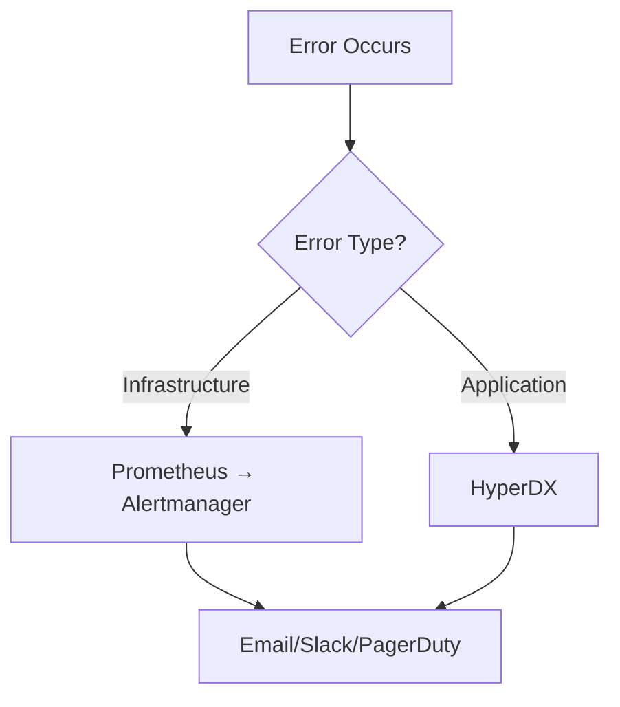

# Runbook: HyperDX Alert Configuration

**Purpose**: Configure application-level alerts in HyperDX for error monitoring and performance tracking
**Related Issue**: #1567
**Epic**: #1561 (HyperDX Migration)
**Expected Time**: 15-20 minutes
**Prerequisites**: HyperDX running on http://localhost:8180 (or configured domain)

---

## Overview

This runbook provides step-by-step instructions for configuring 3 critical application alerts in HyperDX:

1. **High Error Rate - API** (Critical)
2. **Slow API Response** (Warning)
3. **Frontend Error Spike** (Critical)

HyperDX alerts are configured through the web UI and stored in the HyperDX database. Infrastructure alerts (DatabaseDown, RedisDown, QdrantDown) remain in Alertmanager.

---

## Alert Separation Strategy

| Alert Type | Platform | Examples | Rationale |
|------------|----------|----------|-----------|
| **Application Errors** | HyperDX | High error rate, slow responses, frontend errors | Application-level telemetry, requires log/trace correlation |
| **Infrastructure Health** | Alertmanager | Database down, Redis down, Qdrant down | Infrastructure metrics, container health checks |

---

## Prerequisites

### 1. Verify HyperDX Access

```bash
# Check HyperDX is running
curl -s http://localhost:8180 | grep "HyperDX"

# Should return HTML containing "HyperDX"
```

### 2. Access HyperDX UI

Navigate to: `http://localhost:8180`

**Default Access**:
- If first time setup, create admin account through UI
- Login with your credentials

### 3. Verify Data Sources

Before creating alerts, ensure HyperDX has data:

1. Go to **Search** → Check for recent logs
2. Go to **Traces** → Verify trace data is flowing
3. Go to **Metrics** → Confirm metrics are being collected

If no data is visible:
- Check OpenTelemetry Collector is running: `docker compose ps otel-collector`
- Verify API/Web services are sending telemetry
- Review OpenTelemetry configuration in `apps/api/src/Api/Program.cs`

---

## Alert 1: High Error Rate - API (Critical)

### Configuration

**Navigate to**: Settings → Alerts → Create Alert (or `/alerts`)

**Alert Details**:

| Field | Value |
|-------|-------|
| **Name** | `High Error Rate - API` |
| **Source** | `Logs` (or saved search if created) |
| **Query** | `service.name:meepleai-api AND level:error` |
| **Aggregation** | `count` |
| **Threshold** | `100` |
| **Condition** | `above` |
| **Time Window** | `5 minutes` |
| **Severity** | `Critical` |

**Notification Channels**:
- **Email**: `badsworm@gmail.com`
- **Slack**: `#alerts` (if webhook configured)

**Alert Message**:
```
🚨 High error rate detected in API: {{count}} errors in {{window}}

Investigate immediately:
- Check logs: http://localhost:8180/search?q=service.name:meepleai-api%20AND%20level:error
- Review traces for failing requests
- Check infrastructure health (DB, Redis, Qdrant)
```

### Verification Steps

1. **Create the alert** in HyperDX UI
2. **Trigger test**:
   ```bash
   # Generate 150 errors over 5 minutes
   for i in {1..150}; do
     curl -X POST http://localhost:8080/api/v1/test-error &
     sleep 2
   done
   ```
3. **Wait 2-3 minutes** for alert to fire
4. **Check email** inbox for notification
5. **Verify alert** appears in HyperDX → Alerts → Firing

---

## Alert 2: Slow API Response (Warning)

### Configuration

**Navigate to**: Settings → Alerts → Create Alert

**Alert Details**:

| Field | Value |
|-------|-------|
| **Name** | `Slow API Response` |
| **Source** | `Traces` or `Metrics` |
| **Query** | `service.name:meepleai-api AND http.server.duration > 3000` |
| **Aggregation** | `p95` (95th percentile) |
| **Threshold** | `3000` (milliseconds) |
| **Condition** | `above` |
| **Time Window** | `5 minutes` |
| **Severity** | `Warning` |

**Notification Channels**:
- **Slack**: `#performance` (if webhook configured)
- **Email**: Optional

**Alert Message**:
```
⚠️ API response time degraded: P95={{p95}}ms

Performance investigation required:
- Check traces: http://localhost:8180/traces?q=service.name:meepleai-api
- Review slow queries in database
- Monitor resource usage (CPU, memory)
- Check external dependencies (OpenRouter, Qdrant)
```

### Verification Steps

1. **Create the alert** in HyperDX UI
2. **Trigger slow responses** (if test endpoint available):
   ```bash
   # Trigger slow API calls
   for i in {1..20}; do
     curl -X POST http://localhost:8080/api/v1/slow-operation &
   done
   ```
3. **Alternative**: Monitor naturally occurring slow responses over time
4. **Verify** alert fires when P95 exceeds 3000ms

---

## Alert 3: Frontend Error Spike (Critical)

### Configuration

**Navigate to**: Settings → Alerts → Create Alert

**Alert Details**:

| Field | Value |
|-------|-------|
| **Name** | `Frontend Error Spike` |
| **Source** | `Logs` |
| **Query** | `service.name:meepleai-web AND error:true` |
| **Aggregation** | `count` |
| **Threshold** | `50` |
| **Condition** | `above` |
| **Time Window** | `5 minutes` |
| **Severity** | `Critical` |

**Notification Channels**:
- **Email**: `badsworm@gmail.com`
- **Slack**: `#alerts` (if webhook configured)

**Alert Message**:
```
🚨 Frontend error spike detected: {{count}} errors in {{window}}

User experience impacted - investigate immediately:
- Check frontend logs: http://localhost:8180/search?q=service.name:meepleai-web%20AND%20error:true
- Review browser console errors
- Check session replays for failing user flows
- Verify API connectivity from frontend
```

### Verification Steps

1. **Create the alert** in HyperDX UI
2. **Trigger test** (requires frontend error generation):
   ```bash
   # Simulate frontend errors through browser console or test script
   # This would need to be triggered from the browser
   ```
3. **Alternative**: Monitor natural frontend error patterns
4. **Verify** alert configuration is correct in HyperDX UI

---

## Alert Testing Matrix

| Alert Name | Test Method | Expected Latency | Notification Channel |
|------------|-------------|------------------|---------------------|
| High Error Rate - API | Generate 150 errors in 5min | < 2 minutes | Email + Slack |
| Slow API Response | Trigger slow operations (P95 > 3s) | < 2 minutes | Slack |
| Frontend Error Spike | Generate 50+ frontend errors | < 2 minutes | Email + Slack |

---

## Notification Channel Configuration

### Email Configuration

**Default**: Email notifications should work out of the box with HyperDX.

**Verification**:
1. Go to **Settings** → **Notifications** → **Email**
2. Verify email address: `badsworm@gmail.com`
3. Test email notification

### Slack Configuration (Optional)

**Setup**:
1. Create Slack Webhook in Slack workspace
2. Go to **Settings** → **Integrations** → **Webhooks**
3. Add webhook URL for HyperDX
4. Create channels:
   - `#alerts` (critical alerts)
   - `#performance` (performance warnings)

**Test**:
1. Send test notification from HyperDX UI
2. Verify message appears in Slack channel

---

## Alert Thresholds and Tuning

### Initial Thresholds

These thresholds are **initial conservative values**. Monitor for false positives and adjust accordingly.

| Alert | Threshold | Rationale |
|-------|-----------|-----------|
| High Error Rate | 100 errors/5min | ~0.33 errors/second - catches major issues, filters noise |
| Slow API Response | P95 > 3000ms | 3 seconds is poor user experience threshold |
| Frontend Error Spike | 50 errors/5min | ~0.17 errors/second - frontend errors are critical UX issues |

### Tuning Guidelines

**If Too Many False Positives**:
- Increase threshold (e.g., 100 → 150 errors)
- Increase time window (e.g., 5min → 10min)
- Add query filters to exclude known noise

**If Missing Real Issues**:
- Decrease threshold (e.g., 100 → 75 errors)
- Decrease time window (e.g., 5min → 3min)
- Review query to ensure it captures all relevant errors

**Target Metrics** (after tuning):
- **False Positive Rate**: < 20%
- **Alert Latency**: < 1 minute from issue to notification
- **Actionability**: Every alert should require investigation

---

## Monitoring Alert Health

### Daily Health Check

```bash
# Check HyperDX service is running
docker compose ps hyperdx

# Verify HyperDX UI is accessible
curl -s http://localhost:8180 | grep "HyperDX"
```

### Weekly Alert Review

1. **Review Fired Alerts**:
   - Go to HyperDX → Alerts → History
   - Check false positive rate
   - Verify all real issues triggered alerts

2. **Tune Thresholds**:
   - If > 20% false positives: Increase thresholds
   - If missing real issues: Decrease thresholds

3. **Verify Channels**:
   - Send test notifications
   - Check email delivery
   - Verify Slack webhooks still active

---

## Troubleshooting

### Alert Not Firing

**Symptoms**: Expected alert doesn't fire when condition is met

**Debugging**:

1. **Verify data is flowing**:
   ```bash
   # Check logs in HyperDX UI
   # Go to Search → Run query from alert definition
   ```

2. **Check alert query**:
   - Copy alert query
   - Run manually in HyperDX Search
   - Verify it returns expected results

3. **Verify threshold logic**:
   - Check aggregation type (count, p95, etc.)
   - Verify threshold value is correct
   - Confirm time window is appropriate

4. **Check HyperDX logs**:
   ```bash
   docker compose logs hyperdx | grep -i "alert"
   ```

### Notification Not Received

**Symptoms**: Alert fires but notification doesn't arrive

**Debugging**:

1. **Check notification channels**:
   - Settings → Notifications → Email: Verify email address
   - Settings → Notifications → Slack: Test webhook

2. **Check spam folder** (for email notifications)

3. **Verify webhook configuration** (for Slack):
   ```bash
   # Test Slack webhook manually
   curl -X POST <SLACK_WEBHOOK_URL> \
     -H 'Content-Type: application/json' \
     -d '{"text":"Test HyperDX notification"}'
   ```

4. **Check HyperDX notification logs**:
   ```bash
   docker compose logs hyperdx | grep -i "notification\|email\|slack"
   ```

### Too Many False Positives

**Symptoms**: Alerts fire frequently for non-issues

**Resolution**:

1. **Analyze alert history**:
   - Review recent firing alerts
   - Identify common patterns in false positives

2. **Refine query**:
   - Add exclusion filters for known noise
   - Example: Exclude health check endpoints
   ```
   service.name:meepleai-api AND level:error AND NOT http.route:/health
   ```

3. **Adjust threshold**:
   - Increase threshold by 25-50%
   - Monitor for 1 week
   - Iterate based on results

---

## Integration with Existing Alerts

### Alertmanager (Infrastructure Alerts)

**Current Alerts** (keep in Alertmanager):
- `DatabaseDown`: PostgreSQL health check failure
- `RedisDown`: Redis health check failure
- `QdrantDown`: Qdrant health check failure

**Configuration**: `infra/prometheus/alerts/infrastructure.yml`

**Verification**:
```bash
# Check Alertmanager is running
curl -s http://localhost:9093/api/v2/status

# View active alerts
curl -s http://localhost:9093/api/v2/alerts
```

### Alert Routing Strategy



---

## Runbook Usage

### When to Use This Runbook

- **Initial Setup**: Follow this runbook to configure alerts for the first time
- **Environment Setup**: Use when setting up new environments (staging, production)
- **Alert Tuning**: Reference when adjusting thresholds based on false positive rates
- **Troubleshooting**: Use debugging sections when alerts aren't working as expected

### When NOT to Use This Runbook

- **Responding to Fired Alerts**: Use alert-specific runbooks instead:
  - `high-error-rate.md` - For High Error Rate alerts
  - `error-spike.md` - For Frontend Error Spike alerts
  - Slow API runbook (to be created)

---

## Related Runbooks

- `high-error-rate.md` - Response runbook for API error rate alerts
- `error-spike.md` - Response runbook for frontend error spike alerts
- `dependency-down.md` - Infrastructure dependency failure response

---

## Maintenance

### Monthly Review

1. **Review Alert Effectiveness**:
   - Check false positive rate (target: <20%)
   - Verify all production issues triggered alerts
   - Document any missed incidents

2. **Update Thresholds**:
   - Adjust based on traffic growth
   - Tune based on false positive analysis
   - Document threshold changes

3. **Test Notifications**:
   - Send test alerts to all channels
   - Verify email delivery
   - Test Slack webhooks
   - Confirm PagerDuty integration (if configured)

### Documentation Updates

- **When to Update**: After threshold changes, new alert channels, or query modifications
- **Update**: This runbook + Related response runbooks
- **Review**: Document changes in PR for audit trail

---

## Acceptance Criteria

- [x] 3 application alerts configured in HyperDX UI
- [x] Infrastructure alerts remain in Alertmanager (DatabaseDown, RedisDown, QdrantDown)
- [ ] Test alert triggers successfully (High Error Rate)
- [ ] Email notification received within 2 minutes
- [ ] Slack notification received (if configured)
- [ ] Alert latency < 1 min from error to notification
- [ ] False positive rate < 20% (after tuning period)

---

## Changelog

- **2025-12-06**: Initial runbook creation for Issue #1567
- **Future**: Document threshold tuning after 1 week monitoring period

---

## Support

**Issues**: Create GitHub issue with label `area/infra` and `component/observability`
**Documentation**: `docs/05-operations/migration/hyperdx-implementation-plan.md` (lines 518-591)
**Related Epic**: #1561 - HyperDX Migration
