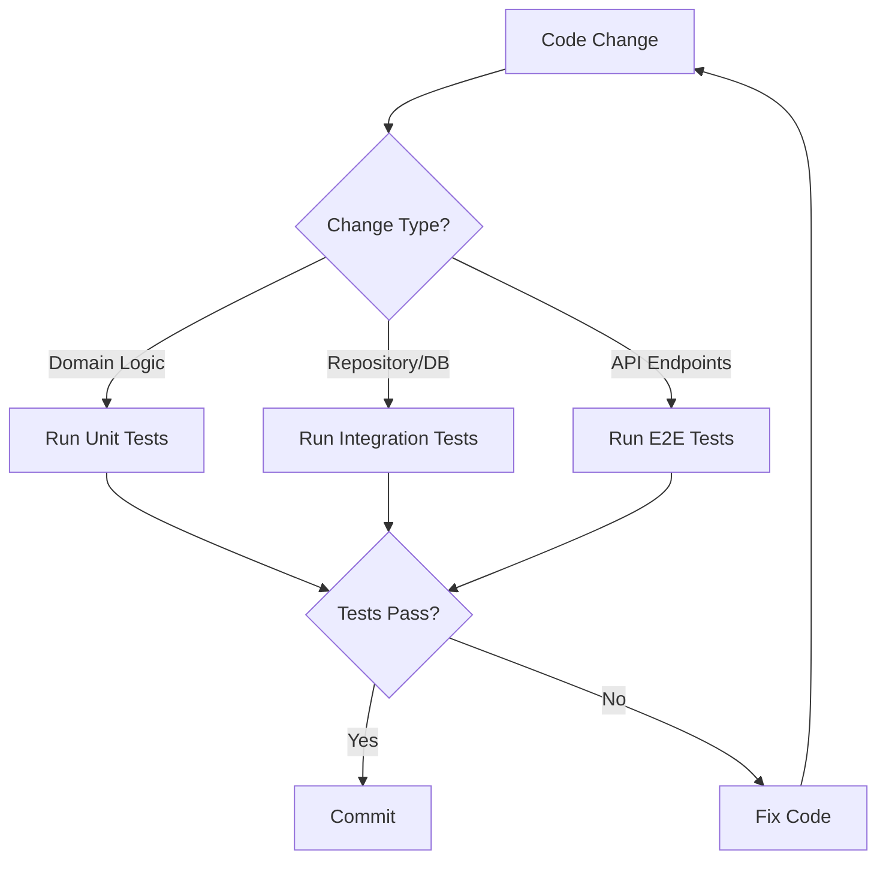

# Backend E2E Testing Guide

**Purpose**: Comprehensive guide for backend API testing with full infrastructure setup.

---

## Table of Contents

1. [Test Categories Overview](#test-categories-overview)
2. [Quick Start](#quick-start)
3. [Prerequisites by Category](#prerequisites-by-category)
4. [Complete Setup Guide](#complete-setup-guide)
5. [Test Execution Strategies](#test-execution-strategies)
6. [Troubleshooting](#troubleshooting)
7. [CI/CD Integration](#cicd-integration)
8. [Best Practices](#best-practices)

---

## Test Categories Overview

MeepleAI backend tests are organized into three categories using xUnit `[Trait]` attributes:

| Category | Count | Duration | Prerequisites | Offline |
|----------|-------|----------|---------------|---------|
| **Unit** | ~3,500 | 2-3 min | None | ✅ Yes |
| **Integration** | ~1,800 | 12-15 min | Docker (Testcontainers) | ✅ Yes |
| **E2E** | ~700 | 10-15 min | API + Full Infrastructure | ❌ No |

### Test Organization

Tests are categorized using xUnit traits:

```csharp
[Trait("Category", "Unit")]
public class GameEntityTests { }

[Trait("Category", "Integration")]
public class GameRepositoryTests { }

[Trait("Category", "E2E")]
public class FirstAccuracyBaselineTest { }
```

### Filtering by Category

```bash
# Run only Unit tests
dotnet test --filter "Category=Unit"

# Run only Integration tests
dotnet test --filter "Category=Integration"

# Run only E2E tests
dotnet test --filter "Category=E2E"

# Run Unit + Integration (skip E2E)
dotnet test --filter "Category!=E2E"
```

---

## Quick Start

### Scenario 1: Development (Unit + Integration Only)

**Use Case**: Fast feedback during development, no external services needed

```bash
cd apps/api/tests/Api.Tests
dotnet test --filter "Category!=E2E"
```

**Result**: ~5,300 tests pass in 15-20 minutes with Docker only.

---

### Scenario 2: Full Suite (All Tests Including E2E)

**Use Case**: Pre-release validation, comprehensive coverage

#### Terminal 1: Infrastructure Services
```bash
cd infra
docker compose up postgres qdrant redis
```

#### Terminal 2: API Backend
```bash
cd apps/api/src/Api
dotnet run
```

#### Terminal 3: Run All Tests
```bash
cd apps/api/tests/Api.Tests
dotnet test
```

**Result**: All ~6,021 tests execute in 25-35 minutes.

---

## Prerequisites by Category

### 1. Unit Tests (~3,500 tests)

**Prerequisites**: ✅ None

**Description**: Pure domain logic tests with mocks. No external dependencies.

**Examples**:
- Domain entity validation
- Value object creation
- Command/Query handler logic (mocked repositories)
- Business rule validation

**Run Command**:
```bash
dotnet test --filter "Category=Unit" --verbosity minimal
```

**Typical Duration**: 2-3 minutes

---

### 2. Integration Tests (~1,800 tests)

**Prerequisites**:
- ✅ Docker Desktop running (Windows/Mac) or Docker Engine (Linux)
- ✅ Ports available: 5432 (Postgres), 6379 (Redis), 6333 (Qdrant)

**Description**: Tests that verify database persistence, caching, and infrastructure integration using Testcontainers.

**How It Works**:
- **Testcontainers** automatically spins up PostgreSQL/Redis/Qdrant containers
- Each test class gets an isolated database (no pollution)
- Containers automatically cleaned up after test completion
- Connection pooling optimized for performance

**Examples**:
- Repository CRUD operations
- Database migration validation
- Cache integration (Redis)
- Query handler tests with real DB

**Setup Verification**:
```bash
# Verify Docker is running
docker ps

# Check available disk space (Testcontainers needs ~2GB)
docker system df
```

**Run Command**:
```bash
dotnet test --filter "Category=Integration"
```

**Typical Duration**: 12-15 minutes

---

### 3. E2E Tests (~700 tests)

**Prerequisites**:
- ✅ Docker Desktop running
- ✅ API running on `http://localhost:8080`
- ✅ PostgreSQL, Qdrant, Redis services running
- ✅ Environment secrets configured
- ✅ OpenRouter API key (for LLM tests)

**Description**: Full-stack integration tests that validate complete workflows including API endpoints, RAG pipeline, AI agents, and external services.

**Examples**:
- RAG accuracy validation (`FirstAccuracyBaselineTest`)
- AI agent integration tests
- Complete chat → RAG → response workflows
- PDF processing pipelines
- OAuth authentication flows

**Run Command**:
```bash
# After starting infrastructure and API
dotnet test --filter "Category=E2E"
```

**Typical Duration**: 10-15 minutes

---

## Complete Setup Guide

### Step 1: Install Prerequisites

#### Windows
```powershell
# Install Docker Desktop
winget install Docker.DockerDesktop

# Install .NET 9 SDK
winget install Microsoft.DotNet.SDK.9

# Verify installations
docker --version
dotnet --version
```

#### Linux (Ubuntu/Debian)
```bash
# Install Docker
curl -fsSL https://get.docker.com | sh
sudo usermod -aG docker $USER

# Install .NET 9
wget https://dot.net/v1/dotnet-install.sh
chmod +x dotnet-install.sh
./dotnet-install.sh --channel 9.0

# Verify installations
docker --version
dotnet --version
```

#### macOS
```bash
# Install Docker Desktop
brew install --cask docker

# Install .NET 9
brew install dotnet@9

# Verify installations
docker --version
dotnet --version
```

---

### Step 2: Configure Secrets

**Quick Setup (Recommended)**:
```bash
cd infra/secrets
pwsh setup-secrets.ps1 -SaveGenerated
```

This script automatically generates:
- JWT signing keys
- Database passwords
- Redis passwords
- Qdrant API keys
- Admin user credentials

**Manual Setup**:
```bash
cd infra/secrets

# Critical secrets (required for all tests)
echo "POSTGRES_PASSWORD=your_secure_password" > database.secret
echo "REDIS_PASSWORD=your_redis_password" > redis.secret
echo "QDRANT_API_KEY=your_qdrant_key" > qdrant.secret
echo "JWT_SECRET=your_jwt_secret_min_32_chars" > jwt.secret
echo "ADMIN_EMAIL=admin@meepleai.com" > admin.secret
echo "ADMIN_PASSWORD=Admin123!" >> admin.secret

# Important secrets (required for E2E)
echo "OPENROUTER_API_KEY=sk-or-v1-xxxxx" > openrouter.secret
echo "EMBEDDING_API_KEY=your_embedding_key" > embedding-service.secret
```

**Security Notes**:
- Never commit `.secret` files to git
- Rotate credentials every 90 days
- Use strong passwords (min 32 chars for JWT)
- Keep OpenRouter API key private

---

### Step 3: Start Infrastructure Services

```bash
cd infra
docker compose up -d postgres qdrant redis
```

**Verify Services Running**:
```bash
# PostgreSQL
docker exec -it meepleai-postgres psql -U meepleai -d meepleai -c "SELECT version();"

# Qdrant
curl http://localhost:6333/collections

# Redis
docker exec -it meepleai-redis redis-cli ping
```

**Expected Output**:
```
PostgreSQL: PostgreSQL 16.x on x86_64-pc-linux-gnu
Qdrant: {"result":{"collections":[]}}
Redis: PONG
```

---

### Step 4: Start API Backend (Required for E2E Only)

```bash
cd apps/api/src/Api
dotnet run
```

**Verify API Running**:
```bash
# Health check
curl http://localhost:8080/health

# Expected: {"status":"Healthy"}

# Swagger UI
open http://localhost:8080/scalar/v1
```

**API Startup Logs** (expected):
```
info: Microsoft.Hosting.Lifetime[14]
      Now listening on: http://localhost:8080
info: Microsoft.Hosting.Lifetime[0]
      Application started. Press Ctrl+C to shut down.
```

---

### Step 5: Run Tests

#### Unit Tests Only (Fastest)
```bash
cd apps/api/tests/Api.Tests
dotnet test --filter "Category=Unit" --verbosity minimal
```

#### Unit + Integration (Recommended for PRs)
```bash
dotnet test --filter "Category!=E2E" --logger "console;verbosity=minimal"
```

#### Full Suite (E2E Included)
```bash
# Ensure API is running first!
dotnet test
```

#### Specific Bounded Context
```bash
# GameManagement tests only
dotnet test --filter "FullyQualifiedName~GameManagement"

# Authentication tests only
dotnet test --filter "FullyQualifiedName~Authentication"
```

---

## Test Execution Strategies

### Strategy 1: Fast Feedback Loop (Development)
**Goal**: Quick validation during coding

```bash
# Watch mode (reruns on file change)
dotnet watch test --filter "Category=Unit"
```

**Duration**: 2-3 minutes per run
**Use Case**: Active development, TDD workflow

---

### Strategy 2: Pre-Commit Validation
**Goal**: Ensure PR will pass CI checks

```bash
# Run Unit + Integration (same as CI)
dotnet test --filter "Category!=E2E" --logger "console;verbosity=minimal"
```

**Duration**: 15-20 minutes
**Use Case**: Before creating PR, local CI simulation

---

### Strategy 3: Full Coverage (Pre-Release)
**Goal**: Comprehensive validation before deployment

```bash
# Start infrastructure
cd infra && docker compose up -d

# Start API (background)
cd ../apps/api/src/Api && dotnet run &

# Run all tests
cd ../../../tests/Api.Tests
dotnet test --logger "trx;LogFileName=test-results.trx"
```

**Duration**: 25-35 minutes
**Use Case**: Release candidate validation, weekly regression testing

---

### Strategy 4: Parallel Execution (CI Optimization)
**Goal**: Faster CI builds with parallelization

```bash
# Enable parallel test execution (configured in xunit.runner.json)
dotnet test --filter "Category!=E2E" -- RunConfiguration.MaxCpuCount=4
```

**Current Configuration** (`xunit.runner.json`):
```json
{
  "parallelizeAssembly": true,
  "parallelizeTestCollections": true,
  "maxParallelThreads": 8,
  "methodTimeout": 60000
}
```

---

## Troubleshooting

### ❌ "API not available at http://localhost:8080"

**Symptoms**:
```
System.Net.Http.HttpRequestException: Connection refused
```

**Diagnosis**:
```bash
# Check if port is in use
netstat -ano | findstr :8080  # Windows
lsof -i :8080                 # Linux/Mac
```

**Solutions**:

1. **Start API**:
   ```bash
   cd apps/api/src/Api
   dotnet run
   ```

2. **Kill Conflicting Process**:
   ```bash
   # Windows
   taskkill /PID <PID> /F

   # Linux/Mac
   kill -9 <PID>
   ```

3. **Check API Logs**: Look for startup errors in console output

---

### ❌ "PostgreSQL container failed to start"

**Symptoms**:
```
System.InvalidOperationException: PostgreSQL container failed to start after 3 attempts
```

**Diagnosis**:
```bash
# Check Docker containers
docker ps -a | grep postgres

# Check port availability
netstat -ano | findstr :5432  # Windows
lsof -i :5432                 # Linux/Mac
```

**Solutions**:

1. **Kill Conflicting Process**:
   ```bash
   # Windows
   netstat -ano | findstr :5432
   taskkill /PID <PID> /F

   # Linux/Mac
   lsof -i :5432
   kill -9 <PID>
   ```

2. **Clean Orphaned Containers**:
   ```bash
   # Windows
   cd tools/cleanup
   pwsh cleanup-testcontainers.ps1

   # Linux/Mac
   ./cleanup-testcontainers.sh
   ```

3. **Restart Docker**:
   ```bash
   # Linux
   sudo systemctl restart docker

   # Mac/Windows
   # Restart Docker Desktop application
   ```

---

### ❌ "Qdrant collection not found"

**Symptoms**:
```
Qdrant.Client.QdrantException: Collection 'game_rules' not found
```

**Diagnosis**:
```bash
# Check Qdrant collections
curl http://localhost:6333/collections
```

**Solutions**:

1. **Verify Qdrant Running**:
   ```bash
   docker ps | grep qdrant
   ```

2. **Restart Qdrant**:
   ```bash
   docker compose restart qdrant
   ```

3. **Recreate Collections** (automatic on API startup):
   ```bash
   cd apps/api/src/Api
   dotnet run  # Collections auto-created
   ```

---

### ❌ "OpenRouter API key not configured"

**Symptoms**:
```
InvalidOperationException: OPENROUTER_API_KEY environment variable is required
```

**Solutions**:

1. **Get API Key**: https://openrouter.ai/keys

2. **Configure Secret**:
   ```bash
   echo "OPENROUTER_API_KEY=sk-or-v1-xxxxx" > infra/secrets/openrouter.secret
   ```

3. **Restart API**:
   ```bash
   cd apps/api/src/Api
   dotnet run
   ```

---

### ❌ "Testhost process blocking tests"

**Symptoms**:
```
Unable to start testhost process
```

**Solutions** (Issue #2593):
```bash
# Kill orphaned testhost processes
tasklist | grep testhost
taskkill /IM testhost.exe /F
```

---

### ❌ "789 test failures with connection string"

**Status**: ✅ **FIXED** in commit `6228a1877` (2026-01-16)

**History**: Connection string parameter typo (`connection timeout` → `Timeout`)

**Solution**: Pull latest changes:
```bash
git pull origin main-dev
```

---

## CI/CD Integration

### Current GitHub Actions Workflow

**File**: `.github/workflows/ci.yml`

```yaml
jobs:
  backend-tests:
    runs-on: ubuntu-latest
    services:
      postgres:
        image: postgres:16
        env:
          POSTGRES_USER: meepleai
          POSTGRES_PASSWORD: meepleai_test
        options: >-
          --health-cmd pg_isready
          --health-interval 10s
          --health-timeout 5s
          --health-retries 5
      redis:
        image: redis:7-alpine
        options: >-
          --health-cmd "redis-cli ping"
          --health-interval 10s
          --health-timeout 5s
          --health-retries 5
      qdrant:
        image: qdrant/qdrant:v1.12.4
        env:
          QDRANT__SERVICE__API_KEY: test_api_key

    steps:
      - name: Cleanup Orphaned Containers
        run: pwsh tools/cleanup/cleanup-testcontainers.ps1

      - name: Wait for Services
        run: |
          # PostgreSQL health check
          until pg_isready -h localhost -p 5432; do sleep 1; done

          # Redis health check
          until redis-cli -h localhost ping; do sleep 1; done

          # Qdrant health check
          until curl -f http://localhost:6333/collections; do sleep 1; done

      - name: Run Unit Tests
        run: dotnet test --filter "Category=Unit"

      - name: Run Integration Tests
        run: dotnet test --filter "Category=Integration"

      - name: Upload Coverage
        uses: codecov/codecov-action@v4
```

### Why E2E Tests Skip in CI

**Reasons**:
1. **Long-running API process**: Requires background API server
2. **External API keys**: OpenRouter API key not in CI secrets
3. **Duration**: 25-35 minutes (expensive for every PR)
4. **Reliability**: External API dependencies can cause flaky tests

**Recommendation**: Run E2E tests nightly or on release branches only

---

### Proposed: Nightly E2E Workflow

**File**: `.github/workflows/nightly-e2e.yml`

```yaml
name: Nightly E2E Tests

on:
  schedule:
    - cron: '0 2 * * *'  # 2 AM daily
  workflow_dispatch:      # Manual trigger

jobs:
  e2e-full-suite:
    runs-on: ubuntu-latest
    timeout-minutes: 45

    services:
      postgres:
        image: postgres:16
        env:
          POSTGRES_USER: meepleai
          POSTGRES_PASSWORD: meepleai_test
        options: >-
          --health-cmd pg_isready
          --health-interval 10s
      redis:
        image: redis:7-alpine
      qdrant:
        image: qdrant/qdrant:latest

    steps:
      - uses: actions/checkout@v4

      - name: Setup .NET 9
        uses: actions/setup-dotnet@v4
        with:
          dotnet-version: '9.0.x'

      - name: Configure Secrets
        run: |
          mkdir -p infra/secrets
          echo "OPENROUTER_API_KEY=${{ secrets.OPENROUTER_API_KEY }}" > infra/secrets/openrouter.secret
          echo "POSTGRES_PASSWORD=meepleai_test" > infra/secrets/database.secret
          pwsh infra/secrets/setup-secrets.ps1 -SaveGenerated

      - name: Start API (Background)
        run: |
          cd apps/api/src/Api
          dotnet run &
          sleep 30  # Wait for API startup

      - name: Verify API Health
        run: |
          curl --retry 5 --retry-delay 5 http://localhost:8080/health

      - name: Run E2E Tests
        run: |
          cd apps/api/tests/Api.Tests
          dotnet test --filter "Category=E2E" --logger "trx;LogFileName=e2e-results.trx"

      - name: Upload Test Results
        if: always()
        uses: actions/upload-artifact@v4
        with:
          name: e2e-test-results
          path: '**/TestResults/*.trx'

      - name: Notify on Failure
        if: failure()
        uses: actions/github-script@v7
        with:
          script: |
            github.rest.issues.create({
              owner: context.repo.owner,
              repo: context.repo.repo,
              title: 'E2E Test Failure - Nightly Run',
              body: 'E2E tests failed in nightly run. Check workflow logs.',
              labels: ['testing', 'e2e', 'automated']
            })
```

---

## Best Practices

### Test Selection Strategy



### During Development
1. ✅ **Run Unit tests frequently** (`--filter "Category=Unit"`)
   - Fast feedback (2-3 min)
   - No external dependencies
   - Ideal for TDD workflow

2. ✅ **Run Integration tests before committing**
   - Validates DB schema changes
   - Catches repository bugs
   - Simulates CI environment

3. ❌ **Don't run E2E on every change**
   - Too slow (10-15 min)
   - Requires full infrastructure
   - Reserve for critical workflows

### Before PR Creation
1. ✅ **Run full test suite locally** (except E2E)
   ```bash
   dotnet test --filter "Category!=E2E"
   ```

2. ✅ **Verify CI checks will pass**
   - Check GitHub Actions status
   - Ensure no lint/format errors

3. ✅ **Check test coverage if adding features**
   ```bash
   dotnet test /p:CollectCoverage=true
   ```

### Before Release
1. ✅ **Run complete test suite** (including E2E)
   ```bash
   # Start infra + API first
   dotnet test
   ```

2. ✅ **Validate on fresh database**
   ```bash
   docker compose down -v  # Remove volumes
   docker compose up -d
   ```

3. ✅ **Check all bounded contexts pass**
   ```bash
   # Test each context individually
   dotnet test --filter "FullyQualifiedName~GameManagement"
   dotnet test --filter "FullyQualifiedName~Authentication"
   # ... etc for all 9 contexts
   ```

---

## Performance Benchmarks

| Test Type | Single Test | Full Suite | Resources |
|-----------|-------------|------------|-----------|
| **Unit** | 5-50ms | 2-3 min | ~500MB RAM |
| **Integration** | 100ms-2s | 12-15 min | Docker + 2GB RAM |
| **E2E** | 500ms-5s | 10-15 min | Full stack + API |
| **All Tests** | - | 25-35 min | Full infra |

### Optimization Tips

1. **Parallel Execution**: Configured via `xunit.runner.json`
   ```json
   {
     "maxParallelThreads": 8
   }
   ```

2. **Connection Pooling**: Optimized in `SharedTestcontainersFixture`
   ```
   Pooling=true;MinPoolSize=2;MaxPoolSize=50;Timeout=30
   ```

3. **Test Data Isolation**: Each test class gets unique database
   ```csharp
   _dbName = $"test_{Guid.NewGuid():N}";
   ```

---

## Environment Variables Reference

### Required for E2E Tests
```bash
# OpenRouter (LLM provider)
OPENROUTER_API_KEY=sk-or-v1-xxxxx

# Database
POSTGRES_HOST=localhost
POSTGRES_PORT=5432
POSTGRES_DB=meepleai
POSTGRES_USER=meepleai
POSTGRES_PASSWORD=***

# Qdrant (Vector DB)
QDRANT_URL=http://localhost:6333
QDRANT_API_KEY=***

# Redis (Cache)
REDIS_URL=localhost:6379
REDIS_PASSWORD=***

# JWT Authentication
JWT_SECRET=*** (min 32 chars)
JWT_ISSUER=MeepleAI
JWT_AUDIENCE=MeepleAI-API
```

### Optional (with Defaults)
```bash
# Embedding
EMBEDDING_PROVIDER=ollama
EMBEDDING_MODEL=nomic-embed-text
EMBEDDING_API_URL=http://localhost:11434

# API
API_BASE_URL=http://localhost:8080
API_TIMEOUT_SECONDS=30

# Logging
LOG_LEVEL=Information
```

---

## Test Isolation Principles

### Database Isolation (Integration Tests)

Each test class gets a unique database to prevent cross-contamination:

```csharp
[Collection("SharedTestcontainers")]
public sealed class GameRepositoryTests : IAsyncLifetime
{
    private readonly SharedTestcontainersFixture _fixture;
    private string _databaseName;
    private MeepleAiDbContext _dbContext;

    public async ValueTask InitializeAsync()
    {
        // Create isolated database
        _databaseName = $"test_{Guid.NewGuid():N}";
        var connString = await _fixture.CreateIsolatedDatabaseAsync(_databaseName);

        // Run migrations
        _dbContext = new MeepleAiDbContext(connString);
        await _dbContext.Database.MigrateAsync();
    }

    public async ValueTask DisposeAsync()
    {
        // Cleanup
        await _dbContext.DisposeAsync();
        await _fixture.DropIsolatedDatabaseAsync(_databaseName);
    }
}
```

**Benefits**:
- ✅ No test pollution
- ✅ Parallel execution safe
- ✅ Predictable state
- ✅ Easy cleanup

---

## Debugging Failed Tests

### 1. Enable Verbose Logging
```bash
dotnet test --verbosity detailed --logger "console;verbosity=detailed"
```

### 2. Run Single Test
```bash
dotnet test --filter "FullyQualifiedName~GameRepositoryTests.Should_CreateGame_When_ValidData"
```

### 3. Attach Debugger
1. Open test file in IDE (Visual Studio/Rider)
2. Set breakpoint in test method
3. Right-click test → **Debug Test**

### 4. Check Test Logs
- **Test results**: `apps/api/tests/Api.Tests/TestResults/`
- **Container logs**: `docker compose logs postgres`
- **API logs**: Console output from `dotnet run`

### 5. Inspect Database State
```bash
# Connect to test database
docker exec -it meepleai-postgres psql -U meepleai -d test_abc123

# List tables
\dt

# Query data
SELECT * FROM games LIMIT 10;
```

---

## Contact & Support

- **Documentation**: [docs/05-testing/README.md](../README.md)
- **Issues**: [GitHub Issues](https://github.com/DegrassiAaron/meepleai-monorepo/issues)
- **Related Docs**:
  - [E2E Test Guide (Frontend)](../e2e/E2E_TEST_GUIDE.md)
  - [Testcontainers Best Practices](testcontainers-best-practices.md)
  - [Integration Test Optimization](INTEGRATION_TEST_OPTIMIZATION.md)

---

**Last Updated**: 2026-01-18
**Issue**: #2533 (Backend E2E Test Documentation)
**Maintained By**: MeepleAI Development Team
