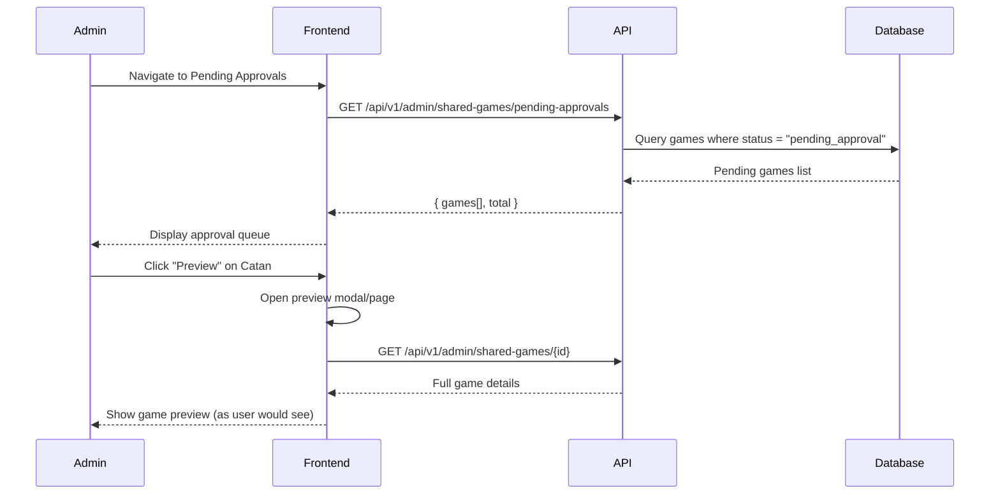
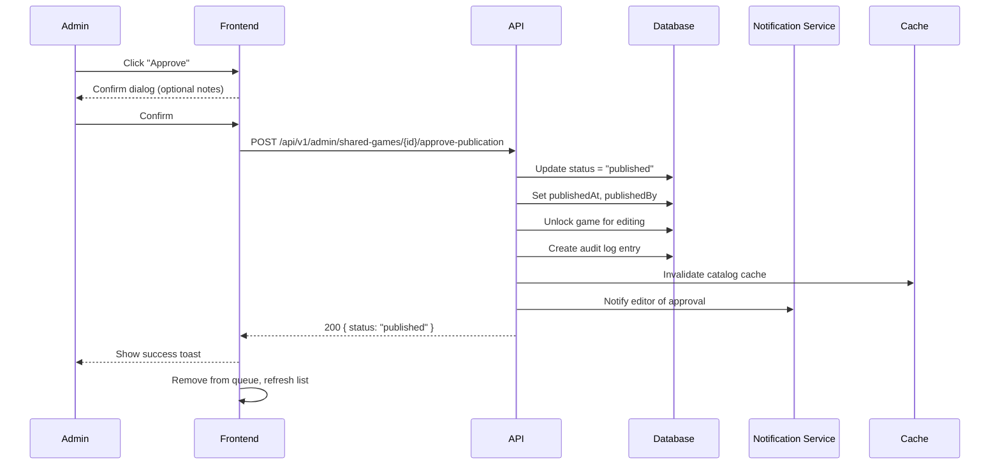

# Admin: Approval Workflow

> Admin flows for reviewing and approving game publications and deletions.

## Table of Contents

- [Publication Approval Queue](#publication-approval-queue)
- [Review and Approve](#review-and-approve)
- [Reject with Reason](#reject-with-reason)
- [Delete Approval Queue](#delete-approval-queue)

---

## Role: Admin

**Capabilities:**
- All Editor capabilities plus:
- Approve/reject game publications
- Approve/reject delete requests
- Manage users and roles
- Configure system settings
- Access analytics and monitoring
- Manage AI models and prompts

---

## Publication Approval Queue

### User Story

```gherkin
Feature: Publication Approval Queue
  As an admin
  I want to see pending game submissions
  So that I can review and approve them

  Scenario: View pending approvals
    Given editors have submitted games
    When I go to Pending Approvals
    Then I see all games awaiting review
    And I see who submitted them and when

  Scenario: Sort and filter queue
    When I filter by "oldest first"
    Then I can process in FIFO order
    When I filter by editor
    Then I see only that editor's submissions

  Scenario: Empty queue
    When there are no pending submissions
    Then I see "No pending approvals"
```

### Screen Flow

```
Admin Dashboard → [Pending Approvals (5)]
                          ↓
              Approval Queue Page
              ┌────────────────────────────────────────────┐
              │ Pending Approvals                    (5)   │
              ├────────────────────────────────────────────┤
              │ Filter: [All Editors ▼] Sort: [Oldest ▼]   │
              ├────────────────────────────────────────────┤
              │ 1. Catan                                   │
              │    Submitted by: editor@example.com        │
              │    Date: 2026-01-15 (4 days ago)          │
              │    [Preview] [Approve] [Reject]           │
              ├────────────────────────────────────────────┤
              │ 2. Ticket to Ride                          │
              │    Submitted by: editor2@example.com       │
              │    Date: 2026-01-17 (2 days ago)          │
              │    [Preview] [Approve] [Reject]           │
              └────────────────────────────────────────────┘
```

### Sequence Diagram



### API Flow

| Endpoint | Method | Query | Description |
|----------|--------|-------|-------------|
| `/api/v1/admin/shared-games/pending-approvals` | GET | `sort, editor, page` | List pending |

**Response:**
```json
{
  "items": [
    {
      "id": "uuid",
      "name": "Catan",
      "submittedBy": {
        "id": "uuid",
        "email": "editor@example.com",
        "displayName": "John Editor"
      },
      "submittedAt": "2026-01-15T10:00:00Z",
      "daysPending": 4,
      "hasDocuments": true,
      "documentCount": 2,
      "quickQuestionsCount": 10
    }
  ],
  "totalCount": 5
}
```

### Implementation Status

| Component | Status | Location |
|-----------|--------|----------|
| Pending Approvals Endpoint | ✅ Implemented | `SharedGameCatalogEndpoints.cs` |
| Queue Page | ✅ Implemented | `/app/admin/shared-games/pending-approvals/` (if exists) |
| Preview | ✅ Implemented | Game detail page |

---

## Review and Approve

### User Story

```gherkin
Feature: Approve Game Publication
  As an admin
  I want to approve a game
  So that it becomes publicly available

  Scenario: Approve after review
    Given I have reviewed a game submission
    When I click "Approve"
    Then the game status becomes "published"
    And it appears in the public catalog
    And the editor is notified

  Scenario: Approve with notes
    When I approve with optional notes
    Then the notes are sent to the editor
    And recorded in audit log
```

### Screen Flow

```
Approval Queue → [Preview] Game
                      ↓
            Game Preview Page
            ┌─────────────────────────────────┐
            │ Preview: Catan                  │
            │ (as users will see it)          │
            ├─────────────────────────────────┤
            │ [View PDFs] [View Quick Q's]    │
            ├─────────────────────────────────┤
            │ Checklist:                      │
            │ ✓ Cover image quality           │
            │ ✓ Description complete          │
            │ ✓ PDFs processed                │
            │ ✓ Metadata accurate             │
            ├─────────────────────────────────┤
            │ Notes (optional):               │
            │ [___________________________]   │
            ├─────────────────────────────────┤
            │ [Cancel] [Reject] [✓ Approve]   │
            └─────────────────────────────────┘
                      ↓
                [Approve]
                      ↓
            "Catan has been published"
            Editor notified
```

### Sequence Diagram



### API Flow

| Endpoint | Method | Body | Description |
|----------|--------|------|-------------|
| `/api/v1/admin/shared-games/{id}/approve-publication` | POST | `{ notes? }` | Approve game |

**Request:**
```json
{
  "notes": "Great submission! Consider adding more quick questions in the future."
}
```

**Response:**
```json
{
  "id": "uuid",
  "name": "Catan",
  "status": "published",
  "publishedAt": "2026-01-19T10:00:00Z",
  "publishedBy": "admin-uuid"
}
```

### Implementation Status

| Component | Status | Location |
|-----------|--------|----------|
| Approve Endpoint | ✅ Implemented | `SharedGameCatalogEndpoints.cs` |
| Notification | ⚠️ Partial | Basic implementation |
| Audit Log | ✅ Implemented | Entity tracking |

---

## Reject with Reason

### User Story

```gherkin
Feature: Reject Game Submission
  As an admin
  I want to reject a submission with feedback
  So that the editor knows what to fix

  Scenario: Reject with reason
    Given I reviewed a game and found issues
    When I click "Reject"
    And I enter a rejection reason
    Then the game returns to "rejected" status
    And the editor is notified with the reason

  Scenario: Reject reason required
    When I try to reject without a reason
    Then I see "Rejection reason is required"
    And I cannot proceed
```

### Screen Flow

```
Preview → [Reject]
              ↓
      Rejection Dialog
      ┌─────────────────────────────────┐
      │ Reject Submission               │
      ├─────────────────────────────────┤
      │ Reason (required):              │
      │ ┌─────────────────────────────┐ │
      │ │ Cover image is too low      │ │
      │ │ resolution. Please upload   │ │
      │ │ at least 600x600 pixels.    │ │
      │ └─────────────────────────────┘ │
      │                                 │
      │ Quick Reasons:                  │
      │ [Low quality image]             │
      │ [Missing PDF]                   │
      │ [Incomplete description]        │
      ├─────────────────────────────────┤
      │ [Cancel] [Reject]               │
      └─────────────────────────────────┘
              ↓
      Game rejected
      Editor notified
```

### API Flow

| Endpoint | Method | Body | Description |
|----------|--------|------|-------------|
| `/api/v1/admin/shared-games/{id}/reject-publication` | POST | `{ reason }` | Reject game |

**Request:**
```json
{
  "reason": "Cover image resolution is too low. Please upload at least 600x600 pixels."
}
```

**Response:**
```json
{
  "id": "uuid",
  "name": "Catan",
  "status": "rejected",
  "rejectedAt": "2026-01-19T10:00:00Z",
  "rejectedBy": "admin-uuid",
  "rejectionReason": "Cover image resolution is too low..."
}
```

### Implementation Status

| Component | Status | Location |
|-----------|--------|----------|
| Reject Endpoint | ✅ Implemented | `SharedGameCatalogEndpoints.cs` |
| Rejection UI | ⚠️ Partial | Basic dialog |
| Quick Reasons | ❌ Not Implemented | Feature request |

---

## Delete Approval Queue

### User Story

```gherkin
Feature: Delete Approval Queue
  As an admin
  I want to review delete requests
  So that games are not accidentally deleted

  Scenario: View pending deletes
    Given editors have requested game deletions
    When I go to Pending Deletes
    Then I see all delete requests
    And I see who requested and why

  Scenario: Approve delete
    When I approve a delete request
    Then the game is permanently deleted
    And all associated data is removed

  Scenario: Reject delete
    When I reject a delete request
    Then the game remains
    And the editor is notified
```

### Screen Flow

```
Admin → [Pending Deletes (2)]
              ↓
      Delete Queue Page
      ┌────────────────────────────────────────────┐
      │ Pending Delete Requests              (2)   │
      ├────────────────────────────────────────────┤
      │ 1. Old Test Game                           │
      │    Requested by: editor@example.com        │
      │    Reason: "Duplicate entry"               │
      │    Date: 2026-01-18                        │
      │    [View Game] [Approve Delete] [Reject]   │
      └────────────────────────────────────────────┘
```

### API Flow

| Endpoint | Method | Description |
|----------|--------|-------------|
| `/api/v1/admin/shared-games/pending-deletes` | GET | List pending deletes |
| `/api/v1/admin/shared-games/approve-delete/{requestId}` | POST | Approve deletion |
| `/api/v1/admin/shared-games/reject-delete/{requestId}` | POST | Reject deletion |

**Delete Request Object:**
```json
{
  "id": "request-uuid",
  "gameId": "game-uuid",
  "gameName": "Old Test Game",
  "requestedBy": {
    "id": "uuid",
    "email": "editor@example.com"
  },
  "reason": "Duplicate entry - merged with correct game",
  "requestedAt": "2026-01-18T10:00:00Z"
}
```

### Implementation Status

| Component | Status | Location |
|-----------|--------|----------|
| Pending Deletes Endpoint | ✅ Implemented | `SharedGameCatalogEndpoints.cs` |
| Approve/Reject | ✅ Implemented | Same file |
| Delete Queue Page | ✅ Implemented | `/app/admin/shared-games/pending-deletes/page.tsx` |

---

## Gap Analysis

### Implemented Features
- [x] Publication approval queue
- [x] Approve game publication
- [x] Reject with reason
- [x] Delete request queue
- [x] Approve/reject delete requests
- [x] Audit logging

### Missing/Partial Features
- [ ] **Quick Rejection Reasons**: Pre-defined templates
- [ ] **Batch Approval**: Approve multiple games at once
- [ ] **Review Assignment**: Assign reviews to specific admins
- [ ] **SLA Tracking**: Time-to-review metrics
- [ ] **Review Checklist**: Standardized review criteria
- [ ] **Conditional Approval**: "Approve pending minor changes"

### Proposed Enhancements
1. **Quick Templates**: Pre-defined rejection reasons
2. **Review Assignment**: Distribute workload among admins
3. **SLA Dashboard**: Track review times and bottlenecks
4. **Standardized Checklist**: Consistent review criteria
5. **Batch Operations**: Handle multiple approvals efficiently
