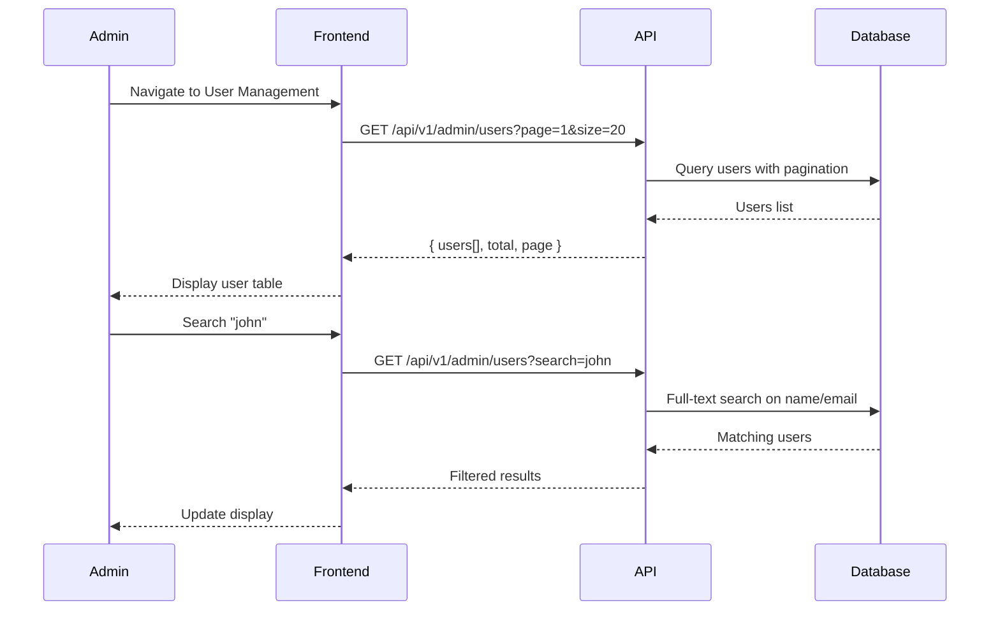

# Admin: User Management Flows

> Admin flows for managing users, roles, and subscriptions.

## Table of Contents

- [View Users](#view-users)
- [Create User](#create-user)
- [Edit User](#edit-user)
- [Manage Roles](#manage-roles)
- [Manage Tiers](#manage-tiers)
- [Bulk Operations](#bulk-operations)
- [User Activity](#user-activity)

---

## View Users

### User Story

```gherkin
Feature: View Users
  As an admin
  I want to view all users
  So that I can manage the user base

  Scenario: List all users
    Given users exist in the system
    When I go to User Management
    Then I see a paginated list of users
    And I can search and filter

  Scenario: Search users
    When I search for "john"
    Then I see users matching that name or email

  Scenario: Filter by role/tier
    When I filter by "Editor" role
    Then I only see editors
```

### Screen Flow

```
Admin Dashboard → [Users] → User Management
                               ↓
              ┌────────────────────────────────────────────┐
              │ User Management                            │
              ├────────────────────────────────────────────┤
              │ [🔍 Search...] [Role: All ▼] [Tier: All ▼] │
              │ [+ Create User]                [Export CSV]│
              ├────────────────────────────────────────────┤
              │ Email             │ Name    │ Role  │ Tier │
              ├───────────────────┼─────────┼───────┼──────┤
              │ john@example.com  │ John D. │ User  │ Free │
              │ jane@example.com  │ Jane E. │ Editor│Normal│
              │ admin@example.com │ Admin   │ Admin │Premim│
              ├────────────────────────────────────────────┤
              │ Page 1 of 10  [< Prev] [Next >]            │
              └────────────────────────────────────────────┘
```

### Sequence Diagram



### API Flow

| Endpoint | Method | Query | Description |
|----------|--------|-------|-------------|
| `/api/v1/admin/users` | GET | `search, role, tier, page, size` | List users |
| `/api/v1/users/search` | GET | `q` | Autocomplete search |

**Response:**
```json
{
  "items": [
    {
      "id": "uuid",
      "email": "john@example.com",
      "displayName": "John Doe",
      "role": "User",
      "tier": "Free",
      "createdAt": "2026-01-01T10:00:00Z",
      "lastLoginAt": "2026-01-19T08:00:00Z",
      "isActive": true
    }
  ],
  "totalCount": 150,
  "page": 1,
  "pageSize": 20
}
```

### Implementation Status

| Component | Status | Location |
|-----------|--------|----------|
| List Users Endpoint | ✅ Implemented | `AdminUserEndpoints.cs` |
| Search Endpoint | ✅ Implemented | Same file |
| Users Page | ✅ Implemented | `/app/admin/users/page.tsx` |

---

## Create User

### User Story

```gherkin
Feature: Create User
  As an admin
  I want to create user accounts
  So that I can onboard new users manually

  Scenario: Create basic user
    When I fill in email and password
    And I select role and tier
    And I click "Create"
    Then the user account is created
    And they can log in immediately

  Scenario: Validation errors
    When I enter an existing email
    Then I see "Email already exists"
```

### Screen Flow

```
User Management → [+ Create User]
                        ↓
              Create User Modal
              ┌─────────────────────────────┐
              │ Create New User             │
              ├─────────────────────────────┤
              │ Email*: [______________]    │
              │ Display Name: [_________]   │
              │ Password*: [____________]   │
              │                             │
              │ Role: [User ▼]              │
              │   ○ User                    │
              │   ○ Editor                  │
              │   ○ Admin                   │
              │                             │
              │ Tier: [Free ▼]              │
              │   ○ Free                    │
              │   ○ Normal                  │
              │   ○ Premium                 │
              │                             │
              │ ☐ Send welcome email        │
              ├─────────────────────────────┤
              │ [Cancel] [Create User]      │
              └─────────────────────────────┘
```

### API Flow

| Endpoint | Method | Body | Description |
|----------|--------|------|-------------|
| `/api/v1/admin/users` | POST | User data | Create user |

**Request:**
```json
{
  "email": "newuser@example.com",
  "displayName": "New User",
  "password": "SecureP@ss123",
  "role": "User",
  "tier": "Free",
  "sendWelcomeEmail": true
}
```

### Implementation Status

| Component | Status | Location |
|-----------|--------|----------|
| Create User Endpoint | ✅ Implemented | `AdminUserEndpoints.cs` |
| Create UI | ⚠️ Partial | Basic implementation |
| Welcome Email | ❌ Not Implemented | Feature request |

---

## Edit User

### User Story

```gherkin
Feature: Edit User
  As an admin
  I want to edit user details
  So that I can update their information

  Scenario: Edit user details
    When I click "Edit" on a user
    And I change their display name
    And I save
    Then the changes are applied

  Scenario: Deactivate user
    When I toggle "Active" off
    Then the user cannot log in
    But their data is preserved
```

### API Flow

| Endpoint | Method | Body | Description |
|----------|--------|------|-------------|
| `/api/v1/admin/users/{id}` | PUT | Updated data | Update user |
| `/api/v1/admin/users/{id}` | DELETE | - | Delete user |

### Implementation Status

| Component | Status | Location |
|-----------|--------|----------|
| Update User Endpoint | ✅ Implemented | `AdminUserEndpoints.cs` |
| Delete User Endpoint | ✅ Implemented | Same file |

---

## Manage Roles

### User Story

```gherkin
Feature: Manage User Roles
  As an admin
  I want to change user roles
  So that I can grant or revoke permissions

  Scenario: Promote to editor
    Given a user has "User" role
    When I change their role to "Editor"
    Then they gain editor permissions
    And they can create games

  Scenario: Demote from admin
    Given a user is an admin
    When I demote them to user
    Then they lose admin access
    But I cannot demote myself
```

### Screen Flow

```
User Row → [...] → [Change Role]
                        ↓
              Role Change Dialog
              ┌─────────────────────────────┐
              │ Change Role: John Doe       │
              ├─────────────────────────────┤
              │ Current Role: User          │
              │                             │
              │ New Role:                   │
              │ ○ User                      │
              │ ● Editor                    │
              │ ○ Admin                     │
              │                             │
              │ ⚠️ This grants content      │
              │    management permissions   │
              ├─────────────────────────────┤
              │ [Cancel] [Change Role]      │
              └─────────────────────────────┘
```

### Role Permissions Matrix

| Permission | User | Editor | Admin |
|------------|------|--------|-------|
| Browse catalog | ✅ | ✅ | ✅ |
| Manage personal library | ✅ | ✅ | ✅ |
| Use AI chat | ✅ | ✅ | ✅ |
| Create games | ❌ | ✅ | ✅ |
| Edit games | ❌ | ✅ | ✅ |
| Upload unlimited PDFs | ❌ | ✅ | ✅ |
| Approve publications | ❌ | ❌ | ✅ |
| Manage users | ❌ | ❌ | ✅ |
| System configuration | ❌ | ❌ | ✅ |

### Implementation Status

| Component | Status | Location |
|-----------|--------|----------|
| Role Change | ✅ Implemented | Part of user update |
| Role UI | ⚠️ Partial | Basic implementation |

---

## Manage Tiers

### User Story

```gherkin
Feature: Manage User Tiers
  As an admin
  I want to change user subscription tiers
  So that I can grant premium access

  Scenario: Upgrade to premium
    Given a user has "Free" tier
    When I change their tier to "Premium"
    Then they get increased quotas
    And they see updated limits immediately

  Scenario: Downgrade tier
    Given a user has "Premium" tier with 45 games
    When I downgrade to "Free" (5 game limit)
    Then they keep existing games
    But cannot add more until under limit
```

### Screen Flow

```
User Row → [...] → [Change Tier]
                        ↓
              Tier Change Dialog
              ┌─────────────────────────────┐
              │ Change Tier: John Doe       │
              ├─────────────────────────────┤
              │ Current Tier: Free          │
              │ Current Usage: 3/5 games    │
              │                             │
              │ New Tier:                   │
              │ ○ Free (5 games)            │
              │ ● Normal (20 games)         │
              │ ○ Premium (50 games)        │
              ├─────────────────────────────┤
              │ [Cancel] [Update Tier]      │
              └─────────────────────────────┘
```

### API Flow

| Endpoint | Method | Body | Description |
|----------|--------|------|-------------|
| `/api/v1/admin/users/{id}/tier` | PUT | `{ tier }` | Update tier |

**Request:**
```json
{
  "tier": "Premium"
}
```

### Implementation Status

| Component | Status | Location |
|-----------|--------|----------|
| Update Tier Endpoint | ✅ Implemented | `AdminUserEndpoints.cs` |
| Tier UI | ⚠️ Partial | Basic implementation |

---

## Bulk Operations

### User Story

```gherkin
Feature: Bulk User Operations
  As an admin
  I want to perform bulk operations
  So that I can efficiently manage many users

  Scenario: Bulk password reset
    When I select multiple users
    And I click "Reset Passwords"
    Then all selected users receive reset emails

  Scenario: Bulk role change
    When I select multiple users
    And I change their role
    Then all are updated at once

  Scenario: Import users from CSV
    When I upload a CSV of users
    Then they are created in bulk
    And I see a success/failure report

  Scenario: Export users
    When I click "Export CSV"
    Then all users are exported
    With their details in CSV format
```

### Screen Flow

```
User Management → [☐ Select All]
                        ↓
              Selected: 15 users
              [Bulk Actions ▼]
              ├── Reset Passwords
              ├── Change Role
              ├── Change Tier
              └── Export Selected
                        ↓
              Confirm Dialog
                        ↓
              Progress...
                        ↓
              Report:
              ✅ 14 succeeded
              ❌ 1 failed (invalid email)
```

### API Flow

| Endpoint | Method | Body | Description |
|----------|--------|------|-------------|
| `/api/v1/admin/users/bulk/password-reset` | POST | `{ userIds[] }` | Bulk reset |
| `/api/v1/admin/users/bulk/role-change` | POST | `{ userIds[], role }` | Bulk role |
| `/api/v1/admin/users/bulk/import` | POST | CSV file | Import users |
| `/api/v1/admin/users/bulk/export` | GET | Filters | Export CSV |

**Bulk Operation Response:**
```json
{
  "total": 15,
  "succeeded": 14,
  "failed": 1,
  "results": [
    { "userId": "uuid", "status": "success" },
    { "userId": "uuid", "status": "failed", "error": "Invalid email format" }
  ]
}
```

### Implementation Status

| Component | Status | Location |
|-----------|--------|----------|
| Bulk Password Reset | ✅ Implemented | `AdminUserEndpoints.cs` |
| Bulk Role Change | ✅ Implemented | Same file |
| Import CSV | ✅ Implemented | Same file |
| Export CSV | ✅ Implemented | Same file |
| Bulk UI | ⚠️ Partial | Basic selection |

---

## User Activity

### User Story

```gherkin
Feature: View User Activity
  As an admin
  I want to see user activity
  So that I can monitor usage and troubleshoot

  Scenario: View activity timeline
    When I view a user's profile
    Then I see their activity timeline
    Including logins, actions, and events

  Scenario: Filter activity
    When I filter by activity type
    Then I see only matching events
```

### Screen Flow

```
User Row → [View Activity]
                ↓
      User Activity Timeline
      ┌─────────────────────────────────────────┐
      │ Activity: john@example.com              │
      ├─────────────────────────────────────────┤
      │ Filter: [All ▼] Date: [Last 7 days ▼]   │
      ├─────────────────────────────────────────┤
      │ 📅 2026-01-19                           │
      │ ├─ 10:30 - Started chat session (Catan) │
      │ ├─ 10:15 - Added game to library        │
      │ └─ 09:00 - Logged in                    │
      │                                         │
      │ 📅 2026-01-18                           │
      │ ├─ 20:00 - Completed game session       │
      │ └─ 18:30 - Uploaded custom PDF          │
      └─────────────────────────────────────────┘
```

### API Flow

| Endpoint | Method | Query | Description |
|----------|--------|-------|-------------|
| `/api/v1/admin/users/{userId}/activity` | GET | `type, from, to, page` | User activity |
| `/api/v1/users/me/activity` | GET | Same | Own activity |

**Response:**
```json
{
  "items": [
    {
      "id": "uuid",
      "type": "CHAT_SESSION_STARTED",
      "description": "Started chat session for Catan",
      "timestamp": "2026-01-19T10:30:00Z",
      "metadata": {
        "gameId": "uuid",
        "gameName": "Catan"
      }
    }
  ],
  "totalCount": 45
}
```

### Implementation Status

| Component | Status | Location |
|-----------|--------|----------|
| Activity Endpoint | ✅ Implemented | `AdminUserEndpoints.cs` |
| User Activity Endpoint | ✅ Implemented | `UserProfileEndpoints.cs` |
| UserActivityTimeline | ✅ Implemented | `UserActivityTimeline.tsx` |

---

## Gap Analysis

### Implemented Features
- [x] List and search users
- [x] Create users
- [x] Edit users
- [x] Delete users
- [x] Change roles
- [x] Change tiers
- [x] Bulk operations (reset, role, import, export)
- [x] User activity timeline

### Missing/Partial Features
- [ ] **Welcome Email**: On user creation
- [ ] **Account Deactivation**: Soft-disable without delete
- [ ] **Session Management**: View/revoke user sessions
- [ ] **Impersonation**: Log in as user for troubleshooting
- [ ] **Usage Analytics**: Per-user usage statistics
- [ ] **Subscription Management**: Payment/billing integration

### Proposed Enhancements
1. **Welcome Email**: Send onboarding email on creation
2. **Impersonation**: Admin can log in as user (with audit)
3. **Usage Dashboard**: Per-user usage graphs and statistics
4. **Account Locking**: Temporary lock for security
5. **Self-Service Tier Upgrade**: User-initiated upgrades
