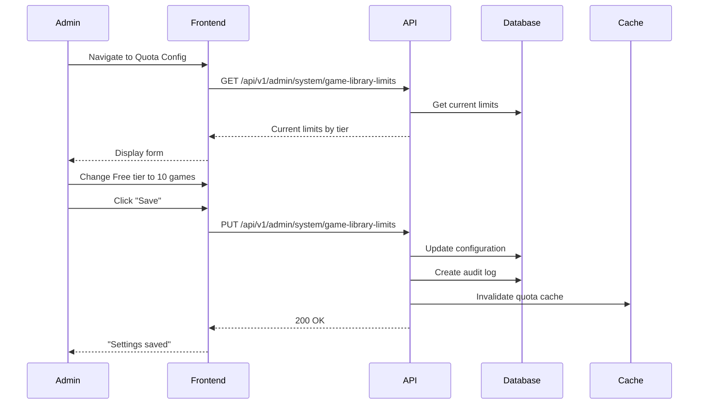
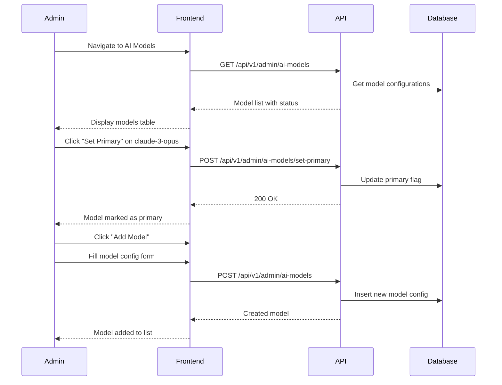

# Admin: System Configuration Flows

> Admin flows for configuring system settings, quotas, and AI models.

## Table of Contents

- [Quota Configuration](#quota-configuration)
- [Feature Flags](#feature-flags)
- [AI Model Configuration](#ai-model-configuration)
- [Prompt Management](#prompt-management)
- [API Key Administration](#api-key-administration)

---

## Quota Configuration

### User Story

```gherkin
Feature: Configure Tier Quotas
  As an admin
  I want to configure tier-based quotas
  So that I can adjust limits as business needs change

  Scenario: Update game library limits
    When I go to System Configuration → Quotas
    And I change Free tier limit from 5 to 10 games
    And I save
    Then all Free tier users immediately have 10 game limit

  Scenario: Update PDF upload limits
    When I change upload limits
    Then the new limits apply to all users of that tier
```

### Screen Flow

```
Admin → Configuration → Quotas
                          ↓
        ┌───────────────────────────────────────────┐
        │ Quota Configuration                       │
        ├───────────────────────────────────────────┤
        │ Game Library Limits                       │
        │ ┌───────────┬───────────┬──────────────┐  │
        │ │ Tier      │ Max Games │ Status       │  │
        │ ├───────────┼───────────┼──────────────┤  │
        │ │ Free      │ [5____]   │ ✓ Saved      │  │
        │ │ Normal    │ [20___]   │ ✓ Saved      │  │
        │ │ Premium   │ [50___]   │ ✓ Saved      │  │
        │ └───────────┴───────────┴──────────────┘  │
        ├───────────────────────────────────────────┤
        │ PDF Upload Limits                         │
        │ ┌───────────┬─────────┬─────────────────┐ │
        │ │ Tier      │ Daily   │ Weekly          │ │
        │ ├───────────┼─────────┼─────────────────┤ │
        │ │ Free      │ [5___]  │ [20____]        │ │
        │ │ Normal    │ [20__]  │ [100___]        │ │
        │ │ Premium   │ [100_]  │ [500___]        │ │
        │ └───────────┴─────────┴─────────────────┘ │
        ├───────────────────────────────────────────┤
        │ [Reset to Defaults] [Save Changes]        │
        └───────────────────────────────────────────┘
```

### Sequence Diagram



### API Flow

| Endpoint | Method | Body | Description |
|----------|--------|------|-------------|
| `/api/v1/admin/system/game-library-limits` | GET | - | Get limits |
| `/api/v1/admin/system/game-library-limits` | PUT | Limits config | Update limits |

**Update Request:**
```json
{
  "free": { "maxGames": 10 },
  "normal": { "maxGames": 25 },
  "premium": { "maxGames": 100 }
}
```

### Implementation Status

| Component | Status | Location |
|-----------|--------|----------|
| Library Limits Endpoint | ✅ Implemented | System configuration |
| PDF Limits | ⚠️ DB Only | Not exposed in admin UI |
| Config Page | ✅ Implemented | `/app/admin/configuration/game-library-limits/page.tsx` |

---

## Feature Flags

### User Story

```gherkin
Feature: Manage Feature Flags
  As an admin
  I want to toggle features on/off
  So that I can control feature rollout

  Scenario: Enable feature for all users
    When I enable "RAG_V2" feature
    Then all users get the new RAG implementation

  Scenario: Enable for specific role
    When I enable "BETA_CHAT" for Editors only
    Then only Editors see the beta chat features

  Scenario: Disable broken feature
    When a feature causes issues
    And I disable it
    Then it's immediately unavailable
```

### Screen Flow

```
Admin → Configuration → Feature Flags
                            ↓
        ┌────────────────────────────────────────────┐
        │ Feature Flags                              │
        ├────────────────────────────────────────────┤
        │ Feature         │ Global │ Admin │ Editor │
        ├─────────────────┼────────┼───────┼────────┤
        │ RAG_V2          │ [ON ]  │ [ON ] │ [ON ]  │
        │ BETA_CHAT       │ [OFF]  │ [ON ] │ [ON ]  │
        │ PLAYER_MODE     │ [ON ]  │ [ON ] │ [ON ]  │
        │ AI_SUGGESTIONS  │ [OFF]  │ [ON ] │ [OFF]  │
        ├────────────────────────────────────────────┤
        │ [+ Add Flag]                               │
        └────────────────────────────────────────────┘
```

### API Flow

| Endpoint | Method | Description |
|----------|--------|-------------|
| `/api/v1/admin/feature-flags` | GET | List all flags |
| `/api/v1/admin/feature-flags/{name}` | PUT | Update flag |
| `/api/v1/admin/feature-flags` | POST | Create flag |

### Implementation Status

| Component | Status | Location |
|-----------|--------|----------|
| Feature Flag Service | ✅ Implemented | `FeatureFlagService.cs` |
| Admin Endpoints | ⚠️ Partial | Database config only |
| Feature Flags Tab | ✅ Implemented | `FeatureFlagsTab.tsx` |

---

## AI Model Configuration

### User Story

```gherkin
Feature: Configure AI Models
  As an admin
  I want to configure LLM providers and models
  So that I can optimize AI performance and costs

  Scenario: Add new model
    When I add a new OpenRouter model
    With API key and parameters
    Then it becomes available for use

  Scenario: Set primary model
    When I set "claude-3-opus" as primary
    Then all new requests use that model

  Scenario: Disable model
    When I disable a model
    Then it's no longer used for new requests
```

### Screen Flow

```
Admin → AI Models
           ↓
    ┌─────────────────────────────────────────────┐
    │ AI Model Configuration                      │
    ├─────────────────────────────────────────────┤
    │ Model               │ Status  │ Primary     │
    ├─────────────────────┼─────────┼─────────────┤
    │ claude-3-opus       │ Active  │ ⭐ Primary  │
    │ claude-3-sonnet     │ Active  │ [Set]       │
    │ gpt-4-turbo         │ Disabled│ [Set]       │
    │ llama-3-70b         │ Active  │ [Set]       │
    ├─────────────────────────────────────────────┤
    │ [+ Add Model]                               │
    └─────────────────────────────────────────────┘
```

### Sequence Diagram



### Implementation Status

| Component | Status | Location |
|-----------|--------|----------|
| AI Models Page | ✅ Implemented | `/app/admin/ai-models/page.tsx` |
| AiModelsTable | ✅ Implemented | `AiModelsTable.tsx` |
| SetPrimaryModelDialog | ✅ Implemented | `SetPrimaryModelDialog.tsx` |
| Model Config | ⚠️ Partial | Basic configuration |

---

## Prompt Management

### User Story

```gherkin
Feature: Manage AI Prompts
  As an admin
  I want to manage system prompts
  So that I can tune AI responses

  Scenario: Edit prompt
    When I edit the "game_assistant" prompt
    Then I can modify the system message
    And see a diff of changes

  Scenario: Version prompts
    When I save prompt changes
    Then a new version is created
    And I can rollback if needed

  Scenario: Compare versions
    When I compare two prompt versions
    Then I see a side-by-side diff
```

### Screen Flow

```
Admin → Prompts
           ↓
    ┌─────────────────────────────────────────────┐
    │ Prompt Management                           │
    ├─────────────────────────────────────────────┤
    │ Prompt          │ Version │ Status │ Actions│
    ├─────────────────┼─────────┼────────┼────────┤
    │ game_assistant  │ v3.2    │ Active │ [Edit] │
    │ rules_qa        │ v2.1    │ Active │ [Edit] │
    │ setup_guide     │ v1.5    │ Active │ [Edit] │
    ├─────────────────────────────────────────────┤
    │ [+ New Prompt]                              │
    └─────────────────────────────────────────────┘

Prompt Edit Page:
    ┌─────────────────────────────────────────────┐
    │ Edit: game_assistant                        │
    ├─────────────────────────────────────────────┤
    │ System Message:                             │
    │ ┌─────────────────────────────────────────┐ │
    │ │ You are MeepleAI, a helpful board game  │ │
    │ │ assistant. Help users understand rules  │ │
    │ │ and provide strategy tips...            │ │
    │ └─────────────────────────────────────────┘ │
    ├─────────────────────────────────────────────┤
    │ [View History] [Compare] [Save New Version] │
    └─────────────────────────────────────────────┘
```

### API Flow

| Endpoint | Method | Description |
|----------|--------|-------------|
| `/api/v1/admin/prompts` | GET | List prompts |
| `/api/v1/admin/prompts/{id}` | GET | Get prompt details |
| `/api/v1/admin/prompts/{id}` | PUT | Update prompt |
| `/api/v1/admin/prompts/{id}/versions` | GET | Version history |
| `/api/v1/admin/prompts/{id}/versions/new` | POST | Create new version |
| `/api/v1/admin/prompts/{id}/compare` | GET | Compare versions |

### Implementation Status

| Component | Status | Location |
|-----------|--------|----------|
| Prompts Page | ✅ Implemented | `/app/admin/prompts/page.tsx` |
| Prompt Edit | ✅ Implemented | `/app/admin/prompts/[id]/page.tsx` |
| Version History | ✅ Implemented | `/app/admin/prompts/[id]/versions/` |
| Compare View | ✅ Implemented | `/app/admin/prompts/[id]/compare/page.tsx` |
| PromptEditor | ✅ Implemented | `PromptEditor.tsx` |
| DiffViewer | ✅ Implemented | `DiffViewerEnhanced.tsx` |

---

## API Key Administration

### User Story

```gherkin
Feature: Administer API Keys
  As an admin
  I want to manage all API keys
  So that I can monitor and control API access

  Scenario: View all API keys
    When I go to API Keys admin
    Then I see all keys across all users
    With usage statistics

  Scenario: Revoke suspicious key
    When I see suspicious activity on a key
    And I revoke it
    Then it's immediately invalidated

  Scenario: Export API key data
    When I click "Export"
    Then I get a CSV of all API keys and usage
```

### Screen Flow

```
Admin → API Keys
           ↓
    ┌─────────────────────────────────────────────────┐
    │ API Key Administration                          │
    ├─────────────────────────────────────────────────┤
    │ [🔍 Search] [User: All ▼] [Status: All ▼]      │
    │ [Bulk Export]                                   │
    ├─────────────────────────────────────────────────┤
    │ Key (partial) │ User     │ Calls │ Last Used   │
    ├───────────────┼──────────┼───────┼─────────────┤
    │ sk-abc123...  │ john@... │ 1,234 │ 2 min ago   │
    │ sk-def456...  │ jane@... │ 567   │ 1 hour ago  │
    │ sk-xyz789...  │ bob@...  │ 89    │ 3 days ago  │
    ├─────────────────────────────────────────────────┤
    │ Total Keys: 45 │ Active: 42 │ Revoked: 3       │
    └─────────────────────────────────────────────────┘
```

### API Flow

| Endpoint | Method | Description |
|----------|--------|-------------|
| `/api/v1/admin/api-keys/stats` | GET | All keys with stats |
| `/api/v1/admin/api-keys/{id}` | DELETE | Permanently delete |
| `/api/v1/admin/api-keys/bulk/export` | GET | Export CSV |
| `/api/v1/admin/api-keys/bulk/import` | POST | Import CSV |

### Implementation Status

| Component | Status | Location |
|-----------|--------|----------|
| Admin API Keys Endpoints | ✅ Implemented | `ApiKeyEndpoints.cs` |
| Export/Import | ✅ Implemented | Same file |
| API Keys Page | ✅ Implemented | `/app/admin/api-keys/page.tsx` |
| ApiKeyFilterPanel | ✅ Implemented | `ApiKeyFilterPanel.tsx` |

---

## Gap Analysis

### Implemented Features
- [x] Game library quota configuration
- [x] Feature flags management
- [x] AI model configuration
- [x] Prompt management with versioning
- [x] Prompt diff/comparison
- [x] API key administration
- [x] Bulk export/import

### Missing/Partial Features
- [ ] **PDF Upload Limits UI**: Only in database
- [ ] **Rate Limit Configuration**: No admin UI
- [ ] **Feature Flag Gradual Rollout**: Percentage-based rollout
- [ ] **A/B Testing Prompts**: Test prompt variations
- [ ] **Cost Tracking**: Per-model cost monitoring
- [ ] **Configuration History**: Audit trail for config changes

### Proposed Enhancements
1. **Full Quota UI**: Expose all quota types in admin interface
2. **Rate Limit Config**: Per-role rate limit configuration
3. **Gradual Rollout**: Percentage-based feature flag rollout
4. **Prompt A/B Testing**: Test prompt effectiveness
5. **Cost Dashboard**: Real-time AI cost monitoring
6. **Config Audit Log**: Full history of configuration changes
