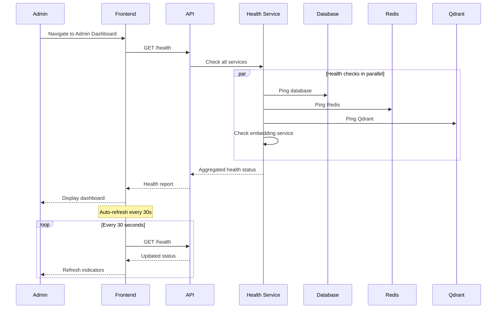

# Admin: Monitoring Flows

> Admin flows for system monitoring, health checks, and analytics.

## Table of Contents

- [System Health](#system-health)
- [Service Monitoring](#service-monitoring)
- [Alert Management](#alert-management)
- [Analytics Dashboard](#analytics-dashboard)
- [N8N Workflow Management](#n8n-workflow-management)
- [Cache Management](#cache-management)

---

## System Health

### User Story

```gherkin
Feature: System Health Dashboard
  As an admin
  I want to see overall system health
  So that I can ensure everything is running properly

  Scenario: View health status
    When I go to Admin Dashboard
    Then I see health status for all services
    With green/yellow/red indicators

  Scenario: Service down
    When a service is unhealthy
    Then I see it highlighted in red
    And I see the error details
```

### Screen Flow

```
Admin Dashboard
    ┌─────────────────────────────────────────────────┐
    │ System Status: 🟢 Healthy                       │
    ├─────────────────────────────────────────────────┤
    │ Services                                        │
    │ ┌───────────────┬────────┬──────────────────┐  │
    │ │ Service       │ Status │ Response Time    │  │
    │ ├───────────────┼────────┼──────────────────┤  │
    │ │ API           │ 🟢     │ 45ms             │  │
    │ │ PostgreSQL    │ 🟢     │ 12ms             │  │
    │ │ Redis         │ 🟢     │ 2ms              │  │
    │ │ Qdrant        │ 🟢     │ 8ms              │  │
    │ │ Embedding     │ 🟡     │ 250ms (slow)     │  │
    │ │ Unstructured  │ 🔴     │ Timeout          │  │
    │ └───────────────┴────────┴──────────────────┘  │
    ├─────────────────────────────────────────────────┤
    │ Quick Stats (Last 24h)                          │
    │ • API Requests: 125,432                         │
    │ • Active Users: 1,234                           │
    │ • Chat Sessions: 567                            │
    │ • PDF Processed: 89                             │
    └─────────────────────────────────────────────────┘
```

### Sequence Diagram



### API Flow

| Endpoint | Method | Description |
|----------|--------|-------------|
| `/health` | GET | Basic health check |
| `/health/live` | GET | Liveness probe |
| `/health/ready` | GET | Readiness probe |
| `/health/detailed` | GET | Detailed component status |

**Detailed Health Response:**
```json
{
  "status": "Degraded",
  "totalDuration": "00:00:00.350",
  "entries": {
    "postgresql": {
      "status": "Healthy",
      "duration": "00:00:00.012",
      "description": "PostgreSQL is healthy"
    },
    "redis": {
      "status": "Healthy",
      "duration": "00:00:00.002"
    },
    "qdrant": {
      "status": "Healthy",
      "duration": "00:00:00.008"
    },
    "embedding-service": {
      "status": "Degraded",
      "duration": "00:00:00.250",
      "description": "High latency detected"
    },
    "unstructured-service": {
      "status": "Unhealthy",
      "duration": "00:00:00.000",
      "description": "Connection timeout"
    }
  }
}
```

### Implementation Status

| Component | Status | Location |
|-----------|--------|----------|
| Health Endpoints | ✅ Implemented | Health checks |
| Admin Dashboard | ✅ Implemented | `/app/admin/page.tsx` |
| SystemStatus | ✅ Implemented | `SystemStatus.tsx` |
| ServiceHealthMatrix | ✅ Implemented | `ServiceHealthMatrix.tsx` |

---

## Service Monitoring

### User Story

```gherkin
Feature: Service Monitoring
  As an admin
  I want to monitor individual services
  So that I can diagnose issues

  Scenario: View service details
    When I click on a service
    Then I see detailed metrics
    Including CPU, memory, request rate

  Scenario: View Grafana dashboards
    When I click "Open in Grafana"
    Then I see the embedded Grafana dashboard
    With detailed metrics and graphs
```

### Screen Flow

```
Admin → Services
           ↓
    ┌─────────────────────────────────────────────────┐
    │ Service Monitoring                              │
    ├─────────────────────────────────────────────────┤
    │ API Service                                     │
    │ ┌─────────────────────────────────────────────┐ │
    │ │ Status: 🟢 Healthy                          │ │
    │ │ Uptime: 99.99% (30 days)                    │ │
    │ │ Requests: 1,234/min                         │ │
    │ │ Avg Response: 45ms                          │ │
    │ │ Error Rate: 0.01%                           │ │
    │ │                                             │ │
    │ │ [View Logs] [Open in Grafana]               │ │
    │ └─────────────────────────────────────────────┘ │
    │                                                 │
    │ [Grafana Embed]                                 │
    │ ┌─────────────────────────────────────────────┐ │
    │ │ 📈 Request Rate (last 1h)                   │ │
    │ │ [Graph visualization]                       │ │
    │ └─────────────────────────────────────────────┘ │
    └─────────────────────────────────────────────────┘
```

### Implementation Status

| Component | Status | Location |
|-----------|--------|----------|
| Services Page | ✅ Implemented | `/app/admin/services/page.tsx` |
| ServiceCard | ✅ Implemented | `ServiceCard.tsx` |
| GrafanaEmbed | ✅ Implemented | `GrafanaEmbed.tsx` |
| Infrastructure Page | ✅ Implemented | `/app/admin/infrastructure/page.tsx` |

---

## Alert Management

### User Story

```gherkin
Feature: Alert Management
  As an admin
  I want to configure and manage alerts
  So that I'm notified of issues

  Scenario: Create alert rule
    When I create a rule "API latency > 500ms"
    Then alerts fire when condition is met

  Scenario: View active alerts
    When alerts are firing
    Then I see them in the alerts dashboard
    And I can acknowledge them

  Scenario: Budget alert
    When AI costs exceed budget threshold
    Then I see a budget alert banner
```

### Screen Flow

```
Admin → Alerts
           ↓
    ┌─────────────────────────────────────────────────┐
    │ Alert Management                                │
    ├─────────────────────────────────────────────────┤
    │ Active Alerts (2)                               │
    │ ┌─────────────────────────────────────────────┐ │
    │ │ 🔴 High API Latency                         │ │
    │ │    Avg response > 500ms for 5 minutes       │ │
    │ │    Started: 10:30 AM                        │ │
    │ │    [Acknowledge] [View Details]             │ │
    │ ├─────────────────────────────────────────────┤ │
    │ │ 🟡 AI Cost Warning                          │ │
    │ │    80% of monthly budget used               │ │
    │ │    [View Usage] [Adjust Budget]             │ │
    │ └─────────────────────────────────────────────┘ │
    ├─────────────────────────────────────────────────┤
    │ Alert Rules                          [+ New]    │
    │ • API Latency > 500ms         [Edit] [Disable] │
    │ • Error Rate > 1%             [Edit] [Disable] │
    │ • AI Budget > 80%             [Edit] [Disable] │
    └─────────────────────────────────────────────────┘
```

### API Flow

| Endpoint | Method | Description |
|----------|--------|-------------|
| `/api/v1/admin/alerts` | GET | List active alerts |
| `/api/v1/admin/alert-rules` | GET | List alert rules |
| `/api/v1/admin/alert-rules` | POST | Create rule |
| `/api/v1/admin/alert-rules/{id}` | PUT | Update rule |

### Implementation Status

| Component | Status | Location |
|-----------|--------|----------|
| Alerts Page | ✅ Implemented | `/app/admin/alerts/page.tsx` |
| Alert Rules Page | ✅ Implemented | `/app/admin/alert-rules/page.tsx` |
| AlertRuleForm | ✅ Implemented | `AlertRuleForm.tsx` |
| AlertRuleList | ✅ Implemented | `AlertRuleList.tsx` |
| BudgetAlertBanner | ✅ Implemented | `BudgetAlertBanner.tsx` |

---

## Analytics Dashboard

### User Story

```gherkin
Feature: Analytics Dashboard
  As an admin
  I want to see usage analytics
  So that I can understand user behavior

  Scenario: View usage overview
    When I go to Analytics
    Then I see key metrics
    Including users, sessions, chats, PDFs

  Scenario: Generate reports
    When I select a date range
    And I click "Generate Report"
    Then I get a detailed analytics report
```

### Screen Flow

```
Admin → Analytics
           ↓
    ┌─────────────────────────────────────────────────┐
    │ Analytics Dashboard                             │
    ├─────────────────────────────────────────────────┤
    │ Date Range: [Last 30 Days ▼]     [Export PDF]   │
    ├─────────────────────────────────────────────────┤
    │ Key Metrics                                     │
    │ ┌─────────┬─────────┬─────────┬─────────┐      │
    │ │ Users   │ Sessions│ Chats   │ PDFs    │      │
    │ │ 1,234   │ 5,678   │ 12,345  │ 890     │      │
    │ │ +12%    │ +8%     │ +25%    │ +15%    │      │
    │ └─────────┴─────────┴─────────┴─────────┘      │
    ├─────────────────────────────────────────────────┤
    │ User Growth                                     │
    │ [Line chart showing daily active users]         │
    ├─────────────────────────────────────────────────┤
    │ Popular Games                                   │
    │ 1. Catan - 1,234 sessions                       │
    │ 2. Ticket to Ride - 987 sessions                │
    │ 3. Azul - 654 sessions                          │
    └─────────────────────────────────────────────────┘
```

### API Flow

| Endpoint | Method | Description |
|----------|--------|-------------|
| `/api/v1/admin/analytics` | GET | Dashboard stats |
| `/api/v1/admin/analytics/users` | GET | User metrics |
| `/api/v1/admin/analytics/games` | GET | Game popularity |
| `/api/v1/admin/reports` | POST | Generate report |

### Implementation Status

| Component | Status | Location |
|-----------|--------|----------|
| Analytics Page | ✅ Implemented | `/app/admin/analytics/page.tsx` |
| Reports Page | ✅ Implemented | `/app/admin/reports/page.tsx` |
| AdminCharts | ✅ Implemented | `AdminCharts.tsx` |
| MetricsGrid | ✅ Implemented | `MetricsGrid.tsx` |
| StatCard | ✅ Implemented | `StatCard.tsx` |

---

## N8N Workflow Management

### User Story

```gherkin
Feature: N8N Workflow Management
  As an admin
  I want to manage n8n workflow integrations
  So that I can automate processes

  Scenario: Configure n8n connection
    When I add an n8n configuration
    With webhook URL and credentials
    Then workflows can be triggered

  Scenario: View workflow templates
    When I browse templates
    Then I see pre-built workflow patterns
    And I can import them

  Scenario: View workflow errors
    When workflows fail
    Then I see errors in the log
    And I can troubleshoot
```

### Screen Flow

```
Admin → Workflows (n8n)
              ↓
    ┌─────────────────────────────────────────────────┐
    │ Workflow Management                             │
    ├─────────────────────────────────────────────────┤
    │ Configurations                     [+ New]      │
    │ ┌─────────────────────────────────────────────┐ │
    │ │ Main n8n Instance                           │ │
    │ │ URL: https://n8n.example.com                │ │
    │ │ Status: 🟢 Connected                        │ │
    │ │ [Test] [Edit] [Delete]                      │ │
    │ └─────────────────────────────────────────────┘ │
    ├─────────────────────────────────────────────────┤
    │ Templates                                       │
    │ • User Onboarding Workflow          [Import]   │
    │ • PDF Processing Notification       [Import]   │
    │ • Daily Analytics Report            [Import]   │
    ├─────────────────────────────────────────────────┤
    │ Recent Errors (last 24h)                        │
    │ • 2026-01-19 10:30 - Webhook timeout           │
    │ • 2026-01-19 08:15 - Invalid payload           │
    └─────────────────────────────────────────────────┘
```

### API Flow

| Endpoint | Method | Description |
|----------|--------|-------------|
| `/api/v1/admin/n8n` | GET | List configurations |
| `/api/v1/admin/n8n` | POST | Create configuration |
| `/api/v1/admin/n8n/{id}` | PUT | Update configuration |
| `/api/v1/admin/n8n/{id}/test` | POST | Test connection |
| `/api/v1/n8n/templates` | GET | List templates |
| `/api/v1/n8n/templates/{id}/import` | POST | Import template |
| `/api/v1/admin/workflows/errors` | GET | View errors |

### Implementation Status

| Component | Status | Location |
|-----------|--------|----------|
| N8N Endpoints | ✅ Implemented | `WorkflowEndpoints.cs` |
| Templates | ✅ Implemented | Same file |
| Error Logging | ✅ Implemented | Same file |
| N8N Templates Page | ✅ Implemented | `/app/admin/n8n-templates/page.tsx` |

---

## Cache Management

### User Story

```gherkin
Feature: Cache Management
  As an admin
  I want to manage system caches
  So that I can clear stale data when needed

  Scenario: View cache stats
    When I go to Cache Management
    Then I see cache hit/miss rates
    And memory usage

  Scenario: Clear specific cache
    When I clear the "games" cache
    Then that cache is invalidated
    And fresh data is loaded

  Scenario: Clear all caches
    When I click "Clear All"
    Then all caches are purged
```

### Screen Flow

```
Admin → Cache
           ↓
    ┌─────────────────────────────────────────────────┐
    │ Cache Management                                │
    ├─────────────────────────────────────────────────┤
    │ Cache Statistics                                │
    │ ┌─────────────────────────────────────────────┐ │
    │ │ Total Memory: 256 MB / 1 GB                 │ │
    │ │ Hit Rate: 94.5%                             │ │
    │ │ Miss Rate: 5.5%                             │ │
    │ └─────────────────────────────────────────────┘ │
    ├─────────────────────────────────────────────────┤
    │ Cache Entries                                   │
    │ ┌───────────────┬─────────┬─────────┬─────────┐│
    │ │ Cache         │ Size    │ Entries │ Actions ││
    │ ├───────────────┼─────────┼─────────┼─────────┤│
    │ │ games         │ 45 MB   │ 1,234   │ [Clear] ││
    │ │ users         │ 12 MB   │ 567     │ [Clear] ││
    │ │ sessions      │ 8 MB    │ 234     │ [Clear] ││
    │ │ embeddings    │ 156 MB  │ 5,678   │ [Clear] ││
    │ └───────────────┴─────────┴─────────┴─────────┘│
    ├─────────────────────────────────────────────────┤
    │ [Clear All Caches] [Refresh Stats]              │
    └─────────────────────────────────────────────────┘
```

### Implementation Status

| Component | Status | Location |
|-----------|--------|----------|
| Cache Page | ✅ Implemented | `/app/admin/cache/page.tsx` |
| Cache Service | ✅ Implemented | Redis-based |

---

## Gap Analysis

### Implemented Features
- [x] System health dashboard
- [x] Service monitoring
- [x] Grafana integration
- [x] Alert rules management
- [x] Analytics dashboard
- [x] N8N workflow management
- [x] Cache management
- [x] Activity feed

### Missing/Partial Features
- [ ] **Real-time Metrics**: WebSocket-based live updates
- [ ] **Log Aggregation**: Centralized log viewing
- [ ] **Distributed Tracing**: Request tracing across services
- [ ] **Custom Dashboards**: User-created metric dashboards
- [ ] **Alert Escalation**: Multi-tier alert escalation
- [ ] **Incident Management**: Track and resolve incidents

### Proposed Enhancements
1. **Log Viewer**: Centralized log search and filtering
2. **Distributed Tracing**: End-to-end request tracing
3. **Custom Dashboards**: Build custom metric views
4. **PagerDuty Integration**: Alert escalation to on-call
5. **Incident Tracking**: Formal incident management
6. **SLA Monitoring**: Track service level agreements
