# Core User Flow Sequence Diagrams

> Mermaid sequence diagrams for key user interactions.

## Table of Contents

- [Authentication Flows](#authentication-flows)
- [Library Management Flows](#library-management-flows)
- [AI Chat Flows](#ai-chat-flows)
- [Game Session Flows](#game-session-flows)
- [Editor Flows](#editor-flows)
- [Admin Flows](#admin-flows)

---

## Authentication Flows

### Complete Login Flow (with 2FA)

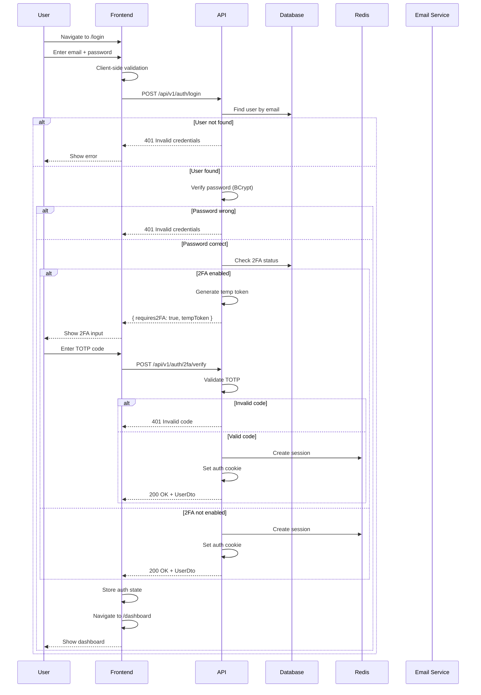

### OAuth Flow

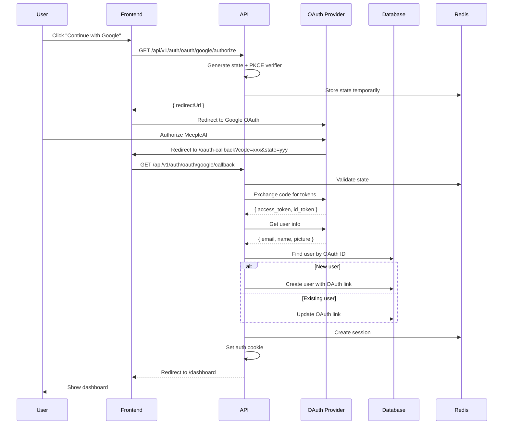

---

## Library Management Flows

### Add Game with Quota Check

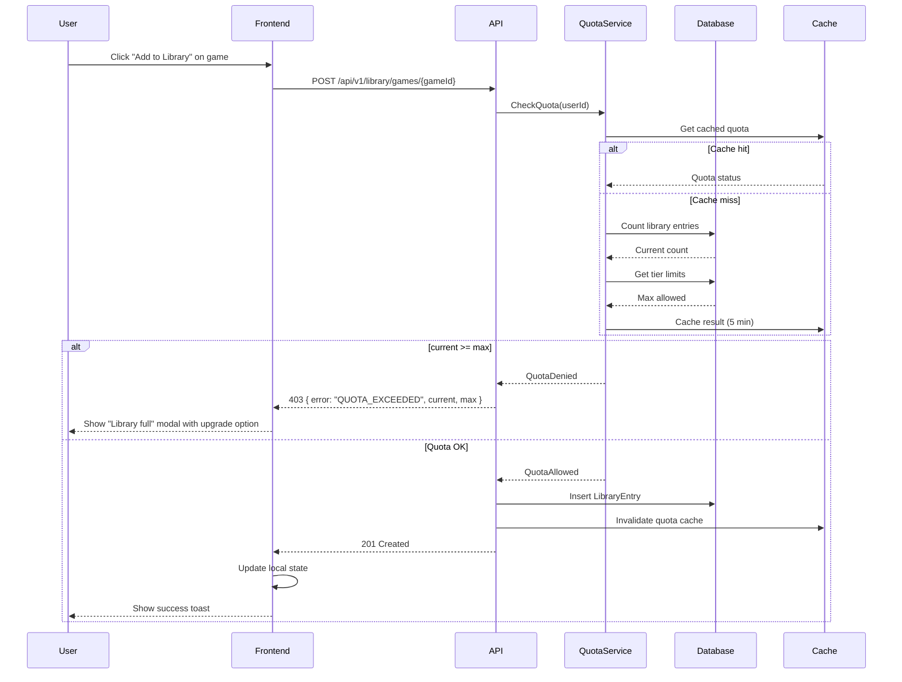

### Upload Custom PDF

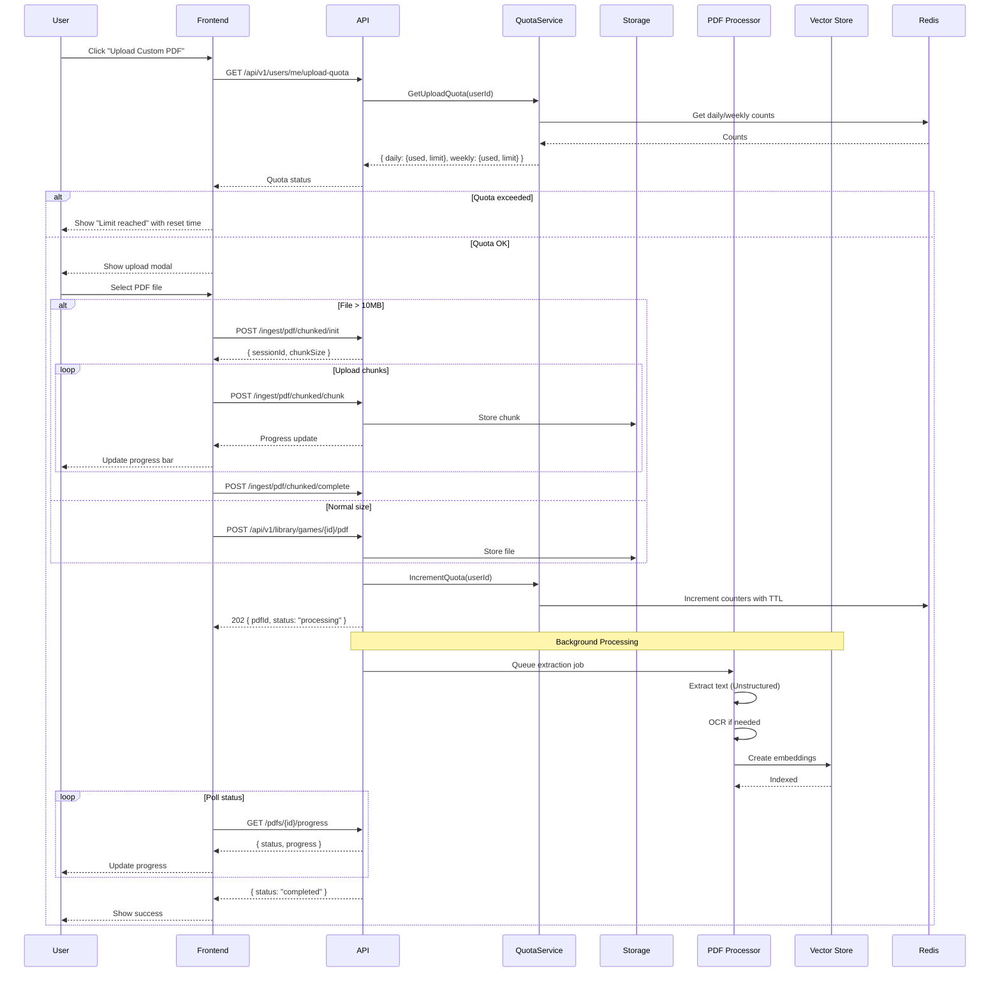

---

## AI Chat Flows

### RAG Question with Streaming

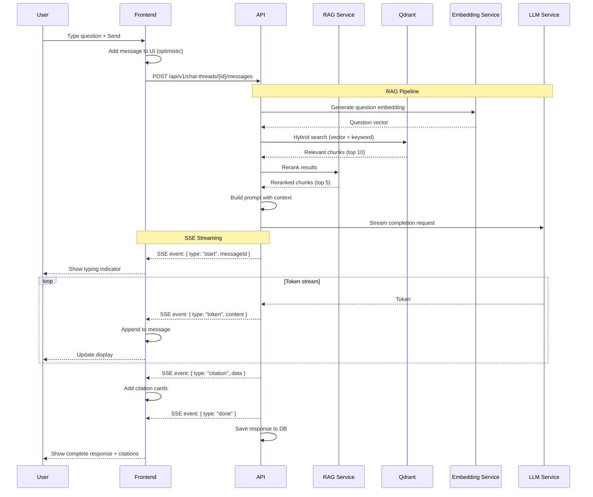

### Thread Management

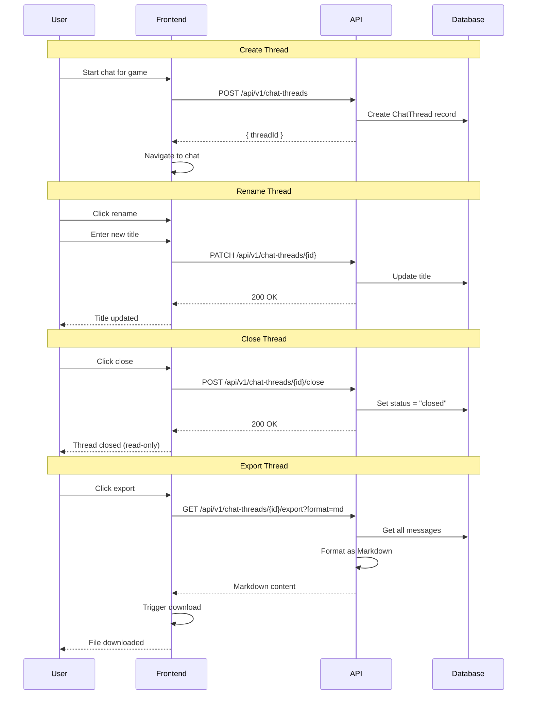

---

## Game Session Flows

### Session with State Tracking

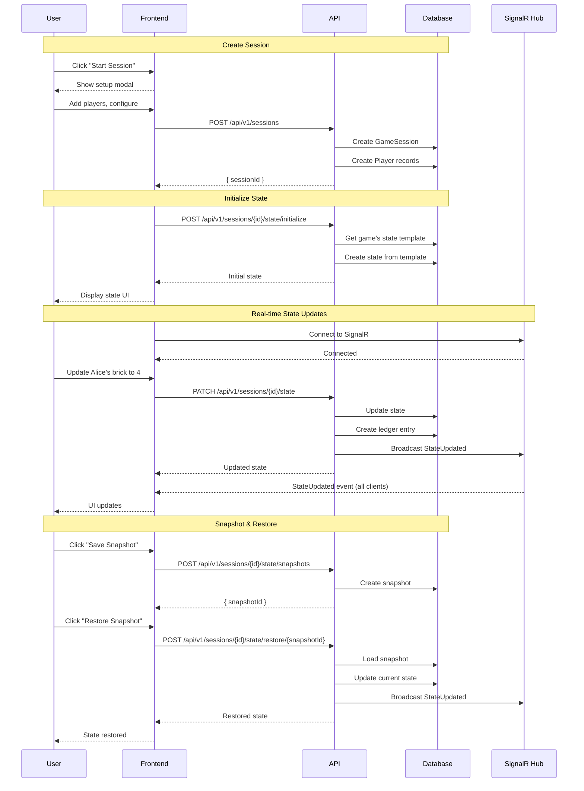

---

## Editor Flows

### Game Publication Workflow

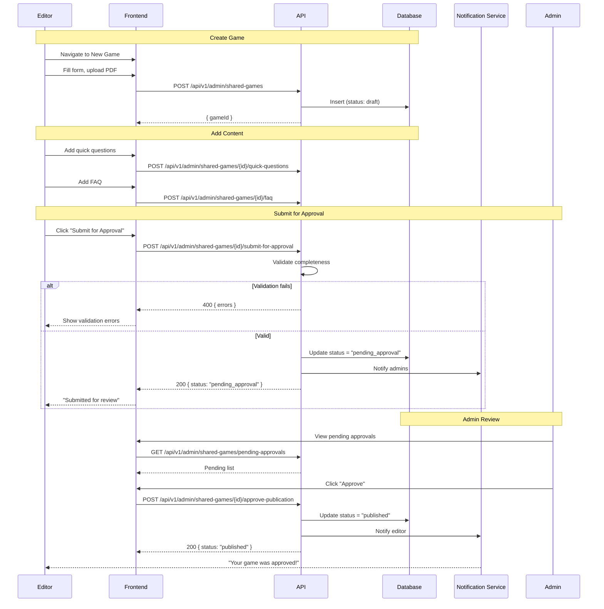

---

## Admin Flows

### User Tier Management

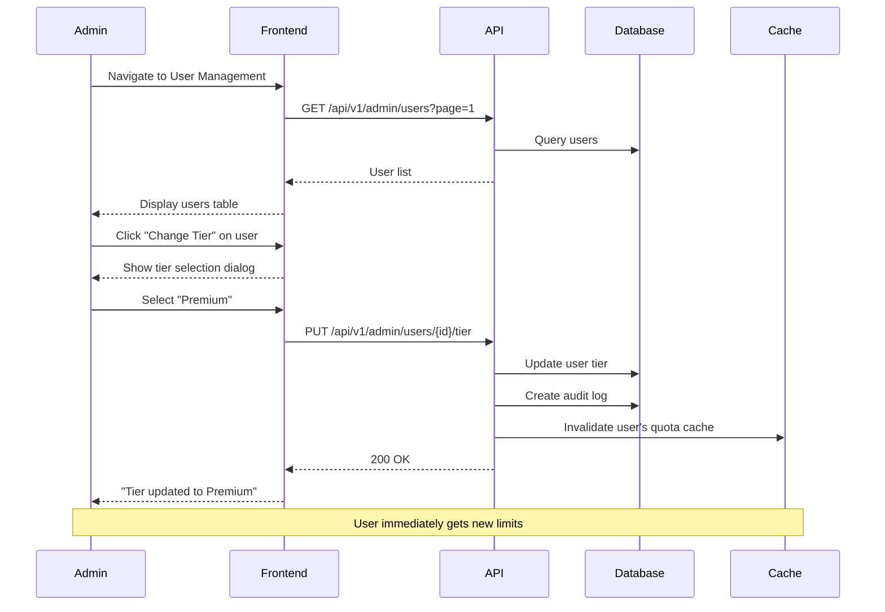

### System Configuration Flow

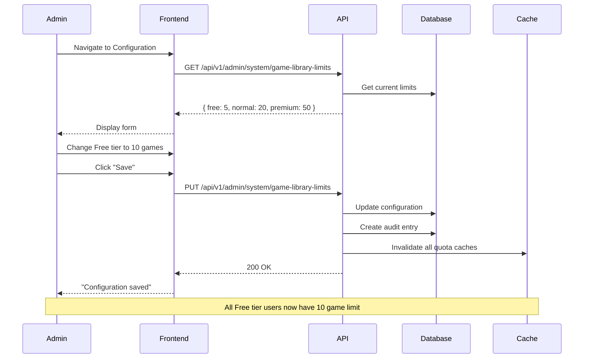

---

## Error Handling Patterns

### Generic Error Flow

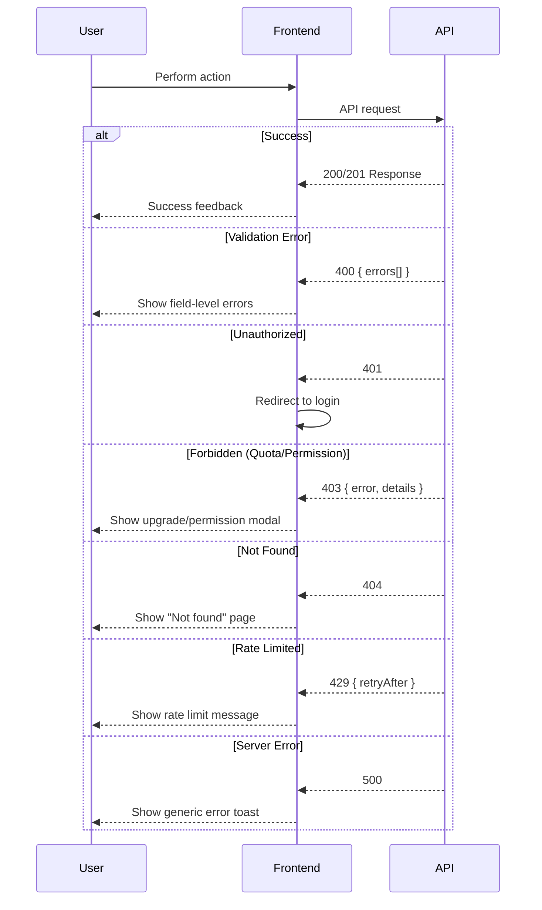

---

*Last Updated: 2026-01-19*
