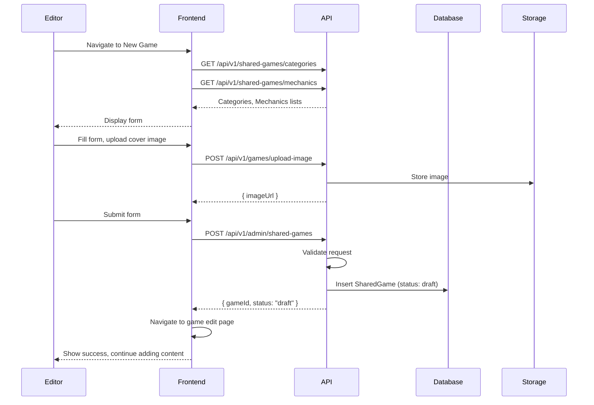
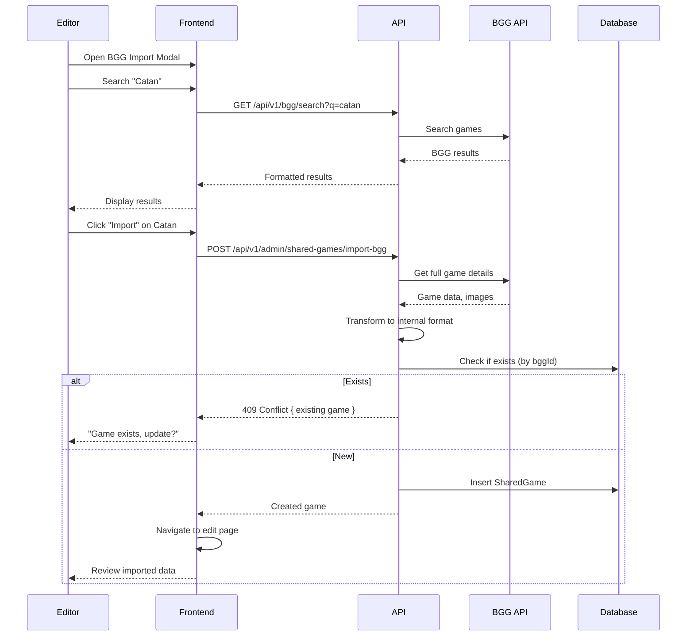

# Editor: Game Management Flows

> Editor flows for creating and managing games in the shared catalog.

## Table of Contents

- [Create Game](#create-game)
- [Edit Game](#edit-game)
- [Import from BGG](#import-from-bgg)
- [Bulk Import](#bulk-import)
- [Archive Game](#archive-game)

---

## Role: Editor

**Capabilities:**
- Create new games in shared catalog
- Edit game metadata
- Import games from BoardGameGeek
- Upload and manage game PDFs
- Create FAQ, errata, quick questions
- Submit games for publication approval
- **Cannot**: Approve publications, manage users, system configuration

**Quota Bypass:** Editors have unlimited PDF uploads and library quota.

---

## Create Game

### User Story

```gherkin
Feature: Create New Game
  As an editor
  I want to create a new game entry
  So that it becomes available in the catalog

  Scenario: Create game manually
    Given I am logged in as an editor
    When I navigate to Admin → Shared Games → New
    And I fill in the game details
    And I submit the form
    Then the game is created in "draft" status
    And I can continue adding PDFs and content

  Scenario: Create game from BGG
    When I search for a game on BoardGameGeek
    And I select it
    Then the form is pre-filled with BGG data
    And I can adjust and save

  Scenario: Validation errors
    When I submit with missing required fields
    Then I see validation errors
    And I must fix them to proceed
```

### Screen Flow

```
Admin Dashboard → Shared Games → [+ New Game]
                                      ↓
                              Game Form Page
                              ┌─────────────────────────┐
                              │ Basic Info              │
                              │ • Name*                 │
                              │ • Description           │
                              │ • Publisher             │
                              │ • Year                  │
                              ├─────────────────────────┤
                              │ Game Details            │
                              │ • Players: [2] to [4]   │
                              │ • Duration: [60]-[120]  │
                              │ • Complexity: [2.5]     │
                              ├─────────────────────────┤
                              │ Classification          │
                              │ • Categories [+ Add]    │
                              │ • Mechanics [+ Add]     │
                              ├─────────────────────────┤
                              │ Media                   │
                              │ • Cover Image [Upload]  │
                              │ • BGG Link              │
                              ├─────────────────────────┤
                              │ [Cancel] [Save Draft]   │
                              │ [Save & Add Documents]  │
                              └─────────────────────────┘
```

### Sequence Diagram



### API Flow

| Step | Endpoint | Method | Body | Response |
|------|----------|--------|------|----------|
| 1 | `/api/v1/shared-games/categories` | GET | - | Categories list |
| 2 | `/api/v1/shared-games/mechanics` | GET | - | Mechanics list |
| 3 | `/api/v1/games/upload-image` | POST | Image file | `{ imageUrl }` |
| 4 | `/api/v1/admin/shared-games` | POST | Game data | Created game |

**Create Game Request:**
```json
{
  "name": "Catan",
  "description": "Trade, build, settle...",
  "publisher": "Kosmos",
  "yearPublished": 1995,
  "minPlayers": 2,
  "maxPlayers": 4,
  "minPlayTime": 60,
  "maxPlayTime": 120,
  "complexity": 2.3,
  "coverImageUrl": "https://storage.../catan.jpg",
  "bggId": 13,
  "categoryIds": ["uuid-strategy", "uuid-negotiation"],
  "mechanicIds": ["uuid-trading", "uuid-dice"]
}
```

**Response:**
```json
{
  "id": "uuid",
  "name": "Catan",
  "status": "draft",
  "createdAt": "2026-01-19T10:00:00Z",
  "createdBy": "editor-uuid"
}
```

### Implementation Status

| Component | Status | Location |
|-----------|--------|----------|
| Create Endpoint | ✅ Implemented | `SharedGameCatalogEndpoints.cs` |
| Image Upload | ✅ Implemented | `GameEndpoints.cs` |
| New Game Page | ✅ Implemented | `/app/admin/shared-games/new/page.tsx` |
| GameForm | ✅ Implemented | `GameForm.tsx` |

---

## Edit Game

### User Story

```gherkin
Feature: Edit Game
  As an editor
  I want to edit game details
  So that I can correct or update information

  Scenario: Edit basic info
    Given I have a game in draft status
    When I update the description
    And I save
    Then the changes are saved
    And an audit entry is created

  Scenario: Edit published game
    Given a game is published
    When I edit it
    Then changes go into a "pending review" queue
    And admin must approve changes

  Scenario: Revert changes
    When I make changes but want to revert
    Then I can discard unsaved changes
```

### Screen Flow

```
Admin → Shared Games → [Game Row] → [Edit]
                                        ↓
                                Edit Game Page
                                (Same form as create)
                                        ↓
                               [Save Changes]
                                        ↓
                    Draft → Saved immediately
                    Published → Queued for review
```

### API Flow

| Endpoint | Method | Body | Description |
|----------|--------|------|-------------|
| `/api/v1/admin/shared-games/{id}` | GET | - | Get game for editing |
| `/api/v1/admin/shared-games/{id}` | PUT | Updated data | Save changes |

### Implementation Status

| Component | Status | Location |
|-----------|--------|----------|
| Update Endpoint | ✅ Implemented | `SharedGameCatalogEndpoints.cs` |
| Edit Page | ✅ Implemented | `/app/admin/shared-games/[id]/page.tsx` |

---

## Import from BGG

### User Story

```gherkin
Feature: Import from BoardGameGeek
  As an editor
  I want to import game data from BGG
  So that I don't have to enter data manually

  Scenario: Search and import
    When I search for "Catan" on BGG
    Then I see matching games from BGG
    When I select one
    Then the game is created with BGG data
    And images are imported
    And I can edit before saving

  Scenario: Game already exists
    When I try to import a game that exists
    Then I see a warning
    And I can choose to update or skip
```

### Screen Flow

```
Admin → Shared Games → [Import from BGG]
                            ↓
                    BGG Search Modal
                    ┌─────────────────────┐
                    │ Search BGG:         │
                    │ [Catan________] [🔍]│
                    ├─────────────────────┤
                    │ Results:            │
                    │ • Catan (1995)      │
                    │   BGG ID: 13        │
                    │   [Import]          │
                    │ • Catan Junior      │
                    │   BGG ID: 125921    │
                    │   [Import]          │
                    └─────────────────────┘
                            ↓
                    Importing... (progress)
                            ↓
                    Edit imported data
                            ↓
                    [Save]
```

### Sequence Diagram



### API Flow

| Endpoint | Method | Body | Description |
|----------|--------|------|-------------|
| `/api/v1/bgg/search` | GET | `?q=term` | Search BGG |
| `/api/v1/admin/shared-games/import-bgg` | POST | `{ bggId }` | Import from BGG |

**Import Request:**
```json
{
  "bggId": 13,
  "overwriteIfExists": false
}
```

### Implementation Status

| Component | Status | Location |
|-----------|--------|----------|
| BGG Search | ✅ Implemented | BGG Client |
| Import Endpoint | ✅ Implemented | `SharedGameCatalogEndpoints.cs` |
| BggSearchModal | ✅ Implemented | `BggSearchModal.tsx` |
| Import Page | ✅ Implemented | `/app/admin/shared-games/import/page.tsx` |

---

## Bulk Import

### User Story

```gherkin
Feature: Bulk Import Games
  As an editor
  I want to import multiple games at once
  So that I can quickly populate the catalog

  Scenario: Import from CSV
    When I upload a CSV with game data
    Then each row is validated
    And valid games are imported
    And I see a report of successes/failures

  Scenario: Bulk BGG import
    When I enter multiple BGG IDs
    Then all games are imported in batch
    And I see progress for each
```

### Screen Flow

```
Admin → Shared Games → [Bulk Import]
                            ↓
                    Bulk Import Page
                    ┌─────────────────────────┐
                    │ Import Method:          │
                    │ ○ CSV Upload            │
                    │ ○ BGG IDs               │
                    ├─────────────────────────┤
                    │ CSV Upload:             │
                    │ [Drop CSV here]         │
                    │ [Download Template]     │
                    ├─────────────────────────┤
                    │ BGG IDs:                │
                    │ [13, 125921, 30549]     │
                    ├─────────────────────────┤
                    │ [Import]                │
                    └─────────────────────────┘
                            ↓
                    Progress Report
                    ✅ Catan - Imported
                    ✅ Ticket to Ride - Imported
                    ❌ Unknown ID 99999 - Failed
```

### API Flow

| Endpoint | Method | Body | Description |
|----------|--------|------|-------------|
| `/api/v1/admin/shared-games/bulk-import` | POST | CSV or IDs | Bulk import |

**Bulk Import Request:**
```json
{
  "source": "bgg",
  "bggIds": [13, 125921, 30549]
}
```

**Response:**
```json
{
  "total": 3,
  "successful": 2,
  "failed": 1,
  "results": [
    { "bggId": 13, "status": "success", "gameId": "uuid" },
    { "bggId": 125921, "status": "success", "gameId": "uuid" },
    { "bggId": 99999, "status": "failed", "error": "Not found on BGG" }
  ]
}
```

### Implementation Status

| Component | Status | Location |
|-----------|--------|----------|
| Bulk Import Endpoint | ✅ Implemented | `SharedGameCatalogEndpoints.cs` |
| Import Page | ✅ Implemented | `/app/admin/shared-games/import/page.tsx` |

---

## Archive Game

### User Story

```gherkin
Feature: Archive Game
  As an editor
  I want to archive games that are no longer relevant
  So that they don't clutter the catalog

  Scenario: Archive game (soft delete)
    Given I want to remove a game
    When I click "Archive"
    And I confirm
    Then the game is hidden from public catalog
    But data is preserved
    And admin can restore it

  Scenario: Request permanent delete
    When I request permanent deletion
    Then it goes to admin approval queue
    And admin decides whether to delete
```

### Screen Flow

```
Game Edit → [...] → [Archive Game]
                         ↓
                 Confirmation Dialog
                 "Archive Catan?"
                 "Game will be hidden but data preserved"
                         ↓
                [Cancel] [Archive]
                         ↓
                 Game archived
                 (Hidden from catalog)
```

### API Flow

| Endpoint | Method | Description |
|----------|--------|-------------|
| `/api/v1/admin/shared-games/{id}/archive` | POST | Archive (soft delete) |
| `/api/v1/admin/shared-games/{id}` | DELETE | Request permanent delete |

### Implementation Status

| Component | Status | Location |
|-----------|--------|----------|
| Archive Endpoint | ✅ Implemented | `SharedGameCatalogEndpoints.cs` |
| Delete Request | ✅ Implemented | Same file |

---

## Gap Analysis

### Implemented Features
- [x] Create game manually
- [x] Edit game details
- [x] Import from BGG
- [x] Bulk import
- [x] Archive game
- [x] Image upload
- [x] Category/mechanic assignment

### Missing/Partial Features
- [ ] **Version History**: No edit history tracking
- [ ] **Draft Preview**: Can't preview how game looks before publishing
- [ ] **Duplicate Detection**: No warning for similar game names
- [ ] **Merge Games**: Can't merge duplicate entries
- [ ] **Translation Support**: No multi-language game info

### Proposed Enhancements
1. **Version History**: Track all edits with who/when
2. **Draft Preview**: Show how game will appear in catalog
3. **Duplicate Checker**: Warn when creating similar games
4. **Batch Edit**: Edit multiple games at once
5. **Import Queue**: Background processing for large imports
