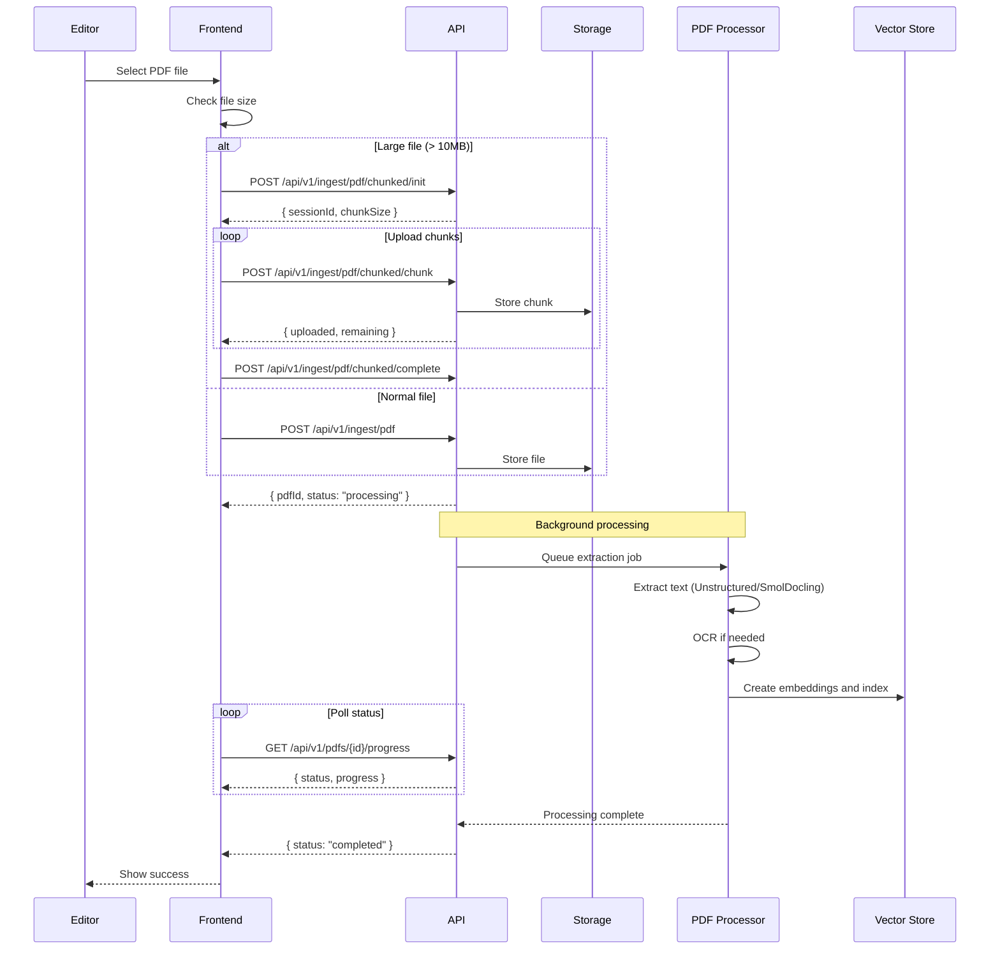

# Editor: Document Management Flows

> Editor flows for managing game PDFs and documents.

## Table of Contents

- [Upload Game PDF](#upload-game-pdf)
- [Manage Document Versions](#manage-document-versions)
- [Process and Index](#process-and-index)
- [Generate Rule Spec](#generate-rule-spec)

---

## Upload Game PDF

### User Story

```gherkin
Feature: Upload Game PDF
  As an editor
  I want to upload PDF rulebooks for games
  So that users can access them and AI can learn from them

  Scenario: Upload single PDF
    Given I am editing a game
    When I upload a PDF file
    Then the file is stored
    And processing begins (extraction, indexing)
    And I see progress status

  Scenario: Upload multiple language versions
    When I upload an English PDF
    And I upload an Italian PDF
    Then both versions are stored
    And I can set which is active/default

  Scenario: Upload large PDF (chunked)
    Given the PDF is larger than 10MB
    When I upload it
    Then chunked upload is used
    And I see upload progress
```

### Screen Flow

```
Game Edit → Documents Tab → [Upload PDF]
                                ↓
                        Upload Modal
                        ┌─────────────────────────┐
                        │ Upload Rulebook         │
                        ├─────────────────────────┤
                        │ [Drop PDF here]         │
                        │ or [Browse...]          │
                        ├─────────────────────────┤
                        │ Document Type:          │
                        │ [Rulebook ▼]            │
                        │ Language: [English ▼]   │
                        │ Version: [1.0_____]     │
                        ├─────────────────────────┤
                        │ [Cancel] [Upload]       │
                        └─────────────────────────┘
                                ↓
                        Uploading... [████████░░] 80%
                                ↓
                        Processing...
                        • Extracting text ✓
                        • OCR (if needed) ✓
                        • Indexing...
                                ↓
                        Upload Complete ✓
```

### Sequence Diagram



### API Flow

| Step | Endpoint | Method | Description |
|------|----------|--------|-------------|
| 1 | `/api/v1/ingest/pdf` | POST | Upload PDF (standard) |
| 1a | `/api/v1/ingest/pdf/chunked/init` | POST | Initialize chunked upload |
| 1b | `/api/v1/ingest/pdf/chunked/chunk` | POST | Upload chunk |
| 1c | `/api/v1/ingest/pdf/chunked/complete` | POST | Complete chunked upload |
| 2 | `/api/v1/pdfs/{id}/progress` | GET | Check processing status |

**Upload Request (multipart/form-data):**
```
file: [PDF binary]
gameId: uuid
documentType: "rulebook" | "quickstart" | "reference" | "faq"
language: "en" | "it" | "de" | ...
version: "1.0"
```

**Processing Status Response:**
```json
{
  "pdfId": "uuid",
  "status": "processing",
  "progress": {
    "extraction": "completed",
    "ocr": "completed",
    "indexing": "in_progress",
    "percentComplete": 75
  },
  "estimatedTimeRemaining": 30
}
```

### Implementation Status

| Component | Status | Location |
|-----------|--------|----------|
| Standard Upload | ✅ Implemented | `PdfEndpoints.cs` |
| Chunked Upload | ✅ Implemented | Same file |
| Processing Progress | ✅ Implemented | Same file |
| PDF Processor | ✅ Implemented | Unstructured/SmolDocling services |
| Upload UI | ✅ Implemented | `PdfUploadForm.tsx` |
| Progress UI | ✅ Implemented | `ProcessingProgress.tsx` |

---

## Manage Document Versions

### User Story

```gherkin
Feature: Manage Document Versions
  As an editor
  I want to manage multiple versions of documents
  So that users can access the correct version

  Scenario: Upload new version
    Given a game has an existing PDF
    When I upload a new version
    Then both versions are kept
    And I can set which is "active"

  Scenario: Set active version
    Given multiple versions exist
    When I set v2.0 as active
    Then users see v2.0 by default
    And v1.0 remains accessible

  Scenario: Delete old version
    When I delete v1.0
    And it's not the active version
    Then v1.0 is removed
    And v2.0 remains active
```

### Screen Flow

```
Game Edit → Documents Tab
                │
        Document List:
        ┌────────────────────────────────────────┐
        │ Rulebook (English)                     │
        │ ├─ v2.0 ⭐ Active    [Set Active] [🗑] │
        │ └─ v1.0             [Set Active] [🗑] │
        │                                        │
        │ Rulebook (Italian)                     │
        │ └─ v1.0 ⭐ Active    [Set Active] [🗑] │
        │                                        │
        │ [+ Upload New Document]                │
        └────────────────────────────────────────┘
```

### API Flow

| Endpoint | Method | Description |
|----------|--------|-------------|
| `/api/v1/admin/shared-games/{id}/documents` | GET | List all documents |
| `/api/v1/admin/shared-games/{id}/documents/active` | GET | Get active documents |
| `/api/v1/admin/shared-games/{id}/documents` | POST | Add document |
| `/api/v1/admin/shared-games/{id}/documents/{docId}/set-active` | POST | Set as active |
| `/api/v1/admin/shared-games/{id}/documents/{docId}` | DELETE | Remove document |

**Documents Response:**
```json
{
  "documents": [
    {
      "id": "uuid",
      "type": "rulebook",
      "language": "en",
      "version": "2.0",
      "isActive": true,
      "uploadedAt": "2026-01-19T10:00:00Z",
      "fileSize": 5242880,
      "pageCount": 24
    },
    {
      "id": "uuid",
      "type": "rulebook",
      "language": "en",
      "version": "1.0",
      "isActive": false,
      "uploadedAt": "2025-06-01T10:00:00Z"
    }
  ]
}
```

### Implementation Status

| Component | Status | Location |
|-----------|--------|----------|
| Documents Endpoints | ✅ Implemented | `SharedGameCatalogEndpoints.cs` |
| Set Active | ✅ Implemented | Same file |
| PdfDocumentList | ✅ Implemented | `PdfDocumentList.tsx` |

---

## Process and Index

### User Story

```gherkin
Feature: Process and Index PDF
  As an editor
  I want to process PDFs for AI indexing
  So that the AI can answer questions about the rules

  Scenario: Re-index existing PDF
    Given a PDF was uploaded before improvements
    When I click "Re-index"
    Then new embeddings are generated
    And search quality improves

  Scenario: Extract text manually
    When I click "Extract Text"
    Then I see the extracted text
    And I can review/edit it
    And I can re-index with corrections

  Scenario: Cancel processing
    Given processing is in progress
    When I click "Cancel"
    Then processing stops
    And the PDF remains in unprocessed state
```

### Screen Flow

```
Documents → Document Row → [...] Menu
                              │
              ┌───────────────┼───────────────┐
              ↓               ↓               ↓
         [View Text]    [Re-index]      [Cancel Processing]
              ↓               ↓               ↓
         Text Modal      Indexing...     Stopped
```

### API Flow

| Endpoint | Method | Description |
|----------|--------|-------------|
| `/api/v1/ingest/pdf/{id}/index` | POST | Index/re-index PDF |
| `/api/v1/ingest/pdf/{id}/extract` | POST | Extract text only |
| `/api/v1/pdfs/{id}/text` | GET | View extracted text |
| `/api/v1/pdfs/{id}/processing` | DELETE | Cancel processing |

### Implementation Status

| Component | Status | Location |
|-----------|--------|----------|
| Index Endpoint | ✅ Implemented | `PdfEndpoints.cs` |
| Extract Endpoint | ✅ Implemented | Same file |
| Cancel Processing | ✅ Implemented | Same file |
| Text View | ✅ Implemented | Same file |

---

## Generate Rule Spec

### User Story

```gherkin
Feature: Generate Rule Specification
  As an editor
  I want to generate structured rule specifications
  So that the AI has better structured knowledge

  Scenario: Generate from PDF
    Given a game has an indexed PDF
    When I click "Generate Rule Spec"
    Then AI analyzes the PDF
    And creates a structured rule specification
    And I can review and edit it

  Scenario: Edit rule spec
    Given a rule spec exists
    When I edit it manually
    Then my changes are saved
    And AI uses the updated spec
```

### Screen Flow

```
Documents → [Generate Rule Spec]
                    ↓
            Generating...
            (AI processing)
                    ↓
            Rule Spec Editor
            ┌─────────────────────────────┐
            │ Game: Catan                 │
            ├─────────────────────────────┤
            │ Setup:                      │
            │ • Place board in center     │
            │ • Each player takes...      │
            ├─────────────────────────────┤
            │ Turn Structure:             │
            │ 1. Roll dice                │
            │ 2. Collect resources        │
            │ 3. Trade/Build              │
            ├─────────────────────────────┤
            │ [Regenerate] [Save]         │
            └─────────────────────────────┘
```

### API Flow

| Endpoint | Method | Description |
|----------|--------|-------------|
| `/api/v1/ingest/pdf/{id}/rulespec` | POST | Generate rule spec |

**Rule Spec Response:**
```json
{
  "id": "uuid",
  "gameId": "uuid",
  "sections": [
    {
      "title": "Setup",
      "content": "Place the board in the center...",
      "subsections": [...]
    },
    {
      "title": "Turn Structure",
      "steps": ["Roll dice", "Collect resources", "Trade/Build"]
    }
  ],
  "generatedAt": "2026-01-19T10:00:00Z"
}
```

### Implementation Status

| Component | Status | Location |
|-----------|--------|----------|
| Rule Spec Endpoint | ✅ Implemented | `PdfEndpoints.cs` |
| Rule Spec UI | ⚠️ Partial | Basic implementation |

---

## Gap Analysis

### Implemented Features
- [x] Standard PDF upload
- [x] Chunked upload for large files
- [x] Processing progress tracking
- [x] Multiple document versions
- [x] Set active version
- [x] Text extraction
- [x] Vector indexing
- [x] Rule spec generation
- [x] Cancel processing

### Missing/Partial Features
- [ ] **OCR Quality Review**: Can't review/correct OCR output
- [ ] **Batch Upload**: Upload multiple PDFs at once
- [ ] **PDF Preview**: Preview PDF before upload
- [ ] **Extraction Settings**: Configure extraction parameters
- [ ] **Version Comparison**: Compare text between versions
- [ ] **Automatic Language Detection**: Auto-detect PDF language

### Proposed Enhancements
1. **OCR Review**: Allow editors to correct OCR errors
2. **Extraction Quality Score**: Show confidence in extraction
3. **Smart Versioning**: Auto-increment version numbers
4. **PDF Comparison**: Side-by-side comparison of versions
5. **Batch Operations**: Process multiple PDFs in parallel
