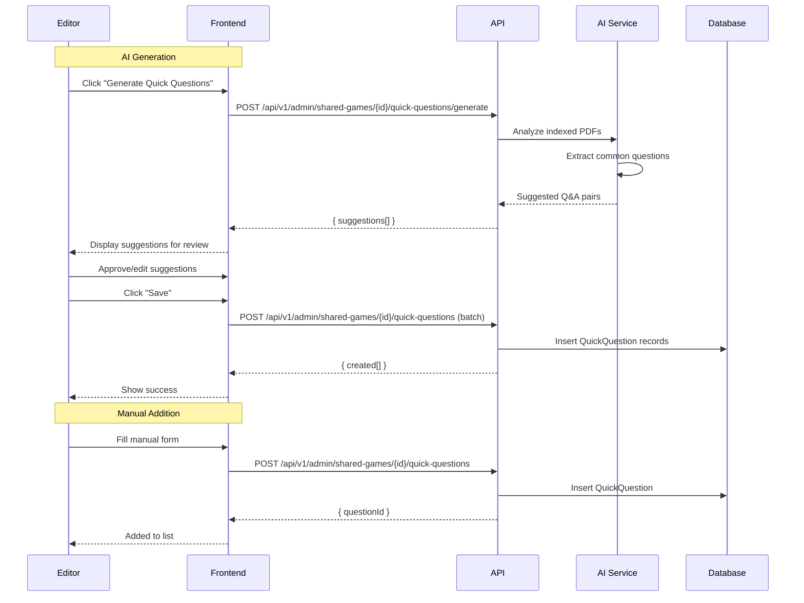
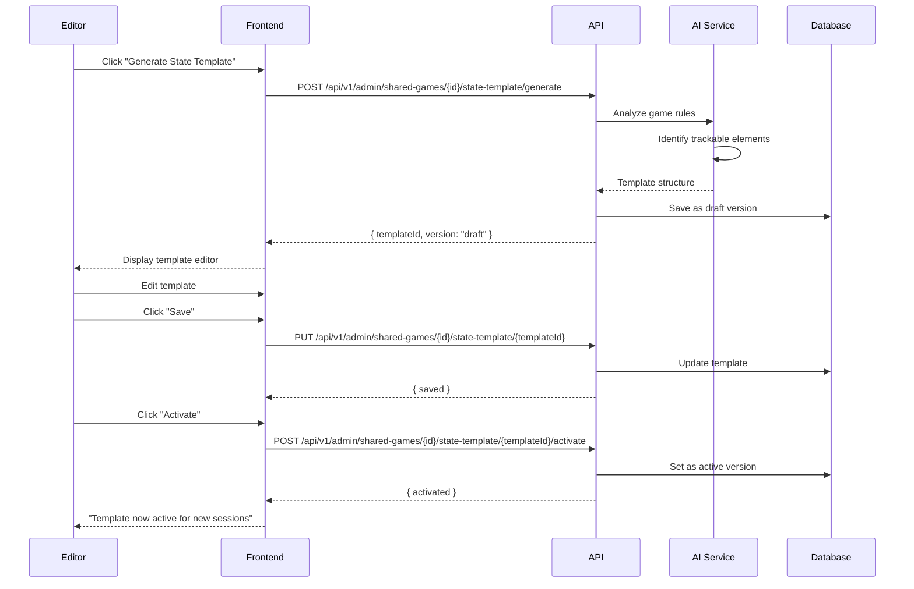

# Editor: Content Management Flows

> Editor flows for managing FAQ, errata, quick questions, and state templates.

## Table of Contents

- [Quick Questions Management](#quick-questions-management)
- [FAQ Management](#faq-management)
- [Errata Management](#errata-management)
- [State Template Management](#state-template-management)

---

## Quick Questions Management

### User Story

```gherkin
Feature: Manage Quick Questions
  As an editor
  I want to create quick questions for games
  So that users can quickly find common answers

  Scenario: Generate with AI
    Given a game has indexed PDFs
    When I click "Generate Quick Questions"
    Then AI analyzes the rules
    And suggests common questions with answers
    And I can review and edit them

  Scenario: Add manually
    When I click "Add Quick Question"
    And I enter question and answer
    Then it's added to the game's quick questions

  Scenario: Edit/Delete
    When I edit or delete a quick question
    Then the changes are saved
    And users see the updated list
```

### Screen Flow

```
Game Edit → Quick Questions Tab
                │
    ┌───────────┴───────────┐
    ↓                       ↓
[Generate with AI]    [+ Add Manually]
    ↓                       ↓
AI generates          Manual Entry Form
suggestions           ┌─────────────────┐
    ↓                 │ Category:       │
Review & Edit         │ [Setup ▼]       │
    ↓                 │ Question:       │
Save approved         │ [____________]  │
                      │ Answer:         │
                      │ [____________]  │
                      │ [Cancel] [Save] │
                      └─────────────────┘
```

### Sequence Diagram



### API Flow

| Endpoint | Method | Body | Description |
|----------|--------|------|-------------|
| `/api/v1/admin/shared-games/{id}/quick-questions/generate` | POST | - | AI generate |
| `/api/v1/admin/shared-games/{id}/quick-questions` | POST | Q&A data | Add manually |
| `/api/v1/admin/quick-questions/{questionId}` | PUT | Updated data | Edit |
| `/api/v1/admin/quick-questions/{questionId}` | DELETE | - | Delete |

**Quick Question Request:**
```json
{
  "question": "How do I set up the game?",
  "answer": "Place the board in the center of the table...",
  "category": "Setup",
  "order": 1
}
```

### Implementation Status

| Component | Status | Location |
|-----------|--------|----------|
| Generate Endpoint | ✅ Implemented | `SharedGameCatalogEndpoints.cs` |
| CRUD Endpoints | ✅ Implemented | Same file |
| QuickQuestionGenerator | ✅ Implemented | `QuickQuestionGenerator.tsx` |
| QuickQuestionEditor | ✅ Implemented | `QuickQuestionEditor.tsx` |

---

## FAQ Management

### User Story

```gherkin
Feature: Manage FAQ
  As an editor
  I want to manage frequently asked questions
  So that users can find detailed answers

  Scenario: Add FAQ
    When I add a new FAQ entry
    With question, answer, and tags
    Then it appears in the game's FAQ section

  Scenario: Categorize FAQ
    When I assign categories to FAQ entries
    Then users can filter by category

  Scenario: Rich text answers
    When I write an FAQ answer
    I can use formatting (bold, lists, links)
    And it renders nicely for users
```

### Screen Flow

```
Game Edit → FAQ Tab
              │
        FAQ List:
        ┌────────────────────────────────────┐
        │ Setup (3 questions)                │
        │ ├─ How many players? [Edit] [🗑]   │
        │ ├─ Initial resources? [Edit] [🗑]  │
        │ └─ Board setup? [Edit] [🗑]        │
        │                                    │
        │ Gameplay (5 questions)             │
        │ ├─ Turn order? [Edit] [🗑]         │
        │ └─ ...                             │
        │                                    │
        │ [+ Add FAQ]                        │
        └────────────────────────────────────┘
```

### API Flow

| Endpoint | Method | Body | Description |
|----------|--------|------|-------------|
| `/api/v1/admin/shared-games/{id}/faq` | POST | FAQ data | Add FAQ |
| `/api/v1/admin/shared-games/{id}/faq/{faqId}` | PUT | Updated data | Edit FAQ |
| `/api/v1/admin/shared-games/{id}/faq/{faqId}` | DELETE | - | Delete FAQ |

**FAQ Request:**
```json
{
  "question": "Can I trade on another player's turn?",
  "answer": "No, trading is only allowed during your own turn...",
  "category": "Trading",
  "tags": ["trading", "turns", "rules"]
}
```

### Implementation Status

| Component | Status | Location |
|-----------|--------|----------|
| FAQ Endpoints | ✅ Implemented | `SharedGameCatalogEndpoints.cs` |
| FAQ UI | ⚠️ Partial | Basic implementation |

---

## Errata Management

### User Story

```gherkin
Feature: Manage Errata
  As an editor
  I want to document rule corrections
  So that users know about official fixes

  Scenario: Add errata
    When I add an errata entry
    With original text, corrected text, and source
    Then it appears in the errata list

  Scenario: Link to page
    When I specify page number
    Then the errata references the specific location

  Scenario: Mark as official
    When errata comes from publisher
    I can mark it as "Official"
    And it's highlighted to users
```

### Screen Flow

```
Game Edit → Errata Tab
               │
         Errata List:
         ┌──────────────────────────────────────────┐
         │ Errata #1 (Page 12) [Official] [Edit] [🗑]│
         │ Original: "Roll two dice"                │
         │ Corrected: "Roll three dice"             │
         │ Source: Publisher FAQ 2025              │
         ├──────────────────────────────────────────┤
         │ Errata #2 (Page 5) [Edit] [🗑]           │
         │ Original: "Draw 3 cards"                 │
         │ Corrected: "Draw 2 cards"                │
         │ Source: BGG clarification               │
         ├──────────────────────────────────────────┤
         │ [+ Add Errata]                           │
         └──────────────────────────────────────────┘
```

### API Flow

| Endpoint | Method | Body | Description |
|----------|--------|------|-------------|
| `/api/v1/admin/shared-games/{id}/errata` | POST | Errata data | Add errata |
| `/api/v1/admin/shared-games/{id}/errata/{errataId}` | PUT | Updated data | Edit |
| `/api/v1/admin/shared-games/{id}/errata/{errataId}` | DELETE | - | Delete |

**Errata Request:**
```json
{
  "pageNumber": 12,
  "originalText": "Roll two dice",
  "correctedText": "Roll three dice",
  "source": "Publisher FAQ 2025",
  "isOfficial": true
}
```

### Implementation Status

| Component | Status | Location |
|-----------|--------|----------|
| Errata Endpoints | ✅ Implemented | `SharedGameCatalogEndpoints.cs` |
| Errata UI | ⚠️ Partial | Basic implementation |

---

## State Template Management

### User Story

```gherkin
Feature: Manage State Templates
  As an editor
  I want to create state templates for games
  So that users can track game state in sessions

  Scenario: Generate template with AI
    Given a game has indexed PDFs
    When I click "Generate State Template"
    Then AI analyzes game rules
    And suggests a state structure
    And I can review and edit it

  Scenario: Edit template
    When I edit the state template
    I can define:
    - Player fields (resources, scores)
    - Shared fields (turn counter, phase)
    - Validations and constraints

  Scenario: Activate template version
    When I have multiple template versions
    And I activate a new version
    Then new sessions use the new template
    And existing sessions keep their template
```

### Screen Flow

```
Game Edit → State Template Tab
                 │
    ┌────────────┴────────────┐
    ↓                         ↓
[Generate with AI]      Template Editor
    ↓                   ┌─────────────────────────┐
Processing...           │ Player State Fields:    │
    ↓                   │ ├─ resources: object    │
    ↓                   │ │  ├─ brick: number     │
    ↓                   │ │  ├─ wood: number      │
    ↓                   │ │  └─ ...               │
    ↓                   │ ├─ score: number        │
    ↓                   │ └─ settlements: number  │
Generated Template      │                         │
    ↓                   │ Shared State Fields:    │
Review & Edit           │ ├─ currentTurn: number  │
    ↓                   │ ├─ phase: string        │
[Save] [Activate]       │ └─ robberPosition: obj  │
                        │                         │
                        │ [+ Add Field]           │
                        └─────────────────────────┘
```

### Sequence Diagram



### API Flow

| Endpoint | Method | Description |
|----------|--------|-------------|
| `/api/v1/admin/shared-games/{id}/state-template` | GET | Get active template |
| `/api/v1/admin/shared-games/{id}/state-template/versions` | GET | List all versions |
| `/api/v1/admin/shared-games/{id}/state-template/generate` | POST | AI generate |
| `/api/v1/admin/shared-games/{id}/state-template/{id}` | PUT | Update template |
| `/api/v1/admin/shared-games/{id}/state-template/{id}/activate` | POST | Activate version |

**State Template Structure:**
```json
{
  "id": "uuid",
  "version": "1.0",
  "playerState": {
    "resources": {
      "type": "object",
      "properties": {
        "brick": { "type": "number", "default": 0, "min": 0 },
        "wood": { "type": "number", "default": 0, "min": 0 },
        "wheat": { "type": "number", "default": 0, "min": 0 },
        "ore": { "type": "number", "default": 0, "min": 0 },
        "sheep": { "type": "number", "default": 0, "min": 0 }
      }
    },
    "score": { "type": "number", "default": 0 },
    "settlements": { "type": "number", "default": 0, "max": 5 },
    "cities": { "type": "number", "default": 0, "max": 4 }
  },
  "sharedState": {
    "currentTurn": { "type": "number", "default": 1 },
    "phase": { "type": "string", "enum": ["setup", "main", "end"] },
    "robberPosition": { "type": "object" }
  },
  "validations": [
    { "rule": "settlements + cities <= 9", "message": "Too many buildings" }
  ]
}
```

### Implementation Status

| Component | Status | Location |
|-----------|--------|----------|
| Template Endpoints | ✅ Implemented | `SharedGameCatalogEndpoints.cs` |
| Generate Endpoint | ✅ Implemented | Same file |
| Activate Endpoint | ✅ Implemented | Same file |
| Template Editor UI | ⚠️ Partial | Basic implementation |

---

## Gap Analysis

### Implemented Features
- [x] Quick questions AI generation
- [x] Quick questions CRUD
- [x] FAQ management
- [x] Errata management
- [x] State template generation
- [x] State template versioning
- [x] Template activation

### Missing/Partial Features
- [ ] **Bulk Quick Question Import**: Import from CSV/spreadsheet
- [ ] **FAQ Search**: Search within FAQ
- [ ] **Errata Notifications**: Notify users of new errata
- [ ] **Template Validation Testing**: Test template against sample state
- [ ] **Template Migration**: Migrate existing sessions to new template
- [ ] **Rich Text FAQ**: Full WYSIWYG editor for FAQ answers
- [ ] **Version Comparison**: Compare template versions side-by-side

### Proposed Enhancements
1. **Bulk Import**: Import Q&A from spreadsheets
2. **Version Diff**: Show changes between template versions
3. **Template Testing**: Sandbox to test template before activation
4. **Errata Alerts**: Push notifications for new errata
5. **AI Enhancement**: Auto-suggest errata from user questions
