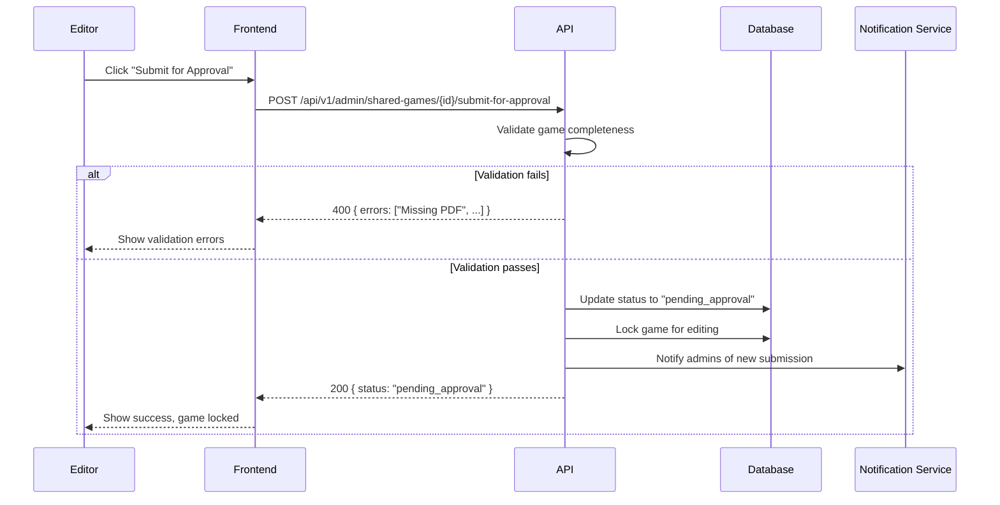

# Editor: Publication Workflow

> Editor flows for submitting games for publication approval.

## Table of Contents

- [Submit for Approval](#submit-for-approval)
- [Publication Status](#publication-status)
- [Rejection Handling](#rejection-handling)

---

## Submit for Approval

### User Story

```gherkin
Feature: Submit Game for Publication
  As an editor
  I want to submit my game for publication approval
  So that it becomes visible in the public catalog

  Scenario: Submit complete game
    Given I have created a game with all required content
    When I click "Submit for Approval"
    Then the game enters "pending_approval" status
    And admin is notified
    And I cannot edit until approved/rejected

  Scenario: Submit incomplete game
    Given my game is missing required content (no PDF)
    When I try to submit
    Then I see validation errors
    And I'm told what's missing

  Scenario: Game already pending
    Given my game is pending approval
    When I try to edit
    Then I see "Pending approval - editing disabled"
```

### Screen Flow

```
Game Edit → Complete All Sections
                  ↓
           Validation Check:
           ✓ Basic info complete
           ✓ At least one PDF uploaded
           ✓ PDF processed successfully
           ✓ Cover image uploaded
           ? Quick questions (optional)
                  ↓
           [Submit for Approval]
                  ↓
           Confirmation Dialog:
           "Submit Catan for publication?"
           "You won't be able to edit until reviewed."
           [Cancel] [Submit]
                  ↓
           Status: Pending Approval
           [View Status]
```

### Sequence Diagram



### API Flow

| Endpoint | Method | Description |
|----------|--------|-------------|
| `/api/v1/admin/shared-games/{id}/submit-for-approval` | POST | Submit for review |

**Validation Requirements:**
- `name`: Required, non-empty
- `description`: Required, min 50 characters
- `coverImageUrl`: Required
- `documents`: At least one processed PDF
- `minPlayers`, `maxPlayers`: Valid range
- `minPlayTime`, `maxPlayTime`: Valid range

**Response (Success):**
```json
{
  "id": "uuid",
  "status": "pending_approval",
  "submittedAt": "2026-01-19T10:00:00Z",
  "submittedBy": "editor-uuid",
  "position": 3  // Queue position
}
```

**Response (Validation Error):**
```json
{
  "error": "VALIDATION_FAILED",
  "errors": [
    { "field": "documents", "message": "At least one processed PDF is required" },
    { "field": "description", "message": "Description must be at least 50 characters" }
  ]
}
```

### Implementation Status

| Component | Status | Location |
|-----------|--------|----------|
| Submit Endpoint | ✅ Implemented | `SharedGameCatalogEndpoints.cs` |
| Validation Logic | ✅ Implemented | Command validator |
| Notification | ⚠️ Partial | Basic implementation |
| Submit UI | ✅ Implemented | Game edit page |

---

## Publication Status

### User Story

```gherkin
Feature: Track Publication Status
  As an editor
  I want to track the status of my submissions
  So that I know when games are approved

  Scenario: View pending submissions
    Given I have submitted games
    When I view my submissions
    Then I see status of each (pending, approved, rejected)

  Scenario: Approved game
    Given my game was approved
    Then it appears in the public catalog
    And I receive a notification
    And I can edit again (changes need re-approval)

  Scenario: View queue position
    Given my game is pending
    Then I see my position in the queue
    And estimated wait time
```

### Screen Flow

```
Admin → Shared Games → My Submissions
                           ↓
              Submissions List:
              ┌────────────────────────────────────────┐
              │ Catan                                  │
              │ Status: ⏳ Pending Approval             │
              │ Submitted: 2026-01-19                  │
              │ Queue Position: #3                     │
              ├────────────────────────────────────────┤
              │ Ticket to Ride                         │
              │ Status: ✅ Published                    │
              │ Published: 2026-01-15                  │
              ├────────────────────────────────────────┤
              │ Azul                                   │
              │ Status: ❌ Rejected                     │
              │ Reason: "Cover image too low quality" │
              │ [Edit & Resubmit]                      │
              └────────────────────────────────────────┘
```

### Status Flow

```
draft → pending_approval → approved → published
              ↓
          rejected → draft (after fixes) → pending_approval
```

### Implementation Status

| Component | Status | Location |
|-----------|--------|----------|
| Status Tracking | ✅ Implemented | SharedGame entity |
| Queue Position | ⚠️ Partial | Basic implementation |
| Status UI | ✅ Implemented | Game list with badges |

---

## Rejection Handling

### User Story

```gherkin
Feature: Handle Rejection
  As an editor
  When my game is rejected
  I want to know why and fix issues

  Scenario: View rejection reason
    Given my game was rejected
    When I view the game
    Then I see the rejection reason from admin
    And the game is unlocked for editing

  Scenario: Fix and resubmit
    Given I have fixed the issues
    When I click "Resubmit"
    Then the game goes back to pending approval
    And the rejection history is preserved
```

### Screen Flow

```
Rejected Game → View Details
                    ↓
          ┌─────────────────────────────┐
          │ ❌ Rejected                  │
          │                             │
          │ Reason:                     │
          │ "Cover image resolution    │
          │ is too low. Please upload  │
          │ at least 600x600px"        │
          │                             │
          │ Rejected by: Admin Name     │
          │ Date: 2026-01-18           │
          ├─────────────────────────────┤
          │ [Edit Game]                 │
          └─────────────────────────────┘
                    ↓
               Fix issues
                    ↓
          [Submit for Approval]
                    ↓
          Back to pending
```

### API Flow

Rejection is handled by Admin (see Admin flows), but editor receives:

**Notification:**
```json
{
  "type": "GAME_REJECTED",
  "gameId": "uuid",
  "gameName": "Catan",
  "reason": "Cover image resolution is too low",
  "rejectedBy": "admin-name",
  "rejectedAt": "2026-01-18T10:00:00Z"
}
```

### Implementation Status

| Component | Status | Location |
|-----------|--------|----------|
| Rejection Reason | ✅ Implemented | SharedGame entity |
| Resubmit Flow | ✅ Implemented | Same as initial submit |
| Notification | ⚠️ Partial | Basic implementation |

---

## Gap Analysis

### Implemented Features
- [x] Submit for approval
- [x] Validation before submission
- [x] Status tracking
- [x] Rejection reason display
- [x] Resubmit after rejection
- [x] Admin notification

### Missing/Partial Features
- [ ] **Queue Position**: Real queue position tracking
- [ ] **Estimated Wait Time**: Based on historical data
- [ ] **Draft Comments**: Editor can add notes for reviewer
- [ ] **Partial Approval**: Approve with requested changes
- [ ] **Revision History**: Track submission attempts
- [ ] **SLA Tracking**: Alert if review takes too long

### Proposed Enhancements
1. **Review Notes**: Editor can add context for reviewer
2. **Status Notifications**: Email/push when status changes
3. **Review SLA**: Auto-escalate if pending too long
4. **Conditional Approval**: "Approved pending minor fixes"
5. **Batch Operations**: Submit multiple games at once
