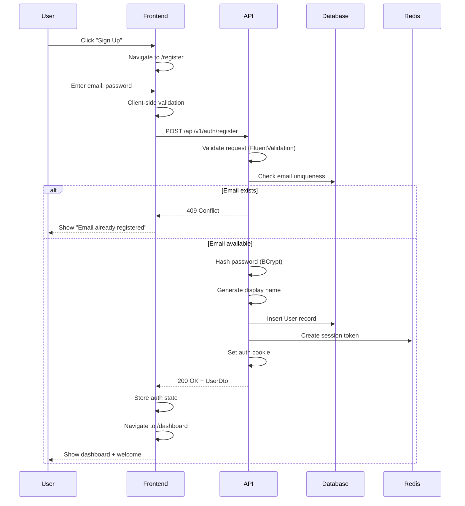
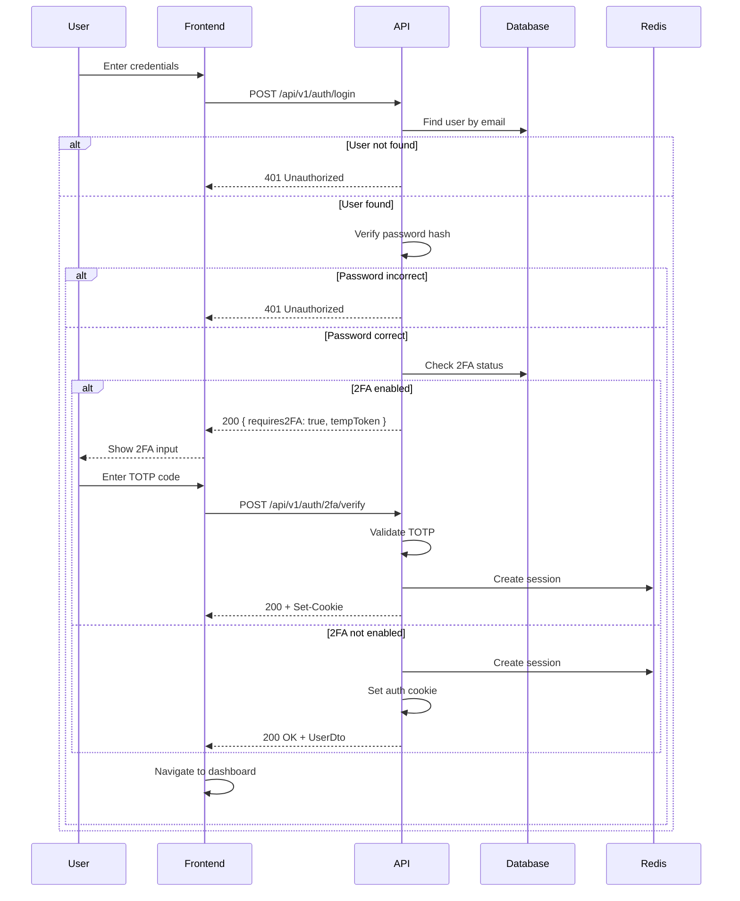
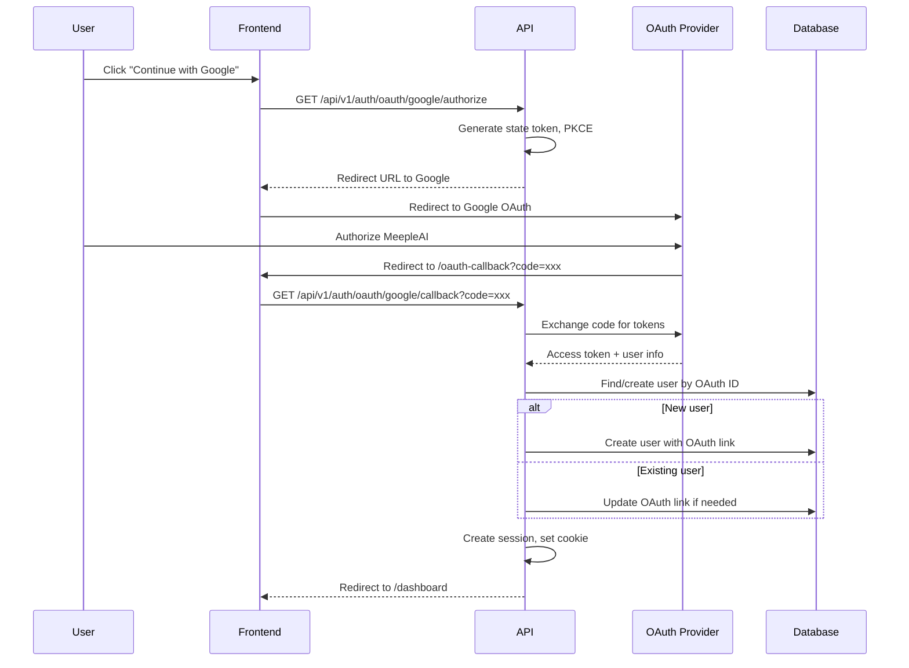
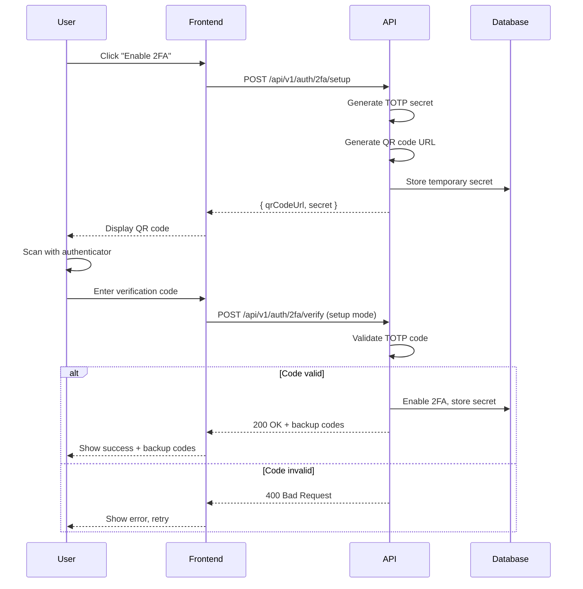
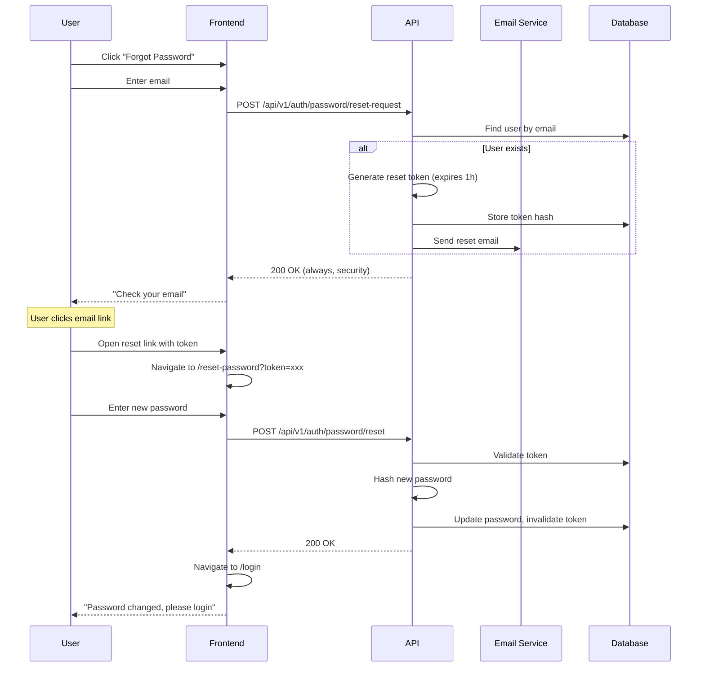

# User Authentication Flows

> Authentication and account management flows for end users.

## Table of Contents

- [Registration](#registration)
- [Login](#login)
- [OAuth](#oauth)
- [Two-Factor Authentication](#two-factor-authentication)
- [Password Management](#password-management)
- [Session Management](#session-management)
- [API Key Management](#api-key-management)

---

## Registration

### User Story

```gherkin
Feature: User Registration
  As a new user
  I want to create an account
  So that I can access MeepleAI features

  Scenario: Successful registration with email
    Given I am on the registration page
    When I enter a valid email "user@example.com"
    And I enter a password meeting requirements (8+ chars, 1 uppercase, 1 number)
    And I submit the form
    Then my account is created
    And I am automatically logged in
    And I am redirected to the dashboard
    And a display name is auto-generated from my email

  Scenario: Registration with existing email
    Given an account exists for "user@example.com"
    When I try to register with that email
    Then I see error "Email already registered"
    And I am offered a login link

  Scenario: Registration with weak password
    When I enter password "123"
    Then I see validation errors
    And the submit button is disabled
```

### Screen Flow

```
Landing Page → [Sign Up] → Registration Page
                              ↓
                         Fill Form:
                         • Email
                         • Password
                         • Confirm Password
                              ↓
                         [Register] → Dashboard (logged in)
                              ↓
                    (Optional) Welcome Tour
```

### Sequence Diagram



### API Flow

| Step | Endpoint | Method | Request | Response |
|------|----------|--------|---------|----------|
| 1 | `/api/v1/auth/register` | POST | `{ email, password }` | `UserDto + Set-Cookie` |

**Request Body:**
```json
{
  "email": "user@example.com",
  "password": "SecureP@ss123"
}
```

**Response (200):**
```json
{
  "id": "uuid",
  "email": "user@example.com",
  "displayName": "user",
  "role": "User",
  "tier": "Free",
  "createdAt": "2026-01-19T10:00:00Z"
}
```

### Implementation Status

| Component | Status | Location |
|-----------|--------|----------|
| API Endpoint | ✅ Implemented | `AuthenticationEndpoints.cs` |
| Command/Handler | ✅ Implemented | `RegisterCommand.cs` |
| Validator | ✅ Implemented | `RegisterCommandValidator.cs` |
| Frontend Page | ✅ Implemented | `/app/(auth)/register/page.tsx` |
| RegisterForm | ✅ Implemented | `RegisterForm.tsx` |

---

## Login

### User Story

```gherkin
Feature: User Login
  As a registered user
  I want to log in
  So that I can access my account

  Scenario: Successful login without 2FA
    Given I have an account without 2FA enabled
    When I enter correct credentials
    Then I am logged in
    And I am redirected to my last page or dashboard

  Scenario: Login with 2FA enabled
    Given I have 2FA enabled on my account
    When I enter correct credentials
    Then I see the 2FA verification screen
    And I must enter my TOTP code to complete login

  Scenario: Failed login
    When I enter incorrect credentials
    Then I see "Invalid email or password"
    And I can retry

  Scenario: Account lockout (future)
    Given I have failed 5 login attempts
    Then my account is temporarily locked
    And I must wait 15 minutes or reset password
```

### Screen Flow

```
Landing/Any Page → [Login] → Login Page
                                ↓
                           Fill Form:
                           • Email
                           • Password
                                ↓
                No 2FA ← [Login] → Has 2FA
                   ↓                  ↓
              Dashboard         2FA Verification
                                     ↓
                              Enter TOTP Code
                                     ↓
                                Dashboard
```

### Sequence Diagram



### API Flow

| Step | Endpoint | Method | Request | Response |
|------|----------|--------|---------|----------|
| 1 | `/api/v1/auth/login` | POST | `{ email, password }` | `UserDto` or `{ requires2FA, tempToken }` |
| 2 (if 2FA) | `/api/v1/auth/2fa/verify` | POST | `{ tempToken, code }` | `UserDto + Set-Cookie` |

### Implementation Status

| Component | Status | Location |
|-----------|--------|----------|
| Login Endpoint | ✅ Implemented | `AuthenticationEndpoints.cs` |
| 2FA Verify | ✅ Implemented | `TwoFactorEndpoints.cs` |
| Frontend Page | ✅ Implemented | `/app/(auth)/login/page.tsx` |
| LoginForm | ✅ Implemented | `LoginForm.tsx` |

---

## OAuth

### User Story

```gherkin
Feature: OAuth Login
  As a user
  I want to log in with Google/GitHub
  So that I don't need to remember another password

  Scenario: OAuth login - new user
    Given I don't have a MeepleAI account
    When I click "Continue with Google"
    And I authorize MeepleAI in Google
    Then a new account is created for me
    And I am logged in

  Scenario: OAuth login - existing user
    Given I have an account linked to Google
    When I click "Continue with Google"
    Then I am logged in to my existing account

  Scenario: Link OAuth to existing account
    Given I am logged in with email/password
    When I go to settings and link Google
    Then my account is connected to Google
    And I can use either method to log in
```

### Screen Flow

```
Login Page → [Continue with Google/GitHub]
                     ↓
            OAuth Provider Login
                     ↓
            Authorize MeepleAI
                     ↓
            /oauth-callback
                     ↓
    New User → Create Account → Dashboard
    Existing → Link/Login → Dashboard
```

### Sequence Diagram



### API Flow

| Step | Endpoint | Method | Description |
|------|----------|--------|-------------|
| 1 | `/api/v1/auth/oauth/{provider}/authorize` | GET | Get OAuth redirect URL |
| 2 | `/api/v1/auth/oauth/{provider}/callback` | GET | Handle OAuth callback |

**Supported Providers:** `google`, `github`

### Implementation Status

| Component | Status | Location |
|-----------|--------|----------|
| OAuth Endpoints | ✅ Implemented | `OAuthEndpoints.cs` |
| OAuth Handlers | ✅ Implemented | `OAuthLoginCommand.cs` |
| Frontend Callback | ✅ Implemented | `/app/(auth)/oauth-callback/page.tsx` |
| OAuthButtons | ✅ Implemented | `OAuthButtons.tsx` |

---

## Two-Factor Authentication

### User Story

```gherkin
Feature: Two-Factor Authentication Setup
  As a security-conscious user
  I want to enable 2FA
  So that my account is more secure

  Scenario: Enable 2FA
    Given I am logged in
    When I go to security settings
    And I click "Enable 2FA"
    Then I see a QR code to scan
    And I scan it with my authenticator app
    And I enter the verification code
    Then 2FA is enabled on my account

  Scenario: Disable 2FA
    Given I have 2FA enabled
    When I click "Disable 2FA"
    And I confirm with my current TOTP code
    Then 2FA is disabled
```

### Screen Flow

```
Settings → Security → [Enable 2FA]
                          ↓
                    Show QR Code
                    (Scan with authenticator)
                          ↓
                    Enter Verification Code
                          ↓
                    2FA Enabled
                    (Show backup codes)
```

### Sequence Diagram



### API Flow

| Step | Endpoint | Method | Request | Response |
|------|----------|--------|---------|----------|
| 1 | `/api/v1/auth/2fa/setup` | POST | - | `{ qrCodeUrl, secret }` |
| 2 | `/api/v1/auth/2fa/verify` | POST | `{ code }` | `{ backupCodes[] }` |
| 3 (disable) | `/api/v1/auth/2fa` | DELETE | `{ code }` | `200 OK` |

### Implementation Status

| Component | Status | Location |
|-----------|--------|----------|
| 2FA Endpoints | ✅ Implemented | `TwoFactorEndpoints.cs` |
| TOTP Service | ✅ Implemented | `TotpService.cs` |
| Frontend Settings | ⚠️ Partial | Settings page exists |

---

## Password Management

### User Story

```gherkin
Feature: Password Reset
  As a user who forgot my password
  I want to reset it
  So that I can regain access to my account

  Scenario: Request password reset
    Given I am on the login page
    When I click "Forgot password"
    And I enter my email
    Then I receive a reset email with a link

  Scenario: Complete password reset
    Given I clicked the reset link in my email
    When I enter a new password
    And I confirm it
    Then my password is changed
    And I can log in with the new password
```

### Screen Flow

```
Login Page → [Forgot Password] → Enter Email
                                      ↓
                              Check Email Message
                                      ↓
                              Click Reset Link
                                      ↓
                              Reset Password Page
                              • New Password
                              • Confirm Password
                                      ↓
                              Password Changed
                                      ↓
                              Login Page
```

### Sequence Diagram



### API Flow

| Step | Endpoint | Method | Request | Response |
|------|----------|--------|---------|----------|
| 1 | `/api/v1/auth/password/reset-request` | POST | `{ email }` | `200 OK` |
| 2 | `/api/v1/auth/password/reset` | POST | `{ token, newPassword }` | `200 OK` |

### Implementation Status

| Component | Status | Location |
|-----------|--------|----------|
| Password Endpoints | ✅ Implemented | `PasswordEndpoints.cs` |
| Email Service | ⚠️ Partial | Email service configured |
| Frontend Page | ✅ Implemented | `/app/(auth)/reset-password/page.tsx` |

---

## Session Management

### User Story

```gherkin
Feature: Session Management
  As a user
  I want to manage my login sessions
  So that I can secure my account

  Scenario: View active sessions
    Given I am logged in
    When I go to security settings
    Then I see all my active sessions
    And I see device info and last activity

  Scenario: Revoke a session
    When I click "Log out" on a specific session
    Then that session is revoked
    And that device is logged out

  Scenario: Log out from all devices
    When I click "Log out everywhere"
    Then all sessions except current are revoked
```

### Screen Flow

```
Settings → Security → Active Sessions
                          ↓
                    Session List:
                    • Current device (this session)
                    • iPhone - Last active 2h ago [Revoke]
                    • Chrome Windows - Last active 1d ago [Revoke]
                          ↓
                    [Log Out Everywhere]
```

### API Flow

| Step | Endpoint | Method | Description |
|------|----------|--------|-------------|
| 1 | `/api/v1/users/me/sessions` | GET | List all user sessions |
| 2 | `/api/v1/auth/sessions/{id}/revoke` | POST | Revoke specific session |
| 3 | `/api/v1/auth/sessions/revoke-all` | POST | Revoke all sessions |
| 4 | `/api/v1/auth/session/status` | GET | Get current session status |
| 5 | `/api/v1/auth/session/extend` | POST | Extend current session |

### Implementation Status

| Component | Status | Location |
|-----------|--------|----------|
| Session Endpoints | ✅ Implemented | `AuthenticationEndpoints.cs` |
| Session Service | ✅ Implemented | `SessionManagementService.cs` |
| Frontend UI | ⚠️ Partial | Basic implementation |

---

## API Key Management

### User Story

```gherkin
Feature: API Key Management
  As a developer user
  I want to create API keys
  So that I can integrate with MeepleAI programmatically

  Scenario: Create API key
    Given I am logged in
    When I go to API Keys settings
    And I click "Create New Key"
    And I give it a name and optional expiry
    Then a new API key is generated
    And I see it once (must copy now)

  Scenario: Rotate API key
    Given I have an existing API key
    When I click "Rotate"
    Then a new key is generated
    And the old key remains valid for 24h grace period

  Scenario: View API key usage
    When I view an API key
    Then I see usage statistics
    And I see recent API calls
```

### Screen Flow

```
Settings → API Keys → [Create New Key]
                          ↓
                    Enter Name, Set Expiry
                          ↓
                    Show New Key (copy now!)
                          ↓
                    Key List with Stats
```

### API Flow

| Step | Endpoint | Method | Description |
|------|----------|--------|-------------|
| 1 | `/api/v1/api-keys` | GET | List user's API keys |
| 2 | `/api/v1/api-keys` | POST | Create new API key |
| 3 | `/api/v1/api-keys/{id}` | PUT | Update key metadata |
| 4 | `/api/v1/api-keys/{id}` | DELETE | Revoke key |
| 5 | `/api/v1/api-keys/{id}/rotate` | POST | Rotate key |
| 6 | `/api/v1/api-keys/{id}/usage` | GET | Get usage stats |

### Implementation Status

| Component | Status | Location |
|-----------|--------|----------|
| API Key Endpoints | ✅ Implemented | `ApiKeyEndpoints.cs` |
| Usage Tracking | ✅ Implemented | `ApiKeyUsageService.cs` |
| Frontend Modal | ✅ Implemented | `ApiKeyCreationModal.tsx` |

---

## Gap Analysis

### Implemented Features
- [x] Email/password registration
- [x] Email/password login
- [x] OAuth (Google, GitHub)
- [x] 2FA (TOTP)
- [x] Password reset
- [x] Session management
- [x] API key management

### Missing/Partial Features
- [ ] Account lockout after failed attempts
- [ ] Email verification for new accounts
- [ ] Password change confirmation email
- [ ] Session device fingerprinting
- [ ] Remember me functionality
- [ ] Social account linking UI (partial)
- [ ] 2FA backup codes recovery flow

### Proposed Enhancements
1. **Account Lockout**: Implement temporary lockout after 5 failed attempts
2. **Email Verification**: Require email verification before full access
3. **Device Trust**: "Trust this device" to skip 2FA for known devices
4. **Login Notifications**: Email user on new device login
