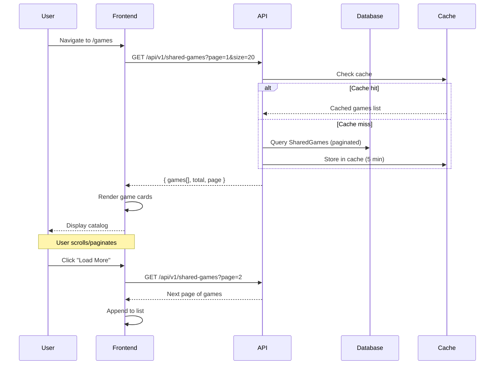
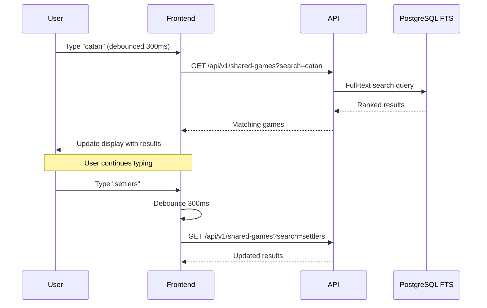
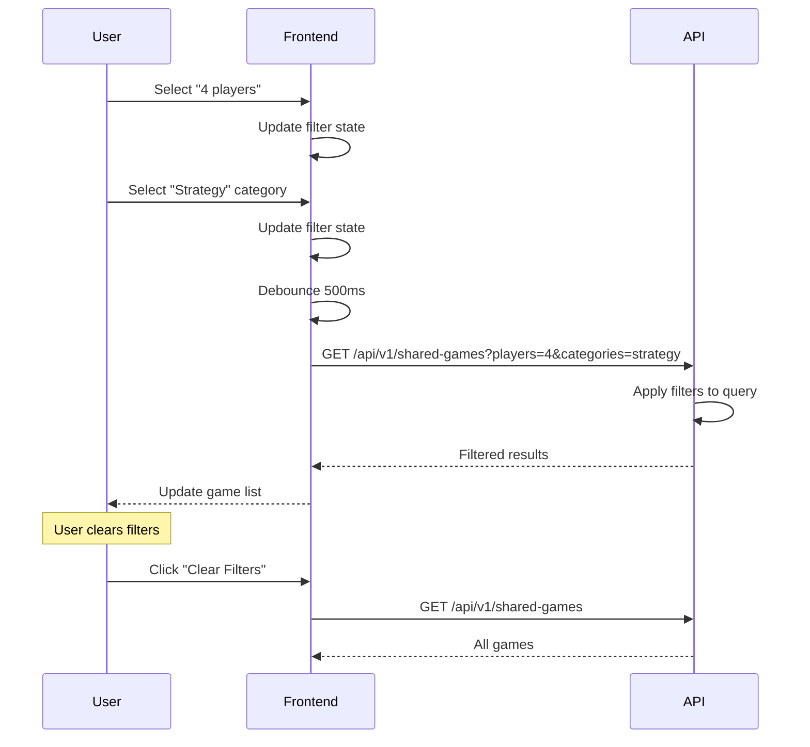
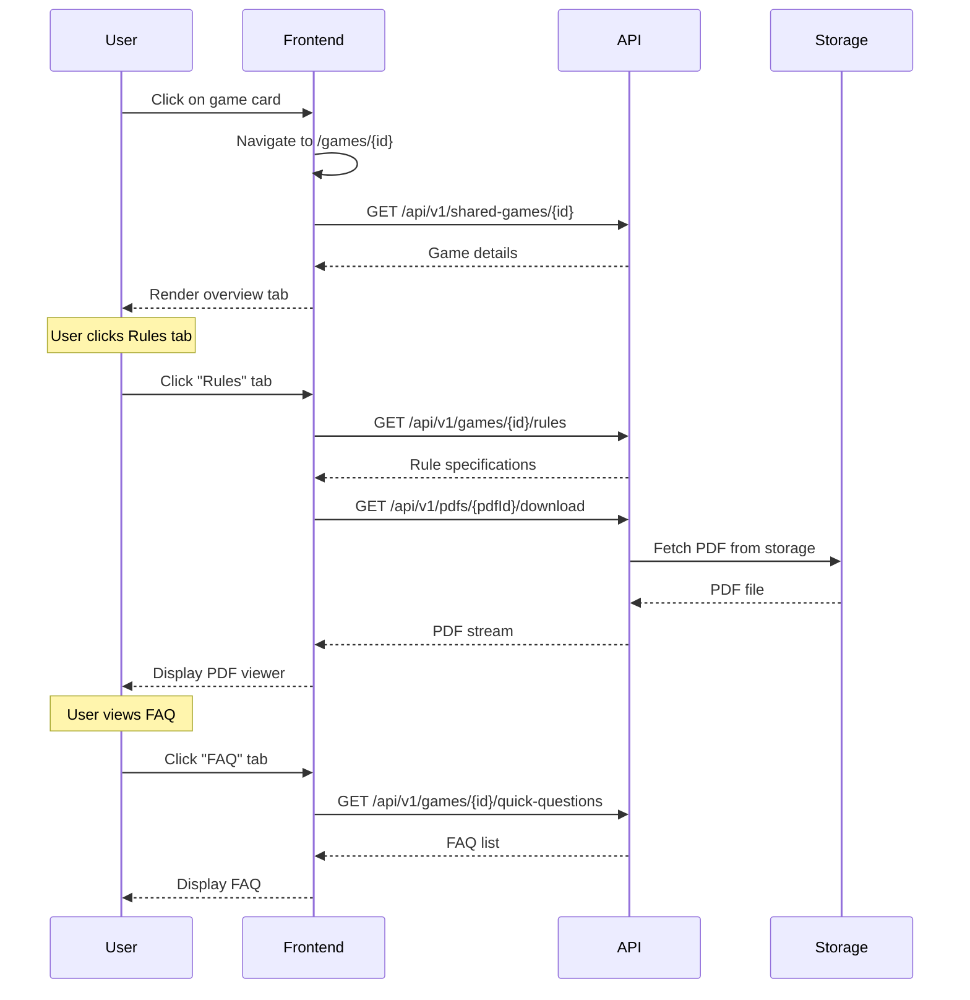

# Game Discovery Flows

> User flows for discovering, browsing, and exploring games in the catalog.

## Table of Contents

- [Browse Catalog](#browse-catalog)
- [Search Games](#search-games)
- [Filter Games](#filter-games)
- [Game Details](#game-details)
- [Quick Questions](#quick-questions)

---

## Browse Catalog

### User Story

```gherkin
Feature: Browse Game Catalog
  As a user
  I want to browse available games
  So that I can discover new games to play

  Scenario: View public catalog
    Given I am on the games page
    When the page loads
    Then I see a paginated list of games
    And each game shows cover, title, player count, duration, complexity
    And games are sorted by popularity by default

  Scenario: Browse as guest
    Given I am not logged in
    When I visit the catalog
    Then I can browse and view games
    But I cannot add games to my library

  Scenario: Browse as logged-in user
    Given I am logged in
    When I browse the catalog
    Then I see "Add to Library" buttons
    And I see my library status for each game
```

### Screen Flow

```
Home → [Games] or [Explore] → Game Catalog
                                  ↓
                           Game Grid:
                           ┌─────────────────┐
                           │  [Cover Image]  │
                           │  Game Title     │
                           │  2-4 👥 • 60min │
                           │  ⭐ BGG: 8.2    │
                           │  [Add to Lib]   │
                           └─────────────────┘
                                  ↓
                           [Load More] / Pagination
```

### Sequence Diagram



### API Flow

| Step | Endpoint | Method | Query Params | Response |
|------|----------|--------|--------------|----------|
| 1 | `/api/v1/shared-games` | GET | `page, size, sort` | `{ items[], totalCount, page, pageSize }` |

**Query Parameters:**
- `page`: Page number (default: 1)
- `size`: Items per page (default: 20, max: 100)
- `sort`: `popularity`, `name`, `rating`, `newest`

**Response:**
```json
{
  "items": [
    {
      "id": "uuid",
      "name": "Catan",
      "coverImageUrl": "https://...",
      "minPlayers": 2,
      "maxPlayers": 4,
      "minPlayTime": 60,
      "maxPlayTime": 120,
      "complexity": 2.3,
      "bggRating": 7.2,
      "categories": ["Strategy", "Negotiation"],
      "mechanics": ["Trading", "Dice Rolling"]
    }
  ],
  "totalCount": 1500,
  "page": 1,
  "pageSize": 20
}
```

### Implementation Status

| Component | Status | Location |
|-----------|--------|----------|
| API Endpoint | ✅ Implemented | `SharedGameCatalogEndpoints.cs` |
| Frontend Page | ✅ Implemented | `/app/(public)/games/catalog/page.tsx` |
| GameCatalogCard | ✅ Implemented | `GameCatalogCard.tsx` |
| CatalogFilters | ✅ Implemented | `CatalogFilters.tsx` |

---

## Search Games

### User Story

```gherkin
Feature: Search Games
  As a user
  I want to search for specific games
  So that I can find games I'm interested in

  Scenario: Search by name
    Given I am on the catalog page
    When I type "Catan" in the search box
    Then I see games matching "Catan"
    And results update as I type (debounced)

  Scenario: Search with no results
    When I search for "xyznonexistent"
    Then I see "No games found"
    And I see suggestions to adjust search

  Scenario: Search autocomplete
    When I start typing "set"
    Then I see autocomplete suggestions
    And I can select from suggestions
```

### Screen Flow

```
Catalog → Search Box → Type Query
                          ↓
                   Autocomplete Dropdown
                   • Settlers of Catan
                   • Set (card game)
                   • Setters of Teuton
                          ↓
                   Select or Enter
                          ↓
                   Filtered Results
```

### Sequence Diagram



### API Flow

| Step | Endpoint | Method | Query Params | Response |
|------|----------|--------|--------------|----------|
| 1 | `/api/v1/shared-games` | GET | `search=catan` | Filtered games list |

**Full-Text Search Features:**
- Matches game name, publisher, description
- Supports partial matches
- Ranked by relevance
- Case insensitive

### Implementation Status

| Component | Status | Location |
|-----------|--------|----------|
| FTS Implementation | ✅ Implemented | PostgreSQL tsvector |
| Search Endpoint | ✅ Implemented | `SharedGameCatalogEndpoints.cs` |
| Search UI | ✅ Implemented | `SharedGameSearch.tsx` |

---

## Filter Games

### User Story

```gherkin
Feature: Filter Games
  As a user
  I want to filter games by various criteria
  So that I can find games that match my preferences

  Scenario: Filter by player count
    Given I want games for 4 players
    When I set player count filter to 4
    Then I only see games supporting 4 players

  Scenario: Filter by complexity
    Given I want easy games
    When I set complexity to 1-2
    Then I only see games with complexity ≤ 2

  Scenario: Filter by category
    When I select "Strategy" category
    Then I only see strategy games

  Scenario: Multiple filters
    When I combine filters (4 players + Strategy + <60min)
    Then I see games matching ALL criteria
```

### Screen Flow

```
Catalog → Filter Panel (sidebar)
              │
              ├── Player Count
              │   └── [1] [2] [3] [4] [5+]
              │
              ├── Duration
              │   └── [< 30min] [30-60] [60-120] [120+]
              │
              ├── Complexity
              │   └── [1]──────[5] (slider)
              │
              ├── Categories
              │   └── ☑️ Strategy ☐ Party ☑️ Family
              │
              └── Mechanics
                  └── ☐ Deck Building ☑️ Area Control
                          ↓
                   Apply Filters
                          ↓
                   Filtered Results
```

### Sequence Diagram



### API Flow

| Step | Endpoint | Method | Query Params | Response |
|------|----------|--------|--------------|----------|
| 1 | `/api/v1/shared-games` | GET | Multiple filter params | Filtered games |

**Filter Parameters:**
- `players`: Exact or range (e.g., `4` or `2-4`)
- `minDuration`, `maxDuration`: Play time in minutes
- `minComplexity`, `maxComplexity`: 1-5 scale
- `categories`: Comma-separated category IDs
- `mechanics`: Comma-separated mechanic IDs

### Supporting Endpoints

| Endpoint | Method | Description |
|----------|--------|-------------|
| `/api/v1/shared-games/categories` | GET | List all categories |
| `/api/v1/shared-games/mechanics` | GET | List all mechanics |

### Implementation Status

| Component | Status | Location |
|-----------|--------|----------|
| Filter Endpoint | ✅ Implemented | `SharedGameCatalogEndpoints.cs` |
| Categories/Mechanics | ✅ Implemented | Same file |
| Filter UI | ✅ Implemented | `SharedGameSearchFilters.tsx` |
| CatalogFilters | ✅ Implemented | `CatalogFilters.tsx` |

---

## Game Details

### User Story

```gherkin
Feature: View Game Details
  As a user
  I want to see detailed information about a game
  So that I can learn about it before playing

  Scenario: View game detail page
    Given I click on a game card
    When the detail page loads
    Then I see:
      - Cover image and title
      - Player count, duration, complexity
      - BGG rating and link
      - Description
      - Categories and mechanics
      - FAQ and errata (if available)
      - Quick questions

  Scenario: View rules/PDF
    When I click on "Rules" tab
    Then I see the game's rulebook PDF
    And I can navigate, zoom, and search

  Scenario: Add to library from detail
    Given I am logged in
    When I click "Add to Library"
    Then the game is added to my library
    And the button changes to "In Library"
```

### Screen Flow

```
Catalog/Search → Click Game Card → Game Detail Page
                                        │
                    ┌───────────────────┼───────────────────┐
                    ↓                   ↓                   ↓
              Overview Tab         Rules Tab          Community Tab
              • Description        • PDF Viewer       • FAQ
              • Stats              • Quick Setup      • Errata
              • Actions            • Quick Ref        • House Rules
```

### Sequence Diagram



### API Flow

| Step | Endpoint | Method | Description |
|------|----------|--------|-------------|
| 1 | `/api/v1/shared-games/{id}` | GET | Get game details |
| 2 | `/api/v1/games/{id}/rules` | GET | Get rule specifications |
| 3 | `/api/v1/games/{id}/quick-questions` | GET | Get quick questions/FAQ |
| 4 | `/api/v1/pdfs/{pdfId}/download` | GET | Download PDF file |

**Game Detail Response:**
```json
{
  "id": "uuid",
  "name": "Catan",
  "description": "Settle the island of Catan...",
  "coverImageUrl": "https://...",
  "minPlayers": 2,
  "maxPlayers": 4,
  "minPlayTime": 60,
  "maxPlayTime": 120,
  "complexity": 2.3,
  "bggId": 13,
  "bggRating": 7.2,
  "yearPublished": 1995,
  "publisher": "Kosmos",
  "designer": "Klaus Teuber",
  "categories": [{ "id": "uuid", "name": "Strategy" }],
  "mechanics": [{ "id": "uuid", "name": "Trading" }],
  "documents": [{ "id": "uuid", "type": "rulebook", "language": "en" }],
  "faqCount": 15,
  "errataCount": 3,
  "quickQuestionsCount": 10
}
```

### Implementation Status

| Component | Status | Location |
|-----------|--------|----------|
| Detail Endpoint | ✅ Implemented | `SharedGameCatalogEndpoints.cs` |
| Detail Page | ✅ Implemented | `/app/(public)/games/[id]/page.tsx` |
| Tabs (Overview, Rules, Community) | ✅ Implemented | Multiple components |
| PDF Viewer | ✅ Implemented | `PdfViewerModal.tsx` |

---

## Quick Questions

### User Story

```gherkin
Feature: Quick Questions
  As a user
  I want to see common questions about a game
  So that I can quickly find answers without reading the full rules

  Scenario: View quick questions
    Given I am on a game detail page
    When I scroll to Quick Questions section
    Then I see common questions with answers
    And questions are categorized (Setup, Gameplay, Scoring)

  Scenario: Search quick questions
    When I search "how to score"
    Then I see matching questions highlighted
```

### Screen Flow

```
Game Detail → Quick Questions Section
                    │
              ┌─────┴─────┐
              ↓           ↓
         Categories    Search
         • Setup       [🔍 Search...]
         • Gameplay
         • Scoring
              ↓
         Question Cards:
         ┌──────────────────────┐
         │ Q: How do I set up?  │
         │ A: Place board in... │
         └──────────────────────┘
```

### API Flow

| Endpoint | Method | Response |
|----------|--------|----------|
| `/api/v1/games/{id}/quick-questions` | GET | `QuickQuestion[]` |

**Response:**
```json
[
  {
    "id": "uuid",
    "question": "How do I set up the game?",
    "answer": "Place the board in the center...",
    "category": "Setup",
    "order": 1
  }
]
```

### Implementation Status

| Component | Status | Location |
|-----------|--------|----------|
| Quick Questions Endpoint | ✅ Implemented | `SharedGameCatalogEndpoints.cs` |
| Quick Questions Component | ⚠️ Partial | Basic display implemented |

---

## Gap Analysis

### Implemented Features
- [x] Paginated game catalog
- [x] Full-text search
- [x] Multi-criteria filtering
- [x] Game detail pages
- [x] PDF viewer
- [x] Categories and mechanics
- [x] Quick questions display

### Missing/Partial Features
- [ ] Search autocomplete dropdown
- [ ] Recent searches history
- [ ] "Similar games" recommendations
- [ ] User ratings/reviews
- [ ] Wishlist functionality
- [ ] Share game to social media
- [ ] Compare games feature

### Proposed Enhancements
1. **Autocomplete Search**: Add dropdown with suggestions while typing
2. **Similar Games**: Show related games based on mechanics/categories
3. **User Reviews**: Allow users to rate and review games
4. **Wishlist**: Separate from library for games user wants to try
5. **Game Collections**: Curated lists (e.g., "Best 2-player games")
