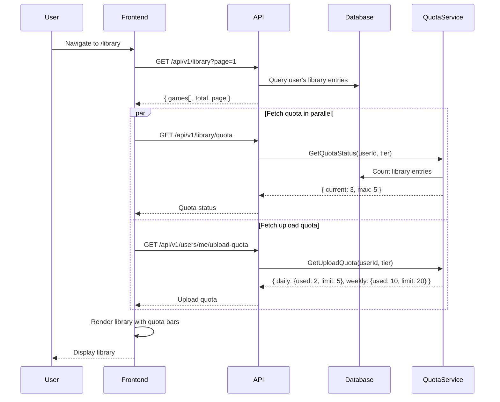
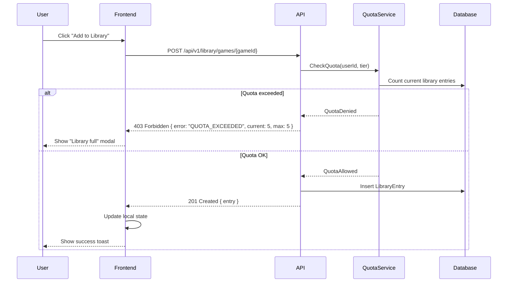
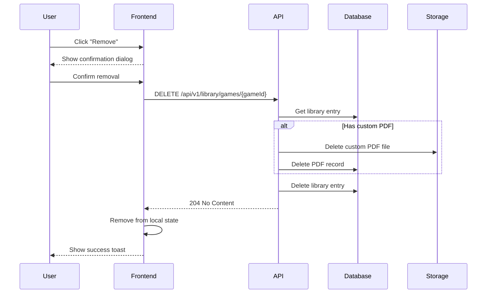
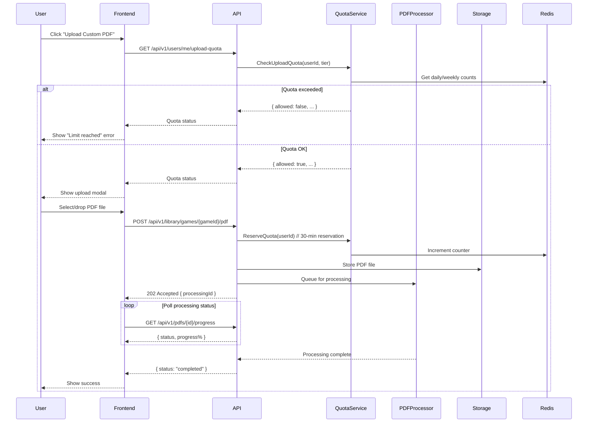

# Library Management Flows

> User flows for managing personal game library with tier-based quotas.

## Table of Contents

- [Library Overview](#library-overview)
- [Add Game to Library](#add-game-to-library)
- [Remove Game from Library](#remove-game-from-library)
- [Manage Favorites](#manage-favorites)
- [Custom PDF Upload](#custom-pdf-upload)
- [Custom Agent Configuration](#custom-agent-configuration)
- [Quota Management](#quota-management)

---

## Library Overview

### Tier-Based Quota System

The library system enforces tier-based limits configured by administrators:

| Tier | Max Games (A) | PDF Uploads/Day (B) | PDF Uploads/Week (C) | Sessions (D) |
|------|---------------|---------------------|----------------------|--------------|
| **Free** | 5 | 5 | 20 | Unlimited* |
| **Normal** | 20 | 20 | 100 | Unlimited* |
| **Premium** | 50 | 100 | 500 | Unlimited* |

> *Session limits are configurable but not currently enforced.
> All limits are configurable via Admin → System Configuration.

### User Story

```gherkin
Feature: View Library
  As a user
  I want to see my game library
  So that I can manage games I own or play regularly

  Scenario: View library with quota
    Given I am logged in
    When I navigate to My Library
    Then I see my games list
    And I see my quota status (e.g., "3/5 games")
    And I see my upload quota ("2/5 PDF uploads today")

  Scenario: Empty library
    Given I have no games in my library
    When I view my library
    Then I see an empty state
    And I see suggestions to browse the catalog

  Scenario: Filter library
    When I filter by "Favorites"
    Then I only see favorited games
```

### Screen Flow

```
Dashboard → [My Library] → Library Page
                              │
                    ┌─────────┴─────────┐
                    ↓                   ↓
              Quota Bar            Game Grid
         ┌──────────────────┐    ┌─────────────────┐
         │ 📚 3/5 games     │    │ [Cover]         │
         │ 📄 2/5 uploads   │    │ Title           │
         │ [Upgrade]        │    │ ⭐ [Favorite]   │
         └──────────────────┘    │ [...] Actions   │
                                 └─────────────────┘
```

### Sequence Diagram



### API Flow

| Step | Endpoint | Method | Description |
|------|----------|--------|-------------|
| 1 | `/api/v1/library` | GET | Get paginated library |
| 2 | `/api/v1/library/quota` | GET | Get game library quota |
| 3 | `/api/v1/users/me/upload-quota` | GET | Get PDF upload quota |
| 4 | `/api/v1/library/stats` | GET | Get library statistics |

**Library Response:**
```json
{
  "items": [
    {
      "gameId": "uuid",
      "gameName": "Catan",
      "coverImageUrl": "https://...",
      "isFavorite": true,
      "hasCustomPdf": false,
      "hasCustomAgent": false,
      "notes": "Great game for family nights",
      "addedAt": "2026-01-15T10:00:00Z"
    }
  ],
  "totalCount": 3,
  "page": 1,
  "pageSize": 20
}
```

**Quota Response:**
```json
{
  "gameLibrary": {
    "current": 3,
    "max": 5,
    "tier": "Free",
    "percentUsed": 60
  },
  "pdfUpload": {
    "daily": { "used": 2, "limit": 5, "resetAt": "2026-01-20T00:00:00Z" },
    "weekly": { "used": 10, "limit": 20, "resetAt": "2026-01-22T00:00:00Z" }
  }
}
```

### Implementation Status

| Component | Status | Location |
|-----------|--------|----------|
| Library Endpoint | ✅ Implemented | `UserLibraryEndpoints.cs` |
| Quota Service | ✅ Implemented | `GameLibraryQuotaService.cs` |
| Library Page | ✅ Implemented | `/app/(public)/library/page.tsx` |
| QuotaStatusBar | ✅ Implemented | `QuotaStatusBar.tsx` |

---

## Add Game to Library

### User Story

```gherkin
Feature: Add Game to Library
  As a user
  I want to add games to my library
  So that I can easily access them later

  Scenario: Add game within quota
    Given I have space in my library (current < max)
    When I click "Add to Library" on a game
    Then the game is added to my library
    And my quota updates
    And the button changes to "In Library"

  Scenario: Add game at quota limit
    Given I have reached my library limit (5/5 games)
    When I try to add another game
    Then I see "Library full" message
    And I'm offered upgrade options
    And the game is NOT added

  Scenario: Add with notes
    When I add a game
    And I include notes "Birthday gift from Mom"
    Then the notes are saved with the entry
```

### Screen Flow

```
Game Card/Detail → [Add to Library]
                        ↓
        ┌───────────────┴───────────────┐
        ↓                               ↓
   Quota OK                        Quota Full
        ↓                               ↓
   Optional Modal:               Error Modal:
   • Add notes                   "Library Full (5/5)"
   • Mark as favorite            [Upgrade to Normal]
        ↓                        [Remove a game first]
   Game Added ✅
   "Added to library"
```

### Sequence Diagram



### API Flow

| Step | Endpoint | Method | Body | Response |
|------|----------|--------|------|----------|
| 1 | `/api/v1/library/games/{gameId}` | POST | `{ notes? }` | `201` or `403` |
| 2 | `/api/v1/library/games/{gameId}/status` | GET | - | Check if in library |

**Request Body:**
```json
{
  "notes": "Optional notes about the game"
}
```

**Error Response (403):**
```json
{
  "error": "QUOTA_EXCEEDED",
  "message": "Library limit reached",
  "details": {
    "current": 5,
    "max": 5,
    "tier": "Free",
    "upgradeUrl": "/settings/subscription"
  }
}
```

### Implementation Status

| Component | Status | Location |
|-----------|--------|----------|
| Add Endpoint | ✅ Implemented | `UserLibraryEndpoints.cs` |
| Quota Check | ✅ Implemented | `GameLibraryQuotaService.cs` |
| AddToLibraryButton | ✅ Implemented | `AddToLibraryButton.tsx` |

---

## Remove Game from Library

### User Story

```gherkin
Feature: Remove Game from Library
  As a user
  I want to remove games from my library
  So that I can make room for other games

  Scenario: Remove game
    Given I have a game in my library
    When I click "Remove from Library"
    And I confirm the action
    Then the game is removed
    And my quota frees up one slot
    And any custom PDF/agent config is deleted

  Scenario: Cancel removal
    When I click "Remove" but then cancel
    Then the game remains in my library
```

### Screen Flow

```
Library/Game Card → [...] → [Remove from Library]
                                    ↓
                            Confirmation Dialog:
                            "Remove Catan?"
                            "Custom PDF and agent config will be deleted"
                                    ↓
                    ┌───────────────┴───────────────┐
                    ↓                               ↓
               [Cancel]                        [Remove]
                    ↓                               ↓
               Dialog closes               Game removed
                                          Quota updated
                                          Toast: "Removed from library"
```

### Sequence Diagram



### API Flow

| Endpoint | Method | Description |
|----------|--------|-------------|
| `/api/v1/library/games/{gameId}` | DELETE | Remove game from library |

### Implementation Status

| Component | Status | Location |
|-----------|--------|----------|
| Remove Endpoint | ✅ Implemented | `UserLibraryEndpoints.cs` |
| RemoveGameDialog | ✅ Implemented | `RemoveGameDialog.tsx` |

---

## Manage Favorites

### User Story

```gherkin
Feature: Favorite Games
  As a user
  I want to mark games as favorites
  So that I can quickly find my most-played games

  Scenario: Toggle favorite
    Given I have a game in my library
    When I click the star/favorite icon
    Then the game's favorite status toggles
    And favorites appear first in my library

  Scenario: View only favorites
    When I filter by "Favorites only"
    Then I only see favorited games
```

### Screen Flow

```
Library → Game Card
              │
         ⭐ Click Star
              │
         ┌────┴────┐
         ↓         ↓
    Not Favorite → Favorite
    (hollow)       (filled)
              ↓
    Moves to top of list
    (if sorted by favorites)
```

### API Flow

| Endpoint | Method | Body | Description |
|----------|--------|------|-------------|
| `/api/v1/library/games/{gameId}` | PATCH | `{ isFavorite: true }` | Toggle favorite |

### Implementation Status

| Component | Status | Location |
|-----------|--------|----------|
| PATCH Endpoint | ✅ Implemented | `UserLibraryEndpoints.cs` |
| FavoriteToggle | ✅ Implemented | `FavoriteToggle.tsx` |

---

## Custom PDF Upload

### User Story

```gherkin
Feature: Custom PDF Upload
  As a user
  I want to upload my own PDF for a game
  So that I can use my preferred rulebook version

  Scenario: Upload custom PDF within quota
    Given I have upload quota remaining (daily AND weekly)
    And I have a game in my library
    When I upload a PDF for that game
    Then the PDF is processed
    And it replaces the default PDF for that game
    And my upload quota decreases

  Scenario: Upload blocked by quota
    Given I have used all daily uploads (5/5)
    When I try to upload a PDF
    Then I see "Upload limit reached"
    And I see when quota resets
    And the upload is blocked

  Scenario: Reset to default PDF
    When I click "Reset to default"
    Then my custom PDF is deleted
    And the default PDF is restored
    And my quota is NOT restored (upload already counted)
```

### Screen Flow

```
Library → Game Card → [...] → [Upload Custom PDF]
                                     ↓
                             Check Upload Quota
                                     ↓
                    ┌────────────────┴────────────────┐
                    ↓                                 ↓
              Quota OK                          Quota Exceeded
                    ↓                                 ↓
              Upload Modal:                    Error Modal:
              • Drag & drop PDF               "Upload limit reached"
              • Max 50MB                      "Resets in 6 hours"
              • Supported: PDF                [OK]
                    ↓
              Processing...
              (extraction, indexing)
                    ↓
              Upload Complete ✅
```

### Sequence Diagram



### API Flow

| Step | Endpoint | Method | Description |
|------|----------|--------|-------------|
| 1 | `/api/v1/users/me/upload-quota` | GET | Check upload quota |
| 2 | `/api/v1/library/games/{gameId}/pdf` | POST | Upload custom PDF |
| 3 | `/api/v1/pdfs/{pdfId}/progress` | GET | Check processing status |
| 4 | `/api/v1/library/games/{gameId}/pdf` | DELETE | Reset to default PDF |

**Upload Quota Response:**
```json
{
  "daily": {
    "used": 2,
    "limit": 5,
    "remaining": 3,
    "resetAt": "2026-01-20T00:00:00Z"
  },
  "weekly": {
    "used": 10,
    "limit": 20,
    "remaining": 10,
    "resetAt": "2026-01-22T00:00:00Z"
  },
  "canUpload": true
}
```

### Implementation Status

| Component | Status | Location |
|-----------|--------|----------|
| Upload Endpoint | ✅ Implemented | `UserLibraryEndpoints.cs` |
| Quota Service | ✅ Implemented | `PdfUploadQuotaService.cs` |
| PdfUploadModal | ✅ Implemented | `PdfUploadModal.tsx` |
| Processing Status | ✅ Implemented | `ProcessingProgress.tsx` |

---

## Custom Agent Configuration

### User Story

```gherkin
Feature: Custom Agent Configuration
  As a user
  I want to customize the AI agent for my games
  So that I can tailor the assistant to my preferences

  Scenario: Configure custom agent
    Given I have a game in my library
    When I open agent settings
    Then I can:
      - Choose LLM provider (if multiple available)
      - Select personality style
      - Set language preference
      - Enable/disable features

  Scenario: Reset to default
    When I click "Reset to default"
    Then the agent uses the shared game's default configuration
```

### Screen Flow

```
Library → Game Card → [...] → [Configure Agent]
                                     ↓
                            Agent Config Modal:
                            ┌─────────────────────┐
                            │ AI Assistant Setup  │
                            ├─────────────────────┤
                            │ Provider: [OpenAI▼] │
                            │ Style: [Friendly▼]  │
                            │ Language: [Italian▼]│
                            │ ☑️ Include examples │
                            │ ☑️ Verbose answers  │
                            ├─────────────────────┤
                            │ [Reset] [Save]      │
                            └─────────────────────┘
```

### API Flow

| Endpoint | Method | Body | Description |
|----------|--------|------|-------------|
| `/api/v1/library/games/{gameId}/agent` | PUT | Config object | Save agent config |
| `/api/v1/library/games/{gameId}/agent` | DELETE | - | Reset to default |

### Implementation Status

| Component | Status | Location |
|-----------|--------|----------|
| Agent Config Endpoint | ✅ Implemented | `UserLibraryEndpoints.cs` |
| AgentConfigModal | ✅ Implemented | `AgentConfigModal.tsx` |
| AgentConfigPanel | ✅ Implemented | `AgentConfigPanel.tsx` |

---

## Quota Management

### Admin Configuration

Administrators can configure tier limits via:

**Endpoint:** `PUT /api/v1/admin/system/game-library-limits`

```json
{
  "free": { "maxGames": 5 },
  "normal": { "maxGames": 20 },
  "premium": { "maxGames": 50 }
}
```

**PDF Upload Limits** (Database config keys):
- `UploadLimits:Free:DailyLimit` = 5
- `UploadLimits:Free:WeeklyLimit` = 20
- `UploadLimits:Normal:DailyLimit` = 20
- `UploadLimits:Normal:WeeklyLimit` = 100
- `UploadLimits:Premium:DailyLimit` = 100
- `UploadLimits:Premium:WeeklyLimit` = 500

### Quota Bypass

Administrators and Editors have **unlimited** quotas:
- Bypass checked at service level
- Role-based, not tier-based

### Implementation Status

| Component | Status | Location |
|-----------|--------|----------|
| Library Quota Config | ✅ Implemented | `UpdateGameLibraryLimitsCommandHandler.cs` |
| PDF Quota Config | ⚠️ DB Only | No admin UI, database only |
| Admin UI | ⚠️ Partial | Library limits exposed, PDF limits not |

---

## Gap Analysis

### Implemented Features
- [x] Library browsing and pagination
- [x] Add/remove games from library
- [x] Favorite toggling
- [x] Custom PDF upload with quota
- [x] Custom agent configuration
- [x] Library quota enforcement
- [x] PDF upload quota (daily + weekly)
- [x] Quota display UI

### Missing/Partial Features
- [ ] **Session Limits (D)**: Not currently enforced
- [ ] **PDF Upload Admin UI**: Limits only configurable via database
- [ ] **Quota Notifications**: No alert when approaching limit
- [ ] **Tier Upgrade Flow**: No in-app upgrade path
- [ ] **Usage History**: No view of past upload history
- [ ] **Quota Transfer**: No way to carry over unused quota

### Proposed Enhancements

1. **Session Limits**: Implement configurable session limits per tier
2. **Quota Warnings**: Notify users at 80% quota usage
3. **Admin UI for PDF Limits**: Add admin interface for PDF upload limits
4. **Upgrade Prompts**: Show upgrade options when quota is reached
5. **Usage Analytics**: Show users their quota usage over time
6. **Grace Period**: Allow slight overage with warning for premium features
