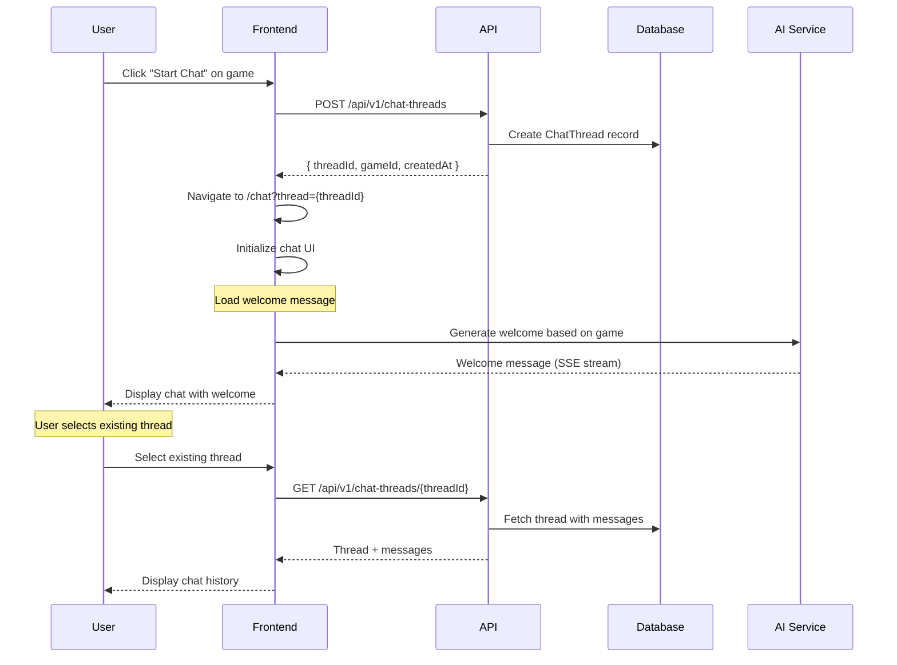
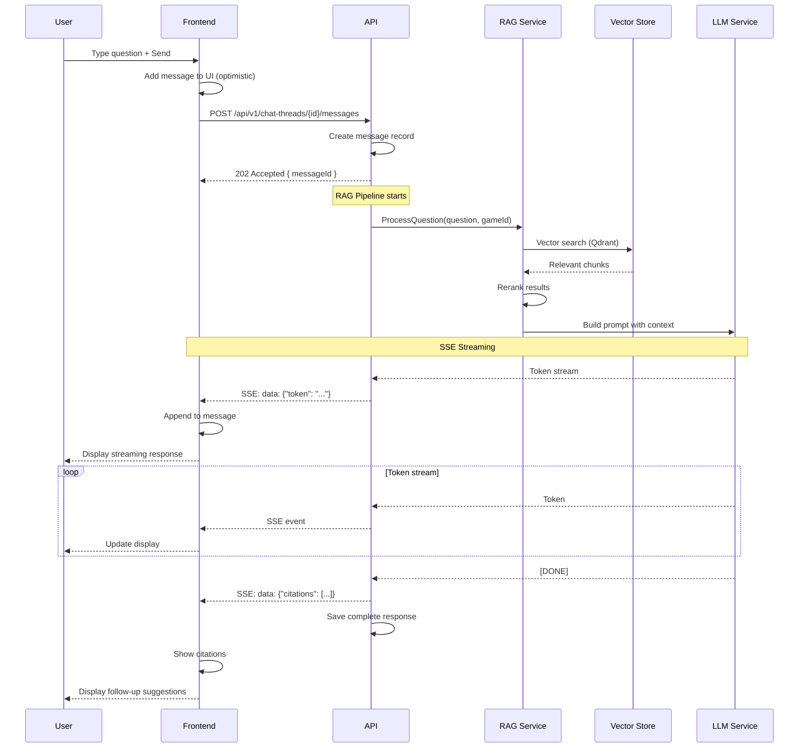

# AI Chat Flows

> User flows for interacting with the AI game assistant.

## Table of Contents

- [Start Chat](#start-chat)
- [Ask Question](#ask-question)
- [Chat History](#chat-history)
- [Manage Threads](#manage-threads)
- [Export Chat](#export-chat)
- [Quick Questions](#quick-questions)

---

## Start Chat

### User Story

```gherkin
Feature: Start AI Chat
  As a user
  I want to start a chat session with the AI
  So that I can ask questions about a game

  Scenario: Start chat from game page
    Given I am on a game detail page
    When I click "Start Chat"
    Then a new chat thread is created for that game
    And I see the chat interface
    And I can start asking questions

  Scenario: Start chat from dashboard
    Given I am on the dashboard
    When I click "Ask AI"
    Then I am prompted to select a game
    And then a new thread is created

  Scenario: Continue existing thread
    Given I have an existing chat thread for Catan
    When I start a new chat for Catan
    Then I see option to continue existing or start new
```

### Screen Flow

```
Game Detail → [💬 Start Chat] → Chat Interface
    or
Dashboard → [Ask AI] → Game Selector → Chat Interface
                             ↓
                      ┌──────────────────────────────┐
                      │ Chat with MeepleAI          │
                      │ Game: Catan                  │
                      ├──────────────────────────────┤
                      │ 🤖 Welcome! I can help with: │
                      │ • Rules clarification        │
                      │ • Setup guidance             │
                      │ • Strategy tips              │
                      ├──────────────────────────────┤
                      │ [Type your question...]  [→] │
                      └──────────────────────────────┘
```

### Sequence Diagram



### API Flow

| Step | Endpoint | Method | Body | Response |
|------|----------|--------|------|----------|
| 1 | `/api/v1/chat-threads` | POST | `{ gameId }` | `{ threadId, ... }` |
| 2 | `/api/v1/chat-threads/{id}` | GET | - | Thread with messages |
| 3 | `/api/v1/chat-threads` | GET | `?gameId={id}` | List threads for game |

**Create Thread Request:**
```json
{
  "gameId": "uuid",
  "title": "Rules questions"  // optional, auto-generated if not provided
}
```

**Thread Response:**
```json
{
  "id": "uuid",
  "gameId": "uuid",
  "gameName": "Catan",
  "title": "Rules questions",
  "status": "open",
  "messageCount": 0,
  "createdAt": "2026-01-19T10:00:00Z",
  "lastMessageAt": null
}
```

### Implementation Status

| Component | Status | Location |
|-----------|--------|----------|
| Create Thread Endpoint | ✅ Implemented | `KnowledgeBaseEndpoints.cs` |
| Chat Page | ✅ Implemented | `/app/(chat)/chat/page.tsx` |
| GameSelector | ✅ Implemented | `GameSelector.tsx` |
| ChatLayout | ✅ Implemented | `ChatLayout.tsx` |

---

## Ask Question

### User Story

```gherkin
Feature: Ask AI Questions
  As a user in a chat session
  I want to ask questions about the game
  So that I can get help with rules and strategy

  Scenario: Ask a simple question
    Given I am in a chat session for Catan
    When I type "How do I build a settlement?"
    And I press Enter/Send
    Then my question appears in the chat
    And the AI streams a response
    And I see citations from the rulebook

  Scenario: Ask with document context
    Given the game has an indexed PDF
    When I ask about specific rules
    Then the AI uses RAG to find relevant passages
    And the response includes page references

  Scenario: Follow-up questions
    Given the AI just answered about settlements
    When I ask "What about cities?"
    Then the AI understands the context
    And provides relevant follow-up answer
```

### Screen Flow

```
Chat Interface → Type Question → [Send]
                                   ↓
                          Question appears
                                   ↓
                          AI Typing indicator...
                                   ↓
                          Response streams in
                          (with citations)
                                   ↓
                          Follow-up suggestions
                          [How do cities differ?]
                          [What resources needed?]
```

### Sequence Diagram



### API Flow

| Step | Endpoint | Method | Description |
|------|----------|--------|-------------|
| 1 | `/api/v1/chat-threads/{id}/messages` | POST | Send message |
| 2 | SSE Stream | - | Receive AI response |
| 3 | `/api/v1/knowledge-base/ask` | POST | Direct RAG query (alternative) |

**Message Request:**
```json
{
  "content": "How do I build a settlement?",
  "attachments": []  // optional file references
}
```

**SSE Stream Events:**
```
event: start
data: {"messageId": "uuid"}

event: token
data: {"token": "To build"}

event: token
data: {"token": " a settlement"}

event: citation
data: {"pageNumber": 5, "text": "Settlements cost...", "confidence": 0.92}

event: done
data: {"messageId": "uuid", "tokenCount": 150}
```

**Citation Response:**
```json
{
  "citations": [
    {
      "documentId": "uuid",
      "pageNumber": 5,
      "text": "Settlements cost one brick, one lumber, one wool, and one grain.",
      "confidence": 0.92,
      "highlight": "one brick, one lumber, one wool, and one grain"
    }
  ]
}
```

### Implementation Status

| Component | Status | Location |
|-----------|--------|----------|
| Message Endpoint | ✅ Implemented | `KnowledgeBaseEndpoints.cs` |
| RAG Service | ✅ Implemented | `RagService.cs` |
| SSE Streaming | ✅ Implemented | `ChatStreamingService.cs` |
| MessageInput | ✅ Implemented | `MessageInput.tsx` |
| Message Display | ✅ Implemented | `Message.tsx` |
| Citation Card | ✅ Implemented | `CitationCard.tsx` |

---

## Chat History

### User Story

```gherkin
Feature: View Chat History
  As a user
  I want to see my past conversations
  So that I can review previous answers

  Scenario: View history from sidebar
    Given I am in the chat interface
    When I look at the sidebar
    Then I see my recent chat threads
    And they are grouped by game

  Scenario: View history from dashboard
    Given I am on the dashboard
    When I click "Recent Chats"
    Then I see my chat history
    And I can click to continue any conversation

  Scenario: Search chat history
    When I search "settlement" in history
    Then I see threads containing that word
```

### Screen Flow

```
Chat Interface
┌─────────────────────────────────────────────┐
│ ┌───────────┐ ┌───────────────────────────┐ │
│ │ Threads   │ │ Current Chat              │ │
│ ├───────────┤ │                           │ │
│ │ 🔍 Search │ │                           │ │
│ ├───────────┤ │                           │ │
│ │ Catan     │ │                           │ │
│ │ • Rules Q │ │                           │ │
│ │ • Setup   │ │                           │ │
│ ├───────────┤ │                           │ │
│ │ Ticket... │ │                           │ │
│ │ • Scoring │ │                           │ │
│ └───────────┘ └───────────────────────────┘ │
└─────────────────────────────────────────────┘
```

### API Flow

| Endpoint | Method | Query | Description |
|----------|--------|-------|-------------|
| `/api/v1/knowledge-base/my-chats` | GET | - | Dashboard chat list |
| `/api/v1/chat-threads` | GET | `?gameId=&search=` | Filtered threads |
| `/api/v1/chat-threads/{id}` | GET | - | Thread with messages |

**Chat History Response:**
```json
{
  "threads": [
    {
      "id": "uuid",
      "gameId": "uuid",
      "gameName": "Catan",
      "title": "Rules clarification",
      "lastMessage": "Settlements cost one brick...",
      "lastMessageAt": "2026-01-19T10:30:00Z",
      "messageCount": 5
    }
  ],
  "totalCount": 12
}
```

### Implementation Status

| Component | Status | Location |
|-----------|--------|----------|
| My Chats Endpoint | ✅ Implemented | `KnowledgeBaseEndpoints.cs` |
| ChatSidebar | ✅ Implemented | `ChatSidebar.tsx` |
| ChatHistory | ✅ Implemented | `ChatHistory.tsx` |
| ThreadListItem | ✅ Implemented | `ThreadListItem.tsx` |

---

## Manage Threads

### User Story

```gherkin
Feature: Manage Chat Threads
  As a user
  I want to manage my chat threads
  So that I can organize and clean up conversations

  Scenario: Rename thread
    Given I have a chat thread
    When I click edit on the title
    And I enter a new name
    Then the thread is renamed

  Scenario: Close thread
    Given I have an open thread
    When I click "Close thread"
    Then the thread is marked as closed
    And I cannot add new messages
    But I can still view it

  Scenario: Reopen thread
    Given I have a closed thread
    When I click "Reopen"
    Then I can add new messages again

  Scenario: Delete thread
    When I click "Delete thread"
    And I confirm deletion
    Then the thread and all messages are deleted
```

### Screen Flow

```
Thread → [...] Menu
            │
            ├── [✏️ Rename]
            │       ↓
            │   Inline edit title
            │
            ├── [🔒 Close Thread]
            │       ↓
            │   Thread closed
            │
            ├── [🔓 Reopen Thread]
            │       ↓
            │   Thread reopened
            │
            └── [🗑️ Delete]
                    ↓
                Confirm dialog
                    ↓
                Thread deleted
```

### API Flow

| Endpoint | Method | Body | Description |
|----------|--------|------|-------------|
| `/api/v1/chat-threads/{id}` | PATCH | `{ title }` | Rename thread |
| `/api/v1/chat-threads/{id}/close` | POST | - | Close thread |
| `/api/v1/chat-threads/{id}/reopen` | POST | - | Reopen thread |
| `/api/v1/chat-threads/{id}` | DELETE | - | Delete thread |

### Implementation Status

| Component | Status | Location |
|-----------|--------|----------|
| Rename Endpoint | ✅ Implemented | `KnowledgeBaseEndpoints.cs` |
| Close/Reopen | ✅ Implemented | Same file |
| Delete Thread | ✅ Implemented | Same file |
| Thread Actions UI | ✅ Implemented | `MessageActions.tsx` |

---

## Export Chat

### User Story

```gherkin
Feature: Export Chat
  As a user
  I want to export my chat conversations
  So that I can save them for offline reference

  Scenario: Export as Markdown
    Given I have a chat thread
    When I click "Export" and select Markdown
    Then a .md file downloads
    And it contains all messages formatted nicely

  Scenario: Export as JSON
    When I export as JSON
    Then I get structured data
    With all messages, citations, and metadata
```

### Screen Flow

```
Thread → [...] → [📤 Export]
                      ↓
              Export Modal:
              • Format: [Markdown ▼]
              • Include: ☑️ Citations
                        ☑️ Timestamps
              [Download]
                      ↓
              File downloads
```

### API Flow

| Endpoint | Method | Query | Description |
|----------|--------|-------|-------------|
| `/api/v1/chat-threads/{id}/export` | GET | `format=md\|json` | Export thread |

**Export Markdown Format:**
```markdown
# Chat: Rules clarification
Game: Catan
Date: 2026-01-19

## User
How do I build a settlement?

## MeepleAI
To build a settlement, you need:
- 1 Brick
- 1 Lumber
- 1 Wool
- 1 Grain

*Source: Rulebook p.5*

---
```

### Implementation Status

| Component | Status | Location |
|-----------|--------|----------|
| Export Endpoint | ✅ Implemented | `KnowledgeBaseEndpoints.cs` |
| ExportChatModal | ✅ Implemented | `ExportChatModal.tsx` |

---

## Quick Questions

### User Story

```gherkin
Feature: Quick Questions
  As a user
  I want to quickly access common questions
  So that I don't have to type frequently asked questions

  Scenario: Use quick question
    Given I'm in a chat for Catan
    When I click a quick question "How do I set up?"
    Then that question is sent to the chat
    And I receive an answer

  Scenario: Browse quick questions
    Given a game has quick questions defined
    When I click "Quick Questions"
    Then I see categorized common questions
```

### Screen Flow

```
Chat Interface → [❓ Quick Questions]
                        ↓
                Quick Questions Panel:
                ┌─────────────────────┐
                │ Setup               │
                │ • How to set up?    │
                │ • Initial resources │
                ├─────────────────────┤
                │ Gameplay            │
                │ • Turn order?       │
                │ • Building rules?   │
                └─────────────────────┘
                        ↓
                Click question
                        ↓
                Question sent to chat
```

### API Flow

| Endpoint | Method | Description |
|----------|--------|-------------|
| `/api/v1/games/{gameId}/quick-questions` | GET | Get quick questions |

### Implementation Status

| Component | Status | Location |
|-----------|--------|----------|
| Quick Questions Endpoint | ✅ Implemented | `SharedGameCatalogEndpoints.cs` |
| FollowUpQuestions | ✅ Implemented | `FollowUpQuestions.tsx` |

---

## Gap Analysis

### Implemented Features
- [x] Create chat threads
- [x] Send messages with RAG
- [x] SSE streaming responses
- [x] Citations from documents
- [x] Chat history and sidebar
- [x] Thread management (rename, close, delete)
- [x] Export chat (Markdown, JSON)
- [x] Quick questions

### Missing/Partial Features
- [ ] **Message Editing**: Edit sent messages (endpoint exists, UI partial)
- [ ] **Message Reactions**: Thumbs up/down feedback
- [ ] **Voice Input**: Speech-to-text for questions
- [ ] **Image Upload**: Upload game images for questions
- [ ] **Share Thread**: Public link to share conversation
- [ ] **Multi-game Context**: Ask about multiple games at once
- [ ] **Conversation Suggestions**: AI suggests next questions

### Proposed Enhancements

1. **Feedback System**: Allow users to rate responses
2. **Conversation Context**: Better handling of follow-up questions
3. **Offline Mode**: Cache conversations for offline viewing
4. **Real-time Collaboration**: Share chat session with other players
5. **Voice Integration**: Ask questions via voice
