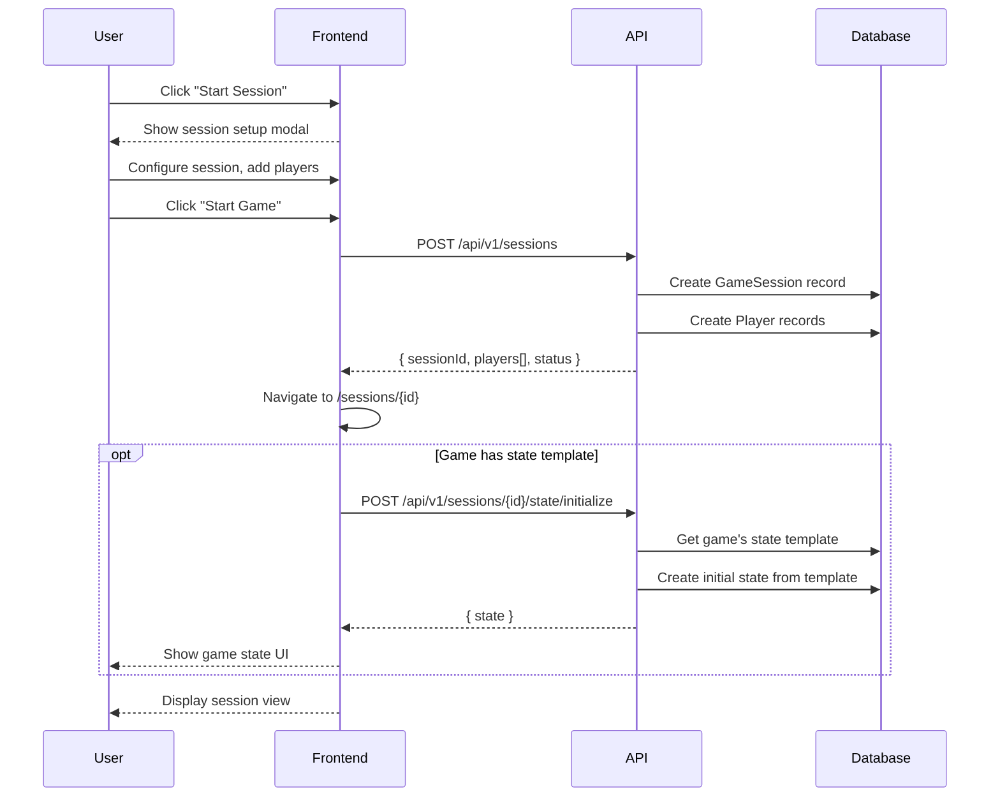
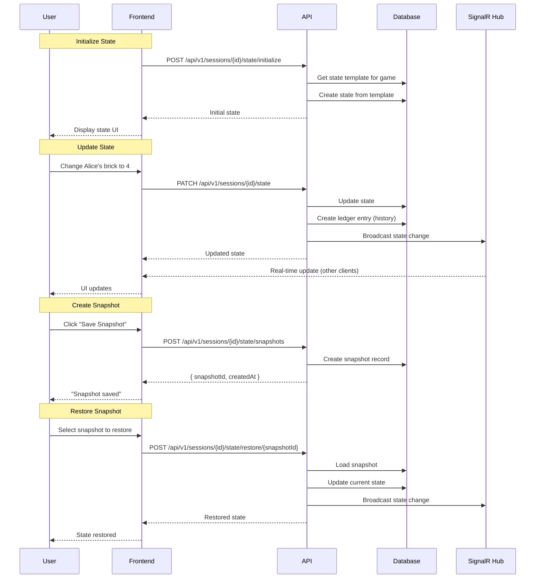
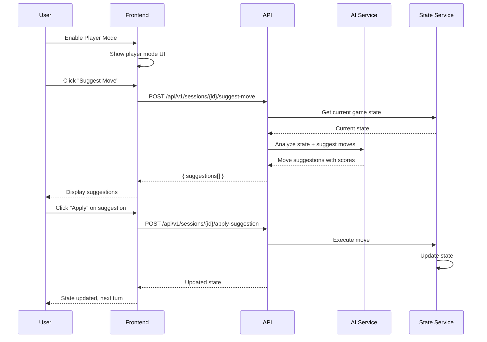

# Game Session Flows

> User flows for managing game sessions and tracking game state.

## Table of Contents

- [Create Session](#create-session)
- [Manage Players](#manage-players)
- [Game State Tracking](#game-state-tracking)
- [Player Mode](#player-mode)
- [Session Lifecycle](#session-lifecycle)
- [Session History](#session-history)

---

## Create Session

### User Story

```gherkin
Feature: Create Game Session
  As a user
  I want to start a game session
  So that I can track my gameplay

  Scenario: Create session for library game
    Given I have Catan in my library
    When I click "Start Session"
    Then a new session is created
    And I am taken to the session view
    And I can add players

  Scenario: Quick start from game page
    Given I am on a game's detail page
    When I click "New Game Session"
    Then a session is created
    And I'm prompted to add players

  Scenario: Session with state template
    Given the game has a state template
    When I create a session
    Then the initial game state is set up
    And I can track resources/scores
```

### Screen Flow

```
Game/Library → [🎲 Start Session]
                      ↓
              Session Setup Modal:
              ┌─────────────────────────┐
              │ New Game: Catan         │
              ├─────────────────────────┤
              │ Session Name: [optional]│
              │                         │
              │ Players:                │
              │ [+ Add Player]          │
              │ • Player 1 (You)        │
              │                         │
              │ [Cancel] [Start Game]   │
              └─────────────────────────┘
                      ↓
              Session View
              (Active gameplay)
```

### Sequence Diagram



### API Flow

| Step | Endpoint | Method | Body | Response |
|------|----------|--------|------|----------|
| 1 | `/api/v1/sessions` | POST | Session config | Session object |
| 2 | `/api/v1/sessions/{id}/state/initialize` | POST | - | Initial state |

**Create Session Request:**
```json
{
  "gameId": "uuid",
  "name": "Friday Night Catan",  // optional
  "players": [
    { "name": "Alice", "isCurrentUser": true },
    { "name": "Bob", "isCurrentUser": false }
  ]
}
```

**Session Response:**
```json
{
  "id": "uuid",
  "gameId": "uuid",
  "gameName": "Catan",
  "name": "Friday Night Catan",
  "status": "active",
  "players": [
    { "id": "uuid", "name": "Alice", "order": 1, "isCurrentUser": true },
    { "id": "uuid", "name": "Bob", "order": 2, "isCurrentUser": false }
  ],
  "startedAt": "2026-01-19T19:00:00Z",
  "hasStateTracking": true
}
```

### Implementation Status

| Component | Status | Location |
|-----------|--------|----------|
| Create Session Endpoint | ✅ Implemented | `GameEndpoints.cs` |
| Session Setup Modal | ✅ Implemented | `SessionSetupModal.tsx` |
| Session Page | ✅ Implemented | `/app/(public)/sessions/[id]/page.tsx` |

---

## Manage Players

### User Story

```gherkin
Feature: Manage Session Players
  As a session host
  I want to manage players in my session
  So that I can track who is playing

  Scenario: Add player mid-game
    Given a session is in progress
    When I click "Add Player"
    And enter the player's name
    Then they are added to the session

  Scenario: Remove player
    When I remove a player
    Then they are removed from the session
    But their historical data remains

  Scenario: Reorder players
    When I drag players to reorder
    Then the turn order is updated
```

### Screen Flow

```
Session View → Players Panel
                   │
         ┌────────┴────────┐
         ↓                 ↓
   [+ Add Player]    Player Cards:
         ↓           ┌─────────────┐
   Enter Name:       │ 1. Alice 👑 │
   [________]        │ 2. Bob      │
   [Add]             │ 3. Charlie  │
                     │ [+ Add]     │
                     └─────────────┘
```

### API Flow

| Endpoint | Method | Body | Description |
|----------|--------|------|-------------|
| `/api/v1/sessions/{id}/players` | POST | `{ name }` | Add player |
| `/api/v1/sessions/{id}/players/{playerId}` | DELETE | - | Remove player |
| `/api/v1/sessions/{id}/players/reorder` | PUT | `{ order[] }` | Reorder players |

### Implementation Status

| Component | Status | Location |
|-----------|--------|----------|
| Add Player Endpoint | ✅ Implemented | `GameEndpoints.cs` |
| Player Management UI | ⚠️ Partial | Basic implementation |

---

## Game State Tracking

### User Story

```gherkin
Feature: Track Game State
  As a player
  I want to track game state (scores, resources)
  So that I can see progress and resolve disputes

  Scenario: Initialize state from template
    Given the game has a state template
    When the session starts
    Then each player gets initial resources
    And the board state is initialized

  Scenario: Update player resources
    When I update a player's resource count
    Then the change is saved
    And a history entry is created

  Scenario: View state history
    When I open state history
    Then I see all changes made
    And I can rollback to a previous state

  Scenario: Create snapshot
    When I click "Save Snapshot"
    Then the current state is saved
    And I can restore it later
```

### Screen Flow

```
Session → State Tab
           │
    ┌──────┴──────┐
    ↓             ↓
Players State   Board State
┌─────────────────────────────────┐
│ Alice          Bob              │
│ ┌────────┐     ┌────────┐      │
│ │ Brick: 3│    │ Brick: 2│      │
│ │ Wood:  2│    │ Wood:  4│      │
│ │ Grain: 1│    │ Grain: 0│      │
│ │ [Edit]  │    │ [Edit]  │      │
│ └────────┘     └────────┘      │
├─────────────────────────────────┤
│ [📸 Snapshot] [📜 History]      │
└─────────────────────────────────┘
```

### Sequence Diagram



### API Flow

| Endpoint | Method | Description |
|----------|--------|-------------|
| `/api/v1/sessions/{id}/state/initialize` | POST | Initialize from template |
| `/api/v1/sessions/{id}/state` | GET | Get current state |
| `/api/v1/sessions/{id}/state` | PATCH | Update state |
| `/api/v1/sessions/{id}/state/snapshots` | POST | Create snapshot |
| `/api/v1/sessions/{id}/state/snapshots` | GET | List snapshots |
| `/api/v1/sessions/{id}/state/restore/{snapshotId}` | POST | Restore snapshot |

**State Update Request:**
```json
{
  "players": {
    "alice-uuid": {
      "resources": { "brick": 4, "wood": 2 }
    }
  }
}
```

**Ledger Entry (History):**
```json
{
  "id": "uuid",
  "sessionId": "uuid",
  "action": "UPDATE_RESOURCE",
  "player": "Alice",
  "field": "brick",
  "oldValue": 3,
  "newValue": 4,
  "timestamp": "2026-01-19T19:15:00Z"
}
```

### Implementation Status

| Component | Status | Location |
|-----------|--------|----------|
| State Initialize | ✅ Implemented | `GameEndpoints.cs` |
| State Update | ✅ Implemented | Same file |
| Snapshots | ✅ Implemented | Same file |
| GameStateViewer | ✅ Implemented | `GameStateViewer.tsx` |
| GameStateEditor | ✅ Implemented | `GameStateEditor.tsx` |
| LedgerTimeline | ✅ Implemented | `LedgerTimeline.tsx` |
| SignalR Integration | ✅ Implemented | `useGameStateSignalR.ts` |

---

## Player Mode

### User Story

```gherkin
Feature: Player Mode
  As a player
  I want AI assistance during my turn
  So that I can get strategic suggestions

  Scenario: Enable player mode
    Given a session is active
    When I enable "Player Mode"
    Then I see AI suggestions for my turn
    And I can ask for move recommendations

  Scenario: Get move suggestion
    Given player mode is enabled
    When I click "Suggest Move"
    Then the AI analyzes the current state
    And suggests optimal moves

  Scenario: Apply suggestion
    When I click "Apply" on a suggestion
    Then the move is executed
    And state is updated accordingly
```

### Screen Flow

```
Session → [🎮 Enable Player Mode]
                    ↓
           Player Mode Active
           ┌──────────────────────────┐
           │ 🤖 AI Assistant Active   │
           │                          │
           │ Current Turn: Alice      │
           │ Suggested Moves:         │
           │ 1. Build settlement (★★★)│
           │ 2. Trade with Bob (★★)   │
           │ 3. Buy dev card (★)      │
           │                          │
           │ [Apply #1] [Ask Why]     │
           └──────────────────────────┘
```

### Sequence Diagram



### API Flow

| Endpoint | Method | Body | Description |
|----------|--------|------|-------------|
| `/api/v1/sessions/{id}/suggest-move` | POST | `{ playerId }` | Get AI suggestions |
| `/api/v1/sessions/{id}/apply-suggestion` | POST | `{ suggestionId }` | Apply suggestion |

**Suggestion Response:**
```json
{
  "suggestions": [
    {
      "id": "uuid",
      "action": "build_settlement",
      "description": "Build settlement at position (3,2)",
      "score": 0.95,
      "reasoning": "This position gives access to wheat and ore...",
      "stateChanges": {
        "resources": { "brick": -1, "wood": -1 }
      }
    }
  ]
}
```

### Implementation Status

| Component | Status | Location |
|-----------|--------|----------|
| Suggest Move Endpoint | ✅ Implemented | `GameEndpoints.cs` |
| Apply Suggestion | ✅ Implemented | Same file |
| PlayerModeControls | ✅ Implemented | `PlayerModeControls.tsx` |
| PlayerModeHelpModal | ✅ Implemented | `PlayerModeHelpModal.tsx` |
| PlayerModeTour | ✅ Implemented | `PlayerModeTour.tsx` |

---

## Session Lifecycle

### User Story

```gherkin
Feature: Session Lifecycle
  As a session host
  I want to manage the session lifecycle
  So that I can pause, complete, or abandon sessions

  Scenario: Pause session
    Given a session is active
    When I click "Pause"
    Then the session is paused
    And I can resume later

  Scenario: Complete session
    Given a session has ended
    When I click "Complete Session"
    And I enter final scores
    Then the session is marked complete
    And it moves to history

  Scenario: Abandon session
    When I click "Abandon"
    And confirm the action
    Then the session is marked abandoned
    And no winner is recorded
```

### Screen Flow

```
Active Session → Session Controls
                      │
         ┌────────────┼────────────┐
         ↓            ↓            ↓
     [⏸ Pause]   [✅ Complete]  [❌ Abandon]
         ↓            ↓            ↓
     Paused       Enter Scores   Confirm
     Status       ┌──────────┐   Dialog
         ↓        │ Winner:  │      ↓
     [▶ Resume]   │ [Alice▼] │   Abandoned
                  │ Scores:  │
                  │ Alice: 10│
                  │ Bob:   8 │
                  └──────────┘
                       ↓
                  Session Complete
                  → History
```

### API Flow

| Endpoint | Method | Body | Description |
|----------|--------|------|-------------|
| `/api/v1/sessions/{id}/pause` | POST | - | Pause session |
| `/api/v1/sessions/{id}/resume` | POST | - | Resume session |
| `/api/v1/sessions/{id}/complete` | POST | Final scores | Complete session |
| `/api/v1/sessions/{id}/abandon` | POST | - | Abandon session |

**Complete Session Request:**
```json
{
  "winnerId": "player-uuid",
  "finalScores": {
    "player-uuid-1": 10,
    "player-uuid-2": 8
  },
  "duration": 90  // minutes
}
```

### Implementation Status

| Component | Status | Location |
|-----------|--------|----------|
| Lifecycle Endpoints | ✅ Implemented | `GameEndpoints.cs` |
| SessionWarningModal | ✅ Implemented | `SessionWarningModal.tsx` |

---

## Session History

### User Story

```gherkin
Feature: Session History
  As a user
  I want to view my past sessions
  So that I can see my game history and statistics

  Scenario: View session history
    Given I have played games before
    When I go to Session History
    Then I see all my past sessions
    And I see stats (wins, play time)

  Scenario: View session details
    When I click on a past session
    Then I see the full session details
    And I see the final state and scores

  Scenario: Filter history
    When I filter by game "Catan"
    Then I only see Catan sessions
```

### Screen Flow

```
Dashboard → [📜 Session History] → History Page
                                      │
                                ┌─────┴─────┐
                                ↓           ↓
                            Filters      Session List
                         [Game: All▼]   ┌─────────────────┐
                         [Status: All▼] │ Catan           │
                         [Date Range]   │ 2026-01-19      │
                                        │ Winner: Alice   │
                                        │ Duration: 90min │
                                        │ [View Details]  │
                                        └─────────────────┘
```

### API Flow

| Endpoint | Method | Query | Description |
|----------|--------|-------|-------------|
| `/api/v1/sessions/history` | GET | Filters | Get session history |
| `/api/v1/sessions/statistics` | GET | - | Get aggregated stats |
| `/api/v1/sessions/{id}` | GET | - | Get session details |
| `/api/v1/sessions/active` | GET | - | Get active sessions |

**History Response:**
```json
{
  "sessions": [
    {
      "id": "uuid",
      "gameName": "Catan",
      "status": "completed",
      "winner": "Alice",
      "players": ["Alice", "Bob", "Charlie"],
      "duration": 90,
      "playedAt": "2026-01-19T19:00:00Z"
    }
  ],
  "statistics": {
    "totalSessions": 25,
    "totalPlayTime": 1500,
    "winRate": 0.4,
    "mostPlayed": "Catan"
  }
}
```

### Implementation Status

| Component | Status | Location |
|-----------|--------|----------|
| History Endpoint | ✅ Implemented | `GameEndpoints.cs` |
| Statistics Endpoint | ✅ Implemented | Same file |
| History Page | ✅ Implemented | `/app/(public)/sessions/history/page.tsx` |
| Sessions Page | ✅ Implemented | `/app/(public)/sessions/page.tsx` |

---

## Gap Analysis

### Implemented Features
- [x] Create game sessions
- [x] Add/manage players
- [x] Game state initialization from templates
- [x] State tracking and updates
- [x] State snapshots and restore
- [x] State history (ledger)
- [x] Player mode with AI suggestions
- [x] Session lifecycle (pause, complete, abandon)
- [x] Session history and statistics
- [x] Real-time sync via SignalR

### Missing/Partial Features
- [ ] **Session Limits by Tier**: Not currently enforced
- [ ] **Concurrent Session Limit**: No limit on active sessions
- [ ] **Session Sharing**: No way to invite others to join
- [ ] **Turn Timer**: No built-in turn timer
- [ ] **Rematch**: Quick "play again" with same players
- [ ] **Session Export**: Export session to file
- [ ] **Achievements**: Track milestones and achievements

### Proposed Enhancements

1. **Tier-Based Session Limits**: Implement configurable session limits
2. **Session Invites**: Send invite links to join session
3. **Turn Notifications**: Alert when it's your turn
4. **Session Templates**: Save player configurations for quick start
5. **Social Features**: Share session results to social media
6. **Achievements System**: Track and display gaming achievements
7. **AI Game Master**: AI-hosted sessions with automated state management
