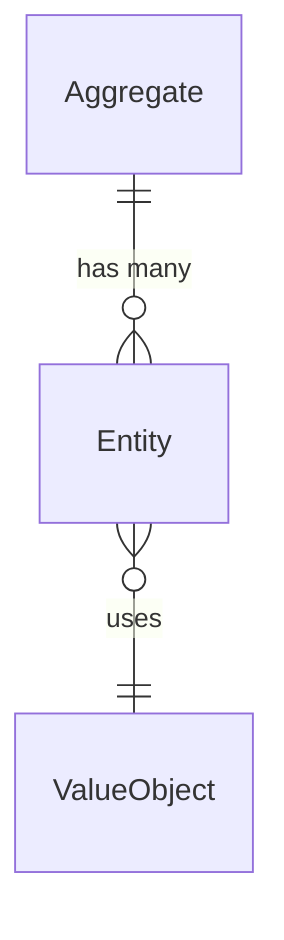

# Bounded Context Diagrams

Visual documentation for all MeepleAI bounded contexts using Mermaid diagrams.

## 📂 Structure

Each bounded context has 4 diagram types with **dual formats** (.mmd source + .svg compiled):

1. **entities.mmd/.svg**: Entity Relationship Diagram
   - Shows aggregates, entities, and value objects
   - Includes primary keys, foreign keys, and key properties
   - Displays cardinality relationships (1:1, 1:N, N:M)

2. **flow-{primary-command}.mmd/.svg**: Primary Command Sequence
   - Illustrates CQRS flow for most important command
   - Shows: Client → Endpoint → Mediator → Validator → Handler → Domain → DB → Events

3. **flow-{secondary}.mmd/.svg**: Secondary Flow (Command or Query)
   - Important secondary operation sequence
   - May show query patterns, background jobs, or specialized workflows

4. **integration-flow.mmd/.svg**: Integration Diagram
   - Context integration with other bounded contexts
   - Event-driven communication patterns
   - Direct dependencies and external services

### File Formats

| Format | Purpose | Size | Quality |
|--------|---------|------|---------|
| `.mmd` | Source (editable) | 1-5KB | N/A |
| `.svg` | Vector graphics (recommended) | 25-260KB | Infinite ✅ |
| `.png` | Raster (legacy) | 40-50KB | 2048px max |

**Recommendation**: Use `.svg` for all documentation. SVG files are:
- ✅ Infinitely scalable (no quality loss)
- ✅ Smaller file sizes than high-res PNG
- ✅ Editable in vector tools (Figma, Illustrator)
- ✅ Browser-native support

## 📋 Contexts Documented

### ✅ Complete (8 Contexts)

| Context | Diagrams | Key Features |
|---------|----------|--------------|
| **UserLibrary** | entities, flow-add-game, flow-upload-private-pdf, integration-flow | Collection management, PDF association, labels, sharing |
| **Administration** | entities, flow-suspend-user, flow-add-token-credits, integration-flow | Token management, batch jobs, audit logging |
| **DocumentProcessing** | entities, flow-extract-pdf, flow-upload-pdf, integration-flow | 3-stage extraction pipeline, chunked uploads |
| **SharedGameCatalog** | entities, flow-approve-publication, integration-flow | Publication workflow, share requests, soft-delete |
| **SystemConfiguration** | entities, flow-update-config, flow-tier-routing, integration-flow | Runtime config, feature flags, tier routing |
| **UserNotifications** | entities, flow-create-notification, flow-get-notifications, integration-flow | Event-driven notifications, email integration |
| **WorkflowIntegration** | entities, flow-create-n8n-config, flow-test-connection, integration-flow | n8n integration, webhook system |
| **SessionTracking** | entities, flow-create-session, flow-roll-dice, integration-flow | Real-time features, SSE streaming, dice/cards |

### 🎯 Previously Complete (3 Contexts)

- **Authentication**: Login, registration, 2FA flows
- **GameManagement**: Game CRUD, sessions, rule specs
- **KnowledgeBase**: RAG system, agent typologies, multi-agent chat

## 🎨 Diagram Conventions

### Entity Relationship Diagrams


**Relationship Symbols**:
- `||--o{`: One-to-many
- `||--||`: One-to-one
- `}o--||`: Many-to-one
- `}o--o{`: Many-to-many

**Property Annotations**:
- `PK`: Primary Key
- `FK`: Foreign Key
- `UK`: Unique Key

### Sequence Diagrams

**Standard CQRS Flow**:
```
Client → Endpoint → Mediator → Validator → Handler → Domain → DB → Events
```

**Participants**:
- `Client`: HTTP client (web app, API consumer)
- `Endpoint`: ASP.NET Minimal API endpoint
- `Mediator`: MediatR orchestration
- `Validator`: FluentValidation
- `Handler`: Command/Query handler
- `Domain`: Domain entity/aggregate
- `DB`: PostgreSQL database
- `Events`: Domain event publisher

### Integration Diagrams

**Arrow Types**:
- `-->` : Event-driven communication (domain events)
- `-.->` : Direct dependencies (queries, FK references)
- Solid lines: Strong coupling
- Dashed lines: Loose coupling

**Styling Classes**:
- Authentication: Blue (`#0066cc`)
- Administration: Orange (`#ff9800`)
- GameManagement: Light Orange (`#ff9800`)
- KnowledgeBase: Purple (`#9c27b0`)
- UserLibrary: Green (`#4caf50`)
- DocumentProcessing: Blue (`#2196f3`)
- SharedGameCatalog: Purple (`#9c27b0`)
- SystemConfiguration: Teal (`#009688`)
- UserNotifications: Pink (`#e91e63`)
- SessionTracking: Purple (`#9c27b0`)
- WorkflowIntegration: Light Blue (`#0288d1`)

## 🔧 Usage

### View in VS Code
Install Mermaid Preview extension and open `.mmd` files.

### Generate Single Diagram
```bash
# Install mermaid-cli (one-time setup)
npm install -g @mermaid-js/mermaid-cli

# Generate PNG (raster)
mmdc -i entities.mmd -o entities.png

# Generate SVG (vector - recommended)
mmdc -i entities.mmd -o entities.svg -b transparent
```

### Regenerate All SVG Diagrams (Batch)
```bash
# From diagrams/ directory
cd docs/09-bounded-contexts/diagrams

# Generate all SVG files from .mmd sources
for file in $(find . -name "*.mmd" -type f); do
  dir=$(dirname "$file")
  base=$(basename "$file" .mmd)
  mmdc -i "$file" -o "$dir/$base.svg" -b transparent
done

# Verify generation
find . -name "*.svg" | wc -l  # Should show 43
```

### Embed in Markdown
```markdown
<!-- Prefer SVG for infinite quality -->


<!-- PNG fallback for compatibility -->

```

## 📚 Related Documentation

- [Bounded Context Complete Docs](../): Full API references for each context
- [Architecture ADRs](../../01-architecture/adr/): Architectural Decision Records
- [CQRS Pattern](../../02-development/coding-standards.md): Implementation guidelines
- [Domain Events](../../01-architecture/domain-events.md): Event catalog

## 🔄 Maintenance

**Update Frequency**: Update diagrams when:
- New aggregates or entities added
- Key command/query flows change
- Integration patterns evolve
- Domain events modified

**Regeneration Process**:
1. Edit `.mmd` source files
2. Run batch SVG generation (see Usage section)
3. Verify output: `find . -name "*.svg" | wc -l` should show 43
4. Commit both `.mmd` and `.svg` files

**Review Schedule**: Quarterly review for accuracy

---

**Last Updated**: 2026-02-07 (SVG generation completed)
**Total Diagrams**: 43 (11 contexts × 3-4 diagrams each)
**Formats**: 43 `.mmd` sources + 43 `.svg` compiled + 43 `.png` legacy
**Status**: ✅ Complete
