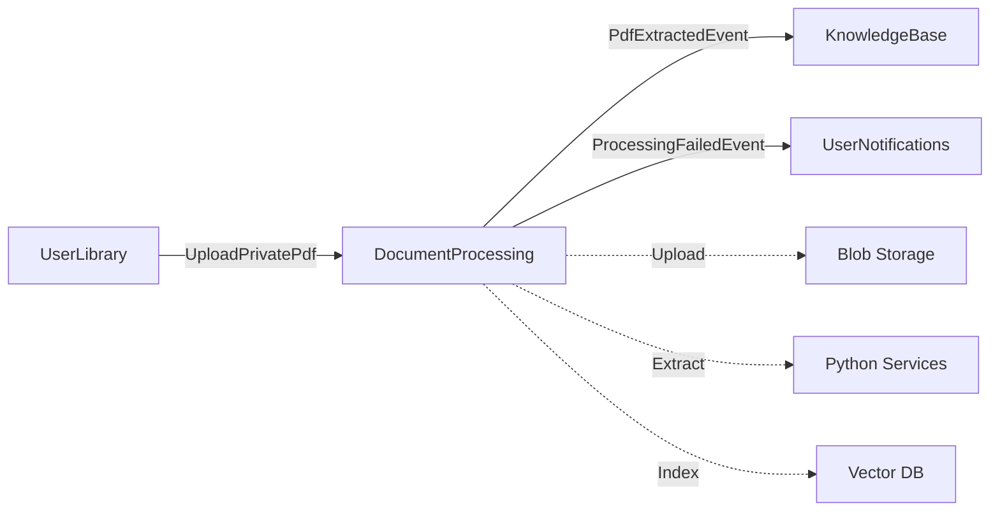

# DocumentProcessing Bounded Context - Complete API Reference

**PDF Upload, 3-Stage Extraction Pipeline, Chunking, Vector Indexing**

> 📖 **Complete Documentation**: Part of Issue #3794
> 🎯 **Key Feature**: 3-stage quality-based extraction (Unstructured → SmolDocling → Docnet) per ADR-003b

---

## 📋 Responsabilità

- PDF upload e storage (S3-compatible OR local filesystem)
- 3-stage extraction pipeline con quality thresholds
- Chunked uploads (resumable per file grandi)
- Private PDF support (Issue #3479)
- Document collections (multi-PDF organization)
- Processing progress tracking (SSE streaming)
- Quality validation (text coverage, structure, tables)
- Vector indexing (Qdrant integration)
- Background job processing
- Quota enforcement (storage limits per tier)

---

## 🏗️ Domain Model

### Aggregates

**PdfDocument** (Aggregate Root):
```csharp
public class PdfDocument
{
    public Guid Id { get; private set; }
    public Guid GameId { get; private set; }
    public Guid UploadedByUserId { get; private set; }
    public string FileName { get; private set; }
    public long FileSizeBytes { get; private set; }
    public ProcessingStatus Status { get; private set; }  // Pending | Extracting | Completed | Failed
    public string? ExtractedText { get; private set; }
    public int? PageCount { get; private set; }
    public int? CharacterCount { get; private set; }
    public double? QualityScore { get; private set; }     // 0.0-1.0
    public bool IsPublic { get; private set; }
    public bool IsDeleted { get; private set; }
    public DateTime UploadedAt { get; private set; }
    public DateTime? ProcessedAt { get; private set; }
    public string? ProcessingError { get; private set; }
    public string? ProcessingProgressJson { get; private set; } // SSE progress tracking

    // 3-Stage Pipeline Tracking
    public List<ExtractionAttempt> Attempts { get; private set; }

    // Domain methods
    public void StartProcessing() { }
    public void RecordAttempt(ExtractionStage stage, double quality, bool succeeded) { }
    public void MarkCompleted(string extractedText, double finalQuality) { }
    public void MarkFailed(string error) { }
    public void SetVisibility(bool isPublic) { }
    public void UpdateProgress(ProcessingProgress progress) { }
}
```

**ExtractionAttempt** (Entity):
```csharp
public class ExtractionAttempt
{
    public Guid Id { get; private set; }
    public Guid PdfDocumentId { get; private set; }
    public ExtractionStage Stage { get; private set; }    // Unstructured | SmolDocling | Docnet
    public double QualityScore { get; private set; }
    public bool Succeeded { get; private set; }
    public DateTime AttemptedAt { get; private set; }
    public int DurationMs { get; private set; }
    public string? ErrorMessage { get; private set; }
}
```

**DocumentCollection** (Aggregate Root - Issue #2051):
```csharp
public class DocumentCollection
{
    public Guid Id { get; private set; }
    public Guid GameId { get; private set; }
    public Guid UserId { get; private set; }
    public string Name { get; private set; }
    public string? Description { get; private set; }
    public DateTime CreatedAt { get; private set; }

    // Documents in collection
    public IReadOnlyList<DocumentCollectionContent> Documents { get; }

    // Domain methods
    public void AddDocument(Guid pdfDocumentId, string documentType, int sortOrder) { }
    public void RemoveDocument(Guid documentId) { }
}
```

**ChunkedUploadSession** (Aggregate Root):
```csharp
public class ChunkedUploadSession
{
    public Guid SessionId { get; private set; }
    public Guid UserId { get; private set; }
    public Guid? GameId { get; private set; }
    public string FileName { get; private set; }
    public long TotalFileSize { get; private set; }
    public int TotalChunks { get; private set; }
    public int ChunkSizeBytes { get; private set; }
    public Dictionary<int, bool> ReceivedChunks { get; private set; }
    public DateTime CreatedAt { get; private set; }
    public DateTime ExpiresAt { get; private set; }
    public bool IsComplete { get; private set; }

    // Domain methods
    public void RecordChunk(int chunkIndex) { }
    public bool AreAllChunksReceived() { }
    public void Complete() { }
}
```

### Value Objects

**ExtractionStage**:
```csharp
public enum ExtractionStage
{
    Unstructured,  // Stage 1: Python Unstructured.py (80% success)
    SmolDocling,   // Stage 2: SmolDocling VLM (15% fallback)
    Docnet         // Stage 3: Docnet OCR (5% best-effort)
}
```

**ProcessingStatus**:
```csharp
public enum ProcessingStatus
{
    Pending,      // Upload complete, awaiting processing
    Extracting,   // Text extraction in progress
    Chunking,     // Creating chunks for indexing
    Indexing,     // Vectorizing and storing in Qdrant
    Completed,    // All stages complete
    Failed        // Processing error occurred
}
```

**ProcessingProgress**:
```csharp
public record ProcessingProgress
{
    public ProcessingStatus Status { get; init; }
    public string? Stage { get; init; }        // "Stage 1", "Stage 2", "Stage 3"
    public int Progress { get; init; }         // 0-100 percentage
    public int? CurrentChunk { get; init; }
    public int? TotalChunks { get; init; }
    public int? ExtractedPages { get; init; }
    public int? TotalPages { get; init; }
    public DateTime StartedAt { get; init; }
    public DateTime? EstimatedAt { get; init; }
}
```

---

## 📡 Application Layer (CQRS)

> **Total Operations**: 26 (14 commands + 10 queries + 2 background jobs)

---

### PDF UPLOAD & INGESTION

| Command/Query | HTTP Method | Endpoint | Auth | Request | Response |
|---------------|-------------|----------|------|---------|----------|
| `UploadPdfCommand` | POST | `/api/v1/ingest/pdf` | Session | Multipart form | `{ documentId, fileName }` (201) |
| `UploadPrivatePdfCommand` | POST | `/api/v1/users/{userId}/library/entries/{entryId}/pdf` | Session | Multipart form | `{ pdfId, fileName, fileSize, sseStreamUrl }` (201) |

**UploadPdfCommand**:
- **Purpose**: Upload PDF rulebook for game
- **Request**: Multipart form with file + optional metadata JSON
  ```
  file: azul_rulebook.pdf
  metadata: {"gameName":"Azul","versionType":"Official","language":"it"}
  ```
- **Validation**:
  - File type: application/pdf only
  - Max size: 100 MB (configurable via SystemConfiguration)
  - Quota check: User storage limit (tier-based)
- **Side Effects**:
  - Uploads to blob storage (S3 or local)
  - Creates PdfDocument entity with Status = Pending
  - Triggers background extraction job
  - Auto-creates game if metadata provided and game not exists
- **Response Schema**:
  ```json
  {
    "documentId": "guid",
    "fileName": "azul_rulebook.pdf",
    "gameId": "guid",
    "status": "Pending"
  }
  ```
- **Domain Events**: `PdfUploadedEvent`

**UploadPrivatePdfCommand** (Issue #3479):
- **Purpose**: Upload private PDF for user's library entry
- **Difference**: Associated with UserLibraryEntry, private namespace
- **Response includes**: `sseStreamUrl` for real-time progress updates
- **SSE Endpoint**: `/api/v1/library/{entryId}/pdf/progress`

---

### CHUNKED UPLOADS (Resumable)

| Command/Query | HTTP Method | Endpoint | Auth | Request | Response |
|---------------|-------------|----------|------|---------|----------|
| `InitChunkedUploadCommand` | POST | `/api/v1/ingest/pdf/chunked/init` | Session | `InitChunkedUploadDto` | `{ sessionId, totalChunks, chunkSizeBytes, expiresAt }` |
| `UploadChunkCommand` | POST | `/api/v1/ingest/pdf/chunked/chunk` | Session | Binary chunk data | `{ success, receivedChunks, progressPercentage, isComplete }` |
| `CompleteChunkedUploadCommand` | POST | `/api/v1/ingest/pdf/chunked/complete` | Session | `{ sessionId }` | `{ success, documentId, fileName }` |
| `GetChunkedUploadStatusQuery` | GET | `/api/v1/ingest/pdf/chunked/{sessionId}/status` | Session | None | `ChunkedUploadStatusDto` |

**InitChunkedUploadCommand**:
- **Purpose**: Initialize resumable upload session for large PDFs
- **Request Schema**:
  ```json
  {
    "gameId": "guid",
    "fileName": "large_rulebook.pdf",
    "totalFileSize": 52428800
  }
  ```
- **Response**:
  ```json
  {
    "sessionId": "upload-session-guid",
    "totalChunks": 11,
    "chunkSizeBytes": 5242880,
    "expiresAt": "2026-02-08T12:00:00Z"
  }
  ```
- **Configuration**:
  - Default chunk size: 5 MB
  - Session TTL: 24 hours
  - Out-of-order chunks supported

**UploadChunkCommand**:
- **Request**: Binary chunk data (5 MB max)
- **Headers**: `X-Chunk-Index: 3`, `X-Session-Id: {sessionId}`
- **Response**:
  ```json
  {
    "success": true,
    "receivedChunks": [0, 1, 2, 3],
    "totalChunks": 11,
    "progressPercentage": 36,
    "isComplete": false
  }
  ```
- **Use Case**: Large PDFs (>50 MB), unreliable connections, resume capability

**CompleteChunkedUploadCommand**:
- **Validation**: All chunks must be received (no missing chunks)
- **Side Effects**:
  - Reassembles file from chunks
  - Creates PdfDocument entity
  - Triggers extraction pipeline
  - Cleans up upload session metadata

---

### 3-STAGE EXTRACTION PIPELINE (ADR-003b)

| Command | HTTP Method | Endpoint | Auth | Response |
|---------|-------------|----------|------|----------|
| `ExtractPdfTextCommand` | POST | `/api/v1/ingest/pdf/{pdfId}/extract` | Admin/Editor | `{ success, characterCount, pageCount, processingStatus }` |

**ExtractPdfTextCommand** (3-Stage Orchestrated):
- **Purpose**: Extract text from PDF using quality-based fallback pipeline
- **Pipeline Architecture**:

```
┌─────────────────────────────────────────────────────────────┐
│ EnhancedPdfProcessingOrchestrator (ADR-003b)                │
├─────────────────────────────────────────────────────────────┤
│                                                              │
│ Stage 1: Unstructured.py (Target Quality ≥ 0.80)            │
│ ├─ Service: Python Unstructured.py microservice             │
│ ├─ Strategy: hi_res layout analysis                         │
│ ├─ Success Rate: 80% of PDFs                                │
│ ├─ Avg Latency: <2s                                         │
│ ├─ Quality Metric: chars_per_page (500-1000+ target)        │
│ ├─ Decision: Quality ≥ 0.80 → RETURN ✅                      │
│ └─ Decision: Quality < 0.80 → Stage 2 Fallback              │
│                                                              │
│ Stage 2: SmolDocling VLM (Target Quality ≥ 0.70)            │
│ ├─ Service: SmolDocling vision-language model               │
│ ├─ Strategy: Visual layout understanding                    │
│ ├─ Success Rate: 15% (fallback cases)                       │
│ ├─ Avg Latency: <10s                                        │
│ ├─ Quality Metric: Text completeness + structure            │
│ ├─ Decision: Quality ≥ 0.70 → RETURN ✅                      │
│ └─ Decision: Quality < 0.70 → Stage 3 Fallback              │
│                                                              │
│ Stage 3: Docnet OCR (Best Effort)                            │
│ ├─ Service: Docnet with OCR fallback                        │
│ ├─ Strategy: OCR-based text extraction                      │
│ ├─ Success Rate: 5% (worst-case fallback)                   │
│ ├─ Avg Latency: <5s                                         │
│ ├─ Quality Metric: Accepts any result                       │
│ └─ Decision: RETURN ALWAYS (guaranteed extraction)          │
│                                                              │
└─────────────────────────────────────────────────────────────┘

QUALITY THRESHOLDS (ADR-003):
  • High    ≥ 0.80  (Stage 1 passes)
  • Medium  ≥ 0.70  (Stage 2 acceptable)
  • Low     < 0.70  (Stage 3 fallback)

QUALITY CALCULATION:
  TextQuality = 0.5 + (chars_per_page - 500) / 500 * 0.5
  Example: 800 chars/page → 0.5 + 300/500 * 0.5 = 0.80 ✅
```

- **Response Schema**:
  ```json
  {
    "success": true,
    "characterCount": 16500,
    "pageCount": 20,
    "processingStatus": "Completed",
    "qualityScore": 0.87,
    "stageUsed": "Stage 1",
    "extractionTime": 1840,
    "attempts": [
      {
        "stage": "Unstructured",
        "quality": 0.87,
        "succeeded": true,
        "durationMs": 1840
      }
    ]
  }
  ```
- **Side Effects**:
  - Updates PdfDocument: ExtractedText, PageCount, CharacterCount, QualityScore
  - Sets Status = Completed or Failed
  - Records all attempts in ExtractionAttempt table
- **Domain Events**: `PdfExtractedEvent`, `ExtractionStageCompletedEvent`

---

### VECTOR INDEXING

| Command | HTTP Method | Endpoint | Auth | Response |
|---------|-------------|----------|------|----------|
| `IndexPdfCommand` | POST | `/api/v1/ingest/pdf/{pdfId}/index` | Admin/Editor | `{ success, vectorDocumentId, chunkCount, indexedAt }` |

**IndexPdfCommand**:
- **Purpose**: Create vector embeddings and index in Qdrant
- **Prerequisites**: ExtractedText must exist (extraction completed)
- **Pipeline**:
  1. Text chunking (800 tokens, 100 overlap)
  2. Embedding generation (sentence-transformers/all-MiniLM-L6-v2)
  3. Qdrant storage (collection: "pdfs", namespace: gameId)
- **Response Schema**:
  ```json
  {
    "success": true,
    "vectorDocumentId": "qdrant-doc-id",
    "chunkCount": 42,
    "indexedAt": "2026-02-07T12:30:00Z"
  }
  ```
- **Idempotency**: Safe to re-run (updates existing vectors)
- **Domain Events**: `PdfIndexedEvent`

---

### PDF RETRIEVAL

| Query | HTTP Method | Endpoint | Auth | Response |
|-------|-------------|----------|------|----------|
| `GetPdfTextQuery` | GET | `/api/v1/pdfs/{pdfId}/text` | Session | `PdfTextResult` |
| `DownloadPdfQuery` | GET | `/api/v1/pdfs/{pdfId}/download` | Session | File stream (application/pdf) |
| `GetPdfDocumentsByGameQuery` | GET | `/api/v1/games/{gameId}/pdfs` | Session | `List<PdfDocumentDto>` |
| `GetPdfDocumentByIdQuery` | GET | `/api/v1/pdfs/{pdfId}/metadata` | Session | `PdfDocumentDto` |
| `GetPdfOwnershipQuery` | *(Internal)* | - | - | `{ id, uploadedByUserId }` |

**GetPdfTextQuery**:
- **Purpose**: Retrieve extracted text content
- **Response Schema**:
  ```json
  {
    "id": "guid",
    "fileName": "azul_rulebook.pdf",
    "extractedText": "AZUL - Rules of Play\n\nSetup:\nEach player takes...",
    "processingStatus": "Completed",
    "processedAt": "2026-02-07T10:15:00Z",
    "pageCount": 20,
    "characterCount": 16500,
    "qualityScore": 0.87
  }
  ```

**DownloadPdfQuery**:
- **Purpose**: Download original PDF file
- **Authorization**: Owner OR Admin (row-level security)
- **Response**: File stream with headers
  ```
  Content-Type: application/pdf
  Content-Disposition: attachment; filename="azul_rulebook.pdf"
  Content-Length: 5242880
  ```
- **Storage**: S3 pre-signed URLs OR local file stream
- **Security**: SEC-02 (RLS enforcement)

**GetPdfDocumentsByGameQuery**:
- **Purpose**: List all PDFs for game (public + private if user is owner)
- **Response Schema**:
  ```json
  {
    "pdfs": [
      {
        "id": "guid",
        "fileName": "azul_official_rulebook.pdf",
        "source": "Shared",
        "uploadedAt": "2025-12-01T10:00:00Z",
        "pageCount": 20,
        "qualityScore": 0.92,
        "isPublic": true
      },
      {
        "id": "guid",
        "fileName": "azul_house_rules.pdf",
        "source": "Private",
        "uploadedAt": "2026-02-01T14:30:00Z",
        "pageCount": 3,
        "isPublic": false
      }
    ]
  }
  ```
- **Filtering**: Public PDFs + user's private PDFs (if authenticated)

---

### PROCESSING LIFECYCLE

| Command/Query | HTTP Method | Endpoint | Auth | Response |
|---------------|-------------|----------|------|----------|
| `DeletePdfCommand` | DELETE | `/api/v1/pdf/{pdfId}` | Session + Owner/Admin | 204 No Content |
| `SetPdfVisibilityCommand` | PATCH | `/api/v1/pdfs/{pdfId}/visibility` | Admin | `{ success, message, isPublic }` |
| `GetPdfProgressQuery` | GET | `/api/v1/pdfs/{pdfId}/progress` | Session + Owner/Admin | `ProcessingProgress` |
| `CancelPdfProcessingCommand` | DELETE | `/api/v1/pdfs/{pdfId}/processing` | Session + Owner/Admin | `{ message, errorCode }` |

**DeletePdfCommand**:
- **Purpose**: Delete PDF document and cleanup resources
- **Side Effects**:
  - Soft delete: Sets IsDeleted = true, DeletedAt = UtcNow
  - Blob storage cleanup: Fire-and-forget deletion job
  - Qdrant cleanup: Removes vectors from collection
  - Removes from DocumentCollections
- **Authorization**: Owner OR Admin

**GetPdfProgressQuery**:
- **Purpose**: Real-time processing progress (for status displays)
- **Response Schema**:
  ```json
  {
    "status": "Extracting",
    "stage": "Stage 1",
    "progress": 65,
    "currentChunk": 13,
    "totalChunks": 20,
    "extractedPages": 13,
    "totalPages": 20,
    "startedAt": "2026-02-07T12:00:00Z",
    "estimatedAt": "2026-02-07T12:01:45Z"
  }
  ```
- **Caching**: HybridCache with event-driven invalidation

**CancelPdfProcessingCommand**:
- **Purpose**: Cancel in-flight processing job
- **Validation**: Cannot cancel if already completed
- **Side Effects**:
  - Cancels background job (if possible)
  - Sets Status = Failed, ProcessingError = "Cancelled by user"
  - Cleanup partial extraction results

---

### DOCUMENT COLLECTIONS (Issue #2051)

| Command/Query | HTTP Method | Endpoint | Auth | Request | Response |
|---------------|-------------|----------|------|---------|----------|
| `CreateDocumentCollectionCommand` | POST | `/api/v1/games/{gameId}/document-collections` | Session | `CreateCollectionDto` | `DocumentCollectionDto` (201) |
| `AddDocumentToCollectionCommand` | POST | `/api/v1/games/{gameId}/document-collections/{collectionId}/documents` | Session | `AddDocumentDto` | `{ success, message }` |
| `RemoveDocumentFromCollectionCommand` | DELETE | `/api/v1/games/{gameId}/document-collections/{collectionId}/documents/{documentId}` | Session | None | 204 No Content |
| `GetCollectionByGameQuery` | GET | `/api/v1/games/{gameId}/document-collections` | Session | None | `DocumentCollectionDto` or null |
| `GetCollectionByIdQuery` | GET | `/api/v1/games/{gameId}/document-collections/{collectionId}` | Session | None | `DocumentCollectionDto` |
| `GetCollectionsByUserQuery` | GET | `/api/v1/document-collections/by-user/{userId}` | Session + User/Admin | None | `List<DocumentCollectionDto>` |

**CreateDocumentCollectionCommand**:
- **Purpose**: Group multiple PDFs for game (e.g., rulebook + expansions + FAQs)
- **Request Schema**:
  ```json
  {
    "gameId": "guid",
    "name": "Azul Complete Collection",
    "description": "Official rulebook + all expansions",
    "initialDocuments": [
      {"pdfDocumentId": "guid1", "documentType": "Rulebook", "sortOrder": 1},
      {"pdfDocumentId": "guid2", "documentType": "Expansion", "sortOrder": 2}
    ]
  }
  ```
- **Use Case**: Organize complex games with multiple rulebooks

**AddDocumentToCollectionCommand**:
- **Request Schema**:
  ```json
  {
    "pdfDocumentId": "guid",
    "documentType": "FAQ",
    "sortOrder": 3
  }
  ```
- **Document Types**: Rulebook, Expansion, FAQ, QuickStart, ReferenceCard, Custom

---

### SPECIAL PROCESSING

| Command/Query | HTTP Method | Endpoint | Auth | Response |
|---------------|-------------|----------|------|----------|
| `ExtractBggGamesFromPdfQuery` | POST | `/api/v1/extract-bgg-games` | Admin | `{ success, gameCount, games[] }` |
| `GenerateRuleSpecFromPdfCommand` | POST | `/api/v1/ingest/pdf/{pdfId}/rulespec` | Admin/Editor | `RuleSpecDto` |

**ExtractBggGamesFromPdfQuery** (Issue #2513):
- **Purpose**: Parse PDF for BoardGameGeek IDs (seeding SharedGameCatalog)
- **Algorithm**: Regex + NLP to find BGG IDs in PDF content
- **Use Case**: Admin imports BGG Top 100 list PDF → auto-creates games

**GenerateRuleSpecFromPdfCommand**:
- **Purpose**: AI-powered structured rule extraction
- **Integration**: Calls KnowledgeBase RAG system with special prompt
- **Output**: Markdown-formatted RuleSpec for GameManagement context

---

## 🔄 Domain Events

| Event | When Raised | Payload | Subscribers |
|-------|-------------|---------|-------------|
| `PdfUploadedEvent` | Upload complete | `{ DocumentId, GameId, FileName }` | Administration (audit) |
| `PdfExtractedEvent` | Extraction complete | `{ DocumentId, QualityScore, Stage }` | KnowledgeBase (index trigger) |
| `ExtractionStageCompletedEvent` | Stage done | `{ DocumentId, Stage, Quality, Success }` | Administration (metrics) |
| `PdfIndexedEvent` | Indexing complete | `{ DocumentId, ChunkCount }` | Administration, KnowledgeBase |
| `PdfDeletedEvent` | PDF deleted | `{ DocumentId, DeletedBy }` | KnowledgeBase (cleanup vectors) |
| `ProcessingFailedEvent` | Processing error | `{ DocumentId, Error, Stage }` | UserNotifications (notify uploader) |
| `ChunkedUploadCompletedEvent` | Chunked upload done | `{ SessionId, DocumentId }` | Administration (tracking) |

---

## 🔗 Integration Points

### Inbound Dependencies

**UserLibrary Context**:
- Uploads private PDFs via UploadPrivatePdfCommand
- Associates PDFs with library entries

**SharedGameCatalog Context**:
- Uses ExtractBggGamesFromPdfQuery for seeding

### Outbound Dependencies

**Blob Storage** (S3/R2/Local):
- Uploads files via `IBlobStorageService`
- Generates pre-signed download URLs
- Cleanup on delete

**External Python Services**:
- **Unstructured**: `http://unstructured-service:8000` (Stage 1)
- **SmolDocling**: `http://smoldocling-service:8001` (Stage 2)
- **Embedding**: `http://embedding-service:8002` (vectorization)

**Qdrant (Vector DB)**:
- Stores chunk embeddings for RAG
- Namespace: `game_{gameId}`
- Collection: `pdfs`

**KnowledgeBase Context**:
- Receives PdfIndexedEvent → enables RAG queries
- Queries chunks for hybrid search

### Event-Driven Communication



---

## 🔐 Security & Authorization

### Access Control

- **Upload**: Any authenticated user (quota enforced)
- **Download**: Owner OR Admin (row-level security)
- **Processing**: Admin/Editor only (extract, index commands)
- **Collections**: Owner OR Admin
- **Private PDFs**: Owner only (no admin override for privacy)

### Data Privacy

- **Private PDFs**: Separate namespace in Qdrant (user-scoped)
- **Blob Storage**: Path includes userId for isolation
- **Download URLs**: Pre-signed with 1-hour expiry

### Quota Enforcement

| Tier | Storage Limit | File Size Limit | Daily Uploads |
|------|---------------|-----------------|---------------|
| Free | 100 MB | 10 MB | 5 files |
| Basic | 1 GB | 50 MB | 20 files |
| Premium | 10 GB | 100 MB | 100 files |
| Enterprise | Unlimited | 500 MB | Unlimited |

---

## 🎯 Common Usage Examples

### Example 1: Standard PDF Upload Flow

**Upload**:
```bash
curl -X POST http://localhost:8080/api/v1/ingest/pdf \
  -H "Cookie: meepleai_session_dev={token}" \
  -F "file=@azul_rulebook.pdf" \
  -F 'metadata={"gameName":"Azul","versionType":"Official","language":"it"}'
```

**Response**:
```json
{
  "documentId": "doc-guid",
  "fileName": "azul_rulebook.pdf",
  "gameId": "auto-created-game-guid",
  "status": "Pending"
}
```

**Monitor Progress** (SSE or Polling):
```bash
curl -X GET http://localhost:8080/api/v1/pdfs/doc-guid/progress \
  -H "Cookie: meepleai_session_dev={token}"
```

---

### Example 2: Private PDF Upload with SSE

**Upload**:
```bash
curl -X POST http://localhost:8080/api/v1/users/{userId}/library/entries/{entryId}/pdf \
  -H "Cookie: meepleai_session_dev={token}" \
  -F "file=@custom_rules.pdf"
```

**Response**:
```json
{
  "pdfId": "guid",
  "fileName": "custom_rules.pdf",
  "fileSize": 524288,
  "status": "Pending",
  "sseStreamUrl": "/api/v1/library/{entryId}/pdf/progress"
}
```

**SSE Stream** (Issue #3653):
```
event: progress
data: {"stage":"extraction","percentage":25,"message":"Stage 1: Unstructured"}

event: progress
data: {"stage":"extraction","percentage":50,"message":"Quality: 0.65, trying Stage 2"}

event: progress
data: {"stage":"chunking","percentage":75}

event: complete
data: {"success":true,"documentId":"guid","qualityScore":0.72,"stageUsed":"Stage 2"}
```

---

### Example 3: Chunked Upload (Large PDF)

**Init Session**:
```bash
curl -X POST http://localhost:8080/api/v1/ingest/pdf/chunked/init \
  -H "Content-Type: application/json" \
  -H "Cookie: meepleai_session_dev={token}" \
  -d '{
    "gameId": "guid",
    "fileName": "large_rulebook.pdf",
    "totalFileSize": 52428800
  }'
```

**Response**:
```json
{
  "sessionId": "upload-session-guid",
  "totalChunks": 11,
  "chunkSizeBytes": 5242880,
  "expiresAt": "2026-02-08T12:00:00Z"
}
```

**Upload Chunks** (loop):
```bash
for i in {0..10}; do
  curl -X POST http://localhost:8080/api/v1/ingest/pdf/chunked/chunk \
    -H "X-Chunk-Index: $i" \
    -H "X-Session-Id: upload-session-guid" \
    -H "Cookie: meepleai_session_dev={token}" \
    --data-binary "@chunk_$i.bin"
done
```

**Complete Upload**:
```bash
curl -X POST http://localhost:8080/api/v1/ingest/pdf/chunked/complete \
  -H "Content-Type: application/json" \
  -H "Cookie: meepleai_session_dev={token}" \
  -d '{
    "sessionId": "upload-session-guid"
  }'
```

**Response**:
```json
{
  "success": true,
  "documentId": "doc-guid",
  "fileName": "large_rulebook.pdf"
}
```

---

## 📊 Performance Characteristics

### Extraction Latency Targets

| Stage | Target Latency | Success Rate |
|-------|----------------|--------------|
| Stage 1 (Unstructured) | <2s (P95) | 80% |
| Stage 2 (SmolDocling) | <10s (P95) | 15% |
| Stage 3 (Docnet) | <5s (P95) | 5% |
| **Total Pipeline** | <15s (P95) | 100% |

### Caching

| Query | Cache | TTL | Invalidation |
|-------|-------|-----|--------------|
| GetPdfTextQuery | Redis | 1 hour | PdfExtractedEvent |
| GetPdfProgressQuery | HybridCache | 10 sec | Progress updates (event-driven) |
| GetPdfDocumentsByGameQuery | Redis | 30 min | PdfUploadedEvent, PdfDeletedEvent |

### Database Indexes

```sql
CREATE INDEX idx_pdfs_game ON PdfDocuments(GameId) WHERE NOT IsDeleted;
CREATE INDEX idx_pdfs_user ON PdfDocuments(UploadedByUserId) WHERE NOT IsDeleted;
CREATE INDEX idx_pdfs_status ON PdfDocuments(ProcessingStatus, UploadedAt DESC);
CREATE INDEX idx_collections_game ON DocumentCollections(GameId, UserId);
```

---

## 🧪 Testing Strategy

### Unit Tests

**Location**: `tests/Api.Tests/DocumentProcessing/`

**Key Tests**:
- `EnhancedPdfProcessingOrchestrator_Tests.cs`: 3-stage pipeline logic
- `QualityCalculator_Tests.cs`: Quality score formulas
- `ChunkedUploadSession_Tests.cs`: Out-of-order chunk handling
- `PdfDocument_Tests.cs`: State transitions (Pending → Extracting → Completed)

### Integration Tests

**Tools**: Testcontainers (PostgreSQL, MinIO for S3, Qdrant)

**Scenarios**:
1. **End-to-End Upload → Extract → Index**
2. **3-Stage Fallback**: Force Stage 1 failure → verify Stage 2 called
3. **Chunked Upload**: 10-chunk upload with missing chunk → complete → reassemble
4. **Private PDF Namespace**: Verify isolation from public PDFs

---

## 📂 Code Location

`apps/api/src/Api/BoundedContexts/DocumentProcessing/`

---

## 🔗 Related Documentation

### ADRs
- [ADR-003b: Unstructured PDF Processing](../../01-architecture/adr/adr-003b-unstructured-pdf.md) - 3-stage pipeline
- [ADR-026: Document Collections](../../01-architecture/adr/adr-026-document-collections.md) - Multi-PDF organization

### Other Contexts
- [KnowledgeBase](./knowledge-base.md) - RAG indexing consumer
- [UserLibrary](./user-library.md) - Private PDF uploads
- [SharedGameCatalog](./shared-game-catalog.md) - BGG extraction

---

**Status**: ✅ Production
**Last Updated**: 2026-02-07
**Total Commands**: 14
**Total Queries**: 10
**Extraction Success Rate**: 100% (3-stage fallback)
**Avg Processing Time**: <15s (P95)
**Storage**: S3-compatible + Local
