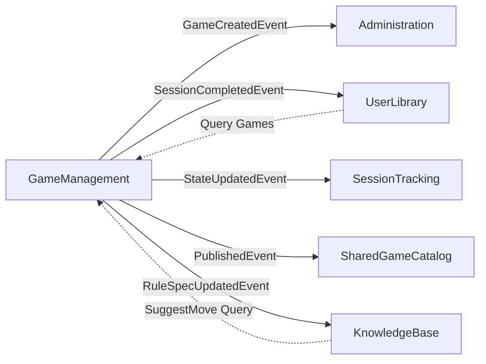

# GameManagement Bounded Context - Complete API Reference

**Catalogo giochi, sessioni di gioco, regole, FAQ, e stato partite**

> 📖 **Complete Documentation**: Part of Issue #3794 - Complete API reference for all commands/queries

---

## 📋 Responsabilità

- Gestione catalogo giochi (CRUD operations)
- Sessioni di gioco (tracking partite con lifecycle completo)
- Stato partite (game state management con snapshots)
- Regole e specifiche (RuleSpec versioning + collaborative editing)
- Commenti su regole (threaded discussions con resolution tracking)
- FAQ per giochi (domande frequenti community-driven)
- Integrazione BoardGameGeek API (import metadata)
- Similar games discovery (RAG-based recommendations)
- AI move suggestions (Player Mode integration)
- Publication workflow (SharedGameCatalog integration)

---

## 🏗️ Domain Model

### Aggregates

**Game** (Aggregate Root):
```csharp
public class Game
{
    public Guid Id { get; private set; }
    public GameTitle Title { get; private set; }        // Value Object
    public Publisher? Publisher { get; private set; }   // Value Object
    public YearPublished? YearPublished { get; private set; }
    public PlayerCount? PlayerCount { get; private set; }
    public PlayTime? PlayTime { get; private set; }
    public string? IconUrl { get; private set; }
    public string? ImageUrl { get; private set; }
    public DateTime CreatedAt { get; private set; }

    // BGG Integration
    public int? BggId { get; private set; }
    public string? BggMetadata { get; private set; }    // JSON

    // SharedGameCatalog Integration (Issue #2373)
    public Guid? SharedGameId { get; private set; }

    // Publication Workflow (Issue #3481)
    public bool IsPublished { get; private set; }
    public ApprovalStatus ApprovalStatus { get; private set; }
    public DateTime? PublishedAt { get; private set; }

    // Domain methods
    public void UpdateDetails(GameTitle?, Publisher?, YearPublished?, PlayerCount?, PlayTime?) { }
    public void LinkToBggGame(int bggId, string metadata) { }
    public void LinkToSharedGame(Guid sharedGameId) { }
    public void Publish() { }
    public void SetApprovalStatus(ApprovalStatus status) { }
}
```

**GameSession** (Aggregate Root):
```csharp
public class GameSession
{
    public Guid Id { get; private set; }
    public Guid GameId { get; private set; }
    public Guid? CreatedByUserId { get; private set; }  // Issue #3070: quota enforcement
    public SessionStatus Status { get; private set; }   // Setup | Active | Paused | Completed | Abandoned
    public DateTime StartedAt { get; private set; }
    public DateTime? CompletedAt { get; private set; }
    public string? WinnerName { get; private set; }
    public string? Notes { get; private set; }

    // Players
    public IReadOnlyList<SessionPlayer> Players { get; }

    // Domain methods
    public void Start() { }
    public void Pause() { }
    public void Resume() { }
    public void Complete(string? winnerName) { }
    public void Abandon() { }
    public void AddPlayer(SessionPlayer player) { }
}
```

**SessionPlayer** (Entity):
```csharp
public class SessionPlayer
{
    public Guid Id { get; private set; }
    public string PlayerName { get; private set; }
    public int PlayerOrder { get; private set; }
    public string? Color { get; private set; }
}
```

**GameSessionState** (Entity - Issue #2403):
```csharp
public class GameSessionState
{
    public Guid Id { get; private set; }
    public Guid GameSessionId { get; private set; }
    public int CurrentTurn { get; private set; }
    public string CurrentPhase { get; private set; }
    public string StateData { get; private set; }       // JSON game state
    public DateTime LastUpdatedAt { get; private set; }

    // Snapshots
    public IReadOnlyList<GameStateSnapshot> Snapshots { get; }

    public void UpdateState(string newStateData) { }
    public GameStateSnapshot CreateSnapshot(int turnNumber, string? description) { }
    public void RestoreFromSnapshot(Guid snapshotId) { }
}
```

**RuleSpec** (Aggregate Root):
```csharp
public class RuleSpec
{
    public Guid Id { get; private set; }
    public Guid GameId { get; private set; }
    public int Version { get; private set; }
    public string Content { get; private set; }         // Markdown rule content
    public Guid CreatedBy { get; private set; }
    public DateTime CreatedAt { get; private set; }
    public bool IsCurrent { get; private set; }

    // Comments
    public IReadOnlyList<RuleComment> Comments { get; }

    public void UpdateContent(string newContent, Guid userId) { }
    public RuleComment AddComment(int? lineNumber, string text, Guid userId) { }
}
```

**RuleComment** (Entity):
```csharp
public class RuleComment
{
    public Guid Id { get; private set; }
    public Guid RuleSpecId { get; private set; }
    public int? LineNumber { get; private set; }        // null = general comment
    public string CommentText { get; private set; }
    public Guid CreatedBy { get; private set; }
    public DateTime CreatedAt { get; private set; }
    public bool IsResolved { get; private set; }
    public DateTime? ResolvedAt { get; private set; }
    public Guid? ResolvedBy { get; private set; }
    public Guid? ParentCommentId { get; private set; }  // Threading support

    public void Resolve(Guid userId) { }
    public void Unresolve() { }
    public void Update(string newText) { }
}
```

### Value Objects

**GameTitle**:
```csharp
public record GameTitle
{
    public string Value { get; init; }

    public static GameTitle Create(string value)
    {
        // Validation: 1-200 chars, not empty, trimmed
    }
}
```

**PlayerCount**:
```csharp
public record PlayerCount
{
    public int MinPlayers { get; init; }
    public int MaxPlayers { get; init; }

    public static PlayerCount Create(int min, int max)
    {
        // Validation: 1 ≤ min ≤ max ≤ 100
    }
}
```

**PlayTime**:
```csharp
public record PlayTime
{
    public int MinMinutes { get; init; }
    public int MaxMinutes { get; init; }

    public static PlayTime Create(int min, int max)
    {
        // Validation: 1 ≤ min ≤ max ≤ 10000
    }
}
```

---

## 📡 Application Layer (CQRS)

> **Total Operations**: 47 (26 commands + 21 queries)
> **Categories**: Game CRUD, Sessions, State, RuleSpecs, Comments, Locks

---

### A. GAME RETRIEVAL (Public Access)

| Query | HTTP Method | Endpoint | Auth | Query Params | Response |
|-------|-------------|----------|------|--------------|----------|
| `GetAllGamesQuery` | GET | `/api/v1/games` | 🟢 Public | `search`, `page`, `pageSize` | `PaginatedGamesResponse` |
| `GetGameByIdQuery` | GET | `/api/v1/games/{id}` | 🟢 Public | - | `GameDto` |
| `GetGameDetailsQuery` | GET | `/api/v1/games/{id}/details` | 🟡 Auth | - | `GameDetailsDto` |
| `GetSimilarGamesQuery` | GET | `/api/v1/games/{id}/similar` | 🟢 Public | `limit?`, `minSimilarity?` | `GetSimilarGamesResult` |

**GetAllGamesQuery**:
- **Purpose**: List all games with pagination and search
- **Query Parameters**:
  - `search` (optional): Full-text search on title/publisher
  - `page` (default: 1): Page number
  - `pageSize` (default: 20, max: 100): Items per page
- **Response Schema**:
  ```json
  {
    "games": [
      {
        "id": "guid",
        "title": "Azul",
        "publisher": "Plan B Games",
        "yearPublished": 2017,
        "minPlayers": 2,
        "maxPlayers": 4,
        "playTimeMinutes": 45,
        "imageUrl": "https://..."
      }
    ],
    "pagination": {
      "page": 1,
      "pageSize": 20,
      "totalCount": 150,
      "totalPages": 8
    }
  }
  ```

**GetSimilarGamesQuery** (Issue #3353):
- **Purpose**: RAG-based game recommendations
- **Algorithm**: Vector similarity search on game metadata embeddings
- **Response Schema**:
  ```json
  {
    "sourceGame": { "id": "guid", "title": "Azul" },
    "similarGames": [
      {
        "game": { "id": "guid", "title": "Sagrada" },
        "similarityScore": 0.87,
        "matchReasons": ["Abstract strategy", "Tile placement", "2-4 players"]
      }
    ]
  }
  ```

---

### B. GAME MANAGEMENT (Admin/Editor Only)

| Command | HTTP Method | Endpoint | Auth | Request | Response |
|---------|-------------|----------|------|---------|----------|
| `CreateGameCommand` | POST | `/api/v1/games` | 🔴 Admin/Editor | `CreateGameRequest` | `GameDto` (201) |
| `UpdateGameCommand` | PUT | `/api/v1/games/{id}` | 🔴 Admin/Editor | `UpdateGameRequest` | `GameDto` |
| `PublishGameCommand` | PUT | `/api/v1/games/{id}/publish` | 🔴 Admin | `PublishGameRequest` | `GameDto` |
| `UploadGameImageCommand` | POST | `/api/v1/games/upload-image` | 🔴 Admin/Editor | Multipart form | `{ fileId, fileUrl, fileSizeBytes }` |

**CreateGameCommand**:
- **Purpose**: Create new game in catalog
- **Request Schema**:
  ```json
  {
    "title": "Azul",
    "publisher": "Plan B Games",
    "yearPublished": 2017,
    "minPlayers": 2,
    "maxPlayers": 4,
    "minPlayTimeMinutes": 30,
    "maxPlayTimeMinutes": 45,
    "iconUrl": "https://...",
    "imageUrl": "https://...",
    "bggId": 178900,
    "sharedGameId": "guid"
  }
  ```
- **Validation Rules**:
  - Title: 1-200 chars, required
  - Publisher: Optional, 1-200 chars
  - YearPublished: 1900-current year
  - MinPlayers: 1-100, required if MaxPlayers specified
  - MaxPlayers: Must be ≥ MinPlayers
  - PlayTime: 1-10000 minutes
- **Side Effects**:
  - Creates Game entity
  - If SharedGameId provided: links to community catalog
  - If BggId provided: stores BGG metadata
- **Domain Events**: `GameCreatedEvent`

**PublishGameCommand** (Issue #3481):
- **Purpose**: Publish user game to SharedGameCatalog
- **Request Schema**:
  ```json
  {
    "status": "Published"
  }
  ```
- **Flow**:
  1. Sets `IsPublished = true`, `ApprovalStatus = PendingApproval`
  2. Creates PublicationRequest in SharedGameCatalog
  3. Admin reviews via Issue #3488 approval UI
  4. On approval: game visible in community catalog
- **Authorization**: Admin only (editors cannot publish)

---

### C. GAME SESSION LIFECYCLE (Session-Required)

| Command | HTTP Method | Endpoint | Auth | Request | Response |
|---------|-------------|----------|------|---------|----------|
| `StartGameSessionCommand` | POST | `/api/v1/sessions` | 🔵 Session | `StartGameSessionRequest` | `GameSessionDto` (201) |
| `AddPlayerToSessionCommand` | POST | `/api/v1/sessions/{id}/players` | 🔵 Session | `SessionPlayerRequest` | `GameSessionDto` |
| `PauseGameSessionCommand` | POST | `/api/v1/sessions/{id}/pause` | 🔵 Session | None | `GameSessionDto` |
| `ResumeGameSessionCommand` | POST | `/api/v1/sessions/{id}/resume` | 🔵 Session | None | `GameSessionDto` |
| `CompleteGameSessionCommand` | POST | `/api/v1/sessions/{id}/complete` | 🔵 Session | `CompleteSessionRequest?` | `GameSessionDto` |
| `AbandonGameSessionCommand` | POST | `/api/v1/sessions/{id}/abandon` | 🔵 Session | None | `GameSessionDto` |
| `EndGameSessionCommand` | POST | `/api/v1/sessions/{id}/end` | 🔵 Session | `CompleteSessionRequest?` | `GameSessionDto` |

**StartGameSessionCommand**:
- **Purpose**: Create and start new game session
- **Request Schema**:
  ```json
  {
    "gameId": "guid",
    "players": [
      {
        "playerName": "Alice",
        "playerOrder": 1,
        "color": "red"
      },
      {
        "playerName": "Bob",
        "playerOrder": 2,
        "color": "blue"
      }
    ]
  }
  ```
- **Validation Rules**:
  - GameId: Must exist in catalog
  - Players: Min 1, max defined by game's PlayerCount
  - PlayerOrder: Must be unique sequential (1, 2, 3...)
  - PlayerName: 1-50 chars each
- **Side Effects**:
  - Creates GameSession with Status = Setup
  - Creates CreatedByUserId for quota tracking (Issue #3070)
  - Can trigger State initialization if game supports it
- **Domain Events**: `GameSessionStartedEvent`

**CompleteGameSessionCommand**:
- **Purpose**: Mark session as completed with optional winner
- **Request Schema**:
  ```json
  {
    "winnerName": "Alice"
  }
  ```
- **Validation**: WinnerName must match one of the session players
- **Side Effects**:
  - Sets Status = Completed, CompletedAt = UtcNow
  - Records winner
  - Finalizes state snapshots (no more updates allowed)
- **Domain Events**: `GameSessionCompletedEvent`

**Session Status Transitions**:
```
Setup → Active (Start)
Active ⇄ Paused (Pause/Resume)
Active → Completed (Complete)
Active → Abandoned (Abandon)
Any → Abandoned (except Completed)
```

---

### D. GAME SESSION QUERIES (Authenticated)

| Query | HTTP Method | Endpoint | Auth | Query Params | Response |
|-------|-------------|----------|------|--------------|----------|
| `GetGameSessionByIdQuery` | GET | `/api/v1/sessions/{id}` | 🟡 Auth | - | `GameSessionDto` |
| `GetGameSessionsQuery` | GET | `/api/v1/games/{gameId}/sessions` | 🟡 Auth | `page?`, `pageSize?` | `List<GameSessionDto>` |
| `GetActiveSessionsByGameQuery` | GET | `/api/v1/games/{gameId}/sessions/active` | 🟡 Auth | - | `IReadOnlyList<GameSessionDto>` |
| `GetActiveSessionsQuery` | GET | `/api/v1/sessions/active` | 🟡 Auth | `limit?`, `offset?` | `PaginatedSessionsResponseDto` |
| `GetSessionHistoryQuery` | GET | `/api/v1/sessions/history` | 🟡 Auth | `gameId?`, `startDate?`, `endDate?`, `limit?`, `offset?` | `List<GameSessionDto>` |
| `GetSessionStatsQuery` | GET | `/api/v1/sessions/statistics` | 🟡 Auth | `gameId?`, `startDate?`, `endDate?`, `topPlayersLimit?` | `SessionStatsDto` |

**GetSessionStatsQuery**:
- **Purpose**: Analytics for game sessions (play frequency, popular games, top players)
- **Response Schema**:
  ```json
  {
    "totalSessions": 156,
    "totalPlayTime": 12450,
    "avgSessionDuration": 80,
    "mostPlayedGames": [
      {
        "gameId": "guid",
        "gameTitle": "Azul",
        "sessionCount": 42,
        "totalPlayTime": 1890
      }
    ],
    "topPlayers": [
      {
        "playerName": "Alice",
        "sessionCount": 28,
        "winCount": 15,
        "winRate": 0.54
      }
    ],
    "sessionsByStatus": {
      "Completed": 120,
      "Active": 3,
      "Abandoned": 33
    }
  }
  ```

---

### E. GAME STATE MANAGEMENT (Session-Required)

| Command/Query | HTTP Method | Endpoint | Auth | Request | Response |
|---------------|-------------|----------|------|---------|----------|
| `InitializeGameStateCommand` | POST | `/api/v1/sessions/{sessionId}/state/initialize` | 🔵 Session | `InitializeGameStateRequest` | `GameSessionStateDto` (201) |
| `GetGameStateQuery` | GET | `/api/v1/sessions/{sessionId}/state` | 🟡 Auth | - | `GameSessionStateDto` |
| `UpdateGameStateCommand` | PATCH | `/api/v1/sessions/{sessionId}/state` | 🔵 Session | `UpdateGameStateRequest` | `GameSessionStateDto` |
| `CreateStateSnapshotCommand` | POST | `/api/v1/sessions/{sessionId}/state/snapshots` | 🔵 Session | `CreateStateSnapshotRequest` | `GameStateSnapshotDto` (201) |
| `GetStateSnapshotsQuery` | GET | `/api/v1/sessions/{sessionId}/state/snapshots` | 🟡 Auth | - | `List<GameStateSnapshotDto>` |
| `RestoreStateSnapshotCommand` | POST | `/api/v1/sessions/{sessionId}/state/restore/{snapshotId}` | 🔵 Session | None | `GameSessionStateDto` |

**InitializeGameStateCommand** (Issue #2403):
- **Purpose**: Initialize game state tracking for session
- **Request Schema**:
  ```json
  {
    "templateId": "guid",
    "initialState": {
      "board": {"tiles": []},
      "currentPlayer": 0,
      "turnNumber": 1,
      "phase": "setup"
    }
  }
  ```
- **State Storage**: JSON format, flexible schema per game
- **Use Case**: Games with complex state tracking (chess, Azul, etc.)

**UpdateGameStateCommand**:
- **Purpose**: Update current game state (e.g., after player move)
- **Request Schema**:
  ```json
  {
    "newState": {
      "board": {"tiles": [...]},
      "currentPlayer": 1,
      "turnNumber": 2,
      "phase": "player_turn"
    }
  }
  ```
- **Validation**: State must be valid JSON
- **Side Effects**: Updates LastUpdatedAt, increments version

**CreateStateSnapshotCommand**:
- **Purpose**: Save game state checkpoint (undo/redo support)
- **Request Schema**:
  ```json
  {
    "turnNumber": 5,
    "description": "Before critical move"
  }
  ```
- **Use Cases**: Undo moves, analyze game progression, dispute resolution

---

### F. AI MOVE SUGGESTIONS (Player Mode - Issue #2404)

| Command | HTTP Method | Endpoint | Auth | Request | Response |
|---------|-------------|----------|------|---------|----------|
| `SuggestMoveCommand` | POST | `/api/v1/sessions/{sessionId}/suggest-move` | 🔵 Session | `SuggestMoveRequest` | `MoveSuggestionsDto` |
| `ApplySuggestionCommand` | POST | `/api/v1/sessions/{sessionId}/apply-suggestion` | 🔵 Session | `ApplySuggestionRequest` | `GameSessionStateDto` |

**SuggestMoveCommand**:
- **Purpose**: AI-powered move suggestions for current player
- **Request Schema**:
  ```json
  {
    "agentId": "guid",
    "query": "What's the best move to maximize points?"
  }
  ```
- **Response Schema**:
  ```json
  {
    "suggestions": [
      {
        "id": "guid",
        "moveDescription": "Place blue tile at position (2,3)",
        "reasoning": "Creates a 5-tile row for maximum points",
        "confidence": 0.85,
        "expectedPoints": 15
      }
    ],
    "gameState": {...},
    "agentUsed": "Decisore Agent"
  }
  ```
- **Integration**: Calls KnowledgeBase AgentTypology system

**ApplySuggestionCommand**:
- **Purpose**: Apply AI suggestion to game state
- **Request Schema**:
  ```json
  {
    "suggestionId": "guid",
    "stateChanges": {
      "board": {...},
      "currentPlayer": 1,
      "turnNumber": 6
    }
  }
  ```
- **Validation**: SuggestionId must be from recent SuggestMoveCommand response

---

### G. RULE SPECIFICATIONS - Core Operations

| Command/Query | HTTP Method | Endpoint | Auth | Request | Response |
|---------------|-------------|----------|------|---------|----------|
| `GetRuleSpecsQuery` | GET | `/api/v1/games/{gameId}/rules` | 🟡 Auth | - | `IReadOnlyList<RuleSpecDto>` |
| `GetRuleSpecQuery` | GET | `/api/v1/games/{gameId}/rulespec` | 🔵 Session | - | `RuleSpecDto` |
| `UpdateRuleSpecCommand` | PUT | `/api/v1/games/{gameId}/rulespec` | 🔴 Admin/Editor | `RuleSpec` model | `RuleSpecDto` |

**UpdateRuleSpecCommand** (Issue #1676):
- **Purpose**: Update game rules content (markdown format)
- **Request**: Full RuleSpec model (direct DTO binding)
- **Versioning**: Each update creates new version, previous becomes historical
- **Side Effects**:
  - Increments version number
  - Sets IsCurrent = true on new version
  - Sets IsCurrent = false on previous version
  - Records CreatedBy and CreatedAt
- **Domain Events**: `RuleSpecUpdatedEvent`

---

### H. RULE SPECIFICATION - Versioning & History

| Query | HTTP Method | Endpoint | Auth | Query Params | Response |
|-------|-------------|----------|------|--------------|----------|
| `GetVersionHistoryQuery` | GET | `/api/v1/games/{gameId}/rulespec/history` | 🔴 Admin/Editor | - | Version list |
| `GetVersionTimelineQuery` | GET | `/api/v1/games/{gameId}/rulespec/versions/timeline` | 🟡 Auth | `startDate?`, `endDate?`, `author?`, `searchQuery?` | Timeline list |
| `GetRuleSpecVersionQuery` | GET | `/api/v1/games/{gameId}/rulespec/versions/{version}` | 🔴 Admin/Editor | - | `RuleSpecDto` |
| `ComputeRuleSpecDiffQuery` | GET | `/api/v1/games/{gameId}/rulespec/diff` | 🔴 Admin/Editor | `from`, `to` (versions) | Diff object |

**ComputeRuleSpecDiffQuery**:
- **Purpose**: Compare two RuleSpec versions (GitHub-style diff)
- **Response Schema**:
  ```json
  {
    "fromVersion": 3,
    "toVersion": 5,
    "changes": [
      {
        "lineNumber": 45,
        "changeType": "modified",
        "oldText": "Players draw 5 tiles",
        "newText": "Players draw 7 tiles"
      }
    ],
    "addedLines": 3,
    "deletedLines": 1,
    "modifiedLines": 8
  }
  ```

---

### I. RULE COMMENTS - Threaded Discussions

#### Comment Creation

| Command | HTTP Method | Endpoint | Auth | Request | Response |
|---------|-------------|----------|------|---------|----------|
| `CreateRuleCommentCommand` | POST | `/api/v1/rulespecs/{gameId}/{version}/comments` | 🔴 Admin/Editor | `CreateCommentRequest` | `RuleCommentDto` (201) |
| `ReplyToRuleCommentCommand` | POST | `/api/v1/comments/{commentId}/replies` | 🔴 Admin/Editor | `CreateReplyRequest` | `RuleCommentDto` (201) |

**CreateRuleCommentCommand** (Issue #2055):
- **Purpose**: Add comment to specific line or general discussion
- **Request Schema**:
  ```json
  {
    "lineNumber": 45,
    "commentText": "Clarification needed: does this apply in 2-player games?"
  }
  ```
- **Line Number**: Optional - null for general comments
- **Threading**: Creates root comment, replies use ReplyToRuleCommentCommand

**ReplyToRuleCommentCommand**:
- **Purpose**: Reply to existing comment (threading support)
- **Request Schema**:
  ```json
  {
    "commentText": "Yes, this rule applies to all player counts"
  }
  ```
- **Threading**: Sets ParentCommentId to link reply to parent

---

#### Comment Retrieval

| Query | HTTP Method | Endpoint | Auth | Response |
|-------|-------------|----------|------|----------|
| `GetRuleCommentsQuery` | GET | `/api/v1/rulespecs/{gameId}/{version}/comments` | 🔴 Admin/Editor | `IReadOnlyList<RuleCommentDto>` |
| `GetCommentsForLineQuery` | GET | `/api/v1/rulespecs/{gameId}/{version}/lines/{lineNumber}/comments` | 🔴 Admin/Editor | `IReadOnlyList<RuleCommentDto>` |

**GetRuleCommentsQuery**:
- **Purpose**: Retrieve all comments for RuleSpec version
- **Response Schema**:
  ```json
  {
    "comments": [
      {
        "id": "guid",
        "lineNumber": 45,
        "commentText": "Clarification needed...",
        "createdBy": "guid",
        "createdByName": "Alice",
        "createdAt": "2026-02-07T10:00:00Z",
        "isResolved": false,
        "replies": [
          {
            "id": "guid",
            "commentText": "Yes, this rule applies...",
            "createdBy": "guid",
            "createdByName": "Bob",
            "createdAt": "2026-02-07T11:00:00Z"
          }
        ]
      }
    ]
  }
  ```
- **Threading**: Nested replies structure

---

#### Comment Resolution

| Command | HTTP Method | Endpoint | Auth | Query Params | Response |
|---------|-------------|----------|------|--------------|----------|
| `ResolveRuleCommentCommand` | POST | `/api/v1/comments/{commentId}/resolve` | 🔴 Admin/Editor | `resolveReplies?` (bool) | `RuleCommentDto` |
| `UnresolveRuleCommentCommand` | POST | `/api/v1/comments/{commentId}/unresolve` | 🔴 Admin/Editor | `unresolveParent?` (bool) | `RuleCommentDto` |

**ResolveRuleCommentCommand**:
- **Purpose**: Mark comment thread as resolved
- **Side Effects**:
  - Sets IsResolved = true, ResolvedAt = UtcNow, ResolvedBy = CurrentUser
  - If `resolveReplies=true`: resolves all child replies
- **Use Case**: Question answered, clarification provided

---

#### Comment Modification

| Command | HTTP Method | Endpoint | Auth | Request | Response |
|---------|-------------|----------|------|---------|----------|
| `UpdateRuleCommentCommand` | PUT | `/api/v1/comments/{commentId}` | 🔴 Admin/Editor | `UpdateCommentRequest` | `RuleCommentDto` |
| `DeleteRuleCommentCommand` | DELETE | `/api/v1/comments/{commentId}` | 🔴 Admin/Editor | None | 204 No Content |

**Update/Delete**: Only comment creator or Admin can modify/delete

---

### J. COLLABORATIVE EDITING - Editor Locks

| Command/Query | HTTP Method | Endpoint | Auth | Response |
|---------------|-------------|----------|------|----------|
| `AcquireEditorLockCommand` | POST | `/api/v1/games/{gameId}/rulespec/lock` | 🔴 Admin/Editor | Lock status |
| `ReleaseEditorLockCommand` | DELETE | `/api/v1/games/{gameId}/rulespec/lock` | 🔴 Admin/Editor | 204 No Content |
| `RefreshEditorLockCommand` | POST | `/api/v1/games/{gameId}/rulespec/lock/refresh` | 🔴 Admin/Editor | `{ message: "Lock refreshed" }` |
| `GetEditorLockStatusQuery` | GET | `/api/v1/games/{gameId}/rulespec/lock` | 🔴 Admin/Editor | Lock status object |

**Editor Lock Pattern** (Issue #2055):
- **Purpose**: Prevent concurrent RuleSpec edits (optimistic locking alternative)
- **Flow**:
  1. Editor acquires lock before editing
  2. Refreshes lock every 30 seconds while editing
  3. Releases lock on save or cancel
  4. Lock auto-expires after 5 minutes of inactivity
- **Response Schema**:
  ```json
  {
    "isLocked": true,
    "lockedBy": "guid",
    "lockedByName": "Alice",
    "lockedAt": "2026-02-07T10:00:00Z",
    "expiresAt": "2026-02-07T10:05:00Z"
  }
  ```
- **Conflict Handling**: Returns 409 Conflict if another editor holds lock

---

### K. BULK OPERATIONS (Admin/Editor)

| Command | HTTP Method | Endpoint | Auth | Request | Response |
|---------|-------------|----------|------|---------|----------|
| `ExportRuleSpecsCommand` | POST | `/api/v1/rulespecs/bulk/export` | 🔴 Admin/Editor | `BulkExportRequest` | ZIP file download |
| `GenerateRuleSpecFromPdfCommand` | *(Internal)* | - | - | - | - |

**ExportRuleSpecsCommand**:
- **Purpose**: Export multiple RuleSpecs as ZIP archive
- **Request Schema**:
  ```json
  {
    "gameIds": ["guid1", "guid2", "guid3"],
    "includeComments": true,
    "includeHistory": false
  }
  ```
- **Response**: ZIP file with markdown files per game
- **Use Cases**: Backup, documentation generation, offline access

**GenerateRuleSpecFromPdfCommand**:
- **Purpose**: AI-powered RuleSpec generation from PDF rulebook
- **Status**: Internal command (not exposed via REST API yet)
- **Integration**: Uses DocumentProcessing extraction + KnowledgeBase RAG

---

## 🔄 Domain Events

| Event | When Raised | Payload | Subscribers |
|-------|-------------|---------|-------------|
| `GameCreatedEvent` | After game creation | `{ GameId, Title, CreatedBy }` | Administration (audit), SharedGameCatalog (if linked) |
| `GameUpdatedEvent` | After game update | `{ GameId, UpdatedFields }` | Administration (audit) |
| `GamePublishedEvent` | After publish command | `{ GameId, SharedGameId }` | SharedGameCatalog (publication request) |
| `GameSessionStartedEvent` | Session start | `{ SessionId, GameId, PlayerCount }` | SessionTracking, UserLibrary |
| `GameSessionCompletedEvent` | Session complete | `{ SessionId, WinnerName, Duration }` | SessionTracking, UserLibrary (play history) |
| `GameSessionAbandonedEvent` | Session abandoned | `{ SessionId, Reason }` | SessionTracking |
| `GameStateUpdatedEvent` | State update | `{ SessionId, TurnNumber }` | SessionTracking (real-time updates) |
| `StateSnapshotCreatedEvent` | Snapshot created | `{ SessionId, SnapshotId }` | Administration (audit) |
| `RuleSpecUpdatedEvent` | RuleSpec update | `{ GameId, Version, UpdatedBy }` | Administration (audit), KnowledgeBase (re-index) |
| `RuleCommentCreatedEvent` | Comment created | `{ CommentId, GameId, CreatedBy }` | UserNotifications (notify mentioned users) |
| `RuleCommentResolvedEvent` | Comment resolved | `{ CommentId, ResolvedBy }` | UserNotifications (notify comment author) |
| `EditorLockAcquiredEvent` | Lock acquired | `{ GameId, LockedBy }` | Administration (collaborative editing tracking) |

---

## 🔗 Integration Points

### Inbound Dependencies

**KnowledgeBase Context**:
- Fetches game metadata for RAG context assembly
- Example: Chat question about "Azul" → Query GameManagement for game details
- Uses: `GetGameByIdQuery`, `GetRuleSpecsQuery`

**UserLibrary Context**:
- References games for user collections
- Tracks play sessions for user statistics
- Uses: `GetGameByIdQuery`, `GetGameSessionsQuery`

**SharedGameCatalog Context**:
- Links private games to community catalog
- Receives publication requests
- Uses: `PublishGameCommand` → Creates PublicationRequest

**Administration Context**:
- Subscribes to all game management events for audit logging
- Monitors session activity for analytics

### Outbound Dependencies

**DocumentProcessing Context**:
- Queries PDF documents associated with games
- Integration: Game → PDF rulebook linkage

**KnowledgeBase Context (AgentTypology)**:
- Invokes AI agents for move suggestions (SuggestMoveCommand)
- Queries game-specific RAG context

**SharedGameCatalog Context**:
- Links games via SharedGameId foreign key
- Queries community game metadata

### Event-Driven Communication



---

## 🔐 Security & Authorization

### Authentication Levels

| Level | Cookie/Header | Endpoints | Description |
|-------|---------------|-----------|-------------|
| **🟢 Public** | None | Game retrieval, similar games | Anonymous access for game discovery |
| **🟡 Authenticated** | Session OR API Key | Game details, session queries | Dual auth (Issue #1446) |
| **🔵 Session-Required** | Session Cookie | Session CRUD, state management | Active user session mandatory |
| **🔴 Admin/Editor** | Session + Role | Game CRUD, RuleSpec edit, comments | Role-based access control |
| **🔴⭐ Admin Only** | Session + Admin | Publish, bulk export | Admin-exclusive operations |

### Authorization Matrix

| Endpoint Pattern | Anonymous | User | Editor | Admin |
|------------------|-----------|------|--------|-------|
| `GET /games` | ✅ | ✅ | ✅ | ✅ |
| `GET /games/{id}` | ✅ | ✅ | ✅ | ✅ |
| `POST /games` | ❌ | ❌ | ✅ | ✅ |
| `PUT /games/{id}` | ❌ | ❌ | ✅ | ✅ |
| `PUT /games/{id}/publish` | ❌ | ❌ | ❌ | ✅ |
| `POST /sessions` | ❌ | ✅ | ✅ | ✅ |
| `PATCH /sessions/{id}/state` | ❌ | ✅ (owner) | ✅ | ✅ |
| `PUT /rulespec` | ❌ | ❌ | ✅ | ✅ |
| `POST /comments` | ❌ | ❌ | ✅ | ✅ |

### Data Access Policies

- **Game Isolation**: Public games visible to all, private games only to owner
- **Session Isolation**: Users can only modify their own sessions (unless Admin)
- **RuleSpec Editing**: Editor lock prevents concurrent modifications
- **Comment Ownership**: Only creator or Admin can update/delete comments

---

## 🎯 Common Usage Examples

### Example 1: Create Game and Start Session

**Step 1: Create Game** (Admin/Editor):
```bash
curl -X POST http://localhost:8080/api/v1/games \
  -H "Content-Type: application/json" \
  -H "Cookie: meepleai_session_dev={token}" \
  -d '{
    "title": "Azul",
    "publisher": "Plan B Games",
    "yearPublished": 2017,
    "minPlayers": 2,
    "maxPlayers": 4,
    "minPlayTimeMinutes": 30,
    "maxPlayTimeMinutes": 45,
    "bggId": 178900
  }'
```

**Response**:
```json
{
  "id": "123e4567-e89b-12d3-a456-426614174000",
  "title": "Azul",
  "publisher": "Plan B Games",
  "yearPublished": 2017,
  "minPlayers": 2,
  "maxPlayers": 4,
  "playTimeMinutes": 45,
  "bggId": 178900,
  "imageUrl": null,
  "isPublished": false
}
```

**Step 2: Start Session** (Any authenticated user):
```bash
curl -X POST http://localhost:8080/api/v1/sessions \
  -H "Content-Type: application/json" \
  -H "Cookie: meepleai_session_dev={token}" \
  -d '{
    "gameId": "123e4567-e89b-12d3-a456-426614174000",
    "players": [
      {"playerName": "Alice", "playerOrder": 1, "color": "red"},
      {"playerName": "Bob", "playerOrder": 2, "color": "blue"}
    ]
  }'
```

**Response**:
```json
{
  "id": "session-guid",
  "gameId": "123e4567-e89b-12d3-a456-426614174000",
  "status": "Setup",
  "startedAt": "2026-02-07T14:00:00Z",
  "players": [
    {"playerName": "Alice", "playerOrder": 1, "color": "red"},
    {"playerName": "Bob", "playerOrder": 2, "color": "blue"}
  ]
}
```

---

### Example 2: Game State Management with Snapshots

**Step 1: Initialize State**:
```bash
curl -X POST http://localhost:8080/api/v1/sessions/{sessionId}/state/initialize \
  -H "Content-Type: application/json" \
  -H "Cookie: meepleai_session_dev={token}" \
  -d '{
    "initialState": {
      "board": {"tiles": []},
      "currentPlayer": 0,
      "turnNumber": 1,
      "phase": "setup"
    }
  }'
```

**Step 2: Update State After Move**:
```bash
curl -X PATCH http://localhost:8080/api/v1/sessions/{sessionId}/state \
  -H "Content-Type: application/json" \
  -H "Cookie: meepleai_session_dev={token}" \
  -d '{
    "newState": {
      "board": {"tiles": [{"color": "blue", "position": [2,3]}]},
      "currentPlayer": 1,
      "turnNumber": 2,
      "phase": "player_turn"
    }
  }'
```

**Step 3: Create Snapshot** (Before risky move):
```bash
curl -X POST http://localhost:8080/api/v1/sessions/{sessionId}/state/snapshots \
  -H "Content-Type: application/json" \
  -H "Cookie: meepleai_session_dev={token}" \
  -d '{
    "turnNumber": 5,
    "description": "Before attempting complex combo"
  }'
```

**Step 4: Restore Snapshot** (If move was mistake):
```bash
curl -X POST http://localhost:8080/api/v1/sessions/{sessionId}/state/restore/{snapshotId} \
  -H "Cookie: meepleai_session_dev={token}"
```

---

### Example 3: AI Move Suggestions

**Request Suggestion**:
```bash
curl -X POST http://localhost:8080/api/v1/sessions/{sessionId}/suggest-move \
  -H "Content-Type: application/json" \
  -H "Cookie: meepleai_session_dev={token}" \
  -d '{
    "agentId": "decisore-agent-guid",
    "query": "What move maximizes my score this turn?"
  }'
```

**Response**:
```json
{
  "suggestions": [
    {
      "id": "suggestion-guid",
      "moveDescription": "Place blue tile at row 3, creating 5-tile line",
      "reasoning": "Completes horizontal line for 15 points, sets up vertical bonus next turn",
      "confidence": 0.87,
      "expectedPoints": 15,
      "alternativePoints": 8
    },
    {
      "id": "suggestion-guid-2",
      "moveDescription": "Place red tile at row 1",
      "reasoning": "Safer move, guarantees 8 points",
      "confidence": 0.65,
      "expectedPoints": 8
    }
  ],
  "gameState": {...},
  "agentUsed": "Decisore Agent (Expert Level)"
}
```

**Apply Suggestion**:
```bash
curl -X POST http://localhost:8080/api/v1/sessions/{sessionId}/apply-suggestion \
  -H "Content-Type: application/json" \
  -H "Cookie: meepleai_session_dev={token}" \
  -d '{
    "suggestionId": "suggestion-guid",
    "stateChanges": {
      "board": {...},
      "currentPlayer": 1,
      "turnNumber": 6
    }
  }'
```

---

### Example 4: Collaborative RuleSpec Editing

**Step 1: Acquire Lock**:
```bash
curl -X POST http://localhost:8080/api/v1/games/{gameId}/rulespec/lock \
  -H "Cookie: meepleai_session_dev={token}"
```

**Response**:
```json
{
  "isLocked": true,
  "lockedBy": "current-user-guid",
  "expiresAt": "2026-02-07T14:05:00Z"
}
```

**Step 2: Edit RuleSpec**:
```bash
curl -X PUT http://localhost:8080/api/v1/games/{gameId}/rulespec \
  -H "Content-Type: application/json" \
  -H "Cookie: meepleai_session_dev={token}" \
  -d '{
    "content": "# Azul Rules\n\n## Setup\nPlayers draw 7 tiles (updated rule)...",
    "version": 4
  }'
```

**Step 3: Add Comment to Line**:
```bash
curl -X POST http://localhost:8080/api/v1/rulespecs/{gameId}/4/comments \
  -H "Content-Type: application/json" \
  -H "Cookie: meepleai_session_dev={token}" \
  -d '{
    "lineNumber": 15,
    "commentText": "Verify: Is this 7 tiles in all player counts?"
  }'
```

**Step 4: Release Lock**:
```bash
curl -X DELETE http://localhost:8080/api/v1/games/{gameId}/rulespec/lock \
  -H "Cookie: meepleai_session_dev={token}"
```

---

### Example 5: BGG Import Integration

**Search BGG**:
```bash
curl -X GET "http://localhost:8080/api/v1/games/bgg/search?query=azul" \
  -H "Cookie: meepleai_session_dev={token}"
```

**Response**:
```json
{
  "results": [
    {
      "bggId": 178900,
      "title": "Azul",
      "yearPublished": 2017,
      "thumbnail": "https://cf.geekdo-images.com/...",
      "minPlayers": 2,
      "maxPlayers": 4
    }
  ]
}
```

**Create Game from BGG**:
```bash
curl -X POST http://localhost:8080/api/v1/games \
  -H "Content-Type: application/json" \
  -H "Cookie: meepleai_session_dev={token}" \
  -d '{
    "title": "Azul",
    "bggId": 178900,
    "publisher": "Plan B Games",
    "minPlayers": 2,
    "maxPlayers": 4
  }'
```

**Side Effect**: Fetches BGG metadata and stores in BggMetadata JSON field

---

## 📊 Performance Characteristics

### Caching Strategy

| Query | Cache Layer | TTL | Invalidation |
|-------|-------------|-----|--------------|
| `GetGameByIdQuery` | Redis | 30 minutes | GameUpdatedEvent, GamePublishedEvent |
| `GetAllGamesQuery` | Redis | 5 minutes | GameCreatedEvent, GameUpdatedEvent |
| `GetSimilarGamesQuery` | Redis | 1 hour | GameUpdatedEvent (source game) |
| `GetGameSessionByIdQuery` | Redis | 2 minutes | Session lifecycle events |
| `GetActiveSessionsQuery` | Redis | 30 seconds | SessionStartedEvent, SessionCompletedEvent |
| `GetRuleSpecQuery` | Redis | 1 hour | RuleSpecUpdatedEvent |
| `GetEditorLockStatusQuery` | Redis | 10 seconds | Lock acquired/released events |

### Database Indexes

```sql
-- Game queries
CREATE INDEX idx_games_title ON Games(Title) WHERE NOT IsDeleted;
CREATE INDEX idx_games_bgg ON Games(BggId) WHERE BggId IS NOT NULL;
CREATE INDEX idx_games_shared ON Games(SharedGameId) WHERE SharedGameId IS NOT NULL;
CREATE INDEX idx_games_published ON Games(IsPublished, ApprovalStatus) WHERE NOT IsDeleted;

-- Session queries
CREATE INDEX idx_sessions_game_status ON GameSessions(GameId, Status) WHERE NOT IsDeleted;
CREATE INDEX idx_sessions_user_active ON GameSessions(CreatedByUserId, Status)
  WHERE Status IN ('Active', 'Paused') AND NOT IsDeleted;
CREATE INDEX idx_sessions_created ON GameSessions(CreatedAt DESC) WHERE NOT IsDeleted;

-- RuleSpec queries
CREATE INDEX idx_rulespecs_game_current ON RuleSpecs(GameId, IsCurrent)
  WHERE IsCurrent = TRUE;
CREATE INDEX idx_rulespecs_version ON RuleSpecs(GameId, Version);

-- Comment queries
CREATE INDEX idx_comments_rulespec ON RuleComments(RuleSpecId, LineNumber);
CREATE INDEX idx_comments_parent ON RuleComments(ParentCommentId) WHERE ParentCommentId IS NOT NULL;
CREATE INDEX idx_comments_resolved ON RuleComments(IsResolved);
```

### Query Performance Targets

| Query Type | Target Latency | Cache Hit Rate |
|------------|----------------|----------------|
| Game by ID | <15ms | >85% |
| All games (paginated) | <50ms | >70% |
| Similar games (RAG) | <500ms | >80% |
| Active sessions | <20ms | >90% |
| Session by ID | <10ms | >85% |
| RuleSpec (current) | <25ms | >90% |
| Comment threads | <30ms | >60% |

---

## 🧪 Testing Strategy

### Unit Tests

**Location**: `tests/Api.Tests/GameManagement/`
**Coverage Target**: 90%+

**Test Categories**:

1. **Domain Logic**:
   - `Game_Tests.cs`: UpdateDetails, LinkToBgg, Publish workflows
   - `GameSession_Tests.cs`: Lifecycle (Start → Pause → Resume → Complete)
   - `RuleSpec_Tests.cs`: Versioning, content updates
   - `RuleComment_Tests.cs`: Threading, resolution

2. **Validators**:
   - `CreateGameCommandValidator_Tests.cs`: Title, PlayerCount, PlayTime validation
   - `StartGameSessionCommandValidator_Tests.cs`: Player count limits
   - `UpdateGameStateCommandValidator_Tests.cs`: JSON state validation

3. **Handlers**:
   - `CreateGameCommandHandler_Tests.cs`: Success, duplicate, BGG integration
   - `StartGameSessionCommandHandler_Tests.cs`: Quota enforcement (Issue #3070)
   - `SuggestMoveCommandHandler_Tests.cs`: AI integration mocking
   - `PublishGameCommandHandler_Tests.cs`: SharedGameCatalog integration

**Example Test**:
```csharp
[Fact]
public async Task StartGameSession_WithValidPlayers_CreatesSession()
{
    // Arrange
    var game = await CreateGameAsync("Azul", minPlayers: 2, maxPlayers: 4);
    var command = new StartGameSessionCommand(
        GameId: game.Id,
        Players: new[] {
            new SessionPlayerRequest("Alice", 1, "red"),
            new SessionPlayerRequest("Bob", 2, "blue")
        }
    );

    // Act
    var result = await _handler.Handle(command, CancellationToken.None);

    // Assert
    result.Id.Should().NotBeEmpty();
    result.Status.Should().Be("Setup");
    result.Players.Should().HaveCount(2);
}
```

---

### Integration Tests

**Tools**: Testcontainers (PostgreSQL, Redis, Qdrant for similar games)
**Location**: `tests/Api.Tests/GameManagement/Integration/`

**Test Scenarios**:

1. **Game Creation Flow**:
   - Create game → Verify in DB → Query via GetGameByIdQuery

2. **Session Lifecycle**:
   - Start → Pause → Resume → Complete with winner
   - Verify Status transitions in DB

3. **State Snapshots**:
   - Initialize state → Update 3 times → Create snapshot → Restore

4. **BGG Integration**:
   - Search BGG API (mocked) → Create game with BggId → Verify metadata stored

5. **Publication Workflow** (Issue #3481):
   - Create game → Publish → Verify PublicationRequest in SharedGameCatalog

6. **Editor Locks**:
   - User A acquires lock → User B attempts acquire → Verify 409 Conflict
   - Lock expires after 5 minutes → User B can acquire

---

### E2E Tests

**Tools**: Playwright
**Location**: `apps/web/__tests__/e2e/game-management/`

**Critical Flows**:

1. **Game Discovery & Details**:
   - Browse games catalog
   - Click game card
   - View game details page
   - Check similar games section

2. **Start Game Session**:
   - Navigate to game details
   - Click "Start Session"
   - Add players
   - Start session
   - Verify session active

3. **Game State Tracking**:
   - Initialize game state
   - Make moves (update state)
   - Create snapshot
   - Undo move (restore snapshot)

4. **Admin: Create & Publish Game**:
   - Login as admin
   - Create new game
   - Upload game image
   - Publish to community catalog
   - Verify publication request created

5. **Collaborative Rule Editing**:
   - Editor A acquires lock
   - Editor A edits RuleSpec
   - Editor B sees "locked by A" message
   - Editor A releases lock
   - Editor B can now edit

---

## 📂 Code Location

```
apps/api/src/Api/BoundedContexts/GameManagement/
├── Domain/
│   ├── Entities/
│   │   ├── Game.cs                      # Aggregate root
│   │   ├── GameSession.cs               # Aggregate root
│   │   ├── SessionPlayer.cs             # Entity
│   │   ├── GameSessionState.cs          # Entity (Issue #2403)
│   │   ├── GameStateSnapshot.cs         # Entity
│   │   ├── RuleSpec.cs                  # Aggregate root
│   │   ├── RuleComment.cs               # Entity (Issue #2055)
│   │   ├── GameFaq.cs                   # Entity
│   │   └── EditorLock.cs                # Entity
│   ├── ValueObjects/
│   │   ├── GameTitle.cs                 # 1-200 chars
│   │   ├── Publisher.cs                 # 1-200 chars
│   │   ├── YearPublished.cs             # 1900-current
│   │   ├── PlayerCount.cs               # Min/Max players
│   │   ├── PlayTime.cs                  # Min/Max minutes
│   │   └── SessionStatus.cs             # Enum value object
│   ├── Repositories/
│   │   ├── IGameRepository.cs
│   │   ├── IGameSessionRepository.cs
│   │   ├── IRuleSpecRepository.cs
│   │   └── IEditorLockRepository.cs
│   ├── Services/
│   │   ├── IBggApiService.cs            # BoardGameGeek integration
│   │   └── ISimilarGamesService.cs      # RAG recommendations
│   └── Events/
│       ├── GameCreatedEvent.cs
│       ├── GameSessionStartedEvent.cs
│       ├── RuleSpecUpdatedEvent.cs
│       └── ... (15+ events)
│
├── Application/
│   ├── Commands/                         # 26 commands
│   │   ├── CreateGameCommand.cs
│   │   ├── StartGameSessionCommand.cs
│   │   ├── UpdateGameStateCommand.cs
│   │   ├── CreateRuleCommentCommand.cs
│   │   └── ...
│   ├── Queries/                          # 21 queries
│   │   ├── GetAllGamesQuery.cs
│   │   ├── GetGameSessionsQuery.cs
│   │   ├── GetSimilarGamesQuery.cs
│   │   └── ...
│   ├── Handlers/                         # 47 handlers
│   ├── DTOs/                             # 30+ DTOs
│   └── Validators/                       # 20+ validators
│
└── Infrastructure/
    ├── Persistence/
    │   ├── GameRepository.cs
    │   ├── GameSessionRepository.cs
    │   └── RuleSpecRepository.cs
    ├── Services/
    │   ├── BggApiService.cs              # HTTP client for BGG
    │   └── SimilarGamesService.cs        # Qdrant integration
    └── DependencyInjection/
        └── GameManagementServiceRegistration.cs
```

**Routing**: `apps/api/src/Api/Routing/GameEndpoints.cs` (+ extensions)
**Tests**: `tests/Api.Tests/GameManagement/`

---

## 🔗 Related Documentation

### Architecture Decision Records
- [ADR-018: PostgreSQL FTS for Shared Catalog](../01-architecture/adr/adr-018-postgresql-fts-for-shared-catalog.md) - Full-text search
- [ADR-023: Share Request Workflow](../01-architecture/adr/adr-023-share-request-workflow.md) - Publication workflow
- [ADR-008: Streaming CQRS Migration](../01-architecture/adr/adr-008-streaming-cqrs-migration.md) - CQRS pattern

### Other Bounded Contexts
- [SharedGameCatalog](./shared-game-catalog.md) - Community catalog integration
- [KnowledgeBase](./knowledge-base.md) - RAG system, AI agents, similar games
- [DocumentProcessing](./document-processing.md) - PDF rulebook association
- [UserLibrary](./user-library.md) - User collections, play history
- [SessionTracking](./session-tracking.md) - Session analytics
- [Administration](./administration.md) - Audit logs for game events

### Features & Epics
- [Game Session Toolkit](../../04-features/game-session-toolkit.md) - Complete session features
- [Epic 3167: Game Session Toolkit](../../roadmap/game-session-toolkit/) - Implementation plan

### Testing Documentation
- [Backend Testing Patterns](../../05-testing/backend/backend-testing-patterns.md)
- [Testcontainers Best Practices](../../05-testing/backend/testcontainers-best-practices.md)

---

## 📈 Metrics & Monitoring

### Key Performance Indicators

| Metric | Target | Description |
|--------|--------|-------------|
| Game Catalog Size | 500+ games | Total games in system |
| Active Sessions | 50+ concurrent | Peak concurrent sessions |
| Session Completion Rate | >80% | Sessions completed vs abandoned |
| BGG Import Success | >95% | Successful BGG metadata fetches |
| Similar Games Accuracy | >75% | User approval of recommendations |
| RuleSpec Collaboration | <5min avg | Time editors hold locks |

### Monitoring Queries

**Games Created Per Day**:
```sql
SELECT DATE(CreatedAt) as date, COUNT(*) as games_created
FROM Games
WHERE CreatedAt > NOW() - INTERVAL '30 days'
GROUP BY DATE(CreatedAt)
ORDER BY date DESC;
```

**Active Sessions by Game**:
```sql
SELECT g.Title, COUNT(*) as active_sessions
FROM GameSessions gs
JOIN Games g ON gs.GameId = g.Id
WHERE gs.Status IN ('Active', 'Paused')
  AND NOT gs.IsDeleted
GROUP BY g.Title
ORDER BY active_sessions DESC
LIMIT 10;
```

**Session Completion Rate**:
```sql
SELECT
  SUM(CASE WHEN Status = 'Completed' THEN 1 ELSE 0 END)::float / COUNT(*) * 100 as completion_rate
FROM GameSessions
WHERE StartedAt > NOW() - INTERVAL '30 days';
```

---

## 🚨 Known Issues & Limitations

### Current Limitations

1. **BGG API Rate Limits**: 2 requests/second (implemented with rate limiting)
2. **Session Concurrency**: No limit on concurrent sessions per user (Issue #3070 adds quota)
3. **State Schema Validation**: Game state JSON not validated against schema (flexible but risky)
4. **Editor Lock Expiration**: 5-minute timeout may be too short for complex edits

### Related Issues

- **Issue #1446**: Dual authentication (session or API key) - ✅ Implemented
- **Issue #1675**: Game sessions listing - ✅ Implemented
- **Issue #1676 Phase 2**: RuleSpec direct DTO return - ✅ Implemented
- **Issue #2055**: Collaborative editing locks - ✅ Implemented
- **Issue #2255**: Game image upload - ✅ Implemented
- **Issue #2373**: SharedGameCatalog linking - ✅ Implemented
- **Issue #2403**: GameSessionState entity with snapshots - ✅ Implemented
- **Issue #2404**: Player Mode move suggestions - ✅ Implemented
- **Issue #3070**: Session quota per user tier - 🔄 In Progress
- **Issue #3353**: Similar games via RAG - ✅ Implemented
- **Issue #3481**: Publish to SharedGameCatalog - ✅ Implemented
- **Issue #3488**: Game approval status UI - ✅ Implemented (frontend)

---

## 📋 Future Enhancements

### Planned (Roadmap)
- Game Session Toolkit advanced features (Epic #3167)
- Real-time session updates via SSE (Issue #3324 infrastructure ready)
- Tournament mode (bracket generation, leaderboards)
- Game difficulty rating system (community-driven)

### Under Consideration
- Multi-game session support (play multiple games in one session)
- Session replay functionality (from state snapshots)
- AI referee mode (automatic rule violation detection)
- Community game ratings and reviews

---

**Status**: ✅ Production
**Last Updated**: 2026-02-07
**Total Commands**: 26
**Total Queries**: 21
**Total Endpoints**: 45+
**Test Coverage**: 90%+ (unit), 85%+ (integration)
**Domain Events**: 12+
**Integration Points**: 6 contexts
