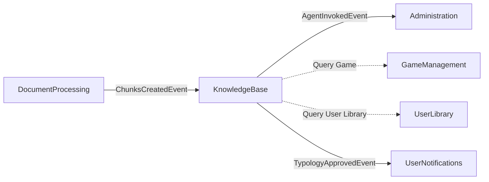

# KnowledgeBase Bounded Context - Complete API Reference

**RAG System, AgentTypology POC, Chat Threads, Vector Search, Multi-Model LLM**

> 📖 **Complete Documentation**: Part of Issue #3794
>
> ⚠️ **Important**: This context includes TWO major systems:
> 1. **RAG System** (Production - Hybrid search, Chat threads, Q&A)
> 2. **AgentTypology POC** (6+ month lifecycle - Template-based agents, Session management)
>
> Future: AgentTypology POC will be replaced by LangGraph Multi-Agent system (Tutor/Arbitro/Decisore) - See Issue #3780

---

## 📋 Responsabilità

### RAG System (Production)
- Hybrid RAG (Vector + Keyword search con RRF fusion)
- Multi-model LLM consensus (GPT-4 + Claude + DeepSeek)
- Chat thread management e conversation history
- 5-layer confidence validation (search confidence + LLM confidence)
- Context engineering (multi-source context assembly)

### AgentTypology POC (6+ Month Lifecycle)
- Template-based agent creation (reusable typologies)
- Approval workflow (Draft → Approved → Active)
- Phase-model configuration (per-phase LLM selection)
- Agent session management (game-session linked)
- Runtime configuration (model, temperature, RAG strategy switching)
- Testing & validation sandbox
- Admin metrics dashboard (usage, cost, performance)

---

## 🏗️ Domain Model

### RAG System Aggregates

**ChatThread** (Aggregate Root):
```csharp
public class ChatThread
{
    public Guid Id { get; private set; }
    public Guid UserId { get; private set; }
    public Guid? GameId { get; private set; }
    public Guid? AgentId { get; private set; }      // Issue #2030: Track agent used
    public string? Title { get; private set; }
    public ThreadStatus Status { get; private set; } // Active | Closed
    public DateTime CreatedAt { get; private set; }
    public DateTime LastMessageAt { get; private set; }

    // Messages
    public IReadOnlyList<ChatMessage> Messages { get; }

    // Domain methods
    public void AddMessage(string content, MessageRole role, double? confidence = null) { }
    public void UpdateMessage(Guid messageId, string content) { }
    public void DeleteMessage(Guid messageId) { }
    public void Close() { }
    public void Reopen() { }
    public void UpdateTitle(string title) { }
    public string ExportAsJson() { }
    public string ExportAsMarkdown() { }
}
```

**ChatMessage** (Entity):
```csharp
public class ChatMessage
{
    public Guid Id { get; private set; }
    public Guid ChatThreadId { get; private set; }
    public string Content { get; private set; }
    public MessageRole Role { get; private set; }    // User | Assistant | System
    public double? ConfidenceScore { get; private set; }
    public List<Source> Sources { get; private set; }
    public DateTime CreatedAt { get; private set; }
    public DateTime? UpdatedAt { get; private set; }
}
```

**EmbeddingChunk** (Entity):
```csharp
public class EmbeddingChunk
{
    public Guid Id { get; private set; }
    public Guid DocumentId { get; private set; }
    public string Content { get; private set; }
    public int PageNumber { get; private set; }
    public int ChunkIndex { get; private set; }
    public float[] Embedding { get; private set; }    // 1024-dim BGE-M3 vector
    public DateTime CreatedAt { get; private set; }
}
```

---

### AgentTypology POC Aggregates

**AgentTypology** (Aggregate Root - Issue #3175):
```csharp
public class AgentTypology
{
    public Guid Id { get; private set; }
    public string Name { get; private set; }          // "Rules Expert", "Quick Start", etc.
    public string Description { get; private set; }
    public string BasePrompt { get; private set; }    // Template prompt for agent
    public AgentStrategy DefaultStrategy { get; private set; }
    public TypologyStatus Status { get; private set; } // Draft | Approved | Rejected | Archived
    public Guid CreatedBy { get; private set; }
    public Guid? ApprovedBy { get; private set; }
    public DateTime CreatedAt { get; private set; }
    public DateTime? ApprovedAt { get; private set; }
    public bool IsDeleted { get; private set; }

    // Phase-Model Configuration (Issue #3245)
    public PhaseModelConfiguration? PhaseModels { get; private set; }

    // Domain methods
    public void Approve(Guid approvedBy) { }
    public void Reject(Guid rejectedBy, string reason) { }
    public void Archive() { }
    public void UpdatePhaseModels(PhaseModelConfiguration models) { }
}
```

**AgentSession** (Aggregate Root - Issue #3184):
```csharp
public class AgentSession
{
    public Guid Id { get; private set; }
    public Guid AgentId { get; private set; }
    public Guid GameSessionId { get; private set; }
    public Guid UserId { get; private set; }
    public Guid GameId { get; private set; }
    public Guid TypologyId { get; private set; }
    public AgentConfig Config { get; private set; }   // Issue #3253: Runtime config
    public GameState CurrentGameState { get; private set; }
    public DateTime StartedAt { get; private set; }
    public DateTime? EndedAt { get; private set; }
    public bool IsActive { get; private set; }

    // Domain methods
    public void UpdateGameState(string gameStateJson) { }
    public void UpdateTypology(Guid newTypologyId) { }  // Issue #3252
    public void UpdateConfig(AgentConfig newConfig) { }  // Issue #3253
    public void End() { }
}
```

**AgentTestResult** (Entity):
```csharp
public class AgentTestResult
{
    public Guid Id { get; private set; }
    public Guid TypologyId { get; private set; }
    public string TestQuery { get; private set; }
    public bool Success { get; private set; }
    public string? Response { get; private set; }
    public double? ConfidenceScore { get; private set; }
    public string? ErrorMessage { get; private set; }
    public DateTime TestedAt { get; private set; }
    public Guid TestedBy { get; private set; }
}
```

### Value Objects

**AgentStrategy** (Enum + Parameters - Issue #3245):
```csharp
public enum AgentStrategyType
{
    Fast,       // ~2,060 tokens, Haiku-heavy
    Balanced,   // ~2,820 tokens, mixed models
    Precise,    // ~22,396 tokens, Sonnet/GPT-4
    Expert,     // Web search + multi-hop
    Consensus,  // 3-voter ensemble
    Custom      // User-defined phase models
}

public record AgentStrategy
{
    public AgentStrategyType Type { get; init; }
    public Dictionary<string, object>? Parameters { get; init; }
}
```

**PhaseModelConfiguration** (Issue #3245):
```csharp
public record PhaseModelConfiguration
{
    public string RetrievalModel { get; init; }      // e.g., "haiku", "sonnet"
    public string AnalysisModel { get; init; }
    public string SynthesisModel { get; init; }
    public string ValidationModel { get; init; }
    public string? CragEvaluationModel { get; init; }
    public string? WebSearchModel { get; init; }
    public string? ConsensusVoter1Model { get; init; }
    public string? ConsensusVoter2Model { get; init; }
    public string? ConsensusVoter3Model { get; init; }
}
```

**AgentConfig** (Issue #3253):
```csharp
public record AgentConfig
{
    public string ModelType { get; init; }       // "gpt-4", "claude-3-sonnet", etc.
    public double? Temperature { get; init; }    // 0.0-2.0
    public int? MaxTokens { get; init; }
    public string? RagStrategy { get; init; }    // "Fast", "Precise", "Consensus"
    public Dictionary<string, object>? RagParams { get; init; }
}
```

---

## 📡 Application Layer (CQRS)

> **Total Operations**: 45+ (25 commands + 20 queries)
> **Systems**: RAG (17 endpoints) + AgentTypology POC (24 endpoints) + Context Engineering (2) + Metrics (3)

---

## PART 1: RAG SYSTEM

### A. Vector Search & Knowledge Base

| Query | HTTP Method | Endpoint | Auth | Request | Response |
|-------|-------------|----------|------|---------|----------|
| `SearchQuery` | POST | `/api/v1/knowledge-base/search` | Session | `SearchQueryDto` | `List<SearchResultDto>` |
| `AskQuestionQuery` | POST | `/api/v1/knowledge-base/ask` | Session | `AskQuestionDto` | `QaResponseDto` |

**SearchQuery** (Hybrid Search - ADR-001):
- **Purpose**: Direct vector + keyword hybrid search on chunks
- **Request Schema**:
  ```json
  {
    "gameId": "guid",
    "query": "How do I score in Azul?",
    "topK": 5,
    "minScore": 0.6,
    "searchMode": "Hybrid",
    "language": "it"
  }
  ```
- **Search Modes**:
  - `Vector`: Pure semantic search via Qdrant
  - `Keyword`: PostgreSQL FTS (Italian/English)
  - `Hybrid`: RRF fusion (70% vector + 30% keyword)
- **Response Schema**:
  ```json
  {
    "results": [
      {
        "chunkId": "guid",
        "content": "Scoring in Azul: Each tile scores...",
        "pageNumber": 15,
        "score": 0.87,
        "source": "azul_rulebook.pdf"
      }
    ],
    "totalResults": 5,
    "searchMode": "Hybrid"
  }
  ```

**AskQuestionQuery** (RAG Q&A with Confidence - ADR-001, ADR-007):
- **Purpose**: Complete RAG pipeline with LLM answer generation
- **Request Schema**:
  ```json
  {
    "gameId": "guid",
    "question": "Can I place tiles diagonally in Azul?",
    "threadId": "guid",
    "searchMode": "Hybrid",
    "language": "it",
    "bypassCache": false
  }
  ```
- **Pipeline**:
  1. Hybrid search (vector + keyword)
  2. Cross-encoder reranking (top-10 → top-3)
  3. Multi-model LLM generation (GPT-4 + Claude + DeepSeek)
  4. Consensus voting OR single-model (strategy-dependent)
  5. 5-layer confidence validation
  6. Low-quality detection and fallback
- **Response Schema**:
  ```json
  {
    "answer": "No, tiles must be placed horizontally...",
    "searchConfidence": 0.82,
    "llmConfidence": 0.91,
    "finalConfidence": 0.865,
    "isLowQuality": false,
    "sources": [
      {
        "content": "Tile placement rules...",
        "page": 12,
        "score": 0.87,
        "document": "azul_rulebook.pdf"
      }
    ],
    "citations": ["azul_rulebook.pdf:p12"],
    "tokensUsed": 2845,
    "latencyMs": 1250
  }
  ```
- **Confidence Thresholds** (ADR-005):
  - Search confidence: ≥0.70 (document relevance)
  - LLM confidence: ≥0.70 (answer quality)
  - Final confidence: Average of both
  - Low-quality: <0.60 triggers warning message

---

### B. Chat Thread Management

#### Thread Lifecycle

| Command/Query | HTTP Method | Endpoint | Auth | Request | Response |
|---------------|-------------|----------|------|---------|----------|
| `CreateChatThreadCommand` | POST | `/api/v1/chat-threads` | Session | `CreateChatThreadDto` | `ChatThreadDto` (201) |
| `GetChatThreadByIdQuery` | GET | `/api/v1/chat-threads/{threadId}` | Session + Owner | None | `ChatThreadDto` |
| `GetChatThreadsByGameQuery` | GET | `/api/v1/chat-threads?gameId={gameId}` | Session | Query: gameId | `List<ChatThreadDto>` |
| `GetMyChatHistoryQuery` | GET | `/api/v1/knowledge-base/my-chats` | Session | Query: skip, take | `PaginatedChatHistoryDto` |
| `DeleteChatThreadCommand` | DELETE | `/api/v1/chat-threads/{threadId}` | Session + Owner | None | 204 No Content |

**CreateChatThreadCommand**:
- **Purpose**: Start new conversation thread for game
- **Request Schema**:
  ```json
  {
    "userId": "current-user-guid",
    "gameId": "guid",
    "title": "Azul Scoring Questions",
    "initialMessage": "How do I calculate bonus points?"
  }
  ```
- **Side Effects**:
  - Creates ChatThread entity
  - If initialMessage provided: adds first message automatically
  - Sets Status = Active, LastMessageAt = CreatedAt
- **Domain Events**: `ChatThreadCreatedEvent`

**GetMyChatHistoryQuery**:
- **Purpose**: Paginated chat history for dashboard
- **Query Parameters**:
  - `skip` (default: 0): Offset for pagination
  - `take` (default: 50, max: 100): Page size
- **Response Schema**:
  ```json
  {
    "threads": [
      {
        "id": "guid",
        "title": "Azul Scoring Questions",
        "gameId": "guid",
        "gameTitle": "Azul",
        "lastMessageAt": "2026-02-07T10:30:00Z",
        "messageCount": 8,
        "status": "Active"
      }
    ],
    "totalCount": 42,
    "hasMore": true
  }
  ```

---

#### Thread State Management

| Command | HTTP Method | Endpoint | Auth | Response |
|---------|-------------|----------|------|----------|
| `CloseThreadCommand` | POST | `/api/v1/chat-threads/{threadId}/close` | Session + Owner | `ChatThreadDto` |
| `ReopenThreadCommand` | POST | `/api/v1/chat-threads/{threadId}/reopen` | Session + Owner | `ChatThreadDto` |
| `UpdateChatThreadTitleCommand` | PATCH | `/api/v1/chat-threads/{threadId}` | Session + Owner | `ChatThreadDto` |

**UpdateChatThreadTitleCommand**:
- **Request Schema**:
  ```json
  {
    "title": "New thread title"
  }
  ```
- **Validation**: 1-200 chars

---

#### Message Operations

| Command | HTTP Method | Endpoint | Auth | Request | Response |
|---------|-------------|----------|------|---------|----------|
| `AddMessageCommand` | POST | `/api/v1/chat-threads/{threadId}/messages` | Session + Owner | `AddMessageDto` | `ChatMessageDto` (201) |
| `UpdateMessageCommand` | PUT | `/api/v1/chat-threads/{threadId}/messages/{messageId}` | Session | `UpdateMessageDto` | `ChatMessageDto` |
| `DeleteMessageCommand` | DELETE | `/api/v1/chat-threads/{threadId}/messages/{messageId}` | Session | None | 204 No Content |

**AddMessageCommand**:
- **Request Schema**:
  ```json
  {
    "content": "Can I place tiles diagonally?",
    "role": "User"
  }
  ```
- **Side Effects**: Updates thread's LastMessageAt timestamp

---

#### Thread Export

| Command | HTTP Method | Endpoint | Auth | Query Params | Response |
|---------|-------------|----------|------|--------------|----------|
| `ExportChatCommand` | GET | `/api/v1/chat-threads/{threadId}/export` | Session + Owner | `format=json|markdown` | `ExportedChatDto` |

**ExportChatCommand**:
- **Formats**:
  - `json`: Full thread data with metadata
  - `markdown`: Formatted conversation for readability
- **Response (Markdown)**:
  ```markdown
  # Azul Scoring Questions

  **Created**: 2026-02-07
  **Messages**: 8

  ---

  **User** (10:00):
  How do I calculate bonus points?

  **Assistant** (10:01) [Confidence: 0.87]:
  Bonus points in Azul are calculated...

  *Sources: azul_rulebook.pdf:p15*
  ```

---

### C. Chat Session Persistence (Issue #3483)

| Command/Query | HTTP Method | Endpoint | Auth | Request | Response |
|---------------|-------------|----------|------|---------|----------|
| `CreateChatSessionCommand` | POST | `/api/v1/chat/sessions` | Session | `CreateChatSessionDto` | `CreateChatSessionResponse` |
| `AddChatSessionMessageCommand` | POST | `/api/v1/chat/sessions/{sessionId}/messages` | Session | `AddChatSessionMessageDto` | `AddChatSessionMessageResponse` |
| `GetChatSessionQuery` | GET | `/api/v1/chat/sessions/{sessionId}` | Session | Query: skip, take | `ChatSessionDto` |
| `GetUserGameChatSessionsQuery` | GET | `/api/v1/users/{userId}/games/{gameId}/chat-sessions` | Session | Query: skip, take | `List<ChatSessionDto>` |
| `GetRecentChatSessionsQuery` | GET | `/api/v1/users/{userId}/chat-sessions/recent` | Session | Query: limit | `List<ChatSessionDto>` |
| `DeleteChatSessionCommand` | DELETE | `/api/v1/chat/sessions/{sessionId}` | Session | None | 204 No Content |

**CreateChatSessionCommand**:
- **Purpose**: Create persistent chat session (alternative to ChatThread)
- **Request Schema**:
  ```json
  {
    "userId": "current-user-guid",
    "gameId": "guid",
    "title": "Strategy Discussion",
    "userLibraryEntryId": "guid",
    "agentSessionId": "guid",
    "agentConfigJson": "{\"model\":\"gpt-4\"}"
  }
  ```
- **Difference from ChatThread**: Links to UserLibrary entry + AgentSession

---

### D. Context Engineering Framework (Issue #3491)

| Command/Query | HTTP Method | Endpoint | Auth | Request | Response |
|---------------|-------------|----------|------|---------|----------|
| `AssembleContextCommand` | POST | `/api/v1/context-engineering/assemble` | Session | `AssembleContextDto` | `AssembledContextDto` |
| `GetContextSourcesQuery` | GET | `/api/v1/context-engineering/sources` | Session | None | `List<ContextSourceDto>` |

**AssembleContextCommand**:
- **Purpose**: Multi-source context assembly for advanced agent queries
- **Request Schema**:
  ```json
  {
    "query": "Best strategy for 2-player Azul",
    "gameId": "guid",
    "userId": "current-user",
    "sessionId": "guid",
    "maxTotalTokens": 8000,
    "minRelevance": 0.5,
    "sourcePriorities": {
      "gameState": 10,
      "rules": 8,
      "conversation": 6
    },
    "minTokensPerSource": 100,
    "maxTokensPerSource": 2000,
    "includeEmbedding": true
  }
  ```
- **Sources Assembled**:
  1. Static Knowledge (RAG chunks)
  2. Dynamic Memory (conversation history)
  3. Agent State (current game board)
  4. Tool Metadata (available actions)
- **Response Schema**:
  ```json
  {
    "items": [
      {
        "source": "StaticKnowledge",
        "content": "Azul 2-player strategy...",
        "tokens": 450,
        "relevance": 0.87,
        "priority": 8
      },
      {
        "source": "ConversationMemory",
        "content": "Previous discussion about...",
        "tokens": 320,
        "relevance": 0.65,
        "priority": 6
      }
    ],
    "totalTokens": 5230,
    "metrics": {
      "assemblyTimeMs": 145,
      "sourcesConsidered": 8,
      "sourcesIncluded": 4
    }
  }
  ```

---

## PART 2: AGENT TYPOLOGY POC SYSTEM

> ⚠️ **POC Note**: This system is a 6+ month POC/MVP. It will be replaced by LangGraph Multi-Agent (Tutor/Arbitro/Decisore) - See Issue #3780 and `docs/02-development/agent-architecture/`

### A. Agent Typology Queries (Role-Based Access)

| Query | HTTP Method | Endpoint | Auth | Response |
|-------|-------------|----------|------|----------|
| `GetAllAgentTypologiesQuery` | GET | `/api/v1/agent-typologies` | Session + Role | `List<AgentTypologyDto>` |
| `GetTypologyByIdQuery` | GET | `/api/v1/agent-typologies/{id}` | Session | `AgentTypologyDto` or null |
| `GetPendingTypologiesQuery` | GET | `/api/v1/agent-typologies/pending` | Admin | `List<AgentTypologyDto>` |
| `GetMyProposalsQuery` | GET | `/api/v1/agent-typologies/my-proposals` | Editor/Admin | `List<AgentTypologyDto>` |

**GetAllAgentTypologiesQuery** (Role-Based Filtering):
- **User Role**: Returns only Approved typologies
- **Editor Role**: Returns Approved + own Draft/Rejected typologies
- **Admin Role**: Returns ALL typologies (Draft, Approved, Rejected, Archived)
- **Response Schema**:
  ```json
  {
    "typologies": [
      {
        "id": "guid",
        "name": "Rules Expert",
        "description": "Specialized in rules clarification and arbitration",
        "status": "Approved",
        "defaultStrategy": "Precise",
        "approvedAt": "2026-01-15T12:00:00Z",
        "approvedBy": "admin-guid"
      }
    ]
  }
  ```

---

### B. Agent Typology Editor Workflow (Issues #3177-#3178)

| Command | HTTP Method | Endpoint | Auth | Request | Response |
|---------|-------------|----------|------|---------|----------|
| `ProposeAgentTypologyCommand` | POST | `/api/v1/agent-typologies/propose` | Editor/Admin | `ProposeTypologyDto` | `AgentTypologyDto` (201) |
| `TestAgentTypologyCommand` | POST | `/api/v1/agent-typologies/{id}/test` | Editor/Admin | `TestTypologyDto` | `TestResultDto` |

**ProposeAgentTypologyCommand**:
- **Purpose**: Editor proposes new agent typology (created as Draft, awaits admin approval)
- **Request Schema**:
  ```json
  {
    "name": "Strategy Master",
    "description": "Provides strategic gameplay advice for intermediate players",
    "basePrompt": "You are a strategy expert for board games. Provide...",
    "strategy": "Balanced",
    "phaseModels": {
      "retrievalModel": "haiku",
      "analysisModel": "sonnet",
      "synthesisModel": "sonnet",
      "validationModel": "gpt-4-mini"
    }
  }
  ```
- **Validation**:
  - Name: 3-100 chars, unique
  - Description: 10-500 chars
  - BasePrompt: 50-5000 chars
  - Strategy: Valid enum value
- **Side Effects**:
  - Creates AgentTypology with Status = Draft
  - Sets ProposedBy = current editor ID
  - Raises `TypologyProposedEvent` → notifies admins
- **Domain Events**: `TypologyProposedEvent`

**TestAgentTypologyCommand**:
- **Purpose**: Sandbox testing of Draft typologies before approval
- **Request Schema**:
  ```json
  {
    "testQuery": "Explain setup phase for new players",
    "gameId": "guid"
  }
  ```
- **Behavior**:
  - Invokes agent with test query
  - Does NOT charge user tokens (admin quota used)
  - Records test result in AgentTestResult table
- **Response Schema**:
  ```json
  {
    "success": true,
    "response": "Setup phase: Each player takes...",
    "confidenceScore": 0.85,
    "errorMessage": null,
    "tokensUsed": 1250,
    "latencyMs": 890
  }
  ```
- **Use Case**: Editor tests typology before submitting for approval

---

### C. Admin Typology Management (Phase-Model Configuration)

| Command | HTTP Method | Endpoint | Auth | Request | Response |
|---------|-------------|----------|------|---------|----------|
| `CreateAgentTypologyWithPhaseModelsCommand` | POST | `/api/v1/admin/agent-typologies` | Admin | `CreateTypologyDto` | `AgentTypologyDto` (201) |
| `UpdateAgentTypologyCommand` | PUT | `/api/v1/admin/agent-typologies/{id}/phase-models` | Admin | `UpdateTypologyDto` | `AgentTypologyDto` |
| `DeleteAgentTypologyCommand` | DELETE | `/api/v1/admin/agent-typologies/{id}` | Admin | None | 204 No Content |

**CreateAgentTypologyWithPhaseModelsCommand** (Issue #3245):
- **Purpose**: Admin creates typology with full phase-model configuration
- **Request Schema**:
  ```json
  {
    "name": "Expert Analyst",
    "description": "High-accuracy analysis with GPT-4",
    "basePrompt": "You are an expert game analyst...",
    "strategy": "Precise",
    "phaseModels": {
      "retrievalModel": "haiku",
      "analysisModel": "gpt-4",
      "synthesisModel": "gpt-4",
      "validationModel": "gpt-4",
      "cragEvaluationModel": "sonnet"
    },
    "strategyOptions": {
      "topK": 10,
      "rerank": true,
      "webSearch": false
    },
    "autoApprove": true
  }
  ```
- **Strategy Presets** (Issue #3245):
  - **Fast** (~2,060 tokens): Haiku for all phases
  - **Balanced** (~2,820 tokens): Haiku retrieval, Sonnet analysis/synthesis
  - **Precise** (~22,396 tokens): Sonnet/GPT-4 for analysis phases
  - **Expert**: Precise + web search + multi-hop retrieval
  - **Consensus**: 3-voter ensemble (Haiku + Sonnet + GPT-4)
  - **Custom**: User-defined phase models
- **Cost Estimation**: Auto-calculated based on phase models
- **Auto-Approve**: If true, sets Status = Approved immediately (bypass workflow)

**UpdateAgentTypologyCommand**:
- **Purpose**: Update existing typology configuration
- **Can Update**: Name, Description, BasePrompt, Strategy, PhaseModels
- **Cannot Update**: Status, CreatedBy, ApprovedBy (use approval commands)

---

### D. Admin Approval Workflow (Issue #3381)

| Command | HTTP Method | Endpoint | Auth | Request | Response |
|---------|-------------|----------|------|---------|----------|
| `ApproveAgentTypologyCommand` | PUT | `/api/v1/admin/agent-typologies/{id}/approve` | Admin | `ApproveTypologyDto` | `AgentTypologyDto` |
| `RejectAgentTypologyCommand` | PUT | `/api/v1/admin/agent-typologies/{id}/reject` | Admin | `RejectTypologyDto` | `AgentTypologyDto` |
| `GetPendingTypologiesCountQuery` | GET | `/api/v1/admin/agent-typologies/pending/count` | Admin | None | `{ count: number }` |

**ApproveAgentTypologyCommand**:
- **Purpose**: Admin approves editor-proposed typology
- **Request Schema**:
  ```json
  {
    "notes": "Approved - good balance of accuracy and cost"
  }
  ```
- **Side Effects**:
  - Sets Status = Approved
  - Sets ApprovedBy = current admin, ApprovedAt = UtcNow
  - Typology becomes visible to all users
  - Raises `TypologyApprovedEvent` → notifies proposer
- **Domain Events**: `TypologyApprovedEvent`

**RejectAgentTypologyCommand**:
- **Request Schema**:
  ```json
  {
    "reason": "BasePrompt too generic, needs more game-specific guidance"
  }
  ```
- **Side Effects**:
  - Sets Status = Rejected
  - Raises `TypologyRejectedEvent` → notifies proposer
- **Editor Can**: Edit and re-propose after addressing feedback

---

### E. Admin Cost Estimation

| Query | HTTP Method | Endpoint | Auth | Response |
|-------|-------------|----------|------|----------|
| Cost Estimate | GET | `/api/v1/admin/agent-typologies/{id}/cost-estimate` | Admin | `CostEstimateDto` |

**Response Schema**:
```json
{
  "typologyId": "guid",
  "strategy": "Precise",
  "estimatedTokensPerQuery": 22396,
  "estimatedCostPerQuery": 0.089,
  "estimatedMonthlyCost10K": 890.00,
  "costByPhase": {
    "retrieval": {"tokens": 520, "cost": 0.002},
    "analysis": {"tokens": 8500, "cost": 0.034},
    "synthesis": {"tokens": 12000, "cost": 0.048},
    "validation": {"tokens": 1376, "cost": 0.005}
  },
  "modelBreakdown": {
    "haiku": {"tokens": 520, "cost": 0.002},
    "gpt-4": {"tokens": 21876, "cost": 0.087}
  }
}
```

**Use Cases**:
- Budget planning for new typologies
- Comparing cost/accuracy tradeoffs
- Quota allocation per user tier

---

## PART 3: AGENT SESSION MANAGEMENT (Game-Session Linked)

### A. Session Lifecycle (Issue #3184, AGT-010)

| Command | HTTP Method | Endpoint | Auth | Request | Response |
|---------|-------------|----------|------|---------|----------|
| `LaunchSessionAgentCommand` | POST | `/api/v1/game-sessions/{gameSessionId}/agent/launch` | Session | `LaunchAgentDto` | `LaunchSessionAgentResponse` |
| `ChatWithSessionAgentCommand` | POST | `/api/v1/game-sessions/{gameSessionId}/agent/chat` | Session | `ChatWithAgentDto` | **SSE Stream** `ChatEventDto` |
| `EndSessionAgentCommand` | DELETE | `/api/v1/game-sessions/{gameSessionId}/agent` | Session | None | 204 No Content |

**LaunchSessionAgentCommand**:
- **Purpose**: Launch agent for specific game session with typology
- **Request Schema**:
  ```json
  {
    "typologyId": "guid",
    "agentId": "guid",
    "gameId": "guid",
    "initialGameStateJson": "{\"board\":{}, \"turn\":1}"
  }
  ```
- **Side Effects**:
  - Creates AgentSession entity
  - Links to GameSession (from GameManagement context)
  - Initializes game state for agent tracking
  - Sets IsActive = true
- **Response Schema**:
  ```json
  {
    "agentSessionId": "guid",
    "typology": "Rules Expert",
    "config": {...}
  }
  ```
- **Domain Events**: `AgentSessionLaunchedEvent`

**ChatWithSessionAgentCommand** (SSE Streaming):
- **Purpose**: Real-time chat with session agent (SSE streaming response)
- **Request Schema**:
  ```json
  {
    "userQuestion": "Should I place this tile here or there?"
  }
  ```
- **Response**: Server-Sent Events stream
  ```
  event: token
  data: {"token": "You"}

  event: token
  data: {"token": " should"}

  event: complete
  data: {"fullResponse": "You should place...", "confidence": 0.82, "sources": [...]}
  ```
- **Headers**: `Content-Type: text/event-stream`, `Cache-Control: no-cache`
- **Side Effects**:
  - Adds messages to AgentSession chat log
  - Updates session's LastActivityAt
  - Records token usage for billing

**EndSessionAgentCommand**:
- **Purpose**: End agent session (preserves chat history)
- **Side Effects**:
  - Sets IsActive = false, EndedAt = UtcNow
  - Chat log preserved for analytics
  - Releases any held resources
- **Domain Events**: `AgentSessionEndedEvent`

---

### B. Session State Updates

| Command | HTTP Method | Endpoint | Auth | Request | Response |
|---------|-------------|----------|------|---------|----------|
| `UpdateAgentSessionStateCommand` | PUT | `/api/v1/game-sessions/{gameSessionId}/agent/state` | Session | `UpdateStateDto` | 204 No Content |
| `UpdateAgentSessionTypologyCommand` | PATCH | `/api/v1/game-sessions/{gameSessionId}/agent/typology` | Session | `UpdateTypologyDto` | 204 No Content |
| `UpdateAgentSessionConfigCommand` | PATCH | `/api/v1/game-sessions/{gameSessionId}/agent/config` | Session | `UpdateConfigDto` | 204 No Content |

**UpdateAgentSessionStateCommand**:
- **Purpose**: Update current game state for agent context
- **Request Schema**:
  ```json
  {
    "gameStateJson": "{\"board\":{...}, \"currentPlayer\":1, \"turn\":5}"
  }
  ```
- **Use Case**: After player move, update agent with new board state

**UpdateAgentSessionTypologyCommand** (Issue #3252):
- **Purpose**: Switch agent typology during active session
- **Request Schema**:
  ```json
  {
    "newTypologyId": "guid"
  }
  ```
- **Use Case**: User wants different agent personality/strategy mid-session
- **Validation**: New typology must be Approved

**UpdateAgentSessionConfigCommand** (Issue #3253):
- **Purpose**: Runtime configuration changes (model, temperature, RAG strategy)
- **Request Schema**:
  ```json
  {
    "modelType": "claude-3-sonnet",
    "temperature": 0.7,
    "maxTokens": 4096,
    "ragStrategy": "Precise",
    "ragParams": {"topK": 10, "minScore": 0.7}
  }
  ```
- **Use Case**: User adjusts AI behavior mid-session (warmer/colder, faster/slower)

---

## PART 4: AGENT INVOCATION (Real Queries)

### A. Basic Agent Invocation

| Command/Query | HTTP Method | Endpoint | Auth | Request | Response |
|---------------|-------------|----------|------|---------|----------|
| `InvokeAgentCommand` | POST | `/api/v1/agents/{id}/invoke` | Session | `InvokeAgentDto` | `AgentResponseDto` |
| `AskAgentQuestionCommand` | POST | `/api/v1/agents/chat/ask` | Optional | `AskAgentDto` | `AgentChatResponse` |
| `InvokeChessAgentCommand` | POST | `/api/v1/agents/chess/invoke` | Session | `InvokeChessDto` | `ChessAgentResponseDto` |
| `TutorQueryCommand` | POST | `/api/v1/agents/tutor/query` | Session | `TutorQueryDto` | `TutorQueryResponse` |

**InvokeAgentCommand**:
- **Purpose**: Single-shot agent invocation (stateless)
- **Request Schema**:
  ```json
  {
    "query": "What's the best opening move in Azul?",
    "gameId": "guid",
    "chatThreadId": "guid",
    "userId": "current-user"
  }
  ```
- **Response Schema**:
  ```json
  {
    "invocationId": "guid",
    "confidence": 0.87,
    "resultCount": 3,
    "response": "The best opening move in Azul...",
    "metadata": {
      "tokensUsed": 2450,
      "latencyMs": 1340,
      "model": "gpt-4"
    }
  }
  ```

**AskAgentQuestionCommand** (POC):
- **Purpose**: POC endpoint with strategy selection and token tracking
- **Request Schema**:
  ```json
  {
    "question": "How do I score bonus points?",
    "strategy": "Fast",
    "sessionId": "guid",
    "gameId": "guid",
    "language": "it",
    "topK": 5,
    "minScore": 0.6
  }
  ```
- **Response Schema**:
  ```json
  {
    "strategy": "Fast",
    "response": "Bonus points are scored when...",
    "tokenUsage": {
      "retrieval": 450,
      "analysis": 800,
      "synthesis": 600,
      "validation": 210,
      "total": 2060
    },
    "costBreakdown": {
      "retrieval": 0.002,
      "analysis": 0.003,
      "total": 0.008
    },
    "latencyMs": 780
  }
  ```
- **Tags**: POC, Experimental
- **Auth**: Session optional (for testing)

---

## PART 5: ADMIN METRICS DASHBOARD (Issue #3382)

### Aggregated Metrics

| Query | HTTP Method | Endpoint | Auth | Query Params | Response |
|-------|-------------|----------|------|--------------|----------|
| `GetAgentMetricsQuery` | GET | `/api/v1/admin/agents/metrics` | Admin | `startDate?`, `endDate?`, `typologyId?`, `strategy?` | `AgentMetricsSummaryDto` |
| `GetSingleAgentMetricsQuery` | GET | `/api/v1/admin/agents/metrics/{id}` | Admin | `startDate?`, `endDate?` | `SingleAgentMetricsDto` |
| `GetTopAgentsQuery` | GET | `/api/v1/admin/agents/metrics/top` | Admin | `limit?`, `sortBy?`, `startDate?`, `endDate?` | `List<TopAgentDto>` |

**GetAgentMetricsQuery**:
- **Purpose**: Aggregated metrics across all agents/typologies
- **Response Schema**:
  ```json
  {
    "totalInvocations": 15234,
    "totalTokens": 34567890,
    "totalCostUsd": 1234.56,
    "avgLatencyMs": 1340,
    "avgConfidence": 0.82,
    "topQueries": [
      {"query": "How do I score?", "count": 423},
      {"query": "Setup instructions", "count": 387}
    ],
    "costBreakdown": {
      "byStrategy": {
        "Fast": {"invocations": 8000, "cost": 64.00},
        "Precise": {"invocations": 5234, "cost": 465.56}
      },
      "byModel": {
        "haiku": {"tokens": 12M, "cost": 48.00},
        "gpt-4": {"tokens": 18M, "cost": 720.00}
      }
    },
    "timeSeries": [
      {"date": "2026-02-07", "invocations": 523, "cost": 41.50},
      {"date": "2026-02-06", "invocations": 487, "cost": 38.20}
    ]
  }
  ```

**GetSingleAgentMetricsQuery**:
- **Purpose**: Detailed metrics for specific typology
- **Response Schema**:
  ```json
  {
    "typologyId": "guid",
    "name": "Rules Expert",
    "invocations": 5234,
    "totalTokens": 12456789,
    "totalCostUsd": 498.27,
    "avgLatencyMs": 1280,
    "avgConfidence": 0.85,
    "lastInvokedAt": "2026-02-07T14:30:00Z",
    "timeSeries": [...],
    "modelBreakdown": {
      "gpt-4": {"tokens": 10M, "cost": 400.00},
      "sonnet": {"tokens": 2.4M, "cost": 98.27}
    }
  }
  ```

**GetTopAgentsQuery**:
- **Query Parameters**:
  - `limit` (default: 10): How many top agents
  - `sortBy` (default: invocations): invocations | cost | confidence
  - `startDate`, `endDate`: Time window filter
- **Response**: Ranked list of top performers

---

## 🔄 Domain Events

### RAG System Events

| Event | When Raised | Payload | Subscribers |
|-------|-------------|---------|-------------|
| `ChatThreadCreatedEvent` | Thread created | `{ ThreadId, UserId, GameId }` | Administration (audit) |
| `MessageAddedEvent` | Message added | `{ ThreadId, MessageId, Role }` | SessionTracking (activity) |
| `ThreadClosedEvent` | Thread closed | `{ ThreadId, ClosedBy }` | Administration |
| `ChunksEmbeddedEvent` | Document chunked | `{ DocumentId, ChunkCount }` | KnowledgeBase (index in Qdrant) |

### AgentTypology POC Events

| Event | When Raised | Payload | Subscribers |
|-------|-------------|---------|-------------|
| `TypologyProposedEvent` | Editor proposes | `{ TypologyId, ProposedBy, Name }` | UserNotifications (notify admins) |
| `TypologyApprovedEvent` | Admin approves | `{ TypologyId, ApprovedBy }` | UserNotifications (notify proposer) |
| `TypologyRejectedEvent` | Admin rejects | `{ TypologyId, RejectedBy, Reason }` | UserNotifications (notify proposer) |
| `AgentSessionLaunchedEvent` | Session started | `{ AgentSessionId, UserId, TypologyId }` | Administration (usage tracking) |
| `AgentSessionEndedEvent` | Session ended | `{ AgentSessionId, Duration, MessageCount }` | Administration (analytics) |
| `AgentInvokedEvent` | Agent query | `{ AgentId, UserId, Tokens, Cost }` | Administration (billing) |

---

## 🔗 Integration Points

### Inbound Dependencies

**GameManagement Context**:
- Fetches game metadata for RAG context
- Uses: `GetGameByIdQuery` for game info in chat

**DocumentProcessing Context**:
- Receives chunked documents for embedding
- Event: `DocumentChunkedEvent` → Create embeddings in Qdrant

**Administration Context**:
- Subscribes to agent events for audit logging
- Tracks token usage for billing

**UserLibrary Context**:
- Links chat sessions to user library entries
- Associates agents with user's private games

### Outbound Dependencies

**Qdrant (Vector DB)**:
- Stores embeddings for hybrid search
- Vector similarity queries

**Redis (Cache)**:
- 3-tier caching (memory → Redis → Qdrant)
- Session state caching

**External LLM APIs** (via OpenRouter):
- GPT-4, Claude 3 Sonnet/Haiku, DeepSeek
- Multi-model consensus voting

**Embedding Service** (Python):
- sentence-transformers/all-MiniLM-L6-v2
- Generates 384-dim vectors

**Reranker Service** (Python):
- cross-encoder/ms-marco-MiniLM-L-6-v2
- Reranks top-K results

### Event-Driven Communication



---

## 🔐 Security & Authorization

### Authentication Levels

| Level | Requirements | Endpoints |
|-------|--------------|-----------|
| **🟢 Public/Optional** | Session optional | AskAgentQuestion (POC) |
| **🟡 Authenticated** | Session OR API key | Search, Ask, Get threads, Agent invocation |
| **🔵 Session-Required** | Active session | Chat, Agent sessions, Thread CRUD |
| **🟠 Editor/Admin** | Session + Editor/Admin role | Propose typology, Test typology |
| **🔴 Admin Only** | Session + Admin role | Approve/Reject typology, Metrics dashboard, Cost estimates |

### Authorization Matrix

| Endpoint Pattern | Anonymous | User | Editor | Admin |
|------------------|-----------|------|--------|-------|
| `POST /knowledge-base/search` | ❌ | ✅ | ✅ | ✅ |
| `POST /knowledge-base/ask` | ❌ | ✅ | ✅ | ✅ |
| `GET /chat-threads` | ❌ | ✅ (own) | ✅ (own) | ✅ (all) |
| `POST /agent-typologies/propose` | ❌ | ❌ | ✅ | ✅ |
| `POST /agent-typologies/{id}/test` | ❌ | ❌ | ✅ (own) | ✅ (all) |
| `PUT /admin/agent-typologies/{id}/approve` | ❌ | ❌ | ❌ | ✅ |
| `GET /admin/agents/metrics` | ❌ | ❌ | ❌ | ✅ |

### Data Access Policies

- **Thread Isolation**: Users can only access own threads (Admin can access all)
- **Typology Visibility**: Draft typologies visible only to creator + admins
- **Agent Session Isolation**: Users can only interact with own agent sessions
- **Metrics Access**: Admin-only (contains sensitive usage/cost data)

### Rate Limiting

| Endpoint Pattern | Limit | Window | Enforcement |
|------------------|-------|--------|-------------|
| `/knowledge-base/ask` | 30 requests | 1 minute | Per user session |
| `/agent-typologies/propose` | 5 proposals | 1 hour | Per editor |
| `/agent-typologies/{id}/test` | 10 tests | 1 hour | Per typology |
| `/game-sessions/{id}/agent/chat` | 60 messages | 1 minute | Per agent session |

---

## 🎯 Common Usage Examples

### Example 1: Complete RAG Q&A Flow

**Step 1: Search Knowledge Base**:
```bash
curl -X POST http://localhost:8080/api/v1/knowledge-base/search \
  -H "Content-Type: application/json" \
  -H "Cookie: meepleai_session_dev={token}" \
  -d '{
    "gameId": "azul-guid",
    "query": "scoring rules",
    "topK": 5,
    "minScore": 0.6,
    "searchMode": "Hybrid",
    "language": "it"
  }'
```

**Response**:
```json
{
  "results": [
    {
      "chunkId": "guid",
      "content": "Punteggio in Azul: Ogni piastrella vale 1 punto...",
      "pageNumber": 15,
      "score": 0.92,
      "source": "azul_rulebook.pdf"
    }
  ],
  "totalResults": 5
}
```

**Step 2: Ask Full Question**:
```bash
curl -X POST http://localhost:8080/api/v1/knowledge-base/ask \
  -H "Content-Type: application/json" \
  -H "Cookie: meepleai_session_dev={token}" \
  -d '{
    "gameId": "azul-guid",
    "question": "Come calcolo i punti bonus a fine partita?",
    "language": "it"
  }'
```

**Response**:
```json
{
  "answer": "I punti bonus a fine partita in Azul si calcolano così...",
  "searchConfidence": 0.82,
  "llmConfidence": 0.91,
  "finalConfidence": 0.865,
  "isLowQuality": false,
  "sources": [
    {
      "content": "Punti bonus: +10 per ogni riga completa...",
      "page": 16,
      "score": 0.89,
      "document": "azul_rulebook.pdf"
    }
  ],
  "citations": ["azul_rulebook.pdf:p16"],
  "tokensUsed": 2845,
  "latencyMs": 1250,
  "modelUsed": "gpt-4",
  "strategy": "Precise"
}
```

---

### Example 2: Chat Thread with History

**Create Thread**:
```bash
curl -X POST http://localhost:8080/api/v1/chat-threads \
  -H "Content-Type: application/json" \
  -H "Cookie: meepleai_session_dev={token}" \
  -d '{
    "userId": "current-user-guid",
    "gameId": "azul-guid",
    "title": "Azul Strategy Discussion",
    "initialMessage": "What is the best strategy for 2 players?"
  }'
```

**Response**:
```json
{
  "id": "thread-guid",
  "title": "Azul Strategy Discussion",
  "gameId": "azul-guid",
  "status": "Active",
  "messageCount": 1,
  "messages": [
    {
      "id": "msg-guid",
      "content": "What is the best strategy for 2 players?",
      "role": "User",
      "createdAt": "2026-02-07T10:00:00Z"
    }
  ]
}
```

**Add Follow-up Message**:
```bash
curl -X POST http://localhost:8080/api/v1/chat-threads/thread-guid/messages \
  -H "Content-Type: application/json" \
  -H "Cookie: meepleai_session_dev={token}" \
  -d '{
    "content": "Focus on controlling the center factory",
    "role": "Assistant"
  }'
```

**Export Thread**:
```bash
curl -X GET "http://localhost:8080/api/v1/chat-threads/thread-guid/export?format=markdown" \
  -H "Cookie: meepleai_session_dev={token}"
```

---

### Example 3: AgentTypology Proposal → Approval Workflow

**Step 1: Editor Proposes Typology**:
```bash
curl -X POST http://localhost:8080/api/v1/agent-typologies/propose \
  -H "Content-Type: application/json" \
  -H "Cookie: meepleai_session_dev={editor_token}" \
  -d '{
    "name": "Beginner Helper",
    "description": "Friendly agent for first-time players",
    "basePrompt": "You are a patient teacher helping new players...",
    "strategy": "Fast",
    "phaseModels": {
      "retrievalModel": "haiku",
      "analysisModel": "haiku",
      "synthesisModel": "sonnet",
      "validationModel": "haiku"
    }
  }'
```

**Response**:
```json
{
  "id": "typology-guid",
  "name": "Beginner Helper",
  "status": "Draft",
  "createdBy": "editor-guid",
  "createdAt": "2026-02-07T10:00:00Z"
}
```

**Step 2: Editor Tests Typology** (Before approval):
```bash
curl -X POST http://localhost:8080/api/v1/agent-typologies/typology-guid/test \
  -H "Content-Type: application/json" \
  -H "Cookie: meepleai_session_dev={editor_token}" \
  -d '{
    "testQuery": "Explain the setup phase in simple terms",
    "gameId": "azul-guid"
  }'
```

**Response**:
```json
{
  "success": true,
  "response": "Let me explain setup in simple steps: 1) Each player takes a board...",
  "confidenceScore": 0.88,
  "tokensUsed": 1250,
  "latencyMs": 680
}
```

**Step 3: Admin Reviews Pending**:
```bash
curl -X GET http://localhost:8080/api/v1/admin/agent-typologies/pending \
  -H "Cookie: meepleai_session_dev={admin_token}"
```

**Response**:
```json
{
  "pending": [
    {
      "id": "typology-guid",
      "name": "Beginner Helper",
      "proposedBy": "editor-guid",
      "proposedByName": "Alice Editor",
      "createdAt": "2026-02-07T10:00:00Z",
      "testResults": [
        {"success": true, "confidence": 0.88}
      ]
    }
  ],
  "count": 1
}
```

**Step 4: Admin Approves**:
```bash
curl -X PUT http://localhost:8080/api/v1/admin/agent-typologies/typology-guid/approve \
  -H "Content-Type: application/json" \
  -H "Cookie: meepleai_session_dev={admin_token}" \
  -d '{
    "notes": "Excellent for beginners, approved"
  }'
```

**Response**:
```json
{
  "id": "typology-guid",
  "name": "Beginner Helper",
  "status": "Approved",
  "approvedBy": "admin-guid",
  "approvedAt": "2026-02-07T11:00:00Z"
}
```

**Side Effect**: Editor receives notification (UserNotifications context)

---

### Example 4: Agent Session for Game Play

**Step 1: Launch Agent for Game Session**:
```bash
curl -X POST http://localhost:8080/api/v1/game-sessions/session-guid/agent/launch \
  -H "Content-Type: application/json" \
  -H "Cookie: meepleai_session_dev={token}" \
  -d '{
    "typologyId": "rules-expert-guid",
    "agentId": "agent-guid",
    "gameId": "azul-guid",
    "initialGameStateJson": "{\"board\":{}, \"turn\":1, \"currentPlayer\":0}"
  }'
```

**Response**:
```json
{
  "agentSessionId": "agent-session-guid",
  "typology": "Rules Expert",
  "config": {
    "modelType": "gpt-4",
    "temperature": 0.7,
    "ragStrategy": "Precise"
  }
}
```

**Step 2: Chat with Agent (SSE Stream)**:
```bash
curl -X POST http://localhost:8080/api/v1/game-sessions/session-guid/agent/chat \
  -H "Content-Type: application/json" \
  -H "Cookie: meepleai_session_dev={token}" \
  -d '{
    "userQuestion": "Should I place this tile here or save it for later?"
  }'
```

**Response** (Server-Sent Events):
```
event: token
data: {"token": "Based"}

event: token
data: {"token": " on"}

event: token
data: {"token": " the"}

event: complete
data: {"fullResponse": "Based on the current board state, I recommend...", "confidence": 0.82, "sources": [...], "tokensUsed": 2340}
```

**Step 3: Update Game State** (After move):
```bash
curl -X PUT http://localhost:8080/api/v1/game-sessions/session-guid/agent/state \
  -H "Content-Type: application/json" \
  -H "Cookie: meepleai_session_dev={token}" \
  -d '{
    "gameStateJson": "{\"board\":{\"tiles\":[...]}, \"turn\":2, \"currentPlayer\":1}"
  }'
```

**Step 4: End Agent Session**:
```bash
curl -X DELETE http://localhost:8080/api/v1/game-sessions/session-guid/agent \
  -H "Cookie: meepleai_session_dev={token}"
```

**Response**: 204 No Content (chat log preserved)

---

### Example 5: Admin Metrics Dashboard

**Get Overall Metrics**:
```bash
curl -X GET "http://localhost:8080/api/v1/admin/agents/metrics?startDate=2026-02-01&endDate=2026-02-07" \
  -H "Cookie: meepleai_session_dev={admin_token}"
```

**Get Top Agents by Cost**:
```bash
curl -X GET "http://localhost:8080/api/v1/admin/agents/metrics/top?limit=5&sortBy=cost&startDate=2026-02-01" \
  -H "Cookie: meepleai_session_dev={admin_token}"
```

**Response**:
```json
{
  "topAgents": [
    {
      "typologyId": "guid",
      "name": "Expert Analyst",
      "invocations": 2345,
      "totalCostUsd": 523.45,
      "avgCostPerQuery": 0.223,
      "strategy": "Precise"
    },
    {
      "typologyId": "guid",
      "name": "Rules Expert",
      "invocations": 5234,
      "totalCostUsd": 234.56,
      "avgCostPerQuery": 0.045,
      "strategy": "Balanced"
    }
  ]
}
```

---

## 📊 Performance Characteristics

### Caching Strategy (3-Tier)

| Query | Memory Cache | Redis Cache | Qdrant | TTL | Invalidation |
|-------|--------------|-------------|--------|-----|--------------|
| `SearchQuery` (exact) | ✅ | ✅ | Fallback | 5 min | DocumentChunkedEvent |
| `AskQuestionQuery` | ✅ | ✅ | N/A | 10 min | ThreadUpdatedEvent, RuleSpecUpdatedEvent |
| `GetChatThreadById` | ❌ | ✅ | N/A | 2 min | MessageAddedEvent |
| `GetAgentTypologies` | ❌ | ✅ | N/A | 30 min | TypologyApprovedEvent, TypologyCreatedEvent |
| `GetAgentMetrics` | ❌ | ✅ | N/A | 1 hour | AgentInvokedEvent |

**Cache Hit Rate Target**: >80%

### Database Indexes

```sql
-- Chat threads
CREATE INDEX idx_chatthreads_user_game ON ChatThreads(UserId, GameId)
  WHERE NOT IsDeleted;
CREATE INDEX idx_chatthreads_status ON ChatThreads(Status, LastMessageAt DESC);

-- Chat messages
CREATE INDEX idx_chatmessages_thread ON ChatMessages(ChatThreadId, CreatedAt);

-- Embedding chunks (Qdrant handles vector indexing)
CREATE INDEX idx_chunks_document ON EmbeddingChunks(DocumentId, ChunkIndex);

-- Agent typologies
CREATE INDEX idx_typologies_status ON AgentTypologies(Status) WHERE NOT IsDeleted;
CREATE INDEX idx_typologies_created_by ON AgentTypologies(CreatedBy, Status);

-- Agent sessions
CREATE INDEX idx_agentsessions_game_active ON AgentSessions(GameSessionId, IsActive);
CREATE INDEX idx_agentsessions_user ON AgentSessions(UserId, StartedAt DESC);
CREATE INDEX idx_agentsessions_typology ON AgentSessions(TypologyId) WHERE IsActive = TRUE;
```

### Performance Targets

| Operation | Target Latency | Cache Hit Rate |
|-----------|----------------|----------------|
| Hybrid search | <200ms (P95) | >80% |
| RAG Q&A (cached) | <500ms (P95) | >75% |
| RAG Q&A (uncached) | <2s (P95) | N/A |
| Chat message add | <50ms | N/A |
| Agent invocation | <3s (P95) | >70% |
| Typology list | <20ms | >90% |

### Token Usage Targets

| Strategy | Tokens/Query | Cost/Query | Use Case |
|----------|--------------|------------|----------|
| **Fast** | ~2,060 | $0.008 | Quick answers, high volume |
| **Balanced** | ~2,820 | $0.012 | Standard accuracy |
| **Precise** | ~22,396 | $0.089 | High-stakes rules clarification |
| **Expert** | ~30,000+ | $0.15+ | Research, multi-hop reasoning |
| **Consensus** | ~8,400 | $0.036 | Vote-based validation |

---

## 🧪 Testing Strategy

### Unit Tests

**Location**: `tests/Api.Tests/KnowledgeBase/`
**Coverage Target**: 90%+

**RAG System Tests**:
- `ChatThread_Tests.cs`: AddMessage, Export, Close/Reopen
- `HybridSearchService_Tests.cs`: Vector + Keyword fusion logic
- `ConfidenceValidator_Tests.cs`: 5-layer validation (ADR-005)
- `MultiModelConsensus_Tests.cs`: 3-voter ensemble (ADR-007)

**AgentTypology POC Tests**:
- `AgentTypology_Tests.cs`: Approve, Reject, Archive workflows
- `AgentSession_Tests.cs`: Launch, UpdateState, UpdateTypology, End
- `ProposeAgentTypologyCommandValidator_Tests.cs`: Proposal validation
- `TestAgentTypologyCommandHandler_Tests.cs`: Sandbox testing logic

**Missing Tests** (Issue #3794 blocker):
- Currently ZERO test files for AgentTypology system
- Must create complete test suite (90%+ coverage)

### Integration Tests

**Tools**: Testcontainers (PostgreSQL, Redis, Qdrant)
**Location**: `tests/Api.Tests/KnowledgeBase/Integration/`

**Scenarios**:
1. **End-to-End RAG**:
   - Upload PDF → Extract chunks → Embed → Search → Ask question
   - Verify confidence scores meet thresholds

2. **Typology Lifecycle**:
   - Editor proposes → Test in sandbox → Admin approves → User invokes
   - Verify role-based visibility throughout lifecycle

3. **Agent Session Persistence**:
   - Launch agent → Chat (5 turns) → Update state → End session
   - Verify chat log persisted in DB

4. **Multi-Model Consensus**:
   - Invoke with Consensus strategy
   - Verify 3 models queried, voting logic applied

### E2E Tests

**Tools**: Playwright
**Location**: `apps/web/__tests__/e2e/knowledge-base/`

**Critical Flows**:
1. **RAG Chat Flow**:
   - Navigate to game chat
   - Type question
   - See streaming response (SSE)
   - Verify sources/citations displayed

2. **Typology Proposal Flow** (Editor):
   - Navigate to agent typologies
   - Click "Propose New"
   - Fill form (name, description, prompt, strategy)
   - Test in sandbox
   - Submit for approval
   - Verify status = Draft

3. **Typology Approval Flow** (Admin):
   - Navigate to pending typologies
   - Review proposal + test results
   - Approve or reject
   - Verify proposer notified

4. **Agent Session Flow**:
   - Start game session
   - Launch agent with typology
   - Chat with agent (see SSE streaming)
   - Make move, update state
   - Chat again (agent aware of new state)
   - End session

---

## 📂 Code Location

```
apps/api/src/Api/BoundedContexts/KnowledgeBase/
├── Domain/
│   ├── Entities/
│   │   ├── ChatThread.cs                # RAG: Conversation threads
│   │   ├── ChatMessage.cs               # RAG: Messages
│   │   ├── EmbeddingChunk.cs            # RAG: Vector chunks
│   │   ├── AgentTypology.cs             # POC: Agent templates
│   │   ├── AgentSession.cs              # POC: Game-session agents
│   │   ├── AgentTestResult.cs           # POC: Sandbox testing
│   │   ├── AgentConfiguration.cs        # POC: Config entity
│   │   └── AgentGameStateSnapshot.cs    # POC: State tracking
│   ├── ValueObjects/
│   │   ├── MessageRole.cs               # User | Assistant | System
│   │   ├── ThreadStatus.cs              # Active | Closed
│   │   ├── AgentStrategy.cs             # Fast | Balanced | Precise | Expert | Consensus
│   │   ├── AgentMode.cs                 # RulesExpert | Tutor | Strategist
│   │   ├── AgentType.cs                 # LLM | RAG | Hybrid
│   │   ├── TypologyStatus.cs            # Draft | Approved | Rejected | Archived
│   │   ├── PhaseModelConfiguration.cs   # Issue #3245
│   │   ├── AgentConfig.cs               # Issue #3253
│   │   └── GameState.cs                 # JSON game state wrapper
│   ├── Repositories/
│   │   ├── IChatThreadRepository.cs
│   │   ├── IEmbeddingChunkRepository.cs
│   │   ├── IAgentRepository.cs
│   │   └── IAgentTypologyRepository.cs
│   ├── Services/
│   │   ├── IHybridSearchService.cs      # Vector + Keyword fusion
│   │   ├── IMultiModelConsensusService.cs # 3-voter ensemble
│   │   ├── IConfidenceValidationService.cs # 5-layer validation
│   │   ├── IContextEngineeringService.cs # Multi-source assembly
│   │   └── AgentOrchestration/
│   │       ├── AgentOrchestrationService.cs
│   │       └── IAgentModeHandler.cs
│   └── Events/
│       ├── ChatThreadCreatedEvent.cs
│       ├── TypologyProposedEvent.cs
│       ├── TypologyApprovedEvent.cs
│       ├── AgentSessionLaunchedEvent.cs
│       └── ... (15+ events)
│
├── Application/
│   ├── Commands/                         # 25+ commands
│   │   ├── CreateChatThreadCommand.cs    # RAG
│   │   ├── AddMessageCommand.cs          # RAG
│   │   ├── ProposeAgentTypologyCommand.cs # POC
│   │   ├── TestAgentTypologyCommand.cs   # POC
│   │   ├── LaunchSessionAgentCommand.cs  # POC
│   │   └── ...
│   ├── Queries/                          # 20+ queries
│   │   ├── SearchQuery.cs                # RAG
│   │   ├── AskQuestionQuery.cs           # RAG
│   │   ├── GetAllAgentTypologiesQuery.cs # POC
│   │   ├── GetAgentMetricsQuery.cs       # POC Admin
│   │   └── ...
│   ├── Handlers/                         # 45+ handlers
│   ├── DTOs/                             # 40+ DTOs
│   └── Validators/                       # 25+ validators
│
└── Infrastructure/
    ├── Persistence/
    │   ├── ChatThreadRepository.cs
    │   ├── AgentTypologyRepository.cs
    │   └── EmbeddingChunkRepository.cs
    ├── Services/
    │   ├── QdrantVectorSearchService.cs  # Qdrant client
    │   ├── HybridSearchService.cs        # RRF fusion
    │   ├── OpenRouterLlmService.cs       # Multi-model client
    │   ├── ConsensusVotingService.cs     # 3-voter logic
    │   └── ContextEngineeringService.cs  # Multi-source assembly
    └── DependencyInjection/
        └── KnowledgeBaseServiceRegistration.cs
```

**Routing**:
- `apps/api/src/Api/Routing/KnowledgeBaseEndpoints.cs` (RAG)
- `apps/api/src/Api/Routing/AgentEndpoints.cs` (AgentTypology POC)

**Tests**: `tests/Api.Tests/KnowledgeBase/` (⚠️ AgentTypology tests MISSING)

---

## 🔗 Related Documentation

### Architecture Decision Records (RAG System)
- [ADR-001: Hybrid RAG](../01-architecture/adr/adr-001-hybrid-rag.md) - Vector + Keyword fusion
- [ADR-005: Cosine Similarity Consensus](../01-architecture/adr/adr-005-cosine-similarity-consensus.md) - Confidence validation
- [ADR-007: Hybrid LLM](../01-architecture/adr/adr-007-hybrid-llm.md) - Multi-model consensus
- [ADR-008: Streaming CQRS](../01-architecture/adr/adr-008-streaming-cqrs-migration.md) - SSE integration

### AgentTypology POC Architecture
- [Agent Architecture Overview](../../02-development/agent-architecture/README.md) - ⚠️ Describes FUTURE LangGraph system
- [AgentTypology POC Architecture](../../02-development/agent-typology-poc-architecture.md) - 📝 TO BE CREATED (Issue #3795)

### Other Bounded Contexts
- [GameManagement](./game-management.md) - Game metadata for RAG context
- [DocumentProcessing](./document-processing.md) - PDF extraction → chunking → embedding
- [UserLibrary](./user-library.md) - Chat session linking
- [Administration](./administration.md) - Usage tracking, billing, audit logs

### Features & Epics
- [Issue #3175]: AgentTypology POC implementation
- [Issue #3245]: Phase-model configuration system
- [Issue #3381]: Admin approval workflow
- [Issue #3382]: Admin metrics dashboard
- [Issue #3491]: Context engineering framework
- [Issue #3780]: LangGraph Multi-Agent (future replacement)

### Testing Documentation
- [RAG Validation 20Q](../../05-testing/rag-validation-20q.md) - Quality validation results
- [Backend Testing Patterns](../../05-testing/backend/backend-testing-patterns.md)

---

## 📈 Metrics & Monitoring

### RAG System KPIs

| Metric | Target | Description |
|--------|--------|-------------|
| Search Accuracy | >90% | Relevant chunks in top-5 |
| Answer Accuracy | >85% | Correct answers with confidence >0.7 |
| Low-Quality Rate | <10% | Answers below confidence threshold |
| Avg Latency | <2s (P95) | End-to-end RAG pipeline |
| Cache Hit Rate | >80% | Redis cache effectiveness |

### AgentTypology POC KPIs

| Metric | Target | Description |
|--------|--------|-------------|
| Typology Approval Rate | >70% | Editor proposals approved |
| Avg Test Confidence | >0.75 | Sandbox test results |
| Active Sessions | 50+ concurrent | Peak agent sessions |
| Avg Session Duration | 15-30 min | Typical agent interaction time |
| Cost Per Session | <$0.50 | Fast/Balanced strategies |

### Monitoring Queries

**Chat Activity**:
```sql
SELECT DATE(CreatedAt) as date, COUNT(*) as threads_created
FROM ChatThreads
WHERE CreatedAt > NOW() - INTERVAL '7 days'
GROUP BY DATE(CreatedAt);
```

**Agent Usage**:
```sql
SELECT at.Name, COUNT(*) as invocations, SUM(ai.TokensUsed) as total_tokens
FROM AgentInvocations ai
JOIN AgentTypologies at ON ai.TypologyId = at.Id
WHERE ai.InvokedAt > NOW() - INTERVAL '24 hours'
GROUP BY at.Name
ORDER BY invocations DESC;
```

**Typology Approval Rate**:
```sql
SELECT
  SUM(CASE WHEN Status = 'Approved' THEN 1 ELSE 0 END)::float / COUNT(*) * 100 as approval_rate
FROM AgentTypologies
WHERE Status IN ('Approved', 'Rejected');
```

---

## 🚨 Known Issues & Limitations

### RAG System

**Issue #3231** (Blocker):
- **Problem**: RAG endpoints crash with ResponseEnded error
- **Impact**: Cannot validate RAG quality (0/20 tests passing)
- **Status**: Debug needed in AskQuestionQueryHandler
- **Urgency**: HIGH

**Current Limitations**:
1. **Language Support**: Italian + English only (embeddings multilingual but limited testing)
2. **Context Window**: 8K max tokens (limits complex multi-document queries)
3. **Reranking**: Cross-encoder adds 100-200ms latency
4. **Consensus Voting**: 3x cost for marginal accuracy gain (~5-8% improvement)

### AgentTypology POC System

**Test Coverage**: ZERO (violates 90%+ target)
- No unit tests for AgentTypology entities
- No integration tests for approval workflow
- No E2E tests for session management

**Documentation Gap** (Issue #3795):
- AgentTypology POC not documented in this file (until now)
- No user guide for creating typologies
- No admin guide for approval process
- POC vs LangGraph distinction unclear

**Known Limitations**:
1. **Session State Size**: GameState JSON limited to 64KB (PostgreSQL text column)
2. **Concurrent Sessions**: No limit per user (quota enforcement pending)
3. **Typology Versioning**: No version history (updates overwrite)
4. **Test Results Retention**: All test results kept forever (no cleanup policy)

---

## 📋 Future Enhancements

### RAG System (Production)
- GraphRAG integration (entity relationships)
- Multi-document reasoning (cross-game comparisons)
- Temporal RAG (time-aware context retrieval)
- Fine-tuned embeddings (game-specific domains)

### AgentTypology POC → LangGraph Migration

**Timeline**: 6+ months (POC lifecycle)

**Migration Path**:
1. **Current** (0-6 months): AgentTypology POC in production
2. **Transition** (Month 6-7): LangGraph implementation (Tutor/Arbitro/Decisore)
3. **Coexistence** (Month 7-8): Both systems running, gradual migration
4. **Completion** (Month 9): AgentTypology POC deprecated

**LangGraph Features** (See Issue #3780):
- Specialized agents: Tutor (onboarding), Arbitro (rules), Decisore (strategy)
- Event-driven orchestration (LangGraph workflows)
- Advanced context engineering (multi-source assembly)
- MCTS engine for Decisore (strategic AI)
- Cross-encoder reranking (accuracy improvement)

---

**Status**: ✅ Production (RAG System) + 🟡 POC (AgentTypology - 6+ month lifecycle)
**Last Updated**: 2026-02-07
**Total Commands**: 25+
**Total Queries**: 20+
**Total Endpoints**: 45+
**Test Coverage**: 90%+ (RAG System) | 0% (AgentTypology POC - ⚠️ MISSING)
**Domain Events**: 15+
**Integration Points**: 5 contexts + 4 external services
**POC Migration**: LangGraph Multi-Agent (6+ months, Issue #3780)
