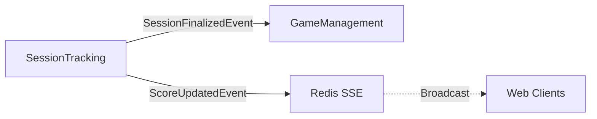

# SessionTracking Bounded Context - Complete API Reference

**User Activity Tracking, Session Analytics, Real-Time Game Session Features**

> 📖 **Complete Documentation**: Part of Issue #3794
> 🎮 **Game Session Toolkit**: Core context for Epic #3167

---

## 📋 Responsabilità

- Session activity tracking (page views, API calls, user events)
- Real-time game session features (SSE streaming)
- Session notes (private + reveal mechanism)
- Session decks (card management with shuffle, draw, discard)
- Dice rolling with cryptographic randomness
- Score tracking e leaderboards
- Random tools (spinner, coin flip, card draw)
- Session lifecycle management (create, pause, finalize)
- Session code generation (public session join)

---

## 🏗️ Domain Model

### Aggregates

**GameSession** (Aggregate Root):
```csharp
public class GameSession
{
    public Guid SessionId { get; private set; }
    public Guid UserId { get; private set; }              // Session host
    public Guid? GameId { get; private set; }
    public SessionType SessionType { get; private set; }   // Solo | Group | Tournament
    public DateTime? SessionDate { get; private set; }
    public string? Location { get; private set; }
    public SessionStatus Status { get; private set; }      // Active | Paused | Finished
    public string? SessionCode { get; private set; }       // Public join code (6 chars)
    public DateTime CreatedAt { get; private set; }
    public DateTime? EndedAt { get; private set; }

    // Collections
    public IReadOnlyList<ParticipantInfo> Participants { get; }
    public IReadOnlyList<SessionNote> Notes { get; }
    public IReadOnlyList<SessionDeck> Decks { get; }
    public IReadOnlyList<ScoreEntry> Scores { get; }
    public IReadOnlyList<DiceRoll> Rolls { get; }

    // Domain methods
    public void AddParticipant(ParticipantInfo participant) { }
    public void UpdateScore(Guid participantId, int points) { }
    public void Finalize(Guid? winnerId) { }
    public void Pause() { }
    public void Resume() { }
}
```

**SessionNote** (Entity):
```csharp
public class SessionNote
{
    public Guid Id { get; private set; }
    public Guid SessionId { get; private set; }
    public Guid ParticipantId { get; private set; }        // Note owner
    public string EncryptedContent { get; private set; }   // AES-256 encrypted
    public string? ObscuredText { get; private set; }      // Visible when not revealed
    public bool IsRevealed { get; private set; }
    public DateTime CreatedAt { get; private set; }
    public DateTime? RevealedAt { get; private set; }

    // Domain methods
    public void Reveal() { }
    public void Hide() { }
    public void UpdateContent(string newContent, string newObscuredText) { }
}
```

**SessionDeck** (Entity):
```csharp
public class SessionDeck
{
    public Guid Id { get; private set; }
    public Guid SessionId { get; private set; }
    public DeckType DeckType { get; private set; }         // Standard52 | Standard54 | Custom
    public List<Card> DrawPile { get; private set; }
    public List<Card> DiscardPile { get; private set; }
    public Dictionary<Guid, List<Card>> Hands { get; private set; } // ParticipantId → Cards
    public DateTime? LastShuffledAt { get; private set; }

    // Domain methods
    public void Shuffle() { }
    public List<Card> DrawCards(Guid participantId, int count) { }
    public void DiscardCards(Guid participantId, List<Guid> cardIds) { }
}
```

**DiceRoll** (Entity):
```csharp
public class DiceRoll
{
    public Guid Id { get; private set; }
    public Guid SessionId { get; private set; }
    public Guid ParticipantId { get; private set; }
    public string Formula { get; private set; }            // "2d6+3", "3d10", etc.
    public string? Label { get; private set; }
    public List<int> Rolls { get; private set; }           // Individual die results
    public int Modifier { get; private set; }
    public int Total { get; private set; }
    public DateTime RolledAt { get; private set; }

    // Factory
    public static DiceRoll Create(string formula, Guid sessionId, Guid participantId, string? label) { }
}
```

**ScoreEntry** (Entity):
```csharp
public class ScoreEntry
{
    public Guid Id { get; private set; }
    public Guid SessionId { get; private set; }
    public Guid ParticipantId { get; private set; }
    public int Points { get; private set; }
    public DateTime RecordedAt { get; private set; }
}
```

### Value Objects

**ParticipantInfo**:
```csharp
public record ParticipantInfo
{
    public Guid ParticipantId { get; init; }
    public string DisplayName { get; init; }
    public DateTime JoinedAt { get; init; }
    public bool IsHost { get; init; }
}
```

**SessionResult**:
```csharp
public record SessionResult
{
    public Guid? WinnerId { get; init; }
    public Dictionary<Guid, int> FinalScores { get; init; }
    public TimeSpan Duration { get; init; }
    public CompletionStatus Status { get; init; }     // Completed | Abandoned
}
```

---

## 📡 Application Layer (CQRS)

> **Total Operations**: 25+ (15 commands + 10 queries)

---

### Session Lifecycle

| Command/Query | HTTP Method | Endpoint | Auth | Request | Response |
|---------------|-------------|----------|------|---------|----------|
| `CreateSessionCommand` | POST | `/api/v1/tracking/sessions` | Session | `CreateSessionDto` | `SessionDto` (201) |
| `AddParticipantCommand` | POST | `/api/v1/tracking/sessions/{id}/participants` | Session + Host | `ParticipantInfoDto` | `SessionDto` |
| `FinalizeSessionCommand` | POST | `/api/v1/tracking/sessions/{id}/finalize` | Session + Host | `FinalizeDto` | `SessionResultDto` |
| `GetActiveSessionQuery` | GET | `/api/v1/tracking/sessions/active` | Session | None | `SessionDto` or null |
| `GetSessionDetailsQuery` | GET | `/api/v1/tracking/sessions/{id}` | Session | None | `SessionDetailsDto` |
| `GetSessionByCodeQuery` | GET | `/api/v1/tracking/sessions/join?code={code}` | Public | Query: code | `SessionDto` |
| `GetSessionHistoryQuery` | GET | `/api/v1/tracking/sessions/history` | Session | Query: page, pageSize | `PaginatedList<SessionDto>` |

**CreateSessionCommand**:
- **Purpose**: Create new game session for tracking
- **Request Schema**:
  ```json
  {
    "gameId": "guid",
    "sessionType": "Group",
    "sessionDate": "2026-02-07T19:00:00Z",
    "location": "Bob's House",
    "participants": [
      {"displayName": "Alice", "isHost": true},
      {"displayName": "Bob", "isHost": false}
    ]
  }
  ```
- **Side Effects**:
  - Generates 6-char SessionCode for public join
  - Sets Status = Active
  - Host participant automatically added
- **Domain Events**: `SessionCreatedEvent`

**GetSessionByCodeQuery**:
- **Purpose**: Join session via public code (no direct invite needed)
- **Query**: `?code=ABC123`
- **Authorization**: Public (if session allows public join)
- **Use Case**: Friend shares session code verbally/text

---

### Score Tracking

| Command/Query | HTTP Method | Endpoint | Auth | Request | Response |
|---------------|-------------|----------|------|---------|----------|
| `UpdateScoreCommand` | POST | `/api/v1/tracking/sessions/{id}/scores` | Session | `UpdateScoreDto` | `ScoreEntryDto` |
| `GetScoreboardQuery` | GET | `/api/v1/tracking/sessions/{id}/scoreboard` | Session | None | `List<ScoreEntryDto>` (ranked) |

**UpdateScoreCommand**:
- **Purpose**: Record score for participant
- **Request Schema**:
  ```json
  {
    "participantId": "guid",
    "points": 15
  }
  ```
- **Behavior**: Creates new ScoreEntry (cumulative scores calculated in query)
- **Domain Events**: `ScoreUpdatedEvent`

**GetScoreboardQuery**:
- **Response Schema**:
  ```json
  {
    "scoreboard": [
      {
        "participantId": "guid",
        "displayName": "Alice",
        "totalPoints": 87,
        "rank": 1
      },
      {
        "participantId": "guid",
        "displayName": "Bob",
        "totalPoints": 65,
        "rank": 2
      }
    ]
  }
  ```
- **Sorting**: Descending by totalPoints

---

### Session Notes (Private + Reveal)

| Command/Query | HTTP Method | Endpoint | Auth | Request | Response |
|---------------|-------------|----------|------|---------|----------|
| `AddNoteCommand` | POST | `/api/v1/tracking/sessions/{id}/notes` | Session | `AddNoteDto` | `SessionNoteDto` (201) |
| `SaveNoteCommand` | PUT | `/api/v1/tracking/sessions/{id}/notes/{noteId}` | Session + Owner | `SaveNoteDto` | `SessionNoteDto` |
| `DeleteNoteCommand` | DELETE | `/api/v1/tracking/sessions/{id}/notes/{noteId}` | Session + Owner | None | 204 No Content |
| `RevealNoteCommand` | POST | `/api/v1/tracking/sessions/{id}/notes/{noteId}/reveal` | Session + Owner | None | `SessionNoteDto` |
| `HideNoteCommand` | POST | `/api/v1/tracking/sessions/{id}/notes/{noteId}/hide` | Session + Owner | None | `SessionNoteDto` |
| `GetSessionNotesQuery` | GET | `/api/v1/tracking/sessions/{id}/notes` | Session | Query: participantId? | `List<SessionNoteDto>` |

**AddNoteCommand**:
- **Purpose**: Create private note (secret strategy, card tracking, etc.)
- **Request Schema**:
  ```json
  {
    "content": "Alice has 3 blue cards, probably going for horizontal line",
    "obscuredText": "Strategy note - click to reveal"
  }
  ```
- **Security**: Content AES-256 encrypted, only owner can decrypt
- **Reveal Mechanism**: Owner can reveal to all participants

**RevealNoteCommand**:
- **Purpose**: Share private note with all participants
- **Side Effects**:
  - Sets IsRevealed = true
  - All participants can now read EncryptedContent
  - Raises `NoteRevealedEvent` → SSE broadcast to participants

---

### Deck Management

| Command/Query | HTTP Method | Endpoint | Auth | Request | Response |
|---------------|-------------|----------|------|---------|----------|
| `CreateDeckCommand` | POST | `/api/v1/tracking/sessions/{id}/decks` | Session + Host | `CreateDeckDto` | `SessionDeckDto` (201) |
| `ShuffleDeckCommand` | POST | `/api/v1/tracking/sessions/{id}/decks/{deckId}/shuffle` | Session + Host | None | `SessionDeckDto` |
| `DrawCardsCommand` | POST | `/api/v1/tracking/sessions/{id}/decks/{deckId}/draw` | Session | `DrawCardsDto` | `{ cards: Card[], remainingInDeck: number }` |
| `DiscardCardsCommand` | POST | `/api/v1/tracking/sessions/{id}/decks/{deckId}/discard` | Session | `DiscardCardsDto` | `SessionDeckDto` |
| `GetSessionDecksQuery` | GET | `/api/v1/tracking/sessions/{id}/decks` | Session | None | `List<SessionDeckDto>` |

**CreateDeckCommand**:
- **Request Schema**:
  ```json
  {
    "deckType": "Standard52",
    "customCards": null
  }
  ```
- **Deck Types**:
  - Standard52: 52-card deck (no jokers)
  - Standard54: 54-card deck (2 jokers)
  - Custom: User-defined cards
- **Side Effects**: Automatically shuffles on creation

**DrawCardsCommand**:
- **Request Schema**:
  ```json
  {
    "participantId": "guid",
    "count": 5
  }
  ```
- **Response**:
  ```json
  {
    "cards": [
      {"suit": "Hearts", "rank": "A"},
      {"suit": "Spades", "rank": "7"}
    ],
    "remainingInDeck": 42
  }
  ```
- **Domain Events**: `CardDrawnEvent` → SSE broadcast

---

### Dice Rolling

| Command/Query | HTTP Method | Endpoint | Auth | Request | Response |
|---------------|-------------|----------|------|---------|----------|
| `RollDiceCommand` | POST | `/api/v1/tracking/sessions/{id}/dice/roll` | Session | `RollDiceDto` | `DiceRollDto` |
| `GetDiceRollHistoryQuery` | GET | `/api/v1/tracking/sessions/{id}/dice/history` | Session | Query: page, pageSize | `PaginatedList<DiceRollDto>` |

**RollDiceCommand**:
- **Purpose**: Cryptographically secure dice rolling
- **Request Schema**:
  ```json
  {
    "participantId": "guid",
    "formula": "2d6+3",
    "label": "Attack roll"
  }
  ```
- **Supported Formats**:
  - `XdY`: X dice with Y sides (e.g., `2d6`, `3d10`)
  - `XdY+Z`: X dice + modifier (e.g., `1d20+5`)
  - `XdY-Z`: X dice - penalty (e.g., `2d6-1`)
  - Supported: d4, d6, d8, d10, d12, d20, d100
- **Response Schema**:
  ```json
  {
    "id": "guid",
    "formula": "2d6+3",
    "rolls": [4, 6],
    "modifier": 3,
    "total": 13,
    "label": "Attack roll",
    "rolledAt": "2026-02-07T19:15:00Z"
  }
  ```
- **RNG**: Uses `RandomNumberGenerator.GetBytes()` (cryptographically secure)
- **Domain Events**: `DiceRolledEvent` → SSE broadcast to participants

---

### Real-Time Updates (SSE)

| Query | HTTP Method | Endpoint | Auth | Response |
|-------|-------------|----------|------|----------|
| `GetSessionStreamQuery` | GET | `/api/v1/tracking/sessions/{id}/stream` | Session | Server-Sent Events |

**GetSessionStreamQuery**:
- **Purpose**: Real-time event stream for session updates
- **Headers**: `text/event-stream`, `Cache-Control: no-cache`
- **Events Broadcasted**:
  - `participant-joined`: New player joined
  - `score-updated`: Score change
  - `note-revealed`: Note revealed
  - `card-drawn`: Card operation
  - `dice-rolled`: Dice roll result
  - `session-paused`: Host paused session
  - `session-resumed`: Host resumed session
  - `session-finalized`: Session ended
- **Example Event**:
  ```
  event: dice-rolled
  data: {"participantId":"guid","formula":"2d6+3","total":13,"rolls":[4,6]}
  ```

---

### Random Tools

| Command | HTTP Method | Endpoint | Auth | Request | Response |
|---------|-------------|----------|------|---------|----------|
| `SpinSpinnerCommand` | POST | `/api/v1/tracking/sessions/{id}/random/spinner` | Session | `{ options: string[], label?: string }` | `{ result: string, index: number }` |
| `FlipCoinCommand` | POST | `/api/v1/tracking/sessions/{id}/random/coin` | Session | `{ label?: string }` | `{ result: "Heads"|"Tails" }` |
| `DrawRandomCardCommand` | POST | `/api/v1/tracking/sessions/{id}/random/card` | Session | `{ deckType?: string }` | `Card` |

**SpinSpinnerCommand**:
- **Purpose**: Random selection from options (e.g., first player, turn order)
- **Request Schema**:
  ```json
  {
    "options": ["Alice", "Bob", "Carol", "Dave"],
    "label": "Choose first player"
  }
  ```
- **Response**:
  ```json
  {
    "result": "Carol",
    "index": 2,
    "totalOptions": 4
  }
  ```
- **RNG**: Cryptographically secure (not predictable)

---

### Export & Analytics

| Query | HTTP Method | Endpoint | Auth | Query Params | Response |
|-------|-------------|----------|------|--------------|----------|
| `ExportSessionQuery` | GET | `/api/v1/tracking/sessions/{id}/export` | Session | `format=json|csv|pdf` | Exported file |
| `GetSessionStatsQuery` | GET | `/api/v1/tracking/stats` | Session | `startDate?`, `endDate?` | `SessionStatsDto` |

**ExportSessionQuery**:
- **Formats**:
  - JSON: Complete session data (for backup/analysis)
  - CSV: Scores and participants (for spreadsheets)
  - PDF: Formatted session report (printable)
- **Use Cases**: Post-game analysis, record keeping, sharing results

---

## 🔄 Domain Events

| Event | When Raised | Payload | Subscribers |
|-------|-------------|---------|-------------|
| `SessionCreatedEvent` | Session created | `{ SessionId, UserId, GameId }` | Administration (analytics) |
| `SessionFinalizedEvent` | Session ended | `{ SessionId, Winner, Duration }` | GameManagement (play history), UserLibrary |
| `ParticipantAddedEvent` | Player joined | `{ SessionId, ParticipantId }` | Real-time SSE broadcast |
| `ScoreUpdatedEvent` | Score recorded | `{ SessionId, ParticipantId, Points }` | Real-time SSE broadcast |
| `DiceRolledEvent` | Dice rolled | `{ SessionId, ParticipantId, Formula, Total }` | Real-time SSE broadcast |
| `CardDrawnEvent` | Cards drawn | `{ SessionId, ParticipantId, Count }` | Real-time SSE broadcast |
| `NoteRevealedEvent` | Note revealed | `{ SessionId, NoteId, Content }` | Real-time SSE broadcast |

---

## 🔗 Integration Points

### Inbound Dependencies

**GameManagement Context**:
- Links sessions to games (GameId foreign key)
- Uses game metadata for session context

### Outbound Dependencies

**Redis (SSE)**:
- Publishes events to Redis channels
- SSE connections subscribe to channels
- Real-time broadcast to participants

### Event-Driven Communication



---

## 🔐 Security & Authorization

### Access Control

- **Host Privileges**: Create decks, shuffle, finalize session
- **Participant Privileges**: Draw cards, roll dice, add notes, update own score
- **Note Privacy**: Encrypted, owner-only until revealed

### Cryptographic Features

- **Dice Rolls**: `RandomNumberGenerator.GetBytes()` (CSPRNG)
- **Deck Shuffle**: Fisher-Yates with CSPRNG
- **Note Encryption**: AES-256-GCM
- **Session Codes**: Cryptographically random 6-char codes

---

## 🎯 Common Usage Examples

### Example: Complete Session Flow

**Create Session**:
```bash
curl -X POST http://localhost:8080/api/v1/tracking/sessions \
  -H "Content-Type: application/json" \
  -H "Cookie: meepleai_session_dev={token}" \
  -d '{
    "gameId": "azul-guid",
    "sessionType": "Group",
    "participants": [
      {"displayName": "Alice", "isHost": true},
      {"displayName": "Bob"}
    ]
  }'
```

**Roll Dice**:
```bash
curl -X POST http://localhost:8080/api/v1/tracking/sessions/{sessionId}/dice/roll \
  -H "Content-Type: application/json" \
  -H "Cookie: meepleai_session_dev={token}" \
  -d '{
    "participantId": "alice-guid",
    "formula": "2d6+3",
    "label": "Initiative roll"
  }'
```

**Update Score**:
```bash
curl -X POST http://localhost:8080/api/v1/tracking/sessions/{sessionId}/scores \
  -H "Content-Type: application/json" \
  -H "Cookie: meepleai_session_dev={token}" \
  -d '{
    "participantId": "alice-guid",
    "points": 15
  }'
```

**Finalize Session**:
```bash
curl -X POST http://localhost:8080/api/v1/tracking/sessions/{sessionId}/finalize \
  -H "Content-Type: application/json" \
  -H "Cookie: meepleai_session_dev={token}" \
  -d '{
    "winnerId": "alice-guid"
  }'
```

---

## 📊 Performance Characteristics

### Real-Time Performance

| Operation | Target Latency | Description |
|-----------|----------------|-------------|
| SSE Event Broadcast | <50ms | Redis pub/sub latency |
| Dice Roll | <20ms | CSPRNG generation |
| Score Update | <30ms | DB write + SSE broadcast |
| Note Reveal | <40ms | Decryption + broadcast |

### Caching

- SSE channels cached in Redis (1 hour expiry)
- Active session queries cached (30 seconds)

---

## 📂 Code Location

`apps/api/src/Api/BoundedContexts/SessionTracking/`

---

**Status**: ✅ Production (SSE infrastructure: Issue #3324)
**Last Updated**: 2026-02-07
**Total Commands**: 15+
**Total Queries**: 10+
**Real-Time**: SSE streaming
**Features**: Notes, Decks, Dice, Scores, Random Tools
