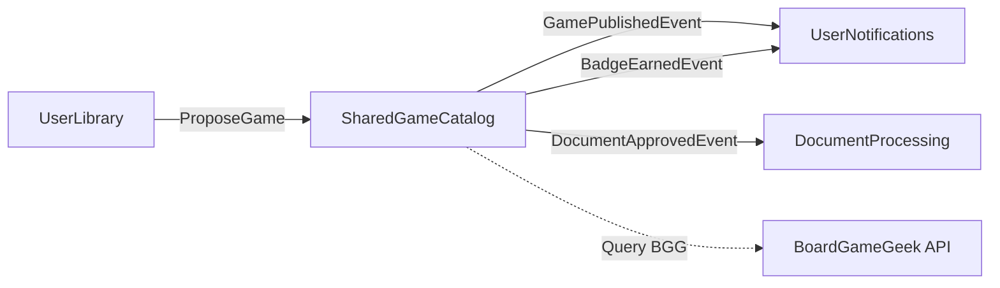

# SharedGameCatalog Bounded Context - Complete API Reference

**Community Game Catalog, Publication Workflow, Approval System, BGG Integration, Soft-Delete**

> 📖 **Complete Documentation**: Part of Issue #3794
> 🏆 **Largest Context**: 69 operations (46 commands + 23 queries), 80+ endpoints, 11 workflow areas

---

## 📋 Responsabilità

- Catalogo community-driven di giochi da tavolo
- Publication workflow (Draft → PendingApproval → Published)
- Admin approval system con review locking
- Soft-delete workflow con audit trail (ADR-019)
- PostgreSQL Full-Text Search (italiano + inglese - ADR-018)
- BoardGameGeek API integration (import, sync, duplicate detection)
- Share request management (users propose private games)
- Document versioning e RAG processing approval
- Game state template generation (Issue #2400)
- FAQ, Errata, Quick Questions management
- Badge system (contributor recognition - Issue #2736)
- Bulk operations (batch approval/rejection)

---

## 🏗️ Domain Model

### Aggregates

**SharedGame** (Aggregate Root):
```csharp
public class SharedGame
{
    public Guid Id { get; private set; }
    public string Title { get; private set; }
    public string Description { get; private set; }
    public int? MinPlayers { get; private set; }
    public int? MaxPlayers { get; private set; }
    public int? PlayingTimeMinutes { get; private set; }
    public string? Publisher { get; private set; }
    public int? YearPublished { get; private set; }
    public int? BggId { get; private set; }
    public string? ImageUrl { get; private set; }
    public PublicationStatus Status { get; private set; } // Draft | PendingApproval | Published | Archived
    public Guid CreatedBy { get; private set; }
    public DateTime CreatedAt { get; private set; }
    public DateTime? PublishedAt { get; private set; }
    public Guid? ApprovedBy { get; private set; }

    // Soft-Delete (ADR-019)
    public bool IsDeleted { get; private set; }
    public DateTime? DeletedAt { get; private set; }
    public string? DeletedBy { get; private set; }

    // Collections
    public IReadOnlyList<GameFaq> Faqs { get; }
    public IReadOnlyList<GameErrata> Errata { get; }
    public IReadOnlyList<QuickQuestion> QuickQuestions { get; }
    public IReadOnlyList<SharedGameDocument> Documents { get; }
    public IReadOnlyList<GameCategory> Categories { get; }
    public IReadOnlyList<GameMechanic> Mechanics { get; }

    // Domain methods
    public void SubmitForApproval() { }
    public void Approve(Guid adminId) { }
    public void Reject(string reason) { }
    public void Archive() { }
    public void SoftDelete(string deletedBy) { }
    public void Restore() { }
    public void AddFaq(string question, string answer, int sortOrder) { }
    public void AddErrata(string title, string description) { }
}
```

**ShareRequest** (Aggregate Root):
```csharp
public class ShareRequest
{
    public Guid Id { get; private set; }
    public Guid UserId { get; private set; }
    public Guid PrivateGameId { get; private set; }
    public ShareRequestStatus Status { get; private set; } // Draft | Submitted | UnderReview | ChangesRequested | Approved | Rejected
    public string GameTitle { get; private set; }
    public string? Description { get; private set; }
    public List<Guid> DocumentIds { get; private set; }
    public DateTime CreatedAt { get; private set; }
    public DateTime? SubmittedAt { get; private set; }
    public Guid? ReviewedBy { get; private set; }
    public DateTime? ReviewedAt { get; private set; }
    public string? ReviewNotes { get; private set; }
    public bool IsReviewLocked { get; private set; }
    public Guid? LockedBy { get; private set; }
    public DateTime? LockExpires { get; private set; }

    // Domain methods
    public void Submit() { }
    public void RequestChanges(string feedback, Guid adminId) { }
    public void Approve(Guid adminId) { }
    public void Reject(string reason, Guid adminId) { }
    public void Withdraw() { }
    public void AcquireReviewLock(Guid adminId, TimeSpan duration) { }
    public void ReleaseReviewLock() { }
}
```

**DeleteRequest** (Aggregate Root - ADR-019):
```csharp
public class DeleteRequest
{
    public Guid Id { get; private set; }
    public Guid SharedGameId { get; private set; }
    public Guid RequestedBy { get; private set; }
    public string Reason { get; private set; }
    public DeleteRequestStatus Status { get; private set; } // Pending | Approved | Rejected
    public DateTime RequestedAt { get; private set; }
    public Guid? ReviewedBy { get; private set; }
    public DateTime? ReviewedAt { get; private set; }
    public string? ReviewNotes { get; private set; }

    // Domain methods
    public void Approve(Guid adminId) { }
    public void Reject(Guid adminId, string notes) { }
}
```

**Badge** (Aggregate Root - Issue #2736):
```csharp
public class Badge
{
    public Guid Id { get; private set; }
    public string Name { get; private set; }
    public string Description { get; private set; }
    public string IconUrl { get; private set; }
    public BadgeType Type { get; private set; }         // Contribution | Milestone | Achievement
    public int RequiredCount { get; private set; }
    public bool IsHidden { get; private set; }
}
```

**UserBadge** (Entity):
```csharp
public class UserBadge
{
    public Guid Id { get; private set; }
    public Guid UserId { get; private set; }
    public Guid BadgeId { get; private set; }
    public DateTime EarnedAt { get; private set; }
    public bool IsDisplayed { get; private set; }

    public void ToggleDisplay() { }
}
```

**GameFaq**, **GameErrata**, **QuickQuestion** (Entities): Similar structure with soft-delete support

---

## 📡 Application Layer (CQRS)

> **Total Operations**: 69 (46 commands + 23 queries)
> **Workflow Areas**: 11 (CRUD, Publication, Deletion, FAQ, Q&A, Documents, Templates, BGG, Requests, Badges, Admin Queue)

---

### PUBLIC GAME DISCOVERY

| Query | HTTP Method | Endpoint | Auth | Query Params | Response |
|-------|-------------|----------|------|--------------|----------|
| `SearchSharedGamesQuery` | GET | `/api/v1/shared-games` | 🟢 Public | `q`, `categories`, `mechanics`, `minPlayers`, `maxPlayers`, `playingTime`, `page`, `pageSize` | `PaginatedList<SharedGameDto>` |
| `GetSharedGameByIdQuery` | GET | `/api/v1/shared-games/{id}` | 🟢 Public | None | `SharedGameDto` |
| `GetGameFaqsQuery` | GET | `/api/v1/games/{gameId}/faqs` | 🟢 Public | `page`, `pageSize` | `PaginatedList<FaqDto>` |
| `GetQuickQuestionsQuery` | GET | `/api/v1/games/{id}/quick-questions` | 🟢 Public | None | `List<QuickQuestionDto>` |
| `GetGameCategoriesQuery` | GET | `/api/v1/shared-games/categories` | 🟢 Public | None | `List<CategoryDto>` |
| `GetGameMechanicsQuery` | GET | `/api/v1/shared-games/mechanics` | 🟢 Public | None | `List<MechanicDto>` |

**SearchSharedGamesQuery** (ADR-018):
- **Purpose**: Full-text search on shared catalog with filtering
- **Search Engine**: PostgreSQL FTS (Italian + English)
- **Query Parameters**:
  - `q`: Search term (searches title, description, rules content)
  - `categories[]`: Filter by categories (comma-separated GUIDs)
  - `mechanics[]`: Filter by mechanics (comma-separated GUIDs)
  - `minPlayers`, `maxPlayers`: Player count range
  - `playingTime`: Max playing time in minutes
  - `page`, `pageSize`: Pagination
- **Response Schema**:
  ```json
  {
    "games": [
      {
        "id": "guid",
        "title": "Azul",
        "description": "Tile placement abstract strategy game",
        "publisher": "Plan B Games",
        "minPlayers": 2,
        "maxPlayers": 4,
        "playingTimeMinutes": 45,
        "categories": ["Abstract", "Family"],
        "mechanics": ["Tile Placement", "Pattern Building"],
        "imageUrl": "https://...",
        "publishedAt": "2026-01-15T00:00:00Z"
      }
    ],
    "pagination": {
      "page": 1,
      "pageSize": 20,
      "totalCount": 342,
      "totalPages": 18
    },
    "filters": {
      "appliedCategories": [...],
      "appliedMechanics": [...]
    }
  }
  ```
- **FTS Index**:
  ```sql
  CREATE INDEX idx_sharedgames_fts ON SharedGames
  USING gin(to_tsvector('italian', Title || ' ' || Description || ' ' || COALESCE(Rules, '')));
  ```

**UpvoteFaqCommand** (Public):
- **Purpose**: Increment FAQ helpfulness counter (anonymous voting allowed)
- **Endpoint**: `POST /api/v1/faqs/{faqId}/upvote`
- **Authorization**: 🟢 Public (no auth required)
- **Response**: `{ upvotes: number }`

---

### ADMIN GAME MANAGEMENT

| Command | HTTP Method | Endpoint | Auth | Request | Response |
|---------|-------------|----------|------|---------|----------|
| `CreateSharedGameCommand` | POST | `/api/v1/admin/shared-games` | Editor+ | `CreateSharedGameDto` | `SharedGameDto` (201) |
| `UpdateSharedGameCommand` | PUT | `/api/v1/admin/shared-games/{id}` | Editor+ | `UpdateSharedGameDto` | `SharedGameDto` |
| `DeleteSharedGameCommand` | DELETE | `/api/v1/admin/shared-games/{id}` | Admin | None | 204 No Content |
| `RequestDeleteSharedGameCommand` | DELETE | `/api/v1/admin/shared-games/{id}` | Editor | None | `DeleteRequestDto` (202 Accepted) |
| `ArchiveSharedGameCommand` | POST | `/api/v1/admin/shared-games/{id}/archive` | Admin | None | `SharedGameDto` |
| `GetAllSharedGamesQuery` | GET | `/api/v1/admin/shared-games` | Editor+ | Query: status?, page, pageSize | `PaginatedList<SharedGameDto>` |

**CreateSharedGameCommand**:
- **Purpose**: Create new game in catalog (starts as Draft)
- **Request Schema**:
  ```json
  {
    "title": "Azul",
    "description": "Tile placement strategy game",
    "publisher": "Plan B Games",
    "yearPublished": 2017,
    "minPlayers": 2,
    "maxPlayers": 4,
    "playingTimeMinutes": 45,
    "categories": ["Abstract", "Family"],
    "mechanics": ["Tile Placement"],
    "bggId": 178900,
    "imageUrl": "https://..."
  }
  ```
- **Side Effects**:
  - Creates SharedGame with Status = Draft
  - If BggId provided: fetches BGG metadata
  - Sets CreatedBy = current user
- **Domain Events**: `SharedGameCreatedEvent`

**DeleteSharedGameCommand vs RequestDeleteSharedGameCommand**:
- **Admin**: Direct soft-delete (sets IsDeleted=true immediately)
- **Editor**: Creates DeleteRequest (awaits admin approval per ADR-019)
- **Soft-Delete Fields**: IsDeleted, DeletedAt, DeletedBy
- **Global Filter**: `modelBuilder.Entity<SharedGame>().HasQueryFilter(g => !g.IsDeleted);`

---

### PUBLICATION WORKFLOW (Issue #2514)

| Command | HTTP Method | Endpoint | Auth | Status Transition | Response |
|---------|-------------|----------|------|-------------------|----------|
| `SubmitSharedGameForApprovalCommand` | POST | `/api/v1/admin/shared-games/{id}/submit-for-approval` | Editor+ | Draft → PendingApproval | `SharedGameDto` |
| `ApproveSharedGamePublicationCommand` | POST | `/api/v1/admin/shared-games/{id}/approve-publication` | Admin | PendingApproval → Published | `SharedGameDto` |
| `RejectSharedGamePublicationCommand` | POST | `/api/v1/admin/shared-games/{id}/reject-publication` | Admin | PendingApproval → Draft | `SharedGameDto` |
| `GetPendingApprovalGamesQuery` | GET | `/api/v1/admin/shared-games/pending-approvals` | Admin | N/A | `PaginatedList<SharedGameDto>` |
| `BatchApproveGamesCommand` | POST | `/api/v1/admin/shared-games/batch-approve` | Admin | Multiple: PendingApproval → Published | `{ successCount, failedCount, errors[] }` |
| `BatchRejectGamesCommand` | POST | `/api/v1/admin/shared-games/batch-reject` | Admin | Multiple: PendingApproval → Draft | `{ successCount, failedCount, errors[] }` |

**Publication Status Flow**:
```
Draft → SubmitForApproval → PendingApproval
                                 ↓
                     ApprovePublication → Published
                                 ↓
                      RejectPublication → Draft (with feedback)

Published → Archive → Archived (still searchable but marked inactive)
```

**ApproveSharedGamePublicationCommand**:
- **Purpose**: Admin approves game for public catalog
- **Side Effects**:
  - Sets Status = Published, PublishedAt = UtcNow, ApprovedBy = AdminId
  - Game becomes visible in public search
  - Raises `GamePublishedEvent` → UserNotifications (notify submitter)
  - Increments submitter's contribution count (badge system)
- **Domain Events**: `GamePublishedEvent`, `ContributionRecordedEvent`

**BatchApproveGamesCommand** (Issue #3350):
- **Request Schema**:
  ```json
  {
    "gameIds": ["guid1", "guid2", "guid3"],
    "approvalNotes": "Batch approved - high quality submissions"
  }
  ```
- **Response Schema**:
  ```json
  {
    "successCount": 2,
    "failedCount": 1,
    "errors": [
      {
        "gameId": "guid3",
        "error": "Game is not in PendingApproval status"
      }
    ]
  }
  ```
- **Behavior**: Partial success allowed (continues on individual failures)

---

### DELETION WORKFLOW (ADR-019)

| Command/Query | HTTP Method | Endpoint | Auth | Purpose |
|---------------|-------------|----------|------|---------|
| `RequestDeleteSharedGameCommand` | DELETE | `/api/v1/admin/shared-games/{id}` | Editor | Create delete request (awaits admin) |
| `GetPendingDeleteRequestsQuery` | GET | `/api/v1/admin/shared-games/pending-deletes` | Admin | List pending delete requests |
| `ApproveDeleteRequestCommand` | POST | `/api/v1/admin/shared-games/approve-delete/{requestId}` | Admin | Approve delete → soft-delete game |
| `RejectDeleteRequestCommand` | POST | `/api/v1/admin/shared-games/reject-delete/{requestId}` | Admin | Reject delete request with reason |

**Soft-Delete Mechanism** (ADR-019):
- **Pattern**: Logical deletion with audit trail
- **Fields**: `IsDeleted`, `DeletedAt`, `DeletedBy`
- **Global Filter**: Soft-deleted games excluded from all queries automatically
  ```csharp
  modelBuilder.Entity<SharedGame>().HasQueryFilter(g => !g.IsDeleted);
  ```
- **Restore Capability**:
  ```csharp
  public void Restore()
  {
      IsDeleted = false;
      DeletedAt = null;
      DeletedBy = null;
  }
  ```
- **Use Cases**: Accidental deletion recovery, audit compliance

---

### FAQ & ERRATA MANAGEMENT

#### FAQ Operations

| Command | HTTP Method | Endpoint | Auth | Request | Response |
|---------|-------------|----------|------|---------|----------|
| `AddGameFaqCommand` | POST | `/api/v1/admin/shared-games/{id}/faq` | Editor+ | `AddFaqDto` | `FaqDto` (201) |
| `UpdateGameFaqCommand` | PUT | `/api/v1/admin/shared-games/{id}/faq/{faqId}` | Editor+ | `UpdateFaqDto` | `FaqDto` |
| `DeleteGameFaqCommand` | DELETE | `/api/v1/admin/shared-games/{id}/faq/{faqId}` | Editor+ | None | 204 No Content |
| `UpvoteFaqCommand` | POST | `/api/v1/faqs/{faqId}/upvote` | 🟢 Public | None | `{ upvotes: number }` |
| `GetGameFaqsQuery` | GET | `/api/v1/games/{gameId}/faqs` | 🟢 Public | Query: page, pageSize | `PaginatedList<FaqDto>` |

**AddGameFaqCommand**:
- **Request Schema**:
  ```json
  {
    "question": "Can I place tiles diagonally?",
    "answer": "No, tiles must be placed horizontally or vertically only.",
    "sortOrder": 1
  }
  ```
- **Side Effects**: FAQ created with Upvotes = 0

**FAQ Sorting** (Issue #2681):
- Default: By upvotes DESC (most helpful first)
- Fallback: By sortOrder ASC (manual ordering)

#### Errata Operations

| Command | HTTP Method | Endpoint | Auth | Request | Response |
|---------|-------------|----------|------|---------|----------|
| `AddGameErrataCommand` | POST | `/api/v1/admin/shared-games/{id}/errata` | Editor+ | `AddErrataDto` | `ErrataDto` (201) |
| `UpdateGameErrataCommand` | PUT | `/api/v1/admin/shared-games/{id}/errata/{errataId}` | Editor+ | `UpdateErrataDto` | `ErrataDto` |
| `DeleteGameErrataCommand` | DELETE | `/api/v1/admin/shared-games/{id}/errata/{errataId}` | Editor+ | None | 204 No Content |

**AddGameErrataCommand**:
- **Request Schema**:
  ```json
  {
    "title": "Setup Phase Clarification",
    "description": "Official ruling: Each player takes 2 tiles, not 3 as printed.",
    "affectedEdition": "First Edition 2017",
    "officialSource": "https://planbgames.com/azul-errata"
  }
  ```

---

### QUICK QUESTIONS (AI + Manual)

| Command/Query | HTTP Method | Endpoint | Auth | Purpose |
|---------------|-------------|----------|------|---------|
| `GenerateQuickQuestionsCommand` | POST | `/api/v1/admin/shared-games/{id}/quick-questions/generate` | Editor+ | AI-generate Q&A from rules |
| `AddManualQuickQuestionCommand` | POST | `/api/v1/admin/shared-games/{id}/quick-questions` | Editor+ | Manually add Q&A with emoji + category |
| `UpdateQuickQuestionCommand` | PUT | `/api/v1/admin/quick-questions/{questionId}` | Editor+ | Update Q&A content |
| `DeleteQuickQuestionCommand` | DELETE | `/api/v1/admin/quick-questions/{questionId}` | Editor+ | Delete Q&A |
| `GetQuickQuestionsQuery` | GET | `/api/v1/games/{id}/quick-questions` | 🟢 Public | Retrieve Q&A pairs |

**GenerateQuickQuestionsCommand**:
- **Purpose**: AI-powered Q&A generation from PDF rulebook
- **Integration**: Calls KnowledgeBase RAG system
- **Prompt**: Extract 10-15 most common beginner questions
- **Response**: Generated questions with confidence scores
- **Manual Review**: Generated Q&A saved as draft, editor reviews before publishing

**AddManualQuickQuestionCommand**:
- **Request Schema**:
  ```json
  {
    "emoji": "🎯",
    "category": "Setup",
    "question": "How many tiles do I start with?",
    "answer": "Each player draws 7 tiles from the bag.",
    "sortOrder": 1
  }
  ```

---

### DOCUMENT MANAGEMENT (Issue #2391)

| Command/Query | HTTP Method | Endpoint | Auth | Purpose |
|---------------|-------------|----------|------|---------|
| `AddDocumentToSharedGameCommand` | POST | `/api/v1/admin/shared-games/{id}/documents` | Editor+ | Upload document version |
| `RemoveDocumentFromSharedGameCommand` | DELETE | `/api/v1/admin/shared-games/{id}/documents/{documentId}` | Editor+ | Remove document |
| `SetActiveDocumentVersionCommand` | POST | `/api/v1/admin/shared-games/{id}/documents/{documentId}/set-active` | Editor+ | Activate document version |
| `ApproveDocumentForRagProcessingCommand` | POST | `/api/v1/admin/shared-games/{id}/documents/{docId}/approve` | Admin | Trigger RAG processing (Issue #3533) |
| `GetDocumentsBySharedGameQuery` | GET | `/api/v1/admin/shared-games/{id}/documents` | Editor+ | List all document versions |
| `GetActiveDocumentsQuery` | GET | `/api/v1/admin/shared-games/{id}/documents/active` | Editor+ | Get active document version |
| `GetActiveRulebookAnalysisQuery` | GET | `/api/v1/admin/shared-games/{id}/rulebook-analysis` | Editor+ | Get AI analysis status (Issue #3533) |

**Document Versioning**:
- Multiple versions allowed per game
- Only 1 active version at a time
- Rollback capability (activate previous version)

**RAG Processing Approval** (Issue #3533):
- **Flow**: Upload document → Admin approves → Triggers DocumentProcessing → RAG indexing
- **Status**: Unreviewed → Approved → ProcessedByAI
- **Purpose**: Quality control before expensive AI processing

---

### GAME STATE TEMPLATES (Issue #2400)

| Command/Query | HTTP Method | Endpoint | Auth | Purpose |
|---------------|-------------|----------|------|---------|
| `GenerateGameStateTemplateCommand` | POST | `/api/v1/admin/shared-games/{id}/state-template/generate` | Editor+ | AI-generate state schema from rules |
| `UpdateGameStateTemplateCommand` | PUT | `/api/v1/admin/shared-games/{id}/state-template/{templateId}` | Editor+ | Update template JSON schema |
| `ActivateGameStateTemplateCommand` | POST | `/api/v1/admin/shared-games/{id}/state-template/{templateId}/activate` | Editor+ | Set as active template |
| `GetActiveGameStateTemplateQuery` | GET | `/api/v1/admin/shared-games/{id}/state-template` | Editor+ | Get active state template |
| `GetGameStateTemplateVersionsQuery` | GET | `/api/v1/admin/shared-games/{id}/state-template/versions` | Editor+ | List template versions |

**GenerateGameStateTemplateCommand**:
- **Purpose**: AI extracts game state schema from rulebook
- **Output Example**:
  ```json
  {
    "templateId": "guid",
    "schema": {
      "board": {
        "type": "object",
        "properties": {
          "tiles": {"type": "array"},
          "factories": {"type": "array"}
        }
      },
      "currentPlayer": {"type": "integer"},
      "round": {"type": "integer"}
    },
    "version": 1
  }
  ```
- **Use Case**: GameManagement sessions use template for state validation

---

### BGG INTEGRATION

| Command/Query | HTTP Method | Endpoint | Auth | Purpose |
|---------------|-------------|----------|------|---------|
| `SearchBggGamesQuery` | GET | `/api/v1/admin/shared-games/bgg/search` | Editor+ | Search BGG API |
| `CheckBggDuplicateQuery` | GET | `/api/v1/admin/shared-games/bgg/check-duplicate/{bggId}` | Editor+ | Check if BGG game exists + diff |
| `ImportGameFromBggCommand` | POST | `/api/v1/admin/shared-games/import-bgg` | Editor+ | Import single game from BGG (creates draft) |
| `UpdateSharedGameFromBggCommand` | PUT | `/api/v1/admin/shared-games/{id}/update-from-bgg` | Editor+ | Update game metadata from BGG |
| `BulkImportGamesCommand` | POST | `/api/v1/admin/shared-games/bulk-import` | Admin | Bulk import via queue job |
| `GetByBggIdQuery` | GET | `/api/v1/admin/shared-games/by-bgg-id/{bggId}` | Editor+ | Find game by BGG ID |

**ImportGameFromBggCommand**:
- **Request Schema**:
  ```json
  {
    "bggId": 178900,
    "importCategories": true,
    "importMechanics": true,
    "importImage": true
  }
  ```
- **Flow**:
  1. Calls BGG XML API
  2. Parses game metadata
  3. Creates SharedGame with Status = Draft
  4. Optionally imports categories, mechanics, image
- **Rate Limiting**: 2 requests/second to BGG API (BGG policy)
- **Response**: Created game DTO

**CheckBggDuplicateQuery**:
- **Purpose**: Prevent importing duplicate games
- **Response Schema**:
  ```json
  {
    "exists": true,
    "gameId": "existing-guid",
    "differences": {
      "title": {"bgg": "Azul", "catalog": "Azul: Stained Glass of Sintra"},
      "yearPublished": {"bgg": 2017, "catalog": 2018}
    }
  }
  ```
- **Use Case**: Before import, check if game already exists

**BulkImportGamesCommand**:
- **Request**: CSV file OR BGG ID list
- **Implementation**: Uses queue job system (Hangfire)
- **Response**: Job ID for tracking progress

---

### SHARE REQUEST WORKFLOW

#### User Side (Submit Games)

| Command/Query | HTTP Method | Endpoint | Auth | Purpose |
|---------------|-------------|----------|------|---------|
| `CreateShareRequestCommand` | POST | `/api/v1/share-requests` | User | Submit private game to catalog |
| `GetUserShareRequestsQuery` | GET | `/api/v1/share-requests` | User | List my share requests |
| `GetShareRequestDetailsQuery` | GET | `/api/v1/share-requests/{id}` | User | Get request details + admin feedback |
| `UpdateShareRequestDocumentsCommand` | PUT | `/api/v1/share-requests/{id}/documents` | User | Update documents after "changes requested" |
| `WithdrawShareRequestCommand` | DELETE | `/api/v1/share-requests/{id}` | User | Withdraw pending request |

**CreateShareRequestCommand**:
- **Purpose**: User proposes private game for shared catalog
- **Request Schema**:
  ```json
  {
    "privateGameId": "guid",
    "gameTitle": "My Custom Variant",
    "description": "House rules variant of Azul",
    "documentIds": ["pdf-guid1", "pdf-guid2"]
  }
  ```
- **Side Effects**:
  - Creates ShareRequest with Status = Submitted
  - Raises `ShareRequestCreatedEvent` → UserNotifications (notify admins)
- **Domain Events**: `ShareRequestCreatedEvent`

---

#### Admin Side (Review & Approve)

| Command/Query | HTTP Method | Endpoint | Auth | Purpose |
|---------------|-------------|----------|------|---------|
| `GetPendingShareRequestsQuery` | GET | `/api/v1/admin/share-requests` | Admin | List pending requests (dashboard) |
| `GetShareRequestDetailsQuery` | GET | `/api/v1/admin/share-requests/{id}` | Admin | Full review details (game, docs, submitter) |
| `ApproveShareRequestCommand` | POST | `/api/v1/admin/share-requests/{id}/approve` | Admin | Approve → create SharedGame |
| `RejectShareRequestCommand` | POST | `/api/v1/admin/share-requests/{id}/reject` | Admin | Reject with reason |
| `RequestShareRequestChangesCommand` | POST | `/api/v1/admin/share-requests/{id}/request-changes` | Admin | Request revisions from submitter |
| Review Lock | POST | `/api/v1/admin/share-requests/{id}/start-review` | Admin | Acquire review lock (prevent concurrent review) |
| Review Release | POST | `/api/v1/admin/share-requests/{id}/release` | Admin | Release lock without decision |
| `GetMyActiveReviewsQuery` | GET | `/api/v1/admin/share-requests/my-reviews` | Admin | My currently locked reviews |
| `BulkApproveShareRequestsCommand` | POST | `/api/v1/editor/share-requests/bulk-approve` | Editor | Batch approve requests (Issue #2893) |
| `BulkRejectShareRequestsCommand` | POST | `/api/v1/editor/share-requests/bulk-reject` | Editor | Batch reject requests |

**Share Request Status Flow**:
```
Draft → Submitted → UnderReview (lock acquired)
                         ↓
              RequestChanges → User revises → Re-submitted
                         ↓
                    Approved → SharedGame created (Published)
                         ↓
                    Rejected (with reason)
```

**Review Lock Mechanism**:
- **Purpose**: Prevent multiple admins reviewing same request simultaneously
- **Duration**: 30 minutes (configurable)
- **Auto-Release**: Lock expires if admin doesn't complete review
- **Conflict**: Returns 409 if another admin holds lock

**ApproveShareRequestCommand**:
- **Side Effects**:
  1. Creates new SharedGame from request data
  2. Sets SharedGame.Status = Published
  3. Transfers documents to SharedGame
  4. Sets ShareRequest.Status = Approved
  5. Awards badge to submitter (if eligible)
  6. Raises `ShareRequestApprovedEvent` → UserNotifications

---

### APPROVAL QUEUE (Issue #3533)

| Query | HTTP Method | Endpoint | Auth | Query Params | Response |
|-------|-------------|----------|------|--------------|----------|
| `GetApprovalQueueQuery` | GET | `/api/v1/admin/shared-games/approval-queue` | Admin | `urgency?`, `submitter?`, `hasPdfs?` | Smart approval queue DTO |

**GetApprovalQueueQuery**:
- **Purpose**: Streamlined admin approval dashboard
- **Features**:
  - Combines pending publication + pending share requests
  - Document status indicators (has PDFs, RAG processed, quality score)
  - Submitter reputation metrics
  - Urgency flags (submission age, document completeness)
- **Response Schema**:
  ```json
  {
    "items": [
      {
        "id": "guid",
        "type": "PublicationApproval",
        "gameTitle": "Azul",
        "submitter": "Alice Editor",
        "submittedAt": "2026-02-01T10:00:00Z",
        "ageInDays": 6,
        "urgency": "High",
        "documentStatus": {
          "hasPdfs": true,
          "pdfCount": 2,
          "ragProcessed": true,
          "qualityScore": 0.92
        },
        "submitterReputation": {
          "totalContributions": 15,
          "approvalRate": 0.87,
          "badges": ["Contributor", "Quality Reviewer"]
        }
      }
    ],
    "filters": {
      "total": 23,
      "urgent": 5,
      "withPdfs": 18,
      "newSubmitters": 3
    }
  }
  ```
- **Filters**:
  - `urgency`: "Low" | "Medium" | "High" (based on age + document completeness)
  - `submitter`: Filter by specific editor
  - `hasPdfs`: Show only submissions with attached PDFs

---

### GAME PROPOSAL WORKFLOW (Issue #3667)

| Command/Query | HTTP Method | Endpoint | Auth | Purpose |
|---------------|-------------|----------|------|---------|
| `ApproveGameProposalCommand` | POST | `/api/v1/admin/share-requests/{id}/approve-game-proposal` | Admin | Approve private game proposal |
| `CheckPrivateGameDuplicatesQuery` | GET | `/api/v1/admin/private-games/{id}/check-duplicates` | Admin | Check if private game is duplicate |

**Flow**: User creates private game → Proposes to catalog → Admin checks duplicates → Approves → Becomes shared game

---

### BADGE SYSTEM (Issue #2736)

| Command/Query | HTTP Method | Endpoint | Auth | Response |
|---------------|-------------|----------|------|----------|
| `GetAllBadgesQuery` | GET | `/api/v1/badges` | 🟢 Public | `List<BadgeDto>` |
| `GetUserBadgesQuery` | GET | `/api/v1/users/{id}/badges` | 🟢 Public | `List<UserBadgeDto>` |
| `GetUserContributionsQuery` | GET | `/api/v1/users/{id}/contributions` | 🟢 Public | `PaginatedList<ContributionDto>` |
| `GetUserContributionStatsQuery` | GET | `/api/v1/users/me/contribution-stats` | User | `ContributionStatsDto` |
| `GetBadgeLeaderboardQuery` | GET | `/api/v1/badges/leaderboard` | 🟢 Public | `List<LeaderboardEntryDto>` |
| `GetGameContributorsQuery` | GET | `/api/v1/shared-games/{id}/contributors` | 🟢 Public | `List<ContributorDto>` |
| `ToggleBadgeDisplayCommand` | PUT | `/api/v1/users/me/badges/{id}/display` | User | `{ isDisplayed: bool }` |
| `RecalculateBadgesCommand` | POST | `/api/v1/admin/badges/recalculate` | Admin | Recalculate badge eligibility |

**Badge Types**:
- **Contribution Badges**: 1st FAQ, 10th FAQ, 100th FAQ, First Game Published, etc.
- **Milestone Badges**: 50 Contributions, 100 Contributions, Quality Contributor (90%+ approval rate)
- **Achievement Badges**: Top Contributor (monthly), BGG Importer (imported 10+ games)

**GetBadgeLeaderboardQuery**:
- **Query Parameters**:
  - `period`: `week` | `month` | `year` | `allTime`
  - `badgeType`: Filter by badge type
  - `page`, `pageSize`: Pagination
- **Response**: Ranked list of users by contribution count or badge count

---

## 🔄 Domain Events

| Event | When Raised | Payload | Subscribers |
|-------|-------------|---------|-------------|
| `SharedGameCreatedEvent` | Game created | `{ GameId, Title, CreatedBy }` | Administration (audit) |
| `GamePublishedEvent` | Game approved | `{ GameId, ApprovedBy }` | UserNotifications (notify submitter), Administration (badge calc) |
| `GameArchivedEvent` | Game archived | `{ GameId, ArchivedBy }` | Administration |
| `ShareRequestCreatedEvent` | User submits | `{ RequestId, UserId, GameTitle }` | UserNotifications (notify admins) |
| `ShareRequestApprovedEvent` | Admin approves | `{ RequestId, UserId, SharedGameId }` | UserNotifications (notify user), Administration (badge) |
| `ShareRequestRejectedEvent` | Admin rejects | `{ RequestId, UserId, Reason }` | UserNotifications (notify user) |
| `ChangesRequestedEvent` | Admin requests revisions | `{ RequestId, Feedback }` | UserNotifications |
| `DeleteRequestCreatedEvent` | Editor requests delete | `{ RequestId, GameId, RequestedBy }` | Administration |
| `GameSoftDeletedEvent` | Game deleted | `{ GameId, DeletedBy }` | KnowledgeBase (cleanup vectors) |
| `DocumentApprovedEvent` | Doc approved for RAG | `{ DocumentId, GameId }` | DocumentProcessing (start extraction) |
| `BadgeEarnedEvent` | Badge awarded | `{ UserId, BadgeId }` | UserNotifications (celebrate achievement) |

---

## 🔗 Integration Points

### Inbound Dependencies

**GameManagement Context**:
- Links private games to shared catalog via SharedGameId
- References shared games for metadata

**UserLibrary Context**:
- Proposes private games via ShareRequest
- References shared games in collections

### Outbound Dependencies

**DocumentProcessing Context**:
- Processes uploaded PDFs for shared games
- RAG indexing for quick questions

**KnowledgeBase Context**:
- RAG queries reference shared game content
- AI generation of Q&A, state templates, rulebook analysis

**BoardGameGeek API** (External):
- Import game metadata
- Sync updates
- Rate limited: 2 req/sec

### Event-Driven Communication



---

## 🔐 Security & Authorization

### Authorization Matrix

| Endpoint Pattern | Anonymous | User | Editor | Admin |
|------------------|-----------|------|--------|-------|
| `GET /shared-games` | ✅ | ✅ | ✅ | ✅ |
| `POST /share-requests` | ❌ | ✅ | ✅ | ✅ |
| `POST /admin/shared-games` | ❌ | ❌ | ✅ | ✅ |
| `POST /admin/shared-games/{id}/approve` | ❌ | ❌ | ❌ | ✅ |
| `DELETE /admin/shared-games/{id}` (direct) | ❌ | ❌ | ❌ | ✅ |
| `DELETE /admin/shared-games/{id}` (request) | ❌ | ❌ | ✅ | ✅ |

### Data Access Policies

- **Published Games**: Public access (searchable by all)
- **Draft Games**: Only creator + admins
- **PendingApproval**: Only admins (approval queue)
- **Soft-Deleted**: Hidden from all queries (global filter)

---

## 🎯 Common Usage Examples

### Example 1: Publication Workflow

**Editor Creates Draft**:
```bash
curl -X POST http://localhost:8080/api/v1/admin/shared-games \
  -H "Content-Type: application/json" \
  -H "Cookie: meepleai_session_dev={editor_token}" \
  -d '{
    "title": "Azul",
    "description": "Tile placement strategy",
    "minPlayers": 2,
    "maxPlayers": 4,
    "bggId": 178900
  }'
```

**Editor Submits for Approval**:
```bash
curl -X POST http://localhost:8080/api/v1/admin/shared-games/game-guid/submit-for-approval \
  -H "Cookie: meepleai_session_dev={editor_token}"
```

**Admin Approves**:
```bash
curl -X POST http://localhost:8080/api/v1/admin/shared-games/game-guid/approve-publication \
  -H "Cookie: meepleai_session_dev={admin_token}"
```

**Result**: Game now visible in public `/api/v1/shared-games` search

---

### Example 2: Share Request Flow

**User Creates Request**:
```bash
curl -X POST http://localhost:8080/api/v1/share-requests \
  -H "Content-Type: application/json" \
  -H "Cookie: meepleai_session_dev={token}" \
  -d '{
    "privateGameId": "guid",
    "gameTitle": "Azul House Rules",
    "description": "Our custom variant",
    "documentIds": ["pdf-guid"]
  }'
```

**Admin Reviews**:
```bash
# Get pending requests
curl -X GET http://localhost:8080/api/v1/admin/share-requests \
  -H "Cookie: meepleai_session_dev={admin_token}"

# Acquire lock
curl -X POST http://localhost:8080/api/v1/admin/share-requests/request-guid/start-review \
  -H "Cookie: meepleai_session_dev={admin_token}"

# Approve
curl -X POST http://localhost:8080/api/v1/admin/share-requests/request-guid/approve \
  -H "Cookie: meepleai_session_dev={admin_token}"
```

**Result**: ShareRequest.Status = Approved, new SharedGame created with Status = Published

---

### Example 3: BGG Import

**Search BGG**:
```bash
curl -X GET "http://localhost:8080/api/v1/admin/shared-games/bgg/search?query=azul" \
  -H "Cookie: meepleai_session_dev={editor_token}"
```

**Check Duplicate**:
```bash
curl -X GET http://localhost:8080/api/v1/admin/shared-games/bgg/check-duplicate/178900 \
  -H "Cookie: meepleai_session_dev={editor_token}"
```

**Import**:
```bash
curl -X POST http://localhost:8080/api/v1/admin/shared-games/import-bgg \
  -H "Content-Type: application/json" \
  -H "Cookie: meepleai_session_dev={editor_token}" \
  -d '{
    "bggId": 178900,
    "importCategories": true,
    "importMechanics": true
  }'
```

---

## 📊 Performance Characteristics

### PostgreSQL FTS (ADR-018)

**Index**:
```sql
CREATE INDEX idx_sharedgames_fts ON SharedGames
USING gin(to_tsvector('italian', Title || ' ' || Description || ' ' || COALESCE(Rules, '')));
```

**Search Performance**:
- Target: <100ms (P95) for catalog search
- Cache: Redis 5 minutes TTL
- Fallback: English FTS if Italian finds no results

### Caching Strategy

| Query | Cache | TTL | Invalidation |
|-------|-------|-----|--------------|
| SearchSharedGamesQuery | Redis | 5 min | GamePublishedEvent, GameUpdatedEvent |
| GetSharedGameByIdQuery | Redis | 30 min | GameUpdatedEvent |
| GetPendingApprovalsQuery | Redis | 1 min | SubmitForApprovalEvent, ApproveEvent |
| GetBadgeLeaderboardQuery | Redis | 1 hour | BadgeEarnedEvent |

---

## 📂 Code Location

`apps/api/src/Api/BoundedContexts/SharedGameCatalog/`

---

## 🔗 Related Documentation

### ADRs
- [ADR-018: PostgreSQL FTS](../../01-architecture/adr/adr-018-postgresql-fts-for-shared-catalog.md)
- [ADR-019: Soft-Delete Workflow](../../01-architecture/adr/adr-019-shared-catalog-delete-workflow.md)
- [ADR-025: SharedGameCatalog Bounded Context](../../01-architecture/adr/adr-025-shared-catalog-bounded-context.md)

### Other Contexts
- [GameManagement](./game-management.md) - Private → Shared linking
- [UserLibrary](./user-library.md) - Share request workflow
- [DocumentProcessing](./document-processing.md) - PDF processing
- [KnowledgeBase](./knowledge-base.md) - RAG indexing

---

**Status**: ✅ Production
**Last Updated**: 2026-02-07
**Total Commands**: 46
**Total Queries**: 23
**Total Endpoints**: 80+
**Workflow Areas**: 11
**Integration Points**: 5 contexts + BGG API
