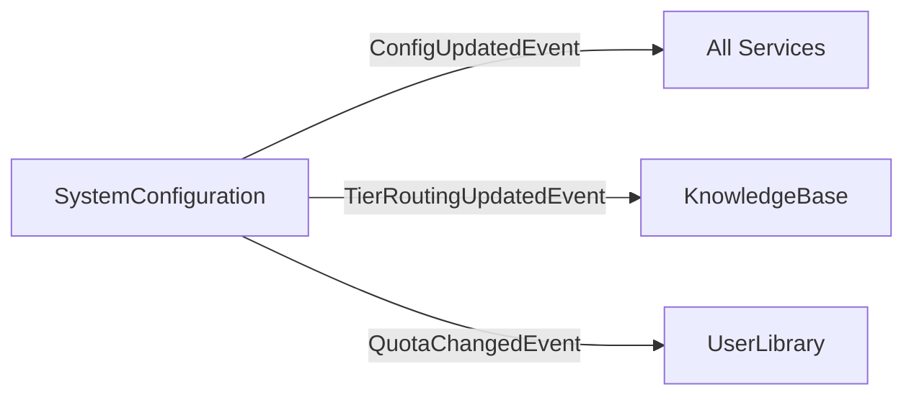

# SystemConfiguration Bounded Context - Complete API Reference

**Runtime Configuration, Feature Flags, AI Model Management, Tier Routing, Quota Limits**

> 📖 **Complete Documentation**: Part of Issue #3794

---

## 📋 Responsabilità

- Runtime configuration management (key-value config store)
- Feature flag system (tier + role-based flags)
- AI model administration (CRUD, priority, tier routing)
- PDF upload limits (global + per-tier quotas)
- Game library limits (per-tier catalog size)
- Session limits (concurrent sessions per tier)
- Rate limit configuration (tier-based + user overrides)
- Configuration versioning (history + rollback)
- Cache invalidation (config change propagation)
- Import/export (environment migration)

---

## 🏗️ Domain Model

### Aggregates

**Configuration** (Aggregate Root):
```csharp
public class Configuration
{
    public Guid Id { get; private set; }
    public string Key { get; private set; }               // "Authentication:SessionExpirationDays"
    public string Value { get; private set; }             // "30"
    public string? Description { get; private set; }
    public string? Category { get; private set; }         // "Authentication", "RAG", etc.
    public bool IsActive { get; private set; }
    public int Version { get; private set; }
    public DateTime CreatedAt { get; private set; }
    public DateTime UpdatedAt { get; private set; }

    // Domain methods
    public void UpdateValue(string newValue) { }
    public void Toggle() { }
}
```

**AiModel** (Aggregate Root - Issues #2567, #2596):
```csharp
public class AiModel
{
    public Guid Id { get; private set; }
    public string Name { get; private set; }              // "GPT-4 Turbo"
    public string ProviderId { get; private set; }        // "openrouter"
    public string ModelId { get; private set; }           // "openai/gpt-4-turbo"
    public int Priority { get; private set; }             // 1 = primary, higher = fallback
    public bool IsActive { get; private set; }
    public int MaxTokens { get; private set; }
    public decimal CostPerMillionTokens { get; private set; }
    public DateTime CreatedAt { get; private set; }

    // Domain methods
    public void SetPriority(int priority) { }
    public void Activate() { }
    public void Deactivate() { }
}
```

**FeatureFlag** (Entity):
```csharp
public class FeatureFlag
{
    public Guid Id { get; private set; }
    public string Key { get; private set; }               // "AgentTypologyPOC"
    public string Description { get; private set; }
    public bool IsEnabled { get; private set; }
    public string? RequiredRole { get; private set; }     // "Admin", "Editor"
    public string? RequiredTier { get; private set; }     // "Premium", "Enterprise"
    public Dictionary<string, bool> TierOverrides { get; private set; } // Per-tier enable/disable

    // Domain methods
    public void Enable() { }
    public void Disable() { }
    public void EnableForTier(string tier) { }
    public void DisableForTier(string tier) { }
}
```

---

## 📡 Application Layer (CQRS)

> **Total Operations**: 57 (33 commands + 24 queries)
> **Categories**: Config, AI Models, Tier Routing, Feature Flags, PDF Limits, Library Limits, Session Limits, Rate Limits

---

### RUNTIME CONFIGURATION

| Command/Query | HTTP Method | Endpoint | Auth | Purpose |
|---------------|-------------|----------|------|---------|
| `GetAllConfigsQuery` | GET | `/api/v1/admin/configurations` | Admin | List configs with pagination + category filter |
| `GetConfigByIdQuery` | GET | `/api/v1/admin/configurations/{id}` | Admin | Single config details |
| `GetConfigByKeyQuery` | GET | `/api/v1/admin/configurations/key/{key}` | Admin | Config by key |
| `GetConfigCategoriesQuery` | GET | `/api/v1/admin/configurations/categories` | Admin | Category list |
| `GetConfigHistoryQuery` | GET | `/api/v1/admin/configurations/{id}/history` | Admin | Version history |
| `ExportConfigsQuery` | GET | `/api/v1/admin/configurations/export` | Admin | Export all configs |
| `CreateConfigurationCommand` | POST | `/api/v1/admin/configurations` | Admin | Create config |
| `UpdateConfigValueCommand` | PUT | `/api/v1/admin/configurations/{id}` | Admin | Update value + increment version |
| `DeleteConfigurationCommand` | DELETE | `/api/v1/admin/configurations/{id}` | Admin | Delete config |
| `ToggleConfigurationCommand` | PATCH | `/api/v1/admin/configurations/{id}/toggle` | Admin | Toggle IsActive |
| `BulkUpdateConfigsCommand` | POST | `/api/v1/admin/configurations/bulk-update` | Admin | Update multiple configs |
| `ValidateConfigCommand` | POST | `/api/v1/admin/configurations/validate` | Admin | Validate config value |
| `ImportConfigsCommand` | POST | `/api/v1/admin/configurations/import` | Admin | Import from JSON/CSV |
| `RollbackConfigCommand` | POST | `/api/v1/admin/configurations/{id}/rollback/{version}` | Admin | Rollback to version |
| `InvalidateCacheCommand` | POST | `/api/v1/admin/configurations/cache/invalidate` | Admin | Invalidate config cache |

**CreateConfigurationCommand**:
- **Request Schema**:
  ```json
  {
    "key": "RAG:DefaultTopK",
    "value": "10",
    "description": "Default number of chunks to retrieve",
    "category": "RAG"
  }
  ```

**BulkUpdateConfigsCommand**:
- **Request Schema**:
  ```json
  {
    "updates": [
      {"key": "RAG:DefaultTopK", "value": "10"},
      {"key": "RAG:MinConfidence", "value": "0.7"}
    ]
  }
  ```
- **Response**: List of updated configs

**RollbackConfigCommand**:
- **Purpose**: Revert to previous version (undo config change)
- **Path**: `/api/v1/admin/configurations/{id}/rollback/{version}`
- **Example**: Rollback to version 3

---

### AI MODEL MANAGEMENT

| Command/Query | HTTP Method | Endpoint | Auth | Purpose |
|---------------|-------------|----------|------|---------|
| `GetAllAiModelsQuery` | GET | `/api/v1/admin/ai-models` | Admin | List models with filters |
| `GetAiModelByIdQuery` | GET | `/api/v1/admin/ai-models/{id}` | Admin | Model details |
| `CreateAiModelCommand` | POST | `/api/v1/admin/ai-models` | Admin | Create model |
| `UpdateAiModelCommand` | PUT | `/api/v1/admin/ai-models/{id}` | Admin | Update model |
| `DeleteAiModelCommand` | DELETE | `/api/v1/admin/ai-models/{id}` | Admin | Delete model |
| `UpdateModelPriorityCommand` | PATCH | `/api/v1/admin/ai-models/{id}/priority` | Admin | Set priority (1-10) |
| `ToggleAiModelActiveCommand` | PATCH | `/api/v1/admin/ai-models/{id}/toggle` | Admin | Toggle active status |

**CreateAiModelCommand** (Issue #2567):
- **Request Schema**:
  ```json
  {
    "name": "GPT-4 Turbo",
    "providerId": "openrouter",
    "modelId": "openai/gpt-4-turbo",
    "priority": 1,
    "isActive": true,
    "maxTokens": 128000,
    "costPerMillionTokens": 10.00
  }
  ```
- **Priority System**:
  - 1 = Primary model (used first)
  - 2-5 = Fallbacks (tried in order if primary fails/unavailable)
  - 10 = Disabled (not used)

**GetAllAiModelsQuery**:
- **Query Parameters**:
  - `provider`: Filter by providerId
  - `isActive`: true | false
  - `minPriority`, `maxPriority`: Priority range
- **Response**: Ordered by priority ASC

---

### TIER ROUTING (Issue #2596)

| Command/Query | HTTP Method | Endpoint | Auth | Purpose |
|---------------|-------------|----------|------|---------|
| `GetTierRoutingQuery` | GET | `/api/v1/admin/tier-routing` | Admin | All tier routing configs |
| `UpdateTierRoutingCommand` | PUT | `/api/v1/admin/tier-routing` | Admin | Configure tier routing |

**UpdateTierRoutingCommand**:
- **Purpose**: Configure which models each tier can use
- **Request Schema**:
  ```json
  {
    "tier": "Premium",
    "productionModels": ["gpt-4", "claude-3-sonnet"],
    "testModels": ["haiku", "gpt-4-mini"],
    "defaultModel": "gpt-4",
    "fallbackModel": "claude-3-sonnet"
  }
  ```
- **Tiers**:
  - Anonymous: Haiku only
  - User (Free): Haiku + GPT-4 Mini
  - Editor: All models
  - Admin: All models + test models
  - Premium: GPT-4 + Claude Sonnet

---

### FEATURE FLAGS (Issue #3073)

| Command/Query | HTTP Method | Endpoint | Auth | Purpose |
|---------------|-------------|----------|------|---------|
| `GetAllFeatureFlagsQuery` | GET | `/api/v1/admin/feature-flags` | Admin | List all flags |
| `IsFeatureEnabledQuery` | GET | `/api/v1/admin/feature-flags/{key}` | Admin | Check flag status |
| `UpdateFeatureFlagCommand` | PUT | `/api/v1/admin/feature-flags/{key}` | Admin | Update flag |
| `ToggleFeatureFlagCommand` | POST | `/api/v1/admin/feature-flags/{key}/toggle` | Admin | Toggle enabled |
| `EnableFeatureForTierCommand` | POST | `/api/v1/admin/feature-flags/{key}/tier/{tier}/enable` | Admin | Enable for specific tier |
| `DisableFeatureForTierCommand` | POST | `/api/v1/admin/feature-flags/{key}/tier/{tier}/disable` | Admin | Disable for specific tier |

**GetAllFeatureFlagsQuery**:
- **Response Schema**:
  ```json
  {
    "featureFlags": [
      {
        "key": "AgentTypologyPOC",
        "description": "Enable AgentTypology POC system",
        "isEnabled": true,
        "requiredRole": "User",
        "requiredTier": null,
        "tierOverrides": {
          "Free": false,
          "Premium": true
        }
      }
    ],
    "totalCount": 23
  }
  ```

**EnableFeatureForTierCommand**:
- **Purpose**: Enable feature for specific tier (e.g., Premium-only features)
- **Path**: `/api/v1/admin/feature-flags/MultiAgentChat/tier/Premium/enable`

---

### PDF UPLOAD LIMITS

| Command/Query | HTTP Method | Endpoint | Auth | Purpose |
|---------------|-------------|----------|------|---------|
| `GetPdfUploadLimitsQuery` | GET | `/api/v1/admin/system/pdf-upload-limits` | Admin | Global PDF limits |
| `UpdatePdfUploadLimitsCommand` | PUT | `/api/v1/admin/system/pdf-upload-limits` | Admin | Update global limits |
| `GetAllPdfLimitsQuery` | GET | `/api/v1/admin/config/pdf-limits` | Admin | Tier-specific limits |
| `UpdatePdfLimitsCommand` | PUT | `/api/v1/admin/config/pdf-limits/{tier}` | Admin | Update tier limits |

**UpdatePdfUploadLimitsCommand** (Issue #3072):
- **Request Schema**:
  ```json
  {
    "maxFileSizeBytes": 104857600,
    "maxPagesPerDocument": 500,
    "maxDocumentsPerGame": 10,
    "allowedMimeTypes": ["application/pdf"]
  }
  ```
- **Global Limits**: Apply to all tiers

**UpdatePdfLimitsCommand** (Issue #3333):
- **Request Schema**:
  ```json
  {
    "tier": "Premium",
    "maxPerDay": 50,
    "maxPerWeek": 200,
    "maxPerGame": 5
  }
  ```
- **Tier-Specific**: Quotas per subscription level

---

### GAME LIBRARY LIMITS (Issue #2444)

| Command/Query | HTTP Method | Endpoint | Auth | Purpose |
|---------------|-------------|----------|------|---------|
| `GetGameLibraryLimitsQuery` | GET | `/api/v1/admin/config/game-library-limits` | Admin | Per-tier game limits |
| `UpdateGameLibraryLimitsCommand` | PUT | `/api/v1/admin/config/game-library-limits` | Admin | Update limits |

**UpdateGameLibraryLimitsCommand**:
- **Request Schema**:
  ```json
  {
    "freeTier": 10,
    "basicTier": 50,
    "premiumTier": 500,
    "enterpriseTier": -1
  }
  ```
- **Value**: -1 = Unlimited

---

### SESSION LIMITS (Issue #3070)

| Command/Query | HTTP Method | Endpoint | Auth | Purpose |
|---------------|-------------|----------|------|---------|
| `GetSessionLimitsQuery` | GET | `/api/v1/admin/system/session-limits` | Admin | Per-tier session quotas |
| `UpdateSessionLimitsCommand` | PUT | `/api/v1/admin/system/session-limits` | Admin | Update limits |
| `GetUserSessionQuotaQuery` | GET | `/api/v1/users/{id}/session-quota` | User/Admin | User's quota status |

**GetUserSessionQuotaQuery**:
- **Authorization**: User can check own quota, Admin can check any user
- **Response Schema**:
  ```json
  {
    "userId": "guid",
    "tier": "Premium",
    "maxConcurrentSessions": 10,
    "currentActiveSessions": 3,
    "remainingSlots": 7
  }
  ```

---

### RATE LIMIT MANAGEMENT (Issue #2738)

| Command/Query | HTTP Method | Endpoint | Auth | Purpose |
|---------------|-------------|----------|------|---------|
| `GetRateLimitConfigQuery` | GET | `/api/v1/admin/config/share-request-limits` | Admin | Tier rate limit configs |
| `UpdateRateLimitConfigCommand` | PUT | `/api/v1/admin/config/share-request-limits/{tier}` | Admin | Update tier limits |
| `GetUserRateLimitStatusQuery` | GET | `/api/v1/admin/users/{id}/rate-limit-status` | Admin | User's current status |
| `GetAllRateLimitOverridesQuery` | GET | `/api/v1/admin/rate-limit-overrides` | Admin | List user overrides |
| `CreateUserRateLimitOverrideCommand` | POST | `/api/v1/admin/users/{id}/rate-limit-override` | Admin | Create override |
| `RemoveUserRateLimitOverrideCommand` | DELETE | `/api/v1/admin/users/{id}/rate-limit-override` | Admin | Remove override |

**UpdateRateLimitConfigCommand**:
- **Request Schema**:
  ```json
  {
    "tier": "Free",
    "maxPendingRequests": 1,
    "maxMonthlySubmissions": 5,
    "cooldownHours": 168
  }
  ```

**CreateUserRateLimitOverrideCommand**:
- **Request Schema**:
  ```json
  {
    "userId": "guid",
    "customLimit": 20,
    "expiresAt": "2026-03-07T00:00:00Z",
    "reason": "Beta tester - increased quota"
  }
  ```
- **Use Case**: Grant specific users higher limits temporarily

---

## 🔄 Domain Events

| Event | When Raised | Subscribers |
|-------|-------------|-------------|
| `ConfigurationUpdatedEvent` | Config value changed | All services (cache invalidation) |
| `FeatureFlagToggledEvent` | Flag enabled/disabled | Frontend (feature availability) |
| `AiModelPriorityChangedEvent` | Model priority updated | KnowledgeBase (LLM selection) |
| `TierRoutingUpdatedEvent` | Tier routing changed | KnowledgeBase, Administration |
| `QuotaLimitChangedEvent` | Any limit updated | Affected services (quota enforcement) |

---

## 🔗 Integration Points

### Inbound Dependencies

**All Contexts**:
- Query configuration values at runtime
- Example: Authentication queries "SessionExpirationDays"

### Outbound Dependencies

**Redis (Cache)**:
- Caches configuration values (1 hour TTL)
- Invalidates on ConfigurationUpdatedEvent

### Event-Driven Communication



---

## 🎯 Common Usage Examples

### Example 1: Update RAG Configuration

```bash
curl -X PUT http://localhost:8080/api/v1/admin/configurations/rag-topk-guid \
  -H "Content-Type: application/json" \
  -H "Cookie: meepleai_session_dev={admin_token}" \
  -d '{
    "value": "15"
  }'
```

**Result**: Next RAG query uses TopK=15

---

### Example 2: Configure Tier Routing

```bash
curl -X PUT http://localhost:8080/api/v1/admin/tier-routing \
  -H "Content-Type: application/json" \
  -H "Cookie: meepleai_session_dev={admin_token}" \
  -d '{
    "tier": "Premium",
    "productionModels": ["gpt-4", "claude-3-sonnet"],
    "defaultModel": "gpt-4"
  }'
```

---

### Example 3: Enable Feature for Premium Users

```bash
curl -X POST http://localhost:8080/api/v1/admin/feature-flags/AdvancedAnalytics/tier/Premium/enable \
  -H "Cookie: meepleai_session_dev={admin_token}"
```

---

## 📊 Performance Characteristics

### Caching

| Query | Cache | TTL | Invalidation |
|-------|-------|-----|--------------|
| Config values | Redis | 1 hour | ConfigurationUpdatedEvent |
| Feature flags | Redis | 30 min | FeatureFlagToggledEvent |
| AI models | Redis | 1 hour | AiModelPriorityChangedEvent |
| Tier routing | Redis | 1 hour | TierRoutingUpdatedEvent |

---

## 📂 Code Location

`apps/api/src/Api/BoundedContexts/SystemConfiguration/`

**Endpoint Files**:
- ConfigurationEndpoints.cs
- AiModelAdminEndpoints.cs
- FeatureFlagEndpoints.cs
- PdfUploadLimitsConfigEndpoints.cs
- AdminConfigEndpoints.cs
- GameLibraryConfigEndpoints.cs
- SessionLimitsConfigEndpoints.cs
- RateLimitAdminEndpoints.cs

---

**Status**: ✅ Production
**Last Updated**: 2026-02-07
**Total Commands**: 33
**Total Queries**: 24
**Total Endpoints**: 43
**Configuration Areas**: 8
