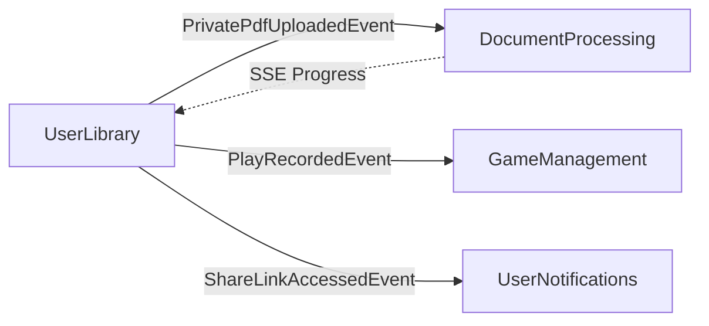

# UserLibrary Bounded Context - Complete API Reference

**Collezioni giochi utente, wishlist, played history, labels, PDF privati, sharing**

> 📖 **Complete Documentation**: Part of Issue #3794

---

## 📋 Responsabilità

- Collezione personale giochi (add/remove/organize)
- Wishlist (giochi desiderati)
- Played history (partite registrate con stats)
- Custom labels e categorizzazione
- PDF privati per giochi (Issue #3489)
- Library sharing (pubblic share links)
- Game state tracking (ownership, condition, loan status)
- Agent configuration per gioco
- Quota enforcement (games per tier)
- Private games (Phase 2 - Issues #3663-#3666)

---

## 🏗️ Domain Model

### Aggregates

**UserLibraryEntry** (Aggregate Root):
```csharp
public class UserLibraryEntry
{
    public Guid Id { get; private set; }
    public Guid UserId { get; private set; }
    public Guid GameId { get; private set; }
    public DateTime AddedAt { get; private set; }
    public int TimesPlayed { get; private set; }
    public DateTime? LastPlayedAt { get; private set; }
    public DateTime? PurchaseDate { get; private set; }
    public decimal? PurchasePrice { get; private set; }
    public string? Condition { get; private set; }         // Mint | Good | Fair | Poor
    public bool IsLoanedOut { get; private set; }
    public string? LoanedToName { get; private set; }
    public DateTime? LoanedUntil { get; private set; }

    // PDF Association (Issue #3489)
    public Guid? PrivatePdfDocumentId { get; private set; }

    // Agent Configuration
    public AgentConfiguration? AgentConfig { get; private set; }

    // Labels
    public IReadOnlyList<Guid> LabelIds { get; }

    // Domain methods
    public void RecordPlay(DateTime? playedAt = null) { }
    public void AssociatePrivatePdf(Guid documentId) { }
    public void RemovePrivatePdf() { }
    public void ConfigureAgent(string modelType, double temperature, string ragStrategy) { }
    public void ResetAgentConfig() { }
    public void LoanTo(string recipientName, DateTime until) { }
    public void ReturnFromLoan() { }
    public void AddLabel(Guid labelId) { }
    public void RemoveLabel(Guid labelId) { }
}
```

**Label** (Aggregate Root - Epic #3511):
```csharp
public class Label
{
    public Guid Id { get; private set; }
    public Guid UserId { get; private set; }
    public string Name { get; private set; }               // "Favorites", "To Learn", etc.
    public string Color { get; private set; }              // Hex color for UI
    public DateTime CreatedAt { get; private set; }
    public bool IsSystem { get; private set; }             // System vs user-created

    // Domain methods
    public static Label CreateSystem(string name, string color) { }
    public static Label CreateCustom(Guid userId, string name, string color) { }
}
```

**LibraryShareLink** (Aggregate Root):
```csharp
public class LibraryShareLink
{
    public Guid Id { get; private set; }
    public Guid UserId { get; private set; }
    public string ShareToken { get; private set; }         // URL-safe token
    public bool IsActive { get; private set; }
    public DateTime? ExpiresAt { get; private set; }
    public int? MaxViews { get; private set; }
    public int ViewCount { get; private set; }
    public DateTime CreatedAt { get; private set; }

    // Domain methods
    public void IncrementViews() { }
    public void Revoke() { }
    public void Extend(DateTime newExpiration) { }
}
```

### Value Objects

**AgentConfiguration** (Issue #3212):
```csharp
public record AgentConfiguration
{
    public string ModelType { get; init; }       // "gpt-4", "claude-3-sonnet", etc.
    public double Temperature { get; init; }     // 0.0-2.0
    public string RagStrategy { get; init; }     // "Fast" | "Balanced" | "Precise"
}
```

---

## 📡 Application Layer (CQRS)

> **Total Operations**: 42 (24 commands + 15 queries + 3 pending implementation)

---

### LIBRARY CORE OPERATIONS

| Command/Query | HTTP Method | Endpoint | Auth | Request | Response |
|---------------|-------------|----------|------|---------|----------|
| `GetUserLibraryQuery` | GET | `/api/v1/library` | Session | Query: page, pageSize, labelIds?, sortBy? | `PaginatedLibraryResponseDto` |
| `GetLibraryStatsQuery` | GET | `/api/v1/library/stats` | Session | None | `UserLibraryStatsDto` |
| `GetLibraryQuotaQuery` | GET | `/api/v1/library/quota` | Session | None | `LibraryQuotaDto` |
| `AddGameToLibraryCommand` | POST | `/api/v1/library/games/{gameId}` | Session | None | `UserLibraryEntryDto` (201) |
| `RemoveGameFromLibraryCommand` | DELETE | `/api/v1/library/games/{gameId}` | Session | None | 204 No Content |
| `UpdateLibraryEntryCommand` | PATCH | `/api/v1/library/games/{gameId}` | Session | `UpdateLibraryEntryDto` | `UserLibraryEntryDto` |
| `GetGameInLibraryStatusQuery` | GET | `/api/v1/library/games/{gameId}/status` | Session | None | `GameInLibraryStatusDto` |

**GetUserLibraryQuery**:
- **Purpose**: Retrieve user's game collection with pagination and filtering
- **Query Parameters**:
  - `page` (default: 1): Page number
  - `pageSize` (default: 20, max: 100): Items per page
  - `labelIds` (optional): Filter by label IDs (comma-separated)
  - `sortBy` (default: addedAt): `addedAt` | `lastPlayed` | `timesPlayed` | `title`
- **Response Schema**:
  ```json
  {
    "entries": [
      {
        "id": "guid",
        "gameId": "guid",
        "gameTitle": "Azul",
        "gameImage": "https://...",
        "addedAt": "2026-01-15T10:00:00Z",
        "timesPlayed": 12,
        "lastPlayedAt": "2026-02-06T19:00:00Z",
        "hasPrivatePdf": true,
        "hasAgentConfig": false,
        "labels": [
          {"id": "guid", "name": "Favorites", "color": "#FF5722"}
        ]
      }
    ],
    "pagination": {
      "page": 1,
      "pageSize": 20,
      "totalCount": 47,
      "totalPages": 3
    }
  }
  ```

**GetLibraryStatsQuery**:
- **Purpose**: Dashboard statistics for user
- **Response Schema**:
  ```json
  {
    "totalGames": 47,
    "totalPlays": 234,
    "avgPlaysPerGame": 4.98,
    "mostPlayedGame": {
      "gameId": "guid",
      "title": "Azul",
      "playCount": 23
    },
    "recentlyAdded": 5,
    "withPrivatePdf": 12,
    "withAgentConfig": 8
  }
  ```

**GetLibraryQuotaQuery** (Tier-Based - Issue #2444):
- **Purpose**: Check quota limits and current usage
- **Response Schema**:
  ```json
  {
    "tier": "Premium",
    "maxGames": 500,
    "currentGames": 47,
    "remainingSlots": 453,
    "isNearLimit": false
  }
  ```
- **Tiers**:
  - Free: 10 games
  - Basic: 50 games
  - Premium: 500 games
  - Enterprise: Unlimited

**AddGameToLibraryCommand**:
- **Purpose**: Add game to user's collection
- **Validation**:
  - Game must exist in catalog
  - Cannot exceed quota limit
  - Cannot add duplicate (409 Conflict)
- **Side Effects**:
  - Creates UserLibraryEntry
  - Increments user's game count
  - Raises `GameAddedToLibraryEvent`
- **Domain Events**: `GameAddedToLibraryEvent`

**UpdateLibraryEntryCommand**:
- **Request Schema**:
  ```json
  {
    "purchaseDate": "2023-05-15",
    "purchasePrice": 39.99,
    "condition": "Mint",
    "isLoanedOut": true,
    "loanedToName": "Bob",
    "loanedUntil": "2026-03-01"
  }
  ```
- **Updatable Fields**: Purchase info, condition, loan status

---

### PDF MANAGEMENT (Issue #3489)

| Command/Query | HTTP Method | Endpoint | Auth | Request | Response |
|---------------|-------------|----------|------|---------|----------|
| `UploadCustomGamePdfCommand` | POST | `/api/v1/library/games/{gameId}/pdf` | Session | Multipart form | `UserLibraryEntryDto` |
| `ResetGamePdfCommand` | DELETE | `/api/v1/library/games/{gameId}/pdf` | Session | None | `UserLibraryEntryDto` |
| `GetGamePdfsQuery` | GET | `/api/v1/library/games/{gameId}/pdfs` | Session | None | `List<GamePdfDto>` |
| `RemovePrivatePdfCommand` | DELETE | `/api/v1/library/entries/{entryId}/private-pdf` | Session | None | `UserLibraryEntryDto` |
| SSE Progress | GET | `/api/v1/library/{entryId}/pdf/progress` | Session | None | SSE Stream |

**UploadCustomGamePdfCommand** (Issue #3489):
- **Purpose**: Upload private PDF rulebook for game
- **Request**: Multipart form with PDF file
- **Validation**:
  - Max file size: 50 MB (configurable)
  - File type: application/pdf only
  - User must own game in library
  - Quota: Max 1 PDF per game per user
- **Flow**:
  1. Upload PDF to storage (S3 or local)
  2. Trigger DocumentProcessing extraction pipeline
  3. Associate document with library entry
  4. SSE progress updates during processing (Issue #3653)
- **Side Effects**:
  - Sets PrivatePdfDocumentId on entry
  - Triggers background PDF processing job
  - Raises `PrivatePdfUploadedEvent`
- **Domain Events**: `PrivatePdfUploadedEvent`

**SSE Progress Stream** (Issue #3653):
- **Purpose**: Real-time PDF processing progress updates
- **Response**: Server-Sent Events
  ```
  event: progress
  data: {"stage":"extraction","percentage":25,"message":"Extracting text..."}

  event: progress
  data: {"stage":"chunking","percentage":75,"message":"Creating chunks..."}

  event: complete
  data: {"success":true,"documentId":"guid","qualityScore":0.92}
  ```
- **Events**: `progress`, `error`, `complete`, `heartbeat` (every 30s)

**GetGamePdfsQuery** (Issue #3152):
- **Purpose**: List available PDFs for game (shared + private)
- **Response Schema**:
  ```json
  {
    "pdfs": [
      {
        "id": "guid",
        "source": "Shared",
        "documentName": "Azul Official Rulebook",
        "pageCount": 16,
        "uploadedAt": "2025-12-01T10:00:00Z"
      },
      {
        "id": "guid",
        "source": "Private",
        "documentName": "Azul House Rules",
        "pageCount": 3,
        "uploadedAt": "2026-02-01T14:30:00Z"
      }
    ]
  }
  ```
- **Sources**: Shared (community) + Private (user-uploaded)

---

### AGENT CONFIGURATION

| Command/Query | HTTP Method | Endpoint | Auth | Request | Response |
|---------------|-------------|----------|------|---------|----------|
| `GetGameAgentConfigQuery` | GET | `/api/v1/library/games/{gameId}/agent-config` | Session | None | `AgentConfigDto` or null |
| `ConfigureGameAgentCommand` | PUT | `/api/v1/library/games/{gameId}/agent` | Session | `ConfigureAgentDto` | `UserLibraryEntryDto` |
| `ResetGameAgentCommand` | DELETE | `/api/v1/library/games/{gameId}/agent` | Session | None | `UserLibraryEntryDto` |
| `SaveAgentConfigCommand` | POST | `/api/v1/library/games/{gameId}/agent-config` | Session | `SaveAgentConfigDto` | `SaveAgentConfigResponse` |

**ConfigureGameAgentCommand** (Issue #3212):
- **Purpose**: Configure AI agent preferences for specific game
- **Request Schema**:
  ```json
  {
    "modelType": "gpt-4",
    "temperature": 0.7,
    "ragStrategy": "Precise"
  }
  ```
- **Use Case**: User wants GPT-4 for Azul but Haiku for simpler games
- **Side Effects**: Stores config in AgentConfig value object on entry
- **Validation**:
  - ModelType: Must be valid LLM model
  - Temperature: 0.0-2.0
  - RagStrategy: Fast | Balanced | Precise | Expert | Consensus

**SaveAgentConfigCommand**:
- **Response Schema**:
  ```json
  {
    "success": true,
    "config": {
      "modelType": "gpt-4",
      "temperature": 0.7,
      "ragStrategy": "Precise"
    }
  }
  ```

---

### LABELS & ORGANIZATION (Epic #3511)

| Command/Query | HTTP Method | Endpoint | Auth | Request | Response |
|---------------|-------------|----------|------|---------|----------|
| `GetLabelsQuery` | GET | `/api/v1/library/labels` | Session | None | `IReadOnlyList<LabelDto>` |
| `GetGameLabelsQuery` | GET | `/api/v1/library/games/{gameId}/labels` | Session | None | `IReadOnlyList<LabelDto>` |
| `AddLabelToGameCommand` | POST | `/api/v1/library/games/{gameId}/labels/{labelId}` | Session | None | bool |
| `RemoveLabelFromGameCommand` | DELETE | `/api/v1/library/games/{gameId}/labels/{labelId}` | Session | None | 204 No Content |
| `CreateCustomLabelCommand` | POST | `/api/v1/library/labels` | Session | `CreateLabelDto` | `LabelDto` (201) |
| `DeleteCustomLabelCommand` | DELETE | `/api/v1/library/labels/{labelId}` | Session | None | 204 No Content |

**CreateCustomLabelCommand**:
- **Purpose**: Create custom label for organization
- **Request Schema**:
  ```json
  {
    "name": "To Learn",
    "color": "#4CAF50"
  }
  ```
- **Validation**:
  - Name: 1-50 chars, unique per user
  - Color: Valid hex color (#RRGGBB)
- **System Labels** (Pre-defined):
  - Favorites (#FF5722)
  - Wishlist (#2196F3)
  - Played (#4CAF50)

**GetLabelsQuery**:
- **Response**: Returns system labels + user's custom labels
- **Ordering**: System first, then custom by creation date

---

### LIBRARY SHARING

| Command/Query | HTTP Method | Endpoint | Auth | Request | Response |
|---------------|-------------|----------|------|---------|----------|
| `CreateLibraryShareLinkCommand` | POST | `/api/v1/library/share` | Session | `CreateShareLinkDto` | `LibraryShareLinkDto` (201) |
| `GetLibraryShareLinkQuery` | GET | `/api/v1/library/share` | Session | None | `LibraryShareLinkDto` or null |
| `UpdateLibraryShareLinkCommand` | PATCH | `/api/v1/library/share/{shareToken}` | Session | `UpdateShareLinkDto` | `LibraryShareLinkDto` |
| `RevokeLibraryShareLinkCommand` | DELETE | `/api/v1/library/share/{shareToken}` | Session | None | 204 No Content |
| `GetSharedLibraryQuery` | GET | `/api/v1/library/shared/{shareToken}` | 🟢 Public | None | `SharedLibraryDto` |

**CreateLibraryShareLinkCommand**:
- **Purpose**: Generate shareable link for library
- **Request Schema**:
  ```json
  {
    "expiresAt": "2026-03-07T00:00:00Z",
    "maxViews": 100
  }
  ```
- **Response Schema**:
  ```json
  {
    "id": "guid",
    "shareToken": "abc123xyz",
    "shareUrl": "https://meepleai.dev/library/shared/abc123xyz",
    "expiresAt": "2026-03-07T00:00:00Z",
    "maxViews": 100,
    "viewCount": 0,
    "isActive": true
  }
  ```
- **Rate Limiting**: 10 share links per day per user
- **Use Case**: Share collection with friends, blog, social media

**GetSharedLibraryQuery**:
- **Purpose**: View someone's shared library (public access)
- **Authorization**: None (if link is valid and active)
- **Response**: Library entries without private data (no purchase prices, loan status, agent configs)

---

### GAME DETAIL & SESSIONS (Epic #2823)

| Command/Query | HTTP Method | Endpoint | Auth | Request | Response |
|---------------|-------------|----------|------|---------|----------|
| `GetGameDetailQuery` | GET | `/api/v1/library/games/{gameId}` | Session | None | `GameDetailDto` |
| `GetGameChecklistQuery` | GET | `/api/v1/library/games/{gameId}/checklist` | 🟢 Public | None | `ChecklistDto` |
| `UpdateGameStateCommand` | PUT | `/api/v1/library/games/{gameId}/state` | Session | `UpdateGameStateDto` | 204 No Content |
| `RecordGameSessionCommand` | POST | `/api/v1/library/games/{gameId}/sessions` | Session | `RecordSessionDto` | `{ sessionId: Guid }` (201) |
| `SendLoanReminderCommand` | POST | `/api/v1/library/games/{gameId}/remind-loan` | Session | None | 204 No Content |

**GetGameDetailQuery** (Epic #2823):
- **Purpose**: Complete game information for detail page
- **Response Schema**:
  ```json
  {
    "game": {
      "id": "guid",
      "title": "Azul",
      "publisher": "Plan B Games",
      "minPlayers": 2,
      "maxPlayers": 4
    },
    "libraryEntry": {
      "addedAt": "2026-01-15",
      "timesPlayed": 12,
      "purchasePrice": 39.99,
      "condition": "Good",
      "isLoanedOut": false
    },
    "pdfs": [...],
    "labels": [...],
    "agentConfig": {...}
  }
  ```

**RecordGameSessionCommand**:
- **Purpose**: Quick-record play session (simpler than GameManagement full session)
- **Request Schema**:
  ```json
  {
    "playedAt": "2026-02-06T19:00:00Z",
    "playerCount": 3,
    "notes": "Great game, Alice won with 87 points"
  }
  ```
- **Side Effects**:
  - Increments TimesPlayed counter
  - Updates LastPlayedAt timestamp
  - Creates simple session record (not full GameManagement session)

**SendLoanReminderCommand**:
- **Purpose**: Send email reminder to person borrowing game
- **Validation**: Game must be marked as IsLoanedOut
- **Side Effects**: Sends email via UserNotifications context
- **Use Case**: "Hey Bob, can I get Azul back for game night Friday?"

---

### PRIVATE GAMES (Phase 2-5 - Issues #3663-#3666) ⚠️ PENDING

| Command/Query | HTTP Method | Endpoint | Auth | Status |
|---------------|-------------|----------|------|--------|
| `AddPrivateGameCommand` | POST | *(Not mapped)* | Session | 🔴 Phase 2 |
| `GetPrivateGameQuery` | GET | *(Not mapped)* | Session | 🔴 Phase 2 |
| `UpdatePrivateGameCommand` | PUT | *(Not mapped)* | Session | 🔴 Phase 2 |
| `DeletePrivateGameCommand` | DELETE | *(Not mapped)* | Session | 🔴 Phase 2 |
| `ProposePrivateGameCommand` | POST | *(Not mapped)* | Session | 🔴 Phase 4 |
| `GetMyProposalsQuery` | GET | *(Not mapped)* | Session | 🔴 Phase 4 |
| `HandleMigrationChoiceCommand` | POST | *(Not mapped)* | Session | 🔴 Phase 5 |
| `GetPendingMigrationsQuery` | GET | *(Not mapped)* | Session | 🔴 Phase 5 |

**Note**: Commands/Queries exist in code but HTTP endpoints NOT yet mapped in routing files.

**Planned Workflow** (Issues #3663-#3666):
1. User creates private game (not in catalog)
2. User proposes to SharedGameCatalog
3. Admin reviews and approves
4. System offers migration: Keep private OR migrate to shared
5. User chooses migration path

---

### ADMIN CONFIGURATION

| Command/Query | HTTP Method | Endpoint | Auth | Request | Response |
|---------------|-------------|----------|------|---------|----------|
| `GetGameLibraryLimitsQuery` | GET | `/api/v1/admin/config/game-library-limits` | Admin | None | `GameLibraryLimitsDto` |
| `UpdateGameLibraryLimitsCommand` | PUT | `/api/v1/admin/config/game-library-limits` | Admin | `UpdateLimitsDto` | `GameLibraryLimitsDto` |

**UpdateGameLibraryLimitsCommand** (Issue #2444):
- **Purpose**: Configure quota limits per tier
- **Request Schema**:
  ```json
  {
    "freeTier": 10,
    "basicTier": 50,
    "premiumTier": 500,
    "enterpriseTier": -1
  }
  ```
- **Authorization**: Admin only
- **Side Effects**: Applies immediately to new library operations

---

## 🔄 Domain Events

| Event | When Raised | Payload | Subscribers |
|-------|-------------|---------|-------------|
| `GameAddedToLibraryEvent` | Game added | `{ UserId, GameId, EntryId }` | Administration (analytics) |
| `GameRemovedFromLibraryEvent` | Game removed | `{ UserId, GameId }` | Administration |
| `PrivatePdfUploadedEvent` | PDF upload started | `{ EntryId, DocumentId }` | DocumentProcessing (start extraction) |
| `PlayRecordedEvent` | Session recorded | `{ UserId, GameId, PlayedAt }` | GameManagement (stats) |
| `LabelCreatedEvent` | Custom label created | `{ UserId, LabelId, Name }` | Administration (audit) |
| `ShareLinkCreatedEvent` | Share link generated | `{ UserId, ShareToken }` | Administration (tracking) |
| `ShareLinkAccessedEvent` | Shared library viewed | `{ ShareToken, ViewCount }` | UserNotifications (notify owner) |

---

## 🔗 Integration Points

### Inbound Dependencies

**GameManagement Context**:
- References games via GameId foreign key
- Uses game metadata (title, image, publisher)

**DocumentProcessing Context**:
- Processes private PDFs uploaded by users
- Returns processing status via SSE

**SharedGameCatalog Context**:
- Private game proposals (Phase 4)
- Migration workflow (Phase 5)

### Outbound Dependencies

**GameManagement Context**:
- Sends PlayRecordedEvent for statistics
- Queries game existence before add

**DocumentProcessing Context**:
- Triggers PDF processing on upload
- Monitors processing progress

**UserNotifications Context**:
- Loan reminders
- Share link access notifications

### Event-Driven Communication



---

## 🔐 Security & Authorization

### Access Control

- **User Isolation**: Users can only access own library entries
- **Admin Override**: Admins can view all libraries (audit purposes)
- **Share Links**: Public access with token validation (expiry + view count limits)
- **Private PDFs**: User-uploaded PDFs only accessible to uploader (not shared)

### Data Privacy

- **Share Link Sanitization**: Shared library excludes:
  - Purchase prices
  - Loan status/recipient
  - Agent configurations
  - Private notes
- **PDF Privacy**: Private PDFs NOT shared even via share link

---

## 🎯 Common Usage Examples

### Example 1: Add Game and Configure Agent

**Add to Library**:
```bash
curl -X POST http://localhost:8080/api/v1/library/games/azul-guid \
  -H "Cookie: meepleai_session_dev={token}"
```

**Configure Agent**:
```bash
curl -X PUT http://localhost:8080/api/v1/library/games/azul-guid/agent \
  -H "Content-Type: application/json" \
  -H "Cookie: meepleai_session_dev={token}" \
  -d '{
    "modelType": "gpt-4",
    "temperature": 0.7,
    "ragStrategy": "Precise"
  }'
```

**Response**:
```json
{
  "id": "entry-guid",
  "gameId": "azul-guid",
  "agentConfig": {
    "modelType": "gpt-4",
    "temperature": 0.7,
    "ragStrategy": "Precise"
  }
}
```

---

### Example 2: Upload Private PDF with Progress

**Upload**:
```bash
curl -X POST http://localhost:8080/api/v1/library/games/azul-guid/pdf \
  -H "Cookie: meepleai_session_dev={token}" \
  -F "file=@azul_house_rules.pdf"
```

**Response**:
```json
{
  "id": "entry-guid",
  "privatePdfDocumentId": "doc-guid"
}
```

**Monitor Progress** (SSE):
```bash
curl -X GET http://localhost:8080/api/v1/library/entry-guid/pdf/progress \
  -H "Cookie: meepleai_session_dev={token}"
```

**SSE Stream**:
```
event: progress
data: {"stage":"extraction","percentage":30}

event: complete
data: {"success":true,"qualityScore":0.92}
```

---

### Example 3: Organize with Labels

**Create Custom Label**:
```bash
curl -X POST http://localhost:8080/api/v1/library/labels \
  -H "Content-Type: application/json" \
  -H "Cookie: meepleai_session_dev={token}" \
  -d '{
    "name": "Party Games",
    "color": "#FF9800"
  }'
```

**Add Label to Game**:
```bash
curl -X POST http://localhost:8080/api/v1/library/games/azul-guid/labels/label-guid \
  -H "Cookie: meepleai_session_dev={token}"
```

**Filter by Label**:
```bash
curl -X GET "http://localhost:8080/api/v1/library?labelIds=label-guid" \
  -H "Cookie: meepleai_session_dev={token}"
```

---

### Example 4: Share Library

**Create Share Link**:
```bash
curl -X POST http://localhost:8080/api/v1/library/share \
  -H "Content-Type: application/json" \
  -H "Cookie: meepleai_session_dev={token}" \
  -d '{
    "expiresAt": "2026-03-07T00:00:00Z",
    "maxViews": 100
  }'
```

**Response**:
```json
{
  "shareToken": "abc123xyz",
  "shareUrl": "https://meepleai.dev/library/shared/abc123xyz",
  "expiresAt": "2026-03-07T00:00:00Z",
  "maxViews": 100
}
```

**Anyone Views Shared Library** (Public):
```bash
curl -X GET http://localhost:8080/api/v1/library/shared/abc123xyz
```

**Response**:
```json
{
  "ownerName": "Alice",
  "totalGames": 47,
  "entries": [
    {
      "gameTitle": "Azul",
      "timesPlayed": 12,
      "addedAt": "2026-01-15"
    }
  ]
}
```

---

## 📊 Performance Characteristics

### Caching

| Query | Cache | TTL | Invalidation |
|-------|-------|-----|--------------|
| GetUserLibraryQuery | Redis | 2 min | GameAddedEvent, GameRemovedEvent, EntryUpdatedEvent |
| GetLibraryStatsQuery | Redis | 5 min | PlayRecordedEvent |
| GetLabelsQuery | Redis | 30 min | LabelCreatedEvent, LabelDeletedEvent |
| GetSharedLibraryQuery | Redis | 10 min | ShareLinkRevokedEvent |

### Database Indexes

```sql
CREATE INDEX idx_library_user_game ON UserLibraryEntries(UserId, GameId) WHERE NOT IsDeleted;
CREATE INDEX idx_library_labels ON UserLibraryEntries_Labels(EntryId, LabelId);
CREATE INDEX idx_library_played ON UserLibraryEntries(UserId, LastPlayedAt DESC NULLS LAST);
CREATE INDEX idx_sharelinks_token ON LibraryShareLinks(ShareToken) WHERE IsActive = TRUE;
```

---

## 📂 Code Location

`apps/api/src/Api/BoundedContexts/UserLibrary/`

---

## 🔗 Related Documentation

- [GameManagement](./game-management.md) - Game catalog source
- [DocumentProcessing](./document-processing.md) - Private PDF processing
- [SharedGameCatalog](./shared-game-catalog.md) - Private game proposals

---

**Status**: ✅ Production (Private Games: 🔴 Phase 2-5 pending)
**Last Updated**: 2026-02-07
**Total Commands**: 24
**Total Queries**: 15
**Endpoints Mapped**: 34 (8 pending implementation)
**Features**: Collection, Labels, PDF, Agent Config, Sharing, Quota
