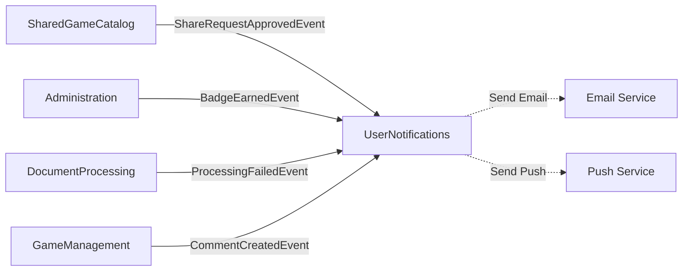

# UserNotifications Bounded Context - Complete API Reference

**Notifiche in-app, email, push notifications, e gestione preferenze**

> 📖 **Complete Documentation**: Part of Issue #3794

---

## 📋 Responsabilità

- Notifiche in-app (sistema badge per frontend)
- Email notifications (security alerts, share requests, achievements)
- Push notifications (future - infrastructure ready)
- Gestione preferenze notifiche utente
- Event-driven notification triggers (cross-context integration)
- Notification severity levels (Info, Success, Warning, Error)
- Admin alerts e digest emails

---

## 🏗️ Domain Model

### Aggregates

**Notification** (Aggregate Root):
```csharp
public class Notification
{
    public Guid Id { get; private set; }
    public Guid UserId { get; private set; }
    public NotificationType Type { get; private set; }   // Value Object (20+ types)
    public NotificationSeverity Severity { get; private set; }
    public string Title { get; private set; }
    public string Message { get; private set; }
    public string? Link { get; private set; }            // Deep link to related resource
    public string? Metadata { get; private set; }        // JSON for custom data
    public bool IsRead { get; private set; }
    public DateTime CreatedAt { get; private set; }
    public DateTime? ReadAt { get; private set; }

    // Domain methods
    public void MarkAsRead() { }
}
```

### Value Objects

**NotificationType** (20+ Types):
```csharp
public record NotificationType
{
    public string Value { get; init; }

    // Document Processing
    public static NotificationType PdfUploadCompleted => new() { Value = "PdfUploadCompleted" };
    public static NotificationType RuleSpecGenerated => new() { Value = "RuleSpecGenerated" };
    public static NotificationType ProcessingFailed => new() { Value = "ProcessingFailed" };

    // Social & Collaboration
    public static NotificationType NewComment => new() { Value = "NewComment" };
    public static NotificationType SharedLinkAccessed => new() { Value = "SharedLinkAccessed" };

    // Share Requests
    public static NotificationType ShareRequestCreated => new() { Value = "ShareRequestCreated" };
    public static NotificationType ShareRequestApproved => new() { Value = "ShareRequestApproved" };
    public static NotificationType ShareRequestRejected => new() { Value = "ShareRequestRejected" };
    public static NotificationType ShareRequestChangesRequested => new() { Value = "ShareRequestChangesRequested" };

    // Admin Alerts
    public static NotificationType AdminNewShareRequest => new() { Value = "AdminNewShareRequest" };
    public static NotificationType AdminStaleShareRequests => new() { Value = "AdminStaleShareRequests" };
    public static NotificationType AdminReviewLockExpiring => new() { Value = "AdminReviewLockExpiring" };

    // Achievements
    public static NotificationType BadgeEarned => new() { Value = "BadgeEarned" };

    // Rate Limiting
    public static NotificationType RateLimitApproaching => new() { Value = "RateLimitApproaching" };
    public static NotificationType RateLimitReached => new() { Value = "RateLimitReached" };
    public static NotificationType CooldownEnded => new() { Value = "CooldownEnded" };

    // Account Management
    public static NotificationType SessionTerminated => new() { Value = "SessionTerminated" };
    public static NotificationType LoanReminder => new() { Value = "LoanReminder" };

    // Game Proposals
    public static NotificationType GameProposalInReview => new() { Value = "GameProposalInReview" };
    public static NotificationType GameProposalKbMerged => new() { Value = "GameProposalKbMerged" };
}
```

**NotificationSeverity**:
```csharp
public enum NotificationSeverity
{
    Info,       // 🔵 Informational (blue)
    Success,    // 🟢 Positive outcome (green)
    Warning,    // 🟡 Requires attention (yellow)
    Error       // 🔴 Critical issue (red)
}
```

---

## 📡 Application Layer (CQRS)

> **Total Operations**: 13 (4 commands + 4 queries + 5 background jobs)
> **Event Handlers**: 11 (responds to cross-context events)

---

### Commands

| Command | HTTP Method | Endpoint | Auth | Request | Response |
|---------|-------------|----------|------|---------|----------|
| `MarkNotificationReadCommand` | PUT | `/api/v1/notifications/{id}/read` | Session | None | 204 No Content |
| `MarkAllNotificationsReadCommand` | PUT | `/api/v1/notifications/read-all` | Session | None | `{ count: number }` |

**MarkNotificationReadCommand**:
- **Purpose**: Mark single notification as read (clear badge)
- **Side Effects**:
  - Sets IsRead = true, ReadAt = UtcNow
  - Decrements unread count (cached in Redis)
- **Authorization**: Can only mark own notifications

**MarkAllNotificationsReadCommand**:
- **Purpose**: Bulk clear all unread notifications
- **Response Schema**:
  ```json
  {
    "count": 15,
    "message": "15 notifications marked as read"
  }
  ```
- **Side Effects**: Updates all user's unread notifications in batch

---

### Queries

| Query | HTTP Method | Endpoint | Auth | Query Params | Response |
|-------|-------------|----------|------|--------------|----------|
| `GetNotificationsQuery` | GET | `/api/v1/notifications` | Session | `page?`, `pageSize?`, `unreadOnly?`, `severity?`, `type?` | `PaginatedList<NotificationDto>` |
| `GetUnreadCountQuery` | GET | `/api/v1/notifications/unread-count` | Session | None | `{ count: number }` |

**GetNotificationsQuery**:
- **Purpose**: Fetch user's notifications with filtering and pagination
- **Query Parameters**:
  - `page` (default: 1): Page number
  - `pageSize` (default: 20, max: 100): Items per page
  - `unreadOnly` (default: false): Filter to unread only
  - `severity` (optional): Filter by Info|Success|Warning|Error
  - `type` (optional): Filter by notification type
- **Response Schema**:
  ```json
  {
    "notifications": [
      {
        "id": "guid",
        "type": "ShareRequestApproved",
        "severity": "Success",
        "title": "Share Request Approved",
        "message": "Your game 'Azul' has been approved for the shared catalog",
        "link": "/games/azul-guid",
        "isRead": false,
        "createdAt": "2026-02-07T10:00:00Z"
      }
    ],
    "pagination": {
      "page": 1,
      "pageSize": 20,
      "totalCount": 45,
      "unreadCount": 8
    }
  }
  ```

**GetUnreadCountQuery**:
- **Purpose**: Badge count for notification bell icon
- **Response**: `{ "count": 8 }`
- **Caching**: Redis cached (1 minute TTL)

---

### Event Handlers (Cross-Context Integration)

| Event Handler | Source Event | Notification Created | Recipients |
|---------------|--------------|----------------------|------------|
| `ShareRequestCreatedNotificationHandler` | SharedGameCatalog: `ShareRequestCreatedEvent` | ShareRequestCreated (Info) | User (requester) |
| `ShareRequestApprovedNotificationHandler` | SharedGameCatalog: `ShareRequestApprovedEvent` | ShareRequestApproved (Success) | User (requester) |
| `ShareRequestRejectedNotificationHandler` | SharedGameCatalog: `ShareRequestRejectedEvent` | ShareRequestRejected (Warning) | User (requester) + reason |
| `ShareRequestChangesRequestedNotificationHandler` | SharedGameCatalog: `ChangesRequestedEvent` | ShareRequestChangesRequested (Warning) | User (requester) + feedback |
| `NewShareRequestAdminAlertHandler` | SharedGameCatalog: `ShareRequestCreatedEvent` | AdminNewShareRequest (Info) | All Admins |
| `BadgeEarnedNotificationHandler` | Administration: `BadgeEarnedEvent` | BadgeEarned (Success) | User (achiever) |
| `MilestoneBadgeNotificationHandler` | Administration: `MilestoneAchievedEvent` | BadgeEarned (Success) | User + milestone details |
| `UserSuspendedEventHandler` | Administration: `UserSuspendedEvent` | SessionTerminated (Error) | Suspended user |
| `UserUnsuspendedEventHandler` | Administration: `UserUnsuspendedEvent` | SessionTerminated (Success) | Restored user |
| `RateLimitApproachingHandler` | Administration: `RateLimitWarningEvent` | RateLimitApproaching (Warning) | User (approaching limit) |
| `RateLimitReachedHandler` | Administration: `RateLimitReachedEvent` | RateLimitReached (Error) | User (limit hit) |

**Pattern**: Event handlers listen to domain events from other contexts and create appropriate notifications.

---

### Background Jobs (Scheduled)

| Job | Schedule | Purpose | Notification Created |
|-----|----------|---------|----------------------|
| `AdminShareRequestDigestJob` | Daily 9:00 AM | Digest email to admins: pending share requests | AdminStaleShareRequests (if >5 days old) |
| `CooldownEndReminderJob` | Every 15 min | Remind users when rate limit cooldown ends | CooldownEnded (Info) |
| `StaleShareRequestWarningJob` | Daily 6:00 PM | Alert admins about aging share requests | AdminStaleShareRequests (Warning) |

**AdminShareRequestDigestJob**:
- **Purpose**: Daily summary email to admins
- **Email Content**:
  ```
  Subject: [MeepleAI Admin] 5 Share Requests Pending Review

  Hi Admin,

  There are 5 share requests awaiting your review:

  1. "Azul" by Alice (5 days old)
  2. "Catan" by Bob (3 days old)
  3. "Wingspan" by Carol (2 days old)

  Review now: https://meepleai.dev/admin/share-requests

  Automated by MeepleAI NotificationSystem
  ```
- **Recipients**: All users with Admin role

---

## 🔗 Integration Points

### Inbound Dependencies (Event Listeners)

**SharedGameCatalog Context**:
- Listens: ShareRequestCreatedEvent, ApprovedEvent, RejectedEvent, ChangesRequestedEvent
- Notifies: Requester + Admins

**Administration Context**:
- Listens: BadgeEarnedEvent, UserSuspendedEvent, RateLimitWarningEvent
- Notifies: Affected users

**DocumentProcessing Context**:
- Listens: PdfUploadCompletedEvent, ProcessingFailedEvent, RuleSpecGeneratedEvent
- Notifies: PDF uploader

**GameManagement Context**:
- Listens: RuleCommentCreatedEvent, GamePublishedEvent
- Notifies: Comment author, game owner

### Outbound Dependencies

**Email Service** (SMTP):
- Sends email notifications for critical events
- Example: Password changed, account suspended, share request approved

**Push Notification Service** (Future):
- Firebase Cloud Messaging (FCM) for mobile
- Web Push API for browser notifications

### Event-Driven Communication



---

## 🔐 Security & Authorization

### Data Access

- **User Isolation**: Users can only access own notifications
- **Admin Override**: Admins can view all notifications (audit purposes)
- **Notification Retention**: 90 days (GDPR compliance, auto-cleanup job)

### Privacy

- **No Sensitive Data**: Notifications contain summaries only, no passwords/tokens
- **Deep Links**: Use resource IDs (not sensitive data in URLs)
- **Metadata**: JSON field for extensibility, sanitized before storage

---

## 🎯 Common Usage Examples

### Example 1: Get Unread Notifications

```bash
curl -X GET "http://localhost:8080/api/v1/notifications?unreadOnly=true" \
  -H "Cookie: meepleai_session_dev={token}"
```

**Response**:
```json
{
  "notifications": [
    {
      "id": "guid",
      "type": "ShareRequestApproved",
      "severity": "Success",
      "title": "Share Request Approved",
      "message": "Your game 'Azul' is now in the shared catalog",
      "link": "/games/azul-guid",
      "isRead": false,
      "createdAt": "2026-02-07T10:00:00Z"
    }
  ],
  "pagination": {
    "totalCount": 8,
    "unreadCount": 8
  }
}
```

### Example 2: Mark All as Read

```bash
curl -X PUT http://localhost:8080/api/v1/notifications/read-all \
  -H "Cookie: meepleai_session_dev={token}"
```

**Response**:
```json
{
  "count": 8,
  "message": "8 notifications marked as read"
}
```

---

## 📊 Performance Characteristics

### Caching

| Query | Cache | TTL | Invalidation |
|-------|-------|-----|--------------|
| GetUnreadCountQuery | Redis | 1 min | NotificationCreatedEvent, MarkAsReadEvent |
| GetNotificationsQuery (recent) | Redis | 30 sec | NotificationCreatedEvent |

### Database Indexes

```sql
CREATE INDEX idx_notifications_user_unread ON Notifications(UserId, IsRead, CreatedAt DESC);
CREATE INDEX idx_notifications_type ON Notifications(Type, CreatedAt DESC);
```

---

## 🔗 Related Documentation

- [SharedGameCatalog](./shared-game-catalog.md) - Share request notifications
- [Administration](./administration.md) - Badge system, rate limiting
- [DocumentProcessing](./document-processing.md) - PDF processing notifications

---

**Status**: ✅ Production
**Last Updated**: 2026-02-07
**Total Commands**: 4
**Total Queries**: 4
**Event Handlers**: 11
**Background Jobs**: 3
**Notification Types**: 20+
