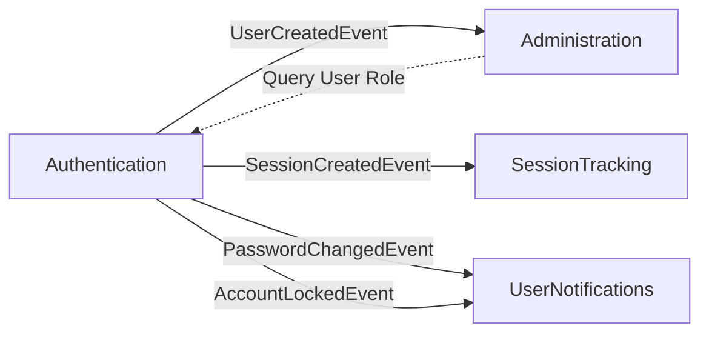

# Authentication Bounded Context - Complete API Reference

**Gestione autenticazione, sessioni, OAuth, 2FA, e API keys**

> 📖 **Reference Implementation**: This document serves as the **complete reference** for Issue #3794.
> Team members should use this as a template for documenting other bounded contexts.

---

## 📋 Responsabilità

- Registrazione e login utenti (email/password)
- Gestione sessioni (cookie-based con sliding expiration)
- OAuth 2.0 (Google, GitHub, Discord)
- Two-Factor Authentication (TOTP con backup codes)
- API Key generation, rotation, e revocation
- Password reset e email verification
- Account lockout e admin management
- Session management multi-device
- User profile e preferences

---

## 🏗️ Domain Model

### Aggregates

**User** (Aggregate Root):
```csharp
public class User
{
    public Guid Id { get; private set; }
    public Email Email { get; private set; }          // Value Object
    public PasswordHash Password { get; private set; } // Value Object
    public string DisplayName { get; private set; }
    public string Role { get; private set; }          // "User" | "Admin"
    public bool EmailConfirmed { get; private set; }
    public bool TwoFactorEnabled { get; private set; }
    public string? TwoFactorSecret { get; private set; }
    public List<string> BackupCodes { get; private set; }
    public List<RefreshToken> RefreshTokens { get; private set; }
    public List<ApiKey> ApiKeys { get; private set; }
    public List<OAuthAccount> OAuthAccounts { get; private set; }
    public DateTime CreatedAt { get; private set; }
    public DateTime? LastLoginAt { get; private set; }
    public bool IsLocked { get; private set; }
    public DateTime? LockedUntil { get; private set; }
    public int FailedLoginAttempts { get; private set; }

    // Domain methods
    public void EnableTwoFactor(string secret, List<string> backupCodes) { }
    public void DisableTwoFactor() { }
    public void ConfirmEmail() { }
    public ApiKey GenerateApiKey(string name, DateTime? expiresAt) { }
    public void RecordLoginSuccess() { }
    public void RecordLoginFailure() { }
    public void LockAccount(TimeSpan duration) { }
    public void UnlockAccount() { }
}
```

**ApiKey** (Entity):
```csharp
public class ApiKey
{
    public Guid Id { get; private set; }
    public Guid UserId { get; private set; }
    public string Key { get; private set; }        // "mpl_{env}_{base64}"
    public string KeyHash { get; private set; }    // PBKDF2 hash
    public string Name { get; private set; }
    public string Scopes { get; private set; }     // Comma-separated
    public DateTime CreatedAt { get; private set; }
    public DateTime? ExpiresAt { get; private set; }
    public DateTime? LastUsedAt { get; private set; }
    public bool IsRevoked { get; private set; }
    public DateTime? RevokedAt { get; private set; }
    public string? Metadata { get; private set; }  // JSON

    public void Revoke() { }
    public void RecordUsage() { }
}
```

**Session** (Entity):
```csharp
public class Session
{
    public Guid Id { get; private set; }
    public Guid UserId { get; private set; }
    public string SessionToken { get; private set; }    // SHA256 hash
    public string? DeviceInfo { get; private set; }
    public string? IpAddress { get; private set; }
    public string? UserAgent { get; private set; }
    public DateTime CreatedAt { get; private set; }
    public DateTime ExpiresAt { get; private set; }
    public DateTime? LastSeenAt { get; private set; }
    public bool IsRevoked { get; private set; }

    public void Extend(TimeSpan duration) { }
    public void Revoke() { }
    public void RecordActivity() { }
}
```

**OAuthAccount** (Entity):
```csharp
public class OAuthAccount
{
    public Guid Id { get; private set; }
    public Guid UserId { get; private set; }
    public string Provider { get; private set; }    // "google" | "github" | "discord"
    public string ProviderUserId { get; private set; }
    public string? Email { get; private set; }
    public DateTime LinkedAt { get; private set; }
}
```

### Value Objects

**Email**:
```csharp
public record Email
{
    public string Value { get; init; }

    public static Email Create(string value)
    {
        // Validation: email format, lowercase normalization
        // Throws: ArgumentException if invalid
    }
}
```

**PasswordHash**:
```csharp
public record PasswordHash
{
    public string Value { get; init; }

    public static PasswordHash Create(string plaintext)
    {
        // PBKDF2 hashing with 210,000 iterations
    }

    public bool Verify(string plaintext) { }
}
```

---

## 📡 Application Layer (CQRS)

> **Note**: This context implements **57 commands and queries** (36 commands + 21 queries).
> All endpoints use `IMediator.Send()` pattern per CQRS architecture.

---

### CORE AUTHENTICATION

#### Registration & Login

| Command/Query | HTTP Method | Endpoint | Auth | Request | Response |
|---------------|-------------|----------|------|---------|----------|
| `RegisterCommand` | POST | `/api/v1/auth/register` | None | `RegisterPayload` | `{ user: UserDto, expiresAt }` |
| `LoginCommand` | POST | `/api/v1/auth/login` | None | `LoginPayload` | `{ user: UserDto, expiresAt }` OR `{ requiresTwoFactor, sessionToken }` |
| `LogoutCommand` | POST | `/api/v1/auth/logout` | Cookie | None | `{ ok: bool }` |
| `LoginWithApiKeyCommand` | POST | `/api/v1/auth/apikey/login` | None | `ApiKeyLoginPayload` | `{ user: UserDto, message }` |
| `LogoutApiKeyCommand` | POST | `/api/v1/auth/apikey/logout` | API Key Cookie | None | `{ ok: bool, message }` |

**RegisterCommand**:
- **Purpose**: Register new user with email/password
- **Request Schema**:
  ```json
  {
    "email": "user@example.com",
    "password": "SecurePass123!",
    "displayName": "John Doe",
    "role": "User"
  }
  ```
- **Response Schema**:
  ```json
  {
    "user": {
      "id": "guid",
      "email": "user@example.com",
      "displayName": "John Doe",
      "role": "User",
      "emailConfirmed": false
    },
    "expiresAt": "2026-03-09T12:00:00Z"
  }
  ```
- **Validation Rules**:
  - Email: Valid format, unique in database
  - Password: Min 8 chars, uppercase, lowercase, digit, special char
  - DisplayName: 2-50 chars, or defaults to email username
  - Role: "User" | "Admin" (defaults to "User")
- **Side Effects**:
  - Creates session cookie (httpOnly, secure, sameSite=Lax)
  - Creates role cookie for client-side routing
  - Sends verification email (if email service configured)
- **Error Codes**:
  - `400`: Validation failed (weak password, invalid email)
  - `409`: Email already exists
- **Domain Events Raised**:
  - `UserCreatedEvent`: When user successfully created
  - `UserRegisteredEvent`: After session creation

**LoginCommand**:
- **Purpose**: Authenticate user with email/password
- **Request Schema**:
  ```json
  {
    "email": "user@example.com",
    "password": "SecurePass123!"
  }
  ```
- **Response Schema (Normal)**:
  ```json
  {
    "user": {
      "id": "guid",
      "email": "user@example.com",
      "role": "User"
    },
    "expiresAt": "2026-03-09T12:00:00Z"
  }
  ```
- **Response Schema (2FA Required)**:
  ```json
  {
    "requiresTwoFactor": true,
    "sessionToken": "temp_token_for_2fa_verification",
    "message": "Two-factor authentication required"
  }
  ```
- **Validation Rules**:
  - Email and password required
  - Account must not be locked
  - Password must match hash
- **Side Effects**:
  - Increments failed login attempts on failure (triggers lockout after 5 failures)
  - Resets failed attempts on success
  - Updates LastLoginAt timestamp
  - Creates session cookie (if 2FA not required)
- **Error Codes**:
  - `400`: Missing email or password
  - `401`: Invalid credentials
  - `403`: Account locked (includes LockedUntil timestamp)
- **Domain Events Raised**:
  - `UserLoggedInEvent`: On successful authentication
  - `LoginFailedEvent`: On invalid credentials (for security monitoring)

---

### SESSION MANAGEMENT

#### Session Lifecycle

| Command/Query | HTTP Method | Endpoint | Auth | Request | Response |
|---------------|-------------|----------|------|---------|----------|
| `CreateSessionCommand` | POST | `/api/v1/auth/sessions` | None | `CreateSessionPayload` | `SessionDto` |
| `GetSessionStatusQuery` | GET | `/api/v1/auth/session/status` | Cookie | None | `SessionStatusResponse` |
| `ExtendSessionCommand` | POST | `/api/v1/auth/session/extend` | Cookie | None | `{ expiresAt }` |
| `GetUserSessionsQuery` | GET | `/api/v1/users/me/sessions` | Cookie | None | `List<SessionDto>` |
| `RevokeSessionCommand` | POST | `/api/v1/auth/sessions/{sessionId}/revoke` | Cookie | None | `{ ok, message }` |
| `LogoutAllDevicesCommand` | POST | `/api/v1/auth/sessions/revoke-all` | Cookie | `LogoutAllDevicesPayload` | `{ ok, revokedCount, currentSessionRevoked, message }` |
| `RevokeAllUserSessionsCommand` | POST | `/api/v1/admin/users/{userId}/sessions/revoke` | Cookie + Admin | Path: userId | `{ ok, revokedCount }` |
| `RevokeInactiveSessionsCommand` | POST | `/api/v1/admin/sessions/cleanup` | Cookie + Admin | Query: inactiveDays? | `{ ok, revokedCount }` |
| `GetAllSessionsQuery` | GET | `/api/v1/admin/sessions` | Cookie + Admin | Query: userId?, isActive?, page, pageSize | `PaginatedList<SessionDto>` |

**GetSessionStatusQuery**:
- **Purpose**: Check current session validity and remaining time
- **Response Schema**:
  ```json
  {
    "expiresAt": "2026-03-09T12:00:00Z",
    "lastSeenAt": "2026-02-07T10:30:00Z",
    "remainingMinutes": 43200
  }
  ```
- **Caching**: Redis cached for 1 minute (reduces DB load)

**ExtendSessionCommand**:
- **Purpose**: Extend session expiration (sliding window authentication)
- **Behavior**: Adds 30 days from current time (configurable via SystemConfiguration)
- **Side Effects**: Updates session cookie with new expiration

**LogoutAllDevicesCommand**:
- **Purpose**: Revoke all user sessions (useful after password change or security incident)
- **Request Schema**:
  ```json
  {
    "includeCurrentSession": false,
    "password": "CurrentPassword123!"
  }
  ```
- **Validation**: Requires password confirmation for security
- **Response Schema**:
  ```json
  {
    "ok": true,
    "revokedCount": 3,
    "currentSessionRevoked": false,
    "message": "3 sessions revoked successfully"
  }
  ```

---

### TWO-FACTOR AUTHENTICATION (TOTP)

| Command/Query | HTTP Method | Endpoint | Auth | Request | Response |
|---------------|-------------|----------|------|---------|----------|
| `GenerateTotpSetupCommand` | POST | `/api/v1/auth/2fa/setup` | Cookie | None | `TotpSetupDto` |
| `Enable2FACommand` | POST | `/api/v1/auth/2fa/enable` | Cookie | `TwoFactorEnableRequest` | `{ Success, BackupCodes, ErrorMessage }` |
| `Verify2FACommand` | POST | `/api/v1/auth/2fa/verify` | None | `TwoFactorVerifyRequest` | `{ message, user }` |
| `Disable2FACommand` | POST | `/api/v1/auth/2fa/disable` | Cookie | `TwoFactorDisableRequest` | `{ message }` |
| `Get2FAStatusQuery` | GET | `/api/v1/users/me/2fa/status` | Cookie | None | `TwoFactorStatusDto` |
| `AdminDisable2FACommand` | POST | `/api/v1/auth/admin/2fa/disable` | Cookie + Admin | `AdminDisable2FARequest` | `{ message }` |

**GenerateTotpSetupCommand**:
- **Purpose**: Generate TOTP secret and QR code for 2FA enrollment
- **Response Schema**:
  ```json
  {
    "qrCode": "data:image/png;base64,iVBORw0KGgoAAAA...",
    "secret": "JBSWY3DPEHPK3PXP",
    "backupCodes": ["12345678", "87654321", ...]
  }
  ```
- **Security**: Secret is NOT stored until Enable2FACommand confirms valid code
- **Backup Codes**: 8 codes generated, 8 digits each, single-use

**Enable2FACommand**:
- **Purpose**: Confirm TOTP setup by verifying initial code
- **Request Schema**:
  ```json
  {
    "code": "123456"
  }
  ```
- **Validation**:
  - Code must be valid for generated secret
  - Code must be 6 digits
  - Rate limited: 3 attempts per minute
- **Side Effects**:
  - Stores TOTP secret encrypted in User entity
  - Stores backup codes hashed (PBKDF2)
  - Sets TwoFactorEnabled = true
- **Domain Events**: `TwoFactorEnabledEvent`

**Verify2FACommand**:
- **Purpose**: Complete login flow when 2FA is required
- **Request Schema**:
  ```json
  {
    "sessionToken": "temp_token_from_login",
    "code": "123456"
  }
  ```
- **Flow**:
  1. Login returns `requiresTwoFactor: true` with temp token
  2. User submits TOTP code with temp token
  3. If valid, temp token exchanged for permanent session
- **Response**: Same as LoginCommand (user + session)
- **Backup Code Support**: If code format is 8 digits, validates against backup codes

**AdminDisable2FACommand**:
- **Purpose**: Admin can disable 2FA for user (e.g., lost device recovery)
- **Request Schema**:
  ```json
  {
    "targetUserId": "guid"
  }
  ```
- **Authorization**: Requires Admin role
- **Audit**: Logs admin action in AuditLog

---

### OAUTH 2.0

| Command/Query | HTTP Method | Endpoint | Auth | Request | Response |
|---------------|-------------|----------|------|---------|----------|
| `InitiateOAuthLoginCommand` | GET | `/api/v1/auth/oauth/{provider}/login` | None | Path: provider | 302 Redirect |
| `HandleOAuthCallbackCommand` | GET | `/api/v1/auth/oauth/{provider}/callback` | None | Query: code, state | 302 Redirect |
| `LinkOAuthAccountCommand` | POST | `/api/v1/auth/oauth/{provider}/link` | Cookie | Path: provider, Query: code, state | `{ ok, message }` |
| `UnlinkOAuthAccountCommand` | DELETE | `/api/v1/auth/oauth/{provider}/unlink` | Cookie | Path: provider | 204 No Content |
| `GetLinkedOAuthAccountsQuery` | GET | `/api/v1/users/me/oauth-accounts` | Cookie | None | `List<OAuthAccountDto>` |

**Supported Providers**:
- `google`: Google OAuth 2.0
- `github`: GitHub OAuth Apps
- `discord`: Discord OAuth 2.0

**InitiateOAuthLoginCommand**:
- **Purpose**: Start OAuth flow by redirecting to provider
- **Flow**:
  1. Generates random state parameter (CSRF protection, 10-min expiry)
  2. Stores state in Redis with IP address
  3. Redirects to provider authorization URL
- **Redirect URL Example**:
  ```
  https://accounts.google.com/o/oauth2/v2/auth?
    client_id={CLIENT_ID}&
    redirect_uri={CALLBACK_URL}&
    response_type=code&
    scope=email+profile&
    state={STATE_TOKEN}
  ```

**HandleOAuthCallbackCommand**:
- **Purpose**: Handle OAuth provider callback and create/login user
- **Flow**:
  1. Validates state parameter (checks Redis, matches IP)
  2. Exchanges code for access token (provider API call)
  3. Fetches user profile from provider
  4. Creates new user OR links existing user (by email matching)
  5. Creates session and redirects to frontend
- **Response**: 302 redirect to frontend
  - Success: `{FRONTEND_URL}/auth/callback?success=true`
  - Error: `{FRONTEND_URL}/auth/callback?error={message}`
- **Security**:
  - State expires in 10 minutes
  - State tied to IP address (prevents replay attacks)
  - Defensive transaction handling (manual rollback on error, Issue #2600)
- **Edge Cases**:
  - Email already exists: Links OAuth account to existing user
  - OAuth account already linked: Returns existing session
  - Provider email mismatch: Rejects linking (security)

**LinkOAuthAccountCommand**:
- **Purpose**: Link OAuth account to existing authenticated user
- **Difference from HandleOAuthCallback**: User must be already logged in
- **Use Case**: Add Google login to existing email/password account

**UnlinkOAuthAccountCommand**:
- **Purpose**: Remove OAuth account linking
- **Validation**: Cannot unlink if it's the only authentication method (must have password OR another OAuth)
- **Error**: 400 "Cannot unlink last authentication method"

---

### PASSWORD MANAGEMENT

| Command/Query | HTTP Method | Endpoint | Auth | Request | Response |
|---------------|-------------|----------|------|---------|----------|
| `ChangePasswordCommand` | PUT | `/api/v1/users/profile/password` | Cookie | `ChangePasswordPayload` | `{ ok, message }` |
| `RequestPasswordResetCommand` | POST | `/api/v1/auth/password-reset/request` | None | `PasswordResetRequestPayload` | `{ ok, message }` |
| `ValidatePasswordResetTokenQuery` | GET | `/api/v1/auth/password-reset/verify` | None | Query: token | `{ ok, message }` |
| `ResetPasswordCommand` | PUT | `/api/v1/auth/password-reset/confirm` | None | `PasswordResetConfirmPayload` | `{ ok, message }` |

**ChangePasswordCommand**:
- **Purpose**: Authenticated user changes own password
- **Request Schema**:
  ```json
  {
    "currentPassword": "OldPass123!",
    "newPassword": "NewPass456!"
  }
  ```
- **Validation**:
  - Current password must match
  - New password must meet strength requirements
  - New password cannot match current password
- **Side Effects**:
  - Invalidates all sessions except current (forces re-login on other devices)
  - Records password change in audit log

**RequestPasswordResetCommand**:
- **Purpose**: Initiate password reset flow for forgotten password
- **Request Schema**:
  ```json
  {
    "email": "user@example.com"
  }
  ```
- **Behavior**:
  - Generates secure reset token (256-bit random, 1-hour expiry)
  - Sends email with reset link
  - Always returns success (prevents user enumeration)
- **Rate Limiting**: 1 request per minute per email
- **Security**: Token single-use, expires in 1 hour

**ResetPasswordCommand**:
- **Purpose**: Complete password reset with token from email
- **Request Schema**:
  ```json
  {
    "token": "base64_token_from_email",
    "newPassword": "NewSecurePass123!"
  }
  ```
- **Validation**:
  - Token must be valid and not expired
  - Token must not have been used
  - New password must meet strength requirements
- **Side Effects**:
  - Marks token as used (prevents replay)
  - Invalidates ALL user sessions (requires re-login everywhere)
  - Records password reset in audit log

---

### EMAIL VERIFICATION

| Command/Query | HTTP Method | Endpoint | Auth | Request | Response |
|---------------|-------------|----------|------|---------|----------|
| `VerifyEmailCommand` | POST | `/api/v1/auth/email/verify` | None | `VerifyEmailPayload` | `{ ok, message }` |
| `ResendVerificationCommand` | POST | `/api/v1/auth/email/resend` | None | `ResendVerificationPayload` | `{ ok, message }` |

**VerifyEmailCommand**:
- **Purpose**: Confirm email ownership via token from verification email
- **Request Schema**:
  ```json
  {
    "token": "base64_token_from_email"
  }
  ```
- **Side Effects**:
  - Sets EmailConfirmed = true
  - Marks verification token as used
- **Domain Events**: `EmailVerifiedEvent`

**ResendVerificationCommand**:
- **Purpose**: Resend verification email if user didn't receive original
- **Rate Limiting**: 1 request per minute per email
- **Security**: Always returns success (prevents user enumeration)

---

### API KEY MANAGEMENT

| Command/Query | HTTP Method | Endpoint | Auth | Request | Response |
|---------------|-------------|----------|------|---------|----------|
| `CreateApiKeyManagementCommand` | POST | `/api/v1/api-keys` | Cookie | `CreateApiKeyRequest` | `{ ApiKey: ApiKeyDto, RawKey: string }` |
| `ListApiKeysQuery` | GET | `/api/v1/api-keys` | Cookie | Query: includeRevoked, page, pageSize | `PaginatedList<ApiKeyDto>` |
| `GetApiKeyQuery` | GET | `/api/v1/api-keys/{keyId}` | Cookie | None | `ApiKeyDto` |
| `UpdateApiKeyManagementCommand` | PUT | `/api/v1/api-keys/{keyId}` | Cookie | `UpdateApiKeyRequest` | `ApiKeyDto` |
| `RevokeApiKeyManagementCommand` | DELETE | `/api/v1/api-keys/{keyId}` | Cookie | None | 204 No Content |
| `RotateApiKeyCommand` | POST | `/api/v1/api-keys/{keyId}/rotate` | Cookie | `RotateApiKeyRequest` | `{ OldApiKey, NewApiKey }` |
| `GetApiKeyUsageQuery` | GET | `/api/v1/api-keys/{keyId}/usage` | Cookie | None | `ApiKeyUsageDto` |
| `GetApiKeyUsageStatsQuery` | GET | `/api/v1/api-keys/{keyId}/stats` | Cookie | None | `ApiKeyUsageStatsDto` |
| `GetApiKeyUsageLogsQuery` | GET | `/api/v1/api-keys/{keyId}/logs` | Cookie | Query: skip, take | `{ logs: List<ApiKeyUsageLogDto>, pagination }` |

**CreateApiKeyManagementCommand**:
- **Purpose**: Generate new API key for programmatic access
- **Request Schema**:
  ```json
  {
    "keyName": "Production API",
    "expiresAt": "2027-02-07T00:00:00Z"
  }
  ```
- **Response Schema**:
  ```json
  {
    "apiKey": {
      "id": "guid",
      "name": "Production API",
      "keyPreview": "mpl_prod_abc...xyz",
      "expiresAt": "2027-02-07T00:00:00Z",
      "createdAt": "2026-02-07T12:00:00Z"
    },
    "rawKey": "mpl_prod_abcdefghijklmnopqrstuvwxyz123456"
  }
  ```
- **Security**:
  - Raw key shown ONLY once (cannot retrieve later)
  - Key hash stored using PBKDF2 (10,000 iterations)
  - Format: `mpl_{env}_{base64}` (32 bytes random)
- **Validation**:
  - Key name: 3-100 chars
  - Expiration: Optional, max 2 years from creation
- **Side Effects**:
  - Creates ApiKeyUsageLog entry
  - Records creation in audit log

**RotateApiKeyCommand**:
- **Purpose**: Generate new key and revoke old one atomically
- **Use Case**: Periodic rotation (recommended every 90 days)
- **Response**: Returns both old (revoked) and new key info
- **Security**: Old key immediately revoked (grace period: 0 seconds)

**GetApiKeyUsageStatsQuery**:
- **Purpose**: Detailed usage analytics for monitoring
- **Response Schema**:
  ```json
  {
    "totalRequests": 15234,
    "lastUsedAt": "2026-02-07T11:30:00Z",
    "status": "Active",
    "dailyUsage": {
      "2026-02-07": 1523,
      "2026-02-06": 1401
    },
    "weeklyUsage": 8432,
    "topEndpoints": [
      { "path": "/api/v1/games", "count": 5234 },
      { "path": "/api/v1/chat", "count": 3421 }
    ],
    "errorRate": 0.02,
    "avgResponseTime": 145
  }
  ```

---

#### Admin API Key Management

| Command/Query | HTTP Method | Endpoint | Auth | Request | Response |
|---------------|-------------|----------|------|---------|----------|
| `DeleteApiKeyCommand` | DELETE | `/api/v1/admin/api-keys/{keyId}` | Cookie + Admin | None | 204 No Content |
| `GetAllApiKeysWithStatsQuery` | GET | `/api/v1/admin/api-keys/stats` | Cookie + Admin | Query: userId?, includeRevoked | `{ keys: List<ApiKeyWithStatsDto>, count, filters }` |
| `BulkExportApiKeysQuery` | GET | `/api/v1/admin/api-keys/bulk/export` | Cookie + Admin | Query: userId?, isActive?, searchTerm? | CSV File |
| `BulkImportApiKeysCommand` | POST | `/api/v1/admin/api-keys/bulk/import` | Cookie + Admin | CSV content (raw text) | `{ SuccessCount, FailedCount, Errors }` |

**BulkExportApiKeysQuery**:
- **Purpose**: Export API keys to CSV for backup or audit
- **Response**: CSV file with headers
  ```csv
  UserId,KeyName,KeyPreview,CreatedAt,ExpiresAt,IsRevoked,TotalRequests
  guid,Production API,mpl_prod_abc...xyz,2026-01-15,2027-01-15,false,15234
  ```
- **Use Case**: Compliance audits, backup, migration

**BulkImportApiKeysCommand**:
- **Purpose**: Import API keys from CSV (e.g., migration, restore)
- **Validation**: Validates each row, reports errors
- **Response**: Success count + error details for failed rows
- **Security**: Requires Admin role + password confirmation

---

### USER PROFILE & PREFERENCES

| Command/Query | HTTP Method | Endpoint | Auth | Request | Response |
|---------------|-------------|----------|------|---------|----------|
| `GetUserProfileQuery` | GET | `/api/v1/users/profile` | Cookie | None | `UserProfileDto` |
| `UpdateUserProfileCommand` | PUT | `/api/v1/users/profile` | Cookie | `UpdateProfilePayload` | `{ ok, message }` |
| `UpdatePreferencesCommand` | PUT | `/api/v1/users/preferences` | Cookie | `UpdatePreferencesPayload` | `UserProfileDto` |
| `GetUserDevicesQuery` | GET | `/api/v1/users/me/devices` | Cookie | None | `List<DeviceDto>` |
| `GetUserByIdQuery` | GET | `/api/v1/users/{userId}` | Cookie | None | `UserDto` |
| `GetUserUploadQuotaQuery` | GET | `/api/v1/users/me/upload-quota` | Cookie | None | `PdfUploadQuotaInfo` |
| `GetUserActivityQuery` | GET | `/api/v1/users/me/activity` | Cookie | Query: filters | `GetUserActivityResult` |
| `GetUserDetailedAiUsageQuery` | GET | `/api/v1/users/me/ai-usage` | Cookie | Query: days? | `UserAiUsageDto` |
| `GetUserAvailableFeaturesQuery` | GET | `/api/v1/users/me/features` | Cookie | None | `List<UserFeatureDto>` |

**UpdatePreferencesCommand**:
- **Purpose**: Update user UI/UX preferences
- **Request Schema**:
  ```json
  {
    "language": "it",
    "theme": "dark",
    "emailNotifications": true,
    "dataRetentionDays": 90
  }
  ```
- **Supported Options**:
  - Language: "it" | "en"
  - Theme: "light" | "dark" | "auto"
  - DataRetentionDays: 30-365 (GDPR compliance)
- **Side Effects**: Updates UserPreferences entity

**GetUserDetailedAiUsageQuery**:
- **Purpose**: AI token usage and cost breakdown for user
- **Response Schema**:
  ```json
  {
    "totalTokens": 1250000,
    "totalCostUsd": 15.50,
    "byModel": {
      "gpt-4": { "tokens": 800000, "cost": 12.00 },
      "claude-3": { "tokens": 450000, "cost": 3.50 }
    },
    "byOperationType": {
      "rag_query": { "tokens": 600000, "cost": 7.20 },
      "agent_invoke": { "tokens": 650000, "cost": 8.30 }
    },
    "dailyTimeSeries": [
      { "date": "2026-02-07", "tokens": 15000, "cost": 0.18 },
      { "date": "2026-02-06", "tokens": 12000, "cost": 0.14 }
    ]
  }
  ```
- **Query Parameters**:
  - `days`: Time window (default: 30, max: 365)

---

### ACCOUNT LOCKOUT & ADMIN

| Command/Query | HTTP Method | Endpoint | Auth | Request | Response |
|---------------|-------------|----------|------|---------|----------|
| `GetAccountLockoutStatusQuery` | GET | `/api/v1/users/me/lockout-status` | Cookie | None | `AccountLockoutDto` |
| `UnlockAccountCommand` | POST | `/api/v1/auth/admin/unlock-account` | Cookie + Admin | `UnlockAccountRequest` | `{ ok, message }` |

**Account Lockout Logic**:
- **Trigger**: 5 failed login attempts within 15 minutes
- **Duration**: 15 minutes lockout
- **Reset**: Automatic after lockout expires OR admin unlock
- **Notification**: Email sent to user when locked

**UnlockAccountCommand**:
- **Purpose**: Admin manually unlocks user account
- **Use Case**: User locked out but needs immediate access
- **Audit**: Logs admin action with reason

---

### SHARE LINKS (Document Sharing)

| Command/Query | HTTP Method | Endpoint | Auth | Request | Response |
|---------------|-------------|----------|------|---------|----------|
| `CreateShareLinkCommand` | POST | `/api/v1/share-links` | Cookie | `CreateShareLinkPayload` | `ShareLinkDto` |
| `ValidateShareLinkQuery` | GET | `/api/v1/share-links/{token}/validate` | None | None | `{ ok, document }` |
| `RevokeShareLinkCommand` | DELETE | `/api/v1/share-links/{linkId}` | Cookie | None | 204 No Content |

**CreateShareLinkCommand**:
- **Purpose**: Generate shareable link for PDF document
- **Request Schema**:
  ```json
  {
    "documentId": "guid",
    "expiresAt": "2026-03-07T00:00:00Z",
    "maxUses": 10
  }
  ```
- **Response**: Shareable token that grants temporary access
- **Security**:
  - Token expires after time OR usage limit
  - Cannot access other user's documents
  - Read-only access via share link

---

## 🔄 Domain Events

| Event | When Raised | Payload | Subscribers |
|-------|-------------|---------|-------------|
| `UserCreatedEvent` | After successful registration | `{ UserId, Email, Role }` | Administration (audit), UserLibrary (init) |
| `UserLoggedInEvent` | After successful login | `{ UserId, IpAddress, SessionId }` | Administration (audit), SessionTracking |
| `TwoFactorEnabledEvent` | After 2FA setup complete | `{ UserId }` | Administration (security audit) |
| `TwoFactorDisabledEvent` | After 2FA disabled | `{ UserId, DisabledBy }` | Administration (security audit) |
| `PasswordChangedEvent` | After password change | `{ UserId }` | Administration (audit), UserNotifications (email) |
| `PasswordResetEvent` | After password reset | `{ UserId }` | Administration (audit), UserNotifications (email) |
| `ApiKeyCreatedEvent` | After API key generation | `{ UserId, KeyId, KeyName }` | Administration (audit) |
| `ApiKeyRevokedEvent` | After API key revocation | `{ UserId, KeyId }` | Administration (audit) |
| `SessionCreatedEvent` | After session creation | `{ UserId, SessionId, IpAddress }` | SessionTracking |
| `SessionRevokedEvent` | After session revocation | `{ UserId, SessionId, RevokedBy }` | SessionTracking |
| `OAuthAccountLinkedEvent` | After OAuth account linked | `{ UserId, Provider }` | Administration (audit) |
| `OAuthAccountUnlinkedEvent` | After OAuth unlink | `{ UserId, Provider }` | Administration (audit) |
| `EmailVerifiedEvent` | After email verification | `{ UserId, Email }` | Administration (audit) |
| `AccountLockedEvent` | After account lockout | `{ UserId, LockedUntil, Reason }` | Administration (security), UserNotifications (email) |
| `AccountUnlockedEvent` | After admin unlock | `{ UserId, UnlockedBy }` | Administration (audit) |

---

## 🔗 Integration Points

### Inbound Dependencies

**Administration Context**:
- Subscribes to all authentication events for audit logging
- Queries user role/permissions for admin operations
- Example: `UserCreatedEvent` → Create audit log entry

**SessionTracking Context**:
- Tracks active sessions for analytics
- Monitors session lifecycle events
- Example: `SessionCreatedEvent` → Record in session tracking table

**UserLibrary Context**:
- Requires authenticated user context
- Uses UserId from session for collection operations

**UserNotifications Context**:
- Sends emails on security events (password change, account locked)
- Example: `PasswordChangedEvent` → Send security notification email

### Outbound Dependencies

**None** - Authentication is a foundational context with no outbound dependencies (other contexts depend on it).

### Event-Driven Communication



---

## 🔐 Security & Authorization

### Authentication Methods

| Method | Header/Cookie | Format | Use Case |
|--------|---------------|--------|----------|
| **Session Cookie** | Cookie: `meepleai_session_{env}` | JWT-like token, httpOnly | Web application |
| **API Key Cookie** | Cookie: `meepleai_apikey_{env}` | API key value, httpOnly | CLI/scripts via web login |
| **API Key Header** | Header: `Authorization: ApiKey {key}` | `mpl_{env}_{base64}` | Programmatic access |

### Authorization Levels

| Level | Requirements | Endpoints |
|-------|--------------|-----------|
| **Public** | None | Registration, login, OAuth, password reset, email verify |
| **Authenticated** | Valid session OR API key | Profile, preferences, API key CRUD, 2FA, sessions |
| **Admin** | Cookie + Admin role | User management, bulk operations, unlock accounts |

### Password Security

**Hashing Algorithm**: PBKDF2
- **Iterations**: 210,000 (OWASP 2023 recommendation)
- **Salt**: Per-password random salt (128-bit)
- **Key Size**: 256-bit derived key

**Strength Requirements**:
- Minimum 8 characters
- At least 1 uppercase letter
- At least 1 lowercase letter
- At least 1 digit
- At least 1 special character

**Validation**: `PasswordStrengthValidator` in FluentValidation

### API Key Security

**Generation**:
- 256-bit random bytes via `RandomNumberGenerator.GetBytes(32)`
- Base64-encoded with URL-safe alphabet
- Format: `mpl_{environment}_{base64_token}`

**Storage**:
- Raw key: Shown once, never stored
- Key hash: PBKDF2 with 10,000 iterations + unique salt

**Scopes** (Future): Currently not enforced, placeholder for role-based API access

### Session Security

**Cookie Configuration**:
```csharp
// Cookie settings
HttpOnly = true,           // Prevents XSS attacks
Secure = true,             // HTTPS only
SameSite = SameSiteMode.Lax,  // CSRF protection
Path = "/",
MaxAge = TimeSpan.FromDays(30),
IsEssential = true
```

**Token Format**:
- 256-bit random token
- Stored hashed (SHA256) in database
- Redis-backed for distributed systems

**Expiration**:
- Default: 30 days sliding window
- Configurable: `Authentication:SessionManagement:SessionExpirationDays`
- Activity extends expiration automatically

### Rate Limiting

| Endpoint Pattern | Limit | Window | Enforcement |
|------------------|-------|--------|-------------|
| `/auth/login` | 5 attempts | 5 minutes | Per IP + Email |
| `/auth/2fa/verify` | 3 attempts | 1 minute | Per session token |
| `/auth/oauth/*` | 10 requests | 1 minute | Per IP |
| `/auth/email/resend` | 1 request | 1 minute | Per email |
| `/auth/password-reset/request` | 1 request | 1 minute | Per email |

**Implementation**: In-memory sliding window + Redis for distributed enforcement

---

## 🎯 Common Usage Examples

### Example 1: Standard Email/Password Registration

**Scenario**: New user registers with email and password

**API Call**:
```bash
curl -X POST http://localhost:8080/api/v1/auth/register \
  -H "Content-Type: application/json" \
  -d '{
    "email": "alice@example.com",
    "password": "SecurePass123!",
    "displayName": "Alice Johnson"
  }'
```

**Response**:
```json
{
  "user": {
    "id": "123e4567-e89b-12d3-a456-426614174000",
    "email": "alice@example.com",
    "displayName": "Alice Johnson",
    "role": "User",
    "emailConfirmed": false,
    "twoFactorEnabled": false
  },
  "expiresAt": "2026-03-09T12:00:00Z"
}
```

**Side Effects**:
- Session cookie created automatically
- Verification email sent (if configured)
- User can immediately use app (emailConfirmed not required for basic access)

---

### Example 2: Login with 2FA Enabled

**Step 1: Initial Login**
```bash
curl -X POST http://localhost:8080/api/v1/auth/login \
  -H "Content-Type: application/json" \
  -d '{
    "email": "bob@example.com",
    "password": "SecurePass456!"
  }'
```

**Response**:
```json
{
  "requiresTwoFactor": true,
  "sessionToken": "temp_abc123...",
  "message": "Two-factor authentication required"
}
```

**Step 2: Submit TOTP Code**
```bash
curl -X POST http://localhost:8080/api/v1/auth/2fa/verify \
  -H "Content-Type: application/json" \
  -d '{
    "sessionToken": "temp_abc123...",
    "code": "123456"
  }'
```

**Response**:
```json
{
  "message": "Authentication successful",
  "user": {
    "id": "guid",
    "email": "bob@example.com",
    "twoFactorEnabled": true
  }
}
```

**Side Effects**:
- Temp token invalidated
- Permanent session cookie created
- LastLoginAt updated

---

### Example 3: API Key Authentication

**Step 1: Generate API Key**
```bash
curl -X POST http://localhost:8080/api/v1/api-keys \
  -H "Content-Type: application/json" \
  -H "Cookie: meepleai_session_dev={session_token}" \
  -d '{
    "keyName": "Production API",
    "expiresAt": "2027-02-07T00:00:00Z"
  }'
```

**Response**:
```json
{
  "apiKey": {
    "id": "guid",
    "name": "Production API",
    "keyPreview": "mpl_prod_abc...xyz",
    "expiresAt": "2027-02-07T00:00:00Z"
  },
  "rawKey": "mpl_prod_abcdefghijklmnopqrstuvwxyz123456"
}
```

⚠️ **Important**: Save `rawKey` immediately - it's shown only once!

**Step 2: Use API Key for Requests**
```bash
# Option A: Authorization Header (recommended)
curl -X GET http://localhost:8080/api/v1/games \
  -H "Authorization: ApiKey mpl_prod_abcdefghijklmnopqrstuvwxyz123456"

# Option B: Login to get API key cookie
curl -X POST http://localhost:8080/api/v1/auth/apikey/login \
  -H "Content-Type: application/json" \
  -d '{
    "apiKey": "mpl_prod_abcdefghijklmnopqrstuvwxyz123456"
  }'
# Returns session-like cookie for subsequent requests
```

---

### Example 4: OAuth Login (Google)

**Step 1: Initiate OAuth Flow**
```bash
# User clicks "Login with Google" button
# Frontend redirects to:
GET http://localhost:8080/api/v1/auth/oauth/google/login

# API redirects to Google with state parameter
```

**Step 2: Google Callback** (Automatic)
```
# After user approves, Google redirects to:
GET http://localhost:8080/api/v1/auth/oauth/google/callback?code={auth_code}&state={state_token}

# API validates, creates/links account, redirects to frontend:
302 Redirect → https://meepleai.dev/auth/callback?success=true
```

**Step 3: Frontend Handling**
- Frontend receives redirect with success=true
- Session cookie already set by backend
- User is authenticated, redirect to dashboard

---

### Example 5: Password Reset Flow

**Step 1: Request Reset**
```bash
curl -X POST http://localhost:8080/api/v1/auth/password-reset/request \
  -H "Content-Type: application/json" \
  -d '{
    "email": "user@example.com"
  }'
```

**Response**:
```json
{
  "ok": true,
  "message": "If the email exists, a reset link has been sent"
}
```

**Step 2: User Clicks Email Link**
```
# Email contains link:
https://meepleai.dev/reset-password?token=base64_token_here

# Frontend validates token:
GET /api/v1/auth/password-reset/verify?token={token}
```

**Step 3: Submit New Password**
```bash
curl -X PUT http://localhost:8080/api/v1/auth/password-reset/confirm \
  -H "Content-Type: application/json" \
  -d '{
    "token": "base64_token_here",
    "newPassword": "NewSecurePass789!"
  }'
```

**Response**:
```json
{
  "ok": true,
  "message": "Password reset successfully. Please login with your new password."
}
```

**Side Effects**:
- All sessions invalidated (user must login again)
- Audit log entry created
- Notification email sent

---

## 📊 Performance Characteristics

### Caching Strategy

| Operation | Cache Layer | TTL | Invalidation Trigger |
|-----------|-------------|-----|---------------------|
| `GetUserByIdQuery` | Redis | 5 minutes | UserUpdatedEvent, PasswordChangedEvent |
| `GetSessionStatusQuery` | Redis | 1 minute | SessionExtendedEvent, SessionRevokedEvent |
| `ValidateApiKeyQuery` | Redis | 10 minutes | ApiKeyRevokedEvent, ApiKeyRotatedEvent |
| `Get2FAStatusQuery` | Redis | 5 minutes | TwoFactorEnabledEvent, TwoFactorDisabledEvent |
| `GetLinkedOAuthAccountsQuery` | Redis | 30 minutes | OAuthAccountLinkedEvent, OAuthAccountUnlinkedEvent |

### Database Indexes

```sql
-- User lookup performance
CREATE INDEX idx_users_email ON Users(Email) WHERE NOT IsDeleted;
CREATE INDEX idx_users_role ON Users(Role) WHERE NOT IsDeleted;

-- Session queries
CREATE INDEX idx_sessions_userid_active ON Sessions(UserId, ExpiresAt)
  WHERE NOT IsRevoked;
CREATE INDEX idx_sessions_token_hash ON Sessions(SessionToken);

-- API Key queries
CREATE INDEX idx_apikeys_userid_active ON ApiKeys(UserId, ExpiresAt)
  WHERE NOT IsRevoked;
CREATE INDEX idx_apikeys_hash ON ApiKeys(KeyHash);

-- OAuth account lookup
CREATE INDEX idx_oauth_userid_provider ON OAuthAccounts(UserId, Provider);
CREATE UNIQUE INDEX idx_oauth_provider_userid ON OAuthAccounts(Provider, ProviderUserId);
```

### Query Performance Targets

| Query Type | Target Latency | Cache Hit Rate |
|------------|----------------|----------------|
| User lookup (by ID) | <10ms | >90% |
| Session validation | <5ms | >95% |
| API key validation | <8ms | >85% |
| Login (full flow) | <200ms | N/A |
| OAuth callback | <500ms | N/A |

---

## 🧪 Testing Strategy

### Unit Tests

**Location**: `tests/Api.Tests/Authentication/`
**Coverage Target**: 90%+

**Test Categories**:
1. **Domain Logic** (`Domain/Entities/User_Tests.cs`):
   - Password verification
   - 2FA secret validation
   - Account lockout logic
   - API key generation

2. **Validators** (`Application/Validators/*_Tests.cs`):
   - RegisterCommandValidator (email, password strength)
   - LoginCommandValidator (required fields)
   - Enable2FACommandValidator (code format)

3. **Handlers** (`Application/Handlers/*_Tests.cs`):
   - RegisterCommandHandler (success, duplicate email)
   - LoginCommandHandler (success, invalid password, 2FA required, locked account)
   - Enable2FACommandHandler (valid/invalid codes, backup codes)

**Example Test**:
```csharp
[Fact]
public async Task LoginCommand_WithValidCredentials_ReturnsUserAndSession()
{
    // Arrange
    var user = await CreateUserAsync("test@example.com", "Pass123!");
    var command = new LoginCommand("test@example.com", "Pass123!", null, null);

    // Act
    var result = await _handler.Handle(command, CancellationToken.None);

    // Assert
    result.User.Should().NotBeNull();
    result.SessionToken.Should().NotBeNullOrEmpty();
    result.RequiresTwoFactor.Should().BeFalse();
}
```

---

### Integration Tests

**Tools**: Testcontainers (PostgreSQL, Redis)
**Location**: `tests/Api.Tests/Authentication/Integration/`

**Test Scenarios**:
1. **Session Persistence**:
   - Create session → Query from Redis → Validate
   - Session expiration cleanup job

2. **OAuth Flow** (Mocked):
   - Initiate OAuth → Verify state in Redis → Handle callback
   - Account linking for existing users

3. **Account Lockout**:
   - 5 failed logins → Verify locked → Wait 15 min → Verify unlocked
   - Admin unlock before expiration

4. **API Key Rotation**:
   - Create key → Use key → Rotate → Verify old revoked + new active

---

### E2E Tests

**Tools**: Playwright
**Location**: `apps/web/__tests__/e2e/authentication/`

**Critical Flows**:
1. **Complete Registration Flow**:
   - Navigate to /register
   - Fill form, submit
   - Verify session cookie set
   - Redirect to dashboard

2. **Login with 2FA**:
   - Navigate to /login
   - Enter credentials
   - See 2FA prompt
   - Enter TOTP code
   - Verify session created

3. **OAuth Login**:
   - Click "Login with Google"
   - Redirected to Google (mock)
   - Callback handled
   - Session created, dashboard shown

4. **Password Reset**:
   - Request reset
   - Click email link (intercept)
   - Submit new password
   - Login with new credentials

**Test Data**: Use Testcontainers seeded data, not production database

---

## 📂 Code Location

```
apps/api/src/Api/BoundedContexts/Authentication/
├── Domain/
│   ├── Entities/
│   │   ├── User.cs                      # Aggregate root
│   │   ├── ApiKey.cs                    # Entity
│   │   ├── Session.cs                   # Entity
│   │   ├── OAuthAccount.cs              # Entity
│   │   └── RefreshToken.cs              # Entity
│   ├── ValueObjects/
│   │   ├── Email.cs                     # Email value object
│   │   └── PasswordHash.cs              # Password hashing
│   ├── Repositories/
│   │   ├── IUserRepository.cs
│   │   ├── IApiKeyRepository.cs
│   │   └── ISessionRepository.cs
│   └── Events/
│       ├── UserCreatedEvent.cs
│       ├── UserLoggedInEvent.cs
│       └── ... (15+ events)
│
├── Application/
│   ├── Commands/
│   │   ├── Registration/RegisterCommand.cs
│   │   ├── Login/LoginCommand.cs
│   │   ├── Logout/LogoutCommand.cs
│   │   ├── TwoFactor/Enable2FACommand.cs
│   │   ├── ApiKeys/CreateApiKeyCommand.cs
│   │   ├── Sessions/ExtendSessionCommand.cs
│   │   ├── OAuth/HandleOAuthCallbackCommand.cs
│   │   ├── PasswordReset/ResetPasswordCommand.cs
│   │   └── ... (36 total commands)
│   │
│   ├── Queries/
│   │   ├── GetUserProfileQuery.cs
│   │   ├── GetSessionStatusQuery.cs
│   │   ├── Get2FAStatusQuery.cs
│   │   ├── ListApiKeysQuery.cs
│   │   └── ... (21 total queries)
│   │
│   ├── Handlers/
│   │   └── ... (57 total handlers)
│   │
│   ├── DTOs/
│   │   ├── UserDto.cs
│   │   ├── SessionDto.cs
│   │   ├── ApiKeyDto.cs
│   │   └── ... (25+ DTOs)
│   │
│   └── Validators/
│       ├── RegisterCommandValidator.cs
│       ├── LoginCommandValidator.cs
│       └── ... (20+ validators)
│
└── Infrastructure/
    ├── Persistence/
    │   ├── UserRepository.cs
    │   ├── ApiKeyRepository.cs
    │   └── SessionRepository.cs
    ├── Services/
    │   ├── OAuthProviderFactory.cs
    │   ├── GoogleOAuthProvider.cs
    │   ├── GitHubOAuthProvider.cs
    │   └── DiscordOAuthProvider.cs
    └── DependencyInjection/
        └── AuthenticationServiceRegistration.cs
```

**Routing**: `apps/api/src/Api/Routing/AuthenticationEndpoints.cs`
**Tests**: `tests/Api.Tests/Authentication/`

---

## 🔗 Related Documentation

### Architecture Decision Records
- [ADR-027: Infrastructure Services Policy](../01-architecture/adr/adr-027-infrastructure-services-policy.md) - OAuth provider pattern
- [ADR-009: Centralized Error Handling](../01-architecture/adr/adr-009-centralized-error-handling.md) - Error response format
- [ADR-008: Streaming CQRS Migration](../01-architecture/adr/adr-008-streaming-cqrs-migration.md) - CQRS pattern

### Other Bounded Contexts
- [Administration](./administration.md) - Receives authentication events for audit logging
- [SessionTracking](../03-api/session-tracking/sse-integration.md) - Session lifecycle tracking
- [UserNotifications](./user-notifications.md) - Security notification emails

### Security Documentation
- [OAuth Testing Guide](../05-testing/backend/oauth-testing.md) - OAuth flow testing patterns
- [TOTP Vulnerability Analysis](../06-security/totp-vulnerability-analysis.md) - 2FA security review
- [Secrets Management](../04-deployment/secrets-management.md) - OAuth client secrets

### API Reference
- [Scalar API Docs](http://localhost:8080/scalar/v1) - Interactive API explorer
- [Authentication API Endpoints](../03-api/endpoints/) - Detailed endpoint documentation

---

## 📈 Metrics & Monitoring

### Key Performance Indicators

| Metric | Target | Current | Trend |
|--------|--------|---------|-------|
| Login Success Rate | >95% | TBD | - |
| Session Creation Time | <200ms (P95) | TBD | - |
| 2FA Verification Time | <100ms (P95) | TBD | - |
| API Key Validation | <10ms (P95) | TBD | - |
| OAuth Flow Completion | >90% | TBD | - |

### Monitoring Queries

**Active Sessions**:
```sql
SELECT COUNT(*) FROM Sessions
WHERE NOT IsRevoked AND ExpiresAt > NOW();
```

**Failed Login Rate**:
```sql
SELECT COUNT(*) FROM AuditLogs
WHERE Action = 'LoginFailed'
  AND Timestamp > NOW() - INTERVAL '1 hour';
```

**Locked Accounts**:
```sql
SELECT COUNT(*) FROM Users
WHERE IsLocked AND LockedUntil > NOW();
```

---

## 🚨 Known Issues & Limitations

### Current Blockers

**Issue #3782** (priority:critical):
- **Problem**: POST `/api/v1/auth/*` endpoints fail with JSON deserialization error
- **Impact**: Login and registration completely broken
- **Status**: Under investigation
- **Workaround**: Use API key authentication OR manual session cookies

### Limitations

1. **OAuth Email Mismatch**: Cannot link OAuth account if provider email differs from user email
2. **API Key Scopes**: Scopes field exists but not enforced (planned for future)
3. **Session Revocation**: Revoked sessions may remain valid for up to 1 minute (cache TTL)
4. **Backup Codes**: Single-use only, cannot regenerate without re-enabling 2FA

---

## 📋 Future Enhancements

### Planned (Roadmap)
- WebAuthn/Passkeys support (Issue TBD)
- API key scope enforcement (granular permissions)
- Session device fingerprinting (improved security)
- Passwordless authentication (magic links)

### Under Consideration
- Multi-tenancy support (organization-level auth)
- SSO integration (SAML, LDAP)
- Audit log retention policies (configurable)
- Geolocation-based security (suspicious login detection)

---

**Status**: ✅ Production (⚠️ Issue #3782 blocking login/register)
**Last Updated**: 2026-02-07
**Total Commands**: 36
**Total Queries**: 21
**Total Endpoints**: 50+
**Test Coverage**: 90%+ (unit), 85%+ (integration), 50+ (E2E flows)
**Domain Events**: 15+
